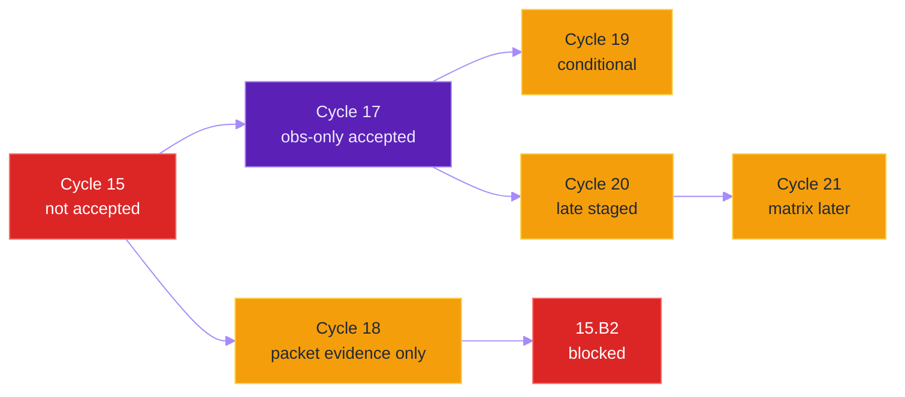

# Four-Agent Cycle Coordination Board

**Last updated:** 2026-06-05

**Status:** ACTIVE COORDINATION GUIDE. This document divides current cycle work
across four agent sessions. It does not accept, reject, skip, or complete any
optimization. Cycle decisions still require the production benchmark authority
defined in `.specify/memory/constitution.md` §12.5 and §12.6.

## Context

Final decision from the latest completed cycle:

| Cycle candidate | Decision | Evidence |
|---|---|---|
| Cycle 15.B1 context `32` | `NOT ACCEPTED` | `docs/cycle_15b1_two_shard_runtime_investigation.md` |
| Cycle 15.B1.C1 context `256` | `NOT ACCEPTED` | `docs/production_inference_benchmark.md` §39.10 |
| Cycle 15.B1.C2 majority vote | `NOT ACCEPTED` | `docs/production_inference_benchmark.md` §39.12 |
| Cycle 15.B2 four-shard runtime | `BLOCKED` | Two-shard identity correctness is not fixed. |

Cycle 17 Redis Streams progress sampling is closed for this coordination round:
Agent 18 completed the production benchmark and released the turn as
observability-only accepted. The Agent 20 Cycle 18 `one_to_one` override
candidate also completed and is not accepted. The follow-up Cycle 18 boundary
packet producer is production-validated as evidence-only and not
identity-merge-ready. Cycle 20 and Cycle 21 may proceed only as bounded
readiness/governance work unless their dependency gates are satisfied.

2026-06-05 queue update: the next latency cycle is **Cycle 18.C packet-budget
and association-readiness redesign**, not Cycle 20 or Cycle 21. The reason is
dependency-based: two-shard sharding produced the largest measured speed path,
but Cycle 18.B failed packet validity, merge readiness, and identity/model
agreement. The sorted queue is:

| Sort | Cycle | Coordination state |
|---:|---|---|
| 1 | Cycle 18.C packet-budget and association-readiness redesign | Take first; do not rerun the failed 18.B `appearance_packet` profile. |
| 2 | Cycle 15.B1 identity-fixed sharding rerun | Blocked until Cycle 18.C fixes packet validity and association readiness; 15.B2 remains blocked until B1 passes. |
| 3 | Cycle 20 streaming persistence/embedding overlap | Readiness only until sharding blocker is handled or metrics reorder it. |
| 4 | Cycle 21 Celery concurrency matrix | Governance only until independent work exists. |
| 5 | Cycle 11.B / 9b B.3 child-kernel tuning | Low-ceiling fallback. |
| 6 | Cycle 9b B.1 / 14.D compact postprocessing | Runtime/backend-blocked or low measured decode-cost. |
| 7 | Cycle 19 Redis scripts | Conditional on a new measured Redis hotspot. |
| 8 | Cycle 10 LPM redesign | Fusion-quality lane, not latency-first. |

## Source-of-Truth References

| Kind | Reference | Why it matters |
|---|---|---|
| Constitution | `.specify/memory/constitution.md` §7.1.1 | Precision metrics required for benchmark decisions. |
| Constitution | `.specify/memory/constitution.md` §8.1.1 | Worker/thread/concurrency changes require governed benchmarks. |
| Constitution | `.specify/memory/constitution.md` §8.6 | Streaming compatibility and live collapse-prevention rules. |
| Constitution | `.specify/memory/constitution.md` §12.5 / §12.6 | Production benchmark authority and decision table. |
| Guide | `AGENTS.md` | Operational constitution for agents in this repository. |
| Plan | `docs/inference_parallelization_plan.md` | Current sorted cycle roadmap. |
| Plan | `docs/cycle_9_and_10_improvements_todo.md` | Consolidated current-cycle status table. |
| Benchmark log | `docs/production_inference_benchmark.md` | Production benchmark history and acceptance evidence. |
| Cycle doc | `docs/cycle_17_redis_streams_progress_sampling_investigation.md` | Closed Cycle 17 source; accepted observability-only. |
| Turn ledger | `docs/agent_18_cycle_17_turn.md` | Current Cycle 17 ledger; turn is free after production benchmark release. |
| Prior turn ledger | `docs/agent_17_cycle_17_turn.md` | Historical Cycle 17 handoff; superseded by Agent 18 continuation. |
| Turn ledger | `docs/agent_19_cycle_18_turn.md` | Maps Agent 19 to the active Cycle 18.C packet-budget/readiness lane. |
| Turn ledger | `docs/agent_20_remaining_lanes_turn.md` | Maps Agent 20 to the remaining Agent C and Agent D lanes. |
| Turn ledger | `docs/agent_20_cycle_18_override_turn.md` | Maps the user-authorized Agent 20 Cycle 18 override, rejected one-to-one candidate, and evidence-only boundary packet producer. |

## Agent Lanes

| Agent | Lane | Status | Primary owned files | Must not do |
|---|---|---|---|---|
| Agent 18 | Cycle 17 Redis Streams | Free; accepted observability-only | `docs/agent_18_cycle_17_turn.md`, `docs/cycle_17_redis_streams_progress_sampling_investigation.md`, Cycle 17 scripts/tests and wrapper | Claim inference-wall gain or leave stream flag enabled outside governed benchmark evidence. |
| Agent 19 (Agent B) | Cycle 18.C packet-budget and association readiness | Benchmark lock held for replay `cycle18c-packet-budget-active-edge-20260605T162825Z`; no production decision | `docs/agent_19_cycle_18_turn.md`, `docs/cycle_18_redis_boundary_state_cache_investigation.md`, `backend/apps/video_analysis/services/offline_sharding.py`, `backend/tests/unit/video_analysis/test_cycle15b1_shard_merge.py` | Enable sharding by default, start 15.B2, rerun failed 18.B unchanged, or claim acceptance without §12.6 evidence. |
| Agent 20 override | Cycle 18 boundary state | Free; `one_to_one` not accepted; packet producer evidence-only; benchmark lock released | `docs/agent_20_cycle_18_override_turn.md`, `backend/apps/video_analysis/services/offline_sharding.py`, `backend/apps/video_analysis/tasks.py`, `backend/tests/unit/video_analysis/test_cycle15b1_shard_merge.py` | Rerun or enable `one_to_one`; claim sharding/15.B2 acceptance while packets are not identity-merge-ready. |
| Agent 20 (Agent C) | Cycle 20 stream post-stages | Turn taken; readiness only | `docs/agent_20_remaining_lanes_turn.md`, `docs/cycle_20_streaming_persistence_embedding_overlap_investigation.md` | Change lifecycle or persistence code before an implementation gate. |
| Agent 20 (Agent D) | Cycle 21 concurrency | Turn taken; governance only | `docs/agent_20_remaining_lanes_turn.md`, `docs/cycle_21_celery_concurrency_scaling_investigation.md` | Increase worker counts without a full benchmark matrix. |

Shared files are orchestrator-owned unless the orchestrator explicitly grants a
short edit window:

| Shared file | Rule |
|---|---|
| `AGENTS.md` | One orchestrator append after a cycle decision or coordination change. |
| `README.md` | One orchestrator reading-order update per new narrative doc. |
| `docs/INDEX.md` | One orchestrator index update per new narrative doc. |
| `docs/inference_parallelization_plan.md` | Orchestrator records accepted/rejected ordering changes. |
| `docs/production_inference_benchmark.md` | Only production benchmark owner appends completed evidence; orchestrator reconciles. |
| `docs/crop_frame_optimization_execution.md` | Orchestrator appends cross-cycle execution history. |
| `docs/cycle_9_and_10_improvements_todo.md` | Orchestrator updates sorted-cycle status. |

## Dependency Map



Read the diagram as a lock graph:

- Cycle 17 is closed for this coordination round and must not be rerun without a
  new governed user request.
- Cycle 18 rejected the one-to-one track-map override and validated packets as
  evidence-only; 15.B2 remains blocked until packets become identity-merge-ready
  and production evidence proves correctness.
- Cycle 20 and Cycle 21 are intentionally late unless metrics reorder them.

## Coordination Protocol

1. Every agent starts by reading `AGENTS.md`, `.specify/memory/constitution.md`,
   and its assigned cycle doc.
2. Every agent appends or proposes updates only inside its owned cycle doc.
3. Shared files are touched by one orchestrator after results are merged.
4. A production benchmark requires an exclusive benchmark lock.
5. No agent changes `backend/.env`, Celery topology, Triton configs, or
   production workers while another benchmark is running.
6. No agent marks a cycle `ACCEPTED`, `NOT ACCEPTED`, `REJECTED`, `SKIPPED`, or
   `COMPLETE` from probes, local tests, code existence, or intuition.
7. Every benchmark run uses the canonical production video:
   `/home/bamby/grad_project/Raw Data/Diverse Classroom Enviroments/combined.mp4`.

## Production Benchmark Lock

Before any production benchmark, the owning agent must record this block in its
cycle doc and in the working notes for the session:

```text
BENCHMARK_LOCK
agent:
cycle:
replay_key:
baseline_metrics:
candidate_env_delta:
started_at_utc:
expected_cleanup:
```

After the benchmark:

```text
BENCHMARK_RELEASE
agent:
cycle:
replay_key:
job_id:
status:
metrics_json:
metrics_md:
model_agreement_json:
model_agreement_md:
rollback_verified:
released_at_utc:
```

## Required Decision Table

Every cycle decision must include:

| Metric | Baseline | Candidate | Delta | Decision impact |
|---|---:|---:|---:|---|
| DB-completed FPS | required | required | required | Throughput gate |
| Total wall | required | required | required | SLA gate |
| Step 2 wall | required | required | required | Inference gate |
| Per-model RTT | required | required | required | Latency gate |
| GPU avg/peak | required | required | required | Utilization gate |
| DB rows | required | required | required | Correctness gate |
| StudentTracks | required | required | required | Identity gate |
| Model F1@IoU0.5 | required | required | required | Signal gate |
| Redis/DB counters | if touched | if touched | required | Side-effect gate |
| Rollback proof | required | required | required | Safety gate |
| Figure bundle + manifest | required | required | required | Evidence visualization gate |

## Four-Agent Work Split

### Agent 18: Cycle 17

Objective: preserve the completed Cycle 17 evidence and prevent accidental
reruns or throughput claims from an observability-only result.

Allowed next outputs:

- Handoff clarification if another agent misunderstands Cycle 17 status.
- No production rerun unless the user explicitly opens a new governed Cycle 17
  follow-up and a benchmark lock is recorded first.

Agent 18 charter:

| Topic | Decision |
|---|---|
| Current state | `FREE / ACCEPTED_OBSERVABILITY_ONLY_NOT_THROUGHPUT`; no benchmark lock held. |
| Scope | Disabled-by-default Redis Streams mirror for benchmark progress only. |
| Stream key | `bench:{replay_key}:events`. |
| Forbidden payloads | Detections, boxes, embeddings, model predictions, and terminal authority. |
| PostgreSQL authority | Terminal status and DB counters remain PostgreSQL-sourced. |
| Candidate flags | `BENCHMARK_REDIS_STREAM_EVENTS=0`, `BENCHMARK_REDIS_STREAM_MAXLEN=1000`, `BENCHMARK_REDIS_STREAM_TTL_SECONDS=86400`, `WATCH_REDIS_STREAM_EVENTS=0`, `WATCH_DB_FULL_POLL_EVERY_N=1`. |
| Owned runtime files | `backend/config/settings/base.py`, `backend/apps/video_analysis/tasks.py`, `tools/prod/prod_watch_benchmark_metrics.sh`, `tools/prod/prod_collect_benchmark_metrics.py`. |
| New wrapper | `tools/prod/prod_run_cycle17_redis_streams_benchmark.sh`. |
| Tests | `backend/tests/unit/video_analysis/test_redis_progress_stream.py`, updates to `backend/tests/unit/pipeline/test_prod_collect_benchmark_metrics.py`. |

Implementation boundaries:

- Emit progress samples from existing progress points only.
- Use cached Redis client, `XADD ... MAXLEN ~ N`, and `EXPIRE`.
- Redis write failure must increment evidence counters and never fail the job.
- The watcher may read stream samples, but final status and row counters still
  come from PostgreSQL.
- Collector output must include stream key, enabled flag, maxlen, TTL, `xlen`,
  memory if available, write/read/error counts, gaps, DB poll count, estimated
  DB polls avoided, and fallback count.

Agent 18 must not touch sharding boundary state, streaming persistence,
embedding overlap, terminal coordination, worker counts, pool type, prefetch, or
Celery topology. Agent 18 must not rerun Cycle 17 unless the user explicitly
opens a new governed benchmark.

## Agent Self-Update Prompts

Use these short prompts when resuming each lane. Each agent must update its own
ledger before work and must not broaden scope without a user-authorized
reassignment.

| Agent | Prompt |
|---|---|
| Agent 17 | "Read `AGENTS.md`, `docs/agent_17_cycle_17_turn.md`, and `docs/agent_18_cycle_17_turn.md`. Your Cycle 17 role is historical only; do not take Cycle 17, run benchmarks, or edit runtime files unless the user explicitly reassigns a new governed follow-up." |
| Agent 18 | "Read `AGENTS.md`, constitution §12.5/§12.6, `docs/four_agent_cycle_coordination_board.md`, `docs/agent_18_cycle_17_turn.md`, and `docs/cycle_17_redis_streams_progress_sampling_investigation.md`. Confirm Cycle 17 is `FREE / ACCEPTED_OBSERVABILITY_ONLY_NOT_THROUGHPUT`; do not rerun or claim throughput gain unless the user opens a new benchmark-locked follow-up." |
| Agent 19 | "Read `AGENTS.md`, constitution §8.6/§12.5/§12.6/§19, the coordination board, `docs/agent_19_cycle_18_turn.md`, and `docs/cycle_18_redis_boundary_state_cache_investigation.md`. Your lane is Cycle 18.C packet-budget/readiness redesign: default-off local packet/readiness code, focused tests, figure evidence plumbing, and docs are allowed. Runtime Redis writes, default-on sharding, 15.B2, and production benchmarks without a recorded lock are forbidden." |
| Agent 20 | "Read `AGENTS.md`, constitution §8.1.1/§8.6/§12.5/§12.6, the coordination board, `docs/agent_20_remaining_lanes_turn.md`, `docs/cycle_20_streaming_persistence_embedding_overlap_investigation.md`, and `docs/cycle_21_celery_concurrency_scaling_investigation.md`. Keep Cycle 20 readiness and Cycle 21 governance documentation-only; do not change lifecycle code, embeddings, workers, queues, env, or production state." |

### Agent 19 (Agent B): Cycle 18

Objective: recover value from failed sharding work without enabling sharding.

Allowed next outputs:

- Default-off local Cycle 18.C packet-budget and readiness code.
- Focused packet, association, and figure-generator tests.
- Cycle 18.C benchmark-lock preparation docs with no production mutation until
  a lock is recorded.

Agent 19 charter:

| Topic | Decision |
|---|---|
| Current state | `CYCLE_18C_STAGED_LOCAL_ONLY / NO_PRODUCTION_DECISION`. |
| Why still blocked | Cycle 18.B preserved speed but failed packet validity, merge readiness, StudentTrack parity, model agreement, and label-invariant identity. |
| Safe work | Default-off packet-budget/readiness redesign, focused tests, figure evidence plumbing, and docs. |
| Forbidden work | No runtime Redis boundary cache, no default-on sharding, no 15.B2, no production run without a benchmark lock. |
| Redis authority | Ephemeral coordination only; PostgreSQL remains final source of truth. |
| Coordination dependency | Reuse Cycle 17 Redis discipline but do not depend on Cycle 17 for identity authority. |
| Potential future flag | `OFFLINE_VIDEO_SHARD_BOUNDARY_REDIS_ENABLED=0`. |

Safe Phase A outputs:

- Bounded Redis snapshot schema for boundary diagnostics.
- First/last track observations, compact identity features, shard completion
  markers, diagnostics, TTL, max bytes, and schema version.
- Failure behavior for Redis unavailable, expired key, partial shard, stale
  schema, ambiguous identity, and duplicate shard completion.
- Audit of existing 15.B1 artifacts to identify missing identity-state fields.

Cycle 18.C cannot unblock sharding from local tests. Any runtime decision needs
a full production benchmark with packet validation, model agreement,
label-invariant identity, DB/GPU/RTT metrics, generated figures, and rollback.

### Agent C: Cycle 20

Objective: prepare the streaming persistence/embedding overlap architecture
without changing lifecycle code prematurely.

Allowed next outputs:

- Subcycle split for persistence stream, embedding stream, and terminal
  coordinator.
- Idempotency and rollback design.
- Metrics list for overlap proof.

Agent 20 / Agent C charter:

| Topic | Decision |
|---|---|
| Current state | `NO_DECISION_PRODUCTION_BENCHMARK_REQUIRED`; readiness-only. |
| Blocking dependency | Do not alter lifecycle or persistence code before an explicit implementation gate or metric reorder. |
| Persistence truth | PostgreSQL only; no SQLite fallback. |
| Current flow | DB rows are persisted after full in-memory `frame_detections`; embeddings start after follow-up handoff. |
| First implementation profile | Treat as `offline-only` unless explicitly redesigned for live. |
| Candidate rollback flag | `OFFLINE_STREAM_POST_STAGES=0`. |

Candidate subcycle split:

| Subcycle | Scope |
|---|---|
| 20.A | Measurement-only overlap timestamps and collector fields. |
| 20.B | Streaming persistence writer only; no embedding overlap. |
| 20.C | Embedding window worker after safe row watermark. |
| 20.D | Terminal coordinator waits for all required stages. |
| 20.E | Full production benchmark and rollback proof. |

Agent C must preserve bounded queues, no unbounded per-job buffers, no live
file-seek assumptions, no orphan embeddings, and terminal-state correctness.

### Agent D: Cycle 21

Objective: keep concurrency scaling honest.

Allowed next outputs:

- Worker topology matrix template.
- Duplicate-worker and resource-budget checks.
- Benchmark governance updates.
- No worker-count change without a production matrix.

Agent 20 / Agent D charter:

| Topic | Decision |
|---|---|
| Current state | Governance only. |
| Forbidden now | No `backend/.env` worker-count, pool, thread, GPU cap, prefetch, or `TRITON_OFFLINE_BATCH_QUEUE_MAX_CONCURRENCY` changes. |
| Concurrency authority | Constitution §8.1.1 plus §12.5/§12.6 production benchmark gate. |
| Current valid state | `NO_DECISION_PRODUCTION_BENCHMARK_REQUIRED`. |
| Comparator | Latest accepted non-sharded production profile in `docs/production_inference_benchmark.md`. |

Cycle 21 may define:

- Worker topology matrix.
- Duplicate-worker checks.
- Resource budgets for CPU, RSS, VRAM, DB connections, Redis wall, and queue
  backlog.
- Benchmark lock protocol and release criteria.
- Missing-metric handling: mark `unavailable` with reason, never zero.

Cycle 21 must reject any benchmark with duplicate workers, non-terminal jobs,
DB/Redis saturation, behavior RTT contention, correctness regression, or
rollback failure, even if FPS improves.

## Open Coordination Log

| Time UTC | Agent | Cycle | Event | Next action |
|---|---|---|---|---|
| 2026-06-04 | Orchestrator | 15 -> 17 | Cycle 15 sharding candidates closed as not accepted; Cycle 17 selected next. | Use this board as the lock contract, then start Cycle 17 Phase B. |
| 2026-06-04 | Agent 18 | 17 | User-authorized reassignment from Agent 17 recorded; Phase B local implementation turn taken. | Implement disabled-by-default Redis Streams progress mirror with PostgreSQL fallback and focused tests. |
| 2026-06-04 | Agent 18 | 17 | Local Phase B implementation and focused validation completed; turn released as `FREE`; benchmark lock not held. | Acquire benchmark lock before running `prod_run_cycle17_redis_streams_benchmark.sh` on production. |
| 2026-06-04 | Agent 17 | 17 | Historical Cycle 17 handoff kept for traceability; current Cycle 17 ownership is superseded by Agent 18. | Use `docs/agent_18_cycle_17_turn.md` for any new Cycle 17 claim. |
| 2026-06-04 | Agent 18 | 17 | Continuation validation completed; wrapper dry-run now reports `DRY_RUN_NO_BENCHMARK_RECORDED`; turn released as `FREE`; benchmark lock not held. | Acquire benchmark lock before any production run; no Cycle 17 decision before production evidence. |
| 2026-06-04 | Agent 18 | 17 | User requested the free lane be taken; Cycle 17 turn is `TAKEN`; benchmark lock not held. | Refresh local validation/dry-run, then acquire benchmark lock only for the production Linux RTX 5090 run. |
| 2026-06-04 | Agent 18 | 17 | Local validation refresh and wrapper dry-run passed; benchmark lock still not held. | Acquire benchmark lock only for the production Linux RTX 5090 run; no Cycle 17 decision before production evidence. |
| 2026-06-04 | Agent 18 | 17 | First start exited before env/job because stale baseline replay was absent; lock moved to replay `cycle17-redis-streams-20260604T025328Z` with production baseline `cycle15b-pre-shard-baseline-20260603T193531Z`. | Run wrapper on prod RTX 5090; release lock only after env cleanup and evidence capture. |
| 2026-06-04 | Agent 18 | 17 | Replay `cycle17-redis-streams-20260604T025328Z` completed; rollback verified; Cycle 17 accepted as observability-only; turn released as `FREE`. | Do not claim throughput improvement; next agent must open a new governed turn. |
| 2026-06-04 | Agent 19 | 18 | User-authorized Agent B mapping recorded; Phase A contract/evidence audit turn taken. | Audit failed boundary artifacts and strengthen the identity-state contract without runtime code. |
| 2026-06-04 | Agent 19 | 18 | First contract-only audit slice completed; no runtime or production state changed. | Review bounded packet V0, then prepare a read-only packet example and validator contract only. |
| 2026-06-04 | Agent 19 | 18 | Read-only V0 schema, synthetic unresolved example, validator, and focused tests completed; no runtime integration added. | Review V0, then project historical Cycle 15 evidence into the packet contract without writes. |
| 2026-06-04 | Agent 20 | 20/21 | User identified this session as the last agent; remaining Agent C and Agent D lanes claimed as readiness/governance only. | Keep Cycle 20 and Cycle 21 documentation aligned; do not change runtime code, env, workers, or production state. |
| 2026-06-04 | Agent 20 | 18 | User overrode Cycle 18; one-to-one boundary track-map candidate staged locally with no benchmark lock and no production decision. | Finish local validation, then acquire a benchmark lock before any production env change or wrapper run. |
| 2026-06-04 | Agent 20 | 18 | Replay `cycle18-one-to-one-trackmap-20260604T174231Z` completed; rollback verified; one-to-one candidate not accepted. | Do not rerun or enable `one_to_one`; packet producer follow-up is recorded in the next Agent 20 Cycle 18 row. |
| 2026-06-04 | Agent 20 | 18 | Replay `cycle18-boundary-packet-producer-20260604T181738Z` completed; rollback verified; `2/2` packets valid and `0/2` merge-ready. | Keep packet flag default-off; next Cycle 18 work needs appearance-backed association consumer evidence. |
| 2026-06-05 | Agent 19 | 18.C | Local packet-budget/readiness redesign staged; focused runtime and figure-generator tests passed; benchmark lock not held. | Run doc/workflow-equivalent gates, then only acquire a production benchmark lock if local and production checkout gates pass. |
| 2026-06-05 | Agent 19 | 18.C | Benchmark lock held for `cycle18c-packet-budget-active-edge-20260605T162825Z` after local gates and CI passed. | Deploy reviewed SHA, run the governed production benchmark, collect metrics/figures/rollback, then release the lock with a §12.6 decision or no-decision blocker table. |
