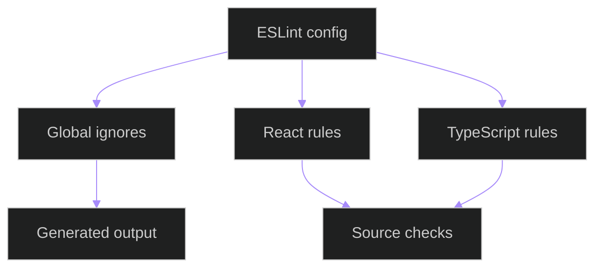

# Frontend ESLint Configuration

## Related Documents

- [frontend package](../../frontend/package.json)
- [frontend README](../../frontend/README.md)
- [frontend source docs](src/components/README.md)

## Purpose

This document mirrors `frontend/eslint.config.js`. The configuration defines the flat ESLint setup for TypeScript and React source files, plus global ignore patterns for generated build, coverage, Playwright, and dependency output.

## Configuration Flow

The diagram shows that the config first excludes generated output, then applies React and TypeScript rule sets to source files. The generated-output node includes `dist`, `build`, `coverage`, `node_modules`, `playwright-report`, and `test-results`, so linting stays focused on maintainable source files.

## Exports

- Default ESLint flat config array.
- Global ignore entries for generated artifacts.
- TypeScript, React Hooks, React Refresh, and JSX accessibility rule configuration.

## Notes

`test-results` is ignored because Playwright creates and removes it as a generated evidence directory. Treating that directory as lint input can make lint fail before source files are checked.
