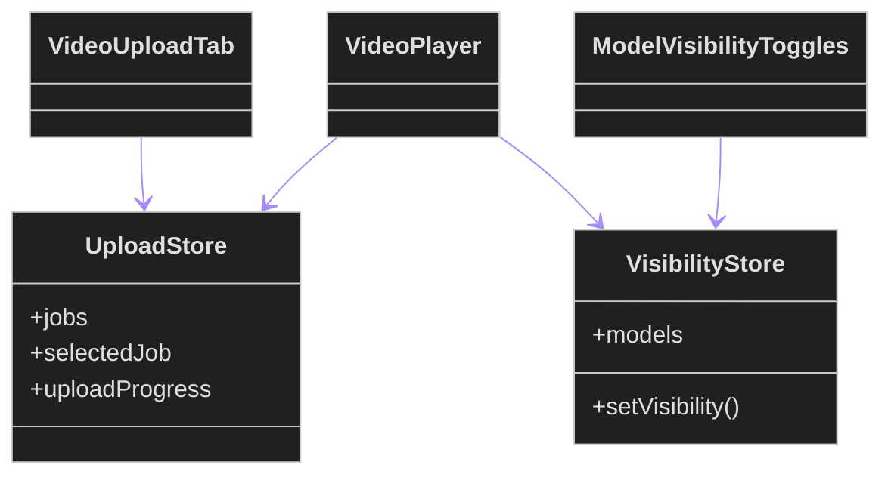

# Frontend Components

## Purpose

Documents the video upload and playback UI used by the feature.

## Components

| Component | Responsibility |
|---|---|
| `VideoUploadTab` | Upload form, validation messages, and job list. |
| `VideoPlayer` | Frame playback with overlay rendering and refresh on visibility changes. |
| `ModelVisibilityToggles` | Per-model show/hide controls for overlays. |
| `CameraFeed` | Live RTSP playback with synchronized canvas overlays from websocket packets. |
| `BoundingBoxCanvas` | Real-time detection renderer shared by camera feed cards. |

## Shared UI Library Coverage (FR-033)

| Shared UI component | Example usage |
|---|---|
| `Button` | `pages/CameraFeedPage.tsx`, `pages/ExamBoardPage.tsx`, `components/anomaly/TriageActions.tsx` |
| `Card` | `pages/CameraListPage.tsx`, `pages/DashboardPage.tsx`, `pages/RuntimePage.tsx` |
| `Modal` | `components/camera/AddCameraDialog.tsx`, `components/anomaly/TriageActions.tsx` |
| `StatusBadge` | `pages/SessionListPage.tsx`, `pages/ExamBoardPage.tsx`, `pages/AnomalyListPage.tsx` |
| `Toggle` | `components/ModelVisibilityToggles/ModelVisibilityToggles.tsx` |
| `FormInput` | `pages/LoginPage.tsx`, `pages/CameraListPage.tsx`, `pages/ChangePasswordPage.tsx` |
| `LoadingSpinner` | route guards and async page loaders across `src/pages/` |
| `ErrorBoundary` | page-level wrapper in `src/App.tsx` |

## State Stores

| Store | Responsibility |
|---|---|
| `uploadStore` | Upload/job progress state. |
| `visibilityStore` | Shared model visibility + tracking-ID state used by both uploaded playback and RTSP live feeds. |

## Walkthrough

The upload tab creates a job, the player shows frame output, and the toggle controls update visibility state that is applied on the next frame fetch.

## Related Documents

- [API README](../../../backend/api/README.md)
- [Video Analysis App](../../../backend/apps/video_analysis/README.md)
- [Root README](../../../../README.md)
