# frontend/src/pages/CameraFeedPage.tsx

## Related Documents

- [source](../../../../frontend/src/pages/CameraFeedPage.tsx)
- [system atlas](../../../diagrams/SYSTEM_MERMAID_ATLAS.md)
- [source mirror](../../../diagrams/SOURCE_FILE_MIRROR.md)

## Executive View

Live monitoring page that orchestrates session control, camera operations, delayed-live/degraded state rendering, overlay telemetry, and predictions/camera workspace presentation.

## Architectural Role

Route-level composition boundary for camera monitoring workflows, integrating API calls, stores, sockets, and UI panels.

## Reflected Surface

| Symbol | Kind | Reflection |
|------|------|------------|
| `CameraFeedPage` | Default Export Function | Main page entrypoint for live camera monitoring. |
| `clampPercent` | Internal Function | Normalizes metric sparkline values to `0..100`. |
| `toStateBadgeVariant` | Internal Function | Maps live session state to badge variant. |
| `toStateLabel` | Internal Function | Maps live session state to display label. |

## Architecture Diagram

```mermaid
flowchart TB
    subgraph Source["Current Module"]
        SRC["frontend/src/pages/CameraFeedPage.tsx"]
    end
    subgraph Dependencies["Project Dependencies"]
        I1["@/api/cameras"]
        I2["@/api/sessions"]
        I3["@/components/camera/AddCameraDialog"]
        I4["@/components/camera/CameraGrid"]
        I5["@/components/camera/CameraStatusBadge"]
        I6["@/components/camera/ClassFilterPanel"]
        I7["@/components/ModelVisibilityToggles/ModelVisibilityToggles"]
        I8["@/components/detection/PredictionsPanel"]
        I9["@/components/ui"]
        I10["@/hooks/useCameraStatus"]
        I11["@/hooks/useLiveSessionOverlay"]
        I12["@/hooks/useWebSocket"]
        I13["@/stores/cameraStore"]
        I14["@/stores/visibilityStore"]
    end
    subgraph Surface["Reflected Surface"]
        E1["CameraFeedPage"]
        E2["clampPercent"]
        E3["toStateBadgeVariant"]
        E4["toStateLabel"]
    end
    SRC --> I1
    SRC --> I2
    SRC --> I3
    SRC --> I4
    SRC --> I5
    SRC --> I6
    SRC --> I7
    SRC --> I8
    SRC --> I9
    SRC --> I10
    SRC --> I11
    SRC --> I12
    SRC --> I13
    SRC --> I14
    SRC --> E1
    SRC --> E2
    SRC --> E3
    SRC --> E4
```

## Detailed Reflection

This module coordinates live-session lifecycle (`startSession`, `endSession`), camera CRUD/connectivity actions, WebSocket prediction ingestion, and live overlay telemetry presentation through `useLiveSessionOverlay`.

The page derives operational live states (`pending`, `buffering`, `running`, `delayed`, `degraded`) from session presence, overlay socket status, frame progress, stream end/error signals, and a stall detector based on `lastFrameAt`.

It composes left-column control/telemetry panels and right-column camera workspace rendering, while preserving a single route boundary that owns monitoring UI flow and warning messaging.
