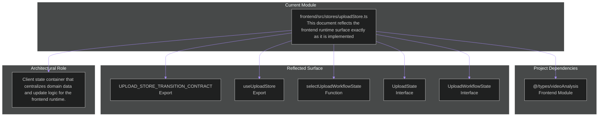

# frontend/src/stores/uploadStore.ts

## Related Documents

- [source](../../../../frontend/src/stores/uploadStore.ts)
- [system atlas](../../../diagrams/SYSTEM_MERMAID_ATLAS.md)
- [source mirror](../../../diagrams/SOURCE_FILE_MIRROR.md)

## Executive View

This document reflects the frontend runtime surface exactly as it is implemented in the current codebase.

## Architectural Role

Client state container that centralizes domain data and update logic for the frontend runtime.

## Reflected Surface

| Symbol | Kind | Reflection |
|------|------|------------|
| `UPLOAD_STORE_TRANSITION_CONTRACT` | Export | Reflected directly from the current top-level implementation surface. |
| `useUploadStore` | Export | Reflected directly from the current top-level implementation surface. |
| `selectUploadWorkflowState` | Function | Reflected directly from the current top-level implementation surface. |
| `UploadState` | Interface | Reflected directly from the current top-level implementation surface. |
| `UploadWorkflowState` | Interface | Reflected directly from the current top-level implementation surface. |

## Architecture Diagram

This diagram uses the same visual language as the root architecture view: one subgraph for the current module, one for concrete repository dependencies, one for the reflected implementation surface, and one for the architectural role that the file currently occupies.

## Detailed Reflection

This module sits at `frontend/src/stores/uploadStore.ts` and acts as a concrete implementation boundary inside the repository. Client state container that centralizes domain data and update logic for the frontend runtime.

From a dependency perspective, the file currently reaches into `@/types/videoAnalysis`. Those links were read from the real source file so the diagram reflects the actual local coupling rather than an inferred architecture.

From a surface perspective, the top-level implementation currently exposes or declares `UPLOAD_STORE_TRANSITION_CONTRACT`, `useUploadStore`, `selectUploadWorkflowState`, `UploadState`, `UploadWorkflowState`. That reflected surface is intentionally tied to the source file itself, so if the code changes the document should be regenerated with it.

From an accuracy perspective, this page focuses on project-local structure: repository imports, top-level classes/functions/constants, and the architectural role implied by the file location and concrete implementation type. External library imports are intentionally omitted from the diagram so the repository interaction map remains readable while staying faithful to the codebase.
