# frontend/tests/unit/components/camera/CameraFeedLiveState.test.tsx

## Related Documents

- [source](../../../../../../frontend/tests/unit/components/camera/CameraFeedLiveState.test.tsx)
- [system atlas](../../../../../diagrams/SYSTEM_MERMAID_ATLAS.md)
- [source mirror](../../../../../diagrams/SOURCE_FILE_MIRROR.md)

## Executive View

Unit test suite for CameraFeedPage live state transitions, validating `pending`, `buffering`, `running`, `delayed`, and `degraded` rendering and warning behavior.

## Architectural Role

Frontend behavioral contract test for route-level live monitoring state derivation.

## Reflected Surface

| Symbol | Kind | Reflection |
|------|------|------------|
| `file-scoped behavior` | Internal | The test file validates behavior through mocked dependencies and rendered state assertions. |

## Architecture Diagram

```mermaid
flowchart TB
    subgraph Source["Current Module"]
        SRC["frontend/tests/unit/components/camera/CameraFeedLiveState.test.tsx"]
    end
    subgraph Dependencies["Project Dependencies"]
        I1["@/pages/CameraFeedPage"]
        I2["@/api/cameras"]
        I3["@/api/sessions"]
        I4["@/stores/cameraStore"]
        I5["@/stores/visibilityStore"]
        I6["@/hooks/useCameraStatus"]
        I7["@/hooks/useWebSocket"]
        I8["@/hooks/useLiveSessionOverlay"]
        I9["@/components/camera/AddCameraDialog"]
        I10["@/components/camera/CameraGrid"]
        I11["@/components/camera/CameraStatusBadge"]
        I12["@/components/camera/ClassFilterPanel"]
        I13["@/components/ModelVisibilityToggles/ModelVisibilityToggles"]
        I14["@/components/detection/PredictionsPanel"]
    end
    SRC --> I1
    SRC --> I2
    SRC --> I3
    SRC --> I4
    SRC --> I5
    SRC --> I6
    SRC --> I7
    SRC --> I8
    SRC --> I9
    SRC --> I10
    SRC --> I11
    SRC --> I12
    SRC --> I13
    SRC --> I14
```

## Detailed Reflection

The suite isolates page state logic by mocking API/store/hooks and asserting visible badges/messages for each operational state. It includes a stall simulation using `Date.now()` to verify delayed-live transitions, and error-path assertions to ensure degraded-state warnings are surfaced.
