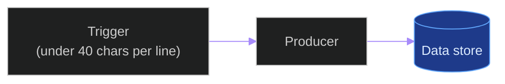
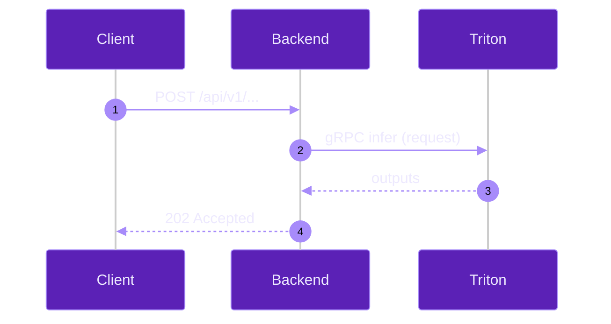
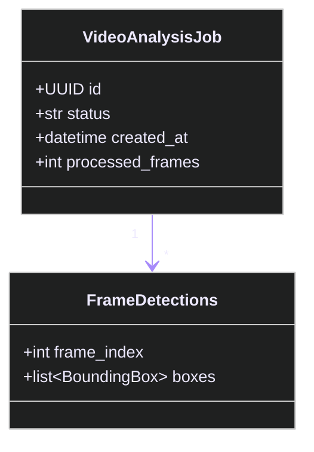
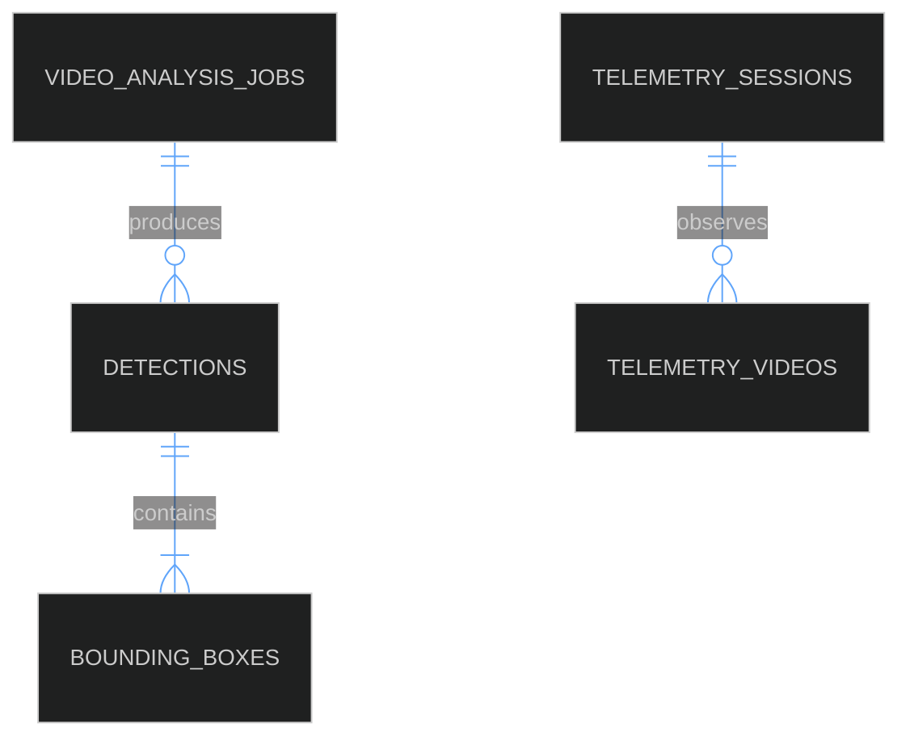
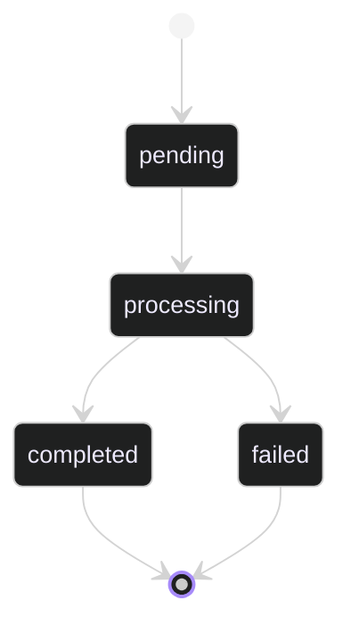
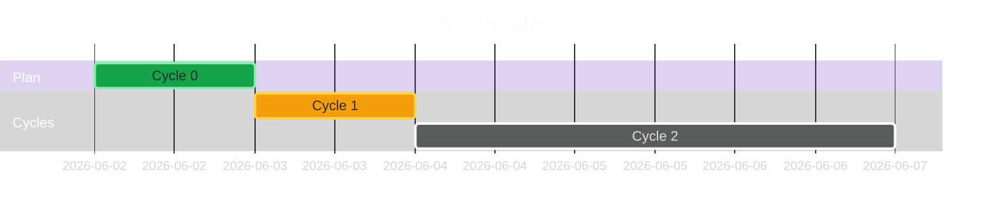
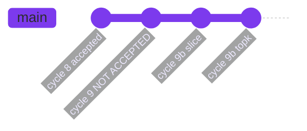
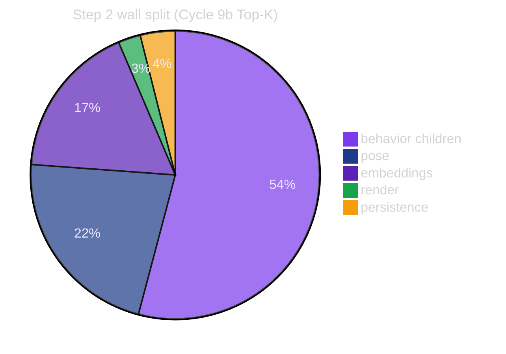

# Mermaid Theme Contract

**Last updated:** 2026-06-02

**Status:** **BINDING (constitution Section 19.3 + 19.4).** Every new
Mermaid diagram authored under this contract MUST declare the matching
theme initializer for its diagram type. The same diagram type renders
identically across every doc. Pre-existing diagrams added before this
contract may keep their themes, but any *new* version of an existing
diagram (per § 19.5 preservation rule) MUST use the contract.

## 0. Why this contract exists

Three problems this contract solves:

1. **Visual drift.** README and `docs/inference_parallelization_plan.md`
   already use one palette (purple + blue, dark theme); other docs use
   ad-hoc colours that confuse readers.
2. **Label overflow.** Mermaid does not auto-wrap long node labels; if a
   label exceeds the box width the text spills outside the box. The
   constitution mandates that text fit inside its box.
3. **Type mismatch.** Different diagram *types* (flowchart vs sequence
   vs class vs ERD) have different colour needs. The contract pins one
   theme per type so a reader's eye can flow without recalibration.

## 1. Master palette

| Token | Hex | Role |
|---|---|---|
| `--ink-primary` | `#7C3AED` | Primary node fill (active components, current runtime) |
| `--ink-line` | `#A78BFA` | Primary edge / arrow colour |
| `--ink-store` | `#1E3A8A` | Data-store fill (PostgreSQL / Redis / filesystem) |
| `--ink-store-line` | `#60A5FA` | Data-store edge colour |
| `--ink-prod` | `#5B21B6` | "Production path" highlight fill (the *currently active* route) |
| `--ink-text` | `#EDE9FE` | High-contrast label text on dark fills |
| `--ink-warn` | `#F59E0B` | Warning / caveat node fill |
| `--ink-fail` | `#DC2626` | Failure / NOT-ACCEPTED node fill |
| `--ink-ok` | `#16A34A` | Success / ACCEPTED node fill |
| `--ink-bg` | `#0F172A` | Background base (handled by `theme: dark`) |

The palette is intentionally small. Any new colour MUST be added to
this table in the same commit that uses it.

## 2. Diagram type registry

Each row pins one canonical theme initializer block. Copy-paste the
initializer verbatim at the top of every Mermaid block of the matching
type.

### 2.1 Flowchart (system architecture, call graphs, pipelines)



**Required class definitions** for flowcharts (paste into every
flowchart block):

```text
classDef prod fill:#5B21B6,stroke:#A78BFA,color:#EDE9FE;
classDef store fill:#1E3A8A,stroke:#60A5FA,color:#DBEAFE;
classDef warn fill:#F59E0B,stroke:#FCD34D,color:#1F2937;
classDef fail fill:#DC2626,stroke:#F87171,color:#FFFFFF;
classDef ok fill:#16A34A,stroke:#86EFAC,color:#053B17;
```

### 2.2 Sequence diagrams (per-call interaction)



### 2.3 Class / data model



### 2.4 ER diagram



### 2.5 State diagram (job lifecycle, cycle status)



### 2.6 Gantt (cycle schedule)



### 2.7 Git graph (branch history)



### 2.8 Pie (composition summary)



## 3. Node-label rules (text-fitting, MANDATORY)

1. **Hard cap: 40 characters per logical line.**
2. Long labels MUST break with `<br/>` (HTML) or `\n` (literal backslash-n);
   both render as a line break inside the node.
3. **Forbidden patterns** (the CI gate fails on these):
   - A node label whose flat character count > 40 AND contains neither
     `<br/>` nor `\n`.
   - A label that includes an unbroken URL longer than 40 characters
     (use a footnote reference instead).
   - A label that uses backticks for code spans (Mermaid doesn't render
     them inside nodes; use plain text or an external code block).
4. **Recommended patterns**:
   - First line: subject (≤ 25 chars).
   - Second line: qualifier (≤ 25 chars).
   - Third line: count or size (≤ 15 chars).

Example (good):

```text
A["FrameReadPipeline<br/>(disk read + cv2 decode)<br/>~4 frames in flight"]
```

Example (bad — overflows):

```text
A["FrameReadPipeline reads video frames from disk via cv2.VideoCapture and decodes them on a background thread"]
```

## 4. Style classes (cross-diagram visual semantics)

Use these `classDef` names consistently:

| Class | Meaning | Apply to |
|---|---|---|
| `prod` | Currently active production runtime path | Active inference route, current ensemble |
| `store` | Persistent data store | PostgreSQL, Redis, filesystem |
| `warn` | Accepted-with-caveat or transitional | Cycle 9b B.2.c Top-K, Phase-out paths |
| `fail` | NOT ACCEPTED or rejected | Cycle 9, Cycle 10 LPM Phase 1, Cycle 11.A |
| `ok` | ACCEPTED and on the SLA path | Cycles 1-8, Cycle 9b B.2.b/c |

Apply via `class NodeId class1,class2;` at the bottom of the diagram.

## 5. Preservation rule (§ 19.5 mirror)

When a diagram is updated, the old version stays. Pattern:

```markdown
## <Feature> diagram — v2026-06-02 (current)

```mermaid
... new diagram with the current implementation ...
```

## <Feature> diagram — v2026-05-21 (historical)

> This diagram described the pre-Top-K ensemble topology. Preserved for
> the maturity arc per constitution § 19.5.

```mermaid
... old diagram untouched ...
```
```

The CI gate verifies (via `git log` on each `.md`) that no mermaid block
was *removed* without a sibling addition in the same commit.

## 6. How the CI gate checks compliance

The DSP Cycle 8 gate (added later) runs the following on every project
markdown file:

1. **Theme initializer present.** Every triple-backtick `mermaid` block
   MUST start with a `%%{init:` line. Regex:
   `^```mermaid\n%%\{init:\s*\{` (case-sensitive).
2. **Diagram type recognised.** The block's first non-init line MUST
   start with one of: `flowchart`, `sequenceDiagram`, `classDiagram`,
   `erDiagram`, `stateDiagram`, `gantt`, `gitGraph`, `pie`,
   `journey`, `mindmap`, `quadrantChart`, `timeline`,
   `requirementDiagram`, `c4Context`, `xychart-beta`.
3. **Label length.** Any quoted label inside `[ ]`, `( )`, `(( ))`, `[/ /]`,
   `[\ \]` MUST split if longer than 40 chars (`<br/>` or `\n`).
4. **No deleted diagrams.** `git log --follow <file>` checked against
   `git diff HEAD~..HEAD` — any net-removed mermaid block must coexist
   with a net-added one labelled `historical`.

## 7. Migration plan for existing diagrams

Existing diagrams that pre-date this contract:
- May keep their themes (grandfathered).
- MUST be migrated when the surrounding doc is touched for any other
  reason (drift, rewrite, update).
- MUST be re-rendered to the contract immediately if they violate the
  text-fitting rule (§ 3).

The DSP Cycle 8 gate runs in "warn" mode for grandfathered diagrams
and in "fail" mode for any diagram added or modified after this commit.

## 8. Examples (the same data, all 8 diagram types)

To validate the theme contract, every diagram type appears at least once
in this very doc. A new diagram type added later MUST also be added here
as an example block before its first use elsewhere.

## 9. References

- [`docs/documentation_systematization_plan.md`](documentation_systematization_plan.md) § 3.3, 3.4, 3.5
- [`.specify/memory/constitution.md`](../.specify/memory/constitution.md) Section 19.3, 19.4, 19.5
- Mermaid documentation: <https://mermaid.js.org/config/theming.html>
