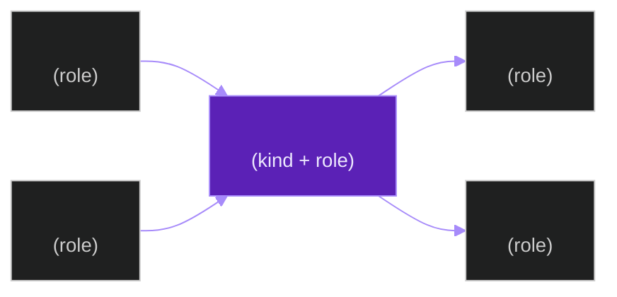
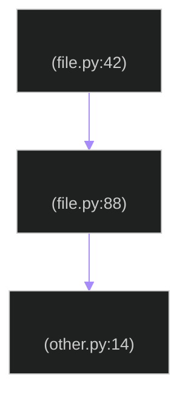
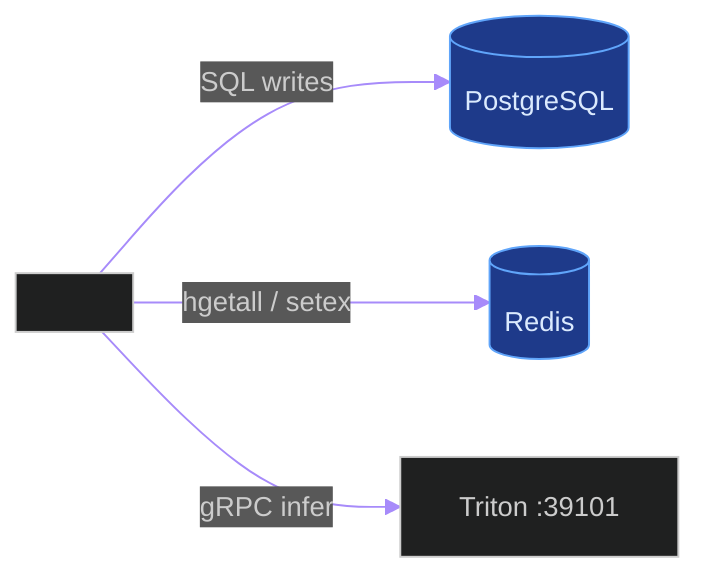
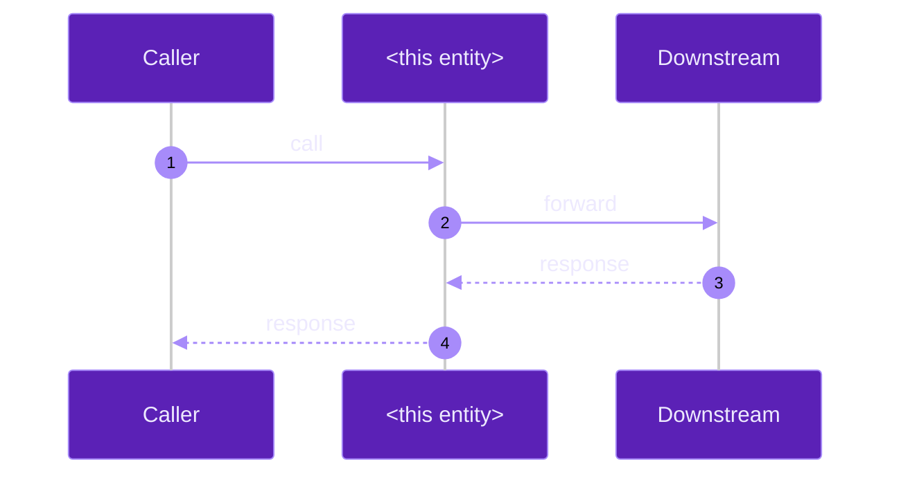

# Per-Entity Documentation Template

**Last updated:** 2026-06-02

**Status:** **BINDING (constitution Section 19.2 + 19.6).** Every entity
doc created by DSP Cycles 2-7 MUST follow the structure below. Sections
marked **REQUIRED** are CI-enforced. Sections marked *Optional* may be
omitted when the entity genuinely has no content for that section, in
which case the section heading is replaced by a one-line note
`> Not applicable: <reason>`.

## How to use this template

1. Copy this file to the right path under `docs/entity/` per
   [`docs/documentation_systematization_plan.md`](documentation_systematization_plan.md) § 2.
2. Replace every `<placeholder>` with the real value.
3. Remove this how-to-use block from the copy.
4. Add the file to `git`, run
   `python scripts/ci/verify_doc_dates_and_reading_order.py` (the
   inventory side) and the DSP Cycle 8 gate (the coverage + theme side)
   to confirm it passes.

---

# `<entity-identifier>`

**Last updated:** YYYY-MM-DD
**Entity kind:** `system` | `module` | `cycle` | `script` | `code` | `api`
**Status:** `active` | `superseded` | `deprecated` | `rejected` | `planned`

> One-sentence summary. What this entity is, in plain English, in under
> 200 characters.

## Source-of-truth references  *(REQUIRED, parsed by CI)*

| Kind | Reference |
|---|---|
| File | `<path-from-repo-root>` |
| File | `<path-from-repo-root>` |
| Symbol | `<dotted.path.to.symbol>` |
| Commit | `<git-short-sha>` |
| Job | `<production-job-uuid>` |
| Workflow | `.github/workflows/<file>.yml` |
| Doc | `<path-to-related-doc>` |

> Every claim in this entity doc must be backed by at least one row
> above. If a claim has no real reference, delete the claim — do
> not invent one. (Constitution § 19.6.)

## 1. Purpose and scope  *(REQUIRED)*

Two to five sentences. Cover:
- What this entity does for the system.
- What this entity does NOT do (explicit out-of-scope items).
- Who the consumers / callers are at a high level.

## 2. Position in the system  *(REQUIRED)*

A single Mermaid flowchart (using the
[theme contract](../mermaid_theme_contract.md) § 2.1) showing the entity
in its immediate neighbourhood: callers on the left, the entity in the
centre, callees on the right.

## 3. Internal structure  *(REQUIRED — content depends on kind)*

### For `system`
List the immediate child modules. Cite the directories under
`backend/apps/`, `frontend/src/`, or wherever they live.

### For `module`
List the files in the module (`git ls-files <module-path>`), grouped by
role: models, services, views, tasks, tests, fixtures. Cite each.

### For `cycle`
List the phases (Phase 1 investigation, Phase 2 implementation, Phase 3
prod bench, Phase 4 ACCEPT/REJECT). Cite the matching investigation /
results docs.

### For `script`
List the script's argparse / getopts flags, environment variables
read, files touched (with `--dry-run` evidence if a destructive
script), exit codes.

### For `code`
List the public symbols (functions, classes, constants) with one-line
descriptions. Cite the `<file>:<line>` for each.

### For `api`
List the request schema, response schema, error codes, content type,
and any authentication requirement.

## 4. Call graph  *(REQUIRED — internal calls + intra-entity calls)*

Mermaid flowchart showing the internal call graph of this entity.
For a `module`, this is the cross-file call graph inside the module.
For a `code` unit, this is the function-to-function graph.

## 5. External connections  *(REQUIRED — interconnections)*

Mermaid flowchart of every external system this entity talks to:
PostgreSQL, Redis, Triton, go2rtc, filesystem, network APIs.

## 6. API surface (external calls into this entity)  *(REQUIRED for `api`/`code`/`module`; Optional for others)*

If this entity exposes an interface, document it. Otherwise replace
with `> Not applicable: <reason>`.

| Interface | Schema | Caller |
|---|---|---|
| `POST /api/v1/<path>/` | `<dataclass / serializer>` | `frontend/<file>` |
| Function `<sym>(arg1, arg2) -> Ret` | `<file>:<line>` | `<list of callers>` |
| Celery task `<task_name>` | `<args / kwargs>` | `<dispatcher>` |
| Triton model route `<route_key>` | `<input/output dims>` | `<caller>` |

## 7. Dependencies  *(REQUIRED)*

| Dependency | Reason | Pinned version (if external) |
|---|---|---|
| `<module>` | `<why>` | `<version>` |

For systems / modules: list internal cross-module imports too, citing
`from apps.X import Y` lines.

## 8. Environment variables read  *(REQUIRED)*

| Variable | Default | Required? | Effect |
|---|---|---|---|
| `<VAR>` | `<default>` | yes / no | `<one-line effect>` |

Cite the file/line where the variable is read.

## 9. Sequence diagram (dominant interaction)  *(REQUIRED for `code` / `api`; Optional otherwise)*

Mermaid sequence diagram (theme contract § 2.2) showing the
end-to-end interaction for the most common request / call path.

## 10. State machine  *(Optional)*

For entities with a clear lifecycle, include a state diagram. Theme
contract § 2.5.

## 11. Failure modes  *(REQUIRED)*

| Failure | Detection | Recovery |
|---|---|---|
| `<failure>` | `<how it's detected>` | `<how it's recovered>` |

Cite the matching test or log line for each.

## 12. Performance characteristics  *(Optional)*

| Metric | Value | Source |
|---|---|---|
| Latency p50 | `<ms>` | `<bench summary path>` |
| Latency p95 | `<ms>` | `<bench summary path>` |
| Throughput | `<n/sec>` | `<bench summary path>` |
| Memory peak | `<MiB>` | `<RSS log path>` |

Numbers MUST come from a real evidence file. "Around X" without a
citation is forbidden by constitution § 19.6.

## 13. Operational notes  *(Optional)*

Knobs operators turn, dashboards to watch, alerts that point at this
entity. Cite real env file lines or alert config files.

## 14. Historical diagrams  *(REQUIRED if any diagram in this doc was
ever updated)*

Per constitution § 19.5, when a diagram is updated the previous version
is preserved here as `<feature> diagram — vYYYY-MM-DD (historical)`,
with a one-paragraph note explaining what changed.

If no diagram in this doc has been updated yet, replace this section
with `> Not applicable: no diagrams have been superseded yet.`

## 15. Related entities  *(REQUIRED)*

| Entity | Path | Relationship |
|---|---|---|
| `<other entity>` | `docs/entity/<kind>/<name>.md` | "parent module of", "called by", "depends on", "supersedes" |

## 16. Open questions  *(Optional)*

Bullet list of unresolved questions about this entity. Each MUST have
an owner and a target close date.

## 17. Change log  *(REQUIRED)*

| Date | What changed | Commit |
|---|---|---|
| YYYY-MM-DD | First version landed under DSP Cycle N | `<sha>` |

The change log is append-only. Old rows are never removed.

---

## Appendix A — Per-kind requirement matrix

| Section | system | module | cycle | script | code | api |
|---|:--:|:--:|:--:|:--:|:--:|:--:|
| 1 Purpose | R | R | R | R | R | R |
| 2 Position | R | R | R | R | R | R |
| 3 Internal | R | R | R | R | R | R |
| 4 Call graph | R | R | R | R | R | R |
| 5 External | R | R | R | R | R | R |
| 6 API surface | O | R | O | R | R | R |
| 7 Dependencies | R | R | R | R | R | R |
| 8 Env vars | R | R | R | R | R | R |
| 9 Sequence | O | O | O | O | R | R |
| 10 State | O | O | R | O | O | O |
| 11 Failure modes | R | R | R | R | R | R |
| 12 Performance | O | O | R | O | O | O |
| 13 Operational | O | O | O | R | O | R |
| 14 Historical | C | C | C | C | C | C |
| 15 Related | R | R | R | R | R | R |
| 16 Open Qs | O | O | O | O | O | O |
| 17 Change log | R | R | R | R | R | R |

Legend: R = Required, O = Optional, C = Conditionally required (only
when a diagram has been superseded).

## Appendix B — Required CI checks

The DSP Cycle 8 gate enforces, per entity doc:

1. Source-of-truth block exists AND every row resolves.
2. Position diagram exists AND uses the theme contract.
3. Call-graph diagram exists AND uses the theme contract.
4. External-connections diagram exists AND uses the theme contract.
5. Every Mermaid block declares its theme initializer.
6. No node label exceeds 40 chars without a ` ` / `\n` break.
7. Failure-modes table has at least 1 row.
8. Change log has at least 1 row.

A doc that fails any of these is rejected at review.
