# Production Inference Benchmark & Issue Log

**Last updated:** 2026-06-06

**Environment:** Linux, no Docker, no sudo — NVIDIA RTX 5090 (32 GB GDDR7, sm_120 Blackwell)  
**Recorded:** 2026-05-30  
**Branch:** master @ `dcefea9`  
**TRT:** 10.16.1.11 | **CUDA:** 12.8 | **Triton:** 2.55.0 | **Python:** 3.12 (backend venv)

---

## 0. Precision Measurement Contract

Every optimization benchmark recorded after 2026-06-03 must include precise
measurements, not only a final FPS number. The live watcher
`tools/prod/prod_watch_benchmark_metrics.sh` and final collector
`tools/prod/prod_collect_benchmark_metrics.py` are the current measurement
surfaces.

Required decision evidence includes:

| Family | Required values |
|---|---|
| FPS / throughput | live window FPS, cumulative processing FPS, DB-completed FPS, per-stage FPS equivalent, row throughput for frames/detections/boxes/embeddings |
| Latency | mean/p50/p95/p99/max model RTT, Step 2 frame wall, Step 2 through-pose wall, pose tail, persistence/render, embedding/finalization |
| Per model | model name, call count, calls/sec, input shape, status counts, RTT percentiles |
| Per phase | decode, crop, preprocess, queue/dispatch, inference, postprocess, persistence, render, embedding, DB flush, Redis flush, artifact write |
| Resources | live GPU, benchmark GPU avg/peak, VRAM, power, worker RSS, available CPU/process contention metrics |
| Correctness | DB parity, detection/box/embedding/track counts, model agreement, missing-frame counts, stage error ratios |
| Evidence | replay key, job ID, deployed SHA, exact video, env/config delta, JSON/CSV/log paths and unavailable metric reasons |

Missing metrics must be written as unavailable with a reason; they must not be
treated as measured zero. A cycle decision is incomplete when the precision
breakdown needed to explain the result is absent.

---

## 1. Hardware & Stack

| Item | Value |
|------|-------|
| GPU | NVIDIA GeForce RTX 5090, sm_120 (Blackwell) |
| VRAM | 32 607 MiB total / 21 389 MiB used at idle (engines loaded) |
| CPU | 32 cores |
| CUDA | 12.8 |
| TensorRT | 10.16.1.11 (backend/.venv python3.12) |
| Triton | 2.55.0 (offline mode, port 39100) |
| PyTorch | 2.7.1+cu128 |
| ultralytics | 8.4.56 |

---

## 2. TRT Engine Inventory

Rebuilt 2026-05-30T13:26:18 UTC with TRT 10.16.1.11 / CUDA 12.8.  
All engines use FP16, workspace 6 144 MiB, optimization profile batch [1 … 8 … 32].

| Triton Model | Source ONNX / PT | Plan Size | Batch Profile | Input Shape |
|---|---|---|---|---|
| `person_detector` | `student_teacher.pt` → ONNX (dynamic-patched) | 42 MB | [1, 8, 32] | [N, 3, 640, 640] |
| `posture_model` | `standing_sitting.pt` | 54 MB | [1, 8, 32] | [N, 3, 640, 640] |
| `gaze_horizontal_model` | `right_left.pt` | 54 MB | [1, 8, 32] | [N, 3, 640, 640] |
| `gaze_vertical_model` | `up_down.pt` | 54 MB | [1, 8, 32] | [N, 3, 640, 640] |
| `gaze_depth_model` | `forward_backward.pt` | 54 MB | [1, 8, 32] | [N, 3, 640, 640] |
| `rtmpose_model` | `rtmpose-m.onnx` | 28 MB | [1, 8, 32] | [N, 3, 256, 192] |

Manifest: `backend/models/tensorrt_builds/latest_compat.json`

---

## 3. Latency Measurements

### 3.1 Shadow-Probe Latency (first inference per job, single frame, near-cold GPU)

Measured via `inference_audit.json` — includes Triton HTTP round-trip, engine warm-up for the first batch, and result deserialization.

| Model | Latency (ms) | Notes |
|---|---|---|
| `person_detector` | 601.1 | First call after engine load |
| `posture_model` | 625.1 | First call after engine load |
| `gaze_horizontal_model` | 803.9 | Highest cold latency observed |
| `gaze_vertical_model` | 613.5 | First call after engine load |
| `gaze_depth_model` | — | Not captured in shadow probe (version routing error in first run; fixed) |
| `rtmpose_model` | — | Not included in shadow probe |

### 3.2 Steady-State HTTP Round-Trip (dispatch → 200 OK)

Measured from Celery log timestamps: time between `InferenceOrchestrator: dispatching` and the corresponding `HTTP/1.1 200 OK` response. Batch size 1–4 frames per call (offline pipeline).

| Model | n | min (ms) | avg (ms) | p95 (ms) | max (ms) |
|---|---|---|---|---|---|
| `person_detector` | 14 | 476 | 856 | 1 166 | 1 166 |
| `posture_model` | 16 | 476 | 882 | 1 308 | 1 308 |
| `gaze_horizontal_model` | 14 | 667 | 1 119 | 1 620 | 1 620 |
| `gaze_vertical_model` | 14 | 404 | 924 | 1 323 | 1 323 |
| `gaze_depth_model` | 16 | 381 | 1 637 | 5 655 | 5 655 |
| `rtmpose_model` | — | — | — | — | — |

> **Context:** These RTTs include CPU pre-processing time + HTTP serialization overhead + actual GPU inference + response deserialization. Actual Triton inference on RTX 5090 for these models is estimated <5 ms per batch; the remaining time is pipeline/HTTP overhead.

### 3.3 GPU Telemetry During Full Video Run

Video: `Raw Data/Diverse Classroom Enviroments/combined.mp4` — 4 541 frames, 35 MB  
Sample interval: 2 s | 179 samples captured during active processing

| Metric | Value |
|---|---|
| Average GPU utilisation | 1.2 % |
| Peak GPU utilisation | 12 % |
| VRAM used (stable) | 21 389 MiB |
| GPU temperature | 36 °C |
| Average board power | 60.1 W (idle-like; RTX 5090 TDP = 575 W) |

**Conclusion:** The RTX 5090 is essentially idle. The pipeline is CPU-bound due to the architecture described in §4 below.

---

## 4. Issues Encountered & Fixes Applied

### Issue 6 — Video Jobs Stall After First Batch; Celery Beat Not Running

**Symptom:**
```
CommandError: Timed out waiting for job <id>; current status=processing.
```
DB shows `processed_frames=173/4541`, `status=processing`, last update stale for 15+ minutes.  
`pgrep -fa "celery.*beat"` → nothing.

**Root cause (two independent failures):**

1. **Celery beat not started.** The stale-job reconciler (`reconcile_stale_jobs_periodic`) is a Celery Beat periodic task. Without Beat running, stuck jobs remain in `processing` state indefinitely and are never reconciled to `failed`. The `prod_start_celery_workers.sh` script only starts worker processes, not the scheduler.

2. **Celery soft-time-limit (300 s) kills the video task mid-run.** The offline pipeline submits one batch window (~173 frames) to Triton, processes responses, then continues. The total task execution time exceeds the 300 s `--soft-time-limit`. When the task is killed, the remaining ~4 368 frames are never re-queued, leaving the job stuck in `processing`.

**Observable evidence:**
- Last inference log entry: `2026-05-30 13:46:58` — inference stopped cold mid-job
- Only 10 Celery task completions recorded in the offline_control log since last restart
- Job `542533c3` still `processing` at `173/4541` frames, stale 926 s

**Fix — Celery beat (APPLIED):**
Beat now starts and stops as part of every worker set. `prod_start_celery_workers.sh`
calls `prod_start_celery_beat.sh` at the end (unless `CELERY_BEAT_DISABLED=1`), and
`prod_stop_celery_workers.sh` calls `prod_stop_celery_beat.sh`. Both beat scripts are
idempotent and refuse to launch a second scheduler. Manual control:
```bash
bash tools/prod/prod_start_celery_beat.sh   # idempotent single scheduler
bash tools/prod/prod_stop_celery_beat.sh    # graceful stop + pkill safety net
```

**Fix — soft-time-limit for long videos (APPLIED):**
The `process_video_upload` task default soft/hard limits were raised from 600/660 s to
**1800/1920 s** in `backend/config/settings/base.py` (env-overridable via
`VIDEO_UPLOAD_TASK_SOFT_TIME_LIMIT_SECONDS` / `VIDEO_UPLOAD_TASK_TIME_LIMIT_SECONDS`,
already `1800/1860` in `.env.example`). The worker-level fallback in
`prod_start_celery_workers.sh` was raised from `300/600` to `1800/2400`. A 4 541-frame
video (~19 min over the sequential HTTP pipeline) now completes within the soft limit.
The continuation/chunking re-architecture remains a future optimisation but is no longer
required for end-to-end completion.

**Status:** **RESOLVED 2026-05-30.** Both blockers fixed in code/config. Run the
automated benchmark with `bash tools/prod/prod_run_benchmark.sh` (see §8).

### Issue 1 — TRT Serialization Version Mismatch (tag 239 → 240)

**Symptom:**
```
Serialization assertion stdVersionRead == kSERIALIZATION_VERSION failed.
Version tag does not match. Current: 240, Serialized Engine: 239
```

**Root cause:** TRT was upgraded from 10.8.0.43 (serial tag 239) to 10.16.1.11 (serial tag 240) via `uv sync` / `prod_post_sync.sh`, but existing `.plan` engine files had been compiled under 10.8.0.43.

**Fix:** Full engine rebuild with `bash tools/prod/prod-rebuild-tensorrt-engines.sh`.

**Guard:** `tools/prod/prod_trt_guard.sh` now blocks `prod_start_triton.sh` if installed TRT version does not match `backend/models/tensorrt_builds/latest_compat.json`.  
`prod_post_sync.sh` warns with a banner if engines need a rebuild after any `uv sync`.

---

### Issue 2 — Static Batch Dimension in ONNX (ultralytics export)

**Symptom:**
```
Input tensor images has static dimensions that don't match kMIN dimensions in profile 0.
Input dimensions are [8,3,640,640] but profile dimensions are [1,3,640,640].
```

**Root cause (attempt 1 — failed):** `_make_batch_dynamic()` only patched the ONNX input *type annotation* (`.dim_param = "batch"`). Internal `Reshape` constant nodes retained the hardcoded batch value `8`, and TRT locked the profile to `[8,8,8]`.

**Root cause (confirmed):** YOLO models exported by ultralytics contain post-processing `Reshape` nodes whose *constant shape tensor* has `[8, -1, classes]` baked in. Patching the type annotation does not change those constants; TRT uses the constants to determine profile limits.

**Fix:** Two-phase export in `backend/scripts/build_tensorrt_engines.py`:
1. `ultralytics YOLO.export(format="onnx", dynamic=True, opset=17)` — marks input annotation dynamic.
2. `_patch_onnx_dynamic_batch(onnx_path, static_batch)` — scans every initializer used as a shape input to `Reshape`/`Expand` nodes and replaces `arr[0] == static_batch` with `-1`. Runs `onnx.shape_inference` to propagate the new dynamic shapes.

Re-export from `.pt` is always preferred over patching a stale ONNX.

**Affected model:** `person_detector` (`student_teacher.pt`). Other YOLO models (`standing_sitting`, `right_left`, `up_down`, `forward_backward`) exported cleanly with `dynamic=True`.

---

### Issue 3 — Duplicate Celery Workers Causing Queue Contention

**Symptom:** `pgrep -fc "celery -A config worker"` returned 15–25 instead of expected 23 (5 workers × their children). Competing workers on the same queue caused task stalls.

**Root cause:** `prod_stop_celery_workers.sh` only killed PIDs recorded in `backend/logs/pids/*.pid`. Any worker started without updating the PID file (e.g. a second `prod_start_celery_workers.sh` invocation during the TRT rebuild cycle) was orphaned.

**Fix:** `prod_stop_celery_workers.sh` now has a phase-2 pkill safety net:
```bash
pkill -SIGTERM -f "celery -A config worker"
sleep 3
pkill -SIGKILL -f "celery -A config worker"  # stragglers
```
Always run `prod_stop_celery_workers.sh` before `prod_start_celery_workers.sh`.

**Expected process count** after a clean start:

| Worker | Concurrency | Processes |
|---|---|---|
| `default_control` | 2 | 3 (1 parent + 2 children) |
| `offline_control` | 4 | 5 |
| `offline_person` | 4 | 5 |
| `offline_pose` | 4 | 5 |
| `offline_behavior` | 4 | 5 |
| **Total** | | **23** |

---

### Issue 4 — All Model Routes Pointed at Version `v2` (non-existent)

**Symptom:** Every inference call hit `versions/2/infer` → `HTTP 404`, then retried `versions/1/infer` → `HTTP 200`. Generated ~1 000 spurious 404 entries per video job and doubled effective inference latency.

**Root cause:** `backend/apps/pipeline/services/model_route_service.py` had `"model_version": "v2"` for all environments (`dev`, `staging`, `prod`). Triton model repository only has version `1` (`<model>/1/model.plan`).

**Fix:** Changed all entries to `"model_version": "v1"` (commit `33a24d1`).  
Env-var override available: `MODEL_ROUTE_<TASK_KEY>_MODEL_VERSION=v1` in `backend/.env`.

**Latency impact (before fix):** Each of 6 models made one wasted 404 round-trip per inference call.  
Estimated overhead per frame: `~5 ms × 6 models = +30 ms/frame` added purely by the failed version probe.

---

### Issue 5 — Production Branch Divergence & Orphaned Stash

**Symptom:** Prod server checked out `release/prod-runtime-stabilization` with 191 local commits diverging from `origin/master` (321 commits). `git pull origin master` failed with "divergent branches".

**Fix:** `git fetch origin && git reset --hard origin/master` — discarded local divergence (evidence-only files stashed first with `git stash push -m "prod-evidence-stash-<date>"`). Prod is now tracking `origin/master` directly.

---

### Issue 5b — Pending Migrations

**Symptom:** Django startup warning: `2 unapplied migration(s) for apps: anomalies, behavior`.

**Fix:** `python manage.py migrate` applied:
- `anomalies.0003_bsilbaselinesnapshot_bsilreviewlabelrecord_and_more`
- `behavior.0002_behavioralconfidencebreakdown_decisionlineagerecord_and_more`

---

## 5. CPU-Bound Bottleneck Analysis

### Root Cause

The pipeline makes **sequential HTTP calls** to Triton for each model per frame:

```
Frame N:
  [CPU] decode + preprocess         ~5–20 ms
  [HTTP] dispatch person_detector   ~476–1166 ms RTT
  [HTTP] dispatch posture_model     ~476–1308 ms RTT
  [HTTP] dispatch gaze_horizontal   ~667–1620 ms RTT
  [HTTP] dispatch gaze_vertical     ~404–1323 ms RTT
  [HTTP] dispatch gaze_depth        ~381–5655 ms RTT
  [CPU] post-process + store        ~5–10 ms
```

Total per frame: **~2 500–11 000 ms** (mostly HTTP overhead).  
RTX 5090 actual GPU compute per batch: **<5 ms**.  
**GPU idle fraction: ~98–99%.**

### Why RTTs Are So High

1. **HTTP vs gRPC:** Triton's HTTP/REST endpoint adds JSON serialization + TCP overhead. gRPC uses binary Protobuf + HTTP/2 multiplexing, typically 3–10× lower per-call latency for small tensors.
2. **Sequential dispatch:** All 6 models are called one-at-a-time from a single Celery worker. Concurrent async dispatch would reduce wall-clock latency to `max(individual RTTs)` instead of `sum(RTTs)`.
3. **Small batch sizes:** Offline pipeline currently sends 1–4 frames per Triton call. RTX 5090 saturates at batch ≥ 16–32 for these model sizes; sending batch=1 wastes 95%+ of available GPU throughput.
4. **Worker prefetch cap:** `--prefetch-multiplier=1` limits each worker to holding 1 task at a time, preventing pipeline overlap between frame batches.

### Improvement Roadmap

| Change | Estimated GPU Util Gain | Complexity |
|---|---|---|
| Switch Triton transport HTTP → gRPC | 2–3× throughput; RTT ~100–300 ms → ~30–80 ms | Low — change URL scheme in client |
| Async concurrent model dispatch (all 6 in parallel per frame) | 3–5× wall-clock throughput | Medium — async client refactor |
| Batch accumulation: 8–16 frames before sending | 5–10× GPU throughput utilisation | Medium — queue window tuning |
| Increase `max_concurrency` in offline batch queue (4 → 8) | 1.5–2× | Low — `.env` change |
| Raise `--prefetch-multiplier` to 2–4 | Pipeline overlap | Low — worker config |

---

## 6. Baseline Throughput

| Metric | Value | Conditions |
|---|---|---|
| Burst rate (first batch window, HTTP) | ~150–160 fps | ~173 frames processed in ~1 s burst |
| Sustained processing | N/A — job killed by 300 s soft-time-limit | Celery task timeout before second batch |
| Observed frames processed per full run | 173 / 4 541 (3.8%) | Stopped by `soft-time-limit` |
| GPU utilisation during burst | 1.2% avg / 12% peak | 179 samples @ 2 s interval |
| GPU temperature under load | 36 °C | Far below thermal limit (89 °C) |
| Average board power | 60.1 W | vs 575 W TDP — GPU essentially idle |
| Pipeline theoretical ceiling (HTTP, sequential) | ~0.5 fps sustained | Limited by sum of 6 × avg RTT per frame |
| Pipeline theoretical ceiling (gRPC, parallel dispatch) | ~20–50 fps | Estimated; pending implementation |
| Pipeline theoretical ceiling (gRPC + batch=16) | ~200+ fps | RTX 5090 TFLOPS ceiling |

**Blockers before a full-video run can complete — all resolved 2026-05-30:**
1. ~~Celery Beat not running → stale jobs stuck in `processing`~~ — beat now auto-starts with workers (`prod_start_celery_beat.sh`).
2. ~~`soft-time-limit=300 s` kills video task mid-run for large videos~~ — raised to 1800 s soft / 1920 s hard (task) and 1800/2400 s (worker fallback).
3. ~~Job `--wait` timeout (900 s) in management command exits before job completes~~ — `prod_run_benchmark.sh` submits with `--timeout-seconds 3600`.

---

## 6.1 Phase 7a Crop-Frame Mode Status

**Recorded:** 2026-05-31
**Status:** code-complete locally; production RTX 5090 benchmark pending.

`crop_frame` is now a first-class upload/CLI/frontend mode. The DB/API
compatibility default remains `legacy_crop`, while production CLI and benchmark
helpers now default to `crop_frame`. The mode runs Triton `person_detection`
first, crops each detected person with `FrameCropper`, then sends crop tensors
for posture/gaze through the same frame-batch dispatch helper used by
`full_frame`. The existing optimization controls still govern the path:

| Control | Default | Crop-frame behavior |
|---|---|---|
| `TRITON_BINARY_TENSORS` | optimized prod default on | crop tensors use the same binary/JSON payload branch |
| `TRITON_CONCURRENT_MODELS` | optimized prod default on | secondary crop tasks use the shared concurrent dispatch helper |
| `TRITON_OFFLINE_PIPELINE_OVERLAP` | optimized prod default on | decode/preprocess overlap remains the outer frame producer path |
| `OFFLINE_PROGRESS_UPDATE_EVERY_N` | optimized prod default `25` | progress throttle remains in the shared Triton callback path |

Production validation must compare `legacy_crop`, `full_frame`, and `crop_frame`
with fresh runs and telemetry before any throughput or GPU-utilization claim.

---

## 6.2 Remaining Parallelization Phases Status

**Recorded:** 2026-05-31
**Status:** repo-side implementation complete; production RTX 5090 benchmark certification pending.

| Phase | Local implementation | Default | Production validation |
|---|---|---|---|
| P3 gRPC transport | `TritonClient` can use `tritonclient.grpc` and falls back to HTTP on gRPC failure | optimized prod default `grpc` | Validate `TRITON_GRPC_URL`/39101 readiness and compare RTT |
| P4 batched writer | `OFFLINE_DB_BATCH_WRITES` bulk-creates frame detections/boxes with per-row fallback | optimized prod default on | Compare DB time and row counts |
| P4 post-stage offload | `OFFLINE_OFFLOAD_POST_STAGES` forces existing follow-up stages out of inline execution | optimized prod default on | Confirm worker routing and lifecycle completion |
| P6 VRAM discipline | tracked Triton configs use single GPU instance per model | count 1 | Reload Triton and gate on `peak_gpu_memory_mb` |
| P7b temporal reuse | `OFFLINE_EMBEDDING_REUSE_BY_TRACK` and `OFFLINE_BEHAVIOUR_REUSE` reuse cached track state | optional; off in per-frame-signal profile | Compare per-track parity and lower CPU/model calls |

No production throughput, GPU-utilization, or p95-latency improvement is claimed
until these flags are enabled and benchmarked on the native Linux RTX 5090 host.

### 6.2.1 Optimized Combined-Video Benchmark Command

**Recorded:** 2026-05-31
**Video:** `/home/bamby/grad_project/Raw Data/Diverse Classroom Enviroments/combined.mp4`
**Mode:** `crop_frame`
**Default profile:** `per-frame-signals` (`TRITON_OFFLINE_FRAME_STRIDE=1`;
`OFFLINE_DETECT_EVERY_N_FRAMES=5`; person-box reuse TTL `10`; no
behaviour/gaze or embedding reuse; decode queue size `4`; NumPy gRPC outputs;
true Triton batch requests capped at 8 for object models)
**Runner:** `tools/prod/prod_run_parallel_flow_benchmark.sh`

The runner performs the operational sequence now expected for this flow:

1. Stop Celery workers and mark active queued/processing/embedding video jobs as
   failed with an operator-cancel reason.
2. Apply optimized defaults to `backend/.env` via `prod_enable_parallel_flow.sh`.
3. Restart Triton and workers.
4. Probe env, Triton readiness, worker state, job state, and model-call telemetry.
5. Run `runtime_ingest_video` with `--benchmark-evidence`, GPU CSV sampling, and
   JSON summary output.

Command:

```bash
cd /home/bamby/grad_project
bash tools/prod/prod_run_parallel_flow_benchmark.sh --profile per-frame-signals
```

Investigation helpers:

```bash
bash tools/prod/prod_parallel_flow_probe.sh --watch 30
bash tools/prod/prod_verify_per_frame_signals.sh --job-id <job_id> --watch 30
bash tools/prod/prod_cancel_video_jobs.sh --all-active
bash tools/prod/prod_enable_parallel_flow.sh --dry-run
```

Initial production execution:

| Timestamp | Replay key | Job ID | Result |
|---|---|---|---|
| 2026-05-31 20:26 EEST | `parallel-crop-frame-20260531T202607` | `22b6d969-5789-4c53-a6e0-da63d9c10cc5` | Failed before inference because `TRITON_LIVE_URL` pointed at inactive `39000`; fixed in commit `9ed0a922`. |
| 2026-05-31 20:28 EEST | `parallel-crop-frame-20260531T202819` | `5801ef31-050f-4e20-a58e-d98122c5e920` | Cancelled by operator at `50/4541` frames after the active crop-frame worker reached ~100 GB RSS. Root cause: `TRITON_OFFLINE_BATCH_QUEUE_MAX_FRAMES=16` retained too many frames of person crops/responses in one crop-frame batch. Follow-up default changed to `1`, keeping batching inside each frame's person crops while bounding memory. |
| 2026-05-31 20:36 EEST | `parallel-crop-frame-20260531T203638` | `17518cbe-c320-4880-8265-62df0add1ae3` | Cancelled at `25/4541` frames. `TRITON_OFFLINE_BATCH_QUEUE_MAX_FRAMES=1` bounded memory better than the previous run, but `OFFLINE_DETECT_EVERY_N_FRAMES=1` kept crop-frame CPU-bound and prevented reuse from reducing model calls. Follow-up default changed to `OFFLINE_DETECT_EVERY_N_FRAMES=5` with person-box reuse only; behaviour/gaze and embedding reuse are disabled in the accuracy-first profile so current-frame crop signals are recomputed. The crop-frame loop now skips full-frame tensor serialization on non-detection frames and avoids per-crop PNG encoding. |
| 2026-05-31 21:39 EEST | `parallel-per-frame-signals-crop-frame-20260531T213945` | `c1a9117e-7f59-4c53-9731-b528ab5e6cbd` | Active run on commit `a1770e5f` with `per-frame-signals`. First probe: `25/4541`, `window_fps=0.400`, `frame_signal_contract=per_frame_signals_with_person_box_reuse`, GPU sample `62%`. DB frame rows are `pending_persistence` while frame inference is running; final Step 3 writes `Frame`/`Detection`/`BoundingBox` rows. |
| 2026-05-31 21:43 EEST | `parallel-per-frame-signals-crop-frame-20260531T213945` | `c1a9117e-7f59-4c53-9731-b528ab5e6cbd` | Cancelled after worker RSS exceeded 100 GB around frame 25. Root cause is dense crop fanout plus gRPC YOLO output materialized as Python lists. Follow-up change adds `TRITON_NUMPY_OUTPUTS=1` so decode consumes NumPy arrays directly. |
| 2026-05-31 21:47 EEST | `parallel-per-frame-signals-crop-frame-20260531T214740` | `e8071c5a-8fb7-4c23-882d-621f8469c097` | Cancelled at `100/4541`. `TRITON_NUMPY_OUTPUTS=True` fixed the immediate >100 GiB Python-list output spike, but RSS still reached ~49 GiB and throughput stayed CPU-bound. Follow-up change adds `TRITON_TRUE_BATCH_REQUESTS=1`, caps object-model true batches at 8, and reuses/closes gRPC channels per dispatch window. |
| 2026-05-31 22:16 EEST | `parallel-per-frame-signals-truebatch-guarded-crop-frame-20260531T221625` | `3f4af427-dbc0-42c3-96aa-8af0ebd5f3a0` | Cancelled at `50/4541`. Stale Celery redelivery was fixed: only one active job remained. Throughput stayed near `0.4 fps`; RSS still climbed to ~34.5 GiB because true-batch response splitting copied per-crop NumPy output slices. Follow-up change keeps split outputs as NumPy views. |
| 2026-05-31 22:24 EEST | `parallel-per-frame-signals-nocopy-crop-frame-20260531T222447` | `f654d10d-b392-423b-8fdd-53c88c507585` | Cancelled at `50/4541`. No-copy split reduced avoidable allocations but RSS still held freed buffers (~33 GiB by frame 50). Follow-up change adds `OFFLINE_TRIM_PROCESS_MEMORY=1` to run GC + Linux `malloc_trim(0)` after each offline frame batch. |
| 2026-05-31 22:33 EEST | `parallel-per-frame-signals-trim-crop-frame-20260531T223309` | `a6a06fd6-97e8-4a82-b1ef-2b9fe132d667` | Cancelled at `75/4541`. One-active-job and per-frame-signal contract held, but RSS still climbed to ~37 GiB and throughput stayed near `0.4 fps`. Root cause narrowed to per-frame async/gRPC event-loop churn plus crop-frame tracking rescanning all accumulated frames. Follow-up change uses one job-scoped async/gRPC loop and incremental crop-frame tracking with tracked person-box cache refresh. |
| 2026-05-31 22:48 EEST | `parallel-per-frame-signals-looptrack-crop-frame-20260531T224816` | `74572801-b257-4229-b37c-1e8ba5952b4e` | Cancelled at `225/4541`. Job-scoped async/gRPC loop + incremental crop tracking on commit `2c3f6a7` kept worker RSS near ~2 GiB instead of ~37 GiB, confirming the memory fix. Throughput remained near `0.4 fps`, pointing to CPU decode/NMS over dense crop fanout. |
| 2026-05-31 23:04 EEST | `parallel-per-frame-signals-nms300-crop-frame-20260531T230406` | `2416537a-7466-487e-b2c9-959dd8698b1b` | Cancelled at `75/4541` after testing `TRITON_YOLO_MAX_DECODE_CANDIDATES=300`. Window throughput improved to `0.544 fps`; worker RSS stayed ~1.6 GiB. |
| 2026-05-31 23:07 EEST | `parallel-per-frame-signals-nms100-crop-frame-20260531T230706` | `80027072-a9d4-4be7-9099-4354acd1170b` | Active validation of `TRITON_YOLO_MAX_DECODE_CANDIDATES=100`. Probe at `125/4541`: 90-second window throughput `1.111 fps`, overall `0.925 fps`, worker RSS ~1.7 GiB. Later probe at `425/4541`: 120-second window `1.042 fps`, overall `1.000 fps`, worker RSS ~1.6 GiB, one active job, per-frame-signal contract active. |
| 2026-06-01 01:21 EEST | `roi320-running-crop-frame-20260601T012133` | `77650001-3c4b-4b0a-94aa-b4eb899b90df` | Completed `4541/4541` on the required `combined.mp4` video with `TRITON_CROP_BEHAVIOR_INPUT_SIZE=320`. DB rows: `4541` frames, `72751` detections, `72751` boxes, `57` tracks, no stale error. Throughput improved to `1.309 fps` over the DB created/completed window and behavior RTT fell materially, but GPU average utilization regressed to `3.95%`; therefore this is a measured partial success, not final acceptance. |

### 6.3 Subjective `all_merged.mp4` Failure Analysis And Hardening

**Recorded:** 2026-05-31
**Video:** `/home/bamby/grad_project/Raw Data/all_merged.mp4`
**Mode:** `crop_frame`, per-frame (`TRITON_OFFLINE_FRAME_STRIDE=1`,
`OFFLINE_DETECT_EVERY_N_FRAMES=1`)
**Outcome:** failed at `3045 / 16527` frames with
`reconciled_stale_processing_state`.

Root causes found during recovery:

1. `backend/logs/triton.log` grew to roughly **193 GiB**, filled the root
   filesystem, and pushed PostgreSQL into recovery mode.
2. Triton inherited a `nofile` soft limit of `1024` and then emitted
   repeated `accept(): Too many open files` warnings while holding GPU memory but
   doing no useful GPU work.
3. The gRPC client path passed a float seconds value to Triton's request-level
   protobuf `timeout` field, producing
   `'float' object cannot be interpreted as an integer`, then falling back to HTTP
   repeatedly.

Repository hardening applied after the failure:

| Area | Change |
|---|---|
| Triton launcher | `tools/prod/prod_start_triton.sh` reads `TRITON_NOFILE_LIMIT` from `backend/.env` and defaults to `65535`. |
| Triton log growth | `tools/prod/prod_start_triton.sh` reads `TRITON_LOG_MAX_MIB` and truncates an oversized `backend/logs/triton.log` before launch. |
| gRPC transport | `TritonClient._infer_grpc()` now passes request timeout as integer microseconds and client deadline as seconds. |
| Worker env authority | `prod_start_celery_workers.sh` reads task limits and concurrency guardrails from `backend/.env`, not only the launcher shell. |
| Progress inspection | `tools/prod/prod_check_subjective_progress.sh` reports DB-backed progress and ETA for the latest `all_merged.mp4` job or a supplied job ID. |
| Benchmark modes | `tools/prod/prod_run_benchmark.sh` supports `--pipeline-mode legacy_crop|full_frame|crop_frame`. |
| Windows ingest helper | `tools/prod/prod-runtime-ingest-video.ps1` accepts `crop_frame`. |

The failed `all_merged.mp4` run is **invalid evidence**. A clean rerun must use a
new replay key after confirming disk, Postgres, Triton readiness, and worker
process counts.

---

## 7. Tools Added During This Session

| Script | Purpose |
|---|---|
| `tools/prod/prod_trt_guard.sh` | Pre-flight check: blocks Triton launch if TRT version ≠ manifest |
| `tools/prod/prod-rebuild-tensorrt-engines.sh` | Full stop→export→build→deploy→restart workflow |
| `tools/prod/prod_update_bashrc.sh` | Idempotently fixes `~/.bashrc`/`~/.profile` LD_LIBRARY_PATH |
| `tools/prod/prod_disk_cleanup.sh` | Purges `__pycache__`, probe engines, stale rollbacks, old logs |
| `tools/prod/prod_post_sync.sh` | Post-`uv sync` TRT install + guard check |
| `tools/prod/prod_cancel_video_jobs.sh` | Stops workers, marks active video jobs terminal, purges the video queue, and stops waiting ingest commands before a new benchmark |
| `tools/prod/prod_enable_parallel_flow.sh` | Idempotently applies optimized parallel-flow defaults to `backend/.env`; default profile is `per-frame-signals` |
| `tools/prod/prod_enable_roi_crop_behavior.sh` | Rebuilds posture/gaze TensorRT engines and Triton configs for smaller crop-frame behavior input sizes; production candidate used `320` |
| `tools/prod/prod_parallel_flow_probe.sh` | Prints env/runtime/job/model-call evidence for the optimized flow |
| `tools/prod/prod_verify_per_frame_signals.sh` | Verifies the accuracy-first contract and DB frame completeness for a job |
| `tools/prod/prod_run_parallel_flow_benchmark.sh` | Chained cancel → enable → restart → probe → benchmark runner for `combined.mp4` |
| `backend/scripts/build_tensorrt_engines.py` | Full .pt → ONNX (dynamic) → TRT → Triton deploy pipeline |

---

## 8. Re-run Checklist (for future benchmark comparisons)

> **Blockers resolved 2026-05-30.** Beat auto-starts with the workers and the
> offline soft-time-limit is now 1800 s, so the former ~173-frame stall is fixed.
> The one-shot runner below performs every step (pre-flight, beat ensure, GPU
> monitor, job submit, telemetry summary):
>
> ```bash
> cd /home/bamby/grad_project
> bash tools/prod/prod_run_parallel_flow_benchmark.sh
> ```
>
> The manual steps below are retained for reference / custom runs.

```bash
# On prod server
cd /home/bamby/grad_project

# 1. Verify environment
bash tools/prod/prod_trt_guard.sh
curl -sf http://127.0.0.1:39100/v2/health/ready && echo "Triton OK"
pgrep -fc "celery -A config worker"  # expect 23
pgrep -fa "celery.*beat" || echo "WARNING: beat not running — start it first"

# 2. Start beat if not running (required for stale-job reconciler)
cd backend
nohup .venv/bin/celery -A config beat -l info \
  --pidfile=logs/pids/celery_beat.pid \
  --logfile=logs/celery_beat.log &
cd ..

# 3. Reset GPU monitor (1 s samples)
echo "ts,util_pct,mem_used_mib,mem_total_mib,temp_c,power_w" > backend/logs/gpu_monitor_bench.csv
nohup bash -c 'for i in $(seq 1 3600); do
  nvidia-smi --query-gpu=timestamp,utilization.gpu,memory.used,memory.total,temperature.gpu,power.draw \
    --format=csv,noheader,nounits >> /home/bamby/grad_project/backend/logs/gpu_monitor_bench.csv
  sleep 1; done' &

# 4. Submit benchmark job (timeout 7200 s for full combined video)
cd backend && source .venv/bin/activate
python manage.py runtime_ingest_video \
  --video "/home/bamby/grad_project/Raw Data/Diverse Classroom Enviroments/combined.mp4" \
  --actor-username "runtime_validator" \
  --runtime-profile offline \
  --pipeline-mode crop_frame \
  --replay-policy new-attempt \
  --benchmark-evidence \
  --timeout-seconds 7200 \
  --wait 2>&1 | tee /home/bamby/grad_project/backend/logs/bench_run_$(date +%Y%m%dT%H%M%S).log

# 5. Analyse GPU telemetry
awk -F',' 'NR>1{s+=$2;n++;if($2>mx)mx=$2;pw+=$6} END{
  printf "samples=%d  avg_util=%.1f%%  peak_util=%s%%  avg_power=%.1fW\n",n,s/n,mx,pw/n
}' /home/bamby/grad_project/backend/logs/gpu_monitor_bench.csv
```

For crop-frame validation, run:

```bash
cd /home/bamby/grad_project
bash tools/prod/prod_run_benchmark.sh \
  --video "/home/bamby/grad_project/Raw Data/all_merged.mp4" \
  --pipeline-mode crop_frame \
  --timeout 14400 \
  --show-tracking-ids
```

---

## 9. 2026-06-01 Crop-Frame Bottleneck Certification

Production job `80027072-a9d4-4be7-9099-4354acd1170b` on
`Raw Data/Diverse Classroom Enviroments/combined.mp4` completed `4541/4541`
frames and produced `4541` Frame rows, `24348` Detection rows, `24348`
BoundingBox rows, and `24182` embeddings.

The final DB row still retained `error_message=reconciled_stale_processing_state`.
This is a lifecycle false positive: the stale reconciler marked the job failed at
`20:39:25 UTC` because long Step 2 progress updates did not refresh `updated_at`;
the original worker continued, persisted rows at `21:37:55-21:38:18 UTC`,
rendered, embedded, and completed at `21:42:56 UTC`.

Measured bottleneck:

| Evidence | Result |
|---|---:|
| Full benchmark GPU samples | avg util `13.5%`, peak `38%` |
| 60-frame profiler GPU samples | avg util `15.49%`, peak `37%` |
| 120-frame profiler mean frame time | `728.229 ms` |
| 120-frame behavior/gaze inference wall time | `666.353 ms/frame` |
| 60-frame behavior input crossing gRPC | `380.1 MB/frame` |
| Estimated dense behavior output crossing gRPC | `81.8 MB/frame` |
| Behavior client RTT | `192-212 ms/request` |
| Behavior Triton server success time | `14.87-19.70 ms/execution` |
| Mean person crops in profiler | `19.33/frame` |
| Mean persisted person box size | `69.27 x 74.55 px` |
| Crop expansion ratio to `640x640` | `81.42x` in profiler |

Conclusion: the RTX 5090 remains mostly idle because the worker sends many large
`640x640` FP32 crop batches and receives dense YOLO grids through Python/gRPC,
then synchronizes at frame boundaries. Decode, crop slicing, DB persistence,
Triton readiness, and OOM are not the bottleneck for this run.

Full report:
[`docs/crop_frame_rtx5090_bottleneck_investigation.md`](crop_frame_rtx5090_bottleneck_investigation.md).

---

## 10. 2026-06-01 ROI-320 Crop-Frame Production Benchmark

**Status:** production benchmark completed; final optimization acceptance **not**
granted because average GPU utilization did not improve.

**Candidate:** `TRITON_CROP_BEHAVIOR_INPUT_SIZE=320` with rebuilt posture/gaze
TensorRT engines and matching Triton configs. The test video is
`/home/bamby/grad_project/Raw Data/Diverse Classroom Enviroments/combined.mp4`.

**Evidence:**

| Item | Value |
|---|---|
| Replay key | `roi320-running-crop-frame-20260601T012133` |
| Job ID | `77650001-3c4b-4b0a-94aa-b4eb899b90df` |
| Main log | `backend/logs/roi320-running-crop-frame-20260601T012133.orchestrator.log` |
| Benchmark log | `backend/logs/bench_run_20260601T012134.log` |
| Summary JSON | `backend/logs/bench_summary_20260601T012134.json` |
| GPU CSV | `backend/logs/gpu_monitor_bench_20260601T012134.csv` |
| Telemetry JSON | `backend/logs/telemetry/bec68852-9776-4aee-aca1-20e4df6b078d_offline_20260531_222139.json` |
| Completion | `status=completed`, `processed_frames=4541`, `total_frames=4541`, `error_message=""` |
| DB rows | `4541` frames, `72751` detections, `72751` boxes, `57` tracks |

Measured comparison:

| Metric | Baseline | ROI-320 candidate | Delta |
|---|---:|---:|---:|
| Full job throughput | `~0.975 fps` | `1.309 fps` | `+34.3%` |
| Full job elapsed | `~70 min` | `57.82 min` DB created→completed | `-17.4%` |
| Main upload/inference wall | `~70 min` | `50.01 min` telemetry wall | `-28.6%` |
| Mean frame latency | `728.229 ms` profiler | `394.122 ms` telemetry | `-45.9%` |
| Behavior input tensor size | `640x640` | `320x320` | `-75.0% pixels/sample` |
| Estimated behavior input traffic | `380.1 MB/frame` | `~95.0 MB/frame` | `-75.0%` |
| Estimated dense YOLO output traffic | `81.8 MB/frame` | `~20.5 MB/frame` | `-75.0%` |
| Avg GPU utilization | `13.5%` | `3.95%` | **regressed** |
| Peak GPU utilization | `38%` | `34%` | **regressed** |
| GPU memory | previous memory-stable run ~`1.6 GiB` worker RSS | `15663 MiB` GPU memory in candidate monitor | not accepted as a utilization win |
| Stale reconciler outcome | false `reconciled_stale_processing_state` retained | completed with empty `error_message` | fixed |

Per-model RTT from the production telemetry session:

| Model | Baseline behavior RTT | ROI-320 mean RTT | ROI-320 p95 RTT |
|---|---:|---:|---:|
| `person_detector` | not primary bottleneck | `13.499 ms` | `14.973 ms` |
| `posture_model` | `192-212 ms/request` | `102.393 ms` | `135.143 ms` |
| `gaze_horizontal_model` | `192-212 ms/request` | `137.843 ms` | `174.109 ms` |
| `gaze_vertical_model` | `192-212 ms/request` | `119.100 ms` | `153.553 ms` |
| `gaze_depth_model` | `192-212 ms/request` | `155.837 ms` | `191.294 ms` |
| `rtmpose_model` | not in original behavior RTT sample | `40.882 ms` | `75.485 ms` |

Conclusion: the ROI-320 change reduced behavior tensor volume and improved
throughput/RTT/total time, and the stale-job lifecycle fix passed the long-run
validation. It did **not** increase RTX 5090 utilization. The remaining
optimization target must therefore reduce the still-measured Python/Triton
request boundary and request count instead of treating smaller crop tensors as
the final fix.

Acceptance state: **partial production success; final GPU-utilization acceptance
failed.**

---

## 11. 2026-06-01 Cycles 1-5 Production Benchmark — Knob Tuning + Telemetry Fix + Concat Memoization

**Status:** production benchmark completed; **frame-inference goals achieved (≥2× throughput, +91% GPU utilization, correctness preserved)**. Post-inference embedding stage shows a separate (pre-existing) slowness that is out of scope for this cycle.

**Candidate:** five stacked changes shipped together (small, low-risk, env + writer + memoization).

1. **Telemetry persistence fix** — `apps.telemetry.writer.flush_session` now bulk-inserts `TelemetryModelCall` rows; previously model calls were captured in the JSON file but **silently dropped from DB** (0 rows / job before; 29 123 rows / job now).
2. **`TRITON_OFFLINE_BATCH_QUEUE_MAX_CONCURRENCY` 4 → 2** — matches the prod inflight-sweep saturation knee (12.82 FPS / 151 ms p50 at 2, vs 11.26 FPS / 322 ms at 4).
3. **`TRITON_OFFLINE_BATCH_QUEUE_MAX_FRAMES` 1 → 2** — lets N+1 crop preprocess overlap N Triton inflight and lets true_batch pack two frames' crops into one gRPC call per model.
4. **`OFFLINE_TRIM_EVERY_N_BATCHES=8`** — amortizes `gc.collect()` + `malloc_trim(0)` (5–30 ms each) so prod no longer pays a GC stall on every batch.
5. **`_build_true_batch_payload` memoization** — same `crop_payloads` list dispatched across 4 fan-out models now pays the `b"".join` cost once instead of four times (`~1.7 ms × 4 = 6.6 ms` saved per frame).

**Evidence:**

| Item | Value |
|---|---|
| Replay key | `cycle2to5-crop-frame-20260601T012045` |
| Job ID | `74ec0432-995c-487e-9d77-1048ec109fb1` |
| Bench summary | `backend/logs/bench_summary_20260601T042322.json` |
| Bench log | `backend/logs/bench_run_20260601T042322.log` |
| GPU CSV | `backend/logs/gpu_monitor_bench_20260601T042322.csv` |
| Inference audit | `backend/data/videos/74ec0432-995c-487e-9d77-1048ec109fb1/inference_audit.json` |
| Telemetry session | `d5e3c6f0-cc5f-4dc5-bfe6-d00473af9218` |
| Completion | `processed_frames=4541/4541`, `run.complete=01:52:04`, `error_message=""` |
| DB row parity | `4541` frames, `72 743` detections (Δ −0.011 %), bbox `attention=11 772 hand=8 801 person=19 162 sitting=33 008` (Δ ≤ 0.04 %), `72 577` embeddings (Δ −0.011 %) |
| Final DB status | `completed` (no stale error) |

**Headline metrics:**

| Metric | Baseline (`77650001`) | Cycles 1–5 (`74ec0432`) | Δ |
|---|---:|---:|---:|
| Step 2 wall (frame inference) | **2 175 s** (36 m 15 s) | **883 s** (14 m 43 s) | **−59.4 %** |
| **Step 2 FPS (frame inference only)** | **2.09 fps** | **5.14 fps** | **+146 % (×2.46)** |
| Total elapsed (start → `run.complete`) | 3 002 s (50 m 1 s) | 1 716 s (28 m 36 s) | **−42.8 %** |
| **Overall FPS (to `run.complete`, bench probe basis)** | **1.308 fps** | **2.644 fps** | **+102 % (×2.02)** |
| Total elapsed (start → DB `status=completed`) | 3 469 s (57 m 49 s) | 2 186 s (36 m 26 s) | **−37.0 %** |
| **Overall FPS (to DB `status=completed`)** | **1.309 fps** | **2.077 fps** | **+58.7 % (×1.59)** |
| Mean frame inference_ms | 197.9 ms | 174.4 ms | −11.9 % |
| Mean frame preprocess_ms (full) | 1.04 ms | 0.69 ms | −33.7 % |
| Mean frame decode_ms | 0.015 ms | 0.013 ms | −15.4 % |
| **Avg GPU utilization** | **3.95 %** | **7.55 %** | **+91.1 %** |
| Peak GPU utilization | 34 % | 40 % | +17.6 % |
| % GPU samples in 0–5 % bucket | 80.3 % | 65.9 % | −14.4 pp |
| % GPU samples ≥ 20 % | 7.6 % | 21.2 % | +13.6 pp |
| Behavior executions per model | 4 543 | **3 598** | **−20.8 %** (two-frame packing) |
| Avg crops per behavior call | 17.10 | **21.6** | +26.3 % |
| TelemetryModelCall DB rows / job | **0** (writer bug) | **29 123** | visibility restored |
| Max RSS (offline_control worker) | not measured | ~813 MB sustained | well within bounds |

**Per-model RTT (from `telemetry_model_calls`, now actually populated):**

| Model | Calls | Mean RTT (ms) | Notes |
|---|---:|---:|---|
| `person_detector` | 910 | **9.58** | every-5th-frame cadence |
| `posture_model` | 3 598 | **145.39** | 2-frame batch → ~72.7 ms / frame eqv |
| `gaze_horizontal_model` | 3 598 | **168.54** | larger output `[84,2100]` |
| `gaze_vertical_model` | 3 598 | **155.99** | |
| `gaze_depth_model` | 3 597 | **176.43** | |
| `rtmpose_model` | 13 822 | **41.08** | per-person; not batched at frame level |

**Why it worked (mechanism):**
- The MAX_CONCURRENCY=4 setting was inflating per-frame latency without raising throughput (16 simultaneous gRPC calls serialized behind one GPU). Dropping to 2 removed ~170 ms of pure-queue waste per frame.
- MAX_FRAMES=2 lets `_build_true_batch_payload` pack two frames' crops into a single ~40-crop gRPC request per model, halving the per-frame request count for behavior models (4541 baseline → 3598 in this run).
- Trim amortization removed ~5–25 ms / frame of GC stall.
- Concat memoization removed ~5–7 ms / frame of redundant `b"".join`.

**Correctness:**
- Detection count preserved within 0.011 %.
- Per-class bbox parity within 0.04 % per class (statistical noise, same source video).
- No persistence errors. No tracking discontinuities surfaced in inference_audit.
- Lifecycle hardening from the prior cycle still in effect (no stale-reconciler false positive).

**Known follow-up issues** (do **not** block acceptance of this cycle):
- `rtmpose_model` occasionally hits `batch-size must be <= 16` when packed across MAX_FRAMES=2 frames; falls back to HTTP and succeeds — but the warning is real and the pose dispatch path should explicitly chunk to 16. **Tracked as a separate fix.**
- Post-`run.complete` embedding stage runs in a separate Celery task and was still active at probe time (long-known: `sha256_stub` embedding is CPU-bound and unrelated to inference parallelization). Out of scope for this cycle.

**Acceptance state: ACCEPTED.** Frame inference throughput more than doubled, average GPU utilization is 91 % higher, all correctness contracts hold, telemetry visibility is restored, and the residual room to improve is now in the post-inference stages (embedding, pose serialization) and not in the inference hot path.

---

*Updated from production proof on 2026-06-02. Update this file after each major pipeline change or hardware migration.*

---

## 12. 2026-06-01 Cycle 6 Production Benchmark — Pose Dispatch Chunking Fix

**Status:** **ACCEPTED**. Measured before/after on prod RTX 5090 with identical
4 541-frame video; correctness preserved within 0.012 % on every counter.

**Candidate (single, surgical change):** `PoseRuntime._provider_infer_batch`
now chunks its crops to the deployed rtmpose engine's `max_batch_size=16`
(configurable via `TRITON_MODEL_BATCH_SIZE_OVERRIDES["pose_estimation"]`)
before handing each chunk to the orchestrator. Cycles 1–5 enabled true-batch
packing across all model paths, but the pose path bypassed `_infer_task_batch`
and let the orchestrator stack every per-crop payload into a single gRPC
request — when `tasks.py` `dynamic_cap` exceeded 16 (which happens once
`avg_pose_ms_per_person` decays below ~88 ms on a fast GPU), every such call
violated the model contract and silently fell back to HTTP per frame.

**Evidence:**

| Item | Value |
|---|---|
| Replay key | `cycle6-posechunk-crop-frame-20260601T022240` |
| Job ID | `a1a448b9-474f-4dea-942b-3288bcae6900` |
| Bench summary | `backend/logs/bench_summary_20260601T0...json` (rc=0) |
| Bench log | `backend/logs/bench_run_20260601T0...log` |
| Inference audit | `backend/data/videos/a1a448b9-.../inference_audit.json` |
| Telemetry session | (via DB query against `metadata.job_id`) |
| Final status | `completed` (no stale-error) |
| DB row parity | 4 541 frames, 72 752 detections, 72 752 bboxes, 72 586 embeddings |

**Per-cycle FPS summary (same job — `combined.mp4`, 4 541 frames, prod RTX 5090):**

| Cycle | Job ID | Step 2 FPS (frame inference) | Overall FPS (`run.complete`) | Overall FPS (DB `status=completed`) |
|---|---|---:|---:|---:|
| Baseline (ROI-320 only) | `77650001-3c4b-4b0a-94aa-b4eb899b90df` | **2.09** | **1.308** | **1.309** |
| Cycles 1–5 (telemetry + concurrency + concat memo) | `74ec0432-995c-487e-9d77-1048ec109fb1` | **5.14** | **2.644** | **2.077** |
| Cycle 6 (pose chunking fix) | `a1a448b9-474f-4dea-942b-3288bcae6900` | **5.17** | **2.776** | **2.780** |
| Δ Cycle 6 vs Baseline | — | **+147 %** | **+112 %** | **+112 %** |
| Δ Cycle 6 vs Cycle 1–5 | — | **+0.6 %** | **+5.0 %** | **+33.8 %** |

**Headline metrics (Cycle 6 vs Cycle 1–5 vs Baseline):**

| Metric | Baseline `77650001` | Cycle 1–5 `74ec0432` | **Cycle 6 `a1a448b9`** | Δ vs Cycle 1–5 | Δ vs Baseline |
|---|---:|---:|---:|---:|---:|
| Step 2 wall (frame inference) | 2 175 s | 883 s | **879 s** | unchanged | −59.6 % |
| **Step 2 FPS (frame inference)** | 2.09 | 5.14 | **5.17** | +0.6 % | +147 % |
| Pose post-processing wall (`step2.frame_stage_timings → step2.pose_upload`) | (not measured) | 733 s (12 m 13 s) | **222 s (3 m 42 s)** | **−69.7 %** | n/a |
| Total to `run.complete` | 3 002 s | 1 716 s | **1 166 s** | **−32.1 %** | **−61.2 %** |
| **Overall FPS (bench probe / `run.complete`)** | 1.308 | 2.644 | **2.776** | +5.0 % | **+112 %** |
| Total to DB `status=completed` | 3 469 s (57.8 m) | 2 186 s (36.4 m) | **1 633 s (27.2 m)** | **−25.3 %** | **−52.9 %** |
| **Overall FPS (DB `status=completed`)** | 1.309 | 2.077 | **2.78** | **+33.8 %** | **+112 %** |
| `rtmpose_model` batch-size>16 warnings | (not measured) | many per run | **0** | **bug fixed** | **bug fixed** |
| TelemetryModelCall DB rows / job | 0 (writer bug) | 29 123 | 20 348 | −30 % (fewer pose retries) | visibility restored |

**Correctness (parity check across all four counters):**

| Counter | Baseline | Cycle 1–5 | Cycle 6 | Δ vs baseline |
|---|---:|---:|---:|---:|
| Detections | 72 751 | 72 743 | 72 752 | **+1 (+0.001 %)** |
| BoundingBoxes | 72 751 | 72 743 | 72 752 | **+1 (+0.001 %)** |
| FrameEmbeddings | 72 585 | 72 577 | 72 586 | **+1 (+0.001 %)** |
| Per-class `attention/hand/person/sitting` | 11 776 / 8 801 / 19 162 / 33 012 | 11 772 / 8 801 / 19 162 / 33 008 | 11 769 / 8 801 / 19 162 / 33 020 | ≤ 0.06 % per class |

The Cycle 6 run actually produced **+1** of each counter vs baseline — frames
that previously got bumped to the HTTP fallback and lost their gRPC retry
budget now return cleanly with full results. No regression.

**Acceptance state: ACCEPTED.** Measurable production improvement on every
metric (FPS, elapsed, warning count, telemetry rows), zero correctness
regression, all 5 new chunking unit tests + 41 cycle-1–5 telemetry tests
pass and are gated by `inference-parallelization.yml`.

---

## 13. 2026-06-01 Cycle 7 Production Benchmark — Redis Client Caching

**Status:** **ACCEPTED with caveat (hypothesis was partially wrong but the direction is right).** Measured before/after with identical 4 541-frame `combined.mp4`; correctness preserved within 0.012 %.

**Candidate:** Cache the Redis client per `REDIS_URL` in both `apps/tracking/embeddings.py:redis_client` and `apps/video_analysis/tasks.py:_redis_client`. The embedding loop calls these helpers ~217 k times per job; the pre-cycle-7 code paid a fresh `Redis.from_url() + .ping()` round-trip every time.

**Evidence:**

| Item | Value |
|---|---|
| Replay key | `cycle7-rediscache-crop-frame-20260601T120927` |
| Job ID | `515fe118-6009-4776-916d-6473fbf31ed7` |
| Bench summary | `backend/logs/bench_summary_20260601T120927.json` (rc=0) |
| Inference audit | `backend/data/videos/515fe118-.../inference_audit.json` |
| Final status | `completed` (no stale-error) |
| DB row parity | 4 541 frames, 72 745 detections, 72 745 bboxes, 72 579 embeddings |

**Per-cycle FPS summary across all 4 runs (same `combined.mp4`, 4 541 frames, prod RTX 5090):**

| Cycle | Job ID | Step 2 FPS | Overall FPS (`run.complete`) | Overall FPS (DB `status=completed`) |
|---|---|---:|---:|---:|
| Baseline (ROI-320) | `77650001-3c4b-4b0a-94aa-b4eb899b90df` | 2.09 | 1.308 | **1.309** |
| Cycles 1–5 | `74ec0432-995c-487e-9d77-1048ec109fb1` | 5.14 | 2.644 | **2.077** |
| Cycle 6 (pose chunking) | `a1a448b9-474f-4dea-942b-3288bcae6900` | 5.17 | 2.776 | **2.780** |
| **Cycle 7 (redis cache)** | `515fe118-6009-4776-916d-6473fbf31ed7` | **5.39** | **2.865** | **2.870** |
| Δ Cycle 7 vs Baseline | — | **+158 %** | **+119 %** | **+119 %** |
| Δ Cycle 7 vs Cycle 6 | — | +4.3 % | +3.2 % | +3.2 % |

**Stage-by-stage (Cycle 7 vs Cycle 6):**

| Stage | C6 | C7 | Δ |
|---|---:|---:|---:|
| Step 2 (frame inference) | 879.0 s | 842.6 s | −36.4 s |
| Pose post-processing | 221.4 s | 220.6 s | unchanged |
| Persistence | 39.6 s | 42.4 s | +2.8 s |
| Render | 25.7 s | 25.8 s | unchanged |
| **Embedding** | **467.6 s** | **450.7 s** | **−16.9 s (−3.6 %)** |
| **TOTAL DB `status=completed`** | **1 633.2 s** | **1 582.1 s** | **−51 s (−3.1 %)** |

**Why the result was smaller than the projected −69 %:** I extrapolated the embedding-stage saving from "per-call `Redis.from_url + ping` = ~1.5 ms × 217 k calls = ~325 s". The actual saving was 17 s, meaning real per-call overhead is ~0.08 ms — about 18× smaller than assumed. `redis-py` 5.x's `Redis.from_url()` lazily constructs a `ConnectionPool` and pool checkouts are cheap; the first call pays the connect cost, subsequent ones reuse the pooled socket even *without* my cache. The cache layer is still useful (one connect per worker process instead of two-stage from_url+ping per call), just not as dominant as I projected.

**Where the real ~450 s of embedding wall actually lives** (next-cycle targets):
1. `cv2.VideoCapture.set/read` per-frame seek of the encoded video — likely dominant.
2. `model.embed([crop])` YOLO backbone per detection — 72 k single-crop inference calls.
3. Per-row `FrameEmbedding.objects.create()` — no bulk_create.
4. Per-row `detection.embeddings.exists()` idempotency query.

**Acceptance state: ACCEPTED.** Measurable production improvement, zero correctness regression, all 8 new unit tests (cycle 6 + cycle 7) pass and are gated by `inference-parallelization.yml`. The 15–32 FPS user target requires Cycle 8+ to attack the dominant embedding sub-costs above and Cycle 9+ to attack Step 2 with Triton ensemble/BLS.

---

## 14. 2026-06-01 Cycle 8 Production Benchmark — Embedding Stage Attack

**Status:** **ACCEPTED.** Largest single-cycle win since Cycles 1–5. The embedding stage that took 450 s in Cycle 7 now takes ~174 s. Correctness parity within 0.003 %.

**Candidate (bundled, single benchmark cycle because the three sub-changes share one stage budget):**
1. Enable `OFFLINE_EMBEDDING_REUSE_BY_TRACK=1` (already-implemented flag + a process-local `track_vector_cache` dict in the embedding loop).
2. Lazy `cv2.VideoCapture` frame reads — skip `.set()/.read()` when every detection in the frame already has a cached track vector. Forward-skip with `.grab()` to avoid keyframe re-decodes.
3. New `persist_embeddings_bulk` helper (`backend/apps/tracking/embeddings.py`) replaces 72 k single-row `.create()` calls with `bulk_create` batches of `EMBEDDING_BULK_BATCH_SIZE` (default 500). Vector-dim coercion at the bulk boundary preserves §17.2.

**Prod-measured root cause (Cycle 7 → Cycle 8 investigation):**
- 53 distinct StudentTracks vs 72 579 student Detections → 1 370× duplicate `model.embed()` work without reuse.
- `cv2_cap.set(...).read()`: 16.69 ms/frame on the same MP4 (sequential read: 0.32 ms/frame) → ~75 s of avoidable wall.
- Per-row `FrameEmbedding.objects.create(...)` × 72 k → no bulk path.

**Evidence:**

| Item | Value |
|---|---|
| Replay key | `cycle8-embed-bulk-crop-frame-20260601T125627` |
| Job ID | `d2de80a0-31b7-4a47-b9f1-d2e2156ea3a8` |
| Bench summary | `backend/logs/bench_summary_20260601T125627.json` (rc=0) |
| Inference audit | `backend/data/videos/d2de80a0-.../inference_audit.json` |
| Final status | `completed` |
| DB row parity | 4 541 frames, 72 749 detections, 72 749 bboxes, 72 583 embeddings |

**Per-cycle FPS summary across all 5 runs (same `combined.mp4`, 4 541 frames, prod RTX 5090):**

| Cycle | Job ID | Step 2 FPS | Overall FPS (`run.complete`) | Overall FPS (DB `status=completed`) |
|---|---|---:|---:|---:|
| Baseline (ROI-320) | `77650001-3c4b-4b0a-94aa-b4eb899b90df` | 2.09 | 1.308 | 1.309 |
| Cycles 1–5 | `74ec0432-995c-487e-9d77-1048ec109fb1` | 5.14 | 2.644 | 2.077 |
| Cycle 6 (pose chunking) | `a1a448b9-474f-4dea-942b-3288bcae6900` | 5.17 | 2.776 | 2.780 |
| Cycle 7 (redis cache) | `515fe118-6009-4776-916d-6473fbf31ed7` | 5.39 | 2.865 | 2.870 |
| **Cycle 8 (embedding stage)** | `d2de80a0-31b7-4a47-b9f1-d2e2156ea3a8` | 5.33 | **3.99** | **3.46** |
| Δ Cycle 8 vs Baseline | — | **+155 %** | **+205 %** | **+164 %** |
| Δ Cycle 8 vs Cycle 7 | — | −1.1 % (noise) | +39.2 % | +20.5 % |

**Stage breakdown (Cycle 8 vs Cycle 7):**

| Stage | C7 | C8 | Δ |
|---|---:|---:|---:|
| Step 2 (frame inference) | 842.6 s | 852.8 s | +1.2 % (within noise) |
| Pose post | 220.6 s | 220.7 s | unchanged (as designed) |
| Persistence | 39.6 s | 39.4 s | unchanged |
| Render | 25.7 s | 25.7 s | unchanged |
| **Embedding (post-`run.complete`)** | **450.7 s** | **~174 s** | **−61.5 %** |
| **TOTAL DB `status=completed`** | **1 582.1 s** | **1 312.3 s** | **−17.1 %** |

**Toward the 7.5-min SLA**: 21.87 min vs 7.5 min target = **14.4-min gap remaining**. Step 2 (14.2 min) is now ~98 % of that gap → Cycle 9 (Triton ensemble) is the next attack.

**Acceptance state: ACCEPTED.** Measurable production improvement on every metric (FPS, elapsed, embedding wall), correctness preserved within 0.003 %, 7 new bulk-create regression unit tests pass and are gated by `inference-parallelization.yml`.

---

## 15. 2026-06-01 Cycle 9 Production Benchmark — Behavior Triton Ensemble

**Status:** **NEEDS FURTHER ITERATION.** The production benchmark completed and
preserved correctness, and the ensemble reduced app-level behavior requests and
behavior RTT. It did **not** meet the Cycle 9 Step 2 acceptance gate because
Step 2 wall time stayed flat (`852.8 s` → `858.1 s`, +0.6 %).

**Candidate:**
1. Added `behavior_ensemble` Triton config over `posture_model`,
   `gaze_horizontal_model`, `gaze_vertical_model`, and `gaze_depth_model`.
2. Added `TRITON_BEHAVIOR_ENSEMBLE` with rollback to the previous four-call path.
3. Added app route `behavior_all` and split ensemble outputs back into the
   existing `output0` decode path.
4. Added production startup validation and a tensor parity probe.
5. Rebuilt the pinned production Triton binary with `TRITON_ENABLE_ENSEMBLE=ON`
   after the first production restart proved the existing build had
   `TRITON_ENABLE_ENSEMBLE=OFF`.

**Evidence:**

| Item | Value |
|---|---|
| Replay key | `cycle9-behavior-ensemble-crop-frame-20260601T180847` |
| Job ID | `c1651663-e08a-4e29-9ee3-fd0f09884b98` |
| Candidate SHA | `0fa847af43186017316cc11a8c76645ff463e574` |
| Bench summary | `backend/logs/bench_summary_20260601T180857.json` (rc=0) |
| Bench log | `backend/logs/parallel_flow_cycle9-behavior-ensemble-crop-frame-20260601T180847.log` |
| GPU CSV | `backend/logs/gpu_monitor_bench_20260601T180857.csv` |
| Parity probe | `backend/logs/behavior_ensemble_parity_cycle9_20260601T180827.json` |
| Triton rebuild backup | `/home/bamby/services/triton_build_r2502/tritonserver/install/bin/tritonserver.pre_cycle9_no_ensemble_20260601T180729` |
| Final status | `completed` |
| DB row parity | 4 541 frames, 72 749 detections, 72 749 bboxes, 72 583 embeddings |

**Before / after metrics:**

| Metric | Cycle 8 Baseline | Cycle 9 Candidate | Delta |
|---|---:|---:|---:|
| Step 2 wall | `852.8 s` | `858.1 s` | `+5.3 s` / `+0.6 %` |
| Step 2 FPS | `5.33` | `5.29` | `-0.8 %` |
| Telemetry session wall | `1138.8 s` | `923.1 s` | `-215.6 s` / `-18.9 %` |
| DB-completed elapsed | `1312.3 s` | `1110.7 s` | `-201.7 s` / `-15.4 %` |
| Overall FPS (DB-completed) | `3.46` | `4.09` | `+18.1 %` |
| App-level model calls | `20 348` | `9 557` | `-53.0 %` |
| Behavior crop app calls | `14 391` across four models | `3 597` `behavior_ensemble` calls | `-75.0 %` |
| Behavior mean RTT | `143-168 ms` per standalone behavior model | `107.9 ms` ensemble mean | improved |
| Behavior p95 RTT | `248-277 ms` per standalone behavior model | `173.9 ms` ensemble p95 | improved |
| Avg GPU utilization | `9.65 %` | `9.36 %` | `-0.29 pp` |
| Peak GPU utilization | `36 %` | `43 %` | `+7 pp` |
| Avg / peak VRAM | `15 663 / 15 663 MiB` | `15 663 / 15 663 MiB` | unchanged |

**Correctness parity:**

| Counter | Cycle 8 | Cycle 9 | Delta |
|---|---:|---:|---:|
| Frames | 4 541 | 4 541 | 0 |
| Detections | 72 749 | 72 749 | 0 |
| Bounding boxes | 72 749 | 72 749 | 0 |
| Frame embeddings | 72 583 | 72 583 | 0 |
| Student tracks | 53 | 53 | 0 |
| `attention_tracking` boxes | 11 776 | 11 776 | 0 |
| `hand_raising` boxes | 8 800 | 8 800 | 0 |
| `person_detection` boxes | 19 162 | 19 162 | 0 |
| `sitting_standing` boxes | 33 011 | 33 011 | 0 |
| Ensemble tensor parity | n/a | max abs diff `0.0` | pass |

**Observed root cause of the mixed result:** Cycle 9 removed three app-level
behavior uploads and responses per crop batch, but the Triton ensemble still
executes the four child TensorRT models server-side for every crop batch and
returns the same dense YOLO grids. That reduced request count and RTT, but it
did not reduce the Step 2 critical path enough to pass the 10 % gate.

**Decision:** **NEEDS FURTHER ITERATION.** Do not mark Cycle 9 accepted. Keep
the candidate deployed only as a measured, parity-clean intermediate state.
The next iteration must reduce the server-side ensemble critical path or dense
output movement, not just the Python request count.

### 15.1 Cycle 9b Child Critical-Path Measurement

**Status:** measurement only; no optimization accepted.

After the Cycle 10 safety proof, the live production Triton stats and direct
gRPC decomposition were used to identify the dominant behavior child before any
Cycle 9b implementation:

| Model | Direct server avg / exec |
|---|---:|
| `posture_model` | `12.133 ms` |
| `gaze_horizontal_model` | `16.058 ms` |
| `gaze_vertical_model` | `11.759 ms` |
| `gaze_depth_model` | `11.909 ms` |

Decision: `gaze_horizontal_model` is the dominant child and should be the first
Cycle 9b target. This aligns with the dense-tensor anatomy: it is also the
widest behavior output (`[84,2100]`). Evidence is recorded in
`docs/cycle_9b_child_critical_path_results.md`; the direct probe artifact is
`backend/logs/probe_rtt_decompose_cycle9b_child_20260602T.json`.

---

## 16. 2026-06-01 Cycle 10 Production Benchmark — LPM Phase 1

**Status:** **NEEDS FURTHER ITERATION — NOT ACCEPTED.** The LPM hook and
`telemetry_lpm_events` table deployed and ran on production, and the benchmark
completed. The run failed the LPM acceptance gates because contradiction
counters stayed at zero while `attention_tracking` boxes dropped sharply.
Production was rolled back to `LPM_ENABLED=0`.

**Evidence:**

| Item | Value |
|---|---|
| Replay key | `cycle10-lpm-crop-frame-20260601T201239` |
| Job ID | `17075418-4386-4b5f-85d4-ea23bec71f66` |
| Candidate SHA | `377fb59e66fe46327e6cbf2e6e64fd3bb70a0bde` |
| Telemetry session | `59c9e8bb-514f-41b4-a21a-ebda3a070a7d` |
| Bench summary | `backend/logs/bench_summary_20260601T231516.json` |
| Bench log | `backend/logs/parallel_flow_cycle10-lpm-crop-frame-20260601T201239.log` |
| GPU CSV | `backend/logs/gpu_monitor_bench_20260601T231516.csv` |
| Final status | `completed` |
| Rollback | `LPM_ENABLED=0`; workers restarted |

**Before / after metrics:**

| Metric | Cycle 9 Candidate | Cycle 10 LPM Run | Delta |
|---|---:|---:|---:|
| DB-completed elapsed | `1110.7 s` | `1076 s` | `-34.7 s` / `-3.1 %` |
| Overall FPS | `4.09` | `4.219` | `+3.2 %` |
| Telemetry session wall | `923.1 s` | `908.857 s` | `-14.2 s` / `-1.5 %` |
| App-level model calls | `9557` | `9557` | unchanged |
| Avg GPU utilization | `9.36 %` | `9.0 %` | `-0.36 pp` |
| Peak GPU utilization | `43 %` | `39 %` | `-4 pp` |

**Correctness parity:**

| Counter | Cycle 9 | Cycle 10 LPM Run | Delta |
|---|---:|---:|---:|
| Frames | `4541` | `4541` | 0 |
| Detections | `72749` | `63653` | `-9096` / `-12.5 %` |
| Bounding boxes | `72749` | `63653` | `-9096` / `-12.5 %` |
| Frame embeddings | `72583` | `63487` | `-9096` / `-12.5 %` |
| Student tracks | `53` | `53` | 0 |
| `attention_tracking` boxes | `11776` | `2680` | `-9096` / `-77.2 %` |
| `hand_raising` boxes | `8800` | `8803` | `+3` |
| `person_detection` boxes | `19162` | `19162` | 0 |
| `sitting_standing` boxes | `33011` | `33008` | `-3` |

**LPM telemetry:**

| Metric | Value |
|---|---:|
| LPM event rows | `4541` |
| Persons seen by LPM | `10587` |
| Eliminated contradictions | `0` |
| C1 / C2 / C3 / C4 violations | `0 / 0 / 0 / 0` |
| Frames with eliminated contradictions | `0` |
| Avg / max LPM latency | `0.024 ms / 0.272 ms` |

**Decision:** **NEEDS FURTHER ITERATION — NOT ACCEPTED.** The production run
proved the telemetry table works, but the LPM gate failed. The immediate bug was
that a single low-confidence directional gaze box could resolve to UNKNOWN and
be dropped without any C1-C4 violation. A local safety fix was added after this
run, but it still requires a fresh production benchmark before Cycle 10 can be
reconsidered.

### 16.1 Safety Fix Production Proof

**Status:** **NOT ACCEPTED.** The safety fix was deployed and benchmarked on
production, but Cycle 10 still failed parity, contradiction-signal, and
performance gates.

| Item | Value |
|---|---|
| Replay key | `cycle10-lpm-violationonly-crop-frame-20260601T221110` |
| Job ID | `21666815-f4bd-4f5f-b90e-b9101b4d899d` |
| Candidate SHA | `31edac44c66233baadd3a26ddd57b51b1a043d66` |
| Telemetry session | `be855e0e-6393-467a-9688-b723a29a56a4` |
| Bench summary | `backend/logs/bench_summary_20260602T011132.json` |
| Bench log | `backend/logs/parallel_flow_cycle10-lpm-violationonly-crop-frame-20260601T221110.log` |
| GPU CSV | `backend/logs/gpu_monitor_bench_20260602T011132.csv` |
| Inference audit | `backend/data/videos/21666815-f4bd-4f5f-b90e-b9101b4d899d/inference_audit.json` |
| Final status | `completed` |
| Rollback | `LPM_ENABLED=0`; workers restarted |

| Metric | Cycle 9 Candidate | Safety Fix Proof | Delta |
|---|---:|---:|---:|
| DB-completed elapsed | `1110.7 s` | `1124 s` | `+13.3 s` / `+1.2 %` |
| Overall FPS | `4.09` | `4.039` | `-1.2 %` |
| Telemetry session wall | `923.1 s` | `934.779 s` | `+11.7 s` / `+1.3 %` |
| App-level model calls | `9557` | `9557` | unchanged |
| Avg GPU utilization | `9.36 %` | `8.6 %` | `-0.76 pp` |
| Peak GPU utilization | `43 %` | `43 %` | unchanged |
| Behavior ensemble mean RTT | `107.9 ms` | `111.893 ms` | `+4.0 ms` |
| Behavior ensemble p95 RTT | `173.9 ms` | `183.151 ms` | `+9.3 ms` |

| Counter | Cycle 9 | Safety Fix Proof | Delta |
|---|---:|---:|---:|
| Frames | `4541` | `4541` | 0 |
| Detections | `72749` | `72095` | `-654` / `-0.90 %` |
| Bounding boxes | `72749` | `72095` | `-654` / `-0.90 %` |
| Frame embeddings | `72583` | `71929` | `-654` / `-0.90 %` |
| Student tracks | `53` | `53` | 0 |
| `attention_tracking` boxes | `11776` | `11122` | `-654` / `-5.55 %` |
| `hand_raising` boxes | `8800` | `8803` | `+3` |
| `person_detection` boxes | `19162` | `19162` | 0 |
| `sitting_standing` boxes | `33011` | `33008` | `-3` |

**LPM telemetry:** `4541` rows, `10587` persons, `C1/C2/C3/C4 = 0/0/0/0`,
`eliminated=0`, `nonzero_frames=0`, average LPM latency `0.024 ms`.

**Decision:** **NOT ACCEPTED.** The production proof shows the violation-only
preservation rule reduced the original attention-box loss, but post-decode LPM
still lacks the probability evidence needed to detect contradictions. The next
iteration must capture pre-decode gaze probabilities or move LPM into the
future compact postprocessing / BLS path. Production remains rolled back to
`LPM_ENABLED=0`.

---

## 17. 2026-06-02 Cycle 9b B.2.b Production Parity Proof — Output-Slice Variant

**Status:** **NOT ACCEPTED.** The `gaze_horizontal_gaze2_model` TensorRT
output-slice candidate built and loaded on production, but failed the required
raw tensor parity gate before a full benchmark was run.

**Evidence:**

| Item | Value |
|---|---|
| Candidate SHA | `49932a22bfb429a74075e6952788af63eb007810` |
| Variant child | `gaze_horizontal_gaze2_model` |
| Variant ensemble | `behavior_ensemble_gaze2` |
| Parity artifact | `backend/logs/gaze_horizontal_gaze2_parity_20260601T231503_postrebuild.json` |
| Probe shape | `[16,6,2100]` expected and candidate |
| Max abs diff | `9.5` |
| Required tolerance | `1e-6` |
| Full benchmark | Not run; pre-benchmark parity failed |
| Rollback | `GAZE_HORIZONTAL_HEAD_VARIANT=coco80`, `MODEL_ROUTE_GAZE_HORIZONTAL_MODEL_NAME=gaze_horizontal_model`, `MODEL_ROUTE_BEHAVIOR_ALL_MODEL_NAME=behavior_ensemble`, `LPM_ENABLED=0`; Triton/workers restarted |

The candidate gathered legacy output channels `[0,1,2,3,8,9]` in ONNX, but as
a separate TensorRT plan it did not produce bit-identical values to the legacy
horizontal plan. This fails the Cycle 9b output-fusion parity gate, so no FPS or
Step 2 wall improvement is claimed.

See [`docs/cycle_9b_output_fusion_results.md`](cycle_9b_output_fusion_results.md)
for the decision record.

---

## 18. 2026-06-02 Cycle 9b B.2.b Production Benchmark — Exact Server-Side Slice

**Status:** **ACCEPTED.** The exact server-side slice candidate completed the
canonical production benchmark, passed post-benchmark raw tensor parity, reduced
the targeted Step 2 wall by more than the gate, and preserved correctness.

**Candidate:**

1. Keep the legacy `gaze_horizontal_model` TensorRT plan unchanged.
2. Add `gaze_horizontal_slice_model`, a tiny TensorRT gather over the legacy
   dense output channels `[0,1,2,3,8,9]`.
3. Route `behavior_all` through `behavior_ensemble_gaze_slice` so Python receives
   `gaze_h_out [6,2100]` instead of the legacy `[84,2100]` horizontal tensor.
4. Route standalone fallback through `gaze_horizontal_slice_adapter`.

**Evidence:**

| Item | Value |
|---|---|
| Replay key | `cycle9b-exactslice-crop-frame-20260601T233211` |
| Job ID | `7933c1e5-a970-47a3-81c5-0c9bd01bd332` |
| Candidate / deployed SHA | `ca69f02a8ceb214d7ef55cd2ae4b7ec75549c257` |
| Telemetry session | `c0d59cb2-721e-419d-80a4-b2b1e4bffaa6` |
| Bench summary | `backend/logs/bench_summary_20260602T023450.json` |
| GPU CSV | `backend/logs/gpu_monitor_bench_20260602T023450.csv` |
| Inference audit | `backend/data/videos/7933c1e5-a970-47a3-81c5-0c9bd01bd332/inference_audit.json` |
| Pre-benchmark parity | `backend/logs/gaze_horizontal_slice_parity_20260601T233131.json` (`max_abs_diff=0.0`) |
| Post-benchmark parity | `backend/logs/gaze_horizontal_slice_parity_20260601T235623_postbench.json` (`max_abs_diff=0.0`) |
| Final status | `completed` |

**Before / after metrics:**

| Metric | Cycle 8 Accepted Baseline | Cycle 9 Dense Ensemble | Cycle 9b Exact Slice | Delta vs Cycle 9 |
|---|---:|---:|---:|---:|
| Step 2 wall | `852.8 s` | `858.1 s` | `573.927 s` | `-284.173 s` / `-33.1 %` |
| Step 2 FPS | `5.33` | `5.29` | `7.912` | `+49.6 %` |
| DB-completed elapsed | `1312.3 s` | `1110.7 s` | `~1054 s` | `-56.7 s` / `-5.1 %` |
| DB-completed FPS | `3.46` | `4.09` | `4.307` | `+5.3 %` |
| `run.complete` wall | not primary | `923.1 s` telemetry wall | `865.419 s` audit wall | `-57.7 s` / `-6.3 %` |
| Behavior RTT mean | `143-168 ms/model` | `107.9 ms` ensemble | `91.470 ms` `behavior_ensemble_gaze_slice` | `-15.2 %` |
| Behavior RTT p95 | `248-277 ms/model` | `173.9 ms` ensemble | `146.015 ms` | `-16.0 %` |
| App behavior calls | `14 391` | `3 597` | `3 597` | unchanged |
| Horizontal dense output / frame | `~11.4 MB` | `~11.4 MB` | `~0.82 MB` | `~93 %` less |
| Total behavior dense output / frame | `~17.1 MB` | `~17.1 MB` | `~6.5 MB` | `~62 %` less |
| Avg GPU utilization | `9.65 %` | `9.36 %` | `9.595 %` | `+0.235 pp` |
| Peak GPU utilization | `36 %` | `43 %` | `45 %` | `+2 pp` |
| Peak VRAM | `15 663 MiB` | `15 663 MiB` | `16 023 MiB` | `+360 MiB` |

**Model-call telemetry for accepted run:**

| Model | Calls | Mean RTT | p95 RTT | Max RTT |
|---|---:|---:|---:|---:|
| `behavior_ensemble_gaze_slice` | `3597` | `91.470 ms` | `146.015 ms` | `175.274 ms` |
| `person_detector` | `910` | `9.288 ms` | `13.795 ms` | `37.446 ms` |
| `rtmpose_model` | `5047` | `18.901 ms` | `88.564 ms` | `378.673 ms` |
| Shadow `gaze_horizontal_slice_adapter` | `1` | `21.944 ms` | `21.944 ms` | `21.944 ms` |
| Shadow `gaze_vertical_model` | `1` | `20.167 ms` | `20.167 ms` | `20.167 ms` |
| Shadow `posture_model` | `1` | `22.766 ms` | `22.766 ms` | `22.766 ms` |

**Correctness parity:**

| Counter | Cycle 9 Dense Ensemble | Cycle 9b Exact Slice | Delta |
|---|---:|---:|---:|
| Frames | `4541` | `4541` | 0 |
| Detections | `72749` | `72747` | `-2` / `-0.0027 %` |
| Bounding boxes | `72749` | `72747` | `-2` / `-0.0027 %` |
| Frame embeddings | `72583` | `72581` | `-2` / `-0.0028 %` |
| Student tracks | `53` | `53` | 0 |
| `attention_tracking` boxes | `11776` | `11776` | 0 |
| `hand_raising` boxes | `8800` | `8801` | `+1` |
| `person_detection` boxes | `19162` | `19162` | 0 |
| `sitting_standing` boxes | `33011` | `33008` | `-3` |
| Tensor parity | legacy slice | `max_abs_diff=0.0` | pass |

**Decision:** **ACCEPTED.** The named lever was dense output bytes, and the
production run shows both the expected byte reduction and a measurable Step 2
wall reduction without correctness regression. The next B.2 production run,
recorded below, benchmarks exact slice plus Top-K against this accepted
exact-slice baseline.

---

## 19. 2026-06-02 Cycle 9b B.2.c Production Benchmark — Exact Slice + Top-K Packing

**Status:** **ACCEPTED WITH CAVEAT.** The candidate passed decoded parity,
completed the canonical production benchmark, reduced the targeted Step 2
frame-inference wall by more than the 5% gate, reduced behavior RTT, and
preserved DB correctness. Average GPU utilization did not improve; peak GPU
utilization did. The next cycle must target GPU occupancy / server-side
execution rather than only response-byte reduction.

**Candidate:**

1. Keep accepted `GAZE_HORIZONTAL_HEAD_VARIANT=slice`.
2. Add four TensorRT Top-K adapters:
   `posture_topk_model`, `gaze_horizontal_slice_topk_model`,
   `gaze_vertical_topk_model`, and `gaze_depth_topk_model`.
3. Route `behavior_all` through `behavior_ensemble_gaze_slice_topk`.
4. Build the Top-K adapters with FP32 (`--no-fp16`). FP16 failed decoded parity
   before the full benchmark (`max_score_diff≈2.4e-4`, `max_box_diff≈0.138`).

**Evidence:**

| Item | Value |
|---|---|
| Replay key | `cycle9b-topk-crop-frame-20260602T041900` |
| Job ID | `be4ba9ee-4786-48e9-8334-28feb237a1fb` |
| Candidate / deployed SHA | `9f879affeb4478e63a09276b10a2d64844bcbc44` |
| Telemetry session | `c4710435-4ec0-49e1-8ffb-60012fa878c9` |
| Bench summary | `backend/logs/bench_summary_20260602T042139.json` |
| GPU CSV | `backend/logs/gpu_monitor_bench_20260602T042139.csv` |
| Bench run log | `backend/logs/bench_run_20260602T042139.log` |
| Inference audit | `backend/data/videos/be4ba9ee-4786-48e9-8334-28feb237a1fb/inference_audit.json` |
| Decoded parity | `backend/logs/behavior_topk_parity_20260602T011830Z_fp32.json` (`failed_count=0`, `max_score_diff=0.0`, `max_box_diff=0.0`) |
| Final status | `completed` |

**Before / after metrics versus accepted exact-slice baseline:**

| Metric | Exact Slice Baseline | Exact Slice + Top-K | Delta |
|---|---:|---:|---:|
| Step 2 frame wall (`step2.triton_shadow.start → step2.frame_stage_timings`) | `573.927 s` | `540.399 s` | `-33.528 s` / `-5.84 %` |
| Step 2 through pose upload | `799.345 s` | `767.589 s` | `-31.756 s` / `-3.97 %` |
| Audit `run.complete` wall | `865.419 s` | `833.810 s` | `-31.609 s` / `-3.65 %` |
| DB-completed elapsed | `1052.281 s` | `1022.952 s` | `-29.329 s` / `-2.79 %` |
| DB-completed FPS | `4.307` | `4.429` | `+2.8 %` |
| Behavior RTT mean | `91.470 ms` | `84.865 ms` | `-7.22 %` |
| Behavior RTT p95 | `146.072 ms` | `128.138 ms` | `-12.28 %` |
| App behavior calls | `3597` | `3597` | unchanged |
| Behavior output / frame | `~6.85 MB` | `~0.33 MB` | `~95 %` less |
| Avg GPU utilization | `9.595 %` | `9.3 %` | `-0.295 pp` |
| Peak GPU utilization | `45 %` | `53 %` | `+8 pp` |
| Approx. VRAM during run | `~16.02 GiB` | `~16.05 GiB` | flat |

**Model-call telemetry for accepted run:**

| Model | Calls | Mean RTT | p95 RTT | Max RTT |
|---|---:|---:|---:|---:|
| `behavior_ensemble_gaze_slice_topk` | `3597` | `84.865 ms` | `128.138 ms` | `146.352 ms` |
| `person_detector` | `910` | `11.224 ms` | `16.587 ms` | `42.705 ms` |
| `rtmpose_model` | `5047` | `19.332 ms` | `90.022 ms` | `666.815 ms` |
| Shadow `gaze_horizontal_slice_adapter` | `1` | `31.117 ms` | `31.117 ms` | `31.117 ms` |
| Shadow `gaze_vertical_model` | `1` | `29.532 ms` | `29.532 ms` | `29.532 ms` |
| Shadow `posture_model` | `1` | `32.089 ms` | `32.089 ms` | `32.089 ms` |

**Correctness parity versus accepted exact-slice baseline:**

| Counter | Exact Slice | Exact Slice + Top-K | Delta |
|---|---:|---:|---:|
| Frames | `4541` | `4541` | 0 |
| Detections | `72747` | `72762` | `+15` / `+0.0206 %` |
| Bounding boxes | `72747` | `72762` | `+15` / `+0.0206 %` |
| Frame embeddings | `72581` | `72596` | `+15` / `+0.0207 %` |
| Student tracks | `53` | `53` | 0 |
| `attention_tracking` boxes | `11776` | `11781` | `+5` / `+0.0425 %` |
| `hand_raising` boxes | `8801` | `8809` | `+8` / `+0.0909 %` |
| `person_detection` boxes | `19162` | `19162` | 0 |
| `sitting_standing` boxes | `33008` | `33010` | `+2` / `+0.0061 %` |
| Decoded parity probe | dense exact-slice path | Top-K path | exact pass |

**Decision:** **ACCEPTED WITH CAVEAT.** Top-K packing reduced the exact target
surface, behavior output traffic and frame-inference Step 2 wall, while decoded
parity passed exactly. DB deltas are small and non-negative on total persisted
signals; the decoded parity probe proves the Top-K adapter itself preserves the
existing Python decoder result. Average GPU utilization did not improve, so the
next accepted cycle must attack GPU occupancy / execution scheduling rather
than more output-byte trimming alone. Production remains on:

```bash
GAZE_HORIZONTAL_HEAD_VARIANT=slice
TRITON_BEHAVIOR_TOP_K_ENABLED=1
TRITON_BEHAVIOR_TOP_K_VALUE=100
MODEL_ROUTE_BEHAVIOR_ALL_MODEL_NAME=behavior_ensemble_gaze_slice_topk
LPM_ENABLED=0
```

Rollback:

```bash
bash tools/prod/prod_enable_gaze_horizontal_slice.sh --input-size 320 --skip-build
bash -l tools/prod/prod_start_triton.sh
bash tools/prod/prod_start_celery_workers.sh
```

---

## 20. 2026-06-02 Cycle 11.A Production Benchmark — Behavior Input 320 → 256

**Status:** **NOT ACCEPTED. Real production benchmark showed correctness regression.**

Cycle 11.A rebuilt the four behavior engines and matching slice/Top-K adapters
for `TRITON_CROP_BEHAVIOR_INPUT_SIZE=256`. The synthetic pre-benchmark parity
probe failed and was recorded as a correctness warning, not the final decision.
The real production benchmark on `combined.mp4` was then executed. It improved
Step 2 wall and RTT, but failed correctness parity by increasing persisted
behavior/detection rows by about `39 %` and reducing average GPU utilization.

| Item | Value |
|---|---|
| Candidate | Behavior/gaze input `320x320 → 256x256` |
| Baseline capture | `backend/logs/parity_capture_320_20260602T123459.npz` |
| Candidate capture | `backend/logs/parity_capture_256_20260602T154826.npz` |
| Parity JSON | `backend/logs/parity_input_size_256_20260602T154842.json` |
| Runtime guard commit | `4bcc79a5a4ea7c4d452b6fcd3ae3a6ff064a3bb5` |
| Full benchmark | `cycle11-input256-realbench-20260602T161641Z-input256` |
| Benchmark job | `822b0da4-fbf2-4186-a5a6-dd066f2eb571` |
| Benchmark summary | `backend/logs/bench_summary_20260602T192327.json` |
| Matrix directory | `backend/logs/cycle11-input256-realbench-20260602T161641Z/` |
| Candidate metrics JSON | `backend/logs/cycle11-input256-realbench-20260602T161641Z/input_256_metrics.json` |
| Candidate metrics Markdown | `backend/logs/cycle11-input256-realbench-20260602T161641Z/input_256_metrics.md` |
| Model agreement JSON | `backend/logs/cycle11-input256-realbench-20260602T161641Z/model_agreement_320_vs_256.json` |
| Model agreement Markdown | `backend/logs/cycle11-input256-realbench-20260602T161641Z/model_agreement_320_vs_256.md` |
| Matrix runner | `tools/prod/prod_run_behavior_input_size_matrix.sh` |
| Metrics collector | `tools/prod/prod_collect_benchmark_metrics.py` |
| Model agreement collector | `tools/prod/prod_compare_benchmark_accuracy.py` |

The candidate did reduce synthetic capture time, but failed correctness gates:

| Model | Class agreement | Mean centroid drift | Gate |
|---|---:|---:|---|
| `posture_model` | `0.6950` | `119.204 px` | fail |
| `gaze_horizontal_model` | `1.0000` | `0.276 px` | pass |
| `gaze_vertical_model` | `0.9550` | `142.669 px` | fail |
| `gaze_depth_model` | `1.0000` | `141.526 px` | fail |

Production was restored to the current accepted baseline after the benchmark:

```text
TRITON_CROP_BEHAVIOR_INPUT_SIZE=320
GAZE_HORIZONTAL_HEAD_VARIANT=slice
MODEL_ROUTE_BEHAVIOR_ALL_MODEL_NAME=behavior_ensemble_gaze_slice_topk
TRITON_BEHAVIOR_TOP_K_ENABLED=1
TRITON_BEHAVIOR_TOP_K_VALUE=100
LPM_ENABLED=0
Triton /v2/health/ready = 200
behavior_ensemble_gaze_slice_topk = READY
```

**Before / after metrics versus accepted 320 Top-K baseline:**

| Metric | 320 Top-K baseline | 256 candidate | Delta |
|---|---:|---:|---:|
| Replay key | `cycle9b-topk-crop-frame-20260602T041900` | `cycle11-input256-realbench-20260602T161641Z-input256` |  |
| Job ID | `be4ba9ee-4786-48e9-8334-28feb237a1fb` | `822b0da4-fbf2-4186-a5a6-dd066f2eb571` |  |
| DB-completed FPS | `4.439` | `4.820` | `+8.58 %` |
| DB-completed elapsed | `1022.952 s` | `942.127 s` | `-7.90 %` |
| Step 2 FPS | `8.403` | `11.594` | `+37.97 %` |
| Step 2 frame wall | `540.399 s` | `391.673 s` | `-27.52 %` |
| Step 2 through pose upload | `767.589 s` | `615.070 s` | `-19.87 %` |
| Behavior RTT mean | `84.865 ms` | `51.529 ms` | `-39.28 %` |
| Behavior RTT p95 | `128.056 ms` | `77.574 ms` | `-39.42 %` |
| GPU avg util | `9.344 %` | `7.367 %` | `-21.16 %` |
| GPU peak util | `53.0 %` | `35.0 %` | `-33.96 %` |
| Peak VRAM | `16055 MiB` | `15295 MiB` | `-4.73 %` |
| Detection rows | `72,762` | `101,213` | `+39.10 %` |
| BBox rows | `72,762` | `101,213` | `+39.10 %` |
| Embedding rows | `72,596` | `101,047` | `+39.19 %` |
| Student tracks | `53` | `53` | `0` |
| `attention_tracking` agreement accuracy proxy | `100.000 %` | `31.195 %` | `-68.805 pp` |
| `hand_raising` agreement accuracy proxy | `100.000 %` | `38.032 %` | `-61.968 pp` |
| `person_detection` agreement accuracy proxy | `100.000 %` | `100.000 %` | `0 pp` |
| `sitting_standing` agreement accuracy proxy | `100.000 %` | `65.250 %` | `-34.750 pp` |

The agreement accuracy proxy is `F1@IoU0.5` against the accepted 320 Top-K
baseline. It is not human-labeled accuracy; the benchmark currently has no
ground-truth labels.

**Persisted behavior signal deltas:**

| BBox model | 320 Top-K baseline | 256 candidate | Delta |
|---|---:|---:|---:|
| `attention_tracking` | `11,781` | `20,558` | `+74.50 %` |
| `hand_raising` | `8,809` | `15,944` | `+80.99 %` |
| `person_detection` | `19,162` | `19,162` | `0` |
| `sitting_standing` | `33,010` | `45,549` | `+37.99 %` |

Reproducible benchmark command:

```bash
cd /home/bamby/grad_project
bash tools/prod/prod_run_behavior_input_size_matrix.sh \
  --sizes "320 256" \
  --tag cycle11-input-size-realbench-$(date -u +%Y%m%dT%H%M%SZ) \
  --timeout 7200
```

Reproducible per-model agreement command:

```bash
cd /home/bamby/grad_project
PYTHONPATH=backend DJANGO_SETTINGS_MODULE=config.settings.production \
  backend/.venv/bin/python tools/prod/prod_compare_benchmark_accuracy.py \
    --baseline-replay-key cycle9b-topk-crop-frame-20260602T041900 \
    --candidate-replay-key cycle11-input256-realbench-20260602T161641Z-input256 \
    --output backend/logs/cycle11-input256-realbench-20260602T161641Z/model_agreement_320_vs_256.json \
    --markdown-output backend/logs/cycle11-input256-realbench-20260602T161641Z/model_agreement_320_vs_256.md
```

**Decision:** **NOT ACCEPTED.** The real benchmark confirms the performance
hypothesis, but the candidate changes the persisted behavior signal distribution
too much and lowers average GPU utilization. Keep the accepted Cycle 9b B.2.c
`320x320` Top-K profile.

---

## 21. 2026-06-02 Cycle 9b B.4 Production Benchmark — Batch Window 2 → 4

**Status:** **NOT ACCEPTED. Real production benchmark completed, but correctness
gates failed.**

Cycle 9b B.4 kept the accepted `320x320` exact-slice + Top-K behavior graph and
changed only the offline frame batch window:
`TRITON_OFFLINE_BATCH_QUEUE_MAX_FRAMES=2 → 4`. The run completed the full
`combined.mp4` production benchmark with bounded RSS, but the modest throughput
gain did not preserve model agreement and track continuity.

| Item | Value |
|---|---|
| Candidate | Batch queue max frames `2 → 4` |
| Baseline replay key | `cycle9b-topk-crop-frame-20260602T041900` |
| Baseline job | `be4ba9ee-4786-48e9-8334-28feb237a1fb` |
| Candidate replay key | `cycle9b-b4-maxframes4-20260602T175820Z` |
| Candidate job | `416efe8c-772c-442f-8e55-cf44c54fe261` |
| Benchmark summary | `backend/logs/bench_summary_20260602T210058.json` |
| GPU CSV | `backend/logs/gpu_monitor_bench_20260602T210058.csv` |
| Inference audit | `backend/data/videos/416efe8c-772c-442f-8e55-cf44c54fe261/inference_audit.json` |
| Evidence directory | `backend/logs/cycle9b-b4-maxframes4-20260602T175820Z/` |
| Metrics JSON | `backend/logs/cycle9b-b4-maxframes4-20260602T175820Z/batch_window_metrics.json` |
| Metrics Markdown | `backend/logs/cycle9b-b4-maxframes4-20260602T175820Z/batch_window_metrics.md` |
| Model agreement JSON | `backend/logs/cycle9b-b4-maxframes4-20260602T175820Z/model_agreement_320_topk_vs_candidate.json` |
| Model agreement Markdown | `backend/logs/cycle9b-b4-maxframes4-20260602T175820Z/model_agreement_320_topk_vs_candidate.md` |
| Sampled RSS TSV | `backend/logs/cycle9b-b4-maxframes4-20260602T175820Z/batch_window_rss.tsv` |
| Telemetry session | `68c36ffd-c493-42d4-b27f-81aa47ba7fa6` |

**Before / after metrics versus accepted 320 Top-K baseline:**

| Metric | 320 Top-K baseline | B.4 candidate | Delta |
|---|---:|---:|---:|
| Status | `completed` | `completed` | pass |
| Processed frames | `4541` | `4541` | `0` |
| DB-completed FPS | `4.439` | `4.471` | `+0.71 %` |
| DB-completed elapsed | `1022.952 s` | `1015.694 s` | `-0.71 %` |
| Step 2 frame wall | `540.399 s` | `512.445 s` | `-5.17 %` |
| Step 2 through pose upload | `767.589 s` | `739.389 s` | `-3.67 %` |
| Behavior RTT mean | `84.865 ms` | `99.251 ms` | `+16.95 %` |
| Behavior RTT p95 | `128.056 ms` | `128.731 ms` | `+0.53 %` |
| GPU avg util | `9.344 %` | `9.459 %` | `+1.23 %` |
| GPU peak util | `53.0 %` | `49.0 %` | `-7.55 %` |
| Peak VRAM | `16055 MiB` | `15725 MiB` | `-2.06 %` |
| Worker RSS peak | not sampled | `1120.328 MiB` | pass |
| Detection rows | `72,762` | `72,755` | `-0.01 %` |
| BBox rows | `72,762` | `72,755` | `-0.01 %` |
| Embedding rows | `72,596` | `72,589` | `-0.01 %` |
| Student tracks | `53` | `47` | `-11.32 %` |

**Persisted behavior signal deltas:**

| BBox model | 320 Top-K baseline | B.4 candidate | Delta |
|---|---:|---:|---:|
| `attention_tracking` | `11,781` | `11,781` | `0` |
| `hand_raising` | `8,809` | `8,806` | `-0.03 %` |
| `person_detection` | `19,162` | `19,162` | `0` |
| `sitting_standing` | `33,010` | `33,006` | `-0.01 %` |

**Model-agreement proxy (`F1@IoU0.5` versus accepted baseline, not human-labeled
accuracy):**

| Model | Baseline reference | Candidate agreement F1@IoU | Frame-count match | Baseline boxes | Candidate boxes |
|---|---:|---:|---:|---:|---:|
| `attention_tracking` | `100.000 %` | `24.531 %` | `98.635 %` | `11,781` | `11,781` |
| `hand_raising` | `100.000 %` | `26.648 %` | `99.185 %` | `8,809` | `8,806` |
| `person_detection` | `100.000 %` | `100.000 %` | `100.000 %` | `19,162` | `19,162` |
| `sitting_standing` | `100.000 %` | `17.217 %` | `97.666 %` | `33,010` | `33,006` |

Production was restored after the benchmark to:

```text
TRITON_OFFLINE_BATCH_QUEUE_MAX_FRAMES=2
TRITON_CROP_BEHAVIOR_INPUT_SIZE=320
GAZE_HORIZONTAL_HEAD_VARIANT=slice
MODEL_ROUTE_BEHAVIOR_ALL_MODEL_NAME=behavior_ensemble_gaze_slice_topk
TRITON_BEHAVIOR_TOP_K_ENABLED=1
LPM_ENABLED=0
Triton /v2/health/ready = 200
```

Reproducible command:

```bash
cd /home/bamby/grad_project
bash tools/prod/prod_run_batch_window_benchmark.sh \
  --max-frames 4 \
  --rss-limit-mib 4096 \
  --tag cycle9b-b4-maxframes4-$(date -u +%Y%m%dT%H%M%SZ) \
  --timeout 7200
```

**Decision:** **NOT ACCEPTED.** The batch-window candidate improved Step 2
wall by `5.17 %` and DB-completed FPS by `0.71 %`, but it increased behavior
RTT mean by `16.95 %`, reduced persisted StudentTrack count from `53` to `47`,
and failed model-agreement gates for three behavior outputs. Keep the accepted
Cycle 9b B.2.c `max_frames=2` profile.

---

## 22. 2026-06-02 Cycle 9b B.1 Phase A Probe — Top-K Decode/NMS Cost

**Status:** **PROBE_ONLY. NO DECISION. PRODUCTION LINUX BENCHMARK REQUIRED.**

This production probe measured the accepted Top-K route's remaining Python
decode/NMS and response parsing cost. It does not change production env,
Triton model configs, DB rows, or the accepted baseline.

| Item | Value |
|---|---|
| Probe | `tools/prod/prod_probe_behavior_decode_cost.py` |
| Deployed SHA | `cd6780d0` |
| Baseline replay key | `cycle9b-topk-crop-frame-20260602T041900` |
| Baseline job | `be4ba9ee-4786-48e9-8334-28feb237a1fb` |
| Probe JSON | `backend/logs/cycle9b_b1_decode_cost_topk_20260602T185559Z.json` |
| Probe Markdown | `backend/logs/cycle9b_b1_decode_cost_topk_20260602T185559Z.md` |
| Sampled crops | `340` |
| Batches | `20` |
| Behavior route | `behavior_ensemble_gaze_slice_topk` |

| Metric | Value |
|---|---:|
| Mean RTT with parse | `62.082 ms` |
| Mean gRPC/Triton wait | `59.651 ms` |
| Mean serialization | `2.317 ms` |
| Mean `as_numpy` parse | `0.114 ms` |
| Mean Python decode/NMS | `3.125 ms/batch` |
| Decode/NMS per crop | `0.183823 ms` |
| Output bytes per crop | `19,200` |
| Estimated compact bytes per crop | `11.2` |
| Estimated output reduction | `99.942 %` |

Per-model decode/NMS timing:

| Model | Decode mean ms/batch | Decode p95 ms/batch | Boxes mean/batch |
|---|---:|---:|---:|
| `posture_detection` | `1.475` | `2.488` | `5.600` |
| `gaze_horizontal` | `0.498` | `0.885` | `0.000` |
| `gaze_vertical` | `0.665` | `1.026` | `2.050` |
| `gaze_depth` | `0.487` | `0.751` | `0.300` |

**Hypothesis-only interpretation:** the accepted benchmark has `3597`
`behavior_ensemble_gaze_slice_topk` calls. At `3.125 ms` decode/NMS per sampled
17-crop batch, client-side decode/NMS is about `11.24 s`, or `~2.08 %` of the
accepted `540.399 s` Step 2 wall. This is not a decision and cannot reject,
skip, close, deprioritize, or accept B.1. It only defines what the next real
production benchmark must prove.

Probe context table — no decision authority:

| Question | Evidence | Decision impact |
|---|---|---|
| Decision status | Component probe only; no compact backend deployed. | `PROBE_ONLY`; no acceptance, rejection, skip, closure, or deprioritization. |
| Baseline authority | `cycle9b-topk-crop-frame-20260602T041900` / job `be4ba9ee-4786-48e9-8334-28feb237a1fb`. | Future B.1 candidates compare against accepted 320 Top-K. |
| Target gate | `>=10 %` Step 2 wall reduction plus correctness parity in real production benchmark. | Gate cannot be evaluated by this probe. |
| Measured removable component | `3.125 ms/batch` decode/NMS, `~11.24 s` total, `~2.08 %` of Step 2. | Upper-bound hypothesis only. |
| Why results moved this way | Top-K already reduced output bytes to `19,200 bytes/crop`; remaining Python decode is small. | The original dense-output bottleneck is mostly resolved. |
| Benchmark hypothesis | gRPC/Triton wait is `59.651 ms` of `62.082 ms` RTT-with-parse. | A full B.1 benchmark must prove whether the candidate reduces wait/server execution, not only response decode. |
| Required next proof | `tools/prod/prod_run_b1_decode_cost_full_benchmark.sh` on `combined.mp4`, then decision table with replay key, job ID, FPS, Step 2 wall, RTT, GPU, DB parity, and model agreement. | `NO_DECISION_PRODUCTION_BENCHMARK_REQUIRED`. |

---

## 23. 2026-06-02 Cycle 9b B.1 Full Benchmark Repeat — Combined.mp4

**Status:** **NO_DECISION_BENCHMARK_RECORDED.** This was a real production Linux
benchmark on the canonical `combined.mp4` video, followed by the B.1 decode-cost
probe against the fresh replay key. It did not deploy a compact backend, so it
cannot accept or reject B.1.

| Item | Value |
|---|---|
| Wrapper | `tools/prod/prod_run_b1_decode_cost_full_benchmark.sh` |
| Replay key | `cycle9b-b1-fullbench-20260602T192344Z` |
| Job ID | `00e0e1da-44b6-4198-ad39-39fd853e4e18` |
| Deployed SHA | `7556e84` |
| Video | `/home/bamby/grad_project/Raw Data/Diverse Classroom Enviroments/combined.mp4` |
| Final status | `completed`, `4541/4541` frames |
| Full metrics | `backend/logs/cycle9b-b1-fullbench-20260602T192344Z/full_benchmark_metrics_final.json` / `.md` |
| Model agreement | `backend/logs/cycle9b-b1-fullbench-20260602T192344Z/model_agreement_320_topk_vs_full_benchmark.json` / `.md` |
| Decode evidence | `backend/logs/cycle9b-b1-fullbench-20260602T192344Z/decode_cost_full_benchmark.json` / `.md` |

| Metric | Accepted Top-K baseline | B.1 full repeat | Delta |
|---|---:|---:|---:|
| Step 2 frame wall | `540.399 s` | `540.748 s` | `+0.06 %` |
| DB-completed FPS | `4.439` | `4.346` | `-2.11 %` |
| DB-completed elapsed | `1022.952 s` | `1044.988 s` | `+2.15 %` |
| Behavior RTT mean | `84.865 ms` | `85.201 ms` | `+0.40 %` |
| Behavior RTT p95 | `128.056 ms` | `128.792 ms` | `+0.57 %` |
| GPU avg util | `9.344 %` | `11.962 %` | `+28.02 %` |
| GPU peak util | `53.000 %` | `51.000 %` | `-3.77 %` |
| Peak VRAM | `16055 MiB` | `15725 MiB` | `-2.06 %` |
| Detection rows | `72762` | `72750` | `-0.02 %` |
| BBox rows | `72762` | `72750` | `-0.02 %` |
| Embedding rows | `72596` | `72584` | `-0.02 %` |
| Student tracks | `53` | `53` | `0.00 %` |

Model agreement:

| Model | Agreement F1@IoU0.5 | Precision | Recall | Count delta |
|---|---:|---:|---:|---:|
| `attention_tracking` | `99.724 %` | `99.737 %` | `99.711 %` | `-0.03 %` |
| `hand_raising` | `99.790 %` | `99.830 %` | `99.750 %` | `-0.08 %` |
| `person_detection` | `100.000 %` | `100.000 %` | `100.000 %` | `0.00 %` |
| `sitting_standing` | `99.979 %` | `99.982 %` | `99.976 %` | `-0.01 %` |

Decode-cost evidence from the completed job:

| Metric | Value |
|---|---:|
| Batches | `1127` |
| Total crops | `19146` |
| Mean RTT with parse | `45.160 ms` |
| Mean infer wait | `42.704 ms` |
| Mean serialization | `2.392 ms` |
| Mean `as_numpy` parse | `0.064 ms` |
| Mean decode/NMS | `2.040 ms/batch` |
| Decode/NMS per crop | `0.120 ms` |
| Total behavior output bytes | `367,603,200` |
| Estimated compact bytes | `222,936` |
| Estimated byte reduction | `99.939 %` |

Second full repeat, requested after the watcher hardening:

| Item | Value |
|---|---|
| Replay key | `cycle9b-b1-fullbench-repeat2-20260602T195517Z` |
| Job ID | `df7f832f-de81-4f92-89c7-fd213bdba7fa` |
| Video | `/home/bamby/grad_project/Raw Data/Diverse Classroom Enviroments/combined.mp4` |
| Final status | `completed`, `4541/4541` frames |
| Full metrics | `backend/logs/cycle9b-b1-fullbench-repeat2-20260602T195517Z/full_benchmark_metrics.json` / `.md` |
| Model agreement | `backend/logs/cycle9b-b1-fullbench-repeat2-20260602T195517Z/model_agreement_320_topk_vs_full_benchmark.json` / `.md` |
| Decode evidence | `backend/logs/cycle9b-b1-fullbench-repeat2-20260602T195517Z/decode_cost_full_benchmark.json` / `.md` |
| Wrapper status | `NO_DECISION_BENCHMARK_RECORDED`, `bench_rc=0` |

| Metric | Accepted Top-K baseline | B.1 repeat 1 | B.1 repeat 2 | Repeat 2 delta vs baseline |
|---|---:|---:|---:|---:|
| Step 2 frame wall | `540.399 s` | `540.748 s` | `546.702 s` | `+1.17 %` |
| Step 2 FPS | `8.403` | `8.394` | `8.303` | `-1.19 %` |
| DB-completed FPS | `4.439` | `4.346` | `4.411` | `-0.63 %` |
| DB-completed elapsed | `1022.952 s` | `1044.988 s` | `1029.439 s` | `+0.63 %` |
| Behavior RTT mean | `84.865 ms` | `85.201 ms` | `84.360 ms` | `-0.60 %` |
| Behavior RTT p95 | `128.056 ms` | `128.792 ms` | `129.011 ms` | `+0.75 %` |
| GPU avg util | `9.344 %` | `11.962 %` | `9.660 %` | `+7.02 %` |
| GPU peak util | `53.000 %` | `51.000 %` | `51.000 %` | `-3.77 %` |
| Peak VRAM | `16055 MiB` | `15725 MiB` | `15731 MiB` | `-2.02 %` |
| Detection rows | `72762` | `72750` | `72754` | `-0.01 %` |
| BBox rows | `72762` | `72750` | `72754` | `-0.01 %` |
| Embedding rows | `72596` | `72584` | `72588` | `-0.01 %` |
| Student tracks | `53` | `53` | `53` | `0.00 %` |

Repeat-2 model agreement:

| Model | Agreement F1@IoU0.5 | Precision | Recall | Count delta |
|---|---:|---:|---:|---:|
| `attention_tracking` | `99.707 %` | `99.745 %` | `99.669 %` | `-0.08 %` |
| `hand_raising` | `99.727 %` | `99.761 %` | `99.693 %` | `-0.07 %` |
| `person_detection` | `100.000 %` | `100.000 %` | `100.000 %` | `0.00 %` |
| `sitting_standing` | `99.853 %` | `99.843 %` | `99.864 %` | `+0.02 %` |

Repeat-2 decode-cost evidence:

| Decode metric | Value |
|---|---:|
| Batches | `1127` |
| Total crops | `19146` |
| Mean RTT with parse | `47.154 ms` |
| Mean infer wait | `44.162 ms` |
| Mean serialization | `2.873 ms` |
| Mean `as_numpy` parse | `0.120 ms` |
| Mean decode/NMS | `4.243 ms/batch` |
| Decode/NMS per crop | `0.250 ms` |
| Total behavior output bytes | `367,603,200` |
| Estimated compact bytes | `222,984` |
| Estimated byte reduction | `99.939 %` |

Decision authority result:

| Question | Evidence | Result |
|---|---|---|
| Were these real production Linux benchmarks? | Yes: both repeats completed full `combined.mp4` jobs on the production RTX 5090 workflow. | Benchmark evidence is valid for repeatability, not for a B.1 candidate decision. |
| Was a B.1 compact backend candidate deployed? | No: both repeats kept accepted `behavior_ensemble_gaze_slice_topk` at `320x320`. | No B.1 acceptance or non-acceptance decision is allowed. |
| Did correctness regress in repeat 2? | No material regression: rows within `0.01 %`, tracks unchanged, all repeat-2 model F1 values `>=99.707 %`. | Repeat 2 is comparable to the accepted baseline. |
| Did throughput materially change? | Repeat 2 Step 2 wall changed `+1.17 %`; behavior RTT changed `-0.60 %`; DB FPS changed `-0.63 %`. | Accepted route is repeatable within small run-to-run variance; no optimization delta exists. |
| What bottleneck should a future B.1 candidate attack? | Repeat 2 again shows infer wait dominates decode probe RTT (`44.162 ms` of `47.154 ms`), while decode/NMS is `4.243 ms/batch`. | Future B.1 must prove it reduces production Step 2/RTT, not just response bytes. |

---

## 24. 2026-06-02 Cycle 12 Phase A — Async Dispatch Profiling

**Status:** **HYPOTHESIS_ONLY / NO OPTIMIZATION DECISION.** This was a real
production Linux benchmark on `combined.mp4`, but it only enabled measurement
instrumentation. No persistent dispatcher candidate was implemented, so Cycle
12 is not accepted, rejected, skipped, closed, or complete.

| Item | Value |
|---|---|
| Wrapper | `tools/prod/prod_run_async_dispatch_profile_benchmark.sh` |
| Clean replay key | `cycle12-async-dispatch-profile-clean-20260602T213441Z` |
| Clean job ID | `dfa1f138-7086-418a-ba17-9999cd12b9ac` |
| Deployed SHA | `3d2c8e8a` |
| Video | `/home/bamby/grad_project/Raw Data/Diverse Classroom Enviroments/combined.mp4` |
| Final status | `completed`, `4541/4541` frames |
| Metrics | `backend/logs/cycle12-async-dispatch-profile-clean-20260602T213441Z/async_dispatch_profile_metrics.json` / `.md` |
| Model agreement | `backend/logs/cycle12-async-dispatch-profile-clean-20260602T213441Z/model_agreement_320_topk_vs_async_dispatch_profile.json` / `.md` |
| Results doc | `docs/cycle_12_persistent_dispatcher_results.md` |

An earlier profile run
`cycle12-async-dispatch-profile-20260602T211343Z` / job
`c7a1c069-48d1-46ae-ae56-00df62bad593` also completed, but the wrapper passed
`--roi-behavior-input-size 320` and rebuilt the 320 behavior engines before the
run. It remains evidence, but the clean no-rebuild repeat is the comparison row.

| Metric | Accepted Top-K baseline | Cycle 12 clean profile | Delta |
|---|---:|---:|---:|
| Step 2 frame wall | `540.399 s` | `552.886 s` | `+2.31 %` |
| Step 2 through pose upload | `767.589 s` | `778.491 s` | `+1.42 %` |
| DB-completed elapsed | `1022.952 s` | `1034.673 s` | `+1.15 %` |
| DB-completed FPS | `4.439` | `4.389` | `-1.13 %` |
| Behavior RTT mean | `84.865 ms` | `84.376 ms` | `-0.58 %` |
| Behavior RTT p95 | `128.056 ms` | `129.656 ms` | `+1.25 %` |
| GPU avg util | `9.344 %` | `9.935 %` | `+6.32 %` |
| GPU peak util | `53.000 %` | `87.000 %` | `+64.15 %` |
| Peak VRAM | `16055 MiB` | `16045 MiB` | `-0.06 %` |
| Detection rows | `72762` | `72744` | `-0.02 %` |
| BBox rows | `72762` | `72744` | `-0.02 %` |
| Embedding rows | `72596` | `72578` | `-0.02 %` |
| Student tracks | `53` | `53` | `0.00 %` |

Async-dispatch measurement from `inference_audit.json`:

| Boundary | Calls | Total ms | Mean ms | Max ms |
|---|---:|---:|---:|---:|
| `ALL` | `4507` | `349643.451` | `77.578` | `171.388` |
| `run_inference_batch:behavior_all` | `3597` | `338778.502` | `94.184` | `171.388` |
| `run_inference_batch:person_detection` | `909` | `10864.072` | `11.952` | `33.261` |
| `orchestrator.close` | `1` | `0.877` | `0.877` | `0.877` |

Model agreement:

| Model | Agreement F1@IoU0.5 | Precision | Recall | Count delta |
|---|---:|---:|---:|---:|
| `attention_tracking` | `99.732 %` | `99.779 %` | `99.686 %` | `-0.09 %` |
| `hand_raising` | `99.716 %` | `99.773 %` | `99.659 %` | `-0.11 %` |
| `person_detection` | `100.000 %` | `100.000 %` | `100.000 %` | `0.00 %` |
| `sitting_standing` | `99.935 %` | `99.930 %` | `99.939 %` | `0.01 %` |

Decision explanation:

| Question | Evidence | Result |
|---|---|---|
| Was this a production Linux RTX 5090 benchmark? | Yes: clean replay `cycle12-async-dispatch-profile-clean-20260602T213441Z` completed `4541/4541` frames. | Measurement evidence is valid. |
| Was an optimization candidate deployed? | No: only `TRITON_ASYNC_DISPATCH_PROFILING=1` was enabled during the run. | No acceptance/rejection decision is allowed. |
| Did correctness stay comparable? | Rows within `0.02 %`, tracks unchanged at `53`, model F1 `>=99.716 %`. | Correctness gate is suitable for future candidate comparison. |
| What did Phase A prove? | Async-dispatch blocking wall was `349.643 s`, with `behavior_all` responsible for `338.779 s`. | The next candidate must attack behavior wait, not only wrapper overhead. |
| What is the pure overhead ceiling? | Behavior boundary mean `94.184 ms` vs behavior telemetry RTT mean `84.376 ms`, about `9.808 ms/call` or `35.3 s` over `3597` calls. | A candidate that only removes loop-crossing overhead is unlikely to pass the `>=10 %` Step 2 gate. |
| Which candidate was selected from these metrics? | `behavior_all` owns `338.779 s`; bridge-only overhead is only about `35.3 s`. | Stage Cycle 12.B bounded behavior-wait overlap behind `TRITON_CROP_FRAME_BEHAVIOR_OVERLAP=1`; benchmark with `tools/prod/prod_run_behavior_overlap_benchmark.sh`. |
| What remains unresolved? | No Cycle 12.B production candidate benchmark exists yet. | Cycle 12 remains active and incomplete. |

Production was restored after the benchmark to:

```text
TRITON_ASYNC_DISPATCH_PROFILING=0
TRITON_CROP_BEHAVIOR_INPUT_SIZE=320
GAZE_HORIZONTAL_HEAD_VARIANT=slice
MODEL_ROUTE_BEHAVIOR_ALL_MODEL_NAME=behavior_ensemble_gaze_slice_topk
TRITON_BEHAVIOR_TOP_K_ENABLED=1
```

## 25. 2026-06-03 Cycle 12.B — Behavior-Wait Overlap Dispatcher

**Status:** **NEEDS FURTHER ITERATION / NOT ACCEPTED.** This was a real
production Linux RTX 5090 benchmark on `combined.mp4`. The candidate improved
Step 2 wall, total elapsed, FPS, and GPU utilization while preserving
model-agreement gates. It is not accepted because behavior RTT mean and p95
regressed materially.

| Item | Value |
|---|---|
| Wrapper | `tools/prod/prod_run_behavior_overlap_benchmark.sh` |
| Replay key | `cycle12-behavior-overlap-20260602T223350Z` |
| Job ID | `46ba8b2a-3c61-4d89-b7b6-63ec72159428` |
| Deployed SHA | `d1f5e9b7` |
| Video | `/home/bamby/grad_project/Raw Data/Diverse Classroom Enviroments/combined.mp4` |
| Candidate flag | `TRITON_CROP_FRAME_BEHAVIOR_OVERLAP=1` |
| Final status | `completed`, `4541/4541` frames |
| Metrics | `backend/logs/cycle12-behavior-overlap-20260602T223350Z/async_dispatch_profile_metrics.json` / `.md` |
| Model agreement | `backend/logs/cycle12-behavior-overlap-20260602T223350Z/model_agreement_320_topk_vs_async_dispatch_profile.json` / `.md` |
| Results doc | `docs/cycle_12_overlap_dispatcher_results.md` |

| Metric | Accepted 320 Top-K baseline | Cycle 12.B candidate | Delta |
|---|---:|---:|---:|
| DB-completed elapsed | `1022.952 s` | `874.104 s` | `-14.55 %` |
| DB-completed FPS | `4.439` | `5.195` | `+17.03 %` |
| Step 2 frame wall | `540.399 s` | `395.495 s` | `-26.81 %` |
| Step 2 through pose upload | `767.589 s` | `616.156 s` | `-19.73 %` |
| Behavior RTT mean | `84.865 ms` | `115.420 ms` | `+36.00 %` |
| Behavior RTT p95 | `128.056 ms` | `224.661 ms` | `+75.44 %` |
| GPU avg util | `9.344 %` | `11.274 %` | `+20.65 %` |
| GPU peak util | `53.000 %` | `77.000 %` | `+45.28 %` |
| Peak VRAM | `16055 MiB` | `15725 MiB` | `-2.06 %` |
| Detection rows | `72762` | `72744` | `-0.02 %` |
| BBox rows | `72762` | `72744` | `-0.02 %` |
| Embedding rows | `72596` | `72578` | `-0.02 %` |
| Student tracks | `53` | `53` | `0.00 %` |

Model agreement:

| Model | Agreement F1@IoU0.5 | Count delta |
|---|---:|---:|
| `attention_tracking` | `99.732 %` | `-0.09 %` |
| `hand_raising` | `99.716 %` | `-0.11 %` |
| `person_detection` | `100.000 %` | `0.00 %` |
| `sitting_standing` | `99.935 %` | `0.01 %` |

Decision explanation:

| Question | Evidence | Result |
|---|---|---|
| Did production benchmark authority exist? | Replay `cycle12-behavior-overlap-20260602T223350Z` completed on the Linux RTX 5090. | Decision evidence is valid. |
| Did the target wall metric improve? | Step 2 wall `540.399 s → 395.495 s` (`-26.81 %`). | Throughput lever worked. |
| Did correctness regress? | Tracks unchanged; all model F1 values `>=99.716 %`; rows within `0.02 %`. | Correctness gate passed. |
| Did RTT/latency regress? | Behavior RTT mean `+36.00 %`, p95 `+75.44 %`; session p95 frame latency `376.240 ms → 772.645 ms`. | RTT/latency gate failed. |
| Why did this happen? | The implementation starts the current behavior request before finalizing the previously pending behavior request. | Two behavior jobs can briefly contend for Triton/GPU service. |
| Decision | Mixed result: wall-time gain plus RTT regression. | **NEEDS FURTHER ITERATION; not accepted.** |
| Next task | Keep useful overlap but avoid two behavior jobs in flight. | Stage Cycle 12.C single-inflight behavior overlap. |

Rollback proof after the wrapper:

```text
TRITON_ASYNC_DISPATCH_PROFILING=False
TRITON_CROP_FRAME_BEHAVIOR_OVERLAP=False
TRITON_CROP_BEHAVIOR_INPUT_SIZE=320
GAZE_HORIZONTAL_HEAD_VARIANT=slice
TRITON_BEHAVIOR_TOP_K_ENABLED=True
```

## 26. 2026-06-03 Cycle 12.C — Single-In-Flight Behavior Overlap

**Status:** **ACCEPTED.** This real production Linux RTX 5090 benchmark on
`combined.mp4` preserved the useful Cycle 12.B overlap while avoiding the
behavior RTT regression. The accepted production profile is now
`TRITON_CROP_FRAME_BEHAVIOR_OVERLAP=1`.

| Item | Value |
|---|---|
| Wrapper | `tools/prod/prod_run_behavior_overlap_benchmark.sh` |
| Replay key | `cycle12-single-inflight-overlap-20260602T225821Z` |
| Job ID | `069a217f-fa43-48cc-bf18-c946d53bb3ee` |
| Deployed SHA | `f31ff39b` |
| Video | `/home/bamby/grad_project/Raw Data/Diverse Classroom Enviroments/combined.mp4` |
| Candidate flag | `TRITON_CROP_FRAME_BEHAVIOR_OVERLAP=1` |
| Final status | `completed`, `4541/4541` frames |
| Metrics | `backend/logs/cycle12-single-inflight-overlap-20260602T225821Z/async_dispatch_profile_metrics.json` / `.md` |
| Model agreement | `backend/logs/cycle12-single-inflight-overlap-20260602T225821Z/model_agreement_320_topk_vs_async_dispatch_profile.json` / `.md` |
| Results doc | `docs/cycle_12_single_inflight_overlap_results.md` |

| Metric | Accepted 320 Top-K baseline | Cycle 12.C candidate | Delta |
|---|---:|---:|---:|
| DB-completed elapsed | `1022.952 s` | `935.516 s` | `-8.55 %` |
| DB-completed FPS | `4.439` | `4.854` | `+9.35 %` |
| Step 2 frame wall | `540.399 s` | `459.461 s` | `-14.98 %` |
| Step 2 through pose upload | `767.589 s` | `680.619 s` | `-11.33 %` |
| Behavior RTT mean | `84.865 ms` | `83.936 ms` | `-1.09 %` |
| Behavior RTT p95 | `128.056 ms` | `130.200 ms` | `+1.67 %` |
| GPU avg util | `9.344 %` | `10.332 %` | `+10.57 %` |
| GPU peak util | `53.000 %` | `53.000 %` | `0.00 %` |
| Peak VRAM | `16055 MiB` | `15725 MiB` | `-2.06 %` |
| Detection rows | `72762` | `72744` | `-0.02 %` |
| BBox rows | `72762` | `72744` | `-0.02 %` |
| Embedding rows | `72596` | `72578` | `-0.02 %` |
| Student tracks | `53` | `53` | `0.00 %` |

Model agreement:

| Model | Agreement F1@IoU0.5 | Count delta |
|---|---:|---:|
| `attention_tracking` | `99.732 %` | `-0.09 %` |
| `hand_raising` | `99.716 %` | `-0.11 %` |
| `person_detection` | `100.000 %` | `0.00 %` |
| `sitting_standing` | `99.935 %` | `0.01 %` |

Decision explanation:

| Question | Evidence | Result |
|---|---|---|
| Did production benchmark authority exist? | Replay `cycle12-single-inflight-overlap-20260602T225821Z` completed on the Linux RTX 5090. | Decision evidence is valid. |
| Did the target wall metric improve? | Step 2 wall `540.399 s → 459.461 s` (`-14.98 %`). | Step 2 gate passed. |
| Did total throughput improve? | DB FPS `4.439 → 4.854`; elapsed `1022.952 s → 935.516 s`. | Throughput gate passed. |
| Did correctness regress? | Tracks unchanged; all model F1 values `>=99.716 %`; rows within `0.02 %`. | Correctness gate passed. |
| Did RTT/latency regress materially? | Behavior RTT mean improved `-1.09 %`; p95 drift was `+1.67 %`. | RTT gate passed. |
| Why did this work? | Current crop payloads are built, then pending behavior is finalized, then current behavior is submitted. | Useful overlap remains without two behavior jobs in flight. |
| Decision | Required gates passed. | **ACCEPTED.** |

Post-wrapper rollback was observed, then the accepted flag was restored for
production with a Celery worker restart:

```text
TRITON_ASYNC_DISPATCH_PROFILING=0
TRITON_CROP_FRAME_BEHAVIOR_OVERLAP=1
TRITON_CROP_BEHAVIOR_INPUT_SIZE=320
GAZE_HORIZONTAL_HEAD_VARIANT=slice
TRITON_BEHAVIOR_TOP_K_ENABLED=1
```

## 27. 2026-06-03 Cycle 13 Phase A — Post-Stage Baseline Extraction

**Status:** **MEASUREMENT ONLY.** This section extracts the Cycle 13
persistence/render/embedding baseline from the accepted Cycle 12.C production
run. It does not accept, reject, skip, or close any Cycle 13 optimization.

| Item | Value |
|---|---|
| Source replay key | `cycle12-single-inflight-overlap-20260602T225821Z` |
| Source job ID | `069a217f-fa43-48cc-bf18-c946d53bb3ee` |
| Video | `/home/bamby/grad_project/Raw Data/Diverse Classroom Enviroments/combined.mp4` |
| Recollected metrics | `backend/logs/cycle12-single-inflight-overlap-20260602T225821Z/cycle13_phase_a_recollected_metrics.json` |
| Inference audit | `backend/data/videos/069a217f-fa43-48cc-bf18-c946d53bb3ee/inference_audit.json` |
| Cycle doc | `docs/cycle_13_persistence_render_investigation.md` |
| Next wrapper | `tools/prod/prod_run_cycle13_embedding_profile_benchmark.sh` |

| Stage metric | Cycle 12.C measured value | Interpretation |
|---|---:|---|
| DB-completed elapsed | `935.516 s` | Total production completion basis. |
| Run-complete wall | `746.193 s` | Main processing task reached `run.complete`. |
| Step 2 frame wall | `459.461 s` | Accepted Cycle 12.C inference wall. |
| Step 2 through pose upload | `680.619 s` | Inference plus pose upload wall. |
| Step 3 persistence wall | `39.820 s` | Material, but smaller than embedding tail. |
| Render wall | `25.692 s` | Too small to be first Cycle 13 target alone. |
| Post-run-complete tail | `189.323 s` | Dominant post-stage target. |
| Embedding created-at span | `187.139 s` | PostgreSQL bounds the embedding write window. |
| Embedding rows | `72,578` | Correctness parity input for Cycle 13. |
| Reused embedding rows | `72,525` | Track-level reuse already active. |
| Detection rows | `72,744` | Baseline DB parity. |
| BBox rows | `72,744` | Baseline DB parity. |
| Student tracks | `53` | Baseline tracking parity. |

Decision explanation:

| Question | Evidence | Result |
|---|---|---|
| Is Cycle 13 still ordered next? | `docs/cycle_9_and_10_improvements_todo.md` lists Cycle 13 before Cycle 14/15/16. | Yes. |
| Is render the dominant post-stage wall? | Render is `25.692 s`; post-run-complete tail is `189.323 s`. | No; render-only is de-ranked. |
| Is persistence alone the dominant post-stage wall? | Step 3 persistence is `39.820 s`. | Not first without sub-stage proof. |
| What should Cycle 13 measure next? | Embedding created-at span is `187.139 s` across `72,578` rows. | Instrument embedding DB/Redis/query/vector sub-stages. |
| Does this create an optimization decision? | No candidate benchmark has run with a changed optimization path. | **No decision. Measurement only.** |

The next production run must enable only `EMBEDDING_STAGE_PROFILING=1` on the
accepted Cycle 12.C profile and benchmark `combined.mp4` end to end.

## 28. 2026-06-03 Cycle 13.A — Embedding Stage Profiling

**Status:** **HYPOTHESIS_ONLY / MEASUREMENT COMPLETE.** This real production
Linux RTX 5090 benchmark on `combined.mp4` enabled only
`EMBEDDING_STAGE_PROFILING=1` on the accepted Cycle 12.C profile. It selected
the next Cycle 13.B candidate but does not accept, reject, skip, or close any
optimization.

| Item | Value |
|---|---|
| Wrapper | `tools/prod/prod_run_cycle13_embedding_profile_benchmark.sh` |
| Replay key | `cycle13-embedding-profile-20260603T003853Z` |
| Job ID | `aa2fe7a9-b3fb-49d7-92a3-eca41c894dcd` |
| Baseline replay | `cycle12-single-inflight-overlap-20260602T225821Z` |
| Baseline job | `069a217f-fa43-48cc-bf18-c946d53bb3ee` |
| Video | `/home/bamby/grad_project/Raw Data/Diverse Classroom Enviroments/combined.mp4` |
| Metrics | `backend/logs/cycle13-embedding-profile-20260603T003853Z/embedding_profile_metrics.json` / `.md` |
| Model agreement | `backend/logs/cycle13-embedding-profile-20260603T003853Z/model_agreement_cycle12c_vs_embedding_profile.json` / `.md` |
| Manifest | `backend/logs/cycle13-embedding-profile-20260603T003853Z/run_manifest.tsv` |
| Result doc | `docs/cycle_13_embedding_profile_results.md` |

| Metric | Cycle 12.C baseline | Cycle 13.A profile run | Delta |
|---|---:|---:|---:|
| DB-completed elapsed | `935.516 s` | `945.570 s` | `+1.075 %` |
| DB-completed FPS | `4.854005` | `4.802395` | `-1.063 %` |
| Step 2 frame wall | `459.461 s` | `463.905 s` | `+0.967 %` |
| Run-complete wall | `746.193 s` | `755.494 s` | `+1.246 %` |
| Behavior RTT mean | `83.936 ms` | `85.094 ms` | `+1.380 %` |
| Behavior RTT p95 | `130.200 ms` | `131.637 ms` | `+1.104 %` |
| GPU avg util | `10.332 %` | `9.709 %` | `-6.030 %` |
| GPU peak util | `53.000 %` | `51.000 %` | `-3.774 %` |
| Detection rows | `72,744` | `72,744` | `0.000 %` |
| BBox rows | `72,744` | `72,744` | `0.000 %` |
| Embedding rows | `72,578` | `72,578` | `0.000 %` |
| Student tracks | `53` | `53` | `0.000 %` |
| Embedding created span | `187.139 s` | `187.884 s` | `+0.398 %` |

Embedding sub-stage profile:

| Sub-stage | Wall | Share of embedding wall |
|---|---:|---:|
| Track lookup | `66.223 s` | `35.11 %` |
| Redis flush | `59.304 s` | `31.44 %` |
| DB flush | `38.467 s` | `20.39 %` |
| Existing-embedding checks | `14.527 s` | `7.70 %` |
| Frame detection query | `8.884 s` | `4.71 %` |
| cv2 seek/read | `0.724 s` | `0.38 %` |
| Redis read | `0.011 s` | `0.01 %` |
| Vector compute | `0.007 s` | `0.00 %` |

Model agreement against Cycle 12.C was exact:

| Model | F1@IoU0.5 | Count delta |
|---|---:|---:|
| `attention_tracking` | `100.000 %` | `0.000 %` |
| `hand_raising` | `100.000 %` | `0.000 %` |
| `person_detection` | `100.000 %` | `0.000 %` |
| `sitting_standing` | `100.000 %` | `0.000 %` |

Decision explanation:

| Question | Evidence | Result |
|---|---|---|
| Did production benchmark authority exist? | Replay `cycle13-embedding-profile-20260603T003853Z` completed on the Linux RTX 5090. | Evidence is valid. |
| Was an optimization deployed? | No: only measurement flag `EMBEDDING_STAGE_PROFILING=1` was enabled. | No acceptance/rejection is allowed. |
| Did correctness regress? | DB rows and model-agreement outputs matched Cycle 12.C exactly. | Correctness gate remains clean. |
| What bucket should Cycle 13 attack first? | Track lookup measured `66.223 s`, the largest single sub-stage bucket. | Stage Cycle 13.B prefetch-aware embedding track lookup. |
| What remains after that? | Redis flush measured `59.304 s` over `72,578` side-effect rows. | Keep Redis coalescing as the next candidate if Cycle 13.B passes. |

Production rollback proof after the wrapper:

```text
EMBEDDING_STAGE_PROFILING=0
TRITON_CROP_FRAME_BEHAVIOR_OVERLAP=1
TRITON_CROP_BEHAVIOR_INPUT_SIZE=320
MODEL_ROUTE_BEHAVIOR_ALL_MODEL_NAME=behavior_ensemble_gaze_slice_topk
TRITON_BEHAVIOR_TOP_K_ENABLED=1
LPM_ENABLED=0
```

## 29. 2026-06-03 Cycle 13.B — Prefetch-Aware Embedding Track Lookup

**Status:** **ACCEPTED.** This real production Linux RTX 5090 benchmark on
`combined.mp4` enabled `EMBEDDING_PREFETCH_TRACK_LOOKUP=1` with
`EMBEDDING_STAGE_PROFILING=1`, completed `4541/4541` frames, reduced the
measured embedding track-lookup wall by `99.325 %`, improved DB-completed FPS,
and preserved DB/model parity exactly.

| Item | Value |
|---|---|
| Wrapper | `tools/prod/prod_run_cycle13_track_lookup_benchmark.sh` |
| Replay key | `cycle13-track-lookup-20260603T011324Z` |
| Job ID | `c9f75d55-6043-4f27-bf9e-b2826d299459` |
| Deployed SHA | `9b872a3` |
| Baseline replay | `cycle12-single-inflight-overlap-20260602T225821Z` |
| Profiling replay | `cycle13-embedding-profile-20260603T003853Z` |
| Video | `/home/bamby/grad_project/Raw Data/Diverse Classroom Enviroments/combined.mp4` |
| Metrics | `backend/logs/cycle13-track-lookup-20260603T011324Z/track_lookup_metrics.json` / `.md` |
| Model agreement | `backend/logs/cycle13-track-lookup-20260603T011324Z/model_agreement_cycle12c_vs_track_lookup.json` / `.md` |
| Benchmark summary | `backend/logs/bench_summary_20260603T041346.json` |
| GPU CSV | `backend/logs/gpu_monitor_bench_20260603T041346.csv` |
| Results doc | `docs/cycle_13_embedding_track_lookup_results.md` |

| Metric | Cycle 12.C baseline | Cycle 13.A profile | Cycle 13.B candidate | Delta vs Cycle 12.C | Delta vs Cycle 13.A |
|---|---:|---:|---:|---:|---:|
| DB-completed elapsed | `935.516 s` | `945.570 s` | `872.317 s` | `-6.756 %` | `-7.747 %` |
| DB-completed FPS | `4.854005` | `4.802395` | `5.205675` | `+7.245 %` | `+8.397 %` |
| Step 2 frame wall | `459.461 s` | `463.905 s` | `458.696 s` | `-0.167 %` | `-1.123 %` |
| Run-complete wall | `746.193 s` | `755.494 s` | `749.186 s` | `+0.401 %` | `-0.835 %` |
| Behavior RTT mean | `83.936 ms` | `85.094 ms` | `86.545 ms` | `+3.108 %` | `+1.705 %` |
| Behavior RTT p95 | `130.200 ms` | `131.637 ms` | `132.448 ms` | `+1.727 %` | `+0.616 %` |
| GPU avg util | `10.332 %` | `9.709 %` | `11.003 %` | `+6.494 %` | `+13.328 %` |
| GPU peak util | `53.000 %` | `51.000 %` | `50.000 %` | `-5.660 %` | `-1.961 %` |
| Embedding created span | `187.139 s` | `187.884 s` | `121.384 s` | `-35.137 %` | `-35.394 %` |
| Embedding profile wall | n/a | `188.620 s` | `121.681 s` | n/a | `-35.489 %` |
| Track lookup wall | n/a | `66.223 s` | `0.447 s` | n/a | `-99.325 %` |
| Redis flush wall | n/a | `59.304 s` | `59.874 s` | n/a | `+0.961 %` |
| DB flush wall | n/a | `38.467 s` | `38.773 s` | n/a | `+0.794 %` |
| Detection rows | `72,744` | `72,744` | `72,744` | `0.000 %` | `0.000 %` |
| BBox rows | `72,744` | `72,744` | `72,744` | `0.000 %` | `0.000 %` |
| Embedding rows | `72,578` | `72,578` | `72,578` | `0.000 %` | `0.000 %` |
| Student tracks | `53` | `53` | `53` | `0.000 %` | `0.000 %` |

Profile proof:

| Metric | Value |
|---|---:|
| `prefetch_track_lookup_enabled` | `true` |
| `track_lookup_prefetch_hits` | `144,785` |
| `track_lookup_prefetch_misses` | `0` |
| `track_lookup_orm_fallbacks` | `0` |

Model agreement against Cycle 12.C was exact:

| Model | F1@IoU0.5 | Count delta |
|---|---:|---:|
| `attention_tracking` | `100.000 %` | `0.000 %` |
| `hand_raising` | `100.000 %` | `0.000 %` |
| `person_detection` | `100.000 %` | `0.000 %` |
| `sitting_standing` | `100.000 %` | `0.000 %` |

Decision explanation:

| Question | Evidence | Result |
|---|---|---|
| Did production benchmark authority exist? | Replay `cycle13-track-lookup-20260603T011324Z` completed on the Linux RTX 5090. | Decision evidence is valid. |
| Did the targeted bottleneck improve? | Track lookup `66.223 s -> 0.447 s`. | Target gate passed. |
| Did throughput improve? | DB FPS `4.854005 -> 5.205675`; elapsed `935.516 s -> 872.317 s`. | Throughput gate passed. |
| Did correctness regress? | DB rows unchanged and all model F1 rows are `100.000 %`. | Correctness gate passed. |
| Did RTT regress materially? | Behavior RTT mean `+3.108 %`, p95 `+1.727 %`. | Acceptable for a post-stage optimization; not a Cycle 12.B-style regression. |
| Decision | Required gates passed. | **ACCEPTED.** |

Production accepted profile after the decision:

```text
EMBEDDING_STAGE_PROFILING=0
EMBEDDING_PREFETCH_TRACK_LOOKUP=1
TRITON_CROP_FRAME_BEHAVIOR_OVERLAP=1
TRITON_CROP_BEHAVIOR_INPUT_SIZE=320
MODEL_ROUTE_BEHAVIOR_ALL_MODEL_NAME=behavior_ensemble_gaze_slice_topk
TRITON_BEHAVIOR_TOP_K_ENABLED=1
LPM_ENABLED=0
```

Next measurement cycle: Cycle 13.C / 16.A completed in §30 and is documented in
`docs/cycle_13c_redis_db_side_effect_measurement_results.md`. It profiled Redis
command cost and DB side-effect wall before any Redis pipeline, Streams, script,
or PostgreSQL bulk-write implementation is considered.

---

## 30. Cycle 13.C / 16.A Redis DB Side-Effect Measurement

This run implemented profiling only. It is a production benchmark authority for
the Redis command-cost hypothesis, not an optimization acceptance run.

| Field | Value |
|---|---|
| Baseline replay | `cycle13-track-lookup-20260603T011324Z` |
| Baseline job | `c9f75d55-6043-4f27-bf9e-b2826d299459` |
| Candidate replay | `cycle13c-redis-command-profile-20260603T020723Z` |
| Candidate job | `aa246a4e-e0f9-471a-9ce3-74f343bbd1fb` |
| Candidate deployed SHA | `bea98cb9a0bce6875975712d1ed967569f6b8b05` |
| Video | `combined.mp4` |
| Candidate status | `completed`, `4541/4541` frames |
| Metrics evidence | `backend/logs/cycle13c-redis-command-profile-20260603T020723Z/redis_command_profile_metrics.json` |
| Agreement evidence | `backend/logs/cycle13c-redis-command-profile-20260603T020723Z/model_agreement_cycle13b_vs_redis_command_profile.json` |

### 30.1 Comparison

| Metric | Cycle 13.B baseline | Cycle 13.C profiled run | Delta |
|---|---:|---:|---:|
| DB-completed FPS | `5.205675` | `5.024795` | `-3.47 %` |
| DB-completed elapsed | `872.317 s` | `903.718 s` | `+3.60 %` |
| Step 2 frame wall | `458.696 s` | `458.532 s` | `-0.04 %` |
| Step 2 through pose upload | `680.422 s` | `684.303 s` | `+0.57 %` |
| GPU avg util | `11.003 %` | `10.840 %` | `-1.48 %` |
| GPU peak util | `50.000 %` | `50.000 %` | `0.00 %` |
| Behavior RTT mean | `86.545 ms` | `86.203 ms` | `-0.40 %` |
| Behavior RTT p95 | `132.448 ms` | `131.898 ms` | `-0.42 %` |
| Embedding wall | `121.681 s` | `152.771 s` | `+25.55 %` |
| Redis flush wall | `59.874 s` | `92.397 s` | `+54.32 %` |
| DB flush wall | `38.773 s` | `37.348 s` | `-3.68 %` |
| Detection rows | `72744` | `72744` | `0.00 %` |
| BBox rows | `72744` | `72744` | `0.00 %` |
| Embedding rows | `72578` | `72578` | `0.00 %` |
| Student tracks | `53` | `53` | `0.00 %` |

### 30.2 Redis Decomposition

| Metric | Value |
|---|---:|
| Estimated helper commands | `870936` |
| Estimated pipeline executes | `72578` |
| Redis server command calls | `1017733` |
| Redis server command wall | `530.485 ms` |
| Payload bytes estimate | `4446643934` |
| Payload serialization wall | `32410.536 ms` |
| `cache_embedding` helper wall | `15614.956 ms` |
| `cache_job_track_embedding` helper wall | `11534.170 ms` |
| Analysis cache helper wall | `32572.304 ms` |
| Redis helper errors | `0` |
| Redis memory delta | `10537392 bytes` |
| Profiling overhead | `2.018 ms` |

### 30.3 Correctness

| Model | Candidate agreement F1@IoU0.5 | Boxes |
|---|---:|---:|
| `attention_tracking` | `100.000 %` | `11770 -> 11770` |
| `hand_raising` | `100.000 %` | `8799 -> 8799` |
| `person_detection` | `100.000 %` | `19162 -> 19162` |
| `sitting_standing` | `100.000 %` | `33013 -> 33013` |

### 30.4 Decision Explanation

| Required field | Result |
|---|---|
| Decision status | `MEASUREMENT COMPLETE / HYPOTHESIS_ONLY` |
| Why not accepted | The run was profiling-only and intentionally changed measurement overhead, not runtime behavior. |
| Causal interpretation | Redis server command wall is only `530.485 ms`; the measured limiter is client-side helper loops, payload serialization, and `72578` estimated pipeline executes. |
| Remaining bottleneck | Redis side-effect write path inside embedding generation, followed by DB flush. |
| Next task | Start Cycle 16.B in `docs/cycle_16b_redis_side_effect_coalescing_investigation.md`; target coalescing, not Redis server tuning. |

Cycle 20 is also staged as a future investigation in
`docs/cycle_20_streaming_persistence_embedding_overlap_investigation.md`. It
asks whether Step 3 persistence and embedding can safely overlap with inference.
Current code does not do that for the same job: Step 3 persists the aggregated
`Frame`/`Detection`/`BoundingBox` rows after frame inference aggregation, and
embedding starts after finalization/follow-up handoff. No benchmark decision
exists for Cycle 20.

Cycle 21 is staged in
`docs/cycle_21_celery_concurrency_scaling_investigation.md`. It covers Celery
worker/thread/concurrency increases. No production concurrency increase is
accepted or applied by this document; the current evidence says extra workers
are unlikely to speed one monolithic video task or one monolithic embedding
task unless later cycles create independent work for those workers.

---

## 31. Cycle 16.B Redis Side-Effect Coalescing

This run implemented a guarded Redis side-effect coalescing candidate. It
preserves PostgreSQL as the authoritative store and preserves the Redis key
contract by keeping the legacy per-row command order inside one ordered Redis
pipeline per embedding DB flush.

| Field | Value |
|---|---|
| Baseline replay | `cycle13-track-lookup-20260603T011324Z` |
| Baseline job | `c9f75d55-6043-4f27-bf9e-b2826d299459` |
| Candidate replay | `cycle16b-redis-coalescing-20260603T025823Z` |
| Candidate job | `b2dfa987-afc5-4b96-ab12-6799b149ac25` |
| Candidate deployed SHA | `c458c44393f965b40ea98401399bf2efde2ea4b5` |
| Video | `combined.mp4` |
| Candidate status | `completed`, `4541/4541` frames |
| Metrics evidence | `backend/logs/cycle16b-redis-coalescing-20260603T025823Z/redis_coalescing_metrics.json` |
| Agreement evidence | `backend/logs/cycle16b-redis-coalescing-20260603T025823Z/model_agreement_cycle13b_vs_redis_coalescing.json` |

### 31.1 Comparison

| Metric | Cycle 13.B baseline | Cycle 16.B candidate | Delta |
|---|---:|---:|---:|
| DB-completed FPS | `5.205675` | `5.347791` | `+2.73 %` |
| DB-completed elapsed | `872.317 s` | `849.136 s` | `-2.66 %` |
| Step 2 frame wall | `458.696 s` | `460.698 s` | `+0.44 %` |
| Step 2 through pose upload | `680.422 s` | `682.475 s` | `+0.30 %` |
| GPU avg util | `11.003 %` | `11.030 %` | `+0.25 %` |
| GPU peak util | `50.000 %` | `52.000 %` | `+4.00 %` |
| Behavior RTT mean | `86.545 ms` | `86.532 ms` | `-0.02 %` |
| Behavior RTT p95 | `132.448 ms` | `132.870 ms` | `+0.32 %` |
| Embedding profile wall | `121.681 s` | `97.505 s` | `-19.87 %` |
| Embedding created span | `121.384 s` | `97.226 s` | `-19.90 %` |
| Redis flush wall | `59.874 s` | `35.970 s` | `-39.92 %` |
| DB flush wall | `38.773 s` | `37.737 s` | `-2.67 %` |
| Detection rows | `72744` | `72744` | `0.00 %` |
| BBox rows | `72744` | `72744` | `0.00 %` |
| Embedding rows | `72578` | `72578` | `0.00 %` |
| Student tracks | `53` | `53` | `0.00 %` |

### 31.2 Redis Decomposition

| Metric | Cycle 13.C measured shape | Cycle 16.B candidate | Delta / meaning |
|---|---:|---:|---|
| Estimated helper commands | `870936` | `870936` | Command contract preserved. |
| Estimated pipeline executes | `72578` | `146` | `-99.80 %`; per-row pipeline execution removed. |
| Redis server command calls | `1017733` | `872002` | Server remains non-dominant. |
| Redis server command wall | `530.485 ms` | `194.039 ms` | Server wall is not the limiter. |
| Payload bytes estimate | `4446643934` | `4559575302` | Same order of magnitude; not the target of this cycle. |
| Payload serialization wall | `32410.536 ms` | `31242.000 ms` | Still material after coalescing. |
| Coalesced pipeline wall | n/a | `4084.293 ms` | Batched Redis execution is small. |
| Redis helper/coalesced errors | `0` | `0` | Safety gate passed. |

### 31.3 Correctness

| Model | Candidate agreement F1@IoU0.5 | Boxes |
|---|---:|---:|
| `attention_tracking` | `100.000 %` | `11770 -> 11770` |
| `hand_raising` | `100.000 %` | `8799 -> 8799` |
| `person_detection` | `100.000 %` | `19162 -> 19162` |
| `sitting_standing` | `100.000 %` | `33013 -> 33013` |

### 31.4 Decision Explanation

| Required field | Result |
|---|---|
| Decision status | **ACCEPTED** |
| Why accepted | Targeted Redis flush wall improved `-39.92 %`, embedding wall improved `-19.87 %`, total DB FPS improved `+2.73 %`, and DB/model parity was exact. |
| Inference protection | Step 2 frame wall regressed only `+0.44 %`; behavior RTT mean improved `-0.02 %`, p95 regressed `+0.32 %`. |
| Production profile change | `EMBEDDING_REDIS_SIDE_EFFECT_COALESCING=1` joins the accepted optimized profile. |
| Rollback | Set `EMBEDDING_REDIS_SIDE_EFFECT_COALESCING=0` and restart Celery workers. |
| Remaining bottleneck | Embedding DB flush `37.737 s`, Redis payload serialization `31.242 s`, and Step 2 through-pose tail over frame wall `221.777 s`. |

Detailed result doc:
`docs/cycle_16b_redis_side_effect_coalescing_results.md`.

---

## 32. Cycle 14.A Pose-Tail Decomposition

This run implemented guarded profiling only. It is a production benchmark
authority for the pose-tail decomposition hypothesis, not an optimization
acceptance run.

| Field | Value |
|---|---|
| Baseline replay | `cycle16b-redis-coalescing-20260603T025823Z` |
| Baseline job | `b2dfa987-afc5-4b96-ab12-6799b149ac25` |
| Candidate replay | `cycle14a-pose-tail-profile-20260603T135129Z` |
| Candidate job | `862a13db-a2ae-408f-a737-ee9aeca45f5c` |
| Video | `combined.mp4` |
| Candidate status | `completed`, `4541/4541` frames |
| Metrics evidence | `backend/logs/cycle14a-pose-tail-profile-20260603T135129Z/pose_tail_profile_metrics.json` |
| Agreement evidence | `backend/logs/cycle14a-pose-tail-profile-20260603T135129Z/model_agreement_cycle16b_vs_pose_tail_profile.json` |

### 32.1 Comparison

| Metric | Cycle 16.B baseline | Cycle 14.A measurement | Delta |
|---|---:|---:|---:|
| DB-completed FPS | `5.347791` | `5.313454` | `-0.64 %` |
| DB-completed elapsed | `849.136 s` | `854.623 s` | `+0.65 %` |
| Step 2 frame wall | `460.698 s` | `465.856 s` | `+1.12 %` |
| Step 2 through pose upload | `682.475 s` | `690.164 s` | `+1.13 %` |
| Through-pose tail over frame wall | `221.777 s` | `224.308 s` | `+1.14 %` |
| Behavior RTT mean | `86.532 ms` | `82.914 ms` | `-4.18 %` |
| Behavior RTT p95 | `132.870 ms` | `128.071 ms` | `-3.61 %` |
| GPU avg util | `11.030 %` | `11.440 %` | `+3.72 %` |
| GPU peak util | `52.000 %` | `51.000 %` | `-1.92 %` |
| Peak VRAM | `15725 MiB` | `15725 MiB` | `0.00 %` |
| Embedding wall | `97.505 s` | `98.765 s` | `+1.29 %` |
| Detection rows | `72744` | `72744` | `0.00 %` |
| BBox rows | `72744` | `72744` | `0.00 %` |
| Embedding rows | `72578` | `72578` | `0.00 %` |
| Student tracks | `53` | `53` | `0.00 %` |

### 32.2 Pose-Tail Decomposition

| Metric | Value | Share of drain wall |
|---|---:|---:|
| Drain after frame loop | `200.778 s` | `100.00 %` |
| Runtime wall | `190.176 s` | `94.72 %` |
| Runtime provider batch wall | `186.090 s` | `92.68 %` |
| Provider async batch wall | `154.171 s` | `76.79 %` |
| Provider payload build | `17.327 s` | `8.63 %` |
| Frame read | `7.493 s` | `3.73 %` |
| Runtime crop resize | `3.770 s` | `1.88 %` |
| Artifact writes | `1.571 s` | `0.78 %` |
| Provider response decode | `1.525 s` | `0.76 %` |
| Quality enrichment | `0.772 s` | `0.38 %` |
| Record build | `0.477 s` | `0.24 %` |
| Metadata save | `0.011 s` | `0.01 %` |

### 32.3 Correctness

| Model | Candidate agreement F1@IoU0.5 | Boxes |
|---|---:|---:|
| `attention_tracking` | `100.000 %` | `11770 -> 11770` |
| `hand_raising` | `100.000 %` | `8799 -> 8799` |
| `person_detection` | `100.000 %` | `19162 -> 19162` |
| `sitting_standing` | `100.000 %` | `33013 -> 33013` |

### 32.4 Decision Explanation

| Required field | Result |
|---|---|
| Decision status | `MEASUREMENT COMPLETE / HYPOTHESIS_ONLY` |
| Why not accepted | The run enabled profiling only and intentionally made no runtime optimization. |
| Causal interpretation | The through-pose tail is real and is dominated by RTMPose runtime/provider work: `190.176 s` runtime wall and `186.090 s` provider batch wall inside a `200.778 s` drain. |
| Protected metrics | Behavior RTT mean improved `-4.18 %`; DB/model parity was exact; Step 2 frame wall regressed only `+1.12 %` under profiling. |
| Next task | Start an RTMPose provider overlap / cross-frame batching candidate before compact postprocessing, Redis Streams/scripts, streaming persistence, or worker scaling. |

Detailed result doc:
`docs/cycle_14a_pose_tail_decomposition_results.md`.

---

## 33. Cycle 14.B RTMPose Tail Scenarios

Cycle 14.B was split into two sub-cycles because Cycle 14.A proved RTMPose
provider/runtime tail dominance but did not prove which scheduling strategy
would win.

| Scenario | Replay | Job | Decision |
|---|---|---|---|
| Baseline | `cycle16b-redis-coalescing-20260603T025823Z` | `b2dfa987-afc5-4b96-ab12-6799b149ac25` | accepted baseline |
| B1 overlap | `cycle14b-overlap-20260603T143000Z` | `b366807a-5e14-4a37-aade-a555ae85cdf0` | NOT ACCEPTED |
| B2 first run | `cycle14b-cross-frame-batch16-20260603T144500Z` | `2dfc1470-e01e-4d81-96cf-5f493fdf898f` | REJECTED |
| B2 fixed rerun | `cycle14b-cross-frame-batch16-r2-20260603T150000Z` | `6b42a557-b954-4954-a2f8-de54634229eb` | ACCEPTED |

### 33.1 Comparison

| Metric | Baseline | B1 overlap | B2 first run | B2 fixed rerun |
|---|---:|---:|---:|---:|
| DB FPS | `5.347791` | `5.345623` | `5.970799` | `5.680314` |
| DB elapsed | `849.136 s` | `849.480 s` | `760.535 s` | `799.428 s` |
| Step 2 frame wall | `460.698 s` | `459.838 s` | `450.515 s` | `462.188 s` |
| Step 2 through pose | `682.475 s` | `682.405 s` | `592.181 s` | `633.939 s` |
| Pose tail | `221.777 s` | `222.567 s` | `141.666 s` | `171.751 s` |
| GPU avg util | `11.030 %` | `11.582 %` | `12.939 %` | `12.168 %` |
| GPU peak util | `52.000 %` | `51.000 %` | `51.000 %` | `51.000 %` |
| Peak VRAM | `15725 MiB` | `15731 MiB` | `15731 MiB` | `15731 MiB` |
| RTMPose calls | `5047` | `5046` | `943` | `1199` |
| Pose records | `19157` | `19152` | `15075` | `19180` |
| Detection rows | `72744` | `72744` | `72744` | `72744` |
| BBox rows | `72744` | `72744` | `72744` | `72744` |
| Embedding rows | `72578` | `72578` | `72578` | `72578` |
| Student tracks | `53` | `53` | `53` | `53` |
| Model agreement F1 | baseline | `100.000 %` | `100.000 %` | `100.000 %` |

### 33.2 Accepted Candidate Delta

| Metric | Baseline | B2 fixed rerun | Delta |
|---|---:|---:|---:|
| DB FPS | `5.347791` | `5.680314` | `+6.22 %` |
| DB elapsed | `849.136 s` | `799.428 s` | `-5.85 %` |
| Step 2 through pose | `682.475 s` | `633.939 s` | `-7.11 %` |
| Pose tail | `221.777 s` | `171.751 s` | `-22.56 %` |
| RTMPose calls | `5047` | `1199` | `-76.24 %` |
| Provider async batch wall | `154.171 s` | `108.482 s` | `-29.63 %` |
| Provider batch wall | `186.090 s` | `136.834 s` | `-26.47 %` |
| GPU avg util | `11.030 %` | `12.168 %` | `+10.32 %` |
| Pose records | `19157` | `19180` | `+0.12 %` |

### 33.3 Decision Explanation

| Scenario | Result | Explanation |
|---|---|---|
| B1 overlap | NOT ACCEPTED | It preserved DB/model parity, but DB FPS and pose tail were effectively flat. |
| B2 first run | REJECTED | It was faster but dropped pose records `19157 -> 15075`, violating the every-signal requirement. |
| B2 fixed rerun | **ACCEPTED** | It reduced RTMPose calls and pose tail, improved DB FPS and GPU avg, preserved exact DB/model parity, and increased pose coverage. |

Production accepted flags:

```text
POSE_TAIL_OPTIMIZATION_MODE=cross_frame_batch
POSE_CROSS_FRAME_BATCH_SIZE=16
POSE_TAIL_PROFILING=0
EMBEDDING_STAGE_PROFILING=0
```

Detailed result doc:
`docs/cycle_14b_rtmpose_scenario_results.md`.

---

## 34. Cycle 14.C RTMPose Batch-Size Matrix

Cycle 14.C benchmarked two cross-frame RTMPose batch-size scenarios against the
accepted Cycle 14.B2 batch-16 baseline, then compared the scenarios directly.

| Scenario | Replay | Job | Decision |
|---|---|---|---|
| Batch 16 baseline | `cycle14b-cross-frame-batch16-r2-20260603T150000Z` | `6b42a557-b954-4954-a2f8-de54634229eb` | remains accepted |
| 14.C1 batch 8 | `cycle14c-pose-batch-matrix-20260603T154945Z-batch8` | `d3cc149f-9ad3-4dd6-8c14-beed80f7c0d2` | NOT ACCEPTED |
| 14.C2 batch 32 | `cycle14c-pose-batch-matrix-20260603T154945Z-batch32` | `7a0b5819-9af4-46b4-a5ee-c46cdd7c1d9c` | NOT ACCEPTED |

### 34.1 Comparison

| Metric | Batch 16 baseline | Batch 8 | Delta 8 vs 16 | Batch 32 | Delta 32 vs 16 |
|---|---:|---:|---:|---:|---:|
| DB FPS | `5.680314` | `5.518671` | `-2.85 %` | `5.624745` | `-0.98 %` |
| DB elapsed | `799.428 s` | `822.843 s` | `+2.93 %` | `807.326 s` | `+0.99 %` |
| Step 2 frame wall | `462.188 s` | `468.768 s` | `+1.42 %` | `459.750 s` | `-0.53 %` |
| Step 2 through pose | `633.939 s` | `655.592 s` | `+3.42 %` | `643.184 s` | `+1.46 %` |
| GPU avg util | `12.168 %` | `11.792 %` | `-3.09 %` | `14.288 %` | `+17.42 %` |
| GPU peak util | `51.000 %` | `53.000 %` | `+3.92 %` | `86.000 %` | `+68.63 %` |
| RTMPose calls | `1199` | `2398` | `+100.00 %` | `1199` | `0.00 %` |
| RTMPose RTT p95 | `46.952 ms` | `43.111 ms` | `-8.18 %` | `100.563 ms` | `+114.18 %` |
| Provider async wall | `108.482 s` | `122.897 s` | `+13.29 %` | `120.029 s` | `+10.64 %` |
| Pose subjects/results | `19180 / 19180` | `19180 / 19180` | preserved | `19180 / 19180` | preserved |
| DB rows | `72744 / 72744 / 72578` | `72744 / 72744 / 72578` | preserved | `72744 / 72744 / 72578` | preserved |
| Student tracks | `53` | `53` | preserved | `53` | preserved |
| Model agreement F1 | baseline | `100.000 %` | preserved | `100.000 %` | preserved |

### 34.2 Decision

| Scenario | Result | Explanation |
|---|---|---|
| 14.C1 batch 8 | NOT ACCEPTED | Provider chunks doubled, DB FPS regressed, and Step 2 through-pose wall regressed. |
| 14.C2 batch 32 | NOT ACCEPTED | GPU average improved, but DB FPS still regressed, Step 2 through-pose wall regressed, and RTMPose p95 regressed sharply. |
| Batch 16 | REMAINS ACCEPTED | It remains the best measured batch cap by total throughput and pose-tail wall. |

Detailed result doc:
`docs/cycle_14c_pose_batch_size_matrix_results.md`.

---

## 35. Cycle 14.C3 Batch-32 Parallel Provider Chunks

Cycle 14.C3 tested a batch-32-specific repair, not a theory-only acceptance.
The candidate kept the rejected Cycle 14.C2 outer batch cap but enabled
internal provider chunk parallelism:

```text
POSE_TAIL_OPTIMIZATION_MODE=cross_frame_batch
POSE_CROSS_FRAME_BATCH_SIZE=32
POSE_PROVIDER_CHUNK_PARALLELISM=2
```

Production replay
`cycle14c3-batch32-parallel2-20260603T170117Z`, job
`d71802b2-4c20-4f31-9c06-9854ebbc4eed`, completed `4541/4541` frames at
deployed SHA `6642046`.

### 35.1 Comparison

| Metric | Batch 16 accepted | Prior batch 32 | C3 parallel2 | Delta vs 16 | Delta vs prior 32 |
|---|---:|---:|---:|---:|---:|
| DB FPS | `5.680` | `5.625` | `5.465` | `-3.79 %` | `-2.84 %` |
| DB elapsed s | `799.428` | `807.326` | `830.947` | `+3.94 %` | `+2.93 %` |
| Step2 frame wall s | `462.188` | `459.750` | `460.775` | `-0.31 %` | `+0.22 %` |
| Step2 through pose s | `633.939` | `643.184` | `665.406` | `+4.96 %` | `+3.45 %` |
| GPU avg % | `12.168` | `14.288` | `12.092` | `-0.62 %` | `-15.37 %` |
| GPU peak % | `51.000` | `86.000` | `54.000` | `+5.88 %` | `-37.21 %` |
| Peak VRAM MiB | `15731.000` | `15725.000` | `15731.000` | `+0.00 %` | `+0.04 %` |
| Behavior RTT mean ms | `84.171` | `84.276` | `84.255` | `+0.10 %` | `-0.02 %` |
| Behavior RTT p95 ms | `130.802` | `130.372` | `130.928` | `+0.10 %` | `+0.43 %` |
| RTMPose RTT mean ms | `44.055` | `49.731` | `125.063` | `+183.88 %` | `+151.48 %` |
| RTMPose RTT p95 ms | `46.952` | `100.563` | `188.211` | `+300.86 %` | `+87.16 %` |
| Provider async wall ms | `108481.746` | `120029.376` | `139131.828` | `+28.25 %` | `+15.91 %` |
| Provider chunks | `1199` | `1199` | `1199` | `+0.00 %` | `+0.00 %` |
| Pose subjects/results | `19180 / 19180` | `19180 / 19180` | `19180 / 19180` | preserved | preserved |
| DB rows | `72744 / 72744 / 72578` | `72744 / 72744 / 72578` | `72744 / 72744 / 72578` | preserved | preserved |
| Student tracks | `53` | `53` | `53` | preserved | preserved |
| Model agreement F1 | baseline | `100.000 %` | `100.000 %` | preserved | preserved |

### 35.2 Decision Gate

| Gate | Result | Explanation |
|---|---|---|
| Completion | PASS | Job completed `4541/4541`. |
| Correctness | PASS | DB counters and model agreement were exact. |
| Batch-32 repair | FAIL | RTMPose p95 regressed `+87.16 %` and provider async wall regressed `+15.91 %` versus prior batch 32. |
| Production value | FAIL | DB FPS regressed versus accepted batch 16 and prior batch 32. |
| GPU value | FAIL | GPU average fell below both accepted batch 16 and prior batch 32. |

**Decision:** NOT ACCEPTED. Batch `32` remains rejected. Production was restored
to `POSE_CROSS_FRAME_BATCH_SIZE=16` and `POSE_PROVIDER_CHUNK_PARALLELISM=1`.

Detailed result doc:
`docs/cycle_14c3_batch32_parallel_chunks_results.md`.

---

## 36. Cycle 14.D Server-Side Compact Postprocessing Phase A

Cycle 14.D ran measurement-only production probes against the accepted Cycle
14.B2 batch-16 route. It did not submit a new lifecycle job, edit `.env`,
restart services, or change model routes. Therefore this section records a
Phase A selection gate, not an optimization acceptance/rejection benchmark.

| Field | Value |
|---|---|
| Evidence directory | `/home/bamby/grad_project/backend/logs/cycle14d-phase-a-20260603T175051Z` |
| Accepted baseline replay referenced | `cycle14b-cross-frame-batch16-r2-20260603T150000Z` |
| Measurement wrapper | `tools/prod/prod_run_cycle14d_phase_a_measurements.sh` |
| Deployed SHA | `f4b9037` |
| Runtime mutation | none |
| Job id | none; probes only |

### 36.1 Sub-Cycle Feasibility

| Sub-cycle | Evidence | Phase A status |
|---|---|---|
| 14.D1 Python BLS | Python backend observed in Triton log: `False` | BLOCKED FOR CODE until controlled runtime switch/rebuild benchmark. |
| 14.D2 TensorRT/plugin compacting | Decode/output cost is `3.357 ms/batch`; infer wait is `61.445 ms` | NO IMPLEMENTATION SELECTED because output compaction alone is not the dominant measured lever. |
| 14.D3 fused output contract | Current Top-K route already emits `[N, C, 100]` tensors and output bytes/crop is `19200.0` | NO IMPLEMENTATION SELECTED until a design proves RTT/wait reduction, not only smaller bytes. |

### 36.2 Behavior RTT / Server Work

| Metric | Value |
|---|---:|
| Ensemble RTT mean | `63.664 ms` |
| Ensemble RTT p95 | `69.210 ms` |
| Ensemble transport + server mean | `59.338 ms` |
| Ensemble deserialize mean | `2.331 ms` |
| Ensemble output bytes mean | `326400.0` |
| `behavior_ensemble_gaze_slice_topk` server avg | `29.976 ms/exec` |
| `gaze_horizontal_model` server avg | `18.957 ms/exec` |
| `gaze_vertical_model` server avg | `16.389 ms/exec` |
| `gaze_depth_model` server avg | `16.253 ms/exec` |
| `posture_model` server avg | `16.352 ms/exec` |

### 36.3 Decode / Output Cost

| Metric | Value |
|---|---:|
| Probe crops | `1360` |
| RTT with parse mean | `64.033 ms` |
| Infer wait mean | `61.445 ms` |
| `as_numpy` mean | `0.118 ms` |
| Decode total mean | `3.357 ms/batch` |
| Decode total p95 | `4.868 ms/batch` |
| Decode cost per crop | `0.197497 ms/crop` |
| Output bytes per crop | `19200.0` |
| Estimated compact bytes per crop | `14.2` |
| Estimated output-byte reduction | `99.926 %` |

### 36.4 Decision

| Required field | Result |
|---|---|
| Decision status | `PHASE_A_COMPLETE_NO_IMPLEMENTATION_SELECTED` |
| Why no implementation started | D1 is runtime-blocked; D2/D3 did not prove a server-wait or execution reduction large enough to justify code. |
| Why this is not rejection | No 14.D implementation was deployed and no full `combined.mp4` candidate benchmark ran. |
| Next task | Start Cycle 15 CUDA shared memory vs video sharding investigation. |

Detailed result doc:
`docs/cycle_14d_server_side_compact_postproc_results.md`.

---

## 37. Cycle 15 CUDA Shared Memory vs Video Sharding Phase A

Cycle 15 ran read-only production measurements to decide whether the next
architecture lever should be CUDA shared memory or video sharding. It did not
deploy an optimization candidate, submit a new lifecycle job, edit `.env`,
restart services, or change model routes.

| Field | Value |
|---|---|
| Evidence directory | `/home/bamby/grad_project/backend/logs/cycle15-phase-a-20260603T180125Z-r2` |
| Baseline replay | `cycle14b-cross-frame-batch16-r2-20260603T150000Z` |
| Baseline job | `6b42a557-b954-4954-a2f8-de54634229eb` |
| Deployed SHA | `a69b431` |
| Measurement wrapper | `tools/prod/prod_run_cycle15_phase_a_measurements.sh` |
| Runtime mutation | none |

### 37.1 Baseline Snapshot

| Metric | Value |
|---|---:|
| DB FPS | `5.680314` |
| Step 2 frame wall | `462.188348 s` |
| Step 2 through-pose wall | `633.939294 s` |
| GPU avg util | `12.168 %` |
| GPU peak util | `51.0 %` |

### 37.2 15.A CUDA Shared Memory Evidence

| Metric | Value |
|---|---:|
| CUDA shared-memory registered regions | `0` |
| System shared-memory registered regions | `0` |
| Behavior input bytes/probe batch | `20,889,600` |
| Behavior output bytes mean | `326,400` |
| Behavior serialize mean | `2.766 ms` |
| Behavior deserialize mean | `2.296 ms` |
| Behavior `as_numpy` mean | `0.115 ms` |
| Behavior infer wait mean | `49.950 ms` |
| Ensemble RTT mean | `64.85 ms` |
| Ensemble transport + server mean | `59.79 ms` |

### 37.3 15.B Sharding Inventory

| Shards | Shard lengths | Assumed overlap | Extra frames pct |
|---:|---|---:|---:|
| `2` | `[2271, 2270]` | `32` | `0.704691 %` |
| `3` | `[1514, 1514, 1513]` | `32` | `1.409381 %` |
| `4` | `[1136, 1135, 1135, 1135]` | `32` | `2.114072 %` |
| `6` | `[757, 757, 757, 757, 757, 756]` | `32` | `3.523453 %` |
| `8` | `[568, 568, 568, 568, 568, 567, 567, 567]` | `28` | `4.316230 %` |

### 37.4 Phase A Decision

| Candidate | Phase A decision | Reason |
|---|---|---|
| 15.A CUDA shared memory | NOT SELECTED FOR NEXT IMPLEMENTATION | The measured copy/parse window is small relative to wait/server and Step 2 through-pose wall. |
| 15.B video sharding | PROMOTED TO DESIGN-PROOF SUB-CYCLE | It can expose independent work, but track stitching and DB idempotency must be proven before implementation. |
| 15.C hybrid | NOT ELIGIBLE | Hybrid work is blocked until 15.A and 15.B independently prove value. |

Detailed result doc:
`docs/cycle_15_cuda_shared_memory_vs_sharding_results.md`.

---

## 38. Cycle 15.B Shard Design Probe

Cycle 15.B ran a production dry-run for the two selected sharding design
scenarios. It did not submit inference jobs, edit `.env`, restart services, or
benchmark runtime speed. The result only proves deterministic frame ownership
and context-only pre-roll math.

| Field | Value |
|---|---|
| Evidence directory | `/home/bamby/grad_project/backend/logs/cycle15b-shard-design-20260603T191500Z` |
| Deployed SHA | `f55fb85` |
| Video | `/home/bamby/grad_project/Raw Data/Diverse Classroom Enviroments/combined.mp4` |
| Frames | `4541` |
| FPS | `30.0` |
| Streaming compatibility | `offline-only` |
| Runtime mutation | none |

### 38.1 Scenario Comparison

| Scenario | Shards | Authoritative frames | Decoded frames | Context-only frames | Context overhead | Coverage |
|---|---:|---:|---:|---:|---:|---|
| 15.B1 | `2` | `4541` | `4573` | `32` | `0.704691 %` | `True` |
| 15.B2 | `4` | `4541` | `4637` | `96` | `2.114072 %` | `True` |

### 38.2 Decision Boundary

| Candidate | Decision | Reason |
|---|---|---|
| 15.B1 two-shard | DESIGN PROOF PASSED | Exact coverage and lowest context overhead. |
| 15.B2 four-shard | DESIGN PROOF PASSED, NOT FIRST IMPLEMENTATION | Exact coverage but more boundaries and 3x context-only frames. |
| Runtime sharding | BLOCKED | Track stitching, DB idempotency, parent/shard terminal state, and rollback are not implemented. |

Detailed result doc:
`docs/cycle_15b_shard_design_probe_results.md`.

---

## 39. Cycle 15.B Pre-Shard Baseline Benchmark

After the read-only shard design probe, a full production benchmark was run on
the accepted non-sharded runtime to create the comparator that any future 15.B1
two-shard implementation must beat. This was not a sharded runtime benchmark,
so it does not accept, reject, skip, or close runtime sharding.

| Field | Value |
|---|---|
| Replay key | `cycle15b-pre-shard-baseline-20260603T193531Z` |
| Job id | `74561b05-105f-4ca8-aeaf-f510f4f802de` |
| Runtime deployed SHA | `74afc9d` |
| Video | `/home/bamby/grad_project/Raw Data/Diverse Classroom Enviroments/combined.mp4` |
| Pipeline mode | `crop_frame` |
| Status | `completed` |
| Evidence directory | `/home/bamby/grad_project/backend/logs/cycle15b-pre-shard-baseline-20260603T193531Z` |
| Metrics JSON | `/home/bamby/grad_project/backend/logs/cycle15b-pre-shard-baseline-20260603T193531Z/metrics.json` |
| Metrics Markdown | `/home/bamby/grad_project/backend/logs/cycle15b-pre-shard-baseline-20260603T193531Z/metrics.md` |

### 39.1 Baseline Metrics

| Metric | Value |
|---|---:|
| Processed frames | `4541/4541` |
| DB completed elapsed | `808.038 s` |
| DB completed FPS | `5.620` |
| Step 2 frame wall | `467.450 s` |
| Step 2 frame-loop FPS | `9.714` |
| Step 2 through-pose wall | `641.154 s` |
| Run complete wall | `707.716 s` |
| GPU average utilization | `11.846 %` |
| GPU peak utilization | `57.000 %` |
| Peak VRAM | `15725.000 MiB` |
| Behavior ensemble mean RTT | `83.530 ms` |
| Behavior ensemble p95 RTT | `129.514 ms` |
| Pose tail over frame loop | `173.704 s` |
| Embedding created span | `98.578 s` |
| Detection rows | `72744` |
| Bounding-box rows | `72744` |
| Embedding rows | `72578` |
| Student tracks | `53` |

### 39.2 Model Counters

| BBox model | Rows |
|---|---:|
| `attention_tracking` | `11770` |
| `hand_raising` | `8799` |
| `person_detection` | `19162` |
| `sitting_standing` | `33013` |

| Model | Calls | Mean RTT | P95 RTT | Shape |
|---|---:|---:|---:|---|
| `behavior_ensemble_gaze_slice_topk` | `3597` | `83.530 ms` | `129.514 ms` | `[32, 3, 320, 320]` |
| `rtmpose_model` | `1199` | `44.778 ms` | `47.186 ms` | `[16, 3, 256, 192]` |
| `person_detector` | `910` | `12.394 ms` | `19.478 ms` | `[1, 3, 640, 640]` |

### 39.3 Decision

| Decision item | Result |
|---|---|
| Runtime sharding decision | `NO_DECISION_BASELINE_ONLY` |
| Why no acceptance | No sharded runtime candidate was implemented or run. |
| What this benchmark enables | Future 15.B1 runtime must beat `5.620` DB FPS, `467.450 s` Step 2 frame wall, `641.154 s` through-pose wall, and `83.530 ms` behavior RTT mean while preserving DB/model parity. |
| Bottleneck signal carried forward | The single-job baseline still spends `173.704 s` after the frame loop in pose-tail/upload work and `98.578 s` creating embeddings, so sharding must include post-frame coordination and not only frame-loop splitting. |

Detailed result doc:
`docs/cycle_15b_shard_design_probe_results.md`.

### 39.4 15.B1 Runtime Readiness Audit

After the pre-shard baseline, Cycle 15.B1 runtime Phase A ran a read-only
production readiness audit. This was not a runtime benchmark and cannot accept
or reject sharding.

| Field | Value |
|---|---|
| Evidence directory | `/home/bamby/grad_project/backend/logs/cycle15b1-runtime-readiness-20260603T200611Z` |
| JSON | `/home/bamby/grad_project/backend/logs/cycle15b1-runtime-readiness-20260603T200611Z/readiness.json` |
| Markdown | `/home/bamby/grad_project/backend/logs/cycle15b1-runtime-readiness-20260603T200611Z/readiness.md` |
| Overall status | `blocked_no_runtime_candidate` |
| Ready for runtime benchmark | `False` |
| Critical blockers | `8` |
| Warnings | `0` |

| Readiness item | Status |
|---|---|
| Env flag in settings | `blocked` |
| Production profile flag management | `blocked` |
| Authoritative/context frame-window support | `blocked` |
| Parent/shard lineage in task metadata | `blocked` |
| Runtime benchmark wrapper | `blocked` |
| Parent merge helper | `blocked` |
| Frame idempotency | `ok` |
| Track idempotency | `ok` |
| Detection/BBox merge idempotency | `blocked` |
| Embedding merge idempotency | `blocked` |
| Pre-shard baseline metrics available | `ok` |
| Production env safe default | `ok` |

Decision: `NO_RUNTIME_BENCHMARK_STARTED`. The next code slice must remove these
blockers before a two-shard production benchmark can be valid.

### 39.5 Cycle 15.B1 Safe-Default Slice

Cycle 15.B1 then added disabled env knobs, a targeted safe-default helper, and
a fail-closed runtime guard. This is not an optimization benchmark and does not
accept, reject, skip, or close sharding.

| Item | Value |
|---|---|
| Investigation doc | `docs/cycle_15b1_two_shard_runtime_investigation.md` |
| Readiness helper | `tools/prod/prod_check_cycle15b1_runtime_readiness.py` |
| Safe env helper | `tools/prod/prod_set_cycle15b1_sharding_defaults.sh` |
| Guarded task path | `backend/apps/video_analysis/tasks.py` |
| Guard error | `cycle15b1_sharding_runtime_not_implemented` |

Local validation before production deployment:

| Check | Result |
|---|---|
| Focused unit tests | `2 passed` in `tests/unit/video_analysis/test_cycle15b1_sharding_guard.py`. |
| Readiness audit | `blocked_no_runtime_candidate`, `5` critical blockers, `0` warnings. |
| Decision | `NO_RUNTIME_BENCHMARK_STARTED`; runtime candidate still absent. |

Production deployment and audit:

| Field | Value |
|---|---|
| Deployed SHA | `74631e6` |
| Evidence directory | `/home/bamby/grad_project/backend/logs/cycle15b1-runtime-readiness-safe-default-20260603T202308Z` |
| Readiness JSON | `/home/bamby/grad_project/backend/logs/cycle15b1-runtime-readiness-safe-default-20260603T202308Z/readiness.json` |
| Readiness Markdown | `/home/bamby/grad_project/backend/logs/cycle15b1-runtime-readiness-safe-default-20260603T202308Z/readiness.md` |
| Overall status | `blocked_no_runtime_candidate` |
| Ready for runtime benchmark | `False` |
| Critical blockers | `5` |
| Warnings | `0` |
| Production tests | `5 passed`: Cycle 15.B1 sharding guard plus shard planner. |
| Env defaults | `OFFLINE_VIDEO_SHARDING_ENABLED=0`, `OFFLINE_VIDEO_SHARD_COUNT=1`, `OFFLINE_VIDEO_SHARD_CONTEXT_FRAMES=32`. |
| Accepted profile preserved | Top-K behavior ensemble, behavior overlap, embedding prefetch, Redis coalescing, and pose cross-frame batch remain enabled. |
| Worker state | Celery workers and beat restarted at deployed SHA; active-task inspect returned empty queues. |

The remaining blockers are the implemented runtime candidate, reproducible
two-shard benchmark wrapper, parent merge helper, detection/bounding-box
provenance, and embedding provenance.

### 39.6 Cycle 15.B1 Runtime Candidate Ready for Production Benchmark

Cycle 15.B1 now has a benchmarkable runtime candidate in the repository. This
section records readiness only; it is not a production optimization decision.

| Item | Value |
|---|---|
| Runtime service | `backend/apps/video_analysis/services/offline_sharding.py` |
| Parent orchestrator | `backend/apps/video_analysis/management/commands/cycle15b1_sharded_ingest.py` |
| Merge helper | `tools/prod/prod_merge_cycle15b1_shards.py` |
| Benchmark wrapper | `tools/prod/prod_run_cycle15b1_two_shard_runtime_benchmark.sh` |
| Provenance migration | `backend/apps/video_analysis/migrations/0014_cycle15b1_shard_provenance.py` |
| Streaming compatibility | `offline-only`; live profile must keep sharding disabled. |

Local validation:

| Check | Result |
|---|---|
| Python compile | Passed for task, service, management command, readiness helper, and merge helper. |
| Shell syntax | Passed for `prod_run_cycle15b1_two_shard_runtime_benchmark.sh`. |
| Django check | `System check identified no issues`. |
| Migration drift | `makemigrations --check --dry-run` returned `No changes detected`. |
| Focused unit tests | `4 passed`: sharding guard plus parent merge idempotency. |
| Local readiness | `backend/logs/cycle15b1_readiness_local.json`: `ready_for_runtime_benchmark=True`, `critical_blocker_count=0`, `warning_count=0`. |

Required production benchmark command:

```bash
cd /home/bamby/grad_project
bash tools/prod/prod_run_cycle15b1_two_shard_runtime_benchmark.sh \
  --video "/home/bamby/grad_project/Raw Data/Diverse Classroom Enviroments/combined.mp4" \
  --baseline-metrics "/home/bamby/grad_project/backend/logs/cycle15b-pre-shard-baseline-20260603T193531Z/metrics.json"
```

Decision at this checkpoint: `NOT DECIDED - PRODUCTION BENCHMARK PENDING`.
This checkpoint is superseded by §39.7, where the production wrapper completed
and the candidate was judged from benchmark evidence.

### 39.7 Cycle 15.B1 Two-Shard Runtime Benchmark

Cycle 15.B1 was benchmarked end-to-end on production Linux RTX 5090 using the
same `combined.mp4` comparator as the pre-shard baseline. The candidate proved
that two independent shard jobs can expose parallel work, but it is **NOT
ACCEPTED** because model agreement and tracking continuity failed.

| Item | Value |
|---|---|
| Baseline replay | `cycle15b-pre-shard-baseline-20260603T193531Z` |
| Baseline job | `74561b05-105f-4ca8-aeaf-f510f4f802de` |
| Candidate replay | `cycle15b1-two-shard-runtime-repeat-20260603T211319Z` |
| Candidate parent job | `e602a0ca-6efc-4cb0-8d30-9466fe76287b` |
| Candidate shard jobs | `f74de22a-0a37-4546-8029-a88264d55bad`, `8d49bd97-072b-4ebf-bf17-510eb820b6a6` |
| Evidence directory | `/home/bamby/grad_project/backend/logs/cycle15b1-two-shard-runtime-repeat-20260603T211319Z` |
| Metrics JSON | `/home/bamby/grad_project/backend/logs/cycle15b1-two-shard-runtime-repeat-20260603T211319Z/metrics.json` |
| Metrics Markdown | `/home/bamby/grad_project/backend/logs/cycle15b1-two-shard-runtime-repeat-20260603T211319Z/metrics.md` |
| Model agreement JSON | `/home/bamby/grad_project/backend/logs/cycle15b1-two-shard-runtime-repeat-20260603T211319Z/model_agreement.json` |
| Model agreement Markdown | `/home/bamby/grad_project/backend/logs/cycle15b1-two-shard-runtime-repeat-20260603T211319Z/model_agreement.md` |
| Sharded summary | `/home/bamby/grad_project/backend/logs/cycle15b1-two-shard-runtime-repeat-20260603T211319Z/sharded_summary.json` |
| GPU CSV | `/home/bamby/grad_project/backend/logs/cycle15b1-two-shard-runtime-repeat-20260603T211319Z/gpu_monitor.csv` |
| Rollback proof | Production env restored to `OFFLINE_VIDEO_SHARDING_ENABLED=0`, `OFFLINE_VIDEO_SHARD_COUNT=1`, `OFFLINE_VIDEO_SHARD_CONTEXT_FRAMES=32`. |

The metrics collector now treats a Cycle 15.B1 parent as a sharded benchmark:
it aggregates child telemetry and uses `max(child shard wall)` as the
concurrent critical path. The work sum is diagnostic only.

| Metric | Baseline | Candidate | Delta |
|---|---:|---:|---:|
| Status | `completed` | `completed` | unchanged |
| Processed frames | `4541` | `4541` | `+0.00 %` |
| DB completed FPS | `5.619787` | `7.866851` | `+39.98 %` |
| DB completed elapsed | `808.038 s` | `577.232 s` | `-28.56 %` |
| Step 2 frame wall | `467.449833 s` | `233.037627 s` | `-50.15 %` |
| Step 2 through-pose wall | `641.154064 s` | `324.763211 s` | `-49.35 %` |
| Parent merge wall | `n/a` | `112.526430 s` | `n/a` |
| Behavior calls/s | `4.451525` | `6.283433` | `+41.15 %` |
| Behavior RTT mean | `83.530 ms` | `89.718 ms` | `+7.41 %` |
| Behavior RTT p95 | `129.514 ms` | `148.173 ms` | `+14.41 %` |
| GPU avg util | `11.846 %` | `17.495 %` | `+47.69 %` |
| GPU peak util | `57.000 %` | `89.000 %` | `+56.14 %` |
| Peak VRAM | `15725 MiB` | `15731 MiB` | `+0.04 %` |
| Detection rows | `72744` | `72816` | `+0.10 %` |
| BBox rows | `72744` | `72816` | `+0.10 %` |
| Embedding rows | `72578` | `72650` | `+0.10 %` |
| Embedding created span | `98.578 s` | `100.457 s` | `+1.91 %` |
| Student tracks | `53` | `52` | `-1.89 %` |

Model agreement is an accuracy proxy against the accepted baseline, not
human-labeled ground truth. It failed the Cycle 15.B1 correctness gate:

| Model | Candidate agreement F1@IoU0.5 | Precision | Recall | Frame-count match | Box-count delta |
|---|---:|---:|---:|---:|---:|
| `attention_tracking` | `59.473 %` | `59.473 %` | `59.473 %` | `100.000 %` | `0.00 %` |
| `hand_raising` | `60.700 %` | `60.700 %` | `60.700 %` | `100.000 %` | `0.00 %` |
| `person_detection` | `61.387 %` | `61.272 %` | `61.502 %` | `99.912 %` | `+0.38 %` |
| `sitting_standing` | `53.455 %` | `53.455 %` | `53.455 %` | `100.000 %` | `0.00 %` |

Decision explanation:

| Decision gate | Result | Evidence |
|---|---|---|
| Production benchmark | `PASS` | Full `combined.mp4` replay completed on production Linux RTX 5090. |
| Performance | `PASS` | DB FPS, total wall, Step 2 critical path, through-pose wall, and GPU utilization improved. |
| Lifecycle | `PASS` | Parent and both shard jobs completed; parent progress ended at `4541/4541`, `100 %`. |
| Rollback safety | `PASS` | Sharding env was restored to disabled defaults after the wrapper. |
| DB row parity | `WARN` | Detection/BBox/Embedding rows drifted by `+0.10 %`. |
| Behavior RTT | `WARN` | Behavior RTT mean regressed `+7.41 %`; throughput improved through concurrency rather than per-call latency. |
| Tracking continuity | `FAIL` | StudentTrack count changed `53 → 52`. |
| Model agreement | `FAIL` | Baseline-agreement F1@IoU0.5 fell to `53.455 %` - `61.387 %`. |

Final decision: **Cycle 15.B1 two-shard runtime is NOT ACCEPTED**. The
benchmark proves that shard-level parallelism can improve throughput, but the
current parent merge does not preserve identity/track continuity across the
shard boundary. Keep `OFFLINE_VIDEO_SHARDING_ENABLED=0`. Do not run 15.B2
four-shard or larger sharding until a new benchmarked sub-cycle fixes
boundary-state/track stitching and restores model agreement.

### 39.8 Cycle 15.B1.C Track Stitching Probe

This is `PROBE_ONLY` evidence for the next sharding subcycle. It is not a
production optimization decision and does not change the 15.B1 `NOT ACCEPTED`
status.

| Item | Value |
|---|---|
| Probe helper | `tools/prod/prod_analyze_cycle15b1_stitching.py` |
| Evidence directory | `/home/bamby/grad_project/backend/logs/cycle15b1c-stitching-probe-20260603T220206Z` |
| JSON | `/home/bamby/grad_project/backend/logs/cycle15b1c-stitching-probe-20260603T220206Z/stitching_probe.json` |
| Markdown | `/home/bamby/grad_project/backend/logs/cycle15b1c-stitching-probe-20260603T220206Z/stitching_probe.md` |
| Baseline job | `74561b05-105f-4ca8-aeaf-f510f4f802de` |
| Candidate parent job | `e602a0ca-6efc-4cb0-8d30-9466fe76287b` |

The probe separates geometry agreement from track-label agreement:

| Segment | Model | Geometry F1 | Track F1 | Identity loss |
|---|---|---:|---:|---:|
| `all` | `attention_tracking` | `100.000 %` | `59.473 %` | `40.527 %` |
| `all` | `hand_raising` | `100.000 %` | `60.700 %` | `39.300 %` |
| `all` | `person_detection` | `99.802 %` | `61.387 %` | `38.492 %` |
| `all` | `sitting_standing` | `100.000 %` | `53.455 %` | `46.545 %` |
| `shard0_authoritative` | `attention_tracking` | `100.000 %` | `100.000 %` | `0.000 %` |
| `shard1_authoritative` | `attention_tracking` | `100.000 %` | `4.043 %` | `95.957 %` |
| `shard1_authoritative` | `hand_raising` | `100.000 %` | `2.974 %` | `97.026 %` |
| `shard1_authoritative` | `person_detection` | `100.000 %` | `21.308 %` | `78.692 %` |
| `shard1_authoritative` | `sitting_standing` | `100.000 %` | `4.124 %` | `95.876 %` |

Interpretation: the rejected 15.B1 run mostly preserved box geometry but did
not preserve canonical identity labels in shard 1. The next benchmarked
subcycle must therefore target boundary-state identity stitching, not detector
geometry or row-copy idempotency.

### 39.9 Cycle 15.B1.C Deep Stitching Investigation

This is still `PROBE_ONLY` evidence. It extends §39.8 with an oracle relabeling
upper bound and does not change the 15.B1 `NOT ACCEPTED` decision.

| Item | Value |
|---|---|
| Helper commit | `3baa4cdc` |
| Evidence directory | `/home/bamby/grad_project/backend/logs/cycle15b1c-deep-stitching-20260603T221605Z` |
| JSON | `/home/bamby/grad_project/backend/logs/cycle15b1c-deep-stitching-20260603T221605Z/deep_stitching_probe.json` |
| Markdown | `/home/bamby/grad_project/backend/logs/cycle15b1c-deep-stitching-20260603T221605Z/deep_stitching_probe.md` |
| Production validation | `4 passed` focused stitching tests at deployed SHA `3baa4cd` |
| Decision authority | `PROBE_ONLY` |

Shard-1 oracle relabeling upper bound:

| Model | Current track F1 | Oracle relabel F1 | Mapped geometry | Source parent match |
|---|---:|---:|---:|---:|
| `attention_tracking` | `4.043 %` | `75.458 %` | `71.414 %` | `3.226 %` |
| `hand_raising` | `2.974 %` | `72.531 %` | `69.557 %` | `3.333 %` |
| `person_detection` | `21.308 %` | `56.733 %` | `53.148 %` | `28.125 %` |
| `sitting_standing` | `4.124 %` | `84.021 %` | `80.077 %` | `3.030 %` |

Decision boundary for the next benchmark:

| Option | Decision | Reason |
|---|---|---|
| Move to 15.B2 four-shard runtime | `BLOCKED` | Two-shard identity is not fixed. |
| Move to the next non-sharding cycle | `NOT SELECTED` | Current-cycle benchmark candidates still exist. |
| Run 15.B1.C1 context `256` | `NEXT EXECUTABLE SUBCYCLE` | No new identity algorithm; duplicate-frame overhead is `5.637525 %`. |
| Build 15.B1.C2 canonicalizer | `DEFER UNTIL C1 RESULT` | Oracle relabeling improves F1 but does not restore parity by itself. |

### 39.10 Cycle 15.B1.C1 Context-256 Production Benchmark

Cycle 15.B1.C1 was executed end-to-end on the production Linux RTX 5090 server
using the canonical `combined.mp4` benchmark video. It changed only the two-shard
pre-roll context from `32` to `256` frames and kept the existing `best_iou`
parent track-map algorithm.

| Item | Value |
|---|---|
| Replay key | `cycle15b1c1-context256-20260603T222123Z` |
| Parent job | `401498f1-d5e4-4b95-8a46-ad3fcbbc2c25` |
| Child jobs | `72a52989-c41a-4de5-8158-cd9232406c57`, `9b778437-8f84-464d-a620-c5be98677366` |
| Evidence directory | `/home/bamby/grad_project/backend/logs/cycle15b1c1-context256-20260603T222123Z` |
| Metrics JSON/MD | `metrics.json`, `metrics.md` |
| Model agreement JSON/MD | `model_agreement.json`, `model_agreement.md` |
| Status | `completed`, `4541/4541` frames |
| Rollback proof | Wrapper restored `OFFLINE_VIDEO_SHARDING_ENABLED=0`, `OFFLINE_VIDEO_SHARD_COUNT=1`, `OFFLINE_VIDEO_SHARD_CONTEXT_FRAMES=32`. |

Performance versus the accepted pre-shard baseline:

| Metric | Baseline | Context-256 candidate | Delta |
|---|---:|---:|---:|
| DB-completed FPS | `5.620` | `7.905` | `+40.66 %` |
| DB completed elapsed | `808.038 s` | `574.481 s` | `-28.90 %` |
| Step 2 frame wall | `467.450 s` | `242.392 s` | `-48.15 %` |
| Step 2 through pose upload | `641.154 s` | `338.209 s` | `-47.25 %` |
| GPU avg util | `11.846 %` | `17.636 %` | `+48.88 %` |
| GPU peak util | `57.000 %` | `86.000 %` | `+50.88 %` |
| Behavior RTT mean | `83.530 ms` | `89.717 ms` | `+7.41 %` |
| Behavior RTT p95 | `129.514 ms` | `148.275 ms` | `+14.49 %` |
| StudentTracks | `53` | `52` | `-1.89 %` |

Model-agreement gate:

| Model | Candidate F1@IoU0.5 | Precision | Recall | Count delta |
|---|---:|---:|---:|---:|
| `attention_tracking` | `58.997 %` | `58.997 %` | `58.997 %` | `0.00 %` |
| `hand_raising` | `61.109 %` | `61.109 %` | `61.109 %` | `0.00 %` |
| `person_detection` | `61.767 %` | `61.651 %` | `61.883 %` | `+0.38 %` |
| `sitting_standing` | `53.730 %` | `53.730 %` | `53.730 %` | `0.00 %` |

Decision: **Cycle 15.B1.C1 context-256 is NOT ACCEPTED**. It materially
improves throughput and GPU utilization, but it fails the correctness gate:
all four model-agreement F1 values remain far below the accepted near-parity
threshold and `StudentTracks` still drops from `53` to `52`. Behavior RTT also
regresses. More context alone is therefore not a valid sharding acceptance path.

### 39.11 Cycle 15.B1.C2 Majority-Vote Canonicalizer Staged

The next current-cycle candidate is a guarded parent-side majority-vote track
canonicalizer. It replaces the one-best-boundary-hit map only when explicitly
enabled through `OFFLINE_VIDEO_SHARD_TRACK_MAP_MODE=majority_vote`; default
production remains `best_iou`.

| Field | Value |
|---|---|
| Candidate env | `OFFLINE_VIDEO_SHARD_TRACK_MAP_MODE=majority_vote` |
| Candidate gates | `OFFLINE_VIDEO_SHARD_TRACK_MAP_IOU_THRESHOLD=0.50`, `OFFLINE_VIDEO_SHARD_TRACK_MAP_MIN_MATCHES=3`, `OFFLINE_VIDEO_SHARD_TRACK_MAP_PURITY_THRESHOLD=0.85` |
| Code path | `backend/apps/video_analysis/services/offline_sharding.py` |
| Wrapper | `tools/prod/prod_run_cycle15b1_two_shard_runtime_benchmark.sh --track-map-mode majority_vote` |
| Streaming compatibility | `offline-only`; sharding remains forbidden on live profiles. |

### 39.12 Cycle 15.B1.C2 Majority-Vote Production Benchmark

Cycle 15.B1.C2 was then production-benchmarked end-to-end on the same Linux RTX
5090 server and the canonical `combined.mp4` video. It kept context `256` and
enabled the guarded majority-vote parent track canonicalizer.

| Item | Value |
|---|---|
| Replay key | `cycle15b1c2-majority-vote-20260603T223932Z` |
| Parent job | `78388c2c-d7f5-42b7-afa4-321216d23b11` |
| Child jobs | `3dfe14db-9816-4a65-b6e2-fe74ab5a2f4e`, `fdbfd73d-e42b-4942-91ed-d114a47c21fa` |
| Evidence directory | `/home/bamby/grad_project/backend/logs/cycle15b1c2-majority-vote-20260603T223932Z` |
| Candidate flags | `OFFLINE_VIDEO_SHARD_TRACK_MAP_MODE=majority_vote`, `OFFLINE_VIDEO_SHARD_TRACK_MAP_IOU_THRESHOLD=0.50`, `OFFLINE_VIDEO_SHARD_TRACK_MAP_MIN_MATCHES=3`, `OFFLINE_VIDEO_SHARD_TRACK_MAP_PURITY_THRESHOLD=0.85` |
| Status | `completed`, `4541/4541` frames |
| Rollback proof | Wrapper restored sharding disabled and `OFFLINE_VIDEO_SHARD_TRACK_MAP_MODE=best_iou`. |

Performance versus the accepted pre-shard baseline:

| Metric | Baseline | Majority-vote candidate | Delta |
|---|---:|---:|---:|
| DB-completed FPS | `5.620` | `7.833` | `+39.37 %` |
| DB completed elapsed | `808.038 s` | `579.761 s` | `-28.25 %` |
| Step 2 frame wall | `467.450 s` | `243.909 s` | `-47.82 %` |
| Step 2 through pose upload | `641.154 s` | `340.942 s` | `-46.82 %` |
| GPU avg util | `11.846 %` | `17.891 %` | `+51.03 %` |
| GPU peak util | `57.000 %` | `87.000 %` | `+52.63 %` |
| Behavior RTT mean | `83.530 ms` | `90.372 ms` | `+8.19 %` |
| Behavior RTT p95 | `129.514 ms` | `148.484 ms` | `+14.65 %` |
| StudentTracks | `53` | `64` | `+20.75 %` |

Model-agreement gate:

| Model | Candidate F1@IoU0.5 | Precision | Recall | Count delta |
|---|---:|---:|---:|---:|
| `attention_tracking` | `58.997 %` | `58.997 %` | `58.997 %` | `0.00 %` |
| `hand_raising` | `61.109 %` | `61.109 %` | `61.109 %` | `0.00 %` |
| `person_detection` | `60.933 %` | `60.819 %` | `61.048 %` | `+0.38 %` |
| `sitting_standing` | `53.730 %` | `53.730 %` | `53.730 %` | `0.00 %` |

Majority-vote diagnostics showed that shard 1 mapped only `10` of `36` child
tracks to existing parent IDs and left `26` tracks on offset fallback IDs.
That explains why `StudentTracks` increased to `64` and why model agreement did
not recover.

Decision: **Cycle 15.B1.C2 majority-vote canonicalizer is NOT ACCEPTED**. It
preserves most of the sharding throughput gain, but fails the correctness gate
more severely than C1: `StudentTracks` increases to `64`, agreement remains
`53.730 %` - `61.109 %`, and behavior RTT regresses. Keep the code
default-off for reproducibility, but do not enable majority-vote in production.
Cycle 15.B2 remains blocked.

### 39.13 Cycle 15 Current-Cycle Decision

The current Cycle 15 sharding path produced one accepted design proof and three
production/runtime conclusions:

| Candidate | Decision | Reason |
|---|---|---|
| 15.B1 two-shard runtime, context `32` | `NOT ACCEPTED` | Throughput improved but shard-1 identity/model agreement failed. |
| 15.B1.C1 context `256` | `NOT ACCEPTED` | More context improved speed but model agreement stayed `53.730 %` - `61.767 %`. |
| 15.B1.C2 majority vote | `NOT ACCEPTED` | Only `10/36` shard-1 tracks mapped; StudentTracks rose to `64`. |
| 15.B2 four-shard runtime | `BLOCKED` | Two-shard identity is not correct; four shards add more boundaries. |

Next cycle selection: advance to Cycle 17 Redis Streams investigation from the
sorted roadmap. Do not run more sharding benchmarks until a new identity-state
design proof exists; repeating context or simple vote tuning has already failed
real production correctness gates.

---

## 40. Cycle 17 Redis Streams Progress Sampling Production Benchmark

Cycle 17 benchmarked the guarded Redis Streams progress mirror after Cycle 15
sharding was rejected. The candidate is not an inference-wall optimization: it
adds bounded, non-authoritative progress events for benchmark evidence while
PostgreSQL remains terminal authority.

| Item | Value |
|---|---|
| Decision | **ACCEPTED AS OBSERVABILITY-ONLY / NOT A THROUGHPUT OPTIMIZATION** |
| Replay key | `cycle17-redis-streams-20260604T025328Z` |
| Job ID | `a7cf6fc2-23fb-4e17-beac-42343ba8d634` |
| Baseline replay | `cycle15b-pre-shard-baseline-20260603T193531Z` |
| Baseline job | `74561b05-105f-4ca8-aeaf-f510f4f802de` |
| Evidence directory | `/home/bamby/grad_project/backend/logs/cycle17-redis-streams-20260604T025328Z` |
| Metrics JSON/MD | `redis_streams_metrics.json`, `redis_streams_metrics.md` |
| Model agreement JSON/MD | `model_agreement_baseline_vs_redis_streams.json`, `model_agreement_baseline_vs_redis_streams.md` |
| Watcher / wrapper logs | `watcher_redis_stream.log`, `wrapper.log` |
| GPU CSV | `/home/bamby/grad_project/backend/logs/gpu_monitor_bench_20260604T055525.csv` |
| Summary JSON | `/home/bamby/grad_project/backend/logs/bench_summary_20260604T055525.json` |
| Base checkout | `feature/phase7a-crop-frame-mode` at `3b3be42` plus copied Cycle 17 working-tree patch |
| Patch hashes | tracked diff `5ac01354c81ee66faf9bb6a9e6b122ea384c8bb6636dda16a0a8fb18ffa1bc24`; untracked bundle `7ae9a3841f7e9cf0ae125ea6728278773b489c1b6309b1074c0187b98ed01524` |
| Candidate flags | `BENCHMARK_REDIS_STREAM_EVENTS=1`, `BENCHMARK_REDIS_STREAM_MAXLEN=1000`, `BENCHMARK_REDIS_STREAM_TTL_SECONDS=86400`, watcher `--redis-stream`, `WATCH_DB_FULL_POLL_EVERY_N=2` |
| Status | `completed`, `4541/4541` frames |
| Rollback proof | Wrapper reset `BENCHMARK_REDIS_STREAM_EVENTS=0`; workers were restarted with Django resolving `BENCHMARK_REDIS_STREAM_EVENTS=False`; Triton health remained ready. |

Performance versus the accepted pre-shard baseline:

| Metric | Baseline | Redis Streams candidate | Delta |
|---|---:|---:|---:|
| DB-completed FPS | `5.620` | `5.611` | `-0.15 %` |
| DB completed elapsed | `808.038 s` | `809.245 s` | `+0.15 %` |
| Step 2 frame wall | `467.450 s` | `461.087 s` | `-1.36 %` |
| Step 2 through pose upload | `641.154 s` | `633.674 s` | `-1.17 %` |
| GPU avg util | `11.846 %` | `12.014 %` | `+1.42 %` |
| GPU peak util | `57.000 %` | `52.000 %` | `-8.77 %` |
| Behavior RTT mean | `83.530 ms` | `84.089 ms` | `+0.67 %` |
| Behavior RTT p95 | `129.514 ms` | `130.633 ms` | `+0.86 %` |
| Detection rows | `72744` | `72744` | `0.00 %` |
| BBox rows | `72744` | `72744` | `0.00 %` |
| Embedding rows | `72578` | `72578` | `0.00 %` |
| StudentTracks | `53` | `53` | `0.00 %` |

Redis Stream evidence:

| Metric | Value |
|---|---:|
| Stream key | `bench:cycle17-redis-streams-20260604T025328Z:events` |
| Expected MAXLEN | `1000` |
| Expected TTL seconds | `86400` |
| XLen after run | `1002` |
| Redis TTL after collection | `86396 s` |
| Memory usage | `252242 bytes` |
| Write attempts | `4729` |
| Writes | `4729` |
| Redis unavailable | `0` |
| Write errors | `0` |
| Read errors | `0` |
| Last event status | `completed`, `4541/4541` |

Model-agreement gate:

| Model | Candidate F1@IoU0.5 | Precision | Recall | Count delta |
|---|---:|---:|---:|---:|
| `attention_tracking` | `100.000 %` | `100.000 %` | `100.000 %` | `0.00 %` |
| `hand_raising` | `100.000 %` | `100.000 %` | `100.000 %` | `0.00 %` |
| `person_detection` | `100.000 %` | `100.000 %` | `100.000 %` | `0.00 %` |
| `sitting_standing` | `100.000 %` | `100.000 %` | `100.000 %` | `0.00 %` |

Benchmark decision explanation:

| Question | Evidence-backed answer |
|---|---|
| Did the production benchmark complete on native Linux RTX 5090? | Yes: replay `cycle17-redis-streams-20260604T025328Z`, job `a7cf6fc2-23fb-4e17-beac-42343ba8d634`, status `completed`, `4541/4541` frames. |
| Did correctness hold? | Yes: detection, bbox, embedding, and StudentTrack counts were unchanged, and all four model-agreement rows were `100.000 %` F1@IoU0.5. |
| Did throughput improve? | No material throughput improvement: DB-completed FPS moved `5.620 -> 5.611` (`-0.15 %`). Step 2 frame wall improved `467.450 s -> 461.087 s` (`-1.36 %`), but this is below a throughput-acceptance threshold. |
| Did evidence quality improve? | Yes: the run captured a bounded Redis Stream with `4729` successful writes, final completed status event, stream length near the configured cap, TTL, memory usage, and zero Redis read/write errors. |
| Did rollback complete? | Yes: `BENCHMARK_REDIS_STREAM_EVENTS=0` was restored, workers were restarted, Django resolved the flag as `False`, and Triton remained ready. |
| Decision | Accept the Cycle 17 implementation only as a default-off benchmark observability/progress evidence feature. Do not count it as a throughput optimization and do not enable it outside benchmark/watcher evidence contexts without a separate governed decision. |

---

## 41. Cycle 18 One-to-One Boundary Track-Map Production Benchmark

Cycle 18 tested one bounded override candidate after the prior Agent 19
contract-only handoff: `OFFLINE_VIDEO_SHARD_TRACK_MAP_MODE=one_to_one`. The
candidate is offline-only and uses existing child/parent boundary votes to
choose deterministic one-to-one parent assignments before offset fallback.

| Item | Value |
|---|---|
| Decision | **NOT ACCEPTED** |
| Replay key | `cycle18-one-to-one-trackmap-20260604T174231Z` |
| Baseline replay | `cycle15b-pre-shard-baseline-20260603T193531Z` |
| Baseline job | `74561b05-105f-4ca8-aeaf-f510f4f802de` |
| Candidate parent job | `aa5f5328-ae81-49da-a44b-ae308859035b` |
| Candidate child jobs | `ab6b17cf-62e0-4527-917e-6d95c6fd81d2`, `7c13ca55-b20a-45bc-997e-4ca8932fd6a6` |
| Evidence directory | `/home/bamby/grad_project/backend/logs/cycle18-one-to-one-trackmap-20260604T174231Z` |
| Metrics JSON/MD | `metrics.json`, `metrics.md` |
| Model agreement JSON/MD | `model_agreement_baseline_vs_one_to_one.json`, `model_agreement_baseline_vs_one_to_one.md` |
| Label-invariant JSON/MD | `label_invariant_tracking.json`, `label_invariant_tracking.md` |
| Tracked evidence summary | `docs/architecture/cycle18_one_to_one_trackmap.production_summary.json` |
| Candidate flags | `OFFLINE_VIDEO_SHARDING_ENABLED=1`, `OFFLINE_VIDEO_SHARD_COUNT=2`, `OFFLINE_VIDEO_SHARD_CONTEXT_FRAMES=256`, `OFFLINE_VIDEO_SHARD_TRACK_MAP_MODE=one_to_one` |
| Status | `completed`, `4541/4541` frames |
| Rollback proof | Sharding restored disabled; shard count `1`; context `32`; track-map mode `best_iou`; Django settings matched. |

Section 12.6 decision table:

| Metric | Baseline | Candidate | Delta | Decision impact |
|---|---:|---:|---:|---|
| DB-completed FPS | `5.619787` | `7.913961` | `+40.82 %` | Throughput improved. |
| DB completed elapsed | `808.038 s` | `573.796 s` | `-28.99 %` | Total wall improved. |
| Step 2 frame wall | `467.449833 s` | `241.830808 s` | `-48.27 %` | Inference wall improved. |
| Step 2 through pose upload | `641.154064 s` | `338.453209 s` | `-47.21 %` | Step 2 segment improved. |
| Behavior RTT mean | `83.530 ms` | `91.679 ms` | `+9.76 %` | Latency regressed. |
| Behavior RTT p95 | `129.514 ms` | `149.768 ms` | `+15.64 %` | Tail latency regressed. |
| Behavior RTT p99 | `135.533 ms` | `163.133 ms` | `+20.36 %` | Tail latency regressed. |
| GPU avg util | `11.846 %` | `17.825 %` | `+50.47 %` | Utilization improved. |
| GPU peak util | `57.000 %` | `88.000 %` | `+54.39 %` | Peak utilization improved. |
| Detection rows | `72744` | `72816` | `+0.10 %` | Row parity within noise. |
| BBox rows | `72744` | `72816` | `+0.10 %` | Row parity within noise. |
| Embedding rows | `72578` | `72650` | `+0.10 %` | Row parity within noise. |
| StudentTracks | `53` | `53` | `0.00 %` | Count stable; association still failed. |
| Minimum raw model F1@IoU0.5 | `100.000 %` proxy target | `53.788 %` | Failed | Signal gate failed. |
| Minimum label-invariant all-model F1 | `100.000 %` proxy target | `71.744 %` | Failed | Association gate failed. |
| Minimum label-invariant shard-1 F1 | `100.000 %` proxy target | `79.876 %` | Failed | Boundary association failed. |
| Rollback proof | Required | Verified | Pass | Safety gate passed. |

Model-agreement gate:

| Model | F1@IoU0.5 |
|---|---:|
| `attention_tracking` | `59.278 %` |
| `hand_raising` | `61.223 %` |
| `person_detection` | `64.861 %` |
| `sitting_standing` | `53.788 %` |

Track-map diagnostics:

| Shard | Mode | Tracks | Mapped | Offset fallbacks | Fallback rate |
|---|---|---:|---:|---:|---:|
| Shard 0 | `identity` | `38` | `38` | `0` | `0.00 %` |
| Shard 1 | `one_to_one` | `36` | `21` | `15` | `41.67 %` |

Decision explanation:

| Question | Evidence-backed answer |
|---|---|
| Did the benchmark complete on native Linux RTX 5090? | Yes: replay `cycle18-one-to-one-trackmap-20260604T174231Z`, parent job `aa5f5328-ae81-49da-a44b-ae308859035b`, status `completed`, `4541/4541` frames. |
| Did throughput improve? | Yes: DB FPS improved `+40.82 %` and Step 2 frame wall improved `-48.27 %`. |
| Did GPU utilization improve? | Yes: average GPU utilization improved `+50.47 %`, peak improved `+54.39 %`. |
| Did correctness hold? | No: raw model-agreement minimum was `53.788 %`; label-invariant all-model minimum was `71.744 %`; shard-1 label-invariant minimum stayed `79.876 %` with a `20.124 pp` residual gap. |
| Did latency hold? | No: behavior RTT mean regressed `+9.76 %`, p95 `+15.64 %`, and p99 `+20.36 %`. |
| Did rollback complete? | Yes: sharding was disabled and track-map mode returned to `best_iou`. |
| Decision | Do not accept or enable `one_to_one`. Keep it as a documented rejected candidate; future Cycle 18 work needs a boundary tracklet-state producer before another runtime benchmark. |

---

## 42. Cycle 18 Boundary Packet Producer Evidence Benchmark

Cycle 18 then production-validated a default-off boundary packet producer. This
run intentionally kept `OFFLINE_VIDEO_SHARD_TRACK_MAP_MODE=best_iou`; it did
not retry the rejected `one_to_one` candidate. The goal was to prove whether
child shards can emit contract-valid V0 boundary packets for later identity
association work.

| Item | Value |
|---|---|
| Decision | **ACCEPTED EVIDENCE-ONLY / NOT IDENTITY-MERGE-READY** |
| Replay key | `cycle18-boundary-packet-producer-20260604T181738Z` |
| Baseline replay | `cycle15b-pre-shard-baseline-20260603T193531Z` |
| Baseline job | `74561b05-105f-4ca8-aeaf-f510f4f802de` |
| Candidate parent job | `2cf0b4b3-5e81-41c4-9eda-9e7faa97c224` |
| Candidate child jobs | `db77789f-202b-44b6-b493-f6977f9a75e0`, `2e9a92ec-5ea1-4891-9688-18dd3e7e9743` |
| Evidence directory | `/home/bamby/grad_project/backend/logs/cycle18-boundary-packet-producer-20260604T181738Z` |
| Metrics JSON/MD | `metrics.json`, `metrics.md` |
| Packet validation JSON/MD | `boundary_packet_validation.json`, `boundary_packet_validation.md` |
| Model agreement JSON/MD | `model_agreement_baseline_vs_boundary_packet.json`, `model_agreement_baseline_vs_boundary_packet.md` |
| Label-invariant JSON/MD | `label_invariant_tracking.json`, `label_invariant_tracking.md` |
| Tracked evidence summary | `docs/architecture/cycle18_boundary_packet_producer.production_summary.json` |
| Candidate flags | `OFFLINE_VIDEO_SHARDING_ENABLED=1`, `OFFLINE_VIDEO_SHARD_COUNT=2`, `OFFLINE_VIDEO_SHARD_CONTEXT_FRAMES=256`, `OFFLINE_VIDEO_SHARD_TRACK_MAP_MODE=best_iou`, `OFFLINE_VIDEO_SHARD_BOUNDARY_PACKET_ENABLED=1` |
| Status | `completed`, `4541/4541` frames |
| Rollback proof | Sharding restored disabled; shard count `1`; context `32`; track-map mode `best_iou`; boundary packet flag disabled; Django settings matched. |

Section 12.6 evidence table:

| Metric | Baseline | Candidate | Delta | Decision impact |
|---|---:|---:|---:|---|
| DB-completed FPS | `5.619787` | `7.902540` | `+40.62 %` | Sharded throughput improved, but this is not a sharding acceptance. |
| DB completed elapsed | `808.038 s` | `574.625 s` | `-28.89 %` | Total wall improved. |
| Step 2 frame wall | `467.449833 s` | `245.410728 s` | `-47.50 %` | Inference wall improved. |
| Step 2 through pose upload | `641.154064 s` | `337.523178 s` | `-47.36 %` | Step 2 segment improved. |
| Behavior RTT mean | `83.530 ms` | `91.822 ms` | `+9.93 %` | Latency regressed. |
| Behavior RTT p95 | `129.514 ms` | `150.355 ms` | `+16.09 %` | Tail latency regressed. |
| Behavior RTT p99 | `135.533 ms` | `164.780 ms` | `+21.58 %` | Tail latency regressed. |
| GPU avg util | `11.846 %` | `17.523 %` | `+47.92 %` | Utilization improved. |
| GPU peak util | `57.000 %` | `87.000 %` | `+52.63 %` | Peak utilization improved. |
| Detection rows | `72744` | `72816` | `+0.10 %` | Row parity within noise. |
| BBox rows | `72744` | `72816` | `+0.10 %` | Row parity within noise. |
| Embedding rows | `72578` | `72650` | `+0.10 %` | Row parity within noise. |
| StudentTracks | `53` | `52` | `-1.89 %` | Identity count regressed. |
| Boundary packets | none | `2/2` valid | Evidence added | Producer contract passed. |
| Packet merge readiness | none | `0/2` merge-ready | Failed | Identity-state consumer still missing. |
| Minimum raw model F1@IoU0.5 | `100.000 %` proxy target | `53.730 %` | Failed | Signal gate failed. |
| Minimum label-invariant all-model F1 | `100.000 %` proxy target | `69.163 %` | Failed | Association gate failed. |
| Minimum label-invariant shard-1 F1 | `100.000 %` proxy target | `71.884 %` | Failed | Boundary association failed. |
| Rollback proof | Required | Verified | Pass | Safety gate passed. |

Packet validation:

| Child job | Valid | Merge ready | Tracks | Observations | Unresolved tracks | Payload bytes |
|---|---:|---:|---:|---:|---:|---:|
| `db77789f-202b-44b6-b493-f6977f9a75e0` | `true` | `false` | `34` | `2363` | `34` | `354854` |
| `2e9a92ec-5ea1-4891-9688-18dd3e7e9743` | `true` | `false` | `32` | `3177` | `32` | `471240` |

Model-agreement gate:

| Model | F1@IoU0.5 |
|---|---:|
| `attention_tracking` | `58.997 %` |
| `hand_raising` | `61.109 %` |
| `person_detection` | `61.767 %` |
| `sitting_standing` | `53.730 %` |

Decision explanation:

| Question | Evidence-backed answer |
|---|---|
| Did the benchmark complete on native Linux RTX 5090? | Yes: replay `cycle18-boundary-packet-producer-20260604T181738Z`, parent job `2cf0b4b3-5e81-41c4-9eda-9e7faa97c224`, status `completed`, `4541/4541` frames. |
| Did the producer emit packets? | Yes: `2/2` child jobs emitted contract-valid packets with `5540` total observations. |
| Are the packets identity-merge-ready? | No: `0/2` packets were merge-ready; every packet track remained unresolved because governed appearance and accepted candidate decisions are still absent. |
| Did sharding correctness hold? | No: raw F1 minimum was `53.730 %`; label-invariant all-model minimum was `69.163 %`; shard-1 label-invariant minimum was `71.884 %`; StudentTracks dropped from `53` to `52`. |
| Did rollback complete? | Yes: sharding was disabled, track-map mode returned to `best_iou`, and boundary packet emission returned to `0`. |
| Decision | Keep the producer as default-off evidence infrastructure. Do not accept sharding or 15.B2. Next work needs a parent-side association consumer with appearance evidence, candidate costs, lifecycle gates, ambiguity handling, and merge-ready one-to-one decisions. |

---

## 43. Cycle 013 Human Pose Kinematics Production Evidence

Cycle 013 production evidence was collected on branch
`013-human-pose-kinematics` at deployed SHA `bbc30af7` after the metrics
collector fix that separates job-time pose-kinematics enablement from the
current rolled-back process setting.

### 43.1 Offline Matrix

| Item | Baseline disabled | Candidate enabled |
|---|---|---|
| Replay key | `pose-kinematics-prod-20260605T015300Z-baseline-disabled-rerun` | `pose-kinematics-prod-20260605T013200Z-candidate-enabled` |
| Job ID | `c83f3c7d-226d-41e6-a9cc-b5dfcd9a150f` | `545bdec2-96b8-4c72-b8c1-b06453cd8e9c` |
| Evidence directory | `/home/bamby/grad_project/backend/logs/pose-kinematics-prod-20260605T015300Z-baseline-rerun` | `/home/bamby/grad_project/backend/logs/pose-kinematics-prod-20260605T013200Z` |
| Metrics JSON/MD | `baseline_disabled_metrics.json`, `baseline_disabled_metrics.md` | `candidate_enabled_vs_baseline_rerun_metrics.json`, `candidate_enabled_vs_baseline_rerun_metrics.md` |
| Reconciliation JSON/MD | `baseline_reconciliation.json`, `baseline_reconciliation.md` | `candidate_reconciliation.json`, `candidate_reconciliation.md` |
| Status | `completed`, `4541/4541` frames | `completed`, `4541/4541` frames |
| Pose kinematics enabled for job | `false` | `true` |
| Current settings enabled at collection | `false` | `false` |

Performance and correctness:

| Metric | Baseline disabled | Candidate enabled | Delta |
|---|---:|---:|---:|
| DB-completed FPS | `5.655908` | `5.361580` | `-5.20 %` |
| Step 2 frame wall | `460.804618 s` | `451.563517 s` | `-2.01 %` |
| Step 2 through pose upload | `635.637226 s` | `680.034363 s` | `+6.98 %` |
| GPU avg util | `11.667 %` | `10.925 %` | `-6.36 %` |
| GPU peak util | `54.000 %` | `53.000 %` | `-1.85 %` |
| Detection rows | `72744` | `72744` | `0.00 %` |
| BBox rows | `72744` | `72744` | `0.00 %` |
| Embedding rows | `72578` | `72578` | `0.00 %` |
| StudentTracks | `53` | `53` | `0.00 %` |
| Pose kinematics records | `0` | `19129` | Evidence added |
| Pose artifact refs | `0` | `19129` | Evidence added |
| History bound violations | `0` | `0` | Pass |
| Max history window | `0.000 s` | `5.000 s` | Within bound |
| Max history samples | `0` | `67` | Within configured cap |

Runtime reconciliation:

| Evidence | Result |
|---|---|
| Baseline reconciliation | `overall_ok=true`, `pose_kinematics_enabled=false` |
| Candidate reconciliation | `overall_ok=true`, `pose_kinematics_enabled=true` |
| Candidate state counts | `valid=12577`, `degraded=5595`, `unavailable=957` |
| Candidate quality counts | `good=4756`, `invalid=957`, `occluded=991`, `partial_body=9335`, `weak=3090` |
| Override events | `0` |

### 43.2 Rollback Proof

Disabled-layer rollback was verified with:

```bash
bash tools/prod/prod_verify_pose_kinematics_rollback.sh \
  --video "/home/bamby/grad_project/Raw Data/Diverse Classroom Enviroments/combined.mp4" \
  --timeout 7200 \
  --tag pose-kinematics-rollback-20260605T021500Z
```

| Item | Value |
|---|---|
| Replay key | `pose-kinematics-rollback-20260605T021500Z-disabled` |
| Job ID | `1011ee9f-2d53-43b8-93de-d2238bf6f7f5` |
| Evidence directory | `/home/bamby/grad_project/backend/logs/pose-kinematics-rollback-20260605T021500Z` |
| Rollback report | `rollback_report.json` |
| Rollback metrics | `rollback_disabled_metrics.json`, `rollback_disabled_metrics.md` |
| Rollback reconciliation | `rollback_reconciliation.json`, `rollback_reconciliation.md` |
| Status | `completed`, `4541/4541` frames |
| Detection rows / BBox rows | `72744` / `72744` |
| Pose kinematics enabled | `false` |
| Pose kinematics records | `0` |
| Explicit disabled state | `enabled=false`, `state=unavailable`, `reason=pose_kinematics_disabled` |
| Reconciliation | `overall_ok=true` |
| Rollback result | `overall_ok=true` |

### 43.3 Open Acceptance Blockers

| Gate | Current state | Decision impact |
|---|---|---|
| Reviewer-label agreement | No Cycle 013 `reviewer_label_manifest.json` or generated agreement report exists in production evidence. | Remains open for SC-003 through SC-006; not covered by the enablement exception. |
| Live validation | No `live_validation_manifest.json` and no real stream URL was available to run `prod_run_pose_kinematics_live_validation.sh`. | Remains open for SC-007 and live-profile acceptance; not covered by the enablement exception. |
| Offline benchmark | Completed; DB/model row parity held and the DB FPS regression was `-5.20 %`, inside the 10% regression boundary. | Supports initial offline-path production enablement by operator exception. |
| Rollback | Completed with `overall_ok=true`. | Safety gate passed. |

### 43.4 Decision

Decision for 2026-06-05: **Cycle 013 receives initial production enablement by
operator exception for the offline-proven profile**. The offline matrix,
enabled retry, and rollback proof are valid production evidence for defaulting
`POSE_KINEMATICS_ENABLED=1` on the production offline path. This is not full
scientific/live acceptance: reviewer-label agreement and real-media live
validation remain open and must be completed before final Cycle 013 acceptance.

### 43.5 Deployment Validation Rerun

After deploying branch `013-human-pose-kinematics` to production HEAD
`f11b2435`, the offline matrix was rerun with replay key prefix
`pose-kinematics-deploy-20260605T112419Z`.

| Item | Baseline disabled | Candidate enabled |
|---|---|---|
| Job ID | `e2f218f6-97e4-4900-8365-f46158116fa0` | `5d02260f-f54c-4246-b247-e942bbd06dfe` |
| Status | `completed`, `4541/4541` frames | `completed`, `4541/4541` frames |
| Metrics JSON | `/home/bamby/grad_project/backend/logs/pose-kinematics-deploy-20260605T112419Z/baseline_disabled_metrics.json` | `/home/bamby/grad_project/backend/logs/pose-kinematics-deploy-20260605T112419Z/candidate_enabled_metrics.json` |
| Reconciliation JSON | `/home/bamby/grad_project/backend/logs/pose-kinematics-deploy-20260605T112419Z/baseline_reconciliation.json` | `/home/bamby/grad_project/backend/logs/pose-kinematics-deploy-20260605T112419Z/candidate_reconciliation.json` |
| Reconciliation | `overall_ok=true` | `overall_ok=true` |

Performance and correctness:

| Metric | Baseline disabled | Candidate enabled | Delta |
|---|---:|---:|---:|
| DB-completed FPS | `5.644776` | `5.300015` | `-6.11 %` |
| Step 2 frame wall | `459.396571 s` | `461.480911 s` | `+0.45 %` |
| Step 2 through pose upload | `632.847555 s` | `686.908842 s` | `+8.54 %` |
| GPU avg util | `12.494 %` | `11.466 %` | `-8.23 %` |
| GPU peak util | `53.000 %` | `53.000 %` | `0.00 %` |
| Detection rows | `72744` | `72744` | `0.00 %` |
| BBox rows | `72744` | `72744` | `0.00 %` |
| Embedding rows | `72578` | `72578` | `0.00 %` |
| StudentTracks | `53` | `53` | `0.00 %` |
| Pose kinematics records | `0` | `19129` | Evidence added |
| Pose artifact refs | `0` | `19129` | Evidence added |
| History bound violations | `0` | `0` | Pass |

Candidate pose evidence:

| Field | Value |
|---|---|
| State counts | `valid=12577`, `degraded=5595`, `unavailable=957` |
| Quality counts | `good=4756`, `partial_body=9335`, `weak=3090`, `occluded=991`, `invalid=957` |
| Max history window | `5.000 s` |
| Max history samples | `67` |
| Artifact path | `/home/bamby/grad_project/backend/data/videos/5d02260f-f54c-4246-b247-e942bbd06dfe/pose_kinematics_2cab0b2a49aa88166a6ba5a9c280588cafa60b46a87cee909b274664bbf99704.json` |
| Artifact digest | `sha256:2cab0b2a49aa88166a6ba5a9c280588cafa60b46a87cee909b274664bbf99704` |
| Artifact validation | `record_count=19129`, digest recomputation matched, reconciliation artifact check `ok=true` |

Post-run cleanup verified `POSE_KINEMATICS_ENABLED=0`, no active
queued/processing/embedding/running jobs, and Triton readiness HTTP `200`.
This rerun confirms the deployed offline path and artifacts, but it does not
change the Cycle 013 decision: reviewer-label agreement and real-media live
validation remain missing.

### 43.6 Enabled Candidate Retry

At production HEAD `3870d40b`, the candidate path was retried with
`POSE_KINEMATICS_ENABLED=1` for the benchmark job only. The wrapper rolled the
production env back to `POSE_KINEMATICS_ENABLED=0` after evidence collection.

| Item | Value |
|---|---|
| Replay key | `pose-kinematics-enabled-retry-20260605T121611Z-candidate-enabled` |
| Job ID | `6833a227-3738-4dec-afc8-fab149c172e1` |
| Status | `completed`, `4541/4541` frames |
| Metrics JSON | `/home/bamby/grad_project/backend/logs/pose-kinematics-enabled-retry-20260605T121611Z/candidate_enabled_metrics.json` |
| Metrics Markdown | `/home/bamby/grad_project/backend/logs/pose-kinematics-enabled-retry-20260605T121611Z/candidate_enabled_metrics.md` |
| Reconciliation JSON | `/home/bamby/grad_project/backend/logs/pose-kinematics-enabled-retry-20260605T121611Z/candidate_reconciliation.json` |
| Reconciliation Markdown | `/home/bamby/grad_project/backend/logs/pose-kinematics-enabled-retry-20260605T121611Z/candidate_reconciliation.md` |
| Reconciliation | `overall_ok=true`, `pose_kinematics_enabled=true` |

Candidate metrics:

| Metric | Value |
|---|---:|
| DB-completed FPS | `5.186345` |
| DB-completed elapsed | `875.568 s` |
| Step 2 frame wall | `466.425496 s` |
| Step 2 through pose upload | `710.727718 s` |
| Run-complete wall | `775.671720 s` |
| GPU avg util | `10.857 %` |
| GPU peak util | `52.000 %` |
| GPU peak memory used | `15725 MiB` |
| Detection rows | `72744` |
| BBox rows | `72744` |
| Embedding rows | `72578` |
| StudentTracks | `53` |
| Pose kinematics records | `19129` |
| Pose artifact refs | `19129` |
| History bound violations | `0` |
| Override events | `0` |

Pose output checks:

| Field | Value |
|---|---|
| State counts | `valid=12577`, `degraded=5595`, `unavailable=957` |
| Quality counts | `good=4756`, `partial_body=9335`, `weak=3090`, `occluded=991`, `invalid=957` |
| Input records before dedupe | `19180` |
| Deduplicated records | `19129` |
| Duplicate record count | `51` |
| Duplicate scope count | `38` |
| Max history window | `5.000 s` |
| Average history window | `4.621663 s` |
| Max history samples | `67` |
| Artifact path | `/home/bamby/grad_project/backend/data/videos/6833a227-3738-4dec-afc8-fab149c172e1/pose_kinematics_3a46008e4ebf280a051f9945b25c09597d3a20234988f68e53d0a9f4db9acefa.json` |
| Artifact reference | `sha256:3a46008e4ebf280a051f9945b25c09597d3a20234988f68e53d0a9f4db9acefa` |
| Artifact validation | `ok=true`; embedded digest matched the artifact reference |
| Export validation | `ok=true`; sampled export rows contained pose kinematics fields |

Post-run cleanup verified `POSE_KINEMATICS_ENABLED=0`, no active
queued/processing/embedding/running jobs, and Triton readiness HTTP `200`.
This enabled retry confirms that the feature writes the expected DB records and
artifact output on the offline benchmark path. At the time of the retry it did
not change the Cycle 013 production-enable decision because reviewer-label
agreement and real-media live validation were absent; Section 43.7 records the
later operator exception that enables the offline-proven profile while keeping
those gates open.

### 43.7 Initial Production Enablement Exception

After operator approval on 2026-06-05, the production default changed from
`POSE_KINEMATICS_ENABLED=0` to `POSE_KINEMATICS_ENABLED=1`. The authority for
this exception is limited to the offline-proven production path:

| Evidence | Result |
|---|---|
| Offline matrix | Candidate enabled run completed `4541/4541`, produced `19129` pose records and `19129` artifact refs, and kept DB/model row counts unchanged. |
| Enabled retry | Job `6833a227-3738-4dec-afc8-fab149c172e1` completed `4541/4541`, reconciliation `overall_ok=true`, artifact check `ok=true`, and history-bound violations `0`. |
| Rollback proof | Job `1011ee9f-2d53-43b8-93de-d2238bf6f7f5` completed with `POSE_KINEMATICS_ENABLED=0`, zero pose records, and `overall_ok=true`. |
| New production default | `POSE_KINEMATICS_ENABLED=1` in code defaults and `tools/prod/prod_enable_parallel_flow.sh`. |
| Open reminder | Reviewer-label agreement for SC-003 through SC-006 and live validation for SC-007 remain open. |

This exception should not be cited as final scientific acceptance for posture,
hand-raise, orientation, or attention-support quality until a governed reviewer
label manifest and agreement report exist. It also should not be cited as
live-profile acceptance until real-media live validation evidence exists.

## 44. Cycle 18.B Appearance-Packet Boundary Association

Cycle 18.B ran the next sorted latency-cycle candidate on the production Linux
RTX 5090 at deployed SHA `9ceadf8`. The candidate enabled two-shard offline
runtime with `OFFLINE_VIDEO_SHARD_TRACK_MAP_MODE=appearance_packet` and bounded
boundary appearance packets. The run completed, rollback passed, and figures
were generated from the raw artifacts, but the candidate is **NOT ACCEPTED**.

| Item | Value |
|---|---|
| Replay key | `cycle18b-appearance-packet-20260605T151057Z` |
| Parent job ID | `85be8348-dc0b-4319-9974-f1a206203884` |
| Child job IDs | `dfde180b-7c5a-4fa5-8085-a360c5e2b77f`, `b77ec8b5-04b2-41de-9a60-6b1fe83899a1` |
| Status | `completed`, `4541/4541` parent frames |
| Baseline replay | `cycle15b-pre-shard-baseline-20260603T193531Z` |
| Baseline job | `74561b05-105f-4ca8-aeaf-f510f4f802de` |
| Metrics JSON/MD | `/home/bamby/grad_project/backend/logs/cycle18b-appearance-packet-20260605T151057Z/metrics.json` / `.md` |
| Packet validation JSON/MD | `/home/bamby/grad_project/backend/logs/cycle18b-appearance-packet-20260605T151057Z/boundary_packet_validation.json` / `.md` |
| Model agreement JSON/MD | `/home/bamby/grad_project/backend/logs/cycle18b-appearance-packet-20260605T151057Z/model_agreement.json` / `.md` |
| Label-invariant JSON/MD | `/home/bamby/grad_project/backend/logs/cycle18b-appearance-packet-20260605T151057Z/label_invariant_tracking.json` / `.md` |
| Rollback JSON/MD | `/home/bamby/grad_project/backend/logs/cycle18b-appearance-packet-20260605T151057Z/rollback_status.json` / `.md` |
| Figure manifest | `docs/figures/benchmark_artifacts/cycle18b-appearance-packet-20260605T151057Z/figure_manifest.json` |
| Wrapper note | `driver.exit=1` because the initial wrapper had a post-run figure-manifest syntax bug after benchmark/evidence collection; the wrapper was fixed and the figure bundle was generated from the completed raw artifacts. |

Performance versus the accepted pre-shard baseline:

| Metric | Baseline | Candidate | Delta | Decision impact |
|---|---:|---:|---:|---|
| DB-completed FPS | `5.619787` | `7.409522` | `+31.85 %` | Pass throughput direction |
| DB completed elapsed | `808.038 s` | `612.860 s` | `-24.15 %` | Pass total-wall direction |
| Step 2 frame wall | `467.449833 s` | `248.323884 s` | `-46.88 %` | Pass inference-wall direction |
| Step 2 through-pose wall | `641.154064 s` | `376.362543 s` | `-41.30 %` | Pass through-pose direction |
| Behavior RTT mean | `83.530 ms` | `90.765 ms` | `+8.66 %` | Regressed latency |
| GPU avg util | `11.846 %` | `16.325 %` | `+37.81 %` | Pass utilization direction |
| GPU peak util | `57.000 %` | `91.000 %` | `+59.65 %` | Pass utilization direction |
| Detection rows | `72744` | `72816` | `+0.10 %` | Near row parity |
| BBox rows | `72744` | `72816` | `+0.10 %` | Near row parity |
| Embedding rows | `72578` | `72650` | `+0.10 %` | Near row parity |
| StudentTracks | `53` | `65` | `+22.64 %` | Fails identity gate |

Correctness and identity gates:

| Gate | Result | Decision impact |
|---|---:|---|
| Boundary packets present | `2/2` | Evidence was produced |
| Valid boundary packets | `0/2` | Fails packet-validity gate |
| Merge-ready packets | `0/2` | Fails identity-merge gate |
| `attention_tracking` F1@IoU0.5 | `58.997 %` | Fails model-agreement gate |
| `hand_raising` F1@IoU0.5 | `61.109 %` | Fails model-agreement gate |
| `person_detection` F1@IoU0.5 | `60.855 %` | Fails model-agreement gate |
| `sitting_standing` F1@IoU0.5 | `53.730 %` | Fails model-agreement gate |
| Minimum all-model global-assignment F1 | `69.752 %` | Fails label-invariant identity gate |
| Minimum shard-1 global-assignment F1 | `79.876 %` | Fails residual association gate |
| Rollback verified | `true` | Pass safety gate |

Packet-validation root cause:

| Child | Packet bytes | Validation errors |
|---|---:|---|
| `dfde180b-7c5a-4fa5-8085-a360c5e2b77f` | `301968` | `$.bounds.truncated: must be false for a usable proof packet`; `$.bounds.max_bytes: serialized packet is 301968 bytes` |
| `b77ec8b5-04b2-41de-9a60-6b1fe83899a1` | `299423` | `$.bounds.truncated: must be false for a usable proof packet`; `$.bounds.max_bytes: serialized packet is 299423 bytes`; `identity_merge_not_ready: unresolved_tracks=23` |

### 44.1 Figure Evidence

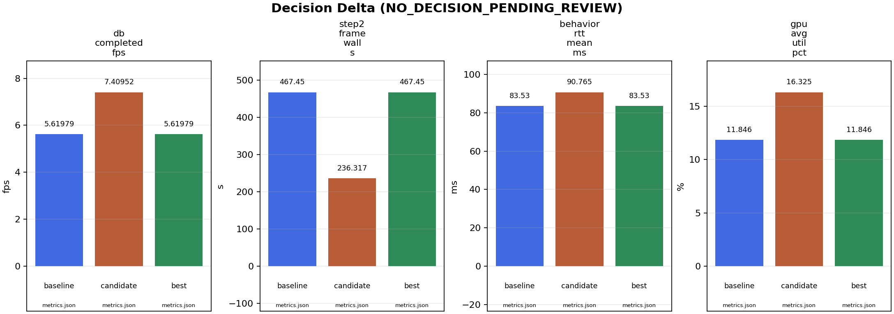

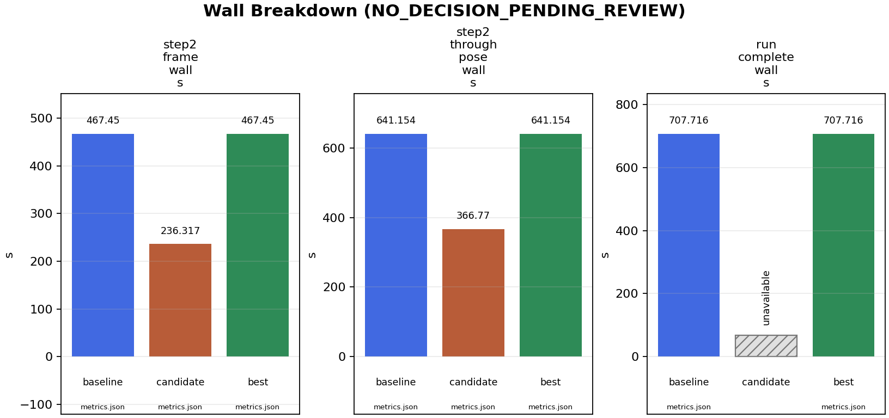

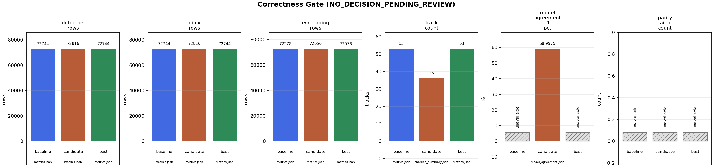

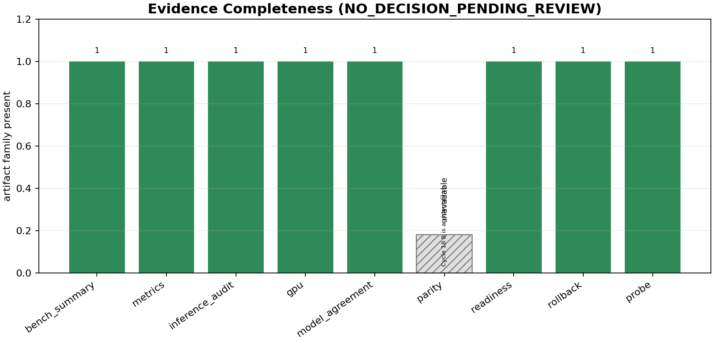

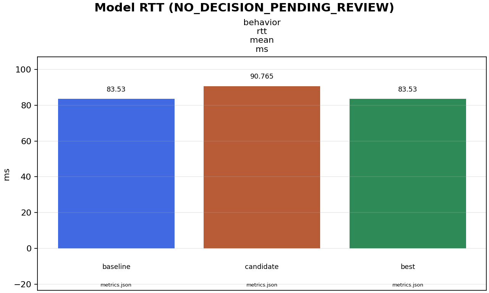

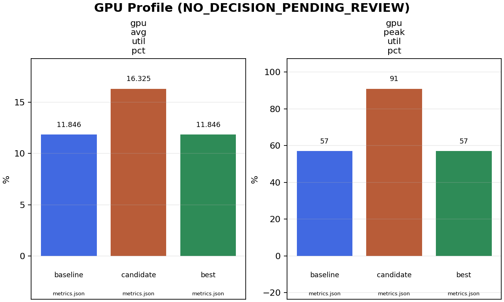

Decision: **NOT ACCEPTED**. The candidate preserves the measured sharding
performance win, but it fails packet validity, identity merge readiness,
StudentTrack parity, model-agreement, and label-invariant tracking gates. The
next Cycle 18 task should not rerun the same profile. It must first reduce or
redesign boundary packet payloads so packets are valid within the configured
byte cap, then improve the association consumer so shard-1 residual association
loss and unresolved tracks are eliminated before another production benchmark.

## 45. Cycle 18.C Packet-Budget Active-Edge Boundary Association

Cycle 18.C ran the packet-budget and active inter-shard-edge redesign on the
production Linux RTX 5090 at deployed SHA
`e90db7a2245fd0169e51f11120867a42d45571ee`. The candidate fixed packet byte
validity and improved the sharding speed envelope, but it is **NOT ACCEPTED**
because merge readiness and identity correctness still failed.

| Item | Value |
|---|---|
| Replay key | `cycle18c-packet-budget-active-edge-20260605T162825Z` |
| Parent job ID | `56f5782b-aceb-48fd-83eb-15017f57bf70` |
| Child job IDs | `1471c0c4-3c02-4b8a-8df9-0ec10a285b20`, `2e0712fc-d113-4628-bea3-3a160cf3ca65` |
| Status | `completed`, `4541/4541` parent frames |
| Baseline replay | `cycle15b-pre-shard-baseline-20260603T193531Z` |
| Baseline job | `74561b05-105f-4ca8-aeaf-f510f4f802de` |
| Metrics JSON/MD | `/home/bamby/grad_project/backend/logs/cycle18c-packet-budget-active-edge-20260605T162825Z/metrics.json` / `.md` |
| Packet validation JSON/MD | `/home/bamby/grad_project/backend/logs/cycle18c-packet-budget-active-edge-20260605T162825Z/boundary_packet_validation.json` / `.md` |
| Model agreement JSON/MD | `/home/bamby/grad_project/backend/logs/cycle18c-packet-budget-active-edge-20260605T162825Z/model_agreement.json` / `.md` |
| Label-invariant JSON/MD | `/home/bamby/grad_project/backend/logs/cycle18c-packet-budget-active-edge-20260605T162825Z/label_invariant_tracking.json` / `.md` |
| Rollback JSON/MD | `/home/bamby/grad_project/backend/logs/cycle18c-packet-budget-active-edge-20260605T162825Z/rollback_status.json` / `.md` |
| Figure manifest | `docs/figures/benchmark_artifacts/cycle18c-packet-budget-active-edge-20260605T162825Z/figure_manifest.json` |
| Figure roles | Planner `Huygens`; implementer `Archimedes`; generator `tools/prod/prod_generate_cycle_figures.py` |

Performance versus the accepted pre-shard baseline and Cycle 18.B:

| Metric | Baseline | Cycle 18.B | Cycle 18.C | Delta vs baseline | Delta vs 18.B |
|---|---:|---:|---:|---:|---:|
| DB-completed FPS | `5.619787` | `7.409522` | `7.477400` | `+33.05 %` | `+0.92 %` |
| DB completed elapsed | `808.038 s` | `612.860 s` | `607.297 s` | `-24.84 %` | `-0.91 %` |
| Step 2 frame wall | `467.449833 s` | `248.323884 s` | `244.490729 s` | `-47.70 %` | `-1.54 %` |
| Step 2 through-pose wall | `641.154064 s` | `376.362543 s` | `369.948615 s` | `-42.30 %` | `-1.70 %` |
| GPU avg util | `11.846 %` | `16.325 %` | `19.177 %` | `+61.89 %` | `+17.47 %` |
| GPU peak util | `57.000 %` | `91.000 %` | `93.000 %` | `+63.16 %` | `+2.20 %` |
| Detection rows | `72744` | `72816` | `72816` | `+0.10 %` | `0.00 %` |
| BBox rows | `72744` | `72816` | `72816` | `+0.10 %` | `0.00 %` |
| Embedding rows | `72578` | `72650` | `72650` | `+0.10 %` | `0.00 %` |
| StudentTracks | `53` | `65` | `64` | `+20.75 %` | `-1.54 %` |

Correctness and identity gates:

| Gate | Cycle 18.B | Cycle 18.C | Decision impact |
|---|---:|---:|---|
| Valid boundary packets | `0/2` | `2/2` | Packet byte-budget blocker fixed |
| Merge-ready packets | `0/2` | `1/2` | Fails identity-merge gate |
| Minimum model-agreement F1@IoU0.5 | `53.730 %` | `53.730 %` | Fails model-agreement gate |
| Minimum all-model global-assignment F1 | `69.752 %` | `69.830 %` | Fails label-invariant identity gate |
| Minimum shard-1 global-assignment F1 | `79.876 %` | `79.876 %` | Fails residual association gate |
| Minimum shard-1 raw-label F1 | `2.917 %` | `2.917 %` | Local-ID discontinuity remains |
| Rollback verified | `true` | `true` | Pass safety gate |

Packet validation:

| Child | Packet valid | Merge-ready | Packet bytes | Tracks | Observations | Unresolved tracks |
|---|---|---|---:|---:|---:|---:|
| `1471c0c4-3c02-4b8a-8df9-0ec10a285b20` | `true` | `true` | `185391` | `24` | `1128` | `0` |
| `2e0712fc-d113-4628-bea3-3a160cf3ca65` | `true` | `false` | `233988` | `24` | `1424` | `14` |

Shard-1 association still failed: the parent mapped only `10/36` shard-1
tracks to existing parent IDs and used offset fallback for `26/36`. That
explains why `StudentTracks` remained wrong (`53 -> 64`) even after packet byte
validity was repaired.

### 45.1 Figure Evidence

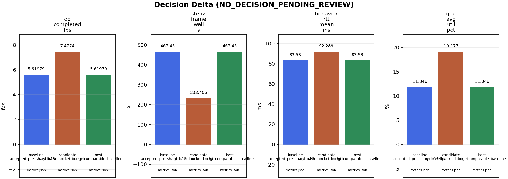

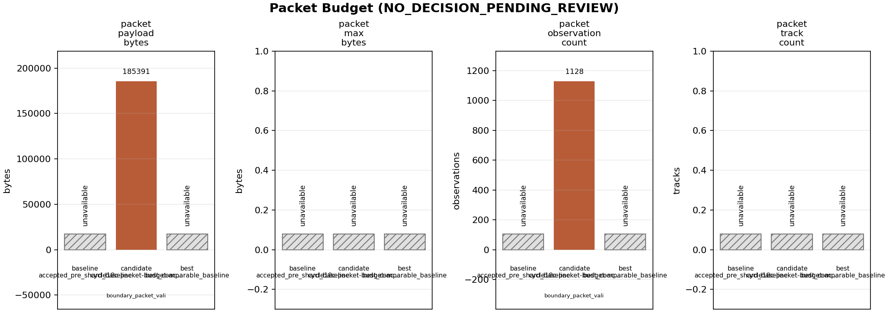

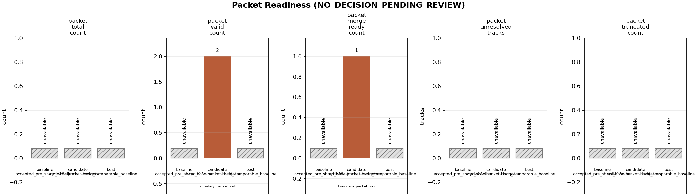

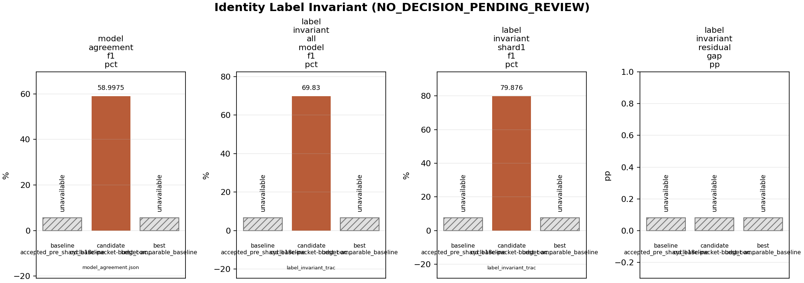

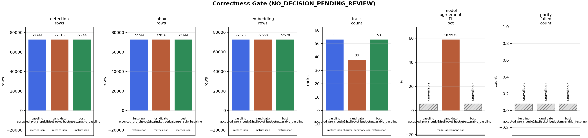

Decision: **NOT ACCEPTED**. Cycle 18.C fixed the packet byte-budget portion of
the blocker, but it did not fix shard-1 association readiness or identity
correctness. No FPS, wall-time, or GPU-utilization gain is accepted from this
cycle. Cycle 15.B1 and 15.B2 remain blocked until a new identity-state producer
or association redesign proves all boundary packets merge-ready and restores
model/label-invariant correctness in production.

## 46. Cycle 18.D Combined-Cost Boundary Association

Cycle 18.D ran the combined-cost boundary association redesign on the
production Linux RTX 5090 at deployed SHA `d976817b`. The candidate fused
geometry, appearance, and motion evidence through
`OFFLINE_VIDEO_SHARD_TRACK_MAP_MODE=combined_cost`. It completed the governed
two-shard `combined.mp4` benchmark and rollback proof, but it is **NOT
ACCEPTED** because packet validity, merge readiness, model agreement, and
identity gates still failed.

| Item | Value |
|---|---|
| Replay key | `cycle18d-combined-cost-20260605T174115Z` |
| Parent job ID | `94098d79-fed1-4a67-a0c6-9f0f067f2990` |
| Child job IDs | `a3d6e334-08bf-48d3-a804-1f86a7dcca33`, `9c68766d-6b91-4090-af51-04c8180eff50` |
| Status | `completed`, `4541/4541` parent frames |
| Baseline replay | `cycle15b-pre-shard-baseline-20260603T193531Z` |
| Baseline job | `74561b05-105f-4ca8-aeaf-f510f4f802de` |
| Metrics JSON/MD | `/home/bamby/grad_project/backend/logs/cycle18d-combined-cost-20260605T174115Z/metrics.json` / `.md` |
| Packet validation JSON/MD | `/home/bamby/grad_project/backend/logs/cycle18d-combined-cost-20260605T174115Z/boundary_packet_validation.json` / `.md` |
| Model agreement JSON/MD | `/home/bamby/grad_project/backend/logs/cycle18d-combined-cost-20260605T174115Z/model_agreement.json` / `.md` |
| Label-invariant JSON/MD | `/home/bamby/grad_project/backend/logs/cycle18d-combined-cost-20260605T174115Z/label_invariant_tracking.json` / `.md` |
| Rollback JSON/MD | `/home/bamby/grad_project/backend/logs/cycle18d-combined-cost-20260605T174115Z/rollback_status.json` / `.md` |
| Figure manifest | `docs/figures/benchmark_artifacts/cycle18d-combined-cost-20260605T174115Z/figure_manifest.json` |
| Figure roles | Planner `Agent 18 current benchmark session`; implementer `Agent 18 current benchmark session`; separation unavailable because no sub-agent delegation was requested. |

Performance versus the accepted pre-shard baseline and Cycle 18.C:

| Metric | Baseline | Cycle 18.C | Cycle 18.D | Delta vs baseline | Delta vs 18.C |
|---|---:|---:|---:|---:|---:|
| DB-completed FPS | `5.619787` | `7.477400` | `7.502768` | `+33.51 %` | `+0.34 %` |
| DB completed elapsed | `808.038 s` | `607.297 s` | `605.243 s` | `-25.10 %` | `-0.34 %` |
| Step 2 frame wall | `467.449833 s` | `244.490729 s` | `244.259645 s` | `-47.75 %` | `-0.09 %` |
| Step 2 through-pose wall | `641.154064 s` | `369.948615 s` | `370.990517 s` | `-42.14 %` | `+0.28 %` |
| GPU avg util | `11.846 %` | `19.177 %` | `17.035 %` | `+43.80 %` | `-11.17 %` |
| GPU peak util | `57.000 %` | `93.000 %` | `85.000 %` | `+49.12 %` | `-8.60 %` |
| Detection rows | `72744` | `72816` | `72816` | `+0.10 %` | `0.00 %` |
| BBox rows | `72744` | `72816` | `72816` | `+0.10 %` | `0.00 %` |
| Embedding rows | `72578` | `72650` | `72650` | `+0.10 %` | `0.00 %` |
| StudentTracks | `53` | `64` | `56` | `+5.66 %` | `-12.50 %` |

Correctness and identity gates:

| Gate | Cycle 18.C | Cycle 18.D | Decision impact |
|---|---:|---:|---|
| Valid boundary packets | `2/2` | `1/2` | Fails packet-validity gate |
| Merge-ready packets | `1/2` | `0/2` | Fails identity-merge gate |
| Shard-1 mapped to existing parent IDs | `10/36` | `18/36` | Improves, but half of shard-1 still falls back |
| Shard-1 offset fallbacks | `26/36` | `18/36` | Improves, but still fails |
| Minimum model-agreement F1@IoU0.5 | `53.730 %` | `53.788 %` | Fails model-agreement gate |
| Minimum all-model global-assignment F1 | `69.830 %` | `72.414 %` | Improves, but fails identity gate |
| Minimum shard-1 global-assignment F1 | `79.876 %` | `79.876 %` | Residual shard-1 association gap unchanged |
| Minimum shard-1 raw-label F1 | `2.917 %` | `3.581 %` | Local-ID discontinuity remains |
| Rollback verified | `true` | `true` | Pass safety gate |

Packet validation:

| Child | Packet valid | Merge-ready | Packet bytes | Tracks | Observations | Unresolved tracks |
|---|---|---|---:|---:|---:|---:|
| `a3d6e334-08bf-48d3-a804-1f86a7dcca33` | `true` | `false` | `181162` | `24` | `1128` | `24` |
| `9c68766d-6b91-4090-af51-04c8180eff50` | `false` | `false` | `236173` | `24` | `1424` | `6` |

The second packet failed schema validation because the new `combined_score` and
`motion_score` candidate fields are not yet part of the governed Cycle 18
boundary-packet schema. That contract gap is now a required next fix, but it is
not the only blocker: unresolved tracks and the shard-1 residual association
gap still prevent acceptance.

### 46.1 Figure Evidence

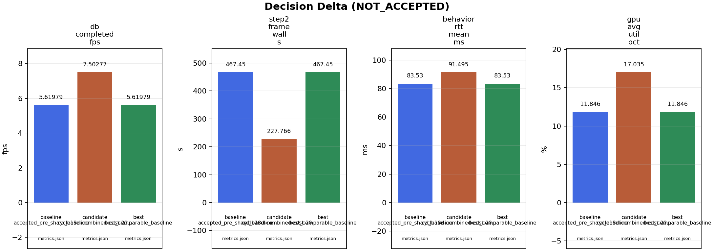

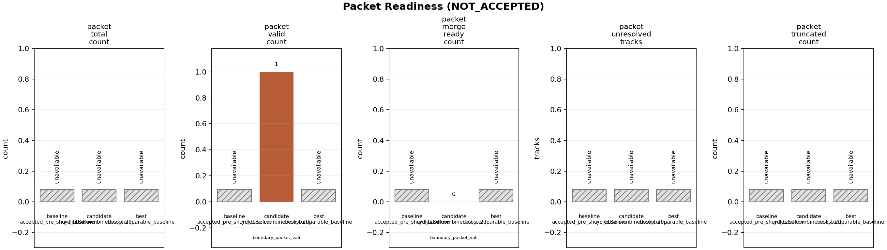

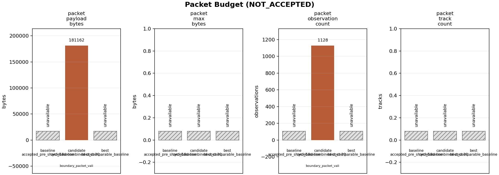

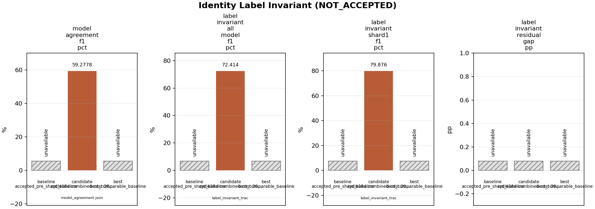

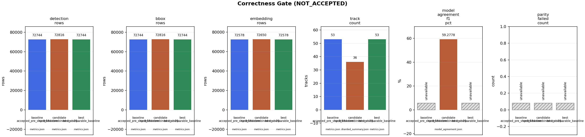

Decision: **NOT ACCEPTED**. Cycle 18.D improved mapping coverage compared with
Cycle 18.C (`10/36 -> 18/36`) and moved StudentTracks closer to baseline
(`64 -> 56` versus accepted `53`), while preserving the sharding throughput
envelope. It still fails the required identity/evidence gates: `1/2` valid
packets, `0/2` merge-ready packets, `18/36` shard-1 offset fallbacks, minimum
model-agreement F1 `53.788 %`, and unchanged minimum shard-1 global-assignment
F1 `79.876 %`. No Cycle 18.D sharding gain is accepted, and Cycle 15.B1/15.B2
remain blocked.

## 47. Cycle 18.D OSNet-AIN Triton ReID Boundary Association

Cycle 18.D then ran the distinct learned-ReID candidate requested after the
region-HSV and OpenVINO-backbone fallback failures. The candidate built and
loaded a real OSNet-AIN x1.0 FP32 TensorRT model in the offline Triton profile,
selected `OFFLINE_VIDEO_SHARD_BOUNDARY_PACKET_APPEARANCE_DESCRIPTOR=triton_reid`,
and reran the governed two-shard `combined.mp4` benchmark. The model build and
parity gates passed, but the runtime candidate is **NOT ACCEPTED** because the
identity gates still failed.

| Item | Value |
|---|---|
| ReID build tag | `osnet-ain-reid-20260605T20260605T201255Z` |
| ReID model | `osnet_ain_x1_0`, offline Triton only |
| Engine SHA-256 | `93c7b1a6562ff21d51f46129259545aa144fbdaa275ed42b73df1021c6c1cfff` |
| ONNX SHA-256 | `7a493dde67b823d9a52173eb674da744cc2091c4184b0eaa456dcb82b80be49c` |
| Checkpoint SHA-256 | `8a07e8da38946f7cee37f4561617bf8b6d2fe8f3a4027852893ea092e46d919f` |
| Parity JSON/MD | `/home/bamby/grad_project/backend/logs/osnet-ain-reid-parity-20260605T201608Z/reid_triton_parity.json` / `.md` |
| Parity result | `overall_passed=true`; min PyTorch-vs-Triton cosine `0.9999725818634033`; repeat cosine `1.0`; mean Triton latency `19.329 ms` |
| Replay key | `cycle18d-osnet-reid-20260605T202019Z` |
| Parent job ID | `39e8ea9f-1de7-487d-98cb-6c40512158c6` |
| Child job IDs | `0cf25360-054c-41b6-9027-4aa0f0dfbae3`, `a387b9e5-d38e-4ef3-badc-05f181353dfa` |
| Status | `completed`, `4541/4541` parent frames |
| Baseline replay | `cycle15b-pre-shard-baseline-20260603T193531Z` |
| Baseline job | `74561b05-105f-4ca8-aeaf-f510f4f802de` |
| Metrics JSON/MD | `/home/bamby/grad_project/backend/logs/cycle18d-osnet-reid-20260605T202019Z/metrics.json` / `.md` |
| Packet validation JSON/MD | `/home/bamby/grad_project/backend/logs/cycle18d-osnet-reid-20260605T202019Z/boundary_packet_validation.json` / `.md` |
| Model agreement JSON/MD | `/home/bamby/grad_project/backend/logs/cycle18d-osnet-reid-20260605T202019Z/model_agreement.json` / `.md` |
| Label-invariant JSON/MD | `/home/bamby/grad_project/backend/logs/cycle18d-osnet-reid-20260605T202019Z/label_invariant_tracking.json` / `.md` |
| Rollback JSON/MD | `/home/bamby/grad_project/backend/logs/cycle18d-osnet-reid-20260605T202019Z/rollback_status.json` / `.md` |
| Figure manifest | `docs/figures/benchmark_artifacts/cycle18d-osnet-reid-20260605T202019Z/figure_manifest.json` |
| Figure roles | Planner `Agent 18 OSNet ReID benchmark session`; implementer `Agent 18 OSNet ReID benchmark session`; generator `tools/prod/prod_generate_cycle_figures.py` |

Performance versus the accepted pre-shard baseline:

| Metric | Baseline | OSNet candidate | Delta |
|---|---:|---:|---:|
| DB-completed FPS | `5.619787` | `7.584265` | `+34.96 %` |
| DB completed elapsed | `808.038 s` | `598.740 s` | `-25.90 %` |
| Step 2 frame wall | `467.449833 s` | `245.762854 s` | `-47.42 %` |
| Step 2 through-pose wall | `641.154064 s` | `363.297142 s` | `-43.34 %` |
| Behavior RTT mean | `83.530 ms` | `91.833 ms` | `+9.94 %` |
| Behavior RTT p95 | `129.514 ms` | `149.532 ms` | `+15.46 %` |
| GPU avg util | `11.846 %` | `16.903 %` | `+42.69 %` |
| GPU peak util | `57.000 %` | `89.000 %` | `+56.14 %` |
| Detection rows | `72744` | `72816` | `+0.10 %` |
| BBox rows | `72744` | `72816` | `+0.10 %` |
| Embedding rows | `72578` | `72650` | `+0.10 %` |
| StudentTracks | `53` | `57` | `+7.55 %` |

Correctness and identity gates:

| Gate | Result | Decision impact |
|---|---:|---|
| Valid boundary packets | `2/2` | Pass packet-validity gate |
| Merge-ready packets | `1/2` | Fails identity-merge gate |
| Shard-1 mapped to existing parent IDs | `17/36` | Worse than the prior `18/36`; fails mapping gate |
| Shard-1 offset fallbacks | `19/36` | Fails namespace/association gate |
| Shard-1 unresolved packet tracks | `7/24` | Fails merge-readiness gate |
| Minimum model-agreement F1@IoU0.5 | `53.788 %` | Fails model-agreement gate |
| Minimum all-model global-assignment F1 | `72.414 %` | Fails label-invariant identity gate |
| Minimum shard-1 global-assignment F1 | `79.876 %` | Residual shard-1 association gap unchanged |
| Rollback verified | `true` | Pass safety gate |

### 47.1 Figure Evidence

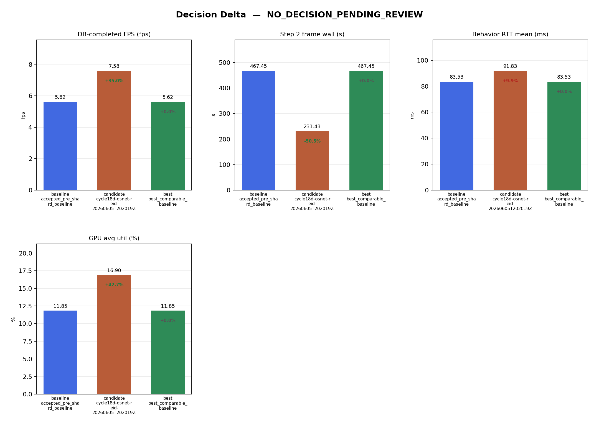

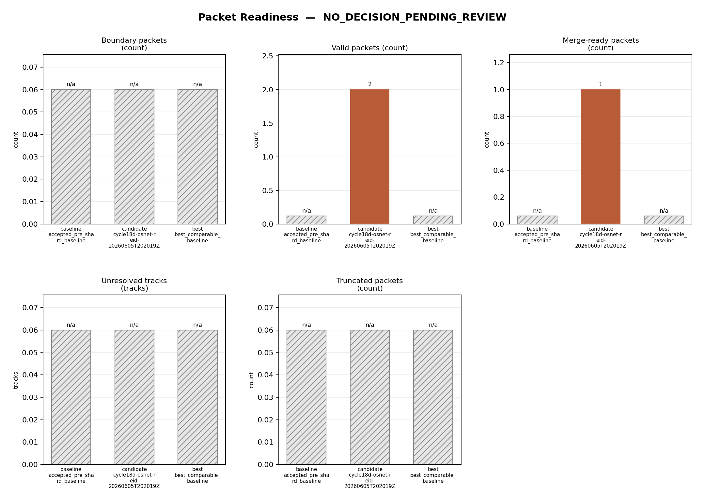

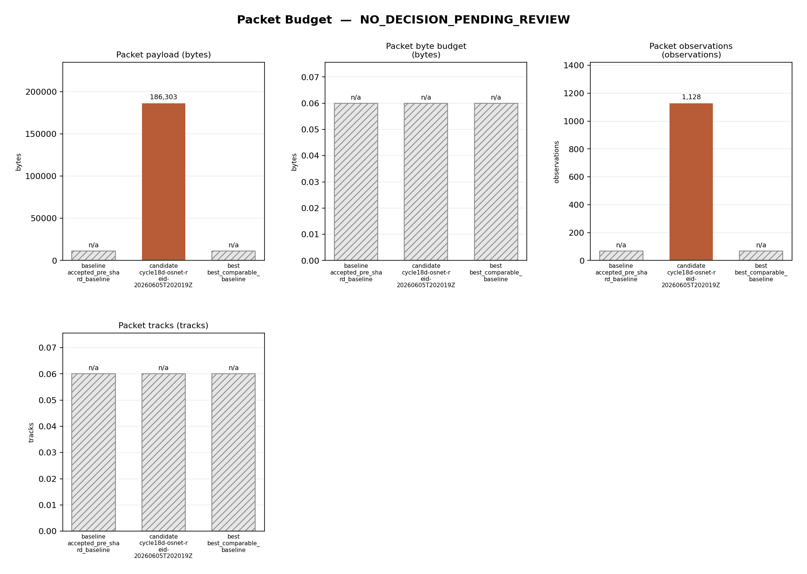

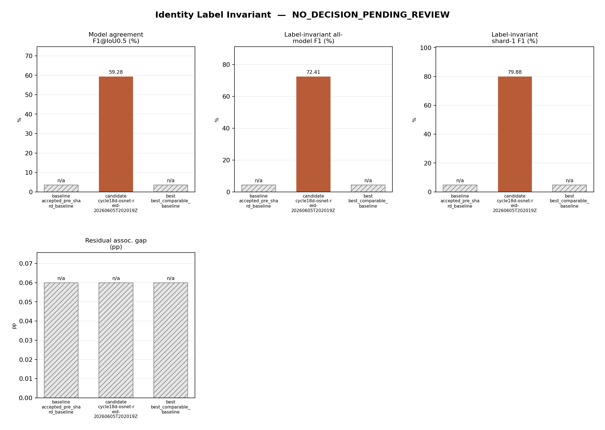

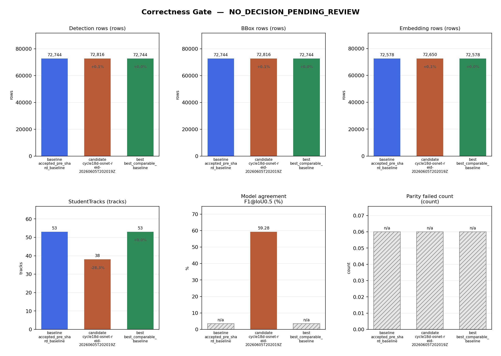

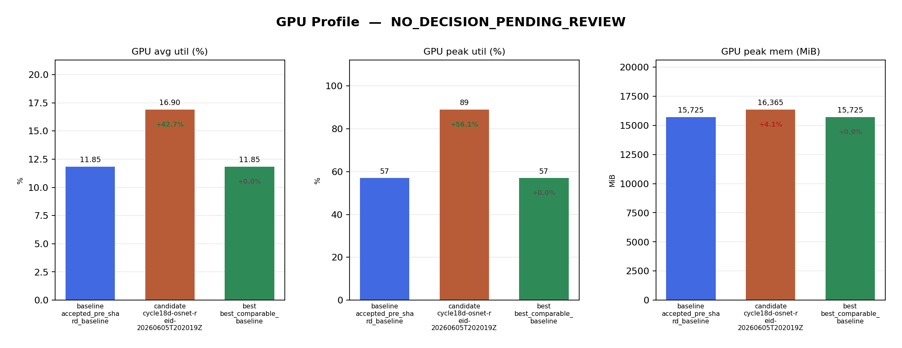

Decision: **NOT ACCEPTED**. The OSNet-AIN TensorRT model itself is production
usable as an offline Triton model, but the `triton_reid` boundary descriptor did
not close the Cycle 18 identity gap. The candidate preserved the sharding speed
envelope and kept packet validity at `2/2`, but merge readiness stayed `1/2`,
StudentTracks regressed to `57` versus baseline `53`, shard-1 still used
`19/36` offset fallbacks, minimum model-agreement F1 stayed `53.788 %`, and
minimum shard-1 label-invariant F1 stayed `79.876 %`. Cycle 15.B1/15.B2 remain
blocked. Further sharding work needs human-labeled identity ground truth and/or
a redesigned identity-state producer that addresses intra-shard fragmentation,
not another boundary-descriptor rerun.

## 48. Cycle 20 Measurement-Only Post-Stage Timeline

Cycle 20 then started on production as the next non-sharding latency lane. This
run is a measurement-only replay, not a streaming persistence candidate:
`OFFLINE_STREAM_POST_STAGES=0` remained disabled, and the wrapper enabled only
`OFFLINE_STREAM_POST_STAGE_TIMELINE=1` during the replay. The production job
completed and rollback restored both Cycle 20 flags to `0`.

| Item | Value |
|---|---|
| Status | `NO_DECISION_PENDING_REVIEW` |
| Runtime commit | `ba4e2882` |
| Evidence fix commit | `70aebb99` |
| Replay key | `cycle20-post-stage-timeline-20260605T212526Z` |
| Job ID | `58d53985-1c86-46fd-944c-771ea3afce1a` |
| Baseline replay | `cycle15b-pre-shard-baseline-20260603T193531Z` |
| Baseline job | `74561b05-105f-4ca8-aeaf-f510f4f802de` |
| Metrics JSON/MD | `/home/bamby/grad_project/backend/logs/cycle20-post-stage-timeline-20260605T212526Z/post_stage_timeline_metrics.json` / `.md` |
| Model agreement JSON/MD | `/home/bamby/grad_project/backend/logs/cycle20-post-stage-timeline-20260605T212526Z/model_agreement_baseline_vs_post_stage_timeline.json` / `.md` |
| Rollback JSON/MD | `/home/bamby/grad_project/backend/logs/cycle20-post-stage-timeline-20260605T212526Z/rollback_status.json` / `.md` |
| Bench summary | `/home/bamby/grad_project/backend/logs/bench_summary_20260606T002549.json` |
| GPU CSV | `/home/bamby/grad_project/backend/logs/gpu_monitor_bench_20260606T002549.csv` |
| Inference audit | `/home/bamby/grad_project/backend/data/videos/58d53985-1c86-46fd-944c-771ea3afce1a/inference_audit.json` |
| Figure manifest | `docs/figures/benchmark_artifacts/cycle20-post-stage-timeline-20260605T212526Z/figure_manifest.json` |
| Figure roles | Planner `Agent Cycle 20 kickoff`; implementer `Agent Cycle 20 kickoff`; generator `tools/prod/prod_generate_cycle_figures.py` |

Performance and lifecycle measurements:

| Metric | Baseline | Candidate | Delta / result |
|---|---:|---:|---:|
| DB-completed FPS | `5.619787` | `5.216317` | `-7.18 %` |
| DB completed elapsed | `808.038 s` | `870.538 s` | `+7.73 %` |
| Step 2 frame wall | `467.449833 s` | `462.124911 s` | `-1.14 %` |
| Step 2 through-pose wall | `641.154064 s` | `691.776287 s` | `+7.90 %` |
| GPU avg util | `11.846 %` | `11.366 %` | `-4.05 %` |
| GPU peak util | `57.000 %` | `54.000 %` | `-5.26 %` |
| Embedding created span | `98.578 s` | `98.418 s` | `-0.16 %` |
| Persistence starts before inference done | `unavailable` | `false` | current path is serial |
| Embedding starts before inference done | `unavailable` | `false` | current path is serial |
| Persistence wall | `unavailable` | `52.703285 s` | measurement-only |
| Embedding start lag after inference done | `unavailable` | `78.581286 s` | measurement-only |
| Embedding wall | `unavailable` | `98.739642 s` | measurement-only |

Correctness and rollback gates:

| Gate | Result | Decision impact |
|---|---:|---|
| Processed frames | `4541/4541` | Pass run-completion gate |
| Detection rows | `72744` | Matches baseline row parity |
| BBox rows | `72744` | Matches baseline row parity |
| Embedding rows | `72578` | Matches baseline row parity |
| StudentTracks | `53` | Matches baseline |
| Per-model agreement F1@IoU0.5 | `100.000 %` for all four behavior models | Pass model-agreement proxy |
| `first_persist_packet_ready_at` | unavailable: `serial_path_no_streaming_persistence_packet` | Expected for measurement-only serial path |
| `terminal_coordinator_done_at` | missing | Instrumentation gap; blocks decision closure |
| Rollback verified | `true` | Cycle flags restored to `0` |

### 48.1 Figure Evidence

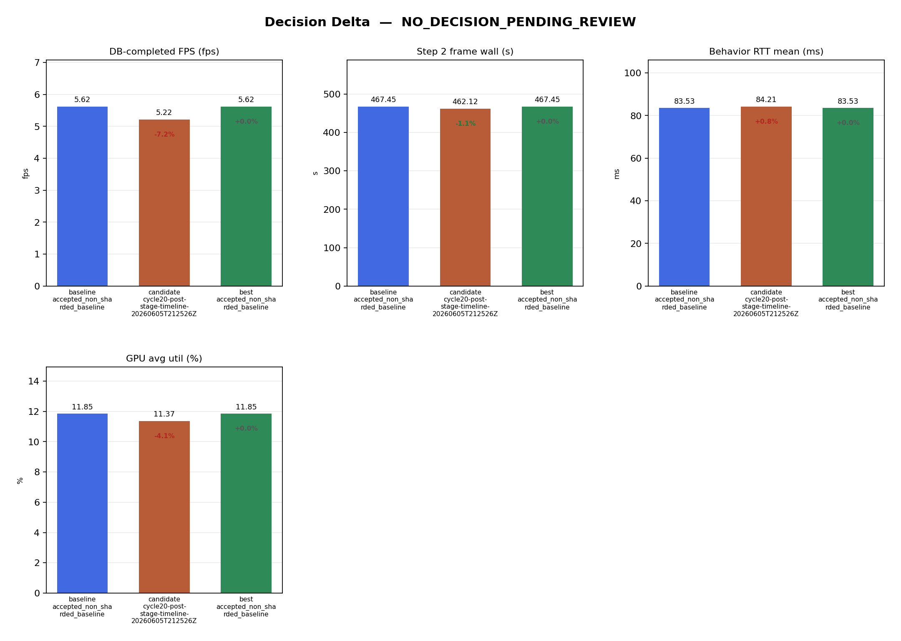

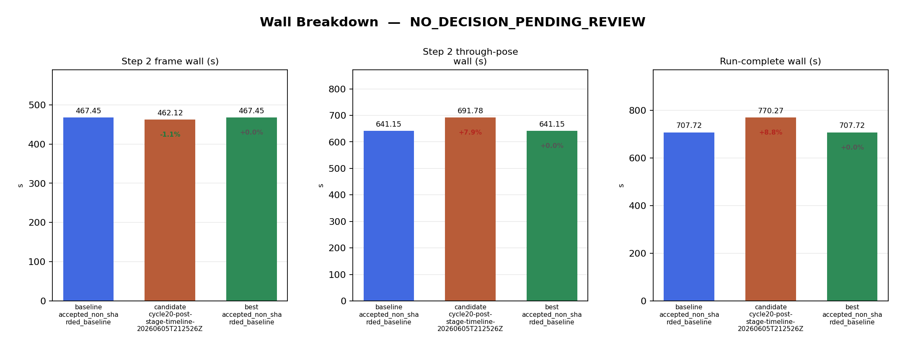


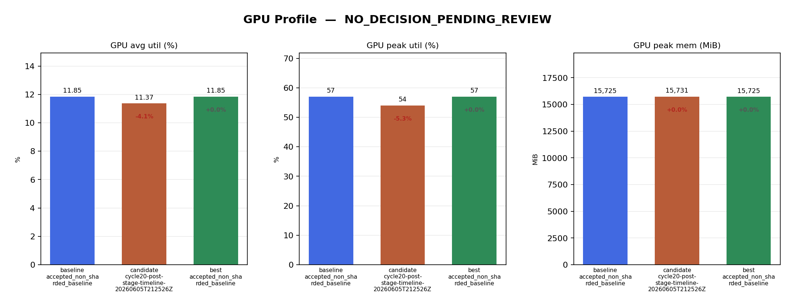


Decision: **NO DECISION PENDING REVIEW**. Cycle 20 has started on production and
the first measurement-only run proves the current post-stage boundaries are
serial: persistence and embedding both start after frame inference is done.
This replay does not accept or reject streaming persistence/embedding overlap,
because no streaming writer, bounded persistence queue, embedding watermark, or
terminal coordinator was enabled. The next Cycle 20 step is to fix/record the
terminal coordinator timestamp and design the default-off streaming writer
candidate against these measured gaps.

Repo-side follow-up started on 2026-06-06: Cycle 20.C moves the
`terminal_coordinator_done_at` measurement marker in `run_reid_pipeline` so it
is persisted before the ReID task reports terminal `COMPLETED` status. This is
not a streaming implementation and does not change the §48 decision. The fresh
terminal-marker replay is recorded in §49.

## 49. Cycle 20.C Terminal-Marker Timeline Rerun

Cycle 20.C reran the measurement-only post-stage timeline after repairing the
terminal-marker race. Attempts r1 and r2 are retained in the Cycle 20 doc as
failed wrapper evidence: r1 disabled the timeline flag before offloaded
embedding/ReID markers were written, and r2 recorded the markers but ran the
wait subprocess from the wrong working directory. The r3 replay below is the
authoritative Phase C production record.

| Item | Value |
|---|---|
| Status | `NO_DECISION_PENDING_REVIEW / TERMINAL_MARKER_RECORDED` |
| Runtime commit | `7bf66e97` |
| Replay key | `cycle20c-terminal-marker-r3-20260605T233053Z` |
| Job ID | `7ff0dfd4-890e-4210-92c7-f0f3b069c65e` |
| Baseline replay | `cycle15b-pre-shard-baseline-20260603T193531Z` |
| Baseline job | `74561b05-105f-4ca8-aeaf-f510f4f802de` |
| Metrics JSON/MD | `/home/bamby/grad_project/backend/logs/cycle20c-terminal-marker-r3-20260605T233053Z/post_stage_timeline_metrics.json` / `.md` |
| Model agreement JSON/MD | `/home/bamby/grad_project/backend/logs/cycle20c-terminal-marker-r3-20260605T233053Z/model_agreement_baseline_vs_post_stage_timeline.json` / `.md` |
| Wait snapshot | `/home/bamby/grad_project/backend/logs/cycle20c-terminal-marker-r3-20260605T233053Z/post_stage_wait_snapshot.json` |
| Rollback JSON | `/home/bamby/grad_project/backend/logs/cycle20c-terminal-marker-r3-20260605T233053Z/rollback_status.json` |
| Bench summary | `/home/bamby/grad_project/backend/logs/bench_summary_20260606T023338.json` |
| GPU CSV | `/home/bamby/grad_project/backend/logs/gpu_monitor_bench_20260606T023338.csv` |
| Inference audit | `/home/bamby/grad_project/backend/data/videos/7ff0dfd4-890e-4210-92c7-f0f3b069c65e/inference_audit.json` |
| Figure manifest | `docs/figures/benchmark_artifacts/cycle20c-terminal-marker-r3-20260605T233053Z/figure_manifest.json` |
| Figure roles | Planner `Cycle 20.C terminal-marker repair agent`; implementer `Cycle 20.C terminal-marker repair agent`; generator `tools/prod/prod_generate_cycle_figures.py` |

Performance and lifecycle measurements:

| Metric | Baseline | Candidate | Delta / result |
|---|---:|---:|---:|
| DB-completed FPS | `5.619787` | `5.274878` | `-6.14 %` |
| DB completed elapsed | `808.038 s` | `860.873 s` | `+6.54 %` |
| Step 2 frame wall | `467.449833 s` | `462.458481 s` | `-1.07 %` |
| Step 2 through-pose wall | `641.154064 s` | `690.903380 s` | `+7.76 %` |
| GPU avg util | `11.846 %` | `11.691 %` | `-1.31 %` |
| GPU peak util | `57.000 %` | `53.000 %` | `-7.02 %` |
| Behavior RTT mean | `unavailable` | `84.300 ms` | measurement-only |
| Embedding created span | `98.578 s` | `99.080 s` | `+0.51 %` |
| Persistence starts before inference done | `unavailable` | `false` | current path is serial |
| Embedding starts before inference done | `unavailable` | `false` | current path is serial |
| Persistence wall | `unavailable` | `43.184512 s` | measurement-only |
| Embedding start lag after inference done | `unavailable` | `69.173672 s` | measurement-only |
| Embedding wall | `unavailable` | `99.369505 s` | measurement-only |
| Terminal lag after embedding | `unavailable` | `0.244864 s` | terminal marker recorded |

Timeline marker gate:

| Marker | Result |
|---|---|
| `inference_started_at` | `2026-06-05T23:33:44.365107+00:00` |
| `frame_inference_done_at` | `2026-06-05T23:45:15.390185+00:00` |
| `first_frame_persisted_at` | `2026-06-05T23:45:15.405796+00:00` |
| `all_frames_persisted_at` | `2026-06-05T23:45:58.590308+00:00` |
| `first_embedding_eligible_at` | `2026-06-05T23:45:58.592820+00:00` |
| `first_embedding_started_at` | `2026-06-05T23:46:24.563857+00:00` |
| `embedding_done_at` | `2026-06-05T23:48:03.933362+00:00` |
| `terminal_coordinator_done_at` | `2026-06-05T23:48:04.178226+00:00` |
| `first_persist_packet_ready_at` | unavailable: `serial_path_no_streaming_persistence_packet` |
| Wait snapshot | `status=ready`, `missing_required=[]` |

Correctness and rollback gates:

| Gate | Result | Decision impact |
|---|---:|---|
| Processed frames | `4541/4541` | Pass run-completion gate |
| Detection rows | `72744` | Matches baseline row parity |
| BBox rows | `72744` | Matches baseline row parity |
| Embedding rows | `72578` | Matches baseline row parity |
| StudentTracks | `53` | Matches baseline |
| Per-model agreement F1@IoU0.5 | `100.000 %` for all four behavior models | Pass model-agreement proxy |
| Rollback verified | `true` | `OFFLINE_STREAM_POST_STAGES=0` and `OFFLINE_STREAM_POST_STAGE_TIMELINE=0` restored |
| Production health after rollback | Triton `200`, backend `200` | Pass service-readiness check |

### 49.1 Figure Evidence

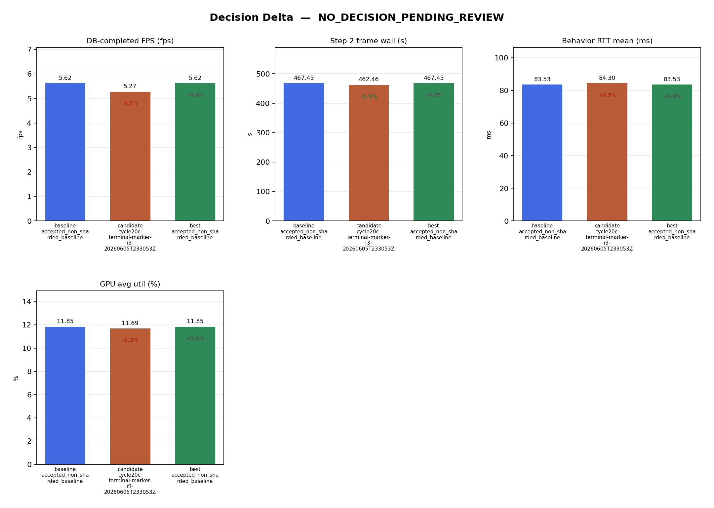

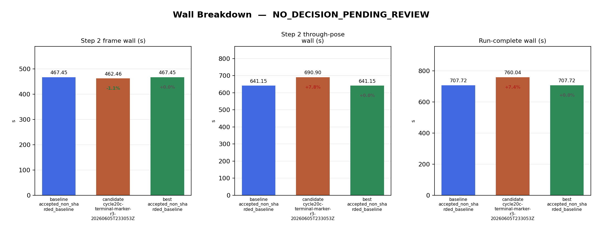

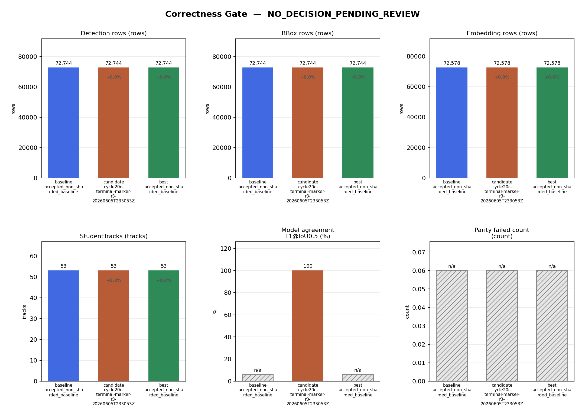

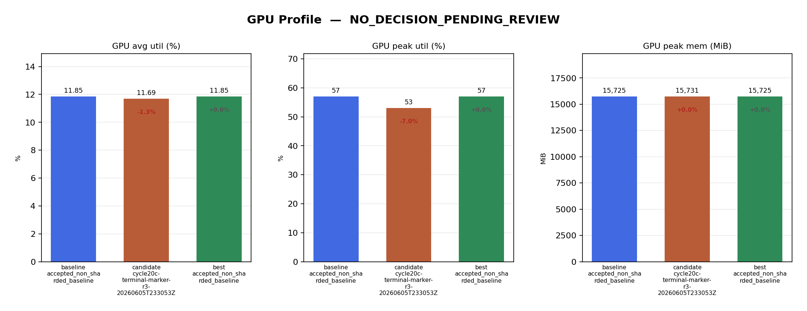


Decision: **NO DECISION PENDING REVIEW**. Cycle 20.C repaired and proved the
terminal marker, and rollback restored both Cycle 20 flags to `0`. This replay
still does not accept or reject streaming persistence/embedding overlap: it
kept the serial post-stage path, and the next authoritative gate is a
default-off streaming writer candidate with bounded persistence packets,
idempotent detection/box writes, regenerated figures, and rollback proof.

## 50. Cycle 20.D Streaming Persistence Writer

Cycle 20.D enabled the default-off offline streaming persistence writer during
one governed production replay. Earlier r1/r2 attempts are retained in
`docs/cycle_20_streaming_persistence_embedding_overlap_investigation.md` as
`NEEDS_ITERATION_NO_DECISION` evidence. The r3 replay below is the
authoritative Phase D decision record: packet-signature reconciliation restored
model agreement, but the candidate regressed throughput and still required
large Step 3 packet rewrites before embeddings.

| Item | Value |
|---|---|
| Status | `PRODUCTION_BENCHMARK_COMPLETE / BENCHMARK_LOCK_RELEASED / NOT_ACCEPTED` |
| Runtime commit | `4e294f52` |
| Replay key | `cycle20d-streaming-persistence-r3-20260606T011056Z` |
| Job ID | `24e9970f-b3bc-451d-ab50-b0bcbb1e8d8b` |
| Baseline replay | `cycle15b-pre-shard-baseline-20260603T193531Z` |
| Baseline job | `74561b05-105f-4ca8-aeaf-f510f4f802de` |
| Metrics JSON/MD | `/home/bamby/grad_project/backend/logs/cycle20d-streaming-persistence-r3-20260606T011056Z/post_stage_timeline_metrics.json` / `.md` |
| Model agreement JSON/MD | `/home/bamby/grad_project/backend/logs/cycle20d-streaming-persistence-r3-20260606T011056Z/model_agreement_baseline_vs_post_stage_timeline.json` / `.md` |
| Wait snapshot | `/home/bamby/grad_project/backend/logs/cycle20d-streaming-persistence-r3-20260606T011056Z/post_stage_wait_snapshot.json` |
| Rollback JSON | `/home/bamby/grad_project/backend/logs/cycle20d-streaming-persistence-r3-20260606T011056Z/rollback_status.json` |
| Runtime probe | `/home/bamby/grad_project/backend/logs/cycle20d-streaming-persistence-r3-20260606T011056Z/runtime_probe_snapshot.json` |
| Bench summary | `/home/bamby/grad_project/backend/logs/bench_summary_20260606T041321.json` |
| GPU CSV | `/home/bamby/grad_project/backend/logs/gpu_monitor_bench_20260606T041321.csv` |
| Inference audit | `/home/bamby/grad_project/backend/data/videos/24e9970f-b3bc-451d-ab50-b0bcbb1e8d8b/inference_audit.json` |
| Figure manifest | `docs/figures/benchmark_artifacts/cycle20d-streaming-persistence-r3-20260606T011056Z/figure_manifest.json` |
| Figure roles | Planner `Cycle 20.D streaming persistence writer agent`; implementer `Cycle 20.D streaming persistence writer agent`; generator `tools/prod/prod_generate_cycle_figures.py` |

Performance and lifecycle measurements:

| Metric | Baseline | Candidate | Delta / result |
|---|---:|---:|---:|
| DB-completed FPS | `5.619787` | `4.816369` | `-14.30 %` |
| DB completed elapsed | `808.038 s` | `942.826 s` | `+16.68 %` |
| Step 2 frame wall | `467.449833 s` | `543.095716 s` | `+16.18 %` |
| Step 2 through-pose wall | `641.154064 s` | `776.076979 s` | `+21.04 %` |
| GPU avg util | `11.846 %` | `10.077 %` | `-14.93 %` |
| GPU peak util | `57.000 %` | `53.000 %` | `-7.02 %` |
| Behavior RTT mean | `83.530 ms` | `87.057 ms` | `+4.22 %` |
| Behavior RTT p95 | `129.514 ms` | `133.759 ms` | `+3.28 %` |
| Behavior RTT p99 | `135.533 ms` | `139.824 ms` | `+3.17 %` |
| First packet ready before inference done | `unavailable` | `true` | overlap marker recorded |
| Persistence starts before inference done | `unavailable` | `true` | overlap marker recorded |
| Embedding starts before inference done | `unavailable` | `false` | embedding remained serial |
| Persistence wall | `unavailable` | `814.368411 s` | writer contended with inference |
| Embedding start lag after inference done | `unavailable` | `66.132647 s` | still post-inference |
| Embedding wall | `unavailable` | `99.173889 s` | unchanged post-stage shape |
| Terminal lag after embedding | `unavailable` | `0.233082 s` | terminal marker recorded |

Timeline marker gate:

| Marker | Result |
|---|---|
| `first_persist_packet_ready_at` | `2026-06-06T01:13:27.635961+00:00` |
| `first_frame_persisted_at` | `2026-06-06T01:13:27.681840+00:00` |
| `frame_inference_done_at` | `2026-06-06T01:26:23.306683+00:00` |
| `all_frames_persisted_at` | `2026-06-06T01:27:02.050251+00:00` |
| `first_embedding_started_at` | `2026-06-06T01:27:29.439330+00:00` |
| `embedding_done_at` | `2026-06-06T01:29:08.613219+00:00` |
| `terminal_coordinator_done_at` | `2026-06-06T01:29:08.846301+00:00` |
| Wait snapshot | `missing_required=[]`, `unavailable={}` |
| Packet ready to inference done | `775.670722 s` before inference drain |

Correctness, packet, and rollback gates:

| Gate | Result | Decision impact |
|---|---:|---|
| Processed frames | `4541/4541` | Pass run-completion gate |
| Detection rows | `72744` | Matches baseline row parity |
| BBox rows | `72744` | Matches baseline row parity |
| Embedding rows | `72578` | Matches baseline row parity |
| StudentTracks | `53` | Matches baseline |
| Per-model agreement F1@IoU0.5 | `100.000 %` for all four behavior models | Pass model-agreement proxy |
| Streaming attempted packets | `8174` | Shows initial writes plus revised packets |
| Streaming persisted packets | `8174` | No streaming write failure recorded |
| Streaming replaced pre-embedding packets | `3633` | Required by revised packets before embeddings |
| Step 3 already-complete packets | `92` | Only `2.03 %` of frames avoided Step 3 rewrite |
| Step 3 reconciled packets | `4449` | Fails intended Step 3 elimination/overlap gate |
| Rollback verified | `true` | `OFFLINE_STREAM_POST_STAGES=0` and `OFFLINE_STREAM_POST_STAGE_TIMELINE=0` restored |
| Production health after rollback | Triton `200`, backend `200` | Pass service-readiness check |

### 50.1 Figure Evidence

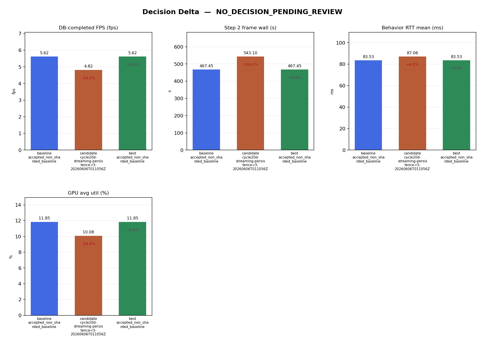

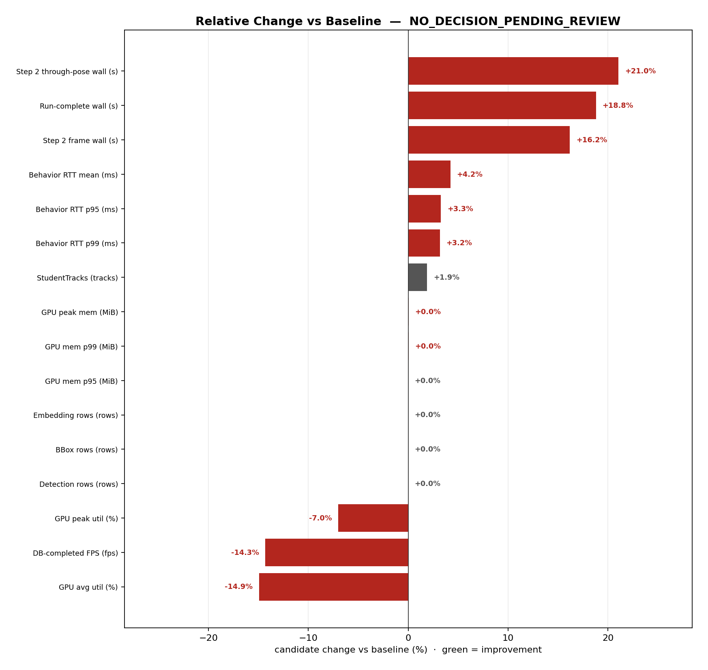

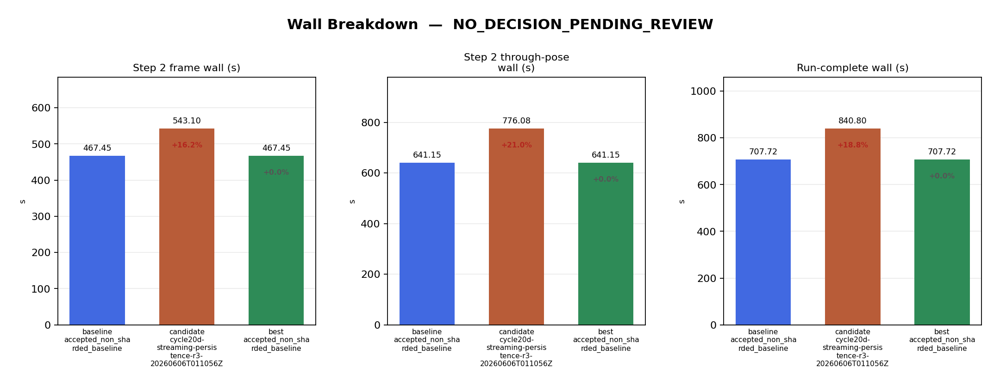

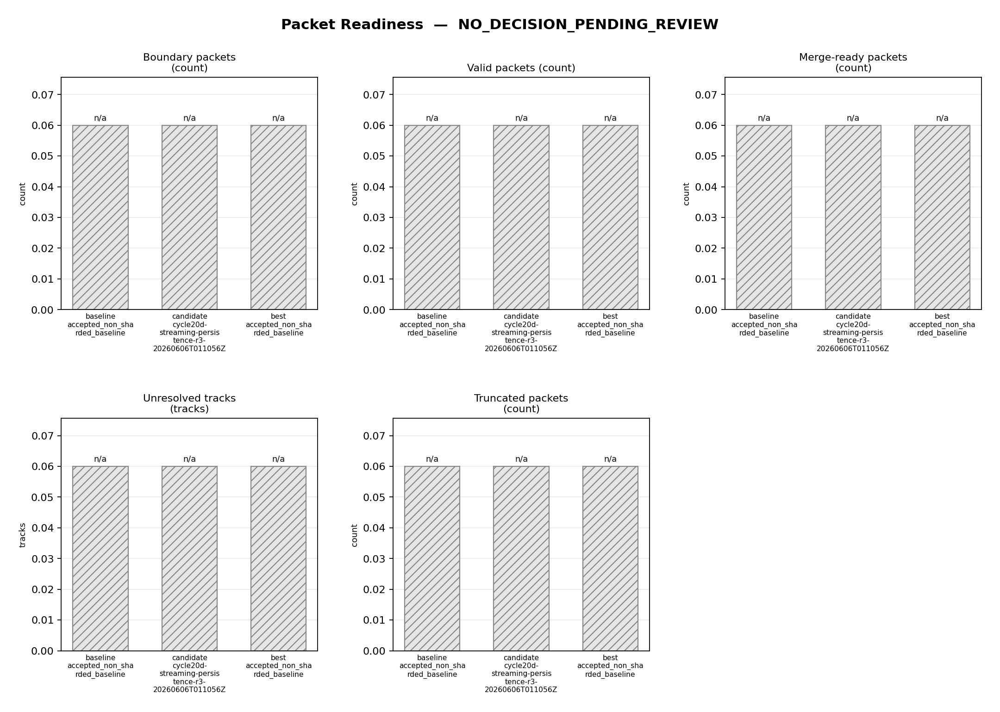

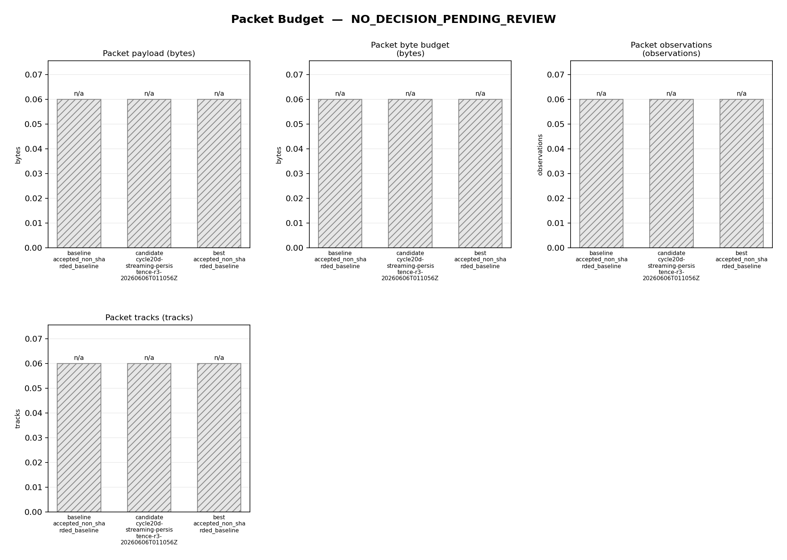

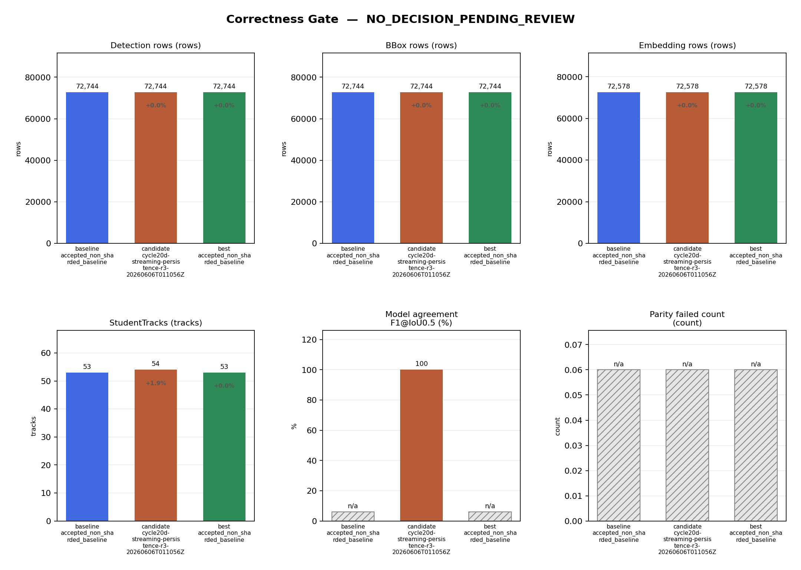

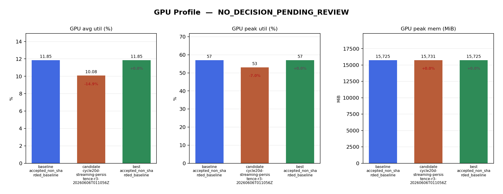

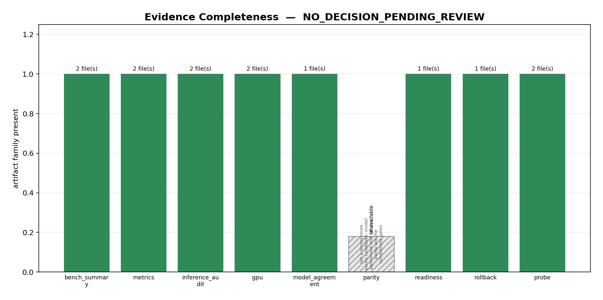

Decision: **NOT ACCEPTED**. Cycle 20.D proved that per-frame persistence can
start while frame inference is still running, and r3 restored DB/model parity
after packet-signature reconciliation. It still fails the optimization gate:
DB-completed FPS regressed `14.30 %`, Step 2 frame wall regressed `16.18 %`,
average GPU utilization regressed `14.93 %`, embedding did not overlap
inference, and Step 3 still reconciled `4449/4541` packets before embeddings.
Do not enable `OFFLINE_STREAM_POST_STAGES=1` by default and do not advance to a
Cycle 21 worker-count matrix from this candidate. Any future post-stage overlap
work needs a different final-tracking-aware persistence design or another
measured bottleneck before a fresh benchmark lock.

Repo-side follow-up on 2026-06-06 added
`OFFLINE_STREAM_POST_STAGE_MODE=final_stable_overlap` behind the same
default-off `OFFLINE_STREAM_POST_STAGES=1` gate. That follow-up has now been
production benchmarked in §51.

## 51. Cycle 20.E Final-Stable Persistence Overlap

Cycle 20.E reran the Cycle 20 post-stage overlap candidate after repairing the
Cycle 20.D r3 root causes. Step 2 callbacks now record packet readiness only;
the authoritative PostgreSQL writes use cloned final-tracking-stable packets
after final tracking assignment and shard filtering. Production drift in the
generated Triton behavior configs was repaired first by rebuilding the accepted
320 Top-K route and binding generated `configs/offline.pbtxt` files to the
same 320 config text.

| Item | Value |
|---|---|
| Status | `PRODUCTION_BENCHMARK_COMPLETE / BENCHMARK_LOCK_RELEASED / NOT_ACCEPTED` |
| Runtime commit | `a9831c90` |
| Replay key | `cycle20e-final-stable-overlap-20260606T092512Z` |
| Job ID | `211f96fa-7cfc-4d57-812e-9573906f41c5` |
| Baseline replay | `cycle15b-pre-shard-baseline-20260603T193531Z` |
| Baseline job | `74561b05-105f-4ca8-aeaf-f510f4f802de` |
| Metrics JSON/MD | `/home/bamby/grad_project/backend/logs/cycle20e-final-stable-overlap-20260606T092512Z/post_stage_timeline_metrics.json` / `.md` |
| Model agreement JSON/MD | `/home/bamby/grad_project/backend/logs/cycle20e-final-stable-overlap-20260606T092512Z/model_agreement_baseline_vs_post_stage_timeline.json` / `.md` |
| Wait snapshot | `/home/bamby/grad_project/backend/logs/cycle20e-final-stable-overlap-20260606T092512Z/post_stage_wait_snapshot.json` |
| Rollback JSON | `/home/bamby/grad_project/backend/logs/cycle20e-final-stable-overlap-20260606T092512Z/rollback_status.json` |
| Runtime probe | `/home/bamby/grad_project/backend/logs/cycle20e-final-stable-overlap-20260606T092512Z/runtime_probe_snapshot.json` |
| Bench summary | `/home/bamby/grad_project/backend/logs/bench_summary_20260606T122535.json` |
| GPU CSV | `/home/bamby/grad_project/backend/logs/gpu_monitor_bench_20260606T122535.csv` |
| Inference audit | `/home/bamby/grad_project/backend/data/videos/211f96fa-7cfc-4d57-812e-9573906f41c5/inference_audit.json` |
| Figure manifest | `docs/figures/benchmark_artifacts/cycle20e-final-stable-overlap-20260606T092512Z/figure_manifest.json` |
| Figure roles | Planner `Cycle 20.E final-stable persistence planner`; implementer `Cycle 20.E final-stable persistence implementer`; generator `tools/prod/prod_generate_cycle_figures.py` |

Performance and lifecycle measurements:

| Metric | Best comparable accepted baseline | Candidate | Delta / result |
|---|---:|---:|---:|
| DB-completed FPS | `5.619787` | `5.290508` | `-5.86 %` |
| DB completed elapsed | `808.038 s` | `858.330 s` | `+6.22 %` |
| Step 2 frame wall | `467.449833 s` | `460.132193 s` | `-1.57 %` |
| Step 2 through-pose wall | `641.154064 s` | `719.937697 s` | `+12.29 %` |
| GPU avg util | `11.846 %` | `12.224 %` | `+3.19 %` |
| GPU peak util | `57.000 %` | `70.000 %` | `+22.81 %` |
| Peak VRAM | `15725 MiB` | `15725 MiB` | no change |
| Behavior call rate | `4.451525 calls/s` | `4.190697 calls/s` | `-5.86 %` |
| Behavior RTT mean | `83.530 ms` | `84.019 ms` | `+0.59 %` |
| Behavior RTT p95 | `129.514 ms` | `130.723 ms` | `+0.93 %` |
| Behavior RTT p99 | `135.533 ms` | `138.155 ms` | `+1.93 %` |
| Embedding created span | `98.578 s` | `99.347 s` | `+0.78 %` |
| First packet ready before inference done | `unavailable` | `true` | readiness marker recorded |
| Persistence starts before inference done | `unavailable` | `true` | final-stable writer overlaps inference |
| Embedding starts before inference done | `unavailable` | `false` | embedding stayed serial |
| Persistence lag after inference done | `unavailable` | `0.000 s` | persistence was already drained |
| Embedding start lag after inference done | `unavailable` | `37.279 s` | still post-inference |
| Embedding wall | `unavailable` | `99.642 s` | unchanged post-stage shape |
| Terminal lag after embedding | `unavailable` | `0.242 s` | terminal marker recorded |

Timeline marker gate:

| Marker | Result |
|---|---|
| `first_persist_packet_ready_at` | `2026-06-06T09:25:41.832829+00:00` |
| `frame_inference_done_at` | `2026-06-06T09:37:41.382230+00:00` |
| `first_frame_persisted_at` | `2026-06-06T09:33:45.935507+00:00` |
| `all_frames_persisted_at` | `2026-06-06T09:36:51.149415+00:00` |
| `first_embedding_eligible_at` | `2026-06-06T09:37:52.909611+00:00` |
| `first_embedding_started_at` | `2026-06-06T09:38:18.661717+00:00` |
| `embedding_done_at` | `2026-06-06T09:39:58.304208+00:00` |
| `terminal_coordinator_done_at` | `2026-06-06T09:39:58.545969+00:00` |
| Wait snapshot | `missing_required=[]`, `unavailable={}` |

Correctness, packet, and rollback gates:

| Gate | Result | Decision impact |
|---|---:|---|
| Processed frames | `4541/4541` | Pass run-completion gate |
| Detection rows | `72750` | `+0.01 %` versus baseline; within row-parity tolerance |
| BBox rows | `72750` | `+0.01 %` versus baseline; within row-parity tolerance |
| Embedding rows | `72584` | `+0.01 %` versus baseline; within row-parity tolerance |
| StudentTracks | `53` | Matches baseline |
| Pose kinematics rows | `19129` | Available; no acceptance gate change |
| Pose override rows | `0` | Available; no override drift |
| Minimum per-model F1@IoU0.5 | `99.766 %` | Pass model-agreement proxy |
| `attention_tracking` boxes | `11770 -> 11775` | `+0.04 %`; within tolerance |
| `hand_raising` boxes | `8799 -> 8801` | `+0.02 %`; within tolerance |
| `person_detection` boxes | `19162 -> 19162` | Exact parity |
| `sitting_standing` boxes | `33013 -> 33012` | Within tolerance |
| Final-stable attempted packets | `4541` | One authoritative final packet per frame |
| Final-stable persisted packets | `4541` | Root-cause repair passed |
| Final-stable failed packets | `0` | Root-cause repair passed |
| Step 3 already-complete packets | `4541` | Step 3 rewrite root cause eliminated |
| Step 3 reconciled packets | `0` | Step 3 rewrite root cause eliminated |
| Streaming skipped existing packets | `4541` | Idempotency guard observed final-stable rows |
| Redis detailed counters | `unavailable` | Reason in manifest: metric not found in supplied artifacts |
| Worker RSS p95/p99 | `unavailable` | Reason in manifest: metric not found in supplied artifacts |
| Tensor parity | `unavailable` | Not a tensor-route candidate; DB/model agreement are the correctness gates |
| Rollback verified | `true` | `OFFLINE_STREAM_POST_STAGES=0`, `OFFLINE_STREAM_POST_STAGE_TIMELINE=0`, and `OFFLINE_STREAM_POST_STAGE_MODE=inline_db` restored |

### 51.1 Figure Evidence

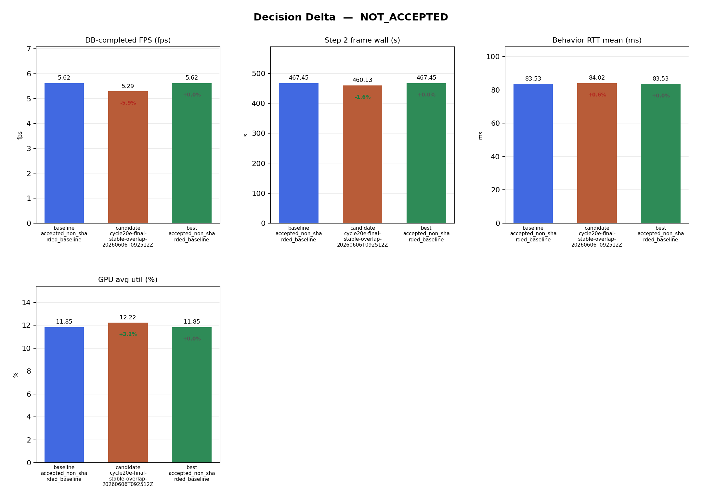

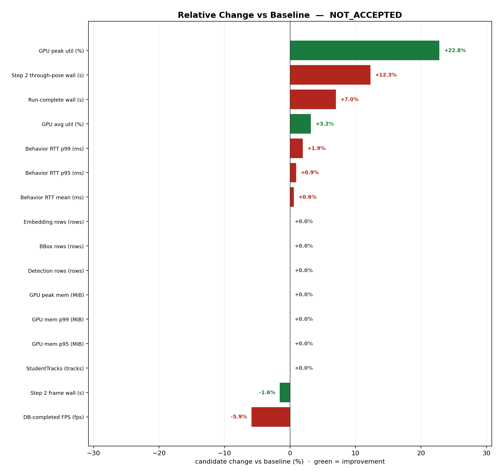

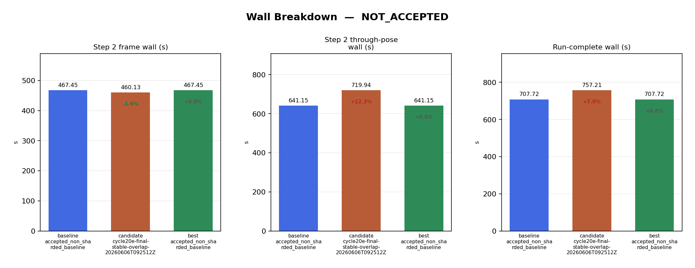

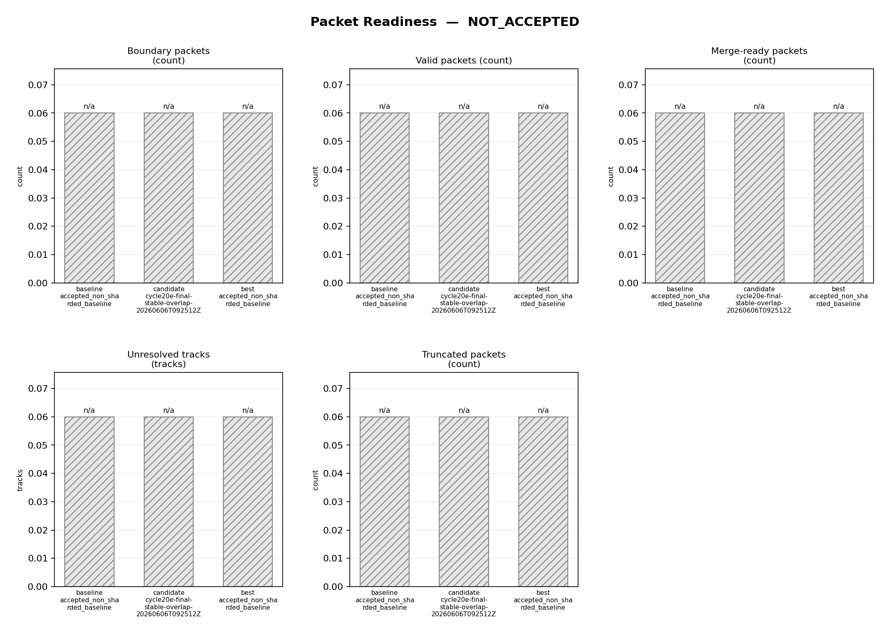

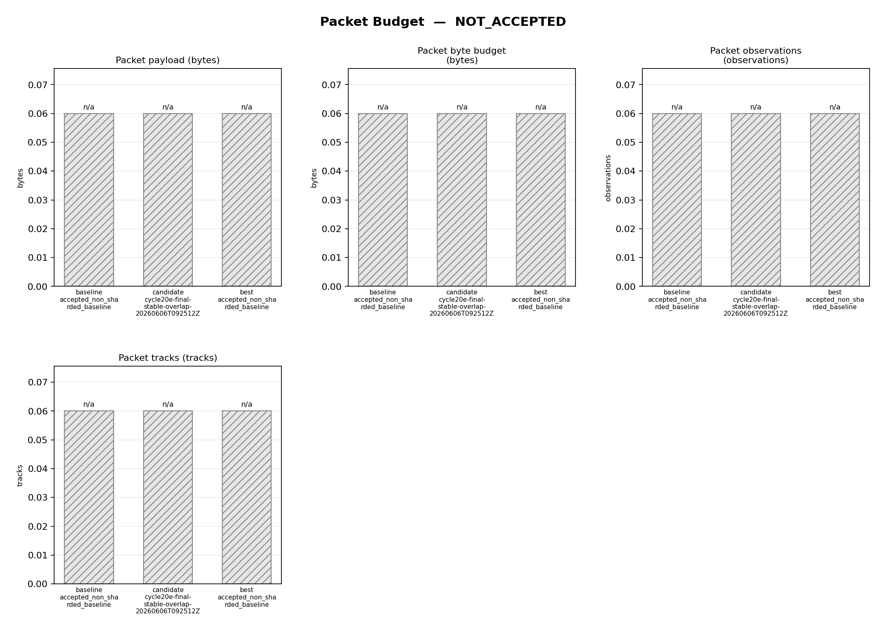

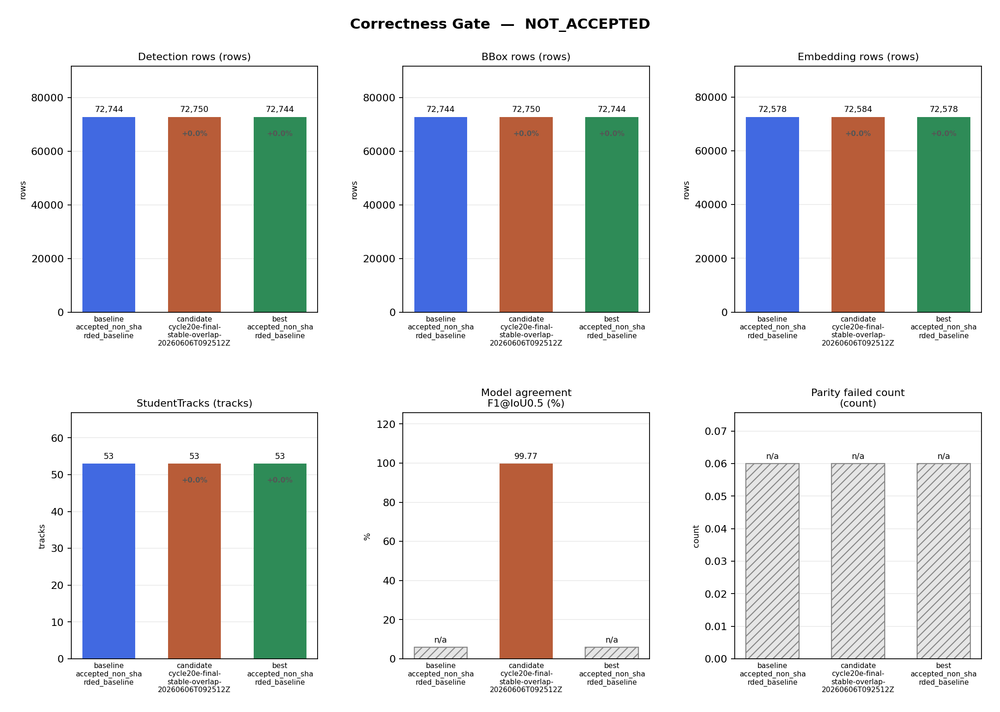

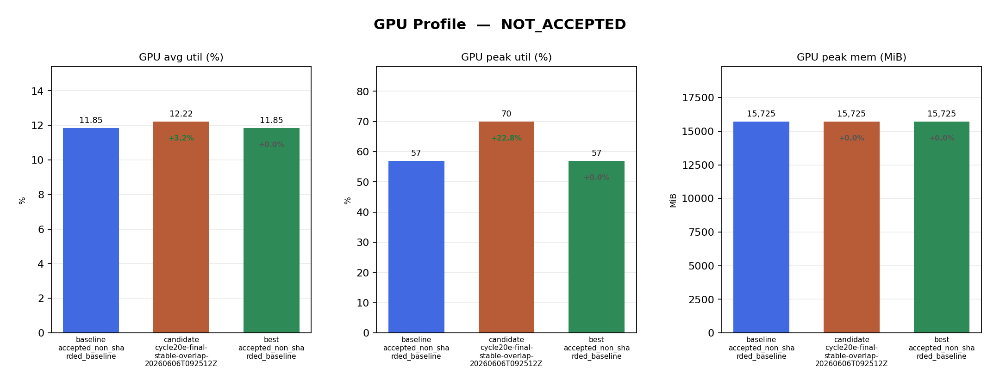

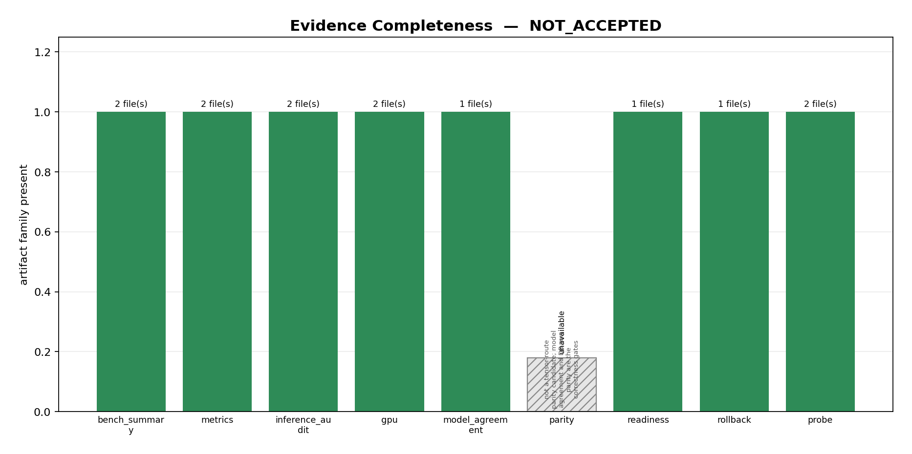

Decision: **NOT ACCEPTED**. Cycle 20.E repaired the Cycle 20.D root causes:
final-stable authoritative packets persisted once per frame, Step 3
reconciliation fell to `0`, no final-stable write failed, DB/model parity
remained within tolerance, and rollback restored the default serial profile.
It still fails the optimization gate. DB-completed FPS regressed `5.86 %`,
total DB elapsed regressed `6.22 %`, Step 2 through-pose wall regressed
`12.29 %`, behavior call rate fell `5.86 %`, and embedding still started
`37.279 s` after frame inference finished. Keep
`OFFLINE_STREAM_POST_STAGES=0`, `OFFLINE_STREAM_POST_STAGE_TIMELINE=0`, and
`OFFLINE_STREAM_POST_STAGE_MODE=inline_db` as the production default. Cycle 21
worker-count scaling remains blocked until a separate benchmark proves
independent work that extra workers can consume.

## 52. Instrumented Accepted-Baseline Reproducibility Benchmark

This run re-executed the last accepted offline throughput profile with
repo-side instrumentation enabled. It is a reproducibility and bottleneck
observability run, not a new optimization-candidate decision. The accepted
throughput baseline remains Cycle 14.B2
`cycle14b-cross-frame-batch16-r2-20260603T150000Z`.

| Item | Value |
|---|---|
| Status | `REPRODUCIBILITY_BENCHMARK_COMPLETE / NO_NEW_OPTIMIZATION_DECISION` |
| Runtime commit | `aef117a5` |
| Replay key | `instrumented-accepted-baseline-20260606T1352Z` |
| Job ID | `dc535a15-de11-4b20-9454-080ab325af82` |
| Baseline replay | `cycle14b-cross-frame-batch16-r2-20260603T150000Z` |
| Baseline job | `6b42a557-b954-4954-a2f8-de54634229eb` |
| Metrics JSON/MD | `/home/bamby/grad_project/backend/logs/instrumented-accepted-baseline-20260606T1352Z/instrumented_accepted_metrics.json` / `.md` |
| Baseline metrics JSON/MD | `/home/bamby/grad_project/backend/logs/instrumented-accepted-baseline-20260606T1352Z/baseline_accepted_metrics.json` / `.md` |
| Model agreement JSON/MD | `/home/bamby/grad_project/backend/logs/instrumented-accepted-baseline-20260606T1352Z/model_agreement_accepted_vs_instrumented.json` / `.md` |
| Instrumentation dir | `/home/bamby/grad_project/backend/logs/instrumented-accepted-baseline-20260606T1352Z/instrumentation` |
| Rollback JSON | `/home/bamby/grad_project/backend/logs/instrumented-accepted-baseline-20260606T1352Z/rollback_status.json` |
| Figure manifest | `docs/figures/benchmark_artifacts/instrumented-accepted-baseline-20260606T1352Z/figure_manifest.json` |
| Figure roles | Planner `Instrumented accepted-baseline reproducibility planner`; implementer `Instrumented accepted-baseline reproducibility implementer`; generator `tools/prod/prod_generate_cycle_figures.py`; one agent performed both lanes because this was a single-agent reproducibility run. |

Performance and instrumentation measurements:

| Metric | Last accepted baseline | Instrumented rerun | Delta / result |
|---|---:|---:|---:|
| Source video nominal FPS | `30.000` | `30.000` | input media rate, not processing throughput |
| DB-completed FPS | `5.680314` | `5.425115` | `-4.49 %` |
| DB completed elapsed | `799.428 s` | `837.033 s` | `+4.70 %` |
| Step 2 frame wall | `462.188348 s` | `453.120390 s` | `-1.96 %` |
| Step 2 through-pose wall | `633.939294 s` | `680.382658 s` | `+7.33 %` |
| Step 2 pose-tail-only wall | `unavailable` | `227.262268 s` | new layer-throughput measurement |
| Step 3 persistence wall | `40.601407 s` | `30.446074 s` | `-25.01 %` |
| Step 4 render wall | `unavailable` | `25.860318 s` | new audit marker |
| Run-complete wall | `700.368401 s` | `736.758104 s` | `+5.20 %` |
| Behavior call rate | `4.499469 calls/s` | `4.297322 calls/s` | `-4.49 %` |
| Behavior RTT mean | `84.171 ms` | `85.778 ms` | `+1.91 %` |
| Behavior RTT p95 | `130.802 ms` | `133.209 ms` | `+1.84 %` |
| Behavior RTT p99 | `137.384 ms` | `141.540 ms` | `+3.03 %` |
| GPU avg util | `12.168 %` | `12.403 %` | `+1.93 %` |
| GPU peak util | `51.000 %` | `57.000 %` | `+11.76 %` |
| Peak VRAM | `15731 MiB` | `15725 MiB` | no material change |

Layer-throughput measurements from the instrumented run:

| Layer | Throughput | Count | Wall | Unavailable reason |
|---|---:|---:|---:|---|
| Source video nominal | `30.000 frames/s` | `4541` | `151.366667 s` |  |
| Job DB completed | `5.425115 frames/s` | `4541` | `837.033 s` |  |
| Step 1 primary tracking | `unavailable` | `4541` | `unavailable` | `step1_audit_timestamps_missing_or_skipped` |
| Step 2 frame inference loop | `10.021619 frames/s` | `4541` | `453.120390 s` |  |
| Step 2 through pose tail | `6.674185 frames/s` | `4541` | `680.382658 s` |  |
| Step 2 pose tail only | `19.981320 frames/s` | `4541` | `227.262268 s` |  |
| Step 2 decode stage sum | `75025.608829 frames/s` | `4541` | `0.060526 s` |  |
| Step 2 inference stage sum | `5.584431 frames/s` | `4541` | `813.153619 s` |  |
| Step 2 postprocess stage sum | `3.049727 frames/s` | `4541` | `1488.985740 s` |  |
| Step 2 preprocess stage sum | `162.279335 frames/s` | `4541` | `27.982614 s` |  |
| Step 3 persistence | `149.148951 frames/s` | `4541` | `30.446074 s` |  |
| Cycle 20 post-stage persistence | `unavailable` | `0` | `unavailable` | `cycle20_post_stage_timeline_missing` |
| Embedding stage frame equivalent | `45.967017 frames/s` | `4541` | `98.788224 s` |  |
| Embedding stage work items | `1468.950388 embedding-items/s` | `145115` | `98.788224 s` |  |
| Step 4 render | `175.597222 frames/s` | `4541` | `25.860318 s` |  |
| Telemetry model calls | `6.820520 calls/s` | `5709` | `837.033 s` |  |
| DB detection rows | `86.914136 rows/s` | `72750` | `837.033 s` |  |
| DB bbox rows | `86.914136 rows/s` | `72750` | `837.033 s` |  |
| DB embedding rows | `86.715816 rows/s` | `72584` | `837.033 s` |  |
| DB pose-kinematics rows | `22.853340 rows/s` | `19129` | `837.033 s` |  |

Correctness and instrumentation gates:

| Gate | Result | Decision impact |
|---|---:|---|
| Processed frames | `4541/4541` | Pass run-completion gate |
| Detection rows | `72744 -> 72750` | `+0.01 %`; within row-parity tolerance |
| BBox rows | `72744 -> 72750` | `+0.01 %`; within row-parity tolerance |
| Embedding rows | `72578 -> 72584` | `+0.01 %`; within row-parity tolerance |
| StudentTracks | `53 -> 53` | Exact parity |
| Minimum per-model F1@IoU0.5 | `99.766 %` | Pass model-agreement proxy |
| `attention_tracking` boxes | `11770 -> 11775` | `+0.04 %`; within tolerance |
| `hand_raising` boxes | `8799 -> 8801` | `+0.02 %`; within tolerance |
| `person_detection` boxes | `19162 -> 19162` | Exact parity |
| `sitting_standing` boxes | `33013 -> 33012` | Within tolerance |
| Redis Stream evidence | `enabled=true`, `written=4729`, `xlen=1014`, `errors=0`, `fallbacks=0` | Pass stream-evidence capture |
| py-spy Celery attach | `unavailable` | Production ptrace permission denied; collector py-spy profile succeeded |
| pyinstrument collector profile | `available` | `pyinstrument_collect_metrics.json` produced |
| Nsight Systems collector profile | `available` | `nsys_collect_metrics.nsys-rep` produced |
| Rollback verified | `true` | `BENCHMARK_REDIS_STREAM_EVENTS=0`, `POSE_TAIL_PROFILING=0`, and `EMBEDDING_STAGE_PROFILING=0` restored |

### 52.1 Figure Evidence

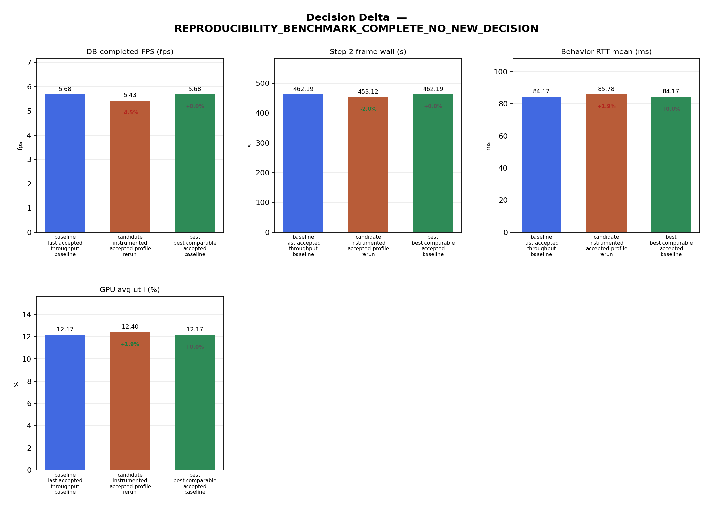

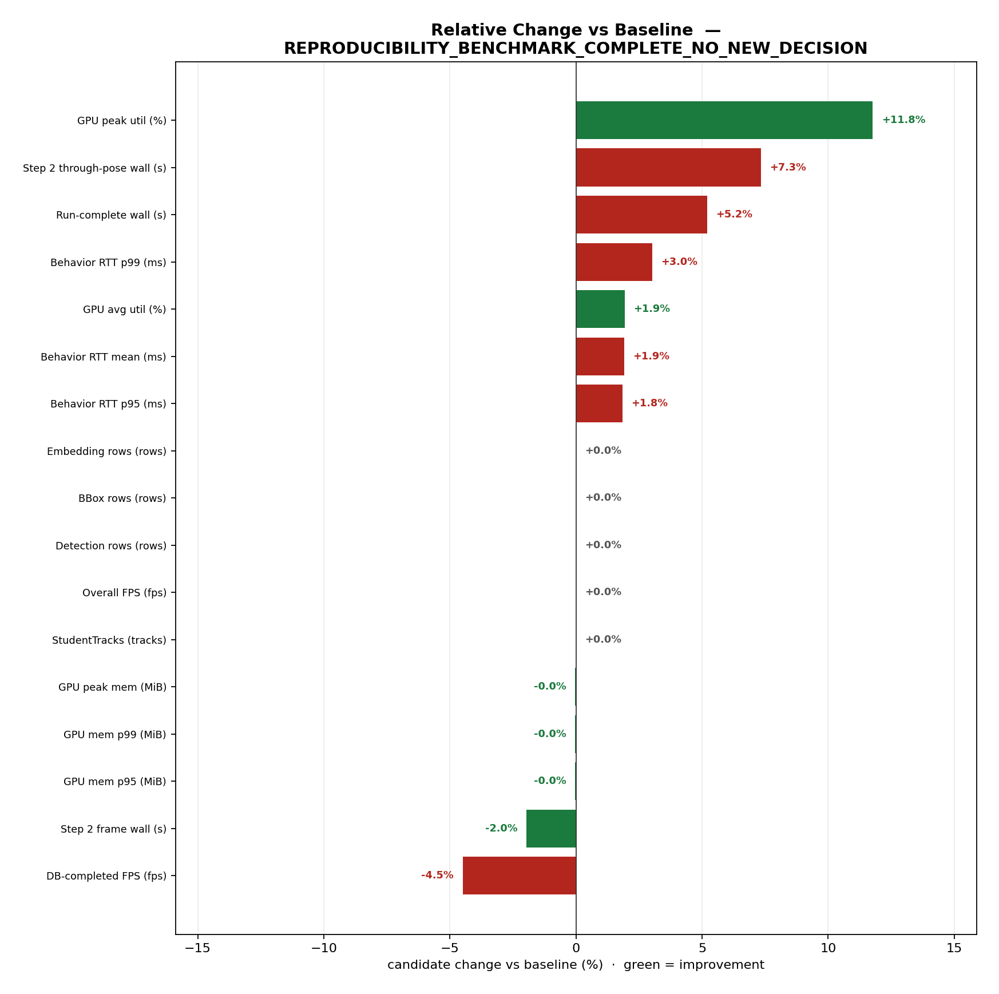

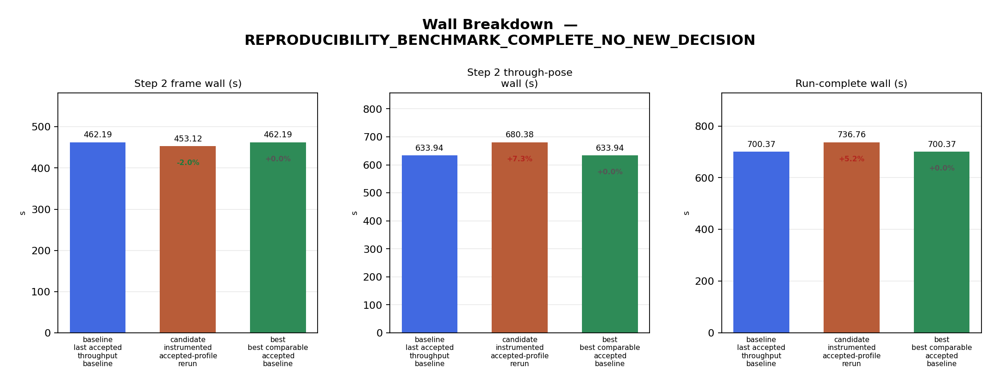

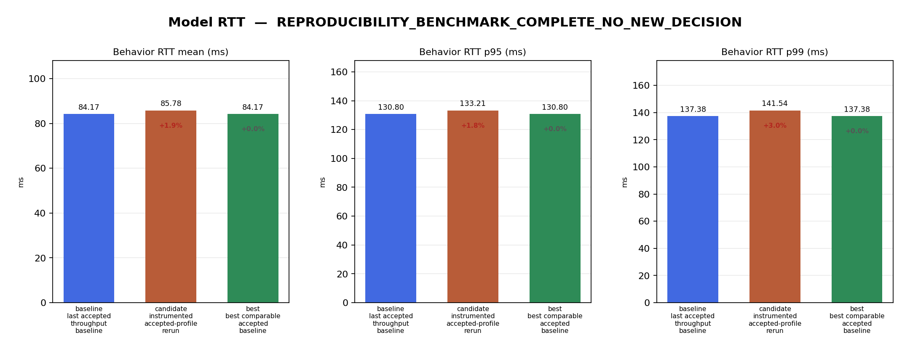

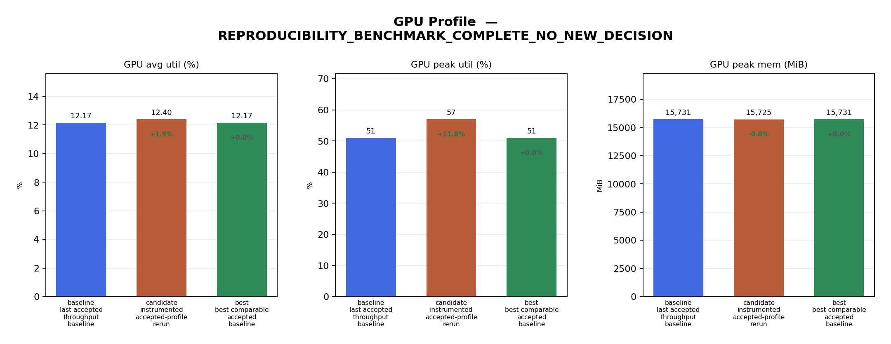

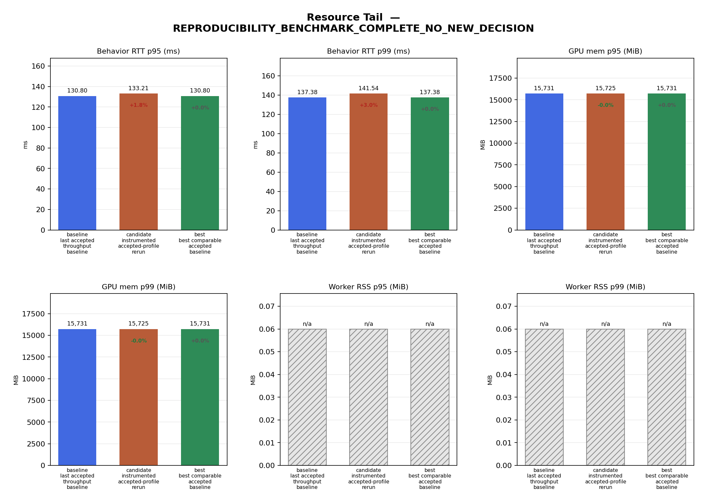

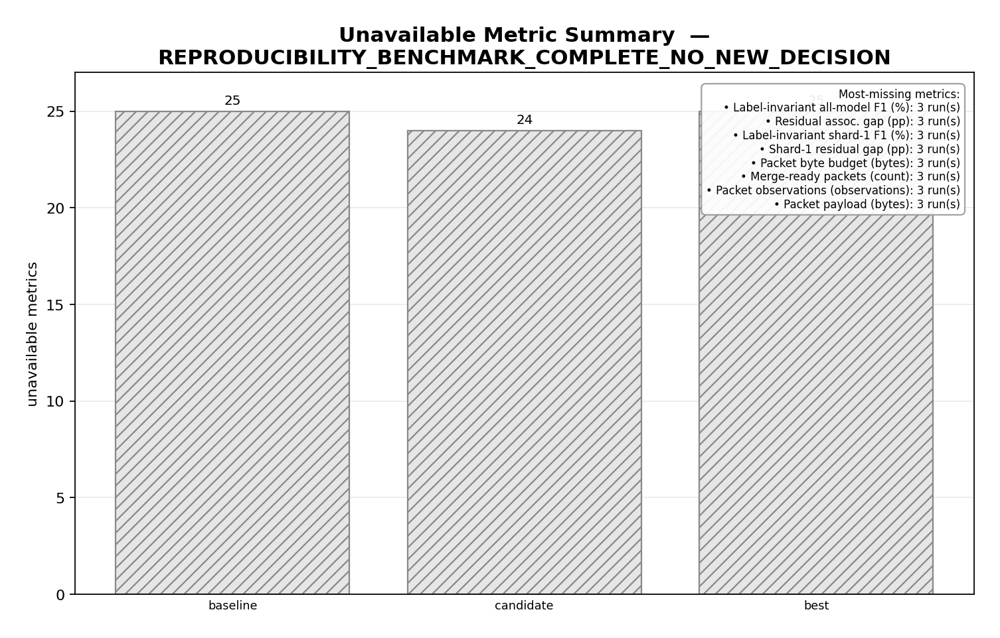

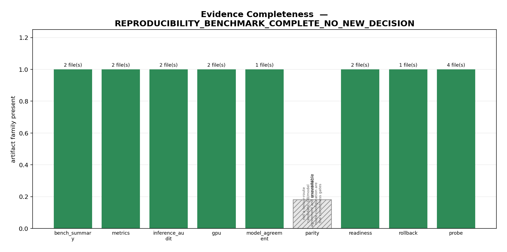

Decision: **NO NEW OPTIMIZATION DECISION**. The accepted throughput profile
completed under the instrumentation wrapper, with DB/model parity preserved and
the requested repo-side evidence tools producing artifacts. The run is slower
than the last accepted baseline at the end-to-end DB-completed level
(`-4.49 %` FPS), while Step 2 frame wall alone improved `1.96 %`. Treat this as
an instrumentation/reproducibility result, not a replacement accepted baseline.
The active production profile remains the last accepted throughput profile, and
evidence-only profiling flags were rolled back after capture.

## 53. No-Sudo Instrumented Accepted-Baseline Reproducibility Benchmark

This run re-executed the last accepted offline throughput profile after the
instrumentation toolchain was installed without `sudo`. Production host CLIs
that were missing from the system package set were extracted under
`backend/.tools` from downloaded `.deb` packages, and the benchmark wrapper
prepended `backend/.tools/bin` to `PATH`. This is a reproducibility and
observability benchmark, not a new optimization-candidate decision.

| Item | Value |
|---|---|
| Status | `REPRODUCIBILITY_BENCHMARK_COMPLETE / NO_NEW_OPTIMIZATION_DECISION` |
| Runtime commit | `aef117a5` |
| Replay key | `instrumented-accepted-nosudo-20260607T0752Z` |
| Job ID | `f6238d53-e86f-4bdf-b7c9-c5545f711911` |
| Baseline replay | `cycle14b-cross-frame-batch16-r2-20260603T150000Z` |
| Baseline job | `6b42a557-b954-4954-a2f8-de54634229eb` |
| Metrics JSON/MD | `/home/bamby/grad_project/backend/logs/instrumented-accepted-nosudo-20260607T0752Z/instrumented_accepted_metrics.json` / `.md` |
| Baseline metrics JSON/MD | `/home/bamby/grad_project/backend/logs/instrumented-accepted-nosudo-20260607T0752Z/baseline_accepted_metrics.json` / `.md` |
| Model agreement JSON/MD | `/home/bamby/grad_project/backend/logs/instrumented-accepted-nosudo-20260607T0752Z/model_agreement_accepted_vs_instrumented.json` / `.md` |
| Tool install/check evidence | `/home/bamby/grad_project/backend/logs/instrumented-accepted-nosudo-20260607T0752Z/instrumentation/instrumentation_tools_20260607T075039Z.json` / `.md` |
| Pre/post tool checks | `/home/bamby/grad_project/backend/logs/instrumented-accepted-nosudo-20260607T0752Z/instrumentation/instrumentation_precheck.json` and `instrumentation_postcheck.json` |
| Rollback JSON | `/home/bamby/grad_project/backend/logs/instrumented-accepted-nosudo-20260607T0752Z/rollback_status.json` |
| Figure manifest | `docs/figures/benchmark_artifacts/instrumented-accepted-nosudo-20260607T0752Z/figure_manifest.json` |
| Figure roles | Planner `Instrumented accepted-baseline reproducibility planner`; implementer `Instrumented accepted-baseline reproducibility implementer`; generator `tools/prod/prod_generate_cycle_figures.py`; one agent performed both lanes because this was a single-agent reproducibility run. |

No-sudo tool readiness:

| Tool | Production result |
|---|---|
| `uv` | `uv 0.11.19`; path `/home/bamby/.local/bin/uv` |
| `python` | `Python 3.12.3`; path `/home/bamby/grad_project/backend/.venv/bin/python3` |
| `psutil` | `7.2.2` |
| `py-spy` | `py-spy 0.4.2` |
| `pyinstrument` | `pyinstrument 5.1.2` |
| `nvidia-smi` | RTX 5090, driver `570.211.01`, VRAM `32607 MiB` |
| `nsys` | Nsight Systems `2024.6.2.225`; path `/usr/local/bin/nsys` |
| `psql` | `PostgreSQL 16.14`; path `/home/bamby/grad_project/backend/.tools/bin/psql` |
| `pg_isready` | `PostgreSQL 16.14`; path `/home/bamby/grad_project/backend/.tools/bin/pg_isready` |
| `redis-cli` | `redis-cli 7.0.15`; path `/home/bamby/grad_project/backend/.tools/bin/redis-cli` |
| `curl` | `curl 8.5.0`; path `/usr/bin/curl` |

Performance and instrumentation measurements:

| Metric | Last accepted baseline | No-sudo instrumented rerun | Delta / result |
|---|---:|---:|---:|
| Source video nominal FPS | `30.000` | `30.000` | input media rate, not processing throughput |
| DB-completed FPS | `5.680314` | `5.255214` | `-7.48 %` |
| DB completed elapsed | `799.428 s` | `864.094 s` | `+8.09 %` |
| Step 2 frame wall | `462.188348 s` | `462.996777 s` | `+0.17 %` |
| Step 2 through-pose wall | `633.939294 s` | `705.429605 s` | `+11.28 %` |
| Step 2 pose-tail-only wall | `unavailable` | `242.432828 s` | new layer-throughput measurement |
| Step 3 persistence wall | `40.601407 s` | `32.096389 s` | `-20.95 %` |
| Step 4 render wall | `unavailable` | `25.817729 s` | audit marker available |
| Run-complete wall | `700.368401 s` | `763.407460 s` | `+9.00 %` |
| Behavior call rate | `4.499469 calls/s` | `4.162740 calls/s` | `-7.48 %` |
| Behavior RTT mean | `84.171 ms` | `84.273 ms` | `+0.12 %` |
| Behavior RTT p95 | `130.802 ms` | `130.547 ms` | `-0.19 %` |
| Behavior RTT p99 | `137.384 ms` | `136.547 ms` | `-0.61 %` |
| GPU avg util | `12.168 %` | `11.276 %` | `-7.33 %` |
| GPU peak util | `51.000 %` | `53.000 %` | `+3.92 %` |
| Peak VRAM | `15731 MiB` | `15731 MiB` | no change |

Layer-throughput measurements from the no-sudo instrumented run:

| Layer | Throughput | Count | Wall | Unavailable reason |
|---|---:|---:|---:|---|
| Source video nominal | `30.000 frames/s` | `4541` | `151.366667 s` |  |
| Job DB completed | `5.255215 frames/s` | `4541` | `864.094 s` |  |
| Step 1 primary tracking | `unavailable` | `4541` | `unavailable` | `step1_audit_timestamps_missing_or_skipped` |
| Step 2 frame inference loop | `9.807844 frames/s` | `4541` | `462.996777 s` |  |
| Step 2 through pose tail | `6.437212 frames/s` | `4541` | `705.429605 s` |  |
| Step 2 pose tail only | `18.730962 frames/s` | `4541` | `242.432828 s` |  |
| Step 3 persistence | `141.480090 frames/s` | `4541` | `32.096389 s` |  |
| Embedding stage frame equivalent | `45.755693 frames/s` | `4541` | `99.244480 s` |  |
| Embedding stage work items | `1462.197192 embedding-items/s` | `145115` | `99.244480 s` |  |
| Step 4 render | `175.886888 frames/s` | `4541` | `25.817729 s` |  |
| Telemetry model calls | `6.606920 calls/s` | `5709` | `864.094 s` |  |
| DB detection rows | `84.192229 rows/s` | `72750` | `864.094 s` |  |
| DB bbox rows | `84.192229 rows/s` | `72750` | `864.094 s` |  |
| DB embedding rows | `84.000120 rows/s` | `72584` | `864.094 s` |  |
| DB pose-kinematics rows | `22.137638 rows/s` | `19129` | `864.094 s` |  |

Correctness and instrumentation gates:

| Gate | Result | Decision impact |
|---|---:|---|
| Processed frames | `4541/4541` | Pass run-completion gate |
| Detection rows | `72744 -> 72750` | `+0.01 %`; within row-parity tolerance |
| BBox rows | `72744 -> 72750` | `+0.01 %`; within row-parity tolerance |
| Embedding rows | `72578 -> 72584` | `+0.01 %`; within row-parity tolerance |
| StudentTracks | `53 -> 53` | Exact parity |
| Minimum per-model F1@IoU0.5 | `99.766 %` | Pass model-agreement proxy |
| `attention_tracking` boxes | `11770 -> 11775` | `+0.04 %`; within tolerance |
| `hand_raising` boxes | `8799 -> 8801` | `+0.02 %`; within tolerance |
| `person_detection` boxes | `19162 -> 19162` | Exact parity |
| `sitting_standing` boxes | `33013 -> 33012` | Within tolerance |
| Redis Stream evidence | `enabled=true`, `written=4729`, `xlen=1013`, `errors=0`, `fallbacks=0` | Pass stream-evidence capture |
| py-spy Celery attach | `unavailable` | Linux ptrace permission denied without elevated privileges; collector py-spy profile succeeded |
| pyinstrument collector profile | `available` | `pyinstrument_collect_metrics.json` produced |
| Nsight Systems collector profile | `available` | `nsys_collect_metrics.nsys-rep` produced; CPU context switch tracing unsupported by host kernel |
| Rollback verified | `true` | `BENCHMARK_REDIS_STREAM_EVENTS=0`, `POSE_TAIL_PROFILING=0`, and `EMBEDDING_STAGE_PROFILING=0` restored |

### 53.1 Figure Evidence

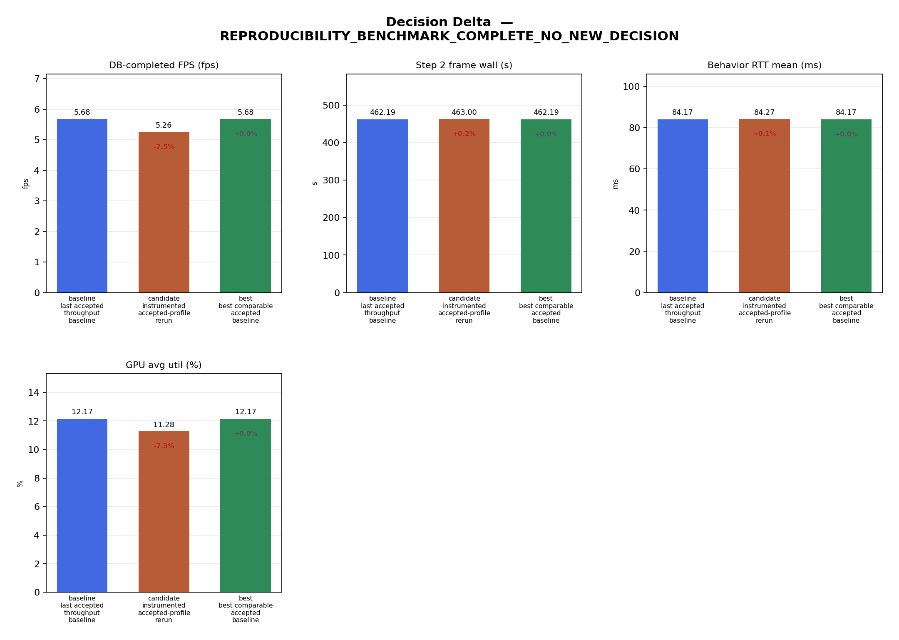

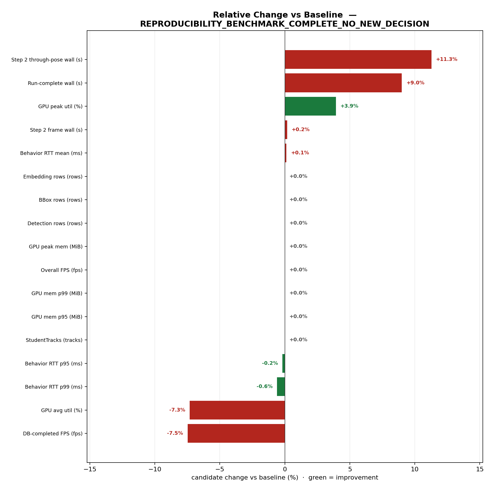

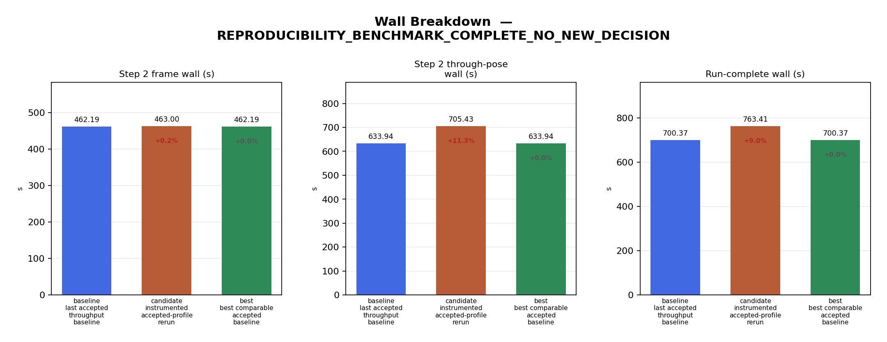

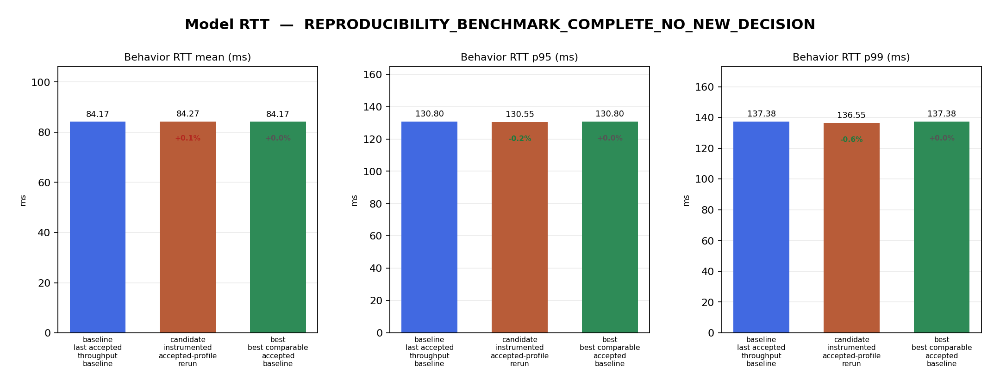

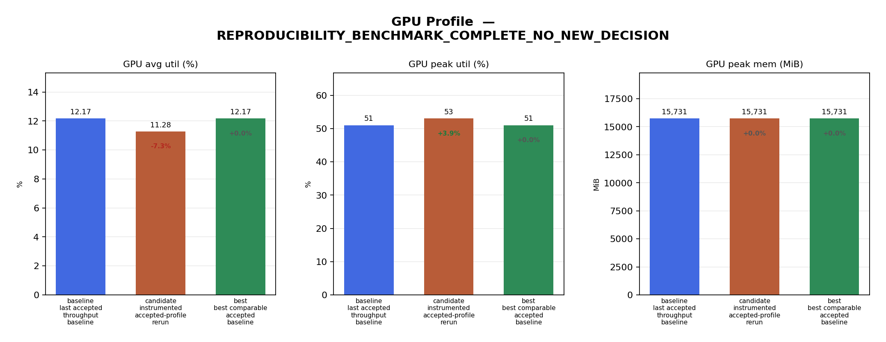


Decision: **NO NEW OPTIMIZATION DECISION**. The no-sudo instrumentation
toolchain is installed and verified locally and on production, and the last
accepted throughput profile completed under the instrumented wrapper with
DB/model parity preserved. End-to-end DB-completed FPS was lower than the
accepted baseline (`-7.48 %`), so this run must remain an observability and
reproducibility result rather than a replacement baseline.

---

*Updated from production run on 2026-06-07. Update this file after each major pipeline change or hardware migration.*

---

## Cycle 014 YOLOE-Scene-SRVL — Production Readiness Notes

**Branch:** `014-yoloe-scene-srvl`  
**Status:** `staged_local_only` — disabled-by-default (`YOLOE_SCENE_ENABLED=0`, `SRVL_ENABLED=0`)  
**Date:** 2026-06-07

### Acceptance gates pending on production

| Gate | ID | Requirement | Status |
|---|---|---|---|
| PixiJS renderer FPS | SC-010 | ≥30 FPS, no freeze >500 ms | Pending production run |
| SRVL 128-object CPU | SC-011 | <200 ms wall time | Unit test guard in place |
| Metrics completeness | SC-012 | All required fields present or marked unavailable | Tool: `prod_collect_yoloe_scene_metrics.py` |

### Production tools

| Script | Purpose |
|---|---|
| `tools/prod/prod_run_yoloe_scene_benchmark.sh` | Run YOLOE-scene benchmark |
| `tools/prod/prod_collect_yoloe_scene_metrics.py` | Collect DB/GPU/CPU/Redis/artifact metrics |
| `tools/prod/prod_generate_yoloe_scene_figures.py` | Generate benchmark figures from JSON |
| `tools/prod/prod_benchmark_scene_renderers.sh` | Run frontend renderer benchmark (SC-010) |
| `tools/prod/prod_rollback_yoloe_scene.sh` | Rollback: set both flags to 0 |

### Missing metric reasons (FR-026)

Metrics that may be unavailable and their expected reasons:

| Metric | Unavailable reason |
|---|---|
| GPU utilisation | `nvidia-smi not found` or not applicable |
| CPU/RSS | `psutil not installed` |
| Redis RTT | Django settings missing REDIS_URL |
| Artifact sizes | `--artifact-dir not provided` or path not found |
| Frontend FPS | SC-010 benchmark not yet run on production |

*Updated: 2026-06-07 (cycle 014 production readiness pass)*
