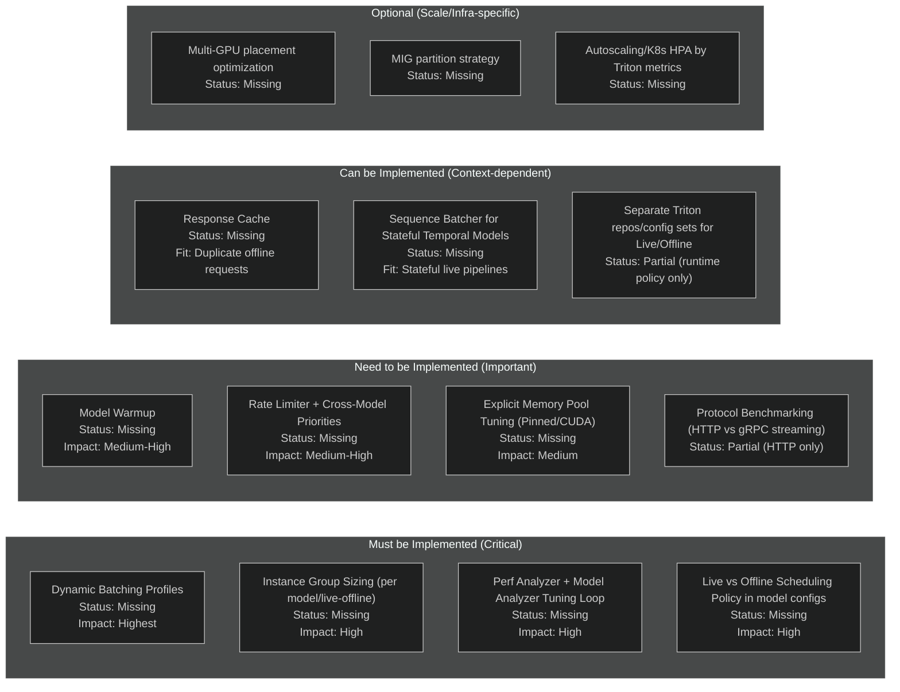
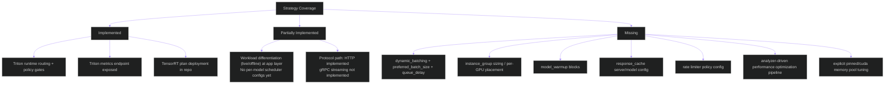
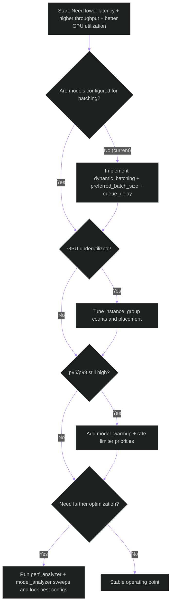

# Triton Strategy Gap Analysis Matrix

**Last updated:** 2026-05-15

## Objective
Compare recommended Triton optimization strategies against what is currently **Implemented**, **Partially Implemented**, or **Missing** in this codebase, then classify each into:
- **Must be Implemented**
- **Need to be Implemented**
- **Can be Implemented**
- **Optional**

---

## Current State Summary (Evidence-Based)

- Triton runtime integration and policy gating are implemented:
  - [runtime_policy.py](E:\grad_project\backend\apps\pipeline\services\runtime_policy.py)
  - [tasks.py](E:\grad_project\backend\apps\video_analysis\tasks.py)
- Triton deployment and metrics endpoints are implemented:
  - [docker-compose.dev.yml](E:\grad_project\docker-compose.dev.yml)
- Model configs are present, but **batching/instances/warmup/cache sections are absent**:
  - [person_detector config](E:\grad_project\backend\models\triton_repository\person_detector\config.pbtxt)
  - [posture_model config](E:\grad_project\backend\models\triton_repository\posture_model\config.pbtxt)
  - [gaze_horizontal config](E:\grad_project\backend\models\triton_repository\gaze_horizontal_model\config.pbtxt)
  - [gaze_vertical config](E:\grad_project\backend\models\triton_repository\gaze_vertical_model\config.pbtxt)
  - [gaze_depth config](E:\grad_project\backend\models\triton_repository\gaze_depth_model\config.pbtxt)
- Client protocol is HTTP-based Triton v2 (no gRPC client path yet):
  - [triton_client.py](E:\grad_project\backend\apps\pipeline\services\triton_client.py)

---

## Decision Matrix (Mermaid)

---

## Implementation Coverage Matrix

---

## Critical Decision Path (What to do first)

---

## Strategy-by-Strategy Classification

| Strategy | Current Status | Classification | Why |
|---|---|---|---|
| Dynamic batching (`dynamic_batching`) | Missing | Must | Biggest throughput/utilization lever; currently `max_batch_size: 0` configs without batch scheduler sections |
| Per-model queue delay tuning | Missing | Must | Required to balance live latency vs offline throughput |
| Instance groups (`instance_group`) | Missing | Must | Needed for concurrency scaling and better GPU occupancy |
| Perf Analyzer + Model Analyzer loop | Missing | Must | No empirical config search workflow currently enforced |
| Live/Offline config split at model scheduler level | Partial | Must | App-level split exists, scheduler-level split absent |
| Model warmup (`model_warmup`) | Missing | Need | Reduces cold-start latency spikes |
| Rate limiter priorities | Missing | Need | Protects critical live models under contention |
| Explicit memory pool tuning | Missing | Need | Better transfer stability and memory behavior at scale |
| HTTP vs gRPC streaming benchmarking | Partial | Need | HTTP exists; no measured protocol decision for live streaming |
| Response cache | Missing | Can | Useful only when repeated inputs are common |
| Sequence batcher | Missing | Can | Valuable if stateful temporal inference is introduced |
| Separate Triton repos for profile-specific optimization | Partial | Can | Runtime policy exists; per-profile Triton configs do not |
| Multi-GPU placement/MIG/autoscaling | Missing | Optional | Infra-scale dependent, not mandatory for single-GPU setups |

---

## Recommended Immediate Execution Order

1. Implement dynamic batching + queue policies for each model.
2. Add instance groups and benchmark 1..N per model.
3. Run Perf Analyzer/Model Analyzer and lock latency/throughput SLO profiles for:
   - Live profile (low queue delay, low p99)
   - Offline profile (higher throughput, acceptable p99)
4. Add warmup and rate limiter.
5. Evaluate gRPC streaming for live workload.
