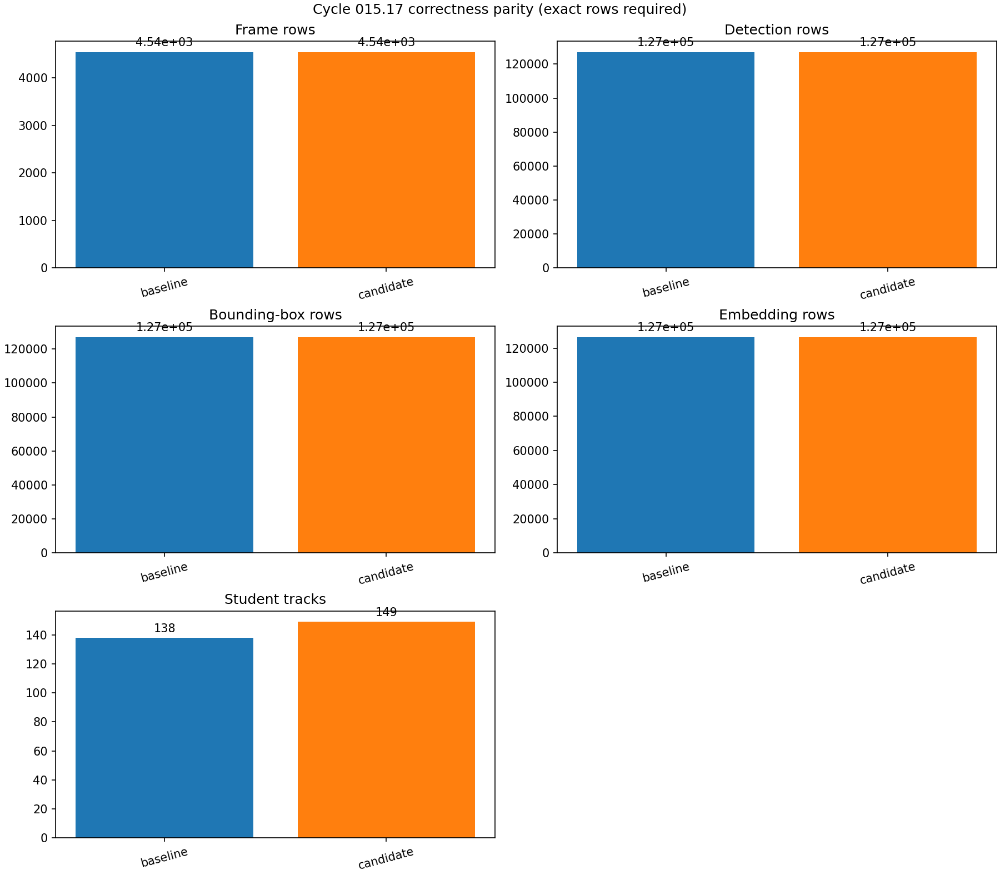
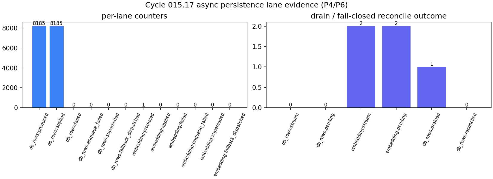
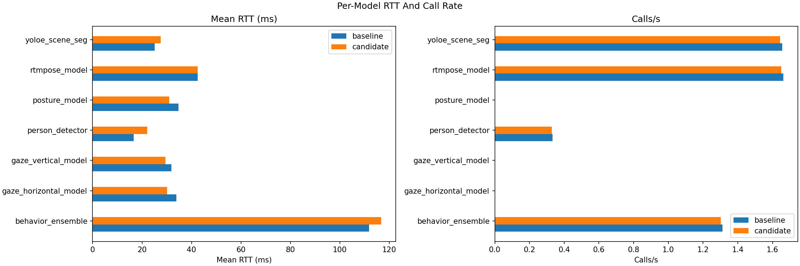
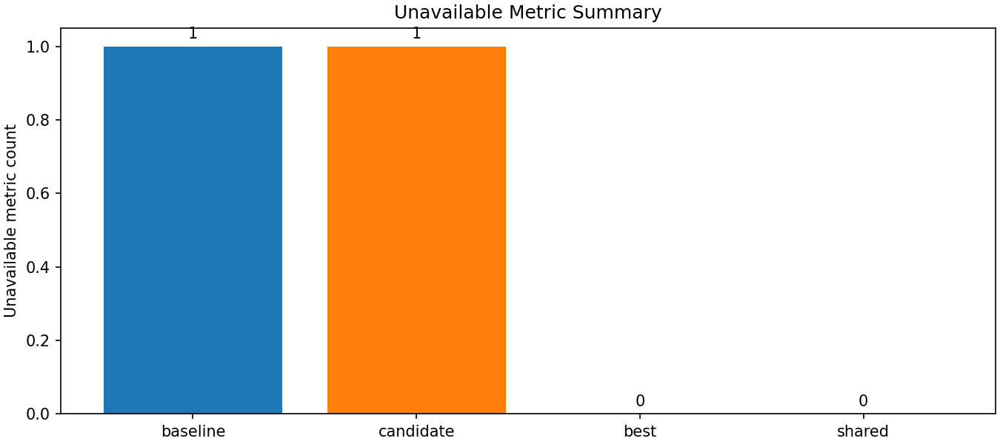
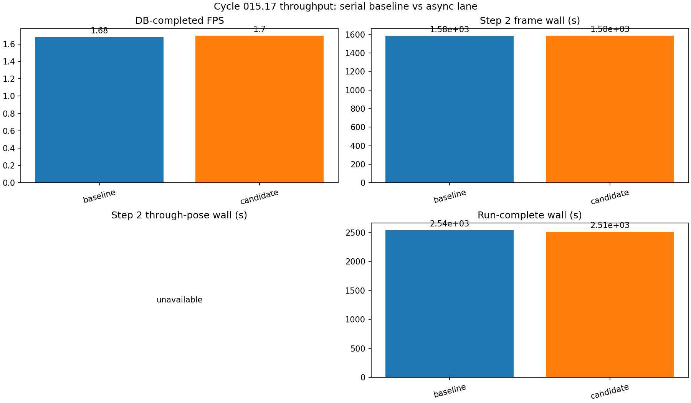
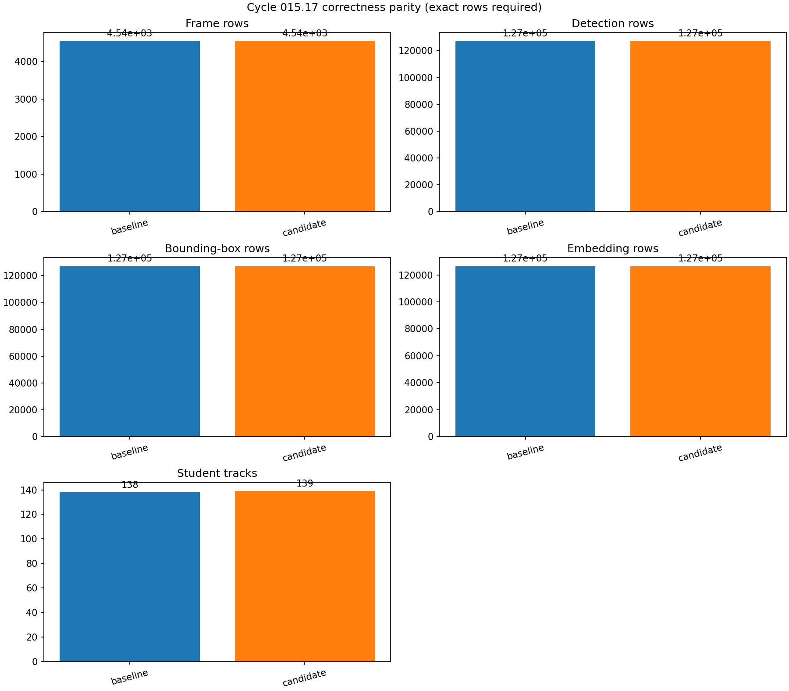
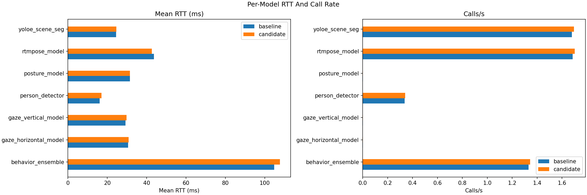
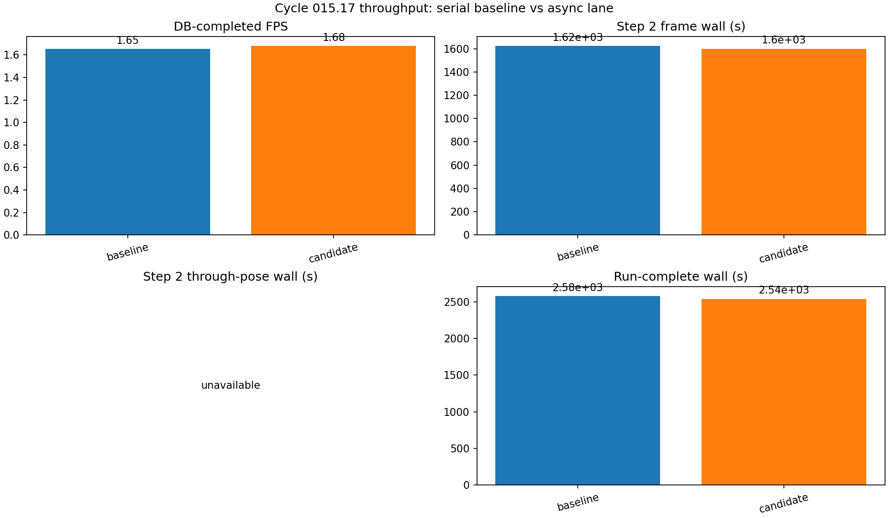
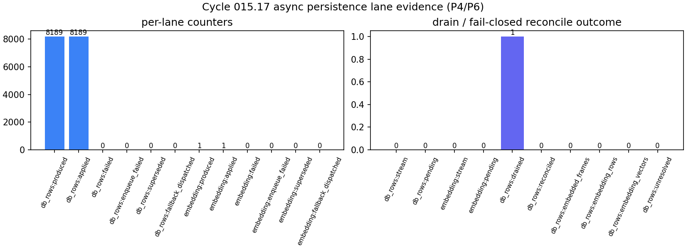
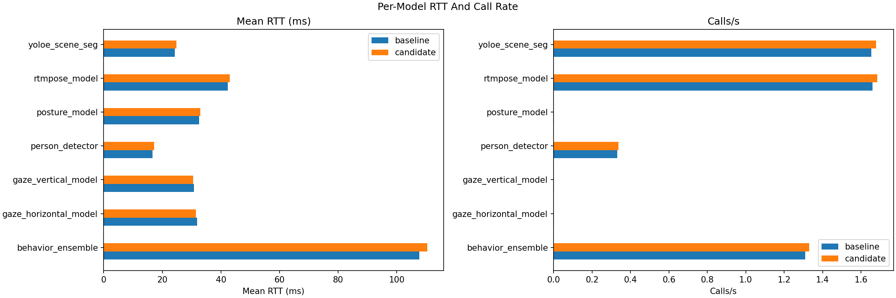

# Cycle 015.17 Cross-Process Persistence Results

**Last updated:** 2026-06-12
**Status:** `NOT ACCEPTED AS THROUGHPUT OPTIMIZATION / OPERATOR-ACTIVATED OFFLINE DEFAULT`
**Streaming compatibility:** `stream-safe-with-config`

## Source-of-truth references

| Kind | Reference |
|---|---|
| Commit | `a15519667c97bd01301ebd414b0ee1a38d31adb3` |
| Commit | `6f0a48051514a6353bec21879eedb0e48535dd2a` |
| Commit | `d64c2c915ee388e133126f24a156dd14b29a2d62` |
| File | `tools/prod/prod_run_xai_cycle015_17.sh` |
| File | `tools/prod/prod_generate_xai_cycle015_17_figures.py` |
| File | `backend/apps/video_analysis/tasks.py` |
| File | `backend/tests/unit/video_analysis/test_async_persistence_seam.py` |
| Symbol | `apps.video_analysis.tasks._reconcile_existing_embedded_frame_packet` |
| Symbol | `apps.video_analysis.tasks._async_persistence_finalize` |
| Doc | `docs/xai_anomaly/cycle_015_17_figure_plan.md` |
| Doc | `docs/xai_anomaly/cycle_015_17_figure_implementation.md` |
| Artifact | `docs/figures/benchmark_artifacts/cycle015-17-prod-20260611/` |
| Artifact | `docs/figures/benchmark_artifacts/cycle015-17-prod-r2-20260611/` |
| Artifact | `docs/figures/benchmark_artifacts/cycle015-17-prod-r2-20260611/figures/MANIFEST.json` |
| Artifact | `docs/figures/benchmark_artifacts/cycle015-17-prod-r3-20260611/` |
| Artifact | `docs/figures/benchmark_artifacts/cycle015-17-prod-r3-20260611/figures/MANIFEST.json` |
| Artifact | `docs/figures/benchmark_artifacts/cycle015-17-prod-r3-20260611/PACKAGE_MANIFEST.json` |
| Artifact | `docs/figures/benchmark_artifacts/cycle015-17-prod-r3det-20260611/` |
| Artifact | `docs/figures/benchmark_artifacts/cycle015-17-prod-r3det-20260611/determinism_control_comparison.json` |
| Artifact | `docs/figures/benchmark_artifacts/cycle015-17-prod-r3det-20260611/MANIFEST.json` |
| Artifact | `docs/figures/benchmark_artifacts/cycle015-17-prod-default-20260612/runtime_activation.json` |
| Ledger | `docs/BENCHMARK_RESULTS_LEDGER.md` |

## Decision

Cycle 015.17 is **NOT ACCEPTED**. The corrected cross-process `db_rows` lane
applied all `8185` packets with zero failures and zero serial reconciliation,
but it did not improve authoritative throughput. DB-completed FPS regressed
from `1.655863` to `1.643340` (`-0.76%`) and remained far below the mandatory
`>=15 FPS` target. Student-track row count also diverged from `138` to `149`.

The r2 candidate is refusal-only for an additional reason: the benchmark
runner observed a premature `completed` transition, collected lane evidence,
and rolled the flag back while the downstream embedding stage was still
running. The job returned to `embedding` and reached its actual terminal
`completed` state `180.661 s` after rollback. Therefore the candidate GPU
window and rollback timing are not a clean terminal one-variable measurement.

## Production Runs

All runs used native Linux RTX 5090, canonical `combined.mp4`, `4541/4541`
frames, frame stride `1`, PostgreSQL, and the production offline profile.

| Run | Commit | Job | DB FPS | Elapsed | Decision |
|---|---|---|---:|---:|---|
| Attempt 1 baseline | `a1551966` | `449f1540-f586-4049-829b-a4dd46bf166f` | `1.663871` | `2729.178 s` | Baseline |
| Attempt 1 candidate | `a1551966` | `349010db-51c9-4b1a-8806-4a22a8afc541` | `1.582584` | `2869.358 s` | Refused |
| r2 baseline | `6f0a4805` | `e60e678a-8862-4f87-8177-54b979aaf884` | `1.655863` | `2742.376 s` | Baseline |
| r2 candidate | `6f0a4805` | `f50e8e0e-d997-4008-ac8f-b5a9a65fbdcd` | `1.643340` | `2763.274 s` | Refused |

Attempt 1 exposed a consumer color-state defect. It produced `8185` packets,
but recorded `7139` failures, failed to drain, and serially reconciled `3968`
frames. Commit `6f0a4805` retained color ownership across packets and extended
the consumer idle window; r2 then proved a clean `db_rows` drain.

## r2 Metrics

| Metric | Baseline | Candidate | Delta | Authority |
|---|---:|---:|---:|---|
| DB-completed FPS | `1.655863` | `1.643340` | `-0.76%` | Authoritative |
| DB-completed elapsed | `2742.376 s` | `2763.274 s` | `+0.76%` | Authoritative |
| Step 2 frame wall | `1626.406689 s` | `1629.966177 s` | `+0.22%` | Authoritative |
| Step 3 persistence wall | `32.771042 s` | `14.469456 s` | `-55.85%` | Diagnostic only |
| Audit run-complete wall | `2576.907053 s` | `2565.176707 s` | `-0.46%` | Candidate lifecycle contaminated |
| Average GPU utilization | `4.666%` | `5.032%` | `+0.366 pp` | Candidate tail incomplete |
| Peak GPU utilization | `51%` | `48%` | `-3 pp` | Candidate tail incomplete |
| Peak VRAM | `16131 MiB` | `16137 MiB` | `+6 MiB` | Diagnostic |

The candidate did not reduce Step 2 wall and did not increase DB-completed
throughput. Its lower Step 3 persistence wall was offset by the rest of the
authoritative lifecycle.

## Correctness And Identity

| PostgreSQL evidence | Baseline | Candidate | Result |
|---|---:|---:|---|
| Frames | `4541` | `4541` | Exact |
| Detections | `127117` | `127117` | Exact |
| Bounding boxes | `127117` | `127117` | Exact |
| Embeddings | `126519` | `126519` | Exact |
| Pose kinematics records | `72931` | `72931` | Exact |
| Student tracks | `138` | `149` | Diverged |

Raw local tracker labels were not compared across runs. Ground-truth HOTA,
AssA, IDF1, ID switches, and fragmentation labels were unavailable, so the
track-row divergence is a refusal signal rather than a cross-run identity
mapping claim.

## Lane And Lifecycle Evidence

The r2 candidate persisted authoritative rows during the frame loop: the first
nonzero sample at `25/4541` processed frames already had `35` frames and `966`
detections/bounding boxes. Final `db_rows` counters were `8185` produced,
`8185` applied, zero failed, stream length zero, pending zero, and
`serially_reconciled_frames=0`.

The lifecycle evidence is not clean. Lane stats were recorded at
`2026-06-11T03:40:16.722653Z` with job status `embedding` and two embedding
stream entries pending. Rollback was recorded at
`2026-06-11T03:40:31.583604Z`; actual terminal completion occurred at
`2026-06-11T03:43:32.244947Z`.

## Figures

The digest-addressed manifest is
`docs/figures/benchmark_artifacts/cycle015-17-prod-r2-20260611/figures/MANIFEST.json`.
Attempt 1 figures and manifest remain preserved under
`docs/figures/benchmark_artifacts/cycle015-17-prod-20260611/figures/`.

## Unavailable Metrics

- Worker CPU/RSS samples were unavailable because the collector recorded zero
  worker samples.
- Ground-truth identity metrics were unavailable because no governed label
  manifest was attached to these runs.
- The generated manifest marks its requested `step2_through_pose_s` key
  unavailable because the collector exposes that value under
  `audit.step2_through_pose_upload_s`.
- Candidate GPU tail coverage is unavailable because sampling stopped before
  the embedding stage reached terminal completion.

## Rollback

The runner restarted workers with
`OFFLINE_ASYNC_PERSISTENCE_ENABLED=0` after both baselines and both candidates.
The r2 candidate rollback artifact records `rollback_verified=true`,
`serial_setting_verified=true`, and `workers_restarted=true`. The production
default remains serial.

## Required Follow-Up

Do not re-enable Cycle 015.17 for acceptance without first fixing terminal
lifecycle coordination, eliminating track-row fragmentation, and proving a
material DB-completed throughput gain. The next candidate must collect GPU,
CPU/RSS, PostgreSQL/Redis, correctness, identity, and rollback evidence through
the actual terminal state.

## r3 Remediation (2026-06-11) — track-parity investigation

### Refusal reason 1: zero-reference phantoms — FIXED

Root cause: person-interpolation **revises** a frame's track assignment after a
consumer has already persisted an earlier revision. The earlier revision's
`StudentTrack` row survives the re-persist as a zero-reference orphan (no
bounding boxes, no embeddings). The serial path never materialises those rows,
so the candidate diverged by exactly the 10–11 superseded-revision phantoms.

Fix: the `db_rows` finalize barrier now restores **exact** track parity. The
frame loop computes the authoritative final per-box track set (`tracked_ids`)
and passes it to `_async_persistence_finalize`, which calls
`_async_persistence_prune_phantom_tracks`. That helper deletes every
`StudentTrack` for the job whose `tracking_id` is outside
`set(authoritative_track_ids) | {0}` **and** holds zero bounding boxes and zero
embeddings. A non-authoritative track that still holds real rows is logged and
left intact (never silently deleted), so the prune cannot lose data. The
`pruned_phantom_tracks` count is recorded in the lane summary metadata.

Unit coverage: `test_finalize_prunes_phantom_zero_box_tracks` (the exact
138→149 scenario) and `test_finalize_keeps_non_authoritative_track_with_rows`
(safety guard) in
`backend/tests/unit/video_analysis/test_async_persistence_seam.py`.

This repair covers only tracks with no remaining references. It does not repair
a stale frame revision after embeddings have already been attached.

### Refusal reason 2: FPS flat/degraded — db_rows is NOT the lever

Phase-split instrumentation of the r2 run shows the in-loop postprocess time is
dominated by the **scene lane**, not persistence:

| Phase | Wall | Share |
|---|---|---|
| `scene_callback_ms` (`run_scene_frame_lane`) | 826 s | 73.6% |
| `scene_output_decode_ms` | 224 s | ~20% |
| Step-3 db_rows persistence (serial → async) | 32.7 s → 14.5 s | <1.2% |

The db_rows offload halves an already-tiny Step-3 cost (32.7 s → 14.5 s), which
is invisible against a 2742 s run. **Decision:** db_rows cross-process
persistence stays default-off (`OFFLINE_ASYNC_PERSISTENCE_ENABLED=0`) but is now
parity-correct, so it is no longer a *correctness* blocker — it is simply not a
throughput lever. The real FPS lever is the scene lane (≈94% of in-loop
postprocess), which moves to its own causal cycle (015.18) under the one-causal-
variable rule. Re-running 015.17 for FPS acceptance would change the wrong
variable.

### r3 benchmark result (2026-06-11, SHA `31d34d8b`, tag `cycle015-17-prod-r3`)

Matched serial baseline + async candidate, stride-1, scene+SRVL on.

| Metric | Baseline (serial) | Candidate (async + prune) |
|---|---|---|
| student_tracks | 138 | **139** |
| bounding_boxes | 127 117 | **127 117** (identical) |
| detections | 127 117 | **127 117** (identical) |
| embedding_rows | 126 519 | **126 519** (identical) |
| db_completed_fps | 1.679 | 1.695 |

The phantom prune removed the zero-reference component, but r3 still had one
extra referenced track: candidate `tracking_id=43` held 6 boxes and 6
embeddings. The previous revision of this document classified that residual as
independent-run tracker variance because aggregate box, detection, and embedding
counts matched.

### Determinism control and corrected root cause

The completed second serial run
`cycle015-17-prod-r3det-20260611-baseline` / job
`7082dc07-e149-4a65-9ef9-730aa71e26fc` ran on the same reviewed SHA
`31d34d8b25f66812f2a0fc28c697e387377502f0`, stride `1`, with async
persistence disabled. It completed `4541/4541` frames in `2771.757 s`
(`1.638311` DB-completed FPS), produced `138` tracks, and recorded verified
serial rollback.

The exact production database comparison uses a multiset key of frame number,
model, six-decimal coordinates, class, six-decimal confidence, and track ID:

| Comparison | Content-row delta | Track-assignment delta | Result |
|---|---:|---:|---|
| r3 serial vs r3det serial | `0` | `0` | Deterministic |
| r3 serial vs r3 async | `0` | `6` changed rows | Async divergence |
| r3det serial vs r3 async | `0` | `6` changed rows | Async divergence |

The stored two-sided assignment multiset delta is `12`, representing six rows
removed from the serial assignment and the same six added under the async
assignment. All six async rows belong to track `43`; both serial runs assign
those exact rows to track `0`.

The previous tracker-variance interpretation is withdrawn. Equal aggregate row
counts do not prove track-assignment parity. The async writer persisted a stale
frame revision, the embedding stage attached rows to that revision, and the
final authoritative correction was then blocked by the
`skipped_existing_embeddings` guard. The zero-reference prune correctly leaves
that track untouched because it still owns boxes and embeddings.

The vector evidence also differs. Both serial runs assign all `18` track-0
embeddings to vector digest
`91a5f29504d77d65387bfdfdf177e9bef317c33310adb1126c0ccbedc64be899`.
The async run has `12` rows under that digest on track `0` and the six stale
track-43 rows under digest
`92e8fd3f9b4431f0515cd672331cfe719cee4db850fdc64b79d04d844f5834b7`.
Therefore changing only the track foreign key would still fail serial
embedding fidelity.

The full query result, runtime guard, metrics, GPU CSV, inference audit, runner
log, rollback proof, and digest manifest are preserved under
`docs/figures/benchmark_artifacts/cycle015-17-prod-r3det-20260611/`.
The r3 result remains a correctness failure and Cycle 015.17 remains
**NOT ACCEPTED**.

### Local embedded-revision repair

The finalization path now opts into an exact frame-local reconciliation in
`_reconcile_existing_embedded_frame_packet`:

- it matches persisted and authoritative rows by exact model, class,
  six-decimal confidence, and six-decimal coordinates;
- it updates `BoundingBox.student_track`, color, public label, and every linked
  `FrameEmbedding.student_track` atomically without deleting detections or
  embeddings;
- when `OFFLINE_EMBEDDING_REUSE_BY_TRACK=1`, it replaces the stale vector with
  the target track's earliest same-model canonical vector and refuses if no
  canonical vector exists;
- it deletes a superseded track only after all packet references move and only
  when no alias, lifecycle, or pose evidence references it;
- after commit, it removes the deleted track's job-scoped Redis embedding keys
  and track-set membership;
- it refuses content mismatches and ambiguous duplicate boxes instead of using
  IoU, appearance similarity, or a forced merge;
- finalization rechecks the complete authoritative packet signature and raises
  on any unresolved frame.

PostgreSQL regression coverage is in
`test_finalize_reassigns_stale_embedded_revision_without_replacing_rows`,
`test_embedded_revision_reconcile_refuses_content_mismatch`, and
`test_embedded_revision_reconcile_requires_target_vector_when_reusing`,
`test_embedded_revision_reconcile_refuses_non_packet_track_references`.
The broader appearance scorer remains non-destructive because the measured
OSNet similarities are not safe merge evidence.

### r3 Figure Evidence

The figure-input and output digests are recorded in
`docs/figures/benchmark_artifacts/cycle015-17-prod-r3-20260611/figures/MANIFEST.json`;
the complete copied package is covered by `PACKAGE_MANIFEST.json`.

### Required production follow-up

- **Inline orphan GC** (`OFFLINE_PERSIST_INLINE_ORPHAN_GC`, default-off,
  implemented): reference-counted phantom prevention at write time so
  zero-reference phantoms do not accumulate before finalization.
- Preserve the r4 and r5 production packages and decisions below.
- Keep `OFFLINE_ASYNC_PERSISTENCE_ENABLED=0`: correctness is now exact, but the
  candidate did not produce a material end-to-end throughput gain.

## r4 And r5 Production Closure (2026-06-11)

Figure Planner: `Codex production benchmark agent`.

Figure Implementer: `Codex production benchmark agent`.

One active agent performed both roles because no separate figure lane was
available. The figure plan remained the existing Cycle 015.17 metric contract;
the implementation used
`tools/prod/prod_generate_xai_cycle015_17_figures.py`, with raw inputs and
output digests recorded separately in each figure manifest.

### r4 Result: Embedded Repair Was Not Reached

The r4 serial baseline ran on SHA `770f47d8` as job
`b3c9241e-9d94-4e9a-9cbf-de0cd56d1e8b`. The r4 async candidate ran on the
same SHA as job `0d045329-6283-4cab-99c8-451cb200a71c`. Both used native Linux
RTX 5090, canonical `combined.mp4`, frame stride `1`, PostgreSQL, and the
terminal-state runner.

| Metric | r4 serial | r4 async | Delta |
|---|---:|---:|---:|
| DB-completed FPS | `1.654325` | `1.707491` | `+3.21%` |
| DB-completed elapsed | `2744.926 s` | `2659.457 s` | `-3.11%` |
| Step 2 frame wall | `1621.705863 s` | `1566.993768 s` | `-3.37%` |
| Step 3 persistence wall | `43.848086 s` | `14.305064 s` | `-67.38%` |
| Student tracks | `138` | `139` | Diverged |

All aggregate frame, detection, bounding-box, embedding, pose, and per-model
counts matched. Exact comparison still found content delta `0` and six rows
assigned to candidate track `43` instead of serial track `0`. The lane summary
reported zero embedded-frame reconciliations because the new repair was never
invoked.

The missed condition was `_cycle20_frame_packet_signature`. It used
`build_public_box_label` as the identity-bearing signature field. Public labels
for secondary models intentionally contain only the model name, so
`attention_tracking 43 -> 0` and `hand_raising 43 -> 0` produced identical
signatures. Step 3 therefore did not enqueue the final authoritative revision.
This was earlier than the embedding guard and explains why the embedded repair
counters remained zero.

r4 decision: **NEEDS FURTHER ITERATION / correctness failure**. Evidence:

- `docs/figures/benchmark_artifacts/cycle015-17-prod-r4-20260611/r4_failure_comparison.json`
- `docs/figures/benchmark_artifacts/cycle015-17-prod-r4-20260611/figures/MANIFEST.json`
- `docs/figures/benchmark_artifacts/cycle015-17-prod-r4-20260611/PACKAGE_MANIFEST.json`

### Signature Repair

Commit `bec9f0f4` changed the in-memory and PostgreSQL packet signatures to
include model, normalized class, six-decimal confidence, six-decimal
coordinates, explicit `student_track.tracking_id`, and public label. The
production-shaped regression test reproduces the exact
`attention_tracking 43 -> 0` case and verifies that finalization replaces the
stale pre-embedding packet and removes track `43`.

The exact embedded-row reconciler remains as a fail-closed fallback. The r5
run did not need it because the corrected signature caused the final revision
to be ordered and applied before embeddings were generated.

### r5 Corrected Candidate

The r5 candidate ran on SHA `bec9f0f4` as job
`3095ec8a-ce49-4057-a7b3-2c7ea4d2cc64`. It used the immediately preceding r4
serial job as its frozen baseline; no serial behavior-affecting code changed.

| Metric | r4 serial baseline | r5 corrected async | Delta |
|---|---:|---:|---:|
| DB-completed FPS | `1.654325` | `1.678566` | `+1.47%` |
| DB-completed elapsed | `2744.926 s` | `2705.285 s` | `-1.44%` |
| Step 2 frame wall | `1621.705863 s` | `1599.162909 s` | `-1.39%` |
| Step 3 persistence wall | `43.848086 s` | `19.189760 s` | `-56.24%` |
| Audit run-complete wall | `2577.956851 s` | `2541.756147 s` | `-1.40%` |
| Average GPU utilization | `4.247%` | `4.405%` | `+0.158 pp` |
| Peak GPU utilization | `49%` | `49%` | Exact |

The corrected lane produced and applied `8189` packets, drained with zero
pending entries and zero enqueue failures, and recorded `3648` revised packets.
That is four more final revisions than r4, matching the four disputed frames
`512` through `515`. It pruned `11` zero-reference tracks and reported
`unresolved_frames=[]`.

### Exact Fidelity Gates

An independent PostgreSQL comparison covered every persisted box and embedding.
It did not rely on aggregate counts or raw local-ID equality across unrelated
runs; these are deterministic replays of the same source and reviewed pipeline.

| Exact multiset gate | Result | Digest result |
|---|---:|---|
| Detection/box content | delta `0` | identical SHA-256 |
| Track assignment | delta `0` | identical SHA-256 |
| Embedding assignment and vector | delta `0` | identical SHA-256 |

Both jobs contain `138` tracks, `127117` detections/bounding boxes, and
`126519` embeddings. The disputed rows are track `0` in both jobs. Track `0`
contains the same `18` embeddings under vector digest
`91a5f29504d77d65387bfdfdf177e9bef317c33310adb1126c0ccbedc64be899`;
track `43` is absent from the corrected candidate.

The authoritative comparison is
`docs/figures/benchmark_artifacts/cycle015-17-prod-r5-20260611/exact_persistence_parity.json`.

### r5 Figures

The figure-input/output digests are recorded in
`docs/figures/benchmark_artifacts/cycle015-17-prod-r5-20260611/figures/MANIFEST.json`;
the full package is covered by `PACKAGE_MANIFEST.json`.

### Final Decision

The async fidelity bug is **resolved**. The optimization candidate remains
**NOT ACCEPTED** because `1.678566 FPS` is only `+1.47%` over the matched
baseline and remains far below the binding `15 FPS` target. Step 3 improved,
but it is not the dominant end-to-end bottleneck. Production rollback restored
`OFFLINE_ASYNC_PERSISTENCE_ENABLED=0` and restarted workers.

### Production Default Activation

On 2026-06-12, the operator accepted the fidelity-correct r5 configuration as
the production **offline** default so subsequent work continues from that
state. This is an operational default decision, not a reclassification of the
throughput result. The generic application fallback remains disabled and live
jobs remain excluded.

The production `.env` and optimized offline profile now use:

- `TRITON_OFFLINE_FRAME_STRIDE=1`
- `OFFLINE_ASYNC_PERSISTENCE_ENABLED=1`
- `ASYNC_PERSISTENCE_LANES=db_rows,embedding`
- `ASYNC_PERSISTENCE_IDLE_EXIT_MS=10000000`
- `CELERY_PERSISTENCE_QUEUE=pipeline.offline.persistence`

Commit `d64c2c91` preserves these values when the production profile or Cycle
015.17 benchmark runner is applied. The live endpoint policy requires
`OFFLINE_ASYNC_PERSISTENCE_ENABLED=0`. Production-generated runtime evidence,
including six responsive Celery nodes and the offline/live guard result, is in
`docs/figures/benchmark_artifacts/cycle015-17-prod-default-20260612/runtime_activation.json`.
