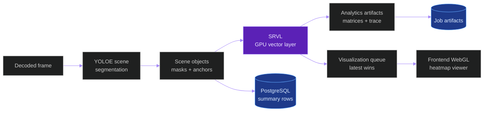

# YOLOE Scene Segmentation And SRVL Plan

**Last updated:** 2026-06-07

**Status:** Proposed implementation plan. YOLOE scene segmentation is not
implemented in the repository yet. The Spatial Relationship Vectorization Layer
defined here is also proposed and must be benchmarked before acceptance.

## Summary

Add a gated YOLOE scene-segmentation layer to the offline video inference
pipeline first. The layer uses a fixed classroom prompt profile to segment
people and non-ROI classroom regions, records full mask evidence for the frames
where YOLOE runs, flags contradictions against downstream detections, computes
pixel-normalized spatial distance/vector matrices, and renders a 2D scene-map
artifact as images and MP4.

The first version is evidence-first and non-destructive:

- Offline uploaded-video jobs only.
- Pixel-normalized image-space distances, not real-world meters.
- Flag-only contradiction handling.
- Fixed `classroom_roi_guard_v1` prompt profile.
- Small/fast YOLOE segmentation model by default.
- Full masks persisted for YOLOE inference frames through compressed sidecar
  artifacts, not raw PostgreSQL JSON.
- Adaptive inference/render cadence controlled by environment and config.
- A dedicated Spatial Relationship Vectorization Layer, abbreviated `SRVL`,
  converts object coordinates into distance matrices, vector matrices, and
  heatmap/correlation map buffers.
- SRVL uses vectorized GPU tensor operations in the production path and never
  uses Python loops over object pairs in the critical path.
- Visualization is non-blocking: analytics artifacts are reliable, while
  frontend visualization is best effort and latest-frame-wins.

## Source-of-truth references

| Kind | Reference |
|---|---|
| Doc | `docs/new_models_yoloe_depth_anything_v2_timing_decision.md` |
| Doc | `docs/entity/systems/offline_inference_pipeline.md` |
| Doc | `docs/entity/systems/live_streaming_pipeline.md` |
| Doc | `docs/entity/systems/triton_inference_plane.md` |
| Doc | `docs/production_inference_benchmark.md` |
| File | `backend/apps/pipeline/model_registry.py` |
| File | `backend/apps/pipeline/services/model_route_service.py` |
| File | `backend/apps/pipeline/services/triton_client.py` |
| File | `backend/apps/video_analysis/models.py` |
| File | `backend/apps/video_analysis/serializers.py` |
| File | `backend/apps/video_analysis/tasks.py` |
| File | `backend/apps/video_analysis/views.py` |
| File | `backend/apps/video_analysis/ws_broadcast.py` |
| File | `backend/config/settings/base.py` |
| File | `frontend/src/types/videoAnalysis.ts` |
| File | `frontend/src/components/VideoPlayer/OverlayCanvas.tsx` |
| File | `frontend/src/components/camera/BoundingBoxCanvas.tsx` |
| External | <https://docs.ultralytics.com/models/yoloe/> |
| External | <https://arxiv.org/abs/2503.07465> |

## V1 Feature Decisions

| Decision | V1 choice | Reason |
|---|---|---|
| Runtime target | Offline-first | Avoids live latency regressions while the model cost is measured. |
| Distance basis | Pixel-normalized | Fast, calibration-free, and honest about not being metric distance. |
| Downstream guard action | Flag-only | Preserves existing detections and stores contradiction evidence. |
| Prompt mode | Fixed profile | Keeps benchmarks reproducible and avoids dynamic prompt drift. |
| Object profile | Classroom ROI guard | Targets people and common non-ROI surfaces/objects. |
| Model scale | Small/fast | Protects throughput while proving the feature. |
| Mask scope | YOLOE frames | Stores full masks for frames where YOLOE actually runs. |
| Visualization cadence | Adaptive stride | Keeps MP4 frame count while avoiding per-frame YOLOE cost. |
| Spatial layer name | `Spatial Relationship Vectorization Layer` / `SRVL` | Names the coordinate-to-matrix/map module. |
| SRVL compute backend | `torch_cuda` first | GPU vectorization is required for production acceptance. |
| SRVL render backend | `frontend_webgl` first | Avoids backend image rendering on the critical path. |
| SRVL fallback | `numpy_cpu` for tests/degraded only | CPU fallback cannot be the accepted production path unless benchmarked. |

## Supported Features

- Segment people as an independent open-vocabulary signal.
- Count YOLOE people and compare against `student + teacher` detections.
- Segment non-ROI regions: `table`, `desk`, `chair`, `wall`, `floor`,
  `ceiling`, `door`, `window`, `mirror`, `board`, and `screen`.
- Build a non-ROI union mask for hallucination checks.
- Flag downstream predictions that overlap strongly with non-ROI masks.
- Locate possible missing people from YOLOE person masks when the current
  person detector count is lower than YOLOE's person count.
- Save full mask evidence for every YOLOE inference frame.
- Generate a per-frame scene-object summary.
- Generate a distance matrix between scene objects.
- Generate a vector matrix where each cell contains normalized distance and
  angle theta between two objects.
- Generate proximity, direction, and correlation map buffers for frontend
  visualization.
- Render high-quality scene-map PNG/JPG/SVG snapshots.
- Render a scene-map MP4 while preserving the original video frame count.
- Emit benchmark artifacts and rollback evidence before any production enablement.

## High-Level Architecture

The YOLOE lane and SRVL are separate concerns:

- YOLOE produces object masks, boxes, class labels, and anchor points.
- SRVL consumes object coordinates and optional class/track metadata.
- SRVL outputs relation matrices and visualization-ready map buffers.
- The frontend renders high-rate heatmaps through WebGL-style primitives.
- Offline artifacts preserve matrices, masks, snapshots, and trace data.



## End-to-End Inference Story

1. A user uploads a video into the existing offline video-analysis flow.
2. The current pipeline runs as it does today: frame decode, person detection,
   behavior models, pose, tracking, persistence, and annotated video rendering.
3. If `YOLOE_SCENE_ENABLED=1`, the scene-segmentation lane observes the same
   decoded frames but only runs YOLOE on frames selected by
   `YOLOE_SCENE_INFER_STRIDE`.
4. For each YOLOE frame, the lane sends a full-frame segmentation request to
   Triton using the fixed `classroom_roi_guard_v1` prompt profile.
5. YOLOE outputs are normalized into scene objects:
   class, confidence, bbox, mask reference, mask area, centroid, anchor point,
   and source profile.
6. The system builds a union mask for non-ROI classes. This mask is the
   "do not trust downstream predictions here without evidence" region.
7. The system compares existing detections with YOLOE:
   YOLOE person count vs current student/teacher count, and downstream boxes
   vs non-ROI masks.
8. V1 records contradiction events only. It does not delete, rewrite, suppress,
   or lower the confidence of existing detections.
9. The scene objects become points for spatial reasoning. People use
   bottom-center anchors when possible; other objects use mask centroids.
10. SRVL receives the ordered object coordinates and optional frame metadata.
11. SRVL uploads or reuses a compact `[N, 2]` coordinate tensor on GPU.
12. SRVL computes all pairwise `dx`, `dy`, distance, angle, vector, proximity,
   and map tensors through batched tensor operations.
13. SRVL writes analytics outputs to artifact buffers and enqueues the latest
   visualization state without blocking the inference path.
14. The renderer creates the human-facing scene map. On non-YOLOE frames, it
   reuses the latest scene state so the output MP4 still has the same frame
   count as the source video.
15. The job saves the scene-map MP4, snapshots, mask artifacts, matrix artifacts,
   trace artifacts, and an artifact manifest with digests.

## Data And Artifact Contract

PostgreSQL should store compact indexed summaries. Large masks and matrices
should be written as compressed files under the job artifact directory and
referenced by digest/path.

Proposed database additions:

| Model | Purpose | Key fields |
|---|---|---|
| `SceneFrameSummary` | One row per YOLOE frame. | job, frame, profile, object_count, person_count, non_roi_coverage_ratio, artifact refs |
| `SceneObjectObservation` | One row per segmented object. | frame, class_name, confidence, bbox_xyxy, centroid_xy, anchor_xy, mask_ref, area_px |
| `SceneContradictionEvent` | Append-only guard evidence. | frame, downstream_model, downstream_ref, scene_object_ref, overlap_ratio, rule, action |
| `SceneArtifactManifest` | Artifact index and digests. | job, artifact_type, path, sha256, schema_version, size_bytes |

Artifact files:

| Artifact | Format | Notes |
|---|---|---|
| Full masks | `rle_zstd` or compressed NPZ | One recoverable mask per scene object on YOLOE frames. |
| Scene objects | JSONL or Parquet | Compact per-object summaries for offline analysis. |
| Distance matrix | compressed NPZ plus JSON schema | Numeric matrix keyed by ordered object IDs. |
| Angle matrix | compressed NPZ plus JSON schema | Radian angle matrix from pairwise deltas. |
| Vector matrix | compressed NPZ plus JSON schema | Stores magnitude-angle and optional dx-dy arrays. |
| Heatmap buffers | Float16/UInt8 binary or PNG/WebP | Visualization-ready buffers for frontend or reports. |
| SRVL trace | JSONL | Per-frame timings, backend, queue, object count, and dropped-state evidence. |
| Scene snapshots | PNG, JPG, SVG | Human-facing map and matrix illustrations. |
| Scene video | MP4 | Preserves source frame count with last-known scene state. |

Database optimization rules:

- Do not store raw mask arrays in JSONField rows.
- Use `bulk_create` for scene summaries and contradiction events.
- Index by `(job, frame_number)`, `(job, class_name)`, and
  `(job, downstream_model, action)`.
- Keep API list endpoints paginated and summary-first.
- Load full masks only through explicit artifact endpoints.
- Store artifact digests so benchmark figures and decisions trace back to raw
  evidence.
- Prefer binary buffers, compressed NPZ, or JSONL metadata over giant JSON
  matrices in API responses.
- Keep full `[N, N]` outputs behind artifact refs; expose summaries and top-k
  relations to the frontend by default.

## Spatial Relationship Vectorization Layer

Recommended name:

`Spatial Relationship Vectorization Layer`

Recommended abbreviation:

`SRVL`

Code-friendly alternatives if a shorter class name is needed:

- `SpatialVectorLayer`
- `DistanceVectorizationLayer`
- `PairwiseRelationMapLayer`
- `SpatialCorrelationLayer`

SRVL converts object locations in frame space into:

1. Pairwise distance matrix.
2. Pairwise angle matrix.
3. Pairwise vector matrix.
4. Heatmap, direction map, proximity map, and correlation map buffers.

SRVL must be fast enough to run every 2 to 4 frames on around 32 FPS video,
with average video durations up to around 11 minutes. These are target workload
assumptions and must be validated against actual object count and hardware.

### SRVL Inputs

Required object input:

```python
objects = [
    {
        "object_id": 1,
        "track_id": 12,
        "class_name": "student",
        "center_x": 340.5,
        "center_y": 220.0,
        "bbox": [300, 180, 380, 260],
        "confidence": 0.94,
    },
]
```

Critical-path tensor form:

```text
coords shape = [N, 2]
coords[i] = [center_x, center_y]
```

Optional frame metadata:

```python
frame_metadata = {
    "frame_id": 1024,
    "video_id": "classroom_video_01",
    "timestamp_ms": 32000,
    "fps": 32,
    "frame_width": 1920,
    "frame_height": 1080,
}
```

Optional precomputed distance input:

```text
distance_matrix shape = [N, N]
```

Distance alone is magnitude only. SRVL still needs coordinates or pairwise
`dx` and `dy` to compute angle and direction maps.

### SRVL Mathematical Definition

For object coordinates:

```text
P_i = (x_i, y_i)
P_j = (x_j, y_j)
```

Pairwise deltas:

```text
dx[i,j] = x_j - x_i
dy[i,j] = y_j - y_i
```

Distance:

```text
D[i,j] = sqrt(dx[i,j]^2 + dy[i,j]^2)
```

Angle:

```text
A[i,j] = atan2(dy[i,j], dx[i,j])
```

Magnitude-angle vector:

```text
V[i,j,0] = D[i,j]
V[i,j,1] = A[i,j]
```

Optional Cartesian vector:

```text
V_cartesian[i,j,0] = dx[i,j]
V_cartesian[i,j,1] = dy[i,j]
```

The default angle unit is radians. Degree output can be derived as
`angle_degrees = angle_radians * 180 / pi` for display only.

### GPU Computation Contract

SRVL must avoid Python loops over object pairs in the critical path. The
production implementation should use PyTorch CUDA first, with CuPy as an
acceptable alternative if it fits the runtime better. Triton custom kernels or a
CUDA C++ extension are future options only if benchmarks prove the simpler
vectorized backend is insufficient.

Required computation style:

```python
coords_gpu = coords.to(device="cuda", dtype=torch.float32)

dx = coords_gpu[:, 0][None, :] - coords_gpu[:, 0][:, None]
dy = coords_gpu[:, 1][None, :] - coords_gpu[:, 1][:, None]

distance = torch.sqrt(dx * dx + dy * dy)
angle = torch.atan2(dy, dx)

vector_matrix = torch.stack((distance, angle), dim=-1)
cartesian_matrix = torch.stack((dx, dy), dim=-1)
```

The implementation should normalize coordinates or distances when configured:

- `frame_diagonal`: divide pixel distance by
  `sqrt(frame_width^2 + frame_height^2)`.
- `frame_width`: divide horizontal scale by frame width.
- `frame_height`: divide vertical scale by frame height.
- `none`: preserve pixel units.

### SRVL Output Schema

Expected per-frame schema:

```python
{
    "frame_id": 1024,
    "video_id": "classroom_video_01",
    "timestamp_ms": 32000,
    "object_count": 24,
    "objects": [
        {
            "object_id": 1,
            "track_id": 12,
            "class_name": "student",
            "center": [340.5, 220.0],
            "bbox": [300, 180, 380, 260],
            "confidence": 0.94,
        }
    ],
    "relations": {
        "distance_matrix": {
            "shape": [24, 24],
            "dtype": "float32",
            "unit": "frame_diagonal_normalized",
            "data_ref": "artifact_or_binary_buffer_ref",
        },
        "angle_matrix": {
            "shape": [24, 24],
            "dtype": "float32",
            "unit": "radians",
            "data_ref": "artifact_or_binary_buffer_ref",
        },
        "vector_matrix": {
            "shape": [24, 24, 2],
            "format": "magnitude_angle",
            "dtype": "float32",
            "data_ref": "artifact_or_binary_buffer_ref",
        },
    },
    "visualization": {
        "distance_heatmap": {
            "enabled": True,
            "render_backend": "frontend_webgl",
            "encoding": "binary_float16_or_rgba_texture",
            "width": 512,
            "height": 512,
            "data_ref": "heatmap_buffer_ref",
        },
        "angle_map": {
            "enabled": True,
            "render_backend": "frontend_webgl",
            "encoding": "rgba_texture",
            "data_ref": "angle_map_buffer_ref",
        },
        "correlation_map": {
            "enabled": True,
            "render_backend": "frontend_webgl",
            "encoding": "rgba_texture",
            "data_ref": "correlation_map_buffer_ref",
        },
    },
    "trace": {
        "compute_backend": "torch_cuda",
        "render_backend": "frontend_webgl",
        "matrix_mode": "full",
        "run_every_n_frames": 2,
        "timings_ms": {
            "tensor_prepare": 0.3,
            "pairwise_compute": 1.2,
            "map_prepare": 2.0,
            "serialization": 0.8,
            "total": 4.3,
        },
    },
}
```

Large matrices should be exposed by `data_ref`, not inline JSON, unless the
object count is tiny and the request is explicitly a debug endpoint.

### Matrix Modes

SRVL must support multiple scalability modes because pairwise output grows as
`O(N^2)`:

| Mode | Behavior | Output |
|---|---|---|
| `full` | Compute all pairwise relations. | Dense `[N,N]` and `[N,N,2]` tensors. |
| `thresholded` | Keep relations within `max_distance_px` or normalized threshold. | Sparse relation list plus optional dense artifact. |
| `top_k` | Keep K nearest neighbors per object. | Sparse top-k relation list. |
| `heatmap_only` | Produce visualization buffers without full matrix exposure. | Downsampled heatmap buffers. |

Default v1 mode is `full` while `N <= YOLOE_SCENE_MAX_OBJECTS_PER_FRAME`.
For larger N, the implementation should switch to `top_k` or `thresholded`
according to config and record the switch in trace output.

### Heatmap And Correlation Maps

SRVL should generate visualization-ready maps:

| Map | Purpose | Suggested formula or encoding |
|---|---|---|
| Distance heatmap | Visualize pairwise proximity intensity. | `proximity = exp(-distance / sigma)` or `1 / (distance + epsilon)`. |
| Angle map | Visualize direction from one object to another. | Hue from `atan2(dy, dx)`, brightness from confidence or distance weight. |
| Correlation map | Estimate relationship strength. | `proximity_score * class_weight * temporal_consistency`. |
| Interaction map | Future behavior/attention relation view. | Combine SRVL with pose, gaze, and behavior features. |

The correlation formula must remain configurable. V1 should record the formula
name and parameters in trace output, because "correlation" is a system
interpretation, not just geometry.

### Non-Blocking Architecture

SRVL must not block inference or frontend rendering.

Recommended queue split:

```text
Frame processor
    -> bounded GPU compute queue
    -> reliable analytics writer
    -> bounded visualization queue
    -> frontend WebGL renderer
```

Rules:

- Do not block inference waiting for frontend rendering.
- Do not block frontend waiting for full-resolution matrices.
- Keep analytics outputs reliable and traceable.
- Keep visualization best effort and latest-frame-wins.
- Drop old visualization frames if the frontend cannot keep up.
- Keep queue sizes bounded to prevent memory growth.
- Record dropped, delayed, and rendered visualization counters.

### Performance Requirements

Target workload:

- Video frame rate around 32 FPS.
- SRVL cadence every 2 to 4 frames.
- Average video duration up to around 11 minutes.

Performance goals before acceptance:

| Stage | Goal |
|---|---:|
| Pairwise GPU compute | Preferably less than 2 ms for typical classroom object count. |
| Map generation | Preferably less than 5 ms per executed frame. |
| Full SRVL frame cost | Preferably less than 8 to 10 ms per executed frame. |
| Frontend display | 30 FPS or better under normal object count. |

These are targets, not claims. Acceptance requires measured evidence on the
production benchmark path and representative high-object-count stress cases.

### Memory And Transfer Rules

- Keep pairwise computation on GPU.
- Avoid copying full dense matrices to CPU unless an artifact or API response
  explicitly needs them.
- Use Float32 for analytics by default.
- Use Float16 or UInt8/RGBA encodings for visualization when benchmarked.
- Use sparse/top-k output when N is large.
- Reuse preallocated GPU buffers where practical.
- Avoid repeated allocation inside the frame loop.
- Keep full mask artifacts separate from SRVL matrix artifacts.

### Error Handling

| Case | Required behavior |
|---|---|
| Zero objects | Return empty objects, empty/sentinel matrices, and trace `object_count=0`. |
| One object | Return `1x1` zero distance/angle/vector matrices. |
| Invalid or NaN coordinates | Filter object or mark invalid; record count and reason in trace. |
| Duplicate object IDs | Keep source row IDs but assign stable frame-local relation indexes. |
| Missing track IDs | Use `object_id` and class label; do not fail relation generation. |
| Objects outside frame | Clamp only if configured; otherwise mark invalid and trace. |
| GPU unavailable | Use fallback only when enabled; mark backend and degraded reason. |
| Render backend unavailable | Continue analytics and mark visualization unavailable. |
| Frontend disconnected | Keep artifact path alive; drop live visualization frames without blocking. |

### SRVL Traceability

Each output must include enough trace data to answer:

- Which frame produced this map?
- Which objects were included?
- Which coordinates were used?
- Which backend computed it?
- How long did each stage take?
- Was downsampling, top-k, thresholding, or fallback applied?
- Was the visualization frame rendered, delayed, or dropped?

Required trace fields:

```python
trace = {
    "video_id": "classroom_video_01",
    "frame_id": 1024,
    "timestamp_ms": 32000,
    "object_count": 24,
    "run_every_n_frames": 2,
    "input_source": "tracker_centroids_or_yoloe_anchors",
    "coordinate_format": "center_xy",
    "distance_normalization": "frame_diagonal",
    "compute_backend": "torch_cuda",
    "render_backend": "frontend_webgl",
    "matrix_mode": "full",
    "timings_ms": {
        "tensor_prepare": 0.3,
        "pairwise_compute": 1.2,
        "map_prepare": 2.0,
        "serialization": 0.8,
        "total": 4.3,
    },
}
```

### SRVL Benchmarking

Benchmark dimensions:

- Object count N.
- Frame resolution.
- Run frequency.
- GPU backend.
- Render backend.
- Serialization method.
- Frontend FPS.
- Backend latency.
- Memory usage.
- GPU utilization.
- CPU utilization.

Required metrics:

```python
benchmark = {
    "object_count": 32,
    "compute_ms_mean": 1.3,
    "compute_ms_p50": 1.1,
    "compute_ms_p95": 2.2,
    "compute_ms_p99": 3.0,
    "render_ms_mean": 3.5,
    "serialization_ms_mean": 0.9,
    "end_to_end_ms_mean": 5.8,
    "frontend_fps": 60,
    "dropped_visualization_frames": 2,
    "gpu_memory_mb": 128,
    "cpu_percent": 12.5,
}
```

Acceptance requires before/after benchmark evidence, stress tests with high
object count, frontend responsiveness validation, no backend stalls, no memory
leak, and trace logs.

## Spatial Matrix Algorithm

For each YOLOE/SRVL frame:

1. Build an ordered object list:
   `object_id`, `class_name`, `anchor_x`, `anchor_y`, `confidence`, and
   `mask_ref`.
2. Normalize coordinates:
   `x_norm = anchor_x / frame_width`, `y_norm = anchor_y / frame_height`.
3. Compute pairwise deltas with NumPy broadcasting:
   `dx[i,j] = x_norm[j] - x_norm[i]`,
   `dy[i,j] = y_norm[j] - y_norm[i]`.
4. Compute distance:
   `distance[i,j] = sqrt(dx[i,j]^2 + dy[i,j]^2) / sqrt(2)`.
5. Compute direction:
   `theta[i,j] = atan2(dy[i,j], dx[i,j])`.
6. Store the vector matrix as two dense arrays:
   `distance[N,N]` and `theta[N,N]`.

This CPU-readable algorithm describes the math only. Production SRVL must use
the GPU vectorized contract above, not pairwise Python loops.

## Guard Rules

V1 guard output is append-only evidence.

| Rule | Trigger | V1 action |
|---|---|---|
| `person_count_gap` | YOLOE person count is greater than student plus teacher count. | Record missing-person candidate regions. |
| `person_on_non_roi` | Person detector box has high overlap with table, desk, chair, wall, floor, mirror, board, screen, door, window, or ceiling mask. | Record contradiction event. |
| `behavior_on_non_person` | Behavior output is associated with a region not supported by a person mask or person track. | Record contradiction event. |
| `scene_unavailable` | YOLOE did not run or failed for the frame. | Mark scene guard unavailable, never suppress. |

Hard suppression is out of scope for v1. If later evidence proves the guard is
reliable, a separate cycle can add `soft_suppress` or `hard_suppress` with its
own benchmark, rollback proof, and reviewer-labeled correctness report.

## Configuration

Initial proposed defaults:

| Variable | Default | Effect |
|---|---:|---|
| `YOLOE_SCENE_ENABLED` | `0` | Master kill switch. |
| `YOLOE_SCENE_PROFILE` | `classroom_roi_guard_v1` | Fixed prompt/profile identifier. |
| `YOLOE_SCENE_MODEL_NAME` | `yoloe_scene_segmentation` | Triton model route target. |
| `YOLOE_SCENE_MODEL_VERSION` | `v1` | Triton model version. |
| `YOLOE_SCENE_INFER_STRIDE` | `4` | Run YOLOE every N frames in offline v1. |
| `YOLOE_SCENE_VISUAL_STRIDE` | `2` | Refresh SRVL visualization every N frames when inputs are available. |
| `YOLOE_SCENE_MAX_OBJECTS_PER_FRAME` | `128` | Upper bound for matrices and render load. |
| `YOLOE_SCENE_CONFIDENCE_THRESHOLD` | `0.25` | Minimum YOLOE object confidence. |
| `YOLOE_SCENE_MASK_CODEC` | `rle_zstd` | Full-mask artifact encoding. |
| `YOLOE_SCENE_CONTRADICTION_OVERLAP` | `0.40` | Minimum overlap to flag a contradiction. |
| `YOLOE_SCENE_RENDER_MP4` | `1` | Write the scene-map MP4 artifact. |
| `SRVL_ENABLED` | `0` | Master switch for distance/vector/map generation. |
| `SRVL_RUN_EVERY_N_FRAMES` | `2` | SRVL execution cadence when inputs are available. |
| `SRVL_COMPUTE_BACKEND` | `torch_cuda` | Production compute backend target. |
| `SRVL_FALLBACK_BACKEND` | `numpy_cpu` | Degraded/test fallback, not accepted production path by default. |
| `SRVL_MATRIX_MODE` | `full` | `full`, `thresholded`, `top_k`, or `heatmap_only`. |
| `SRVL_TOP_K` | `5` | Nearest-neighbor count for top-k mode. |
| `SRVL_MAX_DISTANCE_PX` | `500` | Threshold mode cutoff before normalization. |
| `SRVL_DISTANCE_NORMALIZATION` | `frame_diagonal` | Distance normalization method. |
| `SRVL_OUTPUT_DISTANCE_MATRIX` | `1` | Write distance matrix artifact. |
| `SRVL_OUTPUT_ANGLE_MATRIX` | `1` | Write angle matrix artifact. |
| `SRVL_OUTPUT_VECTOR_MATRIX` | `1` | Write magnitude-angle vector artifact. |
| `SRVL_OUTPUT_CARTESIAN_VECTORS` | `0` | Write dx-dy vector artifact. |
| `SRVL_OUTPUT_DISTANCE_HEATMAP` | `1` | Produce distance/proximity map output. |
| `SRVL_OUTPUT_ANGLE_MAP` | `1` | Produce directional map output. |
| `SRVL_OUTPUT_CORRELATION_MAP` | `1` | Produce configurable correlation map output. |
| `SRVL_RENDER_BACKEND` | `frontend_webgl` | Preferred production visualization renderer. |
| `SRVL_DEBUG_RENDER_BACKEND` | `matplotlib_agg` | Debug/report renderer only. |
| `SRVL_MATRIX_DTYPE` | `float32` | Analytics matrix dtype. |
| `SRVL_VISUALIZATION_DTYPE` | `float16` | Visualization buffer dtype when applicable. |
| `SRVL_TRACE_ENABLED` | `1` | Emit per-frame trace metadata. |
| `SRVL_BENCHMARK_ENABLED` | `1` | Capture benchmark timings and queue counters. |
| `SRVL_DROP_VISUALIZATION_IF_LATE` | `1` | Drop stale visualization work instead of blocking. |
| `SRVL_MAX_VISUALIZATION_QUEUE_SIZE` | `2` | Bounded queue for frontend/map output. |

These defaults are benchmark inputs, not acceptance claims.

## API And Frontend Contract

Add read-only scene outputs to the offline job review surface:

- Job status includes `scene_segmentation_summary`.
- Frame detail can include `scene_objects` for the selected frame.
- A new artifact endpoint exposes scene-map MP4, snapshots, matrices, and
  mask manifests.
- Existing playback remains usable when YOLOE is disabled.
- Frontend overlay toggles add:
  `scene_segmentation`, `non_roi_regions`, `scene_contradictions`, and
  `spatial_map`.
- SRVL outputs should be delivered as compact summaries, binary matrix buffers,
  sparse top-k lists, downsampled heatmap buffers, or encoded RGBA textures.
- Huge `[N,N]` JSON matrices should not be streamed to the frontend every frame.

The frontend should render summaries by default and request full mask artifacts
only when the user opens the scene-map or inspection view.

Preferred real-time display path:

1. Backend computes SRVL matrix/map tensors.
2. Backend sends summary metadata plus binary Float16/RGBA map buffer refs.
3. Frontend renders heatmaps with WebGL-style rendering.
4. Frontend requests full artifacts only for inspection/export.

## Rendering Requirements

- Preserve source video frame count and FPS.
- Use cached latest scene state on frames where YOLOE did not run.
- Produce at least one high-quality PNG and one SVG snapshot for reports.
- Produce MP4 for video review.
- Use class-stable colors:
  people, furniture, structural surfaces, openings, boards/screens, and
  contradiction highlights should be visually distinct.
- Avoid putting render work on the critical inference path where possible.
- Do not use Matplotlib as the production real-time renderer.
- Matplotlib is allowed only for debug screenshots, offline reports, benchmark
  artifacts, and development validation with a non-interactive backend such as
  Agg.
- Preferred production rendering options are frontend WebGL, Three.js texture
  rendering, PixiJS, Plotly WebGL, Deck.gl, VisPy/OpenGL, or binary WebSocket /
  WebRTC map streams if the frontend architecture requires them.

## Test Plan

Unit tests:

- Mask encode/decode round trip.
- Scene object normalization from YOLOE outputs.
- Anchor selection for people and non-person objects.
- Non-ROI union mask construction.
- Person-count gap detection.
- Contradiction overlap rule.
- Distance and theta matrix calculation.
- SRVL GPU vectorized output parity against a small CPU reference.
- SRVL zero-object, one-object, invalid-coordinate, duplicate-ID, and
  GPU-unavailable paths.
- Top-k, thresholded, and heatmap-only mode behavior.
- Artifact manifest digest generation.

Integration tests:

- `YOLOE_SCENE_ENABLED=0` preserves existing offline output behavior.
- `YOLOE_SCENE_ENABLED=1` writes scene summaries, mask artifacts, matrix
  artifacts, and scene-map media.
- API endpoints return summaries without loading full masks by default.
- SRVL binary artifact refs are readable and match manifest digests.
- Visualization queue drops stale frames without blocking analytics.
- Rerender and retry paths remain compatible with scene artifacts.

Benchmark and acceptance:

- Run baseline vs YOLOE-enabled on the canonical production video.
- Capture FPS, step wall time, model RTT, GPU/VRAM, CPU/RSS, DB row counts,
  DB query timing, artifact size, render time, and correctness counters.
- Capture SRVL compute p50/p95/p99, serialization time, visualization queue
  drops, frontend FPS, GPU memory, and memory leak checks.
- Stress test SRVL at representative object counts such as 8, 16, 32, 64, and
  128 objects per frame.
- Generate required benchmark figures and manifests from the same raw artifacts
  as the decision table.
- Prove rollback by setting `YOLOE_SCENE_ENABLED=0`.

## Out Of Scope For V1

- Live blocking or live suppression.
- Dynamic per-job prompt text.
- Real-world meter distances.
- 3D reconstruction.
- Depth Anything integration.
- Replacing the current student/teacher person detector.
- Mutating existing detection rows after persistence.
- Treating SRVL correlation score as a behavioral truth signal without a
  separate validation cycle.
- Backend real-time heatmap rendering with Matplotlib.

## Rollout Path

1. Add schema, artifact writers, config, and disabled route registration.
2. Export and validate the small YOLOE segmentation model with the fixed
   prompt profile.
3. Add offline YOLOE lane behind `YOLOE_SCENE_ENABLED=0`.
4. Add SRVL behind `SRVL_ENABLED=0` with `torch_cuda` vectorized compute and
   CPU reference tests.
5. Add matrix, heatmap, correlation, trace, and contradiction artifact
   generation.
6. Add non-blocking visualization queue and read-only API/frontend support.
7. Add frontend WebGL heatmap rendering with binary/sparse transport.
8. Run local tests and small media validation.
9. Run SRVL microbenchmarks and end-to-end production benchmark on the canonical
   video.
10. Record benchmark figures, artifact manifests, and rollback proof.
11. Decide whether to keep offline disabled, enable offline by operator
   exception, or iterate.

Live-stream use stays disabled until a separate live-specific plan proves that
latency, bounded queues, append-only evidence, and no-seek stream invariants are
preserved.

## Acceptance Criteria

The feature is accepted only if all of the following are true:

1. YOLOE scene segmentation writes correct summary rows and recoverable full-mask
   artifacts for YOLOE frames.
2. SRVL distance matrix is numerically correct against a CPU reference.
3. SRVL angle matrix uses the documented `atan2(dy, dx)` convention.
4. SRVL vector matrix contains valid magnitude-angle pairs.
5. Optional Cartesian vectors contain valid `dx,dy` pairs.
6. Heatmap, angle map, and correlation map artifacts are generated and traceable.
7. Production SRVL pairwise computation avoids Python pair loops.
8. Frontend visualization does not freeze under representative object count.
9. Backend inference and analytics do not stall waiting for visualization.
10. Benchmarking covers object count, GPU backend, render backend, serialization,
    frontend FPS, CPU/GPU utilization, memory, and dropped frames.
11. Trace output identifies frame, objects, coordinates, backend, timings,
    downsampling, mode switches, dropped frames, and artifact refs.
12. Rollback with `YOLOE_SCENE_ENABLED=0` and `SRVL_ENABLED=0` restores the
    existing offline pipeline behavior.
