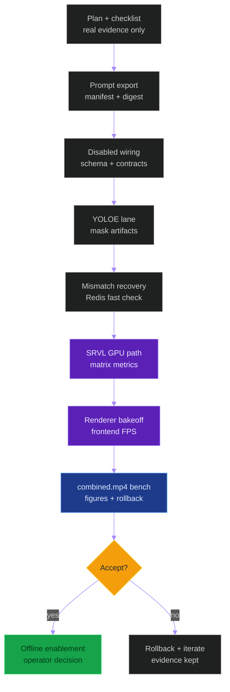
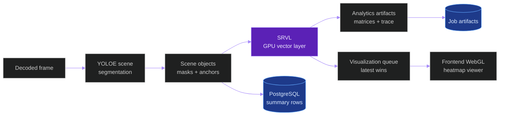
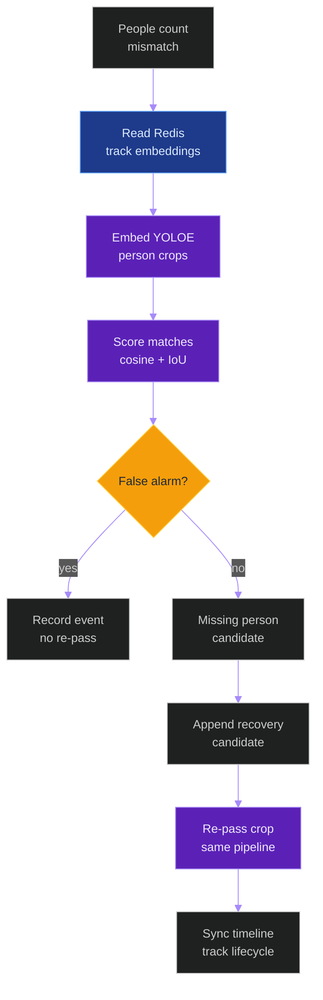

# YOLOE Scene Segmentation And SRVL Plan

**Last updated:** 2026-06-07

**Status:** Proposed implementation plan. YOLOE scene segmentation is not
implemented in the repository yet. The Spatial Relationship Vectorization Layer
defined here is also proposed and must be benchmarked before acceptance.

## Summary

Add a gated YOLOE scene-segmentation layer to the offline video inference
pipeline first. The layer uses a fixed classroom prompt profile to segment
people and non-ROI classroom regions, records full mask evidence for the frames
where YOLOE runs, flags contradictions against downstream detections, computes
pixel-normalized spatial distance/vector matrices, and renders a 2D scene-map
artifact as images and MP4.

The first version is evidence-first and non-destructive:

- Offline uploaded-video jobs only.
- Pixel-normalized image-space distances, not real-world meters.
- Flag-only contradiction handling.
- Fixed `classroom_roi_guard_v1` prompt profile for production-server
  benchmarking and tests, with an explicit `.env` override path for users and
  developers.
- `yoloe-26s-seg.pt` as the default small YOLOE-26 segmentation checkpoint.
- Full masks persisted for YOLOE inference frames through compressed sidecar
  artifacts, not raw PostgreSQL JSON.
- Adaptive inference/render cadence controlled by environment and config.
- A dedicated Spatial Relationship Vectorization Layer, abbreviated `SRVL`,
  converts object coordinates into distance matrices, vector matrices, and
  heatmap/correlation map buffers.
- SRVL uses vectorized GPU tensor operations in the production path and never
  uses Python loops over object pairs in the critical path.
- Visualization is non-blocking: analytics artifacts are reliable, while
  frontend visualization is best effort and latest-frame-wins.

## Source-of-truth references

| Kind | Reference |
|---|---|
| Doc | `docs/new_models_yoloe_depth_anything_v2_timing_decision.md` |
| Doc | `docs/entity/systems/offline_inference_pipeline.md` |
| Doc | `docs/entity/systems/live_streaming_pipeline.md` |
| Doc | `docs/entity/systems/triton_inference_plane.md` |
| Doc | `docs/production_inference_benchmark.md` |
| File | `backend/apps/pipeline/model_registry.py` |
| File | `backend/apps/pipeline/services/model_route_service.py` |
| File | `backend/apps/pipeline/services/triton_client.py` |
| File | `backend/apps/tracking/embeddings.py` |
| File | `backend/apps/tracking/embeddings_batch.py` |
| File | `backend/apps/video_analysis/models.py` |
| File | `backend/apps/video_analysis/serializers.py` |
| File | `backend/apps/video_analysis/tasks.py` |
| File | `backend/apps/video_analysis/views.py` |
| File | `backend/apps/video_analysis/ws_broadcast.py` |
| File | `backend/config/settings/base.py` |
| File | `frontend/package.json` |
| File | `frontend/src/types/videoAnalysis.ts` |
| File | `frontend/src/components/VideoPlayer/OverlayCanvas.tsx` |
| File | `frontend/src/components/camera/BoundingBoxCanvas.tsx` |
| File | `tools/prod/instrumentation_tools_manifest.toml` |
| File | `tools/prod/prod_check_instrumentation_tools.py` |
| File | `tools/prod/prod_run_instrumented_accepted_benchmark.sh` |
| External | <https://docs.ultralytics.com/models/yoloe/> |
| External | <https://github.com/ultralytics/assets/releases/download/v8.4.0/yoloe-26s-seg.pt> |
| External | <https://arxiv.org/abs/2503.07465> |
| External | <https://pixijs.com/> |
| External | <https://pixijs.download/dev/docs/rendering.html> |
| External | <https://deck.gl/docs> |
| External | <https://plotly.com/python/performance/> |
| External | <https://docs.nvidia.com/deploy/nvidia-smi/index.html> |
| External | <https://docs.nvidia.com/nsight-systems/UserGuide/index.html> |

## V1 Feature Decisions

| Decision | V1 choice | Reason |
|---|---|---|
| Runtime target | Offline-first | Avoids live latency regressions while the model cost is measured. |
| Distance basis | Pixel-normalized | Fast, calibration-free, and honest about not being metric distance. |
| Downstream guard action | Flag-only | Preserves existing detections and stores contradiction evidence. |
| Prompt mode | Fixed benchmark profile, `.env` overrideable | Keeps production-server benchmarks reproducible while allowing controlled prompt experiments. |
| Object profile | Classroom ROI guard | Targets people and common non-ROI surfaces/objects. |
| Model checkpoint | `yoloe-26s-seg.pt` | Uses the YOLOE-26 segmentation small variant for the first benchmark path. |
| Export order | Prompts before export | YOLOE exports are prompt-bound; do not export ONNX/TensorRT before `set_classes()`. |
| Mask scope | YOLOE frames | Stores full masks for frames where YOLOE actually runs. |
| Visualization cadence | Adaptive stride | Keeps MP4 frame count while avoiding per-frame YOLOE cost. |
| Spatial layer name | `Spatial Relationship Vectorization Layer` / `SRVL` | Names the coordinate-to-matrix/map module. |
| SRVL compute backend | `torch_cuda` first | GPU vectorization is required for production acceptance. |
| SRVL render backend | `frontend_webgl` first | Avoids backend image rendering on the critical path. |
| SRVL fallback | `numpy_cpu` for tests/degraded only | CPU fallback cannot be the accepted production path unless benchmarked. |

## YOLOE Model And Export Contract

V1 uses the YOLOE-26 segmentation small checkpoint:

```text
yoloe-26s-seg.pt
https://github.com/ultralytics/assets/releases/download/v8.4.0/yoloe-26s-seg.pt
```

YOLOE handles instance segmentation inside the same model architecture by using
a segmentation-capable detection head with a mask prediction branch. In
implementation terms, this means V1 must treat detection boxes, class labels,
confidence scores, and masks as one unified YOLOE output. The pipeline must not
add a separate segmentation model just to recover pixel masks. Inference results
are expected to expose masks through the Ultralytics-style result object, for
example `results[0].masks`, before conversion into the repository artifact
schema.

Confidence scores and all other YOLOE outputs emitted by the deployed runtime
route are evidence, not display-only metadata. The implementation must preserve
or artifact-reference boxes, class IDs/names, prompt class order, confidence
scores, masks, image/output shape metadata, timing metadata, and raw output
payload references when exposed. If a TensorRT/ONNX route cannot expose an
output that the normalizer expects, the trace must record an explicit
unavailable reason. Contradiction checks, false-alarm decisions,
missing-person eligibility, and visualization truth states must record the
YOLOE score used, the threshold value, and the `.env` key that supplied that
threshold.

The export path is prompt-bound. The implementation must configure the complete
class prompt list before any export step. This applies whether the pipeline
exports directly to TensorRT or exports ONNX first and then builds a TensorRT
engine. Exporting the base checkpoint first and trying to add prompts later is
not valid for the deployment path.

For the first production-server benchmark and test cycle, the active prompt
profile is fixed to `classroom_roi_guard_v1` so benchmark results are
comparable and reproducible. Users or developers may change the prompt profile
or ordered class list through `.env`, but any prompt change creates a different
model artifact and requires a fresh ONNX/TensorRT export before runtime use.
The runtime must not silently reuse an old TensorRT engine after `.env` prompt
values change.

Required build order:

1. Load `yoloe-26s-seg.pt` with `YOLOE`.
2. Resolve the `.env` prompt config. The production benchmark default resolves
   to `classroom_roi_guard_v1`.
3. Call `model.set_classes(prompt_classes)`.
4. Export the prompt-configured model to ONNX and/or TensorRT.
5. Load the exported artifact for validation and runtime inference.
6. Write an export manifest containing checkpoint URL, prompt profile,
   ordered classes, class count, export format, artifact digests, and exporter
   package versions, and the resolved `.env` prompt values.

Reference export shape. The code reads prompt classes and export format from
`.env`; do not hardcode prompt lists, thresholds, formats, or runtime values in
implementation code:

```python
import os
from ultralytics import YOLOE

prompt_classes = [
    value.strip()
    for value in os.environ["YOLOE_SCENE_PROMPT_CLASSES"].split(",")
    if value.strip()
]

model = YOLOE(os.environ["YOLOE_SCENE_CHECKPOINT"])
model.set_classes(prompt_classes)

onnx_model = model.export(format=os.environ["YOLOE_SCENE_ONNX_FORMAT"])
exported_model = YOLOE(onnx_model)
```

TensorRT export must follow the same ordering. If TensorRT is produced from an
ONNX intermediate, the ONNX file must already be generated after
`set_classes()`. If Ultralytics direct TensorRT export is used, `set_classes()`
must still happen before `model.export(format="engine")`.

Build validation must fail closed when:

- the export manifest has no prompt profile;
- the exported artifact class list does not match `classroom_roi_guard_v1`;
- the artifact digest does not match the manifest;
- a runtime tries to override prompts on a prompt-locked exported model;
- `.env` prompt values changed but the ONNX/TensorRT export manifest still
  points at the previous prompt digest;
- the checkpoint is not `yoloe-26s-seg.pt` unless an explicit benchmark cycle
  changes the model;
- any operational prompt, threshold, score weight, cadence, dense limit, matrix
  mode, renderer, artifact codec, or recovery gate used by the feature is not
  declared in `.env`/settings.

## Implementation Governance And Evidence Contract

This feature must obey `AGENTS.md` and the repository constitution before any
implementation is called accepted. The governing principle is simple: no mock,
template, synthetic-only, or prose-only artifact can prove this feature works.
Acceptance requires real files from real tests and real production Linux
benchmark runs on the canonical `combined.mp4` video.

Binding rules for every implementation phase:

- PostgreSQL remains the only relational database authority. Do not use SQLite
  for runtime, tests, migrations, benchmarks, or acceptance shortcuts.
- Production performance authority is the native Linux RTX 5090 server, without
  Docker and without `sudo`.
- The benchmark video is
  `/home/bamby/grad_project/Raw Data/Diverse Classroom Enviroments/combined.mp4`
  unless a later governed cycle explicitly changes the canonical input.
- Every claim must resolve to real source, test, benchmark, log, figure,
  manifest, workflow, or job evidence.
- Template files may be used as starting scaffolds only. They must be replaced
  by real measured artifacts before acceptance.
- Missing metrics must be recorded as `unavailable` with a reason. They must
  never be omitted, hidden, or plotted as zero.
- Any implementation issue found on the production server must be resolved or
  documented as an explicit blocker with the failing evidence path.
- No suppression, mutation, or recovery rewrite is allowed without append-only
  provenance and rollback proof.

Required repo deliverables before acceptance:

| Area | Required work |
|---|---|
| Tasks/checklists | Create or update implementation tasks, acceptance checklists, and rollback checklist entries. |
| Workflows | Update or create workflow files for new tests, docs, manifest checks, and artifact visibility when needed. |
| Test scripts | Add focused unit, integration, renderer, export, and benchmark test scripts. |
| Helper scripts | Add production helpers for export, validation, benchmark, metrics collection, figures, and rollback. |
| Evidence files | Commit or link real JSON/CSV/MD/PNG/SVG/MP4 evidence with digests and manifests. |
| Documentation | Document every phase with concrete file paths, Mermaid diagrams, and measured outcomes. |
| Compatibility | Update API, frontend, model-route, artifact, and telemetry contracts only with compatibility tests. |

Rolling implementation phases:



Phase documentation must include:

- what changed;
- why the change was needed;
- exact files changed;
- tests added or updated;
- production helper command used;
- benchmark replay key and job ID when applicable;
- raw artifact paths and SHA-256 digests;
- generated figure paths and figure manifest;
- rollback command and proof;
- unresolved risks, if any.

## Priority And Design Principles

Runtime priority is fixed:

1. Real-time behavior is the first priority. A new YOLOE/SRVL/renderer path
   must not stall the current inference pipeline.
2. Accuracy at the accepted model/input profile is co-equal with latency. A
   faster path that breaks correctness is rejected.
3. Semi-real-time behavior is the second priority when full real-time cannot
   be proven, but it must keep the highest measured accuracy available.
4. Every expensive operation must be gated, bounded, benchmarked, and
   rollbackable.

Design rules:

- Use clean, modular code that fits the current Django apps, Triton route
  service, artifact storage, telemetry, Redis, and React/Vite frontend.
- Prefer the simplest working design until real benchmark files prove that
  extra complexity is needed.
- Keep analytics and visualization separated: analytics is reliable, frontend
  visualization is non-blocking and latest-frame-wins.
- Respect existing contracts first. Create or update contracts only when the
  current surface cannot safely represent the new evidence.
- Every compatibility hypothesis must be verified with old and new tests plus
  the real `combined.mp4` production benchmark before acceptance.

## Supported Features

- Segment people as an independent open-vocabulary signal.
- Count YOLOE people and compare against `student + teacher` detections.
- Segment non-ROI regions: `table`, `desk`, `chair`, `wall`, `floor`,
  `ceiling`, `door`, `window`, `mirror`, `board`, and `screen`.
- Build a non-ROI union mask for hallucination checks.
- Flag downstream predictions that overlap strongly with non-ROI masks.
- Locate possible missing people from YOLOE person masks when the current
  person detector count is lower than YOLOE's person count.
- Save full mask evidence for every YOLOE inference frame.
- Generate a per-frame scene-object summary.
- Generate a distance matrix between scene objects.
- Generate a vector matrix where each cell contains normalized distance and
  angle theta between two objects.
- Generate proximity, direction, and correlation map buffers for frontend
  visualization.
- Render high-quality scene-map PNG/JPG/SVG snapshots.
- Render a scene-map MP4 while preserving the original video frame count.
- Emit benchmark artifacts and rollback evidence before any production enablement.

## High-Level Architecture

The YOLOE lane and SRVL are separate concerns:

- YOLOE produces object masks, boxes, class labels, and anchor points.
- SRVL consumes object coordinates and optional class/track metadata.
- SRVL outputs relation matrices and visualization-ready map buffers.
- The frontend renders high-rate heatmaps through WebGL-style primitives.
- Offline artifacts preserve matrices, masks, snapshots, and trace data.



## End-to-End Inference Story

1. A user uploads a video into the existing offline video-analysis flow.
2. The current pipeline runs as it does today: frame decode, person detection,
   behavior models, pose, tracking, persistence, and annotated video rendering.
3. If `YOLOE_SCENE_ENABLED=1`, the scene-segmentation lane observes the same
   decoded frames but only runs YOLOE on frames selected by
   `YOLOE_SCENE_INFER_STRIDE`.
4. Before runtime use, the build path has already loaded `yoloe-26s-seg.pt`,
   applied `classroom_roi_guard_v1` with `set_classes()`, and exported the
   prompt-locked ONNX/TensorRT artifact.
5. For each YOLOE frame, the lane sends a full-frame segmentation request to
   Triton using the prompt-locked `classroom_roi_guard_v1` engine.
6. YOLOE outputs are normalized into scene objects:
   class, confidence, bbox, mask reference, mask area, centroid, anchor point,
   and source profile.
7. The system builds a union mask for non-ROI classes. This mask is the
   "do not trust downstream predictions here without evidence" region.
8. The system compares existing detections with YOLOE:
   YOLOE person count vs current student/teacher count, and downstream boxes
   vs non-ROI masks.
9. V1 records contradiction events only. It does not delete, rewrite, suppress,
   or lower the confidence of existing detections.
10. The scene objects become points for spatial reasoning. People use
   bottom-center anchors when possible; other objects use mask centroids.
11. SRVL receives the ordered object coordinates and optional frame metadata.
12. SRVL uploads or reuses a compact `[N, 2]` coordinate tensor on GPU.
13. SRVL computes all pairwise `dx`, `dy`, distance, angle, vector, proximity,
   and map tensors through batched tensor operations.
14. SRVL writes analytics outputs to artifact buffers and enqueues the latest
   visualization state without blocking the inference path.
15. The renderer creates the human-facing scene map. On non-YOLOE frames, it
   reuses the latest scene state so the output MP4 still has the same frame
   count as the source video.
16. The job saves the scene-map MP4, snapshots, mask artifacts, matrix artifacts,
   trace artifacts, and an artifact manifest with digests.

## Data And Artifact Contract

PostgreSQL should store compact indexed summaries. Large masks and matrices
should be written as compressed files under the job artifact directory and
referenced by digest/path.

Proposed database additions:

| Model | Purpose | Key fields |
|---|---|---|
| `SceneFrameSummary` | One row per YOLOE frame. | job, frame, profile, object_count, person_count, non_roi_coverage_ratio, artifact refs |
| `SceneObjectObservation` | One row per segmented object. | frame, class_name, confidence, bbox_xyxy, centroid_xy, anchor_xy, mask_ref, area_px |
| `SceneContradictionEvent` | Append-only guard evidence. | frame, downstream_model, downstream_ref, scene_object_ref, overlap_ratio, rule, action |
| `SceneArtifactManifest` | Artifact index and digests. | job, artifact_type, path, sha256, schema_version, size_bytes |

Artifact files:

| Artifact | Format | Notes |
|---|---|---|
| Full masks | `rle_zstd` or compressed NPZ | One recoverable mask per scene object on YOLOE frames. |
| Scene objects | JSONL or Parquet | Compact per-object summaries for offline analysis. |
| Distance matrix | compressed NPZ plus JSON schema | Numeric matrix keyed by ordered object IDs. |
| Angle matrix | compressed NPZ plus JSON schema | Radian angle matrix from pairwise deltas. |
| Vector matrix | compressed NPZ plus JSON schema | Stores magnitude-angle and optional dx-dy arrays. |
| Heatmap buffers | Float16/UInt8 binary or PNG/WebP | Visualization-ready buffers for frontend or reports. |
| SRVL trace | JSONL | Per-frame timings, backend, queue, object count, and dropped-state evidence. |
| Scene snapshots | PNG, JPG, SVG | Human-facing map and matrix illustrations. |
| Scene video | MP4 | Preserves source frame count with last-known scene state. |

Database optimization rules:

- Do not store raw mask arrays in JSONField rows.
- Use `bulk_create` for scene summaries and contradiction events.
- Index by `(job, frame_number)`, `(job, class_name)`, and
  `(job, downstream_model, action)`.
- Keep API list endpoints paginated and summary-first.
- Load full masks only through explicit artifact endpoints.
- Store artifact digests so benchmark figures and decisions trace back to raw
  evidence.
- Prefer binary buffers, compressed NPZ, or JSONL metadata over giant JSON
  matrices in API responses.
- Keep full `[N, N]` outputs behind artifact refs; expose summaries and top-k
  relations to the frontend by default.

## System Wiring And Contract Compatibility

The implementation must connect to the existing system instead of creating a
parallel inference stack.

Required wiring points:

| Surface | Required integration |
|---|---|
| Model registry | Register YOLOE scene segmentation with explicit task/output kind and version. |
| Model route service | Add route keys and `.env` overrides following the existing `MODEL_ROUTE_*` pattern. |
| Triton client | Reuse the existing Triton request/telemetry path where possible. |
| Video task loop | Attach YOLOE/SRVL as gated side lanes around decoded frames. |
| Tracking embeddings | Reuse Redis job-track embedding keys for mismatch recovery. |
| PostgreSQL models | Store compact summaries, indexes, and append-only evidence. |
| Artifact storage | Store masks, matrices, maps, manifests, digests, and rendered MP4. |
| API serializers | Add read-only scene summaries without loading large masks by default. |
| WebSocket/broadcast | Send only compact scene-map metadata or buffer refs. |
| Frontend types | Extend TypeScript contracts with backward-compatible optional fields. |
| Frontend overlay | Add toggles without changing existing playback behavior. |

Compatibility rules:

- Existing jobs must behave exactly the same when `YOLOE_SCENE_ENABLED=0` and
  `SRVL_ENABLED=0`.
- New fields must be optional or versioned until the frontend and API contracts
  are both updated.
- Large artifacts must be requested explicitly; list/detail endpoints stay
  summary-first.
- Any model-route, serializer, artifact-schema, or websocket-contract change
  requires old-path and new-path tests.
- CI-required manifests, workflow inputs, and test fixtures must be tracked in
  Git and not hidden by `.gitignore`.

## Spatial Relationship Vectorization Layer

Recommended name:

`Spatial Relationship Vectorization Layer`

Recommended abbreviation:

`SRVL`

Code-friendly alternatives if a shorter class name is needed:

- `SpatialVectorLayer`
- `DistanceVectorizationLayer`
- `PairwiseRelationMapLayer`
- `SpatialCorrelationLayer`

SRVL converts object locations in frame space into:

1. Pairwise distance matrix.
2. Pairwise angle matrix.
3. Pairwise vector matrix.
4. Heatmap, direction map, proximity map, and correlation map buffers.

SRVL must be fast enough to run every 2 to 4 frames on around 32 FPS video,
with average video durations up to around 11 minutes. These are target workload
assumptions and must be validated against actual object count and hardware.

### SRVL Inputs

Required object input:

```python
objects = [
    {
        "object_id": 1,
        "track_id": 12,
        "class_name": "student",
        "center_x": 340.5,
        "center_y": 220.0,
        "bbox": [300, 180, 380, 260],
        "confidence": 0.94,
    },
]
```

Critical-path tensor form:

```text
coords shape = [N, 2]
coords[i] = [center_x, center_y]
```

Optional frame metadata:

```python
frame_metadata = {
    "frame_id": 1024,
    "video_id": "classroom_video_01",
    "timestamp_ms": 32000,
    "fps": 32,
    "frame_width": 1920,
    "frame_height": 1080,
}
```

Optional precomputed distance input:

```text
distance_matrix shape = [N, N]
```

Distance alone is magnitude only. SRVL still needs coordinates or pairwise
`dx` and `dy` to compute angle and direction maps.

### SRVL Mathematical Definition

For object coordinates:

```text
P_i = (x_i, y_i)
P_j = (x_j, y_j)
```

Pairwise deltas:

```text
dx[i,j] = x_j - x_i
dy[i,j] = y_j - y_i
```

Distance:

```text
D[i,j] = sqrt(dx[i,j]^2 + dy[i,j]^2)
```

Angle:

```text
A[i,j] = atan2(dy[i,j], dx[i,j])
```

Magnitude-angle vector:

```text
V[i,j,0] = D[i,j]
V[i,j,1] = A[i,j]
```

Optional Cartesian vector:

```text
V_cartesian[i,j,0] = dx[i,j]
V_cartesian[i,j,1] = dy[i,j]
```

The default angle unit is radians. Degree output can be derived as
`angle_degrees = angle_radians * 180 / pi` for display only.

### GPU Computation Contract

SRVL must avoid Python loops over object pairs in the critical path. The
production implementation should use PyTorch CUDA first, with CuPy as an
acceptable alternative if it fits the runtime better. Triton custom kernels or a
CUDA C++ extension are future options only if benchmarks prove the simpler
vectorized backend is insufficient.

Required computation style:

```python
coords_gpu = coords.to(device="cuda", dtype=torch.float32)

dx = coords_gpu[:, 0][None, :] - coords_gpu[:, 0][:, None]
dy = coords_gpu[:, 1][None, :] - coords_gpu[:, 1][:, None]

distance = torch.sqrt(dx * dx + dy * dy)
angle = torch.atan2(dy, dx)

vector_matrix = torch.stack((distance, angle), dim=-1)
cartesian_matrix = torch.stack((dx, dy), dim=-1)
```

The implementation should normalize coordinates or distances when configured:

- `frame_diagonal`: divide pixel distance by
  `sqrt(frame_width^2 + frame_height^2)`.
- `frame_width`: divide horizontal scale by frame width.
- `frame_height`: divide vertical scale by frame height.
- `none`: preserve pixel units.

### SRVL Output Schema

Expected per-frame schema:

```python
{
    "frame_id": 1024,
    "video_id": "classroom_video_01",
    "timestamp_ms": 32000,
    "object_count": 24,
    "objects": [
        {
            "object_id": 1,
            "track_id": 12,
            "class_name": "student",
            "center": [340.5, 220.0],
            "bbox": [300, 180, 380, 260],
            "confidence": 0.94,
        }
    ],
    "relations": {
        "distance_matrix": {
            "shape": [24, 24],
            "dtype": "float32",
            "unit": "frame_diagonal_normalized",
            "data_ref": "artifact_or_binary_buffer_ref",
        },
        "angle_matrix": {
            "shape": [24, 24],
            "dtype": "float32",
            "unit": "radians",
            "data_ref": "artifact_or_binary_buffer_ref",
        },
        "vector_matrix": {
            "shape": [24, 24, 2],
            "format": "magnitude_angle",
            "dtype": "float32",
            "data_ref": "artifact_or_binary_buffer_ref",
        },
    },
    "visualization": {
        "distance_heatmap": {
            "enabled": True,
            "render_backend": "frontend_webgl",
            "encoding": "binary_float16_or_rgba_texture",
            "width": 512,
            "height": 512,
            "data_ref": "heatmap_buffer_ref",
        },
        "angle_map": {
            "enabled": True,
            "render_backend": "frontend_webgl",
            "encoding": "rgba_texture",
            "data_ref": "angle_map_buffer_ref",
        },
        "correlation_map": {
            "enabled": True,
            "render_backend": "frontend_webgl",
            "encoding": "rgba_texture",
            "data_ref": "correlation_map_buffer_ref",
        },
    },
    "trace": {
        "compute_backend": "torch_cuda",
        "render_backend": "frontend_webgl",
        "matrix_mode": "full",
        "run_every_n_frames": 2,
        "timings_ms": {
            "tensor_prepare": 0.3,
            "pairwise_compute": 1.2,
            "map_prepare": 2.0,
            "serialization": 0.8,
            "total": 4.3,
        },
    },
}
```

Large matrices should be exposed by `data_ref`, not inline JSON, unless the
object count is tiny and the request is explicitly a debug endpoint.

### Matrix Modes

SRVL must support multiple scalability modes because pairwise output grows as
`O(N^2)`:

| Mode | Behavior | Output |
|---|---|---|
| `full` | Compute all pairwise relations. | Dense `[N,N]` and `[N,N,2]` tensors. |
| `thresholded` | Keep relations within `max_distance_px` or normalized threshold. | Sparse relation list plus optional dense artifact. |
| `top_k` | Keep K nearest neighbors per object. | Sparse top-k relation list. |
| `heatmap_only` | Produce visualization buffers without full matrix exposure. | Downsampled heatmap buffers. |

Default v1 mode is `full` while `N <= YOLOE_SCENE_MAX_OBJECTS_PER_FRAME`.
For larger N, the implementation should switch to `top_k` or `thresholded`
according to config and record the switch in trace output.

### Heatmap And Correlation Maps

SRVL should generate visualization-ready maps:

| Map | Purpose | Suggested formula or encoding |
|---|---|---|
| Distance heatmap | Visualize pairwise proximity intensity. | `proximity = exp(-distance / sigma)` or `1 / (distance + epsilon)`. |
| Angle map | Visualize direction from one object to another. | Hue from `atan2(dy, dx)`, brightness from confidence or distance weight. |
| Correlation map | Estimate relationship strength. | `proximity_score * class_weight * temporal_consistency`. |
| Interaction map | Future behavior/attention relation view. | Combine SRVL with pose, gaze, and behavior features. |

The correlation formula must remain configurable. V1 should record the formula
name and parameters in trace output, because "correlation" is a system
interpretation, not just geometry.

### Non-Blocking Architecture

SRVL must not block inference or frontend rendering.

Recommended queue split:

```text
Frame processor
    -> bounded GPU compute queue
    -> reliable analytics writer
    -> bounded visualization queue
    -> frontend WebGL renderer
```

Rules:

- Do not block inference waiting for frontend rendering.
- Do not block frontend waiting for full-resolution matrices.
- Keep analytics outputs reliable and traceable.
- Keep visualization best effort and latest-frame-wins.
- Drop old visualization frames if the frontend cannot keep up.
- Keep queue sizes bounded to prevent memory growth.
- Record dropped, delayed, and rendered visualization counters.

### Performance Requirements

Target workload:

- Video frame rate around 32 FPS.
- SRVL cadence every 2 to 4 frames.
- Average video duration up to around 11 minutes.

Performance goals before acceptance:

| Stage | Goal |
|---|---:|
| Pairwise GPU compute | Preferably less than 2 ms for typical classroom object count. |
| Map generation | Preferably less than 5 ms per executed frame. |
| Full SRVL frame cost | Preferably less than 8 to 10 ms per executed frame. |
| Frontend display | 30 FPS or better under normal object count. |

These are targets, not claims. Acceptance requires measured evidence on the
production benchmark path and representative high-object-count stress cases.

### Memory And Transfer Rules

- Keep pairwise computation on GPU.
- Avoid copying full dense matrices to CPU unless an artifact or API response
  explicitly needs them.
- Use Float32 for analytics by default.
- Use Float16 or UInt8/RGBA encodings for visualization when benchmarked.
- Use sparse/top-k output when N is large.
- Reuse preallocated GPU buffers where practical.
- Avoid repeated allocation inside the frame loop.
- Keep full mask artifacts separate from SRVL matrix artifacts.

### Error Handling

| Case | Required behavior |
|---|---|
| Zero objects | Return empty objects, empty/sentinel matrices, and trace `object_count=0`. |
| One object | Return `1x1` zero distance/angle/vector matrices. |
| Invalid or NaN coordinates | Filter object or mark invalid; record count and reason in trace. |
| Duplicate object IDs | Keep source row IDs but assign stable frame-local relation indexes. |
| Missing track IDs | Use `object_id` and class label; do not fail relation generation. |
| Objects outside frame | Clamp only if configured; otherwise mark invalid and trace. |
| GPU unavailable | Use fallback only when enabled; mark backend and degraded reason. |
| Render backend unavailable | Continue analytics and mark visualization unavailable. |
| Frontend disconnected | Keep artifact path alive; drop live visualization frames without blocking. |

### SRVL Traceability

Each output must include enough trace data to answer:

- Which frame produced this map?
- Which objects were included?
- Which coordinates were used?
- Which backend computed it?
- How long did each stage take?
- Was downsampling, top-k, thresholding, or fallback applied?
- Was the visualization frame rendered, delayed, or dropped?

Required trace fields:

```python
trace = {
    "video_id": "classroom_video_01",
    "frame_id": 1024,
    "timestamp_ms": 32000,
    "object_count": 24,
    "run_every_n_frames": 2,
    "input_source": "tracker_centroids_or_yoloe_anchors",
    "coordinate_format": "center_xy",
    "distance_normalization": "frame_diagonal",
    "compute_backend": "torch_cuda",
    "render_backend": "frontend_webgl",
    "matrix_mode": "full",
    "timings_ms": {
        "tensor_prepare": 0.3,
        "pairwise_compute": 1.2,
        "map_prepare": 2.0,
        "serialization": 0.8,
        "total": 4.3,
    },
}
```

### SRVL Benchmarking

Benchmark dimensions:

- Object count N.
- Frame resolution.
- Run frequency.
- GPU backend.
- Render backend.
- Serialization method.
- Frontend FPS.
- Backend latency.
- Memory usage.
- GPU utilization.
- CPU utilization.

Required metrics:

```python
benchmark = {
    "object_count": 32,
    "compute_ms_mean": 1.3,
    "compute_ms_p50": 1.1,
    "compute_ms_p95": 2.2,
    "compute_ms_p99": 3.0,
    "render_ms_mean": 3.5,
    "serialization_ms_mean": 0.9,
    "end_to_end_ms_mean": 5.8,
    "frontend_fps": 60,
    "dropped_visualization_frames": 2,
    "gpu_memory_mb": 128,
    "cpu_percent": 12.5,
}
```

Acceptance requires before/after benchmark evidence, stress tests with high
object count, frontend responsiveness validation, no backend stalls, no memory
leak, and trace logs.

### SRVL GPU Parallelization And Metrics

SRVL must be implemented in the most optimistic measured GPU path for this
system, not the most complex theoretical path. The first production candidate is
PyTorch CUDA broadcasting with preallocated buffers and CUDA event timing. CuPy,
Triton kernels, CUDA C++ extensions, or custom WebGPU paths are allowed only
after real benchmark files prove the simpler path is insufficient.

Required implementation rules:

- Use vectorized GPU tensor operations for pairwise deltas, distance, angle,
  vector stacking, top-k, and threshold masks.
- Avoid Python loops over object pairs in the critical path.
- Avoid repeated GPU allocation inside the frame loop where fixed maximum
  object counts make preallocation practical.
- Avoid GPU-to-CPU transfers for full dense matrices unless writing an artifact
  or serving an explicit inspection request.
- Use CUDA events for SRVL kernel/operation timing where PyTorch exposes them.
- Use queue timing around tensor preparation, compute, serialization, artifact
  write, and frontend enqueue.
- Keep CPU fallback as a test/degraded path only unless a production benchmark
  proves it meets the real-time priority.

Required GPU and runtime metrics:

| Metric bucket | Required examples |
|---|---|
| GPU utilization | `utilization.gpu`, `utilization.memory`, SM clocks, memory clocks, P-state. |
| GPU memory | used/free/total, peak allocation, PyTorch allocated/reserved bytes. |
| GPU power/thermal | power draw, temperature, throttling reason if available. |
| Transfer cost | host-to-device, device-to-host, serialized bytes, buffer reuse rate. |
| Kernel timing | CUDA event p50/p95/p99 for pairwise compute and map prep. |
| Queue timing | wait time, run time, dropped visualization frames, backpressure count. |
| CPU/memory | worker RSS, CPU percent, Python allocation hotspots. |
| DB/Redis | writes, lookup latency, Redis miss/fallback count, PostgreSQL batch timing. |
| Frontend | frame time, FPS, dropped frames, main-thread long tasks, GPU context loss. |

Instrumentation rules:

- Prefer existing instrumentation helpers and extend them when possible.
- Use `nvidia-smi` CSV sampling as the baseline GPU metrics source.
- Use NVML Python bindings if maintainable per driver compatibility and useful
  for lower-overhead sampling.
- Use Nsight Systems CLI only when available or installable in user space; do
  not require Docker or `sudo`.
- Python instrumentation dependencies must be declared through `uv` and locked
  in the repository when they become required.
- Shell/PowerShell helpers must support user-space installs into ignored local
  tool directories such as `backend/.tools` when a production metric tool is not
  already available.
- Helper scripts must print exact reproduction commands and write machine-readable
  evidence paths so another agent can repeat the run.
- If a tool is unavailable on the production Linux server, record the tool name,
  attempted command, failure reason, and the replacement metric path.

Required helper scripts before acceptance:

| Helper | Purpose |
|---|---|
| `tools/prod/prod_export_yoloe_scene_model.*` | Prompt-lock and export YOLOE ONNX/TensorRT with manifest. |
| `tools/prod/prod_verify_yoloe_scene_export.*` | Validate checkpoint, prompts, digest, Triton route, and sample output. |
| `tools/prod/prod_run_yoloe_scene_benchmark.*` | Run baseline/candidate on `combined.mp4`. |
| `tools/prod/prod_collect_yoloe_scene_metrics.py` | Collect model, SRVL, render, Redis, DB, GPU, and CPU metrics. |
| `tools/prod/prod_benchmark_scene_renderers.*` | Compare frontend renderer candidates under representative payloads. |
| `tools/prod/prod_rollback_yoloe_scene.*` | Disable YOLOE/SRVL and prove current pipeline behavior is restored. |

## Spatial Matrix Algorithm

For each YOLOE/SRVL frame:

1. Build an ordered object list:
   `object_id`, `class_name`, `anchor_x`, `anchor_y`, `confidence`, and
   `mask_ref`.
2. Normalize coordinates:
   `x_norm = anchor_x / frame_width`, `y_norm = anchor_y / frame_height`.
3. Compute pairwise deltas with NumPy broadcasting:
   `dx[i,j] = x_norm[j] - x_norm[i]`,
   `dy[i,j] = y_norm[j] - y_norm[i]`.
4. Compute distance:
   `distance[i,j] = sqrt(dx[i,j]^2 + dy[i,j]^2) / sqrt(2)`.
5. Compute direction:
   `theta[i,j] = atan2(dy[i,j], dx[i,j])`.
6. Store the vector matrix as two dense arrays:
   `distance[N,N]` and `theta[N,N]`.

This CPU-readable algorithm describes the math only. Production SRVL must use
the GPU vectorized contract above, not pairwise Python loops.

## Guard Rules

V1 guard output is append-only evidence.

| Rule | Trigger | V1 action |
|---|---|---|
| `person_count_gap` | YOLOE person count is greater than student plus teacher count. | Record missing-person candidate regions. |
| `person_on_non_roi` | Person detector box has high overlap with table, desk, chair, wall, floor, mirror, board, screen, door, window, or ceiling mask. | Record contradiction event. |
| `behavior_on_non_person` | Behavior output is associated with a region not supported by a person mask or person track. | Record contradiction event. |
| `scene_unavailable` | YOLOE did not run or failed for the frame. | Mark scene guard unavailable, never suppress. |

Hard suppression is out of scope for v1. If later evidence proves the guard is
reliable, a separate cycle can add `soft_suppress` or `hard_suppress` with its
own benchmark, rollback proof, and reviewer-labeled correctness report.

## People Mismatch Recovery Algorithm

When YOLOE detects a different number of people than
`student_count + teacher_count`, the system must run a fast reconciliation
check before declaring a missing person or false alarm. This check must use
existing Redis embedding caches first and avoid scanning PostgreSQL in the
critical path.

Existing Redis embedding keys to reuse:

```text
embeddings:job:{job_id}:tracks
embeddings:job:{job_id}:track:{track_id}:latest
embeddings:job:{job_id}:track:{track_id}:history
embedding:{track_id}:latest
```

Fast mismatch flow:



Step-by-step algorithm:

1. Count YOLOE `person` masks and current student/teacher detections for the
   same `job_id`, `frame_number`, and timestamp.
2. If counts match, record `person_count_match` in trace and exit.
3. If counts do not match, query Redis for job-scoped track IDs and latest
   embeddings. PostgreSQL is a fallback only when Redis is unavailable and the
   fallback is enabled.
4. For each YOLOE person mask, derive a tight bbox, a masked crop, a centroid,
   a bottom-center anchor, mask area, and confidence.
5. Generate an appearance vector for each YOLOE person crop by reusing the
   existing embedding extraction path or a governed ReID route. Coerce vectors
   to the repository embedding dimension before Redis or DB use.
6. Score each YOLOE person against existing student/teacher tracks:

```text
match_score =
    w_embed * cosine_similarity +
    w_iou * bbox_or_mask_iou +
    w_center * exp(-center_distance / sigma) +
    w_time * temporal_consistency
```

7. Solve matching as one-to-one assignment. Do not use raw local track ID
   equality as identity proof across independent runs.
8. If a YOLOE person maps to an existing track above threshold, classify it as
   `matched_existing_person` or `false_alarm_or_duplicate` and do not re-pass.
9. If a YOLOE person remains unmatched and passes confidence, area, non-ROI,
   and temporal checks, create an append-only `SceneRecoveryCandidate`.
10. Re-pass the missing-person candidate through the same downstream crop-level
   inference path used for detected people. The re-pass payload must include
   `source="yoloe_recovery"`, frame identity, bbox, mask reference, prompt
   profile, export manifest digest, and relation to the original YOLOE object.
11. Synchronize the candidate into the inference timeline with the original
   frame number, timestamp, and a provisional source-scoped ID such as
   `yoloe_recovery:{frame_number}:{object_index}`.
12. Merge into an existing track only through the governed tracker/ReID
   assignment rule. Ambiguous cases remain unresolved and append-only.
13. For offline only, a bounded lookback/lookahead window may backfill the
   candidate across neighboring frames. This window must be configured,
   measured, and disabled for live use.
14. Add a short-lived detector assist region for the next N frames so the
   current person detector is forced to re-evaluate the missed region. This is
   a bounded ROI hint, not retraining and not hard suppression.
15. Record recurrence metrics. The plan cannot promise that non-detections
   never happen again; it must prove that recurrence is reduced or mark the
   detector gap unresolved.

Required mismatch/recovery metrics:

| Metric | Meaning |
|---|---|
| `yoloe_person_count` | Number of YOLOE person masks in the frame. |
| `student_teacher_count` | Current system person count from students plus teachers. |
| `redis_embedding_lookup_ms` | Time to fetch track embeddings from Redis. |
| `yoloe_crop_embedding_ms` | Time to embed YOLOE person crops. |
| `matched_existing_count` | YOLOE persons matched to current tracks. |
| `false_alarm_count` | YOLOE candidates rejected as duplicate or false alarm. |
| `missing_candidate_count` | Unmatched people eligible for re-pass. |
| `repass_count` | Candidates actually sent back through inference. |
| `repass_latency_ms` | Added wall time from recovery re-pass. |
| `unresolved_count` | Ambiguous candidates left append-only. |

## Non-ROI Guard And Classroom Map

Non-ROI segmentation has two purposes:

1. Detect hallucinations where a person detector or downstream behavior model
   fires on a table, chair, wall, mirror, floor, ceiling, door, window, board,
   or screen.
2. Build a 2D classroom environment map for frontend visualization and offline
   review.

Non-ROI rules:

- Build a per-frame non-ROI union mask from the prompt-locked YOLOE output.
- Compare person boxes, behavior boxes, and recovery candidates against that
  mask using overlap, mask containment, center-in-mask, and class-specific
  thresholds.
- V1 records contradictions only. It does not delete or mutate current
  detections.
- The 2D classroom map should reuse the latest scene state on frames where
  YOLOE does not run, so the rendered MP4 preserves source frame count.
- Keep the design 2D unless real evidence proves that 3D, depth, or a more
  complex spatial model is necessary.
- Measure map-generation cost separately from model inference, SRVL compute,
  artifact writing, and frontend rendering.

The map output must support:

- class-stable region colors;
- non-ROI mask opacity controls;
- missing-person candidate overlays;
- SRVL relation overlays;
- low-latency binary/texture transport to the frontend;
- high-quality PNG/SVG/JPG snapshots and MP4 artifacts for reports.

## Configuration

Initial proposed defaults:

All operational values must be declared through `.env` and parsed through the
governed settings layer. Implementation code may define env key names and typed
settings schemas, but hardcoded prompt classes, thresholds, score weights,
cadences, limits, renderer choices, artifact codecs, matrix modes, and recovery
gates are forbidden.

| Variable | Default | Effect |
|---|---:|---|
| `YOLOE_SCENE_ENABLED` | `0` | Master kill switch. |
| `YOLOE_SCENE_PROFILE` | `classroom_roi_guard_v1` | Benchmark/test default prompt profile on the production server. |
| `YOLOE_SCENE_PROMPT_CLASSES` | profile default | Optional `.env` ordered class list override; changing it requires re-export. |
| `YOLOE_SCENE_CHECKPOINT` | `yoloe-26s-seg.pt` | Required YOLOE-26 segmentation small checkpoint. |
| `YOLOE_SCENE_CHECKPOINT_URL` | `https://github.com/ultralytics/assets/releases/download/v8.4.0/yoloe-26s-seg.pt` | Download/source URL for the required checkpoint. |
| `YOLOE_SCENE_PROMPT_LOCK_REQUIRED` | `1` | Refuse export/runtime if prompts were not applied before export. |
| `YOLOE_SCENE_PROMPT_CLASSES_SHA256` | manifest value | Digest of the resolved `.env` ordered `set_classes()` prompt list. |
| `YOLOE_SCENE_EXPORT_FORMAT` | `onnx_then_tensorrt` | Export prompt-locked ONNX first, then build TensorRT unless a direct engine path is benchmarked. |
| `YOLOE_SCENE_ONNX_FORMAT` | `onnx` | Intermediate export format passed to Ultralytics before TensorRT build. |
| `YOLOE_SCENE_OUTPUT_CAPTURE_MODE` | `summary_and_artifact_refs` | Capture all runtime-emitted YOLOE fields as summaries or artifact references. |
| `YOLOE_SCENE_PERSIST_RAW_OUTPUT_REFS` | `1` | Persist raw-output artifact references when the backend exposes them. |
| `YOLOE_SCENE_MODEL_NAME` | `yoloe_scene_segmentation` | Triton model route target. |
| `YOLOE_SCENE_MODEL_VERSION` | `v1` | Triton model version. |
| `YOLOE_SCENE_INFER_STRIDE` | `4` | Run YOLOE every N frames in offline v1. |
| `YOLOE_SCENE_VISUAL_STRIDE` | `2` | Refresh SRVL visualization every N frames when inputs are available. |
| `YOLOE_SCENE_MAX_OBJECTS_PER_FRAME` | `128` | Upper bound for matrices and render load. |
| `YOLOE_SCENE_CONFIDENCE_THRESHOLD` | `0.25` | Minimum YOLOE object confidence. |
| `YOLOE_SCENE_MASK_CONFIDENCE_THRESHOLD` | `0.25` | Minimum mask confidence when the route exposes mask confidence. |
| `YOLOE_SCENE_MIN_MASK_AREA_PX` | `16` | Minimum mask area for candidate eligibility. |
| `YOLOE_SCENE_MASK_CODEC` | `rle_zstd` | Full-mask artifact encoding. |
| `YOLOE_SCENE_CONTRADICTION_OVERLAP` | `0.40` | Minimum overlap to flag a contradiction. |
| `YOLOE_SCENE_CONTRADICTION_MIN_CONFIDENCE` | `0.25` | Minimum source confidence for contradiction evidence. |
| `YOLOE_SCENE_PERSON_MASK_SUPPORT_THRESHOLD` | `0.25` | Minimum person-mask support before treating a person decision as supported. |
| `YOLOE_SCENE_RENDER_MP4` | `1` | Write the scene-map MP4 artifact. |
| `YOLOE_SCENE_MISMATCH_RECOVERY` | `0` | Enable Redis-first people mismatch reconciliation and re-pass. |
| `YOLOE_SCENE_REDIS_EMBEDDING_CHECK` | `1` | Query Redis embeddings before DB fallback during mismatch checks. |
| `YOLOE_SCENE_RECOVERY_MIN_SCORE` | `0.70` | Minimum one-to-one match score for existing-track assignment. |
| `YOLOE_SCENE_RECOVERY_CONFIDENCE_WEIGHT` | `0.25` | Weight of YOLOE confidence in recovery scoring. |
| `YOLOE_SCENE_RECOVERY_GEOMETRY_WEIGHT` | `0.25` | Weight of geometry consistency in recovery scoring. |
| `YOLOE_SCENE_RECOVERY_APPEARANCE_WEIGHT` | `0.50` | Weight of Redis/DB appearance evidence in recovery scoring. |
| `YOLOE_SCENE_RECOVERY_REPASS` | `0` | Send missing-person candidates back through downstream inference. |
| `YOLOE_SCENE_RECOVERY_LOOKBACK_FRAMES` | `0` | Offline-only bounded backfill window; live must remain disabled. |
| `YOLOE_SCENE_RECOVERY_ASSIST_TTL` | `8` | Number of following frames to re-check missed-person regions. |
| `YOLOE_SCENE_PROD_BENCHMARK_VIDEO` | `combined.mp4` | Canonical production benchmark input. |
| `SRVL_ENABLED` | `0` | Master switch for distance/vector/map generation. |
| `SRVL_RUN_EVERY_N_FRAMES` | `2` | SRVL execution cadence when inputs are available. |
| `SRVL_COMPUTE_BACKEND` | `torch_cuda` | Production compute backend target. |
| `SRVL_FALLBACK_BACKEND` | `numpy_cpu` | Degraded/test fallback, not accepted production path by default. |
| `SRVL_MATRIX_MODE` | `full` | `full`, `thresholded`, `top_k`, or `heatmap_only`. |
| `SRVL_TOP_K` | `5` | Nearest-neighbor count for top-k mode. |
| `SRVL_MAX_DISTANCE_PX` | `500` | Threshold mode cutoff before normalization. |
| `SRVL_DISTANCE_NORMALIZATION` | `frame_diagonal` | Distance normalization method. |
| `SRVL_OUTPUT_DISTANCE_MATRIX` | `1` | Write distance matrix artifact. |
| `SRVL_OUTPUT_ANGLE_MATRIX` | `1` | Write angle matrix artifact. |
| `SRVL_OUTPUT_VECTOR_MATRIX` | `1` | Write magnitude-angle vector artifact. |
| `SRVL_OUTPUT_CARTESIAN_VECTORS` | `0` | Write dx-dy vector artifact. |
| `SRVL_OUTPUT_DISTANCE_HEATMAP` | `1` | Produce distance/proximity map output. |
| `SRVL_OUTPUT_ANGLE_MAP` | `1` | Produce directional map output. |
| `SRVL_OUTPUT_CORRELATION_MAP` | `1` | Produce configurable correlation map output. |
| `SRVL_RENDER_BACKEND` | `frontend_webgl` | Preferred production visualization renderer. |
| `SRVL_DEBUG_RENDER_BACKEND` | `matplotlib_agg` | Debug/report renderer only. |
| `SRVL_MATRIX_DTYPE` | `float32` | Analytics matrix dtype. |
| `SRVL_VISUALIZATION_DTYPE` | `float16` | Visualization buffer dtype when applicable. |
| `SRVL_TRACE_ENABLED` | `1` | Emit per-frame trace metadata. |
| `SRVL_BENCHMARK_ENABLED` | `1` | Capture benchmark timings and queue counters. |
| `SRVL_GPU_METRICS_ENABLED` | `1` | Capture GPU utilization, memory, power, clocks, and transfer metrics. |
| `SRVL_DROP_VISUALIZATION_IF_LATE` | `1` | Drop stale visualization work instead of blocking. |
| `SRVL_MAX_VISUALIZATION_QUEUE_SIZE` | `2` | Bounded queue for frontend/map output. |
| `SCENE_RENDER_BACKEND` | `pixijs_webgl_candidate` | Renderer candidate selected for benchmark, not accepted by default. |
| `SCENE_RENDER_BENCHMARK_ENABLED` | `1` | Measure frontend renderer FPS, frame time, memory, and dropped frames. |

These defaults are benchmark inputs, not acceptance claims.

## API And Frontend Contract

Add read-only scene outputs to the offline job review surface:

- Job status includes `scene_segmentation_summary`.
- Frame detail can include `scene_objects` for the selected frame.
- A new artifact endpoint exposes scene-map MP4, snapshots, matrices, and
  mask manifests.
- Existing playback remains usable when YOLOE is disabled.
- Frontend overlay toggles add:
  `scene_segmentation`, `non_roi_regions`, `scene_contradictions`, and
  `spatial_map`.
- SRVL outputs should be delivered as compact summaries, binary matrix buffers,
  sparse top-k lists, downsampled heatmap buffers, or encoded RGBA textures.
- Huge `[N,N]` JSON matrices should not be streamed to the frontend every frame.

The frontend should render summaries by default and request full mask artifacts
only when the user opens the scene-map or inspection view.

Preferred real-time display path:

1. Backend computes SRVL matrix/map tensors.
2. Backend sends summary metadata plus binary Float16/RGBA map buffer refs.
3. Frontend renders heatmaps with WebGL-style rendering.
4. Frontend requests full artifacts only for inspection/export.

## Renderer Search And Selection Protocol

The current frontend is React/Vite and does not yet carry a dedicated scene-map
renderer dependency. The implementation agent must benchmark renderer
candidates before adding a production dependency. The default assumption is
that production rendering should happen in the frontend with GPU-backed
WebGL/WebGPU-capable libraries, while backend rendering remains for offline
reports and debug artifacts.

Renderer candidates to benchmark:

| Candidate | Use case | Initial position |
|---|---|---|
| PixiJS WebGL | 2D masks, sprites, textures, heatmaps, classroom map overlays. | First candidate for production overlay rendering. |
| deck.gl | Large layered data, picking, dense relation/map visualization. | Candidate when relation layers grow beyond simple 2D overlays. |
| Three.js custom shader | Texture-heavy custom GPU composition. | Use only if PixiJS/deck.gl cannot meet measured needs. |
| Plotly WebGL | Analysis charts and debug/report figures. | Not the default critical-path renderer. |
| Canvas 2D | Compatibility fallback and debug rendering. | Degraded path only, not accepted real-time production path. |
| Matplotlib Agg | Offline screenshots and reports. | Never the production real-time renderer. |

Renderer benchmark requirements:

- Use representative binary buffers, RGBA textures, sparse top-k relations, and
  dense heatmap snapshots generated by SRVL.
- Measure frontend FPS, frame time p50/p95/p99, main-thread long tasks,
  memory growth, WebGL context loss, payload decode time, and dropped frames.
- Measure backend serialization and WebSocket/API transfer size separately from
  frontend draw time.
- Run desktop and constrained viewport checks with Playwright screenshots.
- Select the simplest renderer that meets real-time and accuracy requirements.
- Do not add deck.gl, Three.js, or custom shader complexity unless PixiJS or a
  simpler WebGL texture path fails with real evidence.

## Rendering Requirements

- Preserve source video frame count and FPS.
- Use cached latest scene state on frames where YOLOE did not run.
- Produce at least one high-quality PNG and one SVG snapshot for reports.
- Produce MP4 for video review.
- Use class-stable colors:
  people, furniture, structural surfaces, openings, boards/screens, and
  contradiction highlights should be visually distinct.
- Avoid putting render work on the critical inference path where possible.
- Do not use Matplotlib as the production real-time renderer.
- Matplotlib is allowed only for debug screenshots, offline reports, benchmark
  artifacts, and development validation with a non-interactive backend such as
  Agg.
- Preferred production rendering options are frontend WebGL, Three.js texture
  rendering, PixiJS, Plotly WebGL, Deck.gl, VisPy/OpenGL, or binary WebSocket /
  WebRTC map streams if the frontend architecture requires them.

## Test Plan

Unit tests:

- Mask encode/decode round trip.
- Scene object normalization from YOLOE outputs.
- YOLOE export helper applies `set_classes()` before ONNX/TensorRT export.
- Export manifest prompt list matches `classroom_roi_guard_v1`.
- `.env` prompt override changes the prompt digest and forces a new export.
- YOLOE result normalization preserves segmentation masks from the unified
  detection/segmentation output contract.
- Anchor selection for people and non-person objects.
- Non-ROI union mask construction.
- Person-count gap detection.
- Redis-first embedding lookup for YOLOE people mismatch recovery.
- One-to-one candidate matching with unresolved ambiguous cases.
- Append-only recovery candidate creation and provenance fields.
- Contradiction overlap rule.
- Distance and theta matrix calculation.
- SRVL GPU vectorized output parity against a small CPU reference.
- SRVL zero-object, one-object, invalid-coordinate, duplicate-ID, and
  GPU-unavailable paths.
- Top-k, thresholded, and heatmap-only mode behavior.
- Artifact manifest digest generation.

Integration tests:

- `YOLOE_SCENE_ENABLED=0` preserves existing offline output behavior.
- Prompt-locked `yoloe-26s-seg.pt` export loads through the runtime route.
- `YOLOE_SCENE_ENABLED=1` writes scene summaries, mask artifacts, matrix
  artifacts, and scene-map media.
- Mismatch recovery enabled writes append-only candidates and does not mutate
  existing detection rows.
- Recovery re-pass uses the existing downstream inference route and timeline
  identity metadata.
- API endpoints return summaries without loading full masks by default.
- SRVL binary artifact refs are readable and match manifest digests.
- Visualization queue drops stale frames without blocking analytics.
- Renderer candidate benchmark renders representative scene-map payloads without
  frontend freezing.
- Rerender and retry paths remain compatible with scene artifacts.

Benchmark and acceptance:

- Run baseline vs YOLOE-enabled on the canonical production video.
- The canonical production video is the real `combined.mp4`, not a mock,
  generated clip, or shortened template unless explicitly labeled as a
  non-acceptance smoke test.
- Capture FPS, step wall time, model RTT, GPU/VRAM, CPU/RSS, DB row counts,
  DB query timing, artifact size, render time, and correctness counters.
- Capture SRVL compute p50/p95/p99, serialization time, visualization queue
  drops, frontend FPS, GPU memory, and memory leak checks.
- Capture people mismatch counts, Redis lookup latency, embedding match quality,
  false alarms, missing candidates, re-pass count, and unresolved candidates.
- Capture non-ROI hallucination checks, contradiction overlap distribution, and
  scene-map render cost.
- Stress test SRVL at representative object counts such as 8, 16, 32, 64, and
  128 objects per frame.
- Compare renderer candidates using the same payload and record the selected
  renderer with raw evidence.
- Generate required benchmark figures and manifests from the same raw artifacts
  as the decision table.
- Prove rollback by setting `YOLOE_SCENE_ENABLED=0`.

## Out Of Scope For V1

- Live blocking or live suppression.
- Dynamic per-job prompt text.
- Real-world meter distances.
- 3D reconstruction.
- Depth Anything integration.
- Replacing the current student/teacher person detector.
- Mutating existing detection rows after persistence.
- Treating SRVL correlation score as a behavioral truth signal without a
  separate validation cycle.
- Backend real-time heatmap rendering with Matplotlib.

## Rollout Path

1. Create or update tasks, checklists, workflows, helper-script plan, and
   documentation stubs with real source references.
2. Add schema, artifact writers, config, and disabled route registration.
3. Download `yoloe-26s-seg.pt`, resolve the `.env` prompt config
   (`classroom_roi_guard_v1` for production benchmarking/testing by default),
   call `set_classes()`, then export ONNX/TensorRT from that prompt-configured
   model.
4. Add export manifest validation and Triton route compatibility checks.
5. Add offline YOLOE lane behind `YOLOE_SCENE_ENABLED=0`.
6. Add people mismatch reconciliation behind
   `YOLOE_SCENE_MISMATCH_RECOVERY=0`.
7. Add recovery re-pass behind `YOLOE_SCENE_RECOVERY_REPASS=0`.
8. Add SRVL behind `SRVL_ENABLED=0` with `torch_cuda` vectorized compute and
   CPU reference tests.
9. Add matrix, heatmap, correlation, trace, and contradiction artifact
   generation.
10. Add non-blocking visualization queue and read-only API/frontend support.
11. Benchmark renderer candidates and select the simplest passing renderer.
12. Add frontend WebGL heatmap rendering with binary/sparse transport.
13. Run local tests and small media validation.
14. Run SRVL microbenchmarks and end-to-end production benchmark on
   `combined.mp4` on the production Linux server.
15. Record benchmark figures, artifact manifests, issue resolutions, and
   rollback proof.
16. Decide whether to keep offline disabled, enable offline by operator
   exception, or iterate.

Live-stream use stays disabled until a separate live-specific plan proves that
latency, bounded queues, append-only evidence, and no-seek stream invariants are
preserved.

## Acceptance Criteria

The feature is accepted only if all of the following are true:

1. YOLOE scene segmentation writes correct summary rows and recoverable full-mask
   artifacts for YOLOE frames.
2. The deployed YOLOE artifact is exported from `yoloe-26s-seg.pt` only after
   resolving `.env` prompts, calling `set_classes(resolved_classes)`, and
   writing a matching prompt digest in the manifest.
3. YOLOE masks are captured from the unified instance-segmentation output and
   stored as recoverable mask artifacts.
4. People count mismatch recovery uses Redis embedding lookup first, produces
   append-only evidence, and leaves ambiguous cases unresolved.
5. Missing-person re-pass enters the existing inference path with timeline and
   provenance fields, without mutating old rows.
6. Non-ROI masks flag person-detector hallucinations and produce classroom-map
   artifacts without blocking inference.
7. SRVL distance matrix is numerically correct against a CPU reference.
8. SRVL angle matrix uses the documented `atan2(dy, dx)` convention.
9. SRVL vector matrix contains valid magnitude-angle pairs.
10. Optional Cartesian vectors contain valid `dx,dy` pairs.
11. Heatmap, angle map, and correlation map artifacts are generated and traceable.
12. Production SRVL pairwise computation avoids Python pair loops.
13. Frontend visualization does not freeze under representative object count.
14. Backend inference and analytics do not stall waiting for visualization.
15. Benchmarking covers object count, GPU backend, render backend, serialization,
    frontend FPS, CPU/GPU utilization, memory, and dropped frames.
16. Trace output identifies frame, objects, coordinates, backend, timings,
    downsampling, mode switches, dropped frames, and artifact refs.
17. Workflow files, checklists, tasks, helper scripts, and docs are updated
    when needed and all referenced artifacts are tracked or deliberately linked.
18. The real production Linux `combined.mp4` benchmark completes with raw
    metrics, generated figures, manifests, and rollback proof.
19. Rollback with `YOLOE_SCENE_ENABLED=0` and `SRVL_ENABLED=0` restores the
    existing offline pipeline behavior.

---

## Implementation Completion Note (T110 — 2026-06-07)

All 120 implementation tasks for spec `014-yoloe-scene-srvl` are complete.
The feature remains `staged_local_only` (disabled-by-default).

Remaining gaps before production acceptance:
- SC-010: PixiJS renderer benchmark not yet run on production RTX 5090.
- SC-009: SRVL p95 ≤ 10 ms gate not yet confirmed on production hardware.
- Production `combined.mp4` benchmark not yet run with YOLOE_SCENE_ENABLED=1.

See `docs/entity/cycles/cycle_014_yoloe_scene_srvl.md` §6 for evidence slot.
