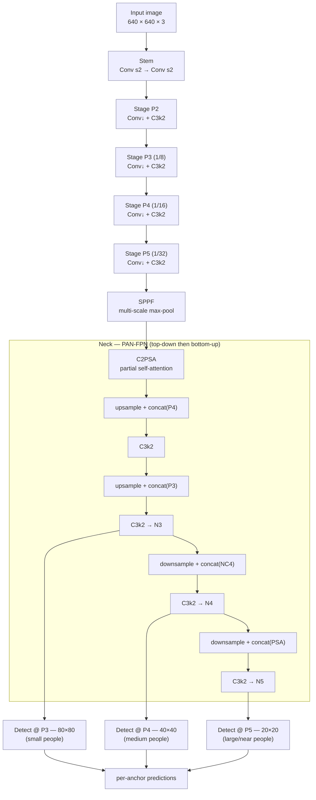
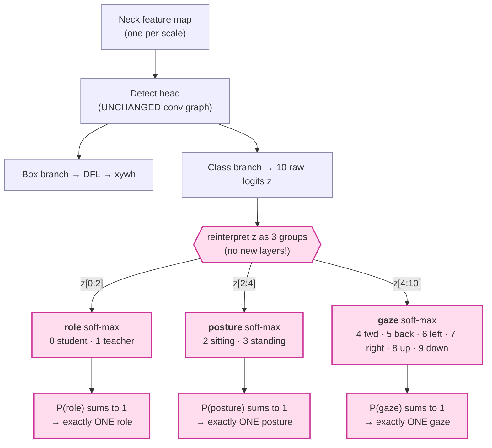
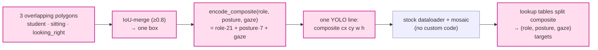
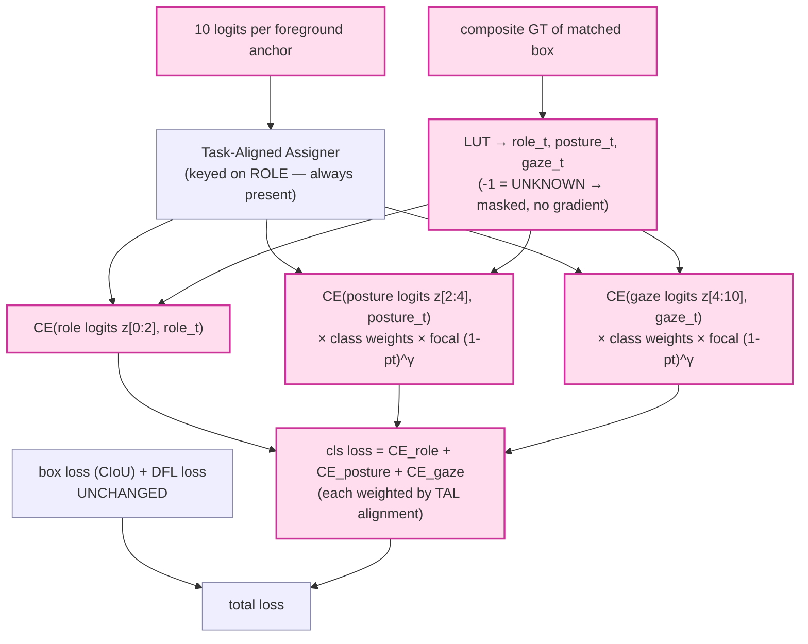
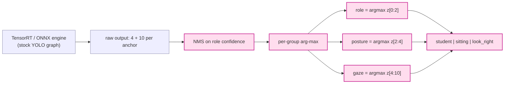

# The COMBINED Detector — Architecture & Our Modifications

*A narrative walkthrough of how we turned stock **YOLOv11‑medium** into a single
detector that, for every person in a classroom, reads three things at once:
**who** they are (student / teacher), **how** they sit (sitting / standing), and
**where** they look (six gaze directions) — while keeping the export to
TensorRT byte‑for‑byte identical to a normal YOLO.*

---

## 1. The story in one paragraph

A normal object detector answers one question per box: *"what class is this?"*
We needed three answers per person, and they are **structured**: a person is
exactly one role, exactly one posture, exactly one gaze — never two of the same
kind, and a teacher has no posture/gaze at all. Instead of inventing a brand‑new
network (which would have broken the clean, fast YOLO export pipeline), we kept
**all of YOLOv11‑m unchanged** and only re‑interpreted the very last layer: the
class logits. We split them into three small groups, each with its **own
soft‑max**, so the three answers become three independent — but each internally
mutually‑exclusive — decisions. Everything that makes this "structured" lives in
two tiny places: the **loss** (during training) and the **decode** (during
inference). The convolutional graph never changed, so `export(format="engine")`
still just works.

---

## 2. Stock YOLOv11‑medium (the part we did **not** change)

YOLOv11 keeps the classic three‑part shape — **Backbone → Neck → Head** — but
modernises the building blocks: `C3k2` blocks replace YOLOv8's `C2f`, an `SPPF`
widens the receptive field, and a new **`C2PSA`** (Cross‑Stage‑Partial block
*with self‑attention*) lets the network attend to context before the neck.



**Why "medium" (`yolo11m`):** depth/width multipliers give ≈ **20 M parameters**
and ≈ **68 GFLOPs at 640 px** — big enough to learn six gaze directions in a
crowded room, small enough to run in real time on the production RTX 5090. We
initialise it from **COCO‑pretrained** weights (backbone + neck transfer), so it
starts already knowing what people look like.

Each of the three Detect heads is **decoupled**: one branch regresses the box
(via *DFL*, distribution‑focal‑loss bins), a separate branch produces the class
logits. **Those class logits are the only thing we touch.**

---

## 3. Our modification — the grouped multi‑attribute head (the detailed part)

A stock head outputs `nc` independent class logits and squashes each with a
**sigmoid** (multi‑label). We instead make the head output exactly
**`nc = 10`** logits and read them as **three groups**, each with its own
**soft‑max**:



**The key idea:** a soft‑max over a group is a probability distribution that
**sums to 1**, so `arg‑max` always returns **exactly one** member. That single
fact gives us mutual exclusivity *for free, by construction* — the model
**cannot** output "sitting *and* standing," and it **cannot** output two gaze
directions. We never have to police it; the mathematics does.

The **10‑logit layout** is the whole design encoded in one number line:

```
 index:   0       1     | 2        3       | 4    5     6     7      8    9
 group:  └──── role ───┘ └──── posture ───┘ └──────────── gaze ────────────┘
 means:  student teacher  sitting standing   fwd  back  left  right  up  down
```

### 3.1 The teacher has no posture or gaze — and the head knows it (masking)

In our dataset a **teacher has no posture or gaze** — those attributes simply do
not apply, and the product is **not interested** in them. The head handles this
*architecturally* through the loss: when a box's posture or gaze is UNKNOWN
(every teacher, plus any student labelled only "student"), that group's target
is `-1` and its loss term is **skipped — zero gradient**. The network spends
**100% of its posture/gaze capacity on students**, and the decode layer simply
never reads posture/gaze off a teacher box.

> **History note:** we also ran a full experiment with explicit `posture_na` /
> `gaze_na` classes (a 12‑logit head). The production figures retired it: the
> n/a classes were "free wins" that inflated accuracy and starved the rare real
> classes (`look_left` fell to 0.002 recall). The full story, with the numbers,
> is Chapter 4 of [DECISIONS_JOURNAL.md](DECISIONS_JOURNAL.md).

### 3.2 Labels: how three overlapping boxes become one structured target

The raw data annotates each student as **three near‑identical boxes** (one for
role, one for posture, one for gaze). We merge them and pack the triple into one
integer — a **composite class id** — so it rides through the *stock* YOLO data
loader and mosaic augmentation untouched, then we unpack it inside the loss.



The dataset advertises `nc = 42` (so the composite ids pass the label check), but
the **head is forced to `nc = 10`** by our trainer — the loss is what bridges the
two.

### 3.3 Training — where "structured" actually happens (the loss)



The box/DFL terms are **exactly stock YOLO**, so localisation behaves normally.
The only new thing is replacing the single sigmoid‑BCE class loss with a **sum of
three soft‑max cross‑entropies**. Anchor‑to‑object assignment keys on **role**
(student/teacher), the one attribute every person has. UNKNOWN posture/gaze
targets (`-1`, e.g. every teacher) are masked out — zero gradient, see §3.1.

### 3.4 Fighting class imbalance (three mechanisms in the trainer/loss)

The data is brutally imbalanced (`look_down` ≈ 5,300 val samples; `look_up` 4).
Three mechanisms — added after the imbalance was measured, full reasoning in
[DECISIONS_JOURNAL.md](DECISIONS_JOURNAL.md) Chapters 5–6 — keep the rare
classes alive:

1. **Learned class weights** — at startup the trainer counts the real train
   labels and computes bounded inverse‑frequency weights
   `w_c = sqrt(total/(C·n_c))` clamped to `[0.5, 4.0]`; rare classes get up to
   4× loss, common ones are damped. Re‑learned from the data every run — never
   hardcoded.
2. **Focal modulation** — posture/gaze CE is scaled by `(1−p_true)^γ`
   (γ = 1.5 via `COMBINED_FOCAL_GAMMA`): easy, already‑correct samples lose
   loss mass; hard/rare ones keep it. Role stays plain CE.
3. **Direction‑aware horizontal flip** — the stock mirror augmentation silently
   corrupted direction labels (a mirrored `look_left` student *looks right* but
   kept the `look_left` label — 50% label noise on left/right!). Our flip
   subclass remaps `look_left ↔ look_right` through a lookup table whenever the
   image is actually mirrored; `forward/backward`, `up/down`, posture, and role
   are mirror‑invariant. Vertical flip is force‑disabled (it would corrupt
   `up/down` the same way). The mirror stops lying, and every flip becomes a
   correctly‑labelled extra sample for the rarest classes.

### 3.5 Inference — decode and the clean TensorRT story



Because the network's **forward graph is identical to a normal 10/12‑class YOLO**
(four box numbers + N class numbers per anchor), the exported `.engine` is a
**stock YOLO engine** — no custom ops, no plugins. All the "grouped" cleverness
is three `arg‑max` calls in Python *after* the engine returns. That is the whole
reason we re‑interpreted logits instead of redesigning the head: **structure for
free, deployment unchanged.**

---

## 4. What changed vs. stock YOLOv11‑m — at a glance

| Component | Stock YOLOv11‑m | COMBINED (ours) |
|---|---|---|
| Backbone (C3k2 / SPPF / **C2PSA**) | ✅ | ✅ unchanged |
| Neck (PAN‑FPN, C3k2) | ✅ | ✅ unchanged |
| Detect head **graph** (box + class conv) | ✅ | ✅ unchanged |
| Class activation | sigmoid, multi‑label | **3 group soft‑maxes** (role / posture / gaze) |
| `nc` | dataset classes | **10** (2 + 2 + 6; teacher posture/gaze MASKED, not predicted) |
| Class loss | BCE | **Σ grouped cross‑entropy** + learned class weights + focal `(1−pt)^γ` on posture/gaze (box/DFL unchanged) |
| Horizontal flip | mirrors image, labels untouched | **direction‑aware**: `look_left ↔ look_right` label remap on mirrored images |
| Decode | one arg‑max | **per‑group arg‑max** (mutual exclusivity guaranteed) |
| TensorRT export | stock | **stock — identical graph** |

---

## 5. One‑line mental model

> **YOLOv11‑m finds the people; three soft‑max groups on its last layer turn each
> person into `(role, posture, gaze)` — one answer per group, always — and because
> the graph never changed, the whole thing still exports to TensorRT as a plain
> YOLO.**

---

*Decision history (why each piece looks the way it does):*
[DECISIONS_JOURNAL.md](DECISIONS_JOURNAL.md)

*Sources for the stock‑YOLOv11 description:*
[Ultralytics YOLO11 architecture overview](https://www.emergentmind.com/topics/yolov11-architecture) ·
[YOLO11 C3k2 + C2PSA modules (ResearchGate figure)](https://www.researchgate.net/figure/YOLO11-Architecture-Featuring-New-C3K2-Blocks-and-C2PSA-Modules-9-Fig-1-above-is-the_fig1_389027619) ·
[YOLOv11 demystified (arXiv)](https://arxiv.org/html/2604.03349)
