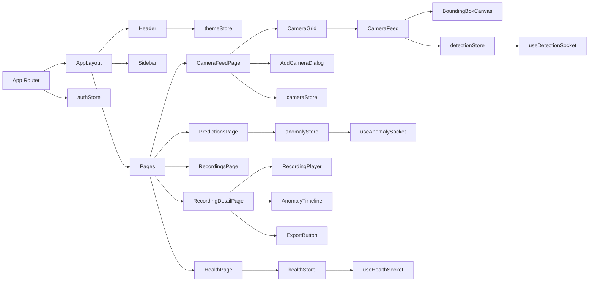

# Exam Monitoring Dashboard — Frontend Module

Frontend SPA for real-time exam monitoring and post-session review.

Built with React 19 + TypeScript + Vite, using Zustand for state, Axios for REST, and WebSockets for live telemetry.

---

## 1) Module Purpose

This module provides:

- Instructor authentication and guarded routing
- Live camera monitoring with detection overlays
- Anomaly triage workflows (acknowledge, dismiss, notes)
- Recording playback with timeline markers and export trigger
- Health dashboard and storage warning integration
- Theme switching (Black+Purple, Full Black, White)

---

## 2) Tech Stack

- Framework: React 19.2
- Language: TypeScript ~5.9
- Build tool: Vite 7
- Routing: react-router-dom 7
- State: Zustand 5
- HTTP: Axios 1
- Unit/Integration tests: Vitest + Testing Library
- E2E tests: Playwright

---

## 3) Prerequisites

- Node.js 20+
- npm 10+
- Backend API available and reachable

---

## 4) Local Setup

```bash
cd frontend
npm install
cp .env.example .env
npm run dev
```

Default dev server: `http://localhost:5173`

---

## 5) Environment Variables

- `VITE_API_BASE_URL`: REST API base URL (default fallback in code: `http://localhost:8000/api/v1`)
- `VITE_WS_BASE_URL`: WebSocket base URL

---

## 6) Scripts

```bash
npm run dev           # local development
npm run lint          # eslint
npm run type-check    # tsc --noEmit
npm run test          # vitest unit + integration
npm run test:coverage # vitest coverage
npm run test:e2e      # playwright e2e
npm run build         # production build
npm run preview       # preview built app
```

---

## 7) Architecture Overview

### 7.1 Layering

- `src/api/*`: HTTP API modules (thin transport layer)
- `src/stores/*`: state and business orchestration (Zustand)
- `src/hooks/*`: side-effect integration (WebSocket, WHEP, auth bootstrap)
- `src/components/*`: reusable UI and domain components
- `src/pages/*`: route-level composition

### 7.2 App Shell

- Root router in `src/App.tsx`
- Authenticated shell in `src/components/layout/AppLayout.tsx`
- Global layout primitives: `Header`, `Sidebar`, `StorageWarningBanner`

### 7.3 Route Guarding

- `ProtectedRoute`: redirects unauthenticated users to `/login`
- `PublicRoute`: redirects authenticated users from `/login` to `/dashboard`

---

## 8) Route Map

- `/login`
- `/dashboard`
- `/sessions`
- `/sessions/:id`
- `/cameras`
- `/camera-feed`
- `/predictions`
- `/anomalies`
- `/recordings`
- `/recordings/:id`
- `/health`
- `/settings`
- `/change-password`

---

## 9) State Stores (Zustand)

- `authStore`: login/logout/session restore, auth flags, profile
- `themeStore`: active theme, persistence, profile-preference initialization
- `cameraStore`: camera map, status transitions, grid helper
- `detectionStore`: frame buffers and class-filter state
- `anomalyStore`: alert lifecycle, triage actions, note management
- `healthStore`: subsystem health metrics + storage warning state

---

## 10) API Modules

- `api/client.ts`: Axios instance, CSRF propagation, normalized API errors
- `api/auth.ts`: login/logout/me/password/profile
- `api/cameras.ts`: list/create/update/delete/connect/disconnect
- `api/sessions.ts`: session list/create/end and related flows
- `api/detections.ts`: frames query for overlays/playback
- `api/anomalies.ts`: list + triage + notes
- `api/recordings.ts`: recordings list/detail/stream URL
- `api/exports.ts`: export initiate/status/download URL
- `api/health.ts`: health endpoints
- `api/dashboard.ts`: dashboard aggregates

---

## 11) Real-Time/WebSocket Integration

- Base connection manager: `hooks/useWebSocket.ts`
- Detection channel: `useDetectionSocket`
- Anomaly channel: `useAnomalySocket`
- Health channel: `useHealthSocket`

Behavior highlights:

- Exponential reconnect backoff
- Auto-resubscribe pattern after reconnect
- Safe message dispatch into stores

---

## 12) Camera & Recording Features

### 12.1 Live Monitoring

- Camera grid supports 1–8 feeds with responsive layout tiers
- Per-camera independent disconnect supported from tile controls
- Fullscreen focus mode (double-click) with `Escape` restore
- Bounding boxes rendered on transparent canvas overlays

### 12.2 Camera Management

- Add camera dialog with RTSP validation and max camera count enforcement
- Rename and remove actions from camera management controls
- Shared-camera indicator rendered when applicable

### 12.3 Recording Playback

- Recording list and detail pages
- Video + overlay playback component
- Anomaly timeline markers and seek integration
- Session export trigger + progress polling + download state

---

## 13) Theme System

- Tokens: `src/styles/tokens.css`
- Theme overrides:
  - `src/styles/themes/black-purple.css`
  - `src/styles/themes/full-black.css`
  - `src/styles/themes/white.css`

Runtime behavior:

- `data-theme` on `document.documentElement`
- Persisted in `localStorage`
- Pre-paint initialization script in `index.html` to prevent FOUC

UI color policy:

- Components/pages consume CSS variables (`var(--color-*)`)
- Bounding box colors also tokenized (`--color-bbox-*`)

---

## 14) Accessibility

- Visible focus styling in global CSS
- Skip-to-content link in `index.html`
- Modal focus-trap + Escape close
- Keyboard support for timeline marker activation
- Fullscreen camera escape restore

---

## 15) Testing Strategy

### 15.1 Unit

- Component tests under `tests/unit/components/**`
- Store tests under `tests/unit/stores/**`

### 15.2 Integration

- Theme integration and performance baselines under `tests/integration/**`

### 15.3 E2E (Playwright)

- `tests/e2e/login.spec.ts`
- `tests/e2e/camera-feed.spec.ts`
- `tests/e2e/anomaly-triage.spec.ts`
- `tests/e2e/recording-playback.spec.ts`

Current verified status:

- Unit/Integration: passing
- E2E: passing
- Build: passing

---

## 16) Frontend Task Status (Spec Tracking)

Spec task source: `specs/001-exam-monitor-dashboard/tasks-frontend.md`

- All `TF-001` through `TF-118` are marked completed (`[x]`)
- No unchecked `TF-*` entries remain

---

## 17) Troubleshooting

- API 401 on protected pages:
  - verify session cookie path/domain and backend auth middleware
- Empty live data:
  - verify `VITE_WS_BASE_URL` and backend WS routing
- Theme not persisting:
  - confirm localStorage availability and `data-theme` mutation
- Export not completing:
  - inspect export status endpoint and polling responses

---

## 18) Mermaid — Module Dependency Diagram



---

## 19) Detailed Verification Report (Latest Run)

Verification date: **2026-03-02**

### 19.1 Commands Executed

```bash
npm run lint
npm run type-check
npm run test
npm run test:e2e
npm run build
```

### 19.2 Results Summary

- **Lint**: ✅ Pass (`eslint .` completed with no errors)
- **Type Check**: ✅ Pass (`tsc --noEmit` completed)
- **Unit + Integration (Vitest)**: ✅ Pass
  - Test files: **22 passed / 22 total**
  - Tests: **193 passed / 193 total**
  - Duration: ~**6.90s**
- **E2E (Playwright)**: ✅ Pass
  - Tests: **5 passed / 5 total**
  - Duration: ~**6.1s**
- **Production Build**: ✅ Pass
  - Vite client build successful
  - Output generated under `dist/`
  - Build duration: ~**2.28s**

### 19.3 Notes

- Vitest output includes non-blocking React `act(...)` warnings in a few test cases.
- These are warnings only; they do **not** fail the suite and all tests still pass.

---

## 20) Deployment

### 20.1 Build for Production

```bash
cd frontend
npm ci
npm run lint
npm run type-check
npm run test
npm run build
```

Build artifacts are emitted to `dist/`.

### 20.2 Runtime Configuration

- Set `VITE_API_BASE_URL` to your backend API origin (for example `https://your-domain/api/v1`).
- Set `VITE_WS_BASE_URL` to your backend WebSocket origin (for example `wss://your-domain/ws`).
- WHEP signaling uses same-origin `/whep/{cameraId}/` through nginx proxy.

### 20.3 Deployment Patterns

- **Static hosting + reverse proxy**: serve `dist/` via Nginx and route `/api/v1`, `/ws`, and `/whep` to backend/go2rtc.
- **Containerized frontend**: build static bundle in CI, copy to Nginx image, and deploy with backend + infra stack.

### 20.4 Current Module Status

- Core SPA flows (auth, dashboard, cameras, sessions, anomalies, recordings, health, settings) are implemented.
- RTSP camera-connect UX updates (status badges, progress states, error surfaces, WHEP client changes) are integrated.
- One camera feed E2E test fixture may require periodic refresh when API contracts/UI selectors evolve.
