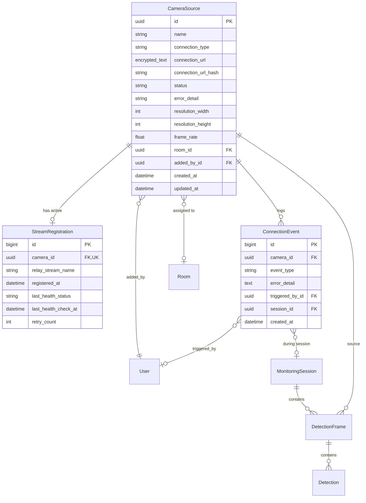
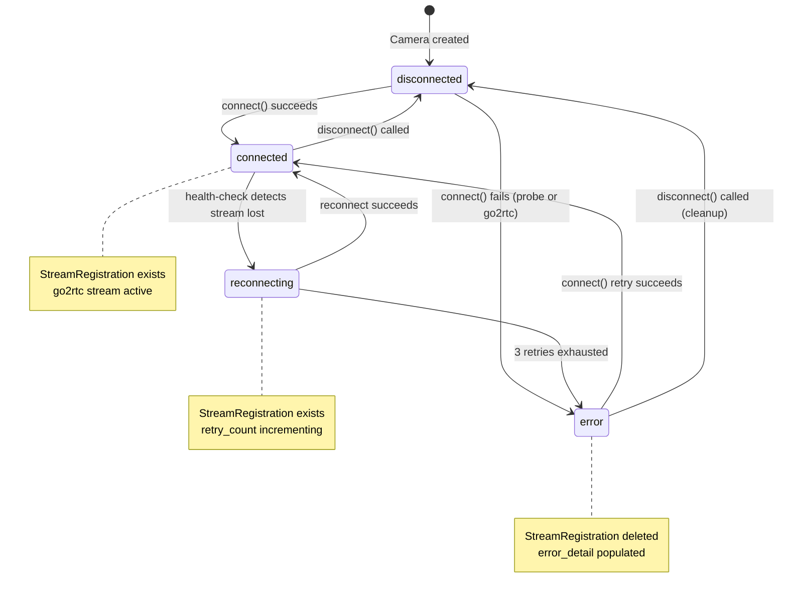

# Data Model: Fix RTSP Camera Feed Connection

**Branch**: `002-fix-rtsp-camera-feed` | **Date**: 2026-03-04  
**Spec**: [spec.md](spec.md) | **Plan**: [plan.md](plan.md) | **Research**: [research.md](research.md)

---

## Entity Overview



---

## Entity Specifications

### 1. CameraSource (Modified)

**Existing model** at [backend/apps/cameras/models.py](../../backend/apps/cameras/models.py). Fields being **added or modified** are marked with △.

| Field | Type | Constraints | Description | Change |
|-------|------|-------------|-------------|--------|
| `id` | `UUIDField` | PK, default `uuid4` | Unique camera identifier | Existing |
| `name` | `CharField(100)` | Required | Human-readable camera label | Existing |
| `connection_type` | `CharField(16)` | Choices: `rtsp`, `local`, `file` | Stream source type | Existing |
| `connection_url` | `EncryptedTextField` | Required | RTSP URL (encrypted at rest via Fernet) | △ **Modified**: `TextField` → `EncryptedTextField` (FR-015) |
| `connection_url_hash` | `CharField(64)` | `db_index=True`, blank | HMAC-SHA256 blind index of `connection_url` for uniqueness queries | △ **Added** (FR-015, FR-019) |
| `status` | `CharField(32)` | Choices: `connected`, `disconnected`, `reconnecting`, `error` | Current stream state reflecting actual go2rtc status | Existing (semantics tightened — FR-007) |
| `error_detail` | `CharField(500)` | Blank, default `''` | Human-readable error description when status is `error` | △ **Added** (FR-003) |
| `resolution_width` | `PositiveIntegerField` | Nullable | Video stream width in pixels | Existing |
| `resolution_height` | `PositiveIntegerField` | Nullable | Video stream height in pixels | Existing |
| `frame_rate` | `FloatField` | Nullable | Detected FPS of the source stream | Existing |
| `room` | `ForeignKey(Room)` | `SET_NULL`, nullable | Physical room association | Existing |
| `added_by` | `ForeignKey(User)` | `SET_NULL`, nullable | Instructor who created this camera | Existing |
| `created_at` | `DateTimeField` | `auto_now_add` | Record creation timestamp | Existing |
| `updated_at` | `DateTimeField` | `auto_now` | Last modification timestamp | Existing |

**Validation Rules**:
- `connection_url` must match `^rtsps?://` after decryption (backend validation).
- `connection_url_hash` is auto-computed on `save()` from the decrypted URL.
- `UniqueConstraint(fields=['added_by', 'connection_url_hash'], condition=Q(added_by__isnull=False))` enforces FR-019 (unique per instructor).
- `status` transitions are enforced by `CameraService` (not at the model level) — see State Transitions below.

**Indexes**:
- `connection_url_hash` (B-tree, for uniqueness lookups)
- `status` (B-tree, for health-check queries: `WHERE status = 'connected'`)
- `added_by` (existing FK index)

---

### 2. StreamRegistration (New)

**Purpose**: Tracks the association between a `CameraSource` and its active stream in the go2rtc media relay. Enables health-check polling and go2rtc restart recovery.

| Field | Type | Constraints | Description |
|-------|------|-------------|-------------|
| `id` | `BigAutoField` | PK | Auto-increment ID |
| `camera` | `OneToOneField(CameraSource)` | `CASCADE`, unique | Camera this registration belongs to |
| `relay_stream_name` | `CharField(150)` | Required | Stream name in go2rtc, format: `camera_{uuid}` |
| `registered_at` | `DateTimeField` | `auto_now_add` | When the stream was registered with go2rtc |
| `last_health_status` | `CharField(32)` | Choices: `healthy`, `unhealthy`, `unknown`; default `unknown` | Result of last health-check poll |
| `last_health_check_at` | `DateTimeField` | Nullable | Timestamp of last health-check |
| `retry_count` | `PositiveIntegerField` | Default `0` | Current consecutive reconnection attempts (reset on success) |

**Lifecycle**:
- **Created** when `CameraService.connect()` successfully registers a stream with go2rtc.
- **Deleted** when `CameraService.disconnect()` unregisters the stream from go2rtc.
- **Updated** on each health-check cycle (every 15s) with `last_health_status` and `last_health_check_at`.
- If all cameras are disconnected, no `StreamRegistration` rows exist.

**Indexes**:
- `camera` (unique, OneToOne FK)
- `last_health_status` (for filtering unhealthy streams in health-check)

---

### 3. ConnectionEvent (New)

**Purpose**: Audit log of all camera connection lifecycle events. Supports FR-013 (event logging), FR-026 (monitoring interruption tracking), and FR-024 (admin audit trail).

| Field | Type | Constraints | Description |
|-------|------|-------------|-------------|
| `id` | `BigAutoField` | PK | Auto-increment ID |
| `camera` | `ForeignKey(CameraSource)` | `SET_NULL`, nullable | Camera this event relates to (preserved with NULL FK when camera is deleted — FR-022, Q20) |
| `event_type` | `CharField(40)` | Choices (see below) | Type of connection lifecycle event |
| `error_detail` | `TextField` | Blank, default `''` | Error description (for failure events) |
| `triggered_by` | `ForeignKey(User)` | `SET_NULL`, nullable | User who triggered this event (null for system events) |
| `session` | `ForeignKey(MonitoringSession)` | `SET_NULL`, nullable | Active exam session at the time (for FR-026) |
| `created_at` | `DateTimeField` | `auto_now_add`, `db_index=True` | Event timestamp |

**Event Types** (`event_type` choices):

| Value | Trigger | `triggered_by` | `error_detail` |
|-------|---------|-----------------|-----------------|
| `connect_attempt` | User clicks Connect | User | — |
| `connect_success` | Stream registered + WHEP ready | User | — |
| `connect_failure` | RTSP probe or go2rtc registration fails | User | Probe stage + error message |
| `disconnect` | User clicks Disconnect | User | — |
| `stream_lost` | Health-check detects stream gone | `null` (system) | Reason if known |
| `reconnect_attempt` | Health-check auto-reconnect retry | `null` (system) | Attempt number |
| `reconnect_success` | Auto-reconnect completes | `null` (system) | — |
| `reconnect_failure` | All 3 auto-reconnect retries exhausted | `null` (system) | Last error |
| `monitoring_interruption_start` | Stream lost during active session | `null` (system) | FK to `session` set |
| `monitoring_interruption_end` | Stream restored during active session | `null` (system) | FK to `session` set |
| `force_disconnect` | Admin force-disconnects a camera | Admin user | — |
| `admin_connect` | Admin connects on behalf of instructor | Admin user | — |

**Retention**: 90 days. A Celery beat task `cleanup_connection_events` deletes rows where `created_at < now() - 90 days`.

**Indexes**:
- `camera` + `created_at` (composite, for per-camera history queries)
- `created_at` (for retention cleanup)
- `event_type` (for admin filtering)
- `triggered_by` (for admin "actions by user" queries)

---

## State Transitions

### CameraSource.status State Machine



**Transition Rules**:

| From | To | Trigger | Side Effects |
|------|----|---------|--------------|
| `disconnected` | `connected` | `CameraService.connect()` | RTSP probe → go2rtc PUT → create `StreamRegistration` → broadcast WS → log `connect_success` |
| `disconnected` | `error` | `CameraService.connect()` fails | Log `connect_failure` → set `error_detail` → broadcast WS |
| `connected` | `disconnected` | `CameraService.disconnect()` | go2rtc DELETE → delete `StreamRegistration` → broadcast WS → log `disconnect` |
| `connected` | `reconnecting` | Health-check detects stream lost | Log `stream_lost` → optionally log `monitoring_interruption_start` if session active → broadcast WS |
| `reconnecting` | `connected` | Health-check auto-reconnect succeeds | Reset `retry_count` → log `reconnect_success` → optionally log `monitoring_interruption_end` → broadcast WS → resume pipeline (FR-018) |
| `reconnecting` | `error` | 3 retries exhausted | Delete `StreamRegistration` → log `reconnect_failure` → set `error_detail` → broadcast WS |
| `error` | `connected` | User retries `connect()` | Same as `disconnected → connected` |
| `error` | `disconnected` | User calls `disconnect()` (cleanup) | Clear `error_detail` → broadcast WS |

---

## Soft-Delete Behavior (Camera Deletion — FR-022)

When an instructor deletes a `CameraSource`:
1. If `status == connected`: auto-disconnect first (go2rtc DELETE, delete `StreamRegistration`).
2. `CameraSource` row is **hard-deleted** (Django `Model.delete()`).
3. Related `ConnectionEvent` rows are **preserved** via `on_delete=SET_NULL` or by logging the camera UUID in `error_detail` before deletion.
4. Related `DetectionFrame`, `Detection`, `PyramidPrediction`, and `AnomalyEvent` rows are **preserved** — their FK to `CameraSource` uses `SET_NULL`.
5. `StreamRegistration` is deleted via `CASCADE` (tied to the camera).

**Note**: The existing `DetectionFrame.camera` FK uses `on_delete=models.CASCADE`. This must be changed to `SET_NULL` (nullable) to preserve detection data when a camera is deleted (FR-022). Same for `AnomalyEvent.camera`.

---

## Migration Plan

### Migration 1: Add fields to CameraSource
- Add `error_detail` (`CharField(500)`, blank, default `''`)
- Add `connection_url_hash` (`CharField(64)`, blank, `db_index=True`)
- Alter `connection_url` to use `EncryptedTextField` (column type stays `TEXT`, no SQL change)
- Add `UniqueConstraint` on (`added_by`, `connection_url_hash`) with condition `added_by IS NOT NULL`
- Add index on `status`

### Migration 2: Create StreamRegistration model
- New table `cameras_streamregistration`

### Migration 3: Create ConnectionEvent model
- New table `cameras_connectionevent`

### Migration 4: Data migration — encrypt existing URLs
- `RunPython`: Encrypt all existing `connection_url` values using Fernet
- `RunPython`: Compute `connection_url_hash` for all existing rows

### Migration 5: Alter FK cascade behavior
- `DetectionFrame.camera`: `CASCADE` → `SET_NULL` (make nullable)
- `AnomalyEvent.camera`: `CASCADE` → `SET_NULL` (make nullable)

---

## Frontend Type Additions

```typescript
// types/api.ts — additions

export interface StreamRegistration {
  id: number;
  camera_id: string;
  relay_stream_name: string;
  registered_at: string;
  last_health_status: 'healthy' | 'unhealthy' | 'unknown';
  last_health_check_at: string | null;
}

export type ConnectionEventType =
  | 'connect_attempt'
  | 'connect_success'
  | 'connect_failure'
  | 'disconnect'
  | 'stream_lost'
  | 'reconnect_attempt'
  | 'reconnect_success'
  | 'reconnect_failure'
  | 'monitoring_interruption_start'
  | 'monitoring_interruption_end'
  | 'force_disconnect'
  | 'admin_connect';

export interface ConnectionEvent {
  id: number;
  camera_id: string;
  event_type: ConnectionEventType;
  error_detail: string;
  triggered_by: UserBrief | null;
  session_id: string | null;
  created_at: string;
}

// Updated CameraSource — add error_detail and masked_url
export interface CameraSource {
  id: string;
  name: string;
  connection_type: 'rtsp' | 'local' | 'file';
  connection_url: string;    // masked if credentials present
  status: CameraStatus;
  error_detail: string;       // NEW
  resolution_width: number | null;
  resolution_height: number | null;
  frame_rate: number | null;
  room: CameraRoom | null;
  added_by: UserBrief | null;
  created_at: string;
  updated_at: string;
}
```
