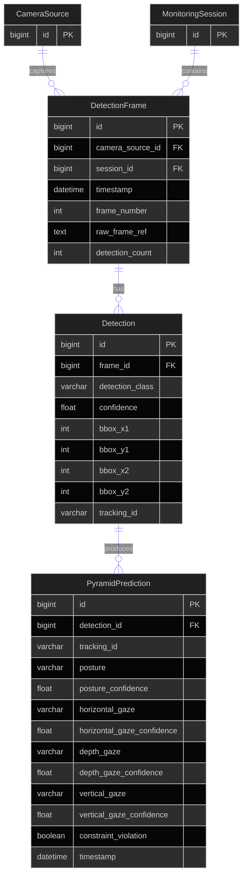
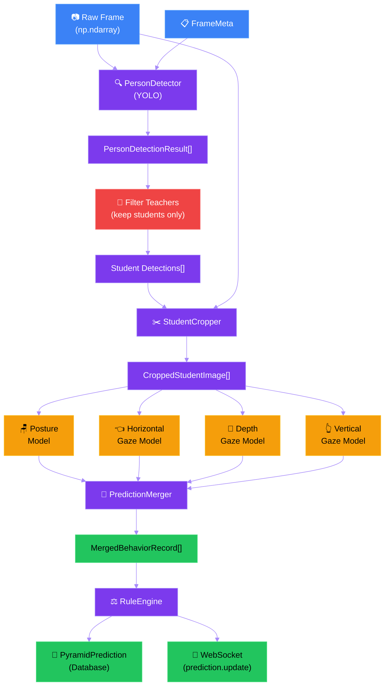
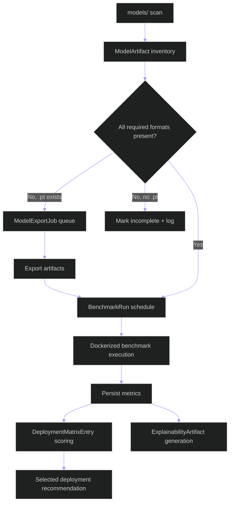

# Data Model: Student Behavior Detection Pyramid

**Branch**: `003-student-behavior-pyramid` | **Date**: 2026-04-24 | **Spec**: [spec.md](spec.md) | **Plan**: [plan.md](plan.md)

## Entities

### 1. DetectionFrame (EXISTS — `apps.detections.models.DetectionFrame`)

Represents a single video frame captured from a camera feed. This is the input to the detection pyramid.

| Field | Type | Constraints | Description |
|-------|------|-------------|-------------|
| `id` | BigAutoField | PK | Auto-incrementing primary key |
| `camera_source` | FK → CameraSource | SET_NULL, nullable | Camera that captured this frame |
| `session` | FK → MonitoringSession | CASCADE | Monitoring session this frame belongs to |
| `timestamp` | DateTimeField | indexed | When the frame was captured |
| `frame_number` | PositiveIntegerField | default=0 | Sequential frame number within session |
| `raw_frame_ref` | TextField | blank | Reference to raw frame storage (file path or blob key) |
| `detection_count` | PositiveIntegerField | default=0 | Number of persons detected in this frame |

**Relationships**:
- Belongs to one `CameraSource` (nullable — camera may be deleted)
- Belongs to one `MonitoringSession`
- Has many `Detection` records (one per detected person)

**Validation Rules**:
- `frame_number` ≥ 0
- `detection_count` ≥ 0
- `timestamp` must be timezone-aware

---

### 2. Detection (EXISTS — `apps.detections.models.Detection`)

Represents a single person detected within a frame. Each detection has a bounding box and a classification (student or teacher).

| Field | Type | Constraints | Description |
|-------|------|-------------|-------------|
| `id` | BigAutoField | PK | Auto-incrementing primary key |
| `frame` | FK → DetectionFrame | CASCADE | The frame this detection belongs to |
| `detection_class` | CharField(16) | choices: student, teacher | Person classification |
| `confidence` | FloatField | default=0.0 | Detection confidence score [0.0, 1.0] |
| `bbox_x1` | IntegerField | default=0 | Bounding box top-left X coordinate (pixels) |
| `bbox_y1` | IntegerField | default=0 | Bounding box top-left Y coordinate (pixels) |
| `bbox_x2` | IntegerField | default=0 | Bounding box bottom-right X coordinate (pixels) |
| `bbox_y2` | IntegerField | default=0 | Bounding box bottom-right Y coordinate (pixels) |
| `tracking_id` | CharField(64) | nullable, indexed | Cross-frame tracking identifier (e.g., "S-001") |

**Relationships**:
- Belongs to one `DetectionFrame`
- Has one `PyramidPrediction` (only for student detections)

**Validation Rules**:
- `confidence` must be in [0.0, 1.0]
- `bbox_x1` < `bbox_x2` (left < right)
- `bbox_y1` < `bbox_y2` (top < bottom)
- All bbox coordinates ≥ 0
- `detection_class` must be one of `DetectionClass` choices

**State transitions**: None (immutable after creation)

---

### 3. PyramidPrediction (EXISTS — `apps.detections.models.PyramidPrediction`)

The unified behavior record for a single student in a single frame. Combines outputs from all four behavior classification models.

| Field | Type | Constraints | Description |
|-------|------|-------------|-------------|
| `id` | BigAutoField | PK | Auto-incrementing primary key |
| `detection` | OneToOne → Detection | CASCADE | The student detection this prediction belongs to |
| `tracking_id` | CharField(64) | indexed | Student tracking identifier |
| `posture` | CharField(32) | blank | "standing" or "sitting" |
| `posture_confidence` | FloatField | default=0.0 | Posture model confidence [0.0, 1.0] |
| `horizontal_gaze` | CharField(32) | blank | "looking_left" or "looking_right" |
| `horizontal_gaze_confidence` | FloatField | default=0.0 | Horizontal gaze model confidence [0.0, 1.0] |
| `depth_gaze` | CharField(32) | blank | "looking_forward" or "looking_backward" |
| `depth_gaze_confidence` | FloatField | default=0.0 | Depth gaze model confidence [0.0, 1.0] |
| `vertical_gaze` | CharField(32) | blank | "looking_up" or "looking_down" |
| `vertical_gaze_confidence` | FloatField | default=0.0 | Vertical gaze model confidence [0.0, 1.0] |
| `constraint_violation` | BooleanField | default=False | Whether anomaly rules flagged this prediction |
| `timestamp` | DateTimeField | auto_now_add | When the prediction was created |

**Relationships**:
- Belongs to one `Detection` (1:1)
- Linked to student via `tracking_id`

**Validation Rules**:
- All confidence values must be in [0.0, 1.0]
- `posture` must be blank or one of: "standing", "sitting"
- `horizontal_gaze` must be blank or one of: "looking_left", "looking_right"
- `depth_gaze` must be blank or one of: "looking_forward", "looking_backward"
- `vertical_gaze` must be blank or one of: "looking_up", "looking_down"
- Blank fields indicate model failure/unavailability (FR-014)

**State transitions**: None (immutable after creation — predictions are not updated, new ones are created per frame)

---

## Non-Persisted (In-Memory) Data Structures

These entities exist only during pipeline processing and are not stored in the database. They are defined as Pydantic v2 models in `apps.pipeline.config`.

### 4. FrameMeta (NEW — `apps.pipeline.config.FrameMeta`)

Metadata accompanying a raw frame through the pipeline.

| Field | Type | Constraints | Description |
|-------|------|-------------|-------------|
| `frame_id` | int | required | Database ID of the DetectionFrame record |
| `frame_number` | int | ≥ 0 | Sequential frame number |
| `camera_source_id` | int \| None | optional | Camera source FK |
| `session_id` | int | required | Monitoring session FK |
| `timestamp` | datetime | required | Frame capture timestamp |
| `width` | int | > 0 | Frame width in pixels |
| `height` | int | > 0 | Frame height in pixels |

---

### 5. PersonDetectionResult (NEW — `apps.pipeline.config.PersonDetectionResult`)

Output of the person detection + classification stage for a single detected person.

| Field | Type | Constraints | Description |
|-------|------|-------------|-------------|
| `bbox` | tuple[int, int, int, int] | x1,y1,x2,y2 | Bounding box coordinates |
| `detection_class` | Literal["student", "teacher"] | required | Person classification |
| `confidence` | float | [0.0, 1.0] | Detection confidence |
| `tracking_id` | str \| None | optional | Assigned tracking ID |

---

### 6. CroppedStudentImage (NEW — `apps.pipeline.config.CroppedStudentImage`)

A cropped image of a single student, ready for behavior classification.

| Field | Type | Constraints | Description |
|-------|------|-------------|-------------|
| `image` | np.ndarray | shape (H, W, 3) | Cropped pixel data (BGR) |
| `detection_result` | PersonDetectionResult | required | Source detection metadata |
| `frame_meta` | FrameMeta | required | Source frame metadata |

---

### 7. BehaviorPrediction (NEW — `apps.pipeline.config.BehaviorPrediction`)

Output of a single behavior classification model for one student.

| Field | Type | Constraints | Description |
|-------|------|-------------|-------------|
| `model_name` | str | required | Name of the model (e.g., "posture", "horizontal_gaze") |
| `label` | str | required | Classification result (e.g., "standing", "looking_left") |
| `confidence` | float | [0.0, 1.0] | Model confidence |
| `success` | bool | default=True | Whether inference completed successfully |
| `error` | str \| None | optional | Error message if inference failed |

---

### 8. MergedBehaviorRecord (NEW — `apps.pipeline.config.MergedBehaviorRecord`)

Combined predictions from all four behavior models for a single student in a single frame.

| Field | Type | Constraints | Description |
|-------|------|-------------|-------------|
| `tracking_id` | str | required | Student tracking identifier |
| `frame_meta` | FrameMeta | required | Source frame metadata |
| `detection_result` | PersonDetectionResult | required | Source detection metadata |
| `predictions` | dict[str, BehaviorPrediction] | keys: model names | All behavior predictions |
| `is_complete` | bool | computed | True if all 4 models succeeded |
| `missing_models` | list[str] | computed | Names of models that failed |
| `constraint_violation` | bool | default=False | Rule engine flag |
| `anomaly` | dict \| None | optional | Anomaly details from rule engine |

---

### 9. PipelineConfig (NEW — `apps.pipeline.config.PipelineConfig`)

Pydantic v2 configuration model for the pipeline. Loaded from environment variables or Django settings.

| Field | Type | Constraints | Description |
|-------|------|-------------|-------------|
| `person_detector_weights` | Path | must exist | Path to person detection .pt file |
| `posture_weights` | Path | must exist | Path to posture classification .pt file |
| `horizontal_gaze_weights` | Path | must exist | Path to horizontal gaze .pt file |
| `depth_gaze_weights` | Path | must exist | Path to depth gaze .pt file |
| `vertical_gaze_weights` | Path | must exist | Path to vertical gaze .pt file |
| `detection_confidence_threshold` | float | [0.0, 1.0], default=0.5 | Minimum detection confidence |
| `classification_confidence_threshold` | float | [0.0, 1.0], default=0.5 | Minimum classification confidence |
| `max_inference_workers` | int | ≥ 1, default=4 | Thread/process pool size for parallel inference |
| `inference_timeout_seconds` | float | > 0, default=2.0 | Per-model inference timeout |
| `device` | Literal["auto", "cuda", "cpu"] | default="auto" | Inference device selection |

---

### 10. ModelArtifact (NEW — `apps.pipeline.models.ModelArtifact`)

Represents a discovered model file in root `models/` for inventory and deployment planning.

| Field | Type | Constraints | Description |
|-------|------|-------------|-------------|
| `id` | BigAutoField | PK | Auto-incrementing primary key |
| `name` | CharField(255) | indexed | Artifact filename |
| `path` | TextField | unique | Absolute or canonical artifact path |
| `format` | CharField(32) | choices: pt, onnx, tensorrt, openvino_ir | Inferred runtime format |
| `model_family` | CharField(128) | indexed | Logical model family/group |
| `version_tag` | CharField(64) | blank | Optional semantic or custom version |
| `checksum` | CharField(128) | blank | Integrity checksum/hash |
| `is_ready` | BooleanField | default=False | Format readiness flag after validation |
| `created_at` | DateTimeField | auto_now_add | Discovery timestamp |
| `updated_at` | DateTimeField | auto_now | Last refresh timestamp |

**Validation Rules**:
- `format` must be one of recognized runtime formats
- `path` must be normalized and unique

---

### 11. ModelCapabilitySnapshot (NEW — `apps.pipeline.models.ModelCapabilitySnapshot`)

Captures host/runtime capability state used for scheduling export and benchmark jobs.

| Field | Type | Constraints | Description |
|-------|------|-------------|-------------|
| `id` | BigAutoField | PK | Auto-incrementing primary key |
| `host_os` | CharField(64) | required | Detected operating system |
| `cpu_info` | CharField(255) | required | CPU descriptor |
| `gpu_available` | BooleanField | default=False | Any compatible GPU detected |
| `cuda_available` | BooleanField | default=False | CUDA runtime availability |
| `tensorrt_available` | BooleanField | default=False | TensorRT runtime availability |
| `openvino_available` | BooleanField | default=False | OpenVINO runtime availability |
| `snapshot_data` | JSONField | default=dict | Extended capability metadata |
| `created_at` | DateTimeField | auto_now_add | Snapshot timestamp |

---

### 12. ModelExportJob (NEW — `apps.pipeline.models.ModelExportJob`)

Background conversion task that exports deployment artifacts from source `.pt` when required formats are missing.

| Field | Type | Constraints | Description |
|-------|------|-------------|-------------|
| `id` | BigAutoField | PK | Auto-incrementing primary key |
| `source_artifact` | FK → ModelArtifact | CASCADE | Source model artifact (typically `.pt`) |
| `target_format` | CharField(32) | choices: onnx, tensorrt, openvino_ir | Requested export target |
| `status` | CharField(32) | choices: pending, running, completed, failed | Job lifecycle state |
| `started_at` | DateTimeField | null | Job start timestamp |
| `finished_at` | DateTimeField | null | Job completion timestamp |
| `logs` | JSONField | default=list | Structured log entries |
| `error_message` | TextField | blank | Failure reason when status=failed |

---

### 13. BenchmarkRun (NEW — `apps.pipeline.models.BenchmarkRun`)

Performance test execution for one model-format-target tuple.

| Field | Type | Constraints | Description |
|-------|------|-------------|-------------|
| `id` | BigAutoField | PK | Auto-incrementing primary key |
| `artifact` | FK → ModelArtifact | CASCADE | Artifact under test |
| `target_platform` | CharField(64) | choices: cpu, nvidia_gpu, intel_runtime, triton | Benchmark destination |
| `container_image` | CharField(255) | required | Docker image used for run |
| `latency_ms` | FloatField | default=0.0 | Average latency |
| `throughput_fps` | FloatField | default=0.0 | Throughput metric |
| `warmup_ms` | FloatField | default=0.0 | Warmup duration |
| `memory_mb` | FloatField | default=0.0 | Main memory usage |
| `vram_mb` | FloatField | default=0.0 | GPU memory usage when applicable |
| `error_rate` | FloatField | default=0.0 | Failed inference ratio |
| `status` | CharField(32) | choices: pending, running, completed, failed | Run status |
| `metrics_blob` | JSONField | default=dict | Extra benchmark metrics |
| `created_at` | DateTimeField | auto_now_add | Run creation timestamp |

---

### 14. DeploymentMatrixEntry (NEW — `apps.pipeline.models.DeploymentMatrixEntry`)

Recommendation row indicating preferred deployment mapping for a model format and platform.

| Field | Type | Constraints | Description |
|-------|------|-------------|-------------|
| `id` | BigAutoField | PK | Auto-incrementing primary key |
| `artifact` | FK → ModelArtifact | CASCADE | Candidate artifact |
| `platform` | CharField(64) | required | Deployment platform |
| `score` | FloatField | default=0.0 | Composite ranking score |
| `decision_reason` | TextField | blank | Human-readable rationale |
| `is_selected` | BooleanField | default=False | Marks selected recommendation |
| `created_at` | DateTimeField | auto_now_add | Entry timestamp |

---

### 15. ExplainabilityArtifact (NEW — `apps.pipeline.models.ExplainabilityArtifact`)

Stores explainability outputs generated for benchmark evaluation samples.

| Field | Type | Constraints | Description |
|-------|------|-------------|-------------|
| `id` | BigAutoField | PK | Auto-incrementing primary key |
| `benchmark_run` | FK → BenchmarkRun | CASCADE | Associated benchmark run |
| `algorithm` | CharField(64) | required | Explainability method name |
| `artifact_path` | TextField | required | Storage location |
| `metadata` | JSONField | default=dict | Extra generation metadata |
| `created_at` | DateTimeField | auto_now_add | Artifact creation timestamp |

---

## Entity Relationship Diagram

**Detailed explanation of the ER diagram above**: This entity-relationship diagram shows the three persisted database entities central to the behavior detection pyramid and their relationships. **CameraSource** has a one-to-many relationship with **DetectionFrame** — each camera can produce many frames, but a frame comes from at most one camera (nullable for cases where the camera is deleted). **MonitoringSession** has a one-to-many relationship with **DetectionFrame** — each session contains multiple frames. **DetectionFrame** has a one-to-many relationship with **Detection** — each frame can contain zero or more detected persons (students and teachers). **Detection** has a one-to-zero-or-one relationship with **PyramidPrediction** — only student detections produce predictions; teacher detections are filtered out and have no prediction. The `tracking_id` field appears on both `Detection` and `PyramidPrediction` for denormalized access. All primary keys use `BigAutoField` for scalability.

## Data Flow Through Pipeline

**Detailed explanation of the data flow diagram above**: This flowchart traces a single video frame through the complete behavior detection pyramid. The flow begins with two inputs: the **Raw Frame** (a NumPy array of pixel data in BGR format) and **FrameMeta** (metadata such as frame ID, session ID, and dimensions). Both feed into the **PersonDetector** (purple), which runs YOLOv8 inference to produce an array of **PersonDetectionResult** objects — one per detected person, each carrying a bounding box, classification (student/teacher), and confidence. The **Filter Teachers** gate (red) removes all detections classified as "teacher," passing only student detections downstream — this implements FR-003. The **StudentCropper** (purple) receives both the filtered student detections and the original raw frame, extracting a **CroppedStudentImage** per student via NumPy array slicing. Each cropped image is then sent in parallel (indicated by the branching arrows) to all four behavior classification models: **Posture** (standing/sitting), **Horizontal Gaze** (left/right), **Depth Gaze** (forward/backward), and **Vertical Gaze** (up/down) — these are the yellow model nodes. The four model outputs converge at the **PredictionMerger** (purple), which produces a **MergedBehaviorRecord** per student, combining all four predictions with completeness tracking. The merged records pass through the **RuleEngine** (purple), which evaluates anomaly rules and sets `constraint_violation` flags. Finally, results are persisted to the **PyramidPrediction** database table and broadcast via **WebSocket** to connected frontend clients as `prediction.update` events.

## Model Lifecycle Data Flow

**Detailed explanation of the model lifecycle diagram above**: The lifecycle starts by scanning root `models/` and persisting discovered files as `ModelArtifact` records. A decision node checks whether required deployment formats exist. If missing formats can be derived from `.pt`, export jobs are queued and executed; if no source exists, the artifact is marked incomplete with actionable logging while processing continues for other models. Completed artifacts are benchmarked in Dockerized runtimes, producing persisted `BenchmarkRun` metrics. These metrics feed two outputs: deployment ranking (`DeploymentMatrixEntry`) and explainability artifact generation (`ExplainabilityArtifact`). The matrix produces the selected deployment recommendation per model/platform combination.

## Related Documents

- [spec.md](spec.md) — Feature specification with acceptance scenarios
- [plan.md](plan.md) — Implementation plan with project structure
- [research.md](research.md) — Research findings for technical decisions
- [quickstart.md](quickstart.md) — Quick start guide for the pipeline
- [contracts/rest-api.md](contracts/rest-api.md) — REST API endpoint contracts
- [contracts/websocket-api.md](contracts/websocket-api.md) — WebSocket message contracts
- [../../.specify/memory/constitution.md](../../.specify/memory/constitution.md) — Project governance
