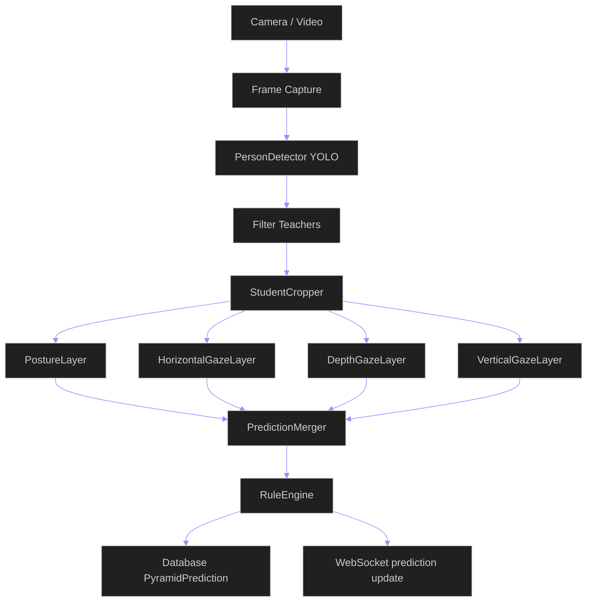

# Quickstart: Student Behavior Detection Pyramid

**Branch**: `003-student-behavior-pyramid` | **Date**: 2026-04-24 | **Spec**: [spec.md](spec.md) | **Plan**: [plan.md](plan.md)

## Prerequisites

- Python 3.13+
- Node.js 20+
- PostgreSQL 15+
- Redis 7+
- CUDA-compatible GPU (optional — CPU fallback supported)

## Setup

### 1. Backend

```bash
cd backend

# Create and activate virtual environment
python -m venv .venv
# Windows:
.venv\Scripts\activate
# Linux:
source .venv/bin/activate

# Install dependencies
pip install -r requirements.txt

# Create .env file (copy from template)
cp .env.example .env
# Edit .env with your database credentials and model paths
```

### 2. Model Weight Files

Place pre-trained model weight files in `backend/models/`:

```text
backend/models/
├── student_teacher/weights/student_teacher.pt
├── standing_sitting/weights/standing_sitting.pt
├── right_left/weights/right_left.pt
├── forward_backward/weights/forward_backward.pt
└── up_down/weights/up_down.pt
```

Configure model paths in `.env`:

```env
PYRAMID_MODELS_BASE_DIRECTORY=backend/models
PYRAMID_RAW_DATA_DIRECTORY=Raw Data
PYRAMID_PERSON_DETECTOR_PATH=student_teacher/weights/student_teacher.onnx
PYRAMID_POSTURE_MODEL_PATH=standing_sitting/weights/standing_sitting.pt
PYRAMID_HORIZONTAL_GAZE_MODEL_PATH=right_left/weights/right_left.pt
PYRAMID_DEPTH_GAZE_MODEL_PATH=forward_backward/weights/forward_backward.pt
PYRAMID_VERTICAL_GAZE_MODEL_PATH=up_down/weights/up_down.pt
PYRAMID_DEVICE=cpu
PYRAMID_PERSON_CONFIDENCE_THRESHOLD=0.5
PYRAMID_BEHAVIOR_CONFIDENCE_THRESHOLD=0.5
PYRAMID_WORKER_COUNT=4
PYRAMID_INFERENCE_TIMEOUT=30.0
```

### 2.1 Root model inventory and replay datasets

For model lifecycle validation and benchmarking (User Story 5), maintain root-level directories:

```text
Raw Data/
├── class-a-session-01/
│   ├── cam-01.mp4
│   └── cam-02.mp4
└── class-b-session-03/
    └── cam-01.mp4

models/
├── yolo12l.pt
├── yolo12l.onnx                # optional
├── yolo12l.engine              # optional TensorRT
├── yolo12l.xml                 # optional OpenVINO IR
└── yolo12l.bin                 # optional OpenVINO IR weights
```

Use `Raw Data/` videos to emulate camera-buffer replay during benchmark workflows. `models/` is scanned to determine missing formats and export requirements.

### 3. Database

```bash
# Run migrations
python manage.py migrate

# Create superuser
python manage.py createsuperuser
```

### 4. Frontend

```bash
cd frontend

# Install dependencies
npm install

# Start dev server
npm run dev
```

### 5. Services

```bash
# Terminal 1: Redis (if not running)
redis-server

# Terminal 2: Django (ASGI with Daphne)
cd backend
python manage.py runserver

# Terminal 3: Celery worker (for background frame processing)
cd backend
celery -A config worker -l info

# Terminal 4: Frontend dev server
cd frontend
npm run dev
```

### 6. Dockerized benchmark and model lifecycle services

Run Docker services used by export/benchmark pipelines:

```bash
# From repository root
docker compose -f docker-compose.dev.yml up -d

# Verify services (cpu/gpu/triton containers as configured)
docker compose -f docker-compose.dev.yml ps
```

If GPU runtime is not available on Windows, benchmarks continue with CPU-compatible formats and log GPU-path skips.

## Running Tests

### Backend

```bash
cd backend

# All tests
pytest

# Unit tests only
pytest tests/unit/

# Integration tests only
pytest tests/integration/

# System tests only
pytest tests/system/

# With coverage
pytest --cov=apps --cov-report=html
```

### Frontend

```bash
cd frontend

# Unit/component tests
npm run test

# With coverage
npm run test:coverage

# E2E tests
npm run test:e2e
```

## Verifying the Pipeline

### Quick smoke test (Python REPL)

```python
import numpy as np
from apps.pipeline.services import PipelineService
from apps.pipeline.config import FrameMeta

# Create a dummy frame (640x480 BGR)
frame = np.zeros((480, 640, 3), dtype=np.uint8)

# Create frame metadata
meta = FrameMeta(
    frame_id=1,
    frame_number=0,
    camera_source_id=None,
    session_id=1,
    timestamp="2026-04-24T10:00:00Z",
    width=640,
    height=480,
)

# Process frame through the pyramid
service = PipelineService()
results = service.process_frame(frame, meta)

# Inspect results
for record in results:
    print(f"Student {record.tracking_id}: {record.predictions}")
```

### WebSocket test (browser console)

```javascript
const ws = new WebSocket('ws://localhost:8000/ws/detections/1/');

ws.onmessage = (event) => {
  const data = JSON.parse(event.data);
  if (data.type === 'prediction.update') {
    console.log('Predictions:', data.predictions);
  }
};

ws.onopen = () => {
  ws.send(JSON.stringify({ type: 'ping' }));
};
```

### Model lifecycle smoke test (Django shell)

```python
from apps.pipeline.model_inventory import scan_models_directory
from apps.pipeline.benchmark import schedule_benchmark_runs

from pathlib import Path

from apps.pipeline.model_lifecycle.inventory import scan_model_inventory
from apps.pipeline.model_lifecycle.export_orchestrator import ExportOrchestrator
from apps.pipeline.model_lifecycle.benchmark_runner import BenchmarkRunner
from apps.pipeline.model_lifecycle.deployment_matrix import DeploymentMatrix

models_dir = Path("backend/models")
raw_data_dir = Path("Raw Data")

inventory = scan_model_inventory(models_dir)
print(f"Discovered model families: {len(inventory)}")

export_plan = ExportOrchestrator().plan_exports(inventory)
print(f"Export jobs queued: {len(export_plan)}")

print(f"Replay dataset root: {raw_data_dir}")
```

The workflow should: detect missing formats, queue export jobs from `.pt` when possible, run benchmark jobs in Dockerized runtimes, and persist deployment matrix recommendations.

## Architecture Overview



## Related Documents

- [spec.md](spec.md) — Feature specification
- [plan.md](plan.md) — Implementation plan
- [research.md](research.md) — Research findings
- [data-model.md](data-model.md) — Entity definitions
- [contracts/rest-api.md](contracts/rest-api.md) — REST API contracts
- [contracts/websocket-api.md](contracts/websocket-api.md) — WebSocket contracts
- [../../.specify/memory/constitution.md](../../.specify/memory/constitution.md) — Project governance

---

## Resetting a Stuck Celery Worker

Use this runbook any time a Celery worker becomes unresponsive, a task hangs
indefinitely, or export/benchmark jobs stop firing.

### Step 1 — Diagnose

```powershell
# Is a worker running at all?
Get-Process python | Where-Object { $_.CommandLine -like "*celery*" }

# How many messages are queued in the broker?
.venv\Scripts\python.exe -c "
import redis; r = redis.Redis.from_url('redis://localhost:6379/1')
print('Queued tasks:', r.llen('celery'))
"
```

### Step 2 — Graceful restart (try first)

Stop the terminal running the worker with **Ctrl+C**, then restart:

```powershell
# In the backend directory, with the venv active:
.venv\Scripts\celery.exe -A config worker -l INFO --pool=solo
```

> **Windows note:** always use `--pool=solo`. The default `prefork` pool
> does not work on Windows and will silently fail to process tasks.

### Step 3 — Force-kill if Ctrl+C does not respond

```powershell
Get-Process python | Where-Object MainWindowTitle -eq "" | Stop-Process -Force
```

Then restart as in Step 2.

### Step 4 — Purge stale tasks from the broker queue

```powershell
cd backend
.venv\Scripts\celery.exe -A config purge -f
```

### Step 5 — Full system reset (nuclear option)

```powershell
cd backend
.venv\Scripts\python.exe manage.py flush_video_jobs --yes
```

Then restart the worker (Step 2) and clear browser localStorage:
open DevTools → Application → Local Storage → delete `exam_monitor_recent_jobs`.

### Quick-diagnosis table

| Symptom | Likely cause | Fix |
|---------|-------------|-----|
| Job stays `queued` forever | Worker not running | Step 2 |
| Job stays `processing` at 0% | Worker crashed mid-task | Steps 3 → 2 → 5 |
| Job stays `processing` at N% | Task deadlock or DB lock | Step 3 → 2 |
| `IntegrityError` in worker log | Stale DB state from previous run | Step 5 |
| Browser still shows old jobs after DB reset | Stale localStorage | Clear `exam_monitor_recent_jobs` key |
| `redis.exceptions.ConnectionError` in worker | Redis not running | Start Redis, then Step 2 |

