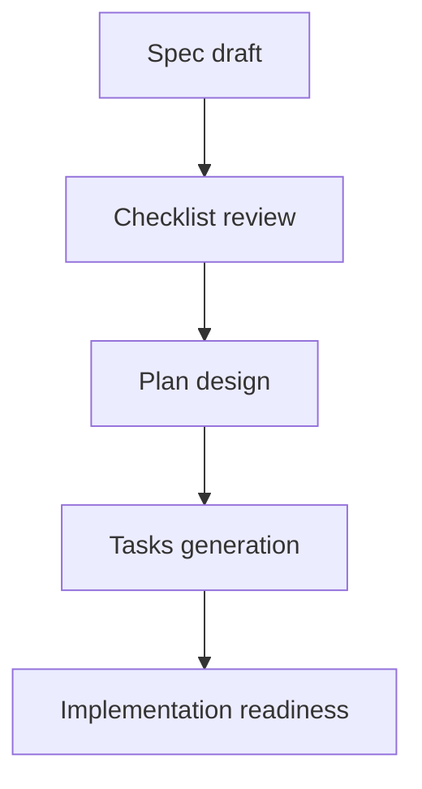

# Specification Quality Checklist: Architecture Refactoring & Technical Debt Reduction

**Purpose**: Validate specification completeness and quality before proceeding to planning  
**Created**: 2026-05-07  
**Feature**: [spec.md](../spec.md)

## Related Documents

- [../spec.md](../spec.md)
- [../plan.md](../plan.md)
- [../research.md](../research.md)
- [../data-model.md](../data-model.md)
- [../quickstart.md](../quickstart.md)
- [../tasks.md](../tasks.md)

## Validation Flow

The checklist flow shows how this validation artifact fits into the feature lifecycle. The spec is reviewed first, then the plan and tasks are generated only after the spec is validated for clarity, testability, and scope.

## Content Quality

- [x] No implementation details (languages, frameworks, APIs)
- [x] Focused on user value and business needs
- [x] Written for non-technical stakeholders
- [x] All mandatory sections completed

## Requirement Completeness

- [x] No [NEEDS CLARIFICATION] markers remain
- [x] Requirements are testable and unambiguous
- [x] Success criteria are measurable
- [x] Success criteria are technology-agnostic (no implementation details)
- [x] All acceptance scenarios are defined
- [x] Edge cases are identified
- [x] Scope is clearly bounded
- [x] Dependencies and assumptions identified
- [x] All 24 functional requirements are represented, including FR-020 through FR-024
- [x] Security, observability, CI gating, and data-governance requirements are explicitly covered

## Feature Readiness

- [x] All functional requirements have clear acceptance criteria
- [x] User scenarios cover primary flows
- [x] Feature meets measurable outcomes defined in Success Criteria
- [x] No implementation details leak into specification

## Validation Details

### Content Quality Analysis
- ✅ **No implementation details**: Spec avoids naming specific Python libraries, frameworks, or database systems. Uses technology-agnostic terms like "backend", "model serving", "inference requests"
- ✅ **User value focused**: Each user story clearly states business/technical value (scalability, test coverage, modularity, documentation)
- ✅ **Stakeholder-appropriate**: Written for technical leads and architects, not assuming specific tool knowledge
- ✅ **All mandatory sections**: User Scenarios, Requirements, Success Criteria all completed with rich detail

### Requirement Completeness Analysis
- ✅ **No clarifications needed**: All 24 functional requirements (FR-001 through FR-024) are specific and unambiguous. No [NEEDS CLARIFICATION] markers were needed because:
  - Triton Server choice was explicitly stated in user input
  - Test types (unit, integration, system) were explicitly requested
  - Modularity expectations are clear from context (video analysis pipeline components)
  - Documentation scope is defined in acceptance scenarios
  - Security posture, observability, CI rollout, and raw-data governance were clarified during the feature workflow
- ✅ **Testable requirements**: Every FR is verifiable:
  - FR-001-005: Triton routing can be tested with mock requests
  - FR-006-010: Test coverage and execution can be measured
  - FR-011-015: Module independence can be verified through dependency analysis
  - FR-016-019: Diagrams can be reviewed and validated against codebase
  - FR-020-024: Security isolation, model naming, observability, CI gating, and dataset policy can be checked against documented constraints
- ✅ **Measurable success criteria**: All 10 success criteria include specific metrics (>85%, <500ms, <10 minutes, <20%, 50%, etc.)
- ✅ **Technology-agnostic criteria**: SC-001 through SC-010 describe outcomes in user/business terms, not implementation (no mention of specific languages, databases, frameworks)
- ✅ **Acceptance scenarios defined**: All 4 user stories have 4-5 GWT scenarios each (16 total) covering normal operation, configuration, error handling, and verification
- ✅ **Edge cases identified**: 5 specific edge cases documented for Triton deployment, test failure, configuration, caching, and dependency conflicts
- ✅ **Scope clearly bounded**: Both In Scope and Out of Scope sections explicitly list 6 items each, making boundaries crystal clear
- ✅ **Dependencies and assumptions**: 7 assumptions documented covering infrastructure, data availability, team skills, backward compatibility, and performance

### Feature Readiness Analysis
- ✅ **Requirements have acceptance criteria**: Every FR links to specific GWT scenarios
- ✅ **User scenarios are comprehensive**: P1, P1, P2, P2 priority structure provides clear phasing:
  - P1 (Triton + Tests) = foundation and confidence
  - P2 (Modularity + Docs) = long-term maintainability
- ✅ **Measurable outcomes align**: Success criteria directly relate to user stories (e.g., SC-001 measures Triton performance, SC-002-004 measure test coverage)
- ✅ **No implementation leakage**: Spec uses terms like "model serving", "backend components", "test cases" without naming Django, Celery, pytest, etc.

## Notes

All checklist items passed validation. Specification is comprehensive, well-structured, and ready for planning phase.

**Summary**: 
- 4 independently testable user stories with clear priorities
- 24 functional requirements organized by theme (Triton, Tests, Modularity, Docs, Security, CI, Observability, Data Governance)
- 10 measurable success criteria with specific metrics
- 5 documented edge cases
- 7 explicit assumptions
- Clear In/Out of scope boundaries
- No clarifications needed - all ambiguities resolved through context and industry standards
