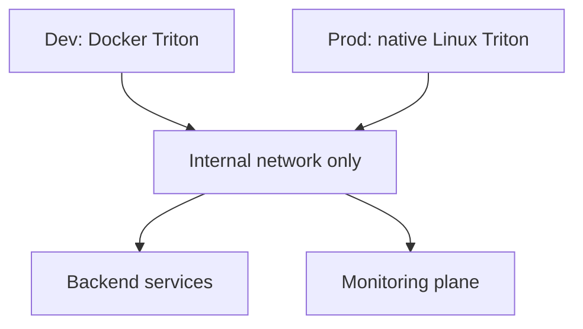

# Contract: Deployment Topology

## Related Documents

- [../spec.md](../spec.md)
- [../plan.md](../plan.md)
- [../research.md](../research.md)
- [../data-model.md](../data-model.md)
- [../quickstart.md](../quickstart.md)
- [../tasks.md](../tasks.md)

## Topology Overview

The topology keeps both environments behind the same internal-only network boundary while changing only the runtime packaging of Triton. Backend services and monitoring systems remain consumers of that secured topology, and no public ingress to inference endpoints is permitted.

## Purpose

Define required environment-specific deployment behavior for Triton.

## Environment Rules

- Development:
  - Triton MUST run in Docker.
  - Model repository mounted from development workspace path.
- Production:
  - Triton MUST run as native Linux service (non-Docker).
  - Service managed by host init/service manager.

## Network/Security Rules

- Triton endpoints are internal-only.
- No public ingress to inference endpoints.
- Access restricted via VPC/ACL/firewall policy.

## Data Governance Rules

- Raw video test dataset allowed only in dev/test environments.
- Raw video test dataset prohibited in production.
- Promotion process MUST verify no raw dataset artifacts are included in production deployment payloads.

## Operational Rules

- Health checks required for backend and Triton.
- Metrics endpoint must be scrapeable by monitoring plane.
- Incident runbook required for latency and availability regressions.
