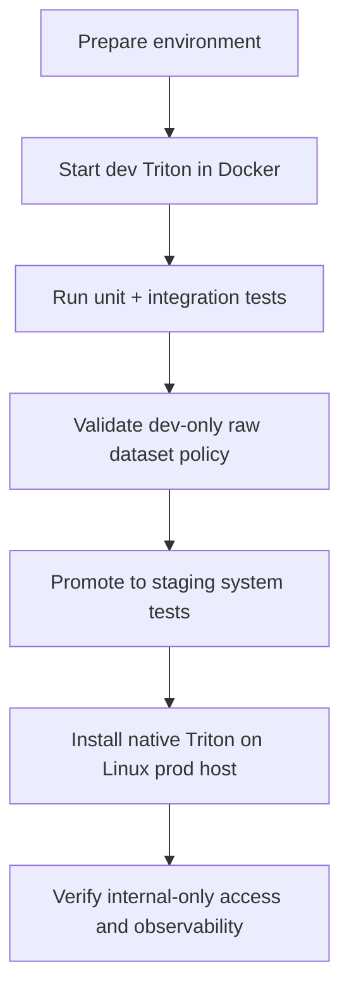

# Quickstart - Architecture Refactoring & Triton Transition

**Updated**: 2026-05-07 (T055: Validated run instructions)

## Related Documents

- [spec.md](spec.md)
- [plan.md](plan.md)
- [research.md](research.md)
- [data-model.md](data-model.md)
- [tasks.md](tasks.md)

## Quickstart Flow

This flowchart shows the operator path from environment setup through validation.



The flow begins in development with Docker-based Triton because that environment needs to mirror the production model-serving behavior while remaining easy to iterate on. After development validation, the path moves through staging and ends in a native Linux production setup with network restrictions and observability checks.

## 1. Preconditions

- Backend Python environment available (Python 3.11+).
- `uv` installed for dependency management (`pip install uv`).
- Development host has Docker and Docker Compose.
- Production host is Linux with native Triton binary/service management (no Docker for Triton).
- Raw video test dataset is available only in development/test environments.

## 2. Development Setup (Triton via Docker)

### 2a. Activate Virtual Environment

```powershell
cd e:\grad_project\backend
.\.venv\Scripts\Activate.ps1
```

### 2b. Start Dev Services (including Triton)

```powershell
cd e:\grad_project
docker compose -f docker-compose.dev.yml up -d
```

Verify Triton is ready:

```powershell
Invoke-RestMethod http://localhost:8000/v2/health/ready
# Expected: {"live": true, "ready": true} or HTTP 200
```

### 2c. Run Backend Tests (Verified)

```powershell
# From repo root with venv active
cd e:\grad_project\backend

# Unit tests
python -m pytest tests/unit -q --tb=short

# Integration tests
python -m pytest tests/integration -q --tb=short

# Contract tests
python -m pytest tests/contract -q --tb=short

# Full matrix with coverage
python -m pytest tests/unit tests/integration tests/contract `
  --cov=apps --cov=core `
  --cov-report=term-missing `
  -q --tb=short
```

### 2d. Verify Dataset Policy Guard

```powershell
# Confirm dev environment allows raw data (should pass silently)
$env:INFERENCE_ENVIRONMENT = "dev"
python -m pytest tests/integration/test_dataset_policy_enforcement.py -v

# Confirm prod environment blocks raw data
$env:INFERENCE_ENVIRONMENT = "prod"
$env:DATASET_POLICY_BYPASS = "0"
python -m pytest tests/integration/test_dataset_policy_enforcement.py -v
```

### 2e. Verify Model-Serving Health Endpoint

```powershell
# Start Django dev server (separate terminal)
python manage.py runserver

# Check health endpoint
Invoke-RestMethod http://localhost:8000/api/v1/health/
Invoke-RestMethod http://localhost:8000/api/v1/health/model-serving/
```

---

## 3. Production Setup (Triton Native Linux Service)

1. Install Triton on Linux host and configure model repository path.
2. Configure firewall/ACL so Triton ports are internal-only.
3. Register Triton as a system service and enable restart policy:
   ```bash
   sudo systemctl enable triton-server
   sudo systemctl start triton-server
   ```
4. Set production environment variables:
   ```bash
   export TRITON_ENABLED=True
   export TRITON_URL=http://localhost:8000
   export INFERENCE_ENVIRONMENT=prod
   ```
5. Point backend production config to native Triton endpoint.
6. Validate inference health checks and observability metrics:
   ```bash
   curl http://localhost/api/v1/health/model-serving/
   ```

See [deployment-topology.md](../../docs/backend/architecture/deployment-topology.md) for full details.

---

## 4. CI Rollout Path

- **Stage 1 (bootstrap)**: `ci-bootstrap.yml` — execute unit+integration on PR; informational only for non-protected branches.
- **Stage 2 (blocking)**: `ci-blocking.yml` — enforce unit+integration pass before merge on protected branches (main, develop).
- **Stage 3 (release)**: `ci-staging-system.yml` — run system tests in staging before promotion.

See [ci-policy.md](../../docs/backend/testing/ci-policy.md) for full stage definitions.

---

## 5. Data Governance Guardrails

- Real raw video test dataset MUST remain in dev/test only.
- Production MUST NOT mount, copy, or persist raw test dataset.
- Enforced automatically by `DatasetPolicyGuard` in `tests/utils/dataset_policy_guard.py`.
- System tests in production-like environments use approved non-raw fixtures or staging-only controlled data.

---

## 6. Observability Minimum

- Expose Prometheus metrics from backend (`/metrics`) and Triton (port 8002).
- Emit OpenTelemetry traces for request path: API → orchestration → Triton → response.
- Keep runbook entries for latency spikes, model errors, and service health failures.
- See [observability-runbook.md](../../docs/backend/architecture/observability-runbook.md) for full details.
