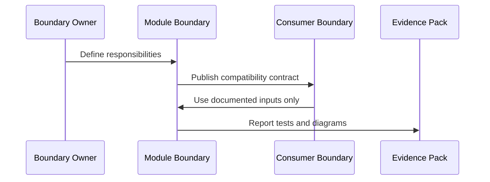

# Contract: Module Boundary

## Related Documents

- [../spec.md](../spec.md)
- [../plan.md](../plan.md)
- [../data-model.md](../data-model.md)
- [runtime-scenario-contract.md](runtime-scenario-contract.md)
- [coupling-risk-contract.md](coupling-risk-contract.md)
- [documentation-diagram-contract.md](documentation-diagram-contract.md)

## Contract Flow

This sequence shows how a boundary becomes usable. The owner defines responsibilities, the boundary publishes a compatibility contract, consumers use only documented inputs, and evidence proves the boundary is tested and diagrammed.

## Required Record

Each major module must have a boundary record with:

- `boundary_id`
- `owner`
- `capability`
- `responsibilities`
- `public_inputs`
- `public_outputs`
- `consumers`
- `dependencies`
- `forbidden_dependencies`
- `failure_behavior`
- `status`

## Acceptance Rules

- Every backend app and frontend domain touched by this feature must map to one primary boundary.
- Runtime paths must consume boundaries through compatibility contracts.
- Direct access to another boundary's internals is a coupling risk.
- A boundary is not verified until tests, diagrams, and documentation links are present.

## Minimum Boundary Groups

- Backend domains: accounts, audit, exams, cameras, sessions, detections, tracking, pipeline/inference, video_analysis, anomalies, recordings, exports, health.
- Frontend domains: api clients, auth state, camera/live monitoring UI, offline video UI, anomaly UI, recording/export UI, health/settings UI, shared UI components.
- Runtime domains: live-stream path, offline-video path, non-video-dashboard path, deployment/runtime path.
