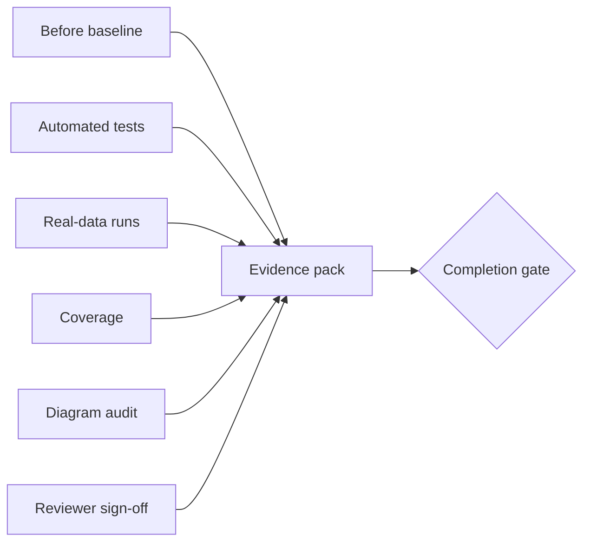

# Contract: Regression Evidence Pack

## Related Documents

- [../spec.md](../spec.md)
- [../plan.md](../plan.md)
- [../data-model.md](../data-model.md)
- [runtime-scenario-contract.md](runtime-scenario-contract.md)
- [documentation-diagram-contract.md](documentation-diagram-contract.md)

## Evidence Flow

This diagram shows the required evidence sources. The feature cannot pass the completion gate with only tests or only review; all evidence sources must be present.

## Required Pack Contents

- Before/after workflow baseline for the full delivered system.
- Automated regression results for unit, integration, contract, system, and frontend e2e where applicable.
- Real-data live-stream validation.
- Real-data offline-video validation.
- 100% line and branch coverage for affected modules or approved time-boxed exceptions.
- Coupling-risk register with all high-risk items resolved.
- Documentation diagram coverage sign-off.
- Reviewer sign-off.

## Acceptance Rules

- Evidence must be linked from the implementation completion summary.
- Missing real model weights or raw data blocks completion for inference/tracking/video paths.
- Any coverage exception must be represented as a refactor exception or constitution-approved exception.
