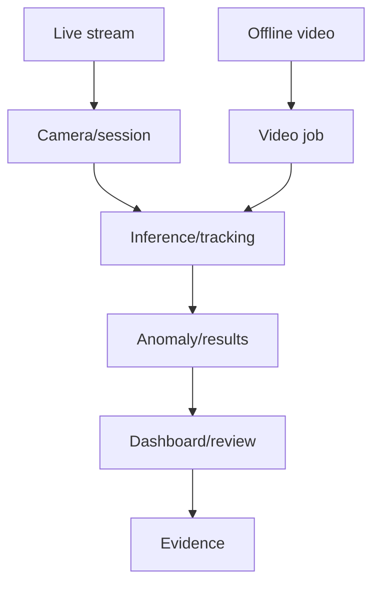

# Contract: Runtime Scenario

## Related Documents

- [../spec.md](../spec.md)
- [../plan.md](../plan.md)
- [../data-model.md](../data-model.md)
- [module-boundary-contract.md](module-boundary-contract.md)
- [regression-evidence-contract.md](regression-evidence-contract.md)

## Runtime Flow

The flowchart shows the required overlap between live and offline scenarios. Both paths reach inference/tracking and user-visible results, then feed the evidence pack. Shared nodes must be contracts, not hidden dependencies.

## Required Scenario Records

### Live Stream

- Entry: instructor starts or views a monitoring session.
- Required boundaries: cameras, sessions, detections/tracking, pipeline/inference, anomalies, health, frontend camera dashboard.
- Required evidence: real model weights, real raw/live media, overlays, tracking continuity, anomaly updates, health/degraded behavior.

### Offline Video

- Entry: administrator uploads or selects a raw/offline video.
- Required boundaries: video_analysis, pipeline/inference, tracking, detections/results, anomalies, recordings/playback, frontend review UI.
- Required evidence: real model weights, real raw video data, job status, stored results, playback overlays.

### Non-Video Dashboard

- Entry: user performs delivered non-video workflow.
- Required boundaries: accounts, exams, rooms/cameras, sessions, anomalies, exports, health, settings, frontend navigation/state.
- Required evidence: before/after regression tests and user-visible equivalence.

## Acceptance Rules

- Each runtime scenario must list boundaries, contracts, user-visible outputs, failure modes, and tests.
- Live/offline inference and tracking validation must follow official Ultralytics prediction/tracking behavior where the local implementation uses Ultralytics.
- Production validation must not require Docker.
