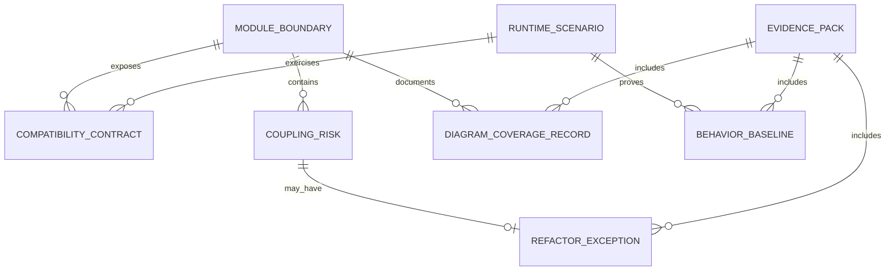
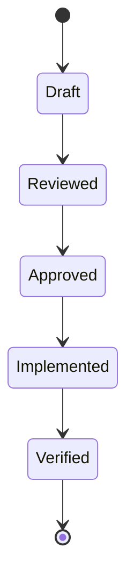

# Data Model: Modular Design and Low Coupling Hardening

## Related Documents

- [spec.md](spec.md)
- [plan.md](plan.md)
- [research.md](research.md)
- [quickstart.md](quickstart.md)
- [contracts/module-boundary-contract.md](contracts/module-boundary-contract.md)
- [contracts/runtime-scenario-contract.md](contracts/runtime-scenario-contract.md)
- [contracts/regression-evidence-contract.md](contracts/regression-evidence-contract.md)
- [contracts/coupling-risk-contract.md](contracts/coupling-risk-contract.md)
- [contracts/documentation-diagram-contract.md](contracts/documentation-diagram-contract.md)

## Entity Relationship Overview

This ER diagram shows the planning entities and their relationships. Module boundaries expose compatibility contracts and may contain coupling risks. Runtime scenarios exercise those contracts and produce behavior baselines. Evidence packs gather baselines, diagram coverage, and approved refactor exceptions.

## Module Boundary

Represents a domain-capability boundary in the hybrid model.

**Fields**:
- `boundary_id`: Stable identifier, e.g. `backend.cameras`, `frontend.camera-feed`, `runtime.live-stream`.
- `owner`: Owning module/team/person.
- `capability`: Business capability owned by the boundary.
- `responsibilities`: Short list of behavior owned by the boundary.
- `public_inputs`: Data/events/commands accepted by the boundary.
- `public_outputs`: Data/events/results emitted by the boundary.
- `consumers`: Other boundaries or runtime scenarios that consume it.
- `dependencies`: Other boundaries it is allowed to call.
- `forbidden_dependencies`: Dependencies not allowed after restructuring.
- `failure_behavior`: Documented error/degraded behavior.
- `status`: `draft`, `approved`, `implemented`, `verified`.

**Validation rules**:
- Every major backend app and frontend surface must map to one primary module boundary.
- Every dependency must point through a compatibility contract.
- High-risk direct cross-boundary access is not allowed after verification.

## Hybrid Boundary Model

Represents the approved model for this feature.

**Fields**:
- `model_id`: `hybrid-domain-runtime`.
- `domain_boundaries`: Approved domain-capability boundaries.
- `runtime_paths`: `live-stream`, `offline-video`, `non-video-dashboard`.
- `shared_contracts`: Contracts used by more than one runtime path.
- `governance_rules`: Rules for dependency direction and exception handling.

**State transitions**:

The state diagram defines how the boundary model matures. It starts as a draft, is reviewed against the spec, becomes approved for implementation, is implemented in code/docs/tests, and is verified by the evidence pack.

## Coupling Risk

Represents an existing dependency or design issue that can cause unrelated modules to change or fail together.

**Fields**:
- `risk_id`: Stable identifier.
- `source_boundary`: Boundary where the coupling originates.
- `target_boundary`: Boundary or runtime path affected.
- `risk_type`: `hidden_dependency`, `shared_mutable_state`, `duplicated_responsibility`, `direct_cross_module_access`, `unclear_ownership`, `diagram_gap`.
- `severity`: `high`, `medium`, `low`.
- `impact`: What can break or become harder to change.
- `mitigation`: Required action.
- `owner`: Person/team responsible.
- `verification`: Test, diagram, or review evidence proving resolution.
- `status`: `identified`, `mitigating`, `resolved`, `exception_approved`.

**Validation rules**:
- High-risk coupling must be resolved in this feature.
- Medium/low-risk exceptions require a Refactor Exception.

## Behavior Baseline

Represents before/after proof that a delivered workflow still behaves correctly.

**Fields**:
- `baseline_id`: Stable identifier.
- `workflow`: Delivered workflow name.
- `scenario`: `live-stream`, `offline-video`, or `non-video-dashboard`.
- `before_evidence`: Evidence captured before restructuring.
- `after_evidence`: Evidence captured after restructuring.
- `expected_outcomes`: User-visible outcomes that must remain equivalent.
- `test_links`: Automated tests proving the baseline.
- `status`: `pending`, `captured`, `verified`, `failed`.

## Compatibility Contract

Represents a documented expectation between boundaries.

**Fields**:
- `contract_id`: Stable identifier.
- `producer_boundary`: Boundary that owns the behavior/data.
- `consumer_boundary`: Boundary or runtime scenario that consumes it.
- `input_shape`: Request, event, command, or data accepted.
- `output_shape`: Response, event, state update, or result emitted.
- `failure_modes`: Documented failures and degraded states.
- `version`: Contract version.
- `tests`: Contract/integration/system tests that validate it.

## Runtime Scenario

Represents one operating path that must remain behaviorally equivalent.

**Fields**:
- `scenario_id`: `live-stream`, `offline-video`, or `non-video-dashboard`.
- `entrypoints`: User actions or scheduled/background triggers.
- `boundaries_involved`: Module boundaries traversed.
- `contracts_exercised`: Compatibility contracts exercised.
- `required_real_data`: Model weights and raw media requirements where applicable.
- `success_evidence`: Evidence required for pass.

## Refactor Exception

Represents approved temporary coupling.

**Fields**:
- `exception_id`: Stable identifier.
- `risk_id`: Coupling risk this exception belongs to.
- `severity`: Must be `medium` or `low`.
- `owner`: Responsible person/team.
- `expiry`: Date or implementation milestone.
- `removal_plan`: How the coupling will be removed.
- `regression_coverage`: Tests that guard the temporary coupling.
- `approval`: Reviewer sign-off.

**Validation rules**:
- High-risk coupling cannot have an exception.
- Exceptions without owner, expiry, removal plan, and regression coverage are invalid.

## Documentation Diagram Coverage Record

Represents diagram requirements for an existing or incoming document.

**Fields**:
- `document_path`: Markdown document path.
- `document_type`: `source-doc`, `module-readme`, `system-doc`, `feature-doc`.
- `code_structure_diagram`: Required for code/module docs.
- `system_interaction_diagram`: Required for system/runtime docs.
- `cross_interaction_diagram`: Required for cross-module/runtime docs.
- `state_or_er_diagram`: Required when state or data ownership exists.
- `explanation_status`: `missing`, `partial`, `complete`.
- `cross_links_status`: `missing`, `partial`, `complete`.
- `verification_status`: `pending`, `passed`, `failed`.

## Evidence Pack

Represents the final completion proof.

**Fields**:
- `pack_id`: Stable identifier.
- `baseline_results`: Behavior baselines included.
- `test_results`: Unit, integration, contract, system, and e2e results.
- `coverage_report`: 100% line/branch coverage or documented exceptions.
- `real_data_results`: Live/offline real-data validation.
- `diagram_coverage`: Documentation diagram coverage records.
- `reviewer_signoff`: Reviewer and timestamp.
- `status`: `draft`, `complete`, `approved`.
