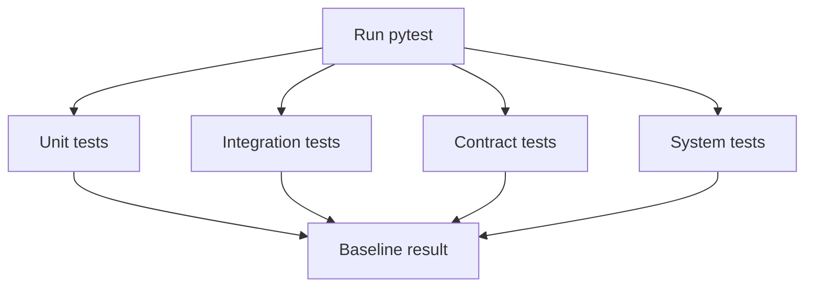

# Backend Before Baseline

## Related Documents

- [evidence pack](../evidence-pack.md)
- [tasks](../../tasks.md)
- [quickstart](../../quickstart.md)
- [regression evidence contract](../../contracts/regression-evidence-contract.md)

## Command Flow



This diagram shows the backend baseline command exercising unit, integration, contract, and system tests with coverage. The current run stops during collection, so the recorded baseline is a failing baseline that must be preserved as known pre-refactor evidence.

## Command

```powershell
cd backend
..\.venv\Scripts\python.exe -m pytest tests\unit tests\integration tests\contract tests\system --cov=apps --cov=core --cov-report=term-missing --tb=short -q
```

Actual executable path used: `..\.venv\Scripts\python.exe`.

## Result

- Date: 2026-05-08
- Exit code: `1`
- Status: FAIL during pytest collection
- Collection failures: `38`
- Coverage summary emitted despite collection interruption: total line coverage reported as `26%`

## Primary Failure

Multiple tests import `apps.pipeline.config`, which creates `PipelineConfig()` at import time. `PipelineConfig` rejects unrelated `.env` keys as extra inputs, including `django_secret_key`, `postgres_db`, `redis_url`, `celery_broker_url`, and frontend Vite variables.

Representative error:

```text
pydantic_core._pydantic_core.ValidationError: 17 validation errors for PipelineConfig
Extra inputs are not permitted
```

## Affected Collection Areas

- `tests/unit/pipeline/*`
- `tests/unit/video_analysis/*`
- `tests/integration/test_full_inference_flow.py`
- `tests/integration/test_graceful_degradation.py`
- `tests/integration/test_inference_client_swap.py`
- `tests/integration/test_model_lifecycle_flow.py`
- `tests/integration/test_pipeline_flow.py`
- `tests/system/test_behavior_categories_real_data.py`
- `tests/system/test_e2e_triton_frame_inference.py`
- `tests/system/test_model_ops_e2e.py`
- `tests/system/test_real_yolo_models.py`

## Follow-Up

This is baseline evidence, not a modularity implementation change. The failure must be addressed or explicitly carried as an approved baseline/coverage exception before final completion.
