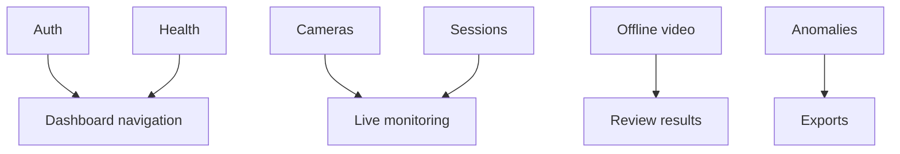

# Full Delivered Baseline Checklist

## Related Documents

- [evidence pack](../evidence-pack.md)
- [feature spec](../../spec.md)
- [runtime scenario contract](../../contracts/runtime-scenario-contract.md)
- [regression evidence contract](../../contracts/regression-evidence-contract.md)

## Baseline Flow

This diagram lists the delivered workflows protected by the modularity feature. Auth and navigation keep the dashboard usable. Cameras and sessions feed live monitoring. Offline video feeds result review. Anomalies, exports, health, and settings remain protected non-video workflows.

## Protected Workflows

| Workflow | Baseline Expectation | Evidence Source |
| --- | --- | --- |
| Auth | Login, logout, and protected navigation remain available. | Frontend unit/e2e baseline |
| Exams | Exam setup and related dashboard flows remain available. | Backend/frontend regression |
| Rooms/cameras | Camera listing, connection setup, and live feed shell remain available. | E2E and backend regression |
| Sessions | Session creation, status, and monitoring linkage remain available. | Backend/frontend regression |
| Live monitoring | Feed state, overlays, tracking IDs, anomaly status, and controls remain equivalent. | Real-data live validation |
| Offline video | Upload/select, processing status, stored results, playback overlays, and review remain equivalent. | Real-data offline validation |
| Anomalies | Alert list, triage, status transitions, and notes remain available. | Unit/e2e regression |
| Recordings | Recording list/detail/playback flows remain available. | E2E regression |
| Exports | Export initiation, status, and download flow remain available. | Unit/e2e regression |
| Health | Health review and degraded-state visibility remain available. | Backend/frontend regression |
| Settings | Settings navigation and visible controls remain available. | Frontend regression |
| Dashboard navigation | Delivered pages remain reachable without user workflow changes. | Frontend e2e regression |

## Current Baseline Status

- Backend baseline: failing during collection, documented in [backend-before.md](backend-before.md).
- Frontend baseline: unit, type-check, build, and e2e pass; lint has existing findings documented in [frontend-before.md](frontend-before.md).
- Real model/raw media assets: present and inventoried in [real-data-assets.md](../real-data-assets.md).
