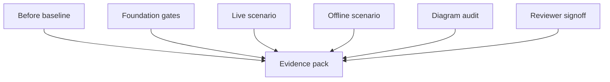

# Evidence Pack: Modular Design and Low Coupling Hardening

## Related Documents

- [feature spec](../spec.md)
- [documentation diagram coverage](../../../docs/architecture/documentation-diagram-coverage.md)
- [implementation plan](../plan.md)
- [tasks](../tasks.md)
- [regression evidence contract](../contracts/regression-evidence-contract.md)
- [runtime scenario contract](../contracts/runtime-scenario-contract.md)

## Evidence Flow

This diagram shows how evidence is gathered for the modularity feature. The before-baseline files establish the current state before refactoring. Foundation gates prove boundary and documentation controls exist. Live and offline scenario evidence prove runtime behavior. Diagram audit and reviewer signoff close the completion gate.

## Index

| Evidence Area | Path | Status |
| --- | --- | --- |
| Backend before baseline | [baseline/backend-before.md](baseline/backend-before.md) | Captured with existing failure |
| Frontend before baseline | [baseline/frontend-before.md](baseline/frontend-before.md) | Captured with existing lint failure |
| Real data assets | [real-data-assets.md](real-data-assets.md) | Captured |
| Coverage exceptions | [coverage-exceptions.md](coverage-exceptions.md) | Initialized |
| Ultralytics reference | [ultralytics-reference.md](ultralytics-reference.md) | Captured |
| Full delivered baseline | [baseline/full-delivered-baseline.md](baseline/full-delivered-baseline.md) | Captured |

## Completion Gate

This pack is incomplete until final evidence includes before and after baselines, passing automated regression results, real-data live and offline validation, coverage reports or approved exceptions, diagram coverage signoff, and reviewer signoff.
