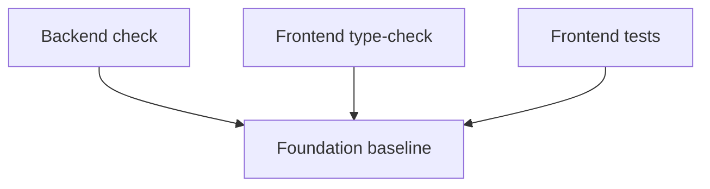

# Foundation Existing Baseline Status

## Related Documents

- [evidence pack](evidence-pack.md)
- [tasks](../tasks.md)
- [backend before baseline](baseline/backend-before.md)
- [frontend before baseline](baseline/frontend-before.md)

## Baseline Flow



This diagram separates pre-existing checks from the new RED tests. Backend currently fails on an existing configuration issue. Frontend type-check and pre-existing unit/integration tests pass when the new RED modular contract test is excluded.

## Commands

```powershell
cd backend
..\.venv\Scripts\python.exe manage.py check
```

```powershell
cd frontend
npm run type-check
npm test -- --run --exclude tests/unit/api/modular_contracts.test.ts
```

## Results

| Check | Exit | Result |
| --- | ---: | --- |
| Backend `manage.py check` | 1 | FAIL: existing `PipelineConfig` extra `.env` key validation issue |
| Frontend `npm run type-check` | 0 | PASS |
| Frontend existing tests excluding new RED modular test | 0 | PASS: 24 files, 194 tests |

## Backend Failure Summary

`manage.py check` imports `apps.video_analysis.views`, which imports tracking/video exporter code, which imports `apps.pipeline.config`. Import-time `PipelineConfig()` rejects unrelated `.env` keys such as Django, Postgres, Redis, Celery, and Vite settings.

This is the same baseline issue captured in [backend-before.md](baseline/backend-before.md).

## Post-Fix Update

After `fix(pipeline): ignore unrelated env keys`, `manage.py check` was rerun and passed with:

```text
System check identified no issues (0 silenced).
```

The broader `tests/unit/pipeline/test_config.py` file still has existing expectation/data failures unrelated to the import-time `.env` rejection: local defaults report `cuda` rather than the test's expected `cpu`, OpenVINO path preference expectations differ from the current resolver, and no Raw Data scenarios are discovered from the configured Raw Data helper.
