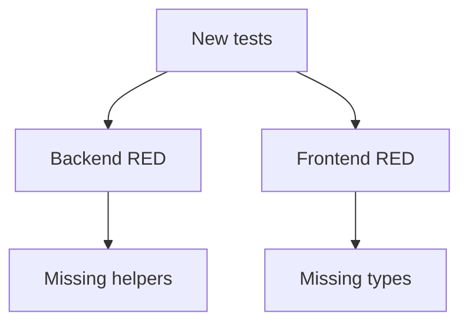

# Foundation RED Test Status

## Related Documents

- [evidence pack](evidence-pack.md)
- [tasks](../tasks.md)
- [module boundary contract](../contracts/module-boundary-contract.md)
- [runtime scenario contract](../contracts/runtime-scenario-contract.md)
- [documentation diagram contract](../contracts/documentation-diagram-contract.md)

## RED Flow



This diagram shows the required RED phase for T013-T017. The new tests fail before implementation because the shared boundary/evidence helper modules and frontend boundary declarations do not exist yet.

## Commands

```powershell
cd backend
..\.venv\Scripts\python.exe -m pytest tests\contract\test_module_boundary_contracts.py tests\contract\test_coupling_risk_register.py tests\contract\test_runtime_scenario_contracts.py tests\unit\docs\test_documentation_diagram_coverage.py -q --tb=short
```

```powershell
cd frontend
npm test -- tests/unit/api/modular_contracts.test.ts --run
```

## Results

| Suite | Exit | RED Result |
| --- | ---: | --- |
| Backend foundational tests T013-T016 | 1 | Expected RED: 4 collection errors |
| Frontend foundational test T017 | 1 | Expected RED: boundary type import unresolved |

## Backend RED Details

- `test_module_boundary_contracts.py`: `ModuleNotFoundError: No module named 'core.boundaries'`
- `test_coupling_risk_register.py`: `ModuleNotFoundError: No module named 'core.boundaries'`
- `test_runtime_scenario_contracts.py`: `ModuleNotFoundError: No module named 'core.evidence'`
- `test_documentation_diagram_coverage.py`: `ModuleNotFoundError: No module named 'core.evidence'`

## Frontend RED Details

`modular_contracts.test.ts` fails before executing tests because `@/types/boundaries` does not exist yet.

## Next Implementation Tasks

- T018 implements `backend/core/boundaries.py`.
- T019 implements `backend/core/evidence.py`.
- T047 later implements `frontend/src/types/boundaries.ts`.
