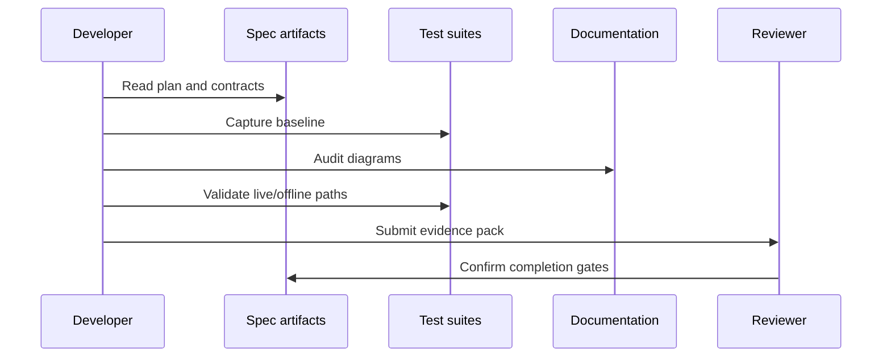

# Quickstart: Modular Design and Low Coupling Hardening

## Related Documents

- [spec.md](spec.md)
- [plan.md](plan.md)
- [research.md](research.md)
- [data-model.md](data-model.md)
- [contracts/module-boundary-contract.md](contracts/module-boundary-contract.md)
- [contracts/runtime-scenario-contract.md](contracts/runtime-scenario-contract.md)
- [contracts/regression-evidence-contract.md](contracts/regression-evidence-contract.md)
- [contracts/coupling-risk-contract.md](contracts/coupling-risk-contract.md)
- [contracts/documentation-diagram-contract.md](contracts/documentation-diagram-contract.md)

## Validation Flow



This sequence shows the expected validation path before implementation tasks are generated and later before implementation is marked complete. The developer must use the contracts to capture the baseline, audit diagrams, validate runtime paths, and produce a reviewer-ready evidence pack.

## Pre-Implementation Checks

1. Confirm branch is `006-modular-low-coupling`.
2. Read [spec.md](spec.md), [plan.md](plan.md), and all contracts.
3. Build a module ownership map for all major backend apps, frontend domains, runtime paths, and deployment boundaries.
4. Build a coupling-risk register and rank every risk as high, medium, or low.
5. Build a documentation diagram coverage register for existing and incoming docs.
6. Confirm real model weights and real raw media are available in development/test environments.

## Baseline Commands

Run the relevant test commands before implementation to capture the current delivered baseline:

```powershell
cd backend
pytest tests/unit tests/integration tests/contract tests/system --cov=apps --cov=core --cov-report=term-missing
```

```powershell
cd frontend
npm test
npm run test:e2e
npm run type-check
```

These commands establish baseline behavior. Implementation tasks may refine exact command flags, but the evidence pack must include backend, frontend, live-stream, offline-video, and non-video dashboard coverage.

## Documentation Diagram Audit

For each affected existing or incoming Markdown file:

1. Classify it using [documentation-diagram-contract.md](contracts/documentation-diagram-contract.md).
2. Add missing code structure diagrams.
3. Add missing system interaction diagrams.
4. Add missing cross interaction diagrams.
5. Add state or ER/class diagrams where state or data ownership exists.
6. Add detailed explanations and related document links.
7. Record the result in the evidence pack.

## Completion Evidence

The feature is ready for implementation completion only when the evidence pack contains:

- Full delivered system before/after baseline.
- Passing unit, integration, contract, system, and frontend e2e evidence.
- Live-stream real-data validation.
- Offline-video real-data validation.
- 100% line and branch coverage or approved exceptions.
- Coupling-risk register with all high-risk coupling resolved.
- Diagram coverage sign-off.
- Reviewer sign-off.
