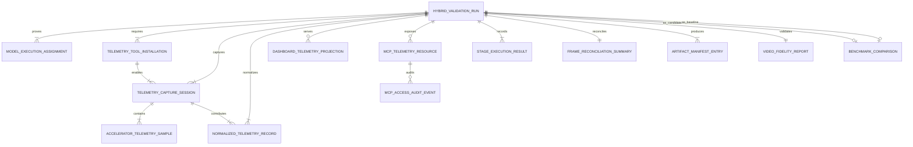
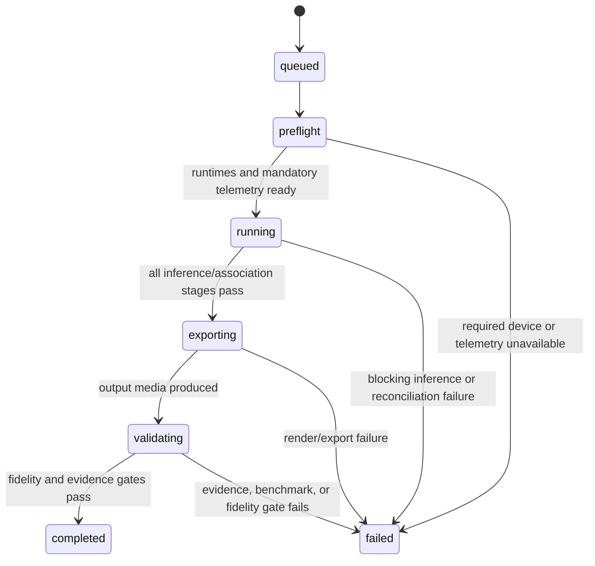

# Data Model: Hybrid Telemetry And Validation Evidence

**Feature**: [Parallel Pose Inference with Hybrid Telemetry](spec.md)  
**Plan**: [plan.md](plan.md)

## Purpose

Define durable evidence for mandatory telemetry-tool installation, model execution placement, accelerator measurements, pipeline-stage results, baseline-versus-candidate performance, artifact completeness, final-video fidelity, dashboard projections, and governed MCP access. These entities support offline validation and frontend/AI-readable telemetry without exposing raw high-volume evidence or sensitive data through ordinary status interfaces.

## Relationship Model



## Entities

### HybridValidationRun

Represents one real-video execution whose evidence can be validated independently and optionally compared with a baseline.

| Field | Type | Required | Notes |
|-------|------|----------|-------|
| `run_id` | UUID/string | Yes | Stable evidence correlation identifier. |
| `job_id` | UUID/string | Yes | Existing offline job reference. |
| `source_video_path` | string | Yes | Relative or permitted artifact reference, not arbitrary user input. |
| `source_video_sha256` | string | Yes | Input identity for comparisons. |
| `workload_mode` | enum | Yes | `offline` or `live`. Required completion run is `offline`. |
| `optimization_profile_id` | string | Yes | Selected live/offline profile identifier. |
| `telemetry_mode_id` | string | Yes | Identical for comparable baseline/candidate runs. |
| `color_mode` | enum | Yes | `rgb` or `grayscale`; grayscale validation must satisfy the specification threshold. |
| `baseline_run_id` | string/null | No | Required for optimized candidate evaluation. |
| `configuration_digest` | string | Yes | Digest of relevant non-secret profile/configuration inputs. |
| `status` | enum | Yes | See state transitions. |
| `validation_gate_status` | enum | Yes | `pending`, `passed`, `failed`, or `unsupported`. |
| `started_at` / `ended_at` | timestamp | Yes | Used for evidence capture windows. |
| `evidence_manifest_path` | string | Yes | Reference to immutable manifest sidecar. |

### ModelExecutionAssignment

Proves which model ran through which runtime/device in a specific run. Runtime readiness is not sufficient evidence.

| Field | Type | Required | Notes |
|-------|------|----------|-------|
| `run_id` | string | Yes | Parent validation run. |
| `model_task` | string | Yes | For example `person_detector`, `rtmpose_model`, or gaze role. |
| `model_artifact_id` / `artifact_sha256` | string | Yes | Model provenance. |
| `runtime_backend` | enum | Yes | `triton`, `openvino`, or approved fallback. |
| `requested_device` | string | Yes | Configuration request. |
| `effective_device` | string | Yes | Device actually reported by runtime. |
| `accelerator_vendor` | enum | Yes | `nvidia`, `intel`, or `cpu`. |
| `accelerator_id` | string | Yes | Distinguishes Intel GPU from other visible GPUs. |
| `worker_identity` | string | Yes | Single dedicated worker identity for the model. |
| `fallback_used` / `fallback_reason` | boolean/string | Yes | Required even when false/empty. |
| `health_status` | enum | Yes | `ready`, `degraded`, or `failed`. |

### TelemetryToolInstallation

Proves that each mandatory telemetry application was installed in the required execution boundary before capture.

| Field | Type | Required | Notes |
|-------|------|----------|-------|
| `installation_id` / `run_id` | string | Yes | Installation evidence correlation. |
| `tool` | enum | Yes | `nvidia_nsight_systems_cli` or `intel_presentmon`. |
| `execution_boundary` | enum | Yes | `triton_validation_container` or `windows_host`. |
| `version` | string | Yes | Installed tool version. |
| `package_or_distribution_digest` | string | Yes | Image layer/package/download identity. |
| `container_image_digest` | string/null | Conditional | Required for Nsight Systems in the instrumented Triton image. |
| `readiness_command` / `readiness_result` | string/object | Yes | Demonstrates installed application is invocable. |
| `installed` / `capture_capable` | boolean | Yes | Both must be true for passing validation. |
| `failure_reason` | string/null | No | Required on missing/invalid installation. |

### TelemetryCaptureSession

Defines a bounded sampling window for one collector source.

| Field | Type | Required | Notes |
|-------|------|----------|-------|
| `capture_id` | UUID/string | Yes | Unique capture identity. |
| `run_id` | string | Yes | Parent validation run. |
| `source` | enum | Yes | `nsight_systems`, `triton_prometheus`, `openvino_profile`, or `presentmon`. |
| `installation_id` | string/null | Conditional | Required for Nsight Systems and PresentMon sources. |
| `source_endpoint_or_file` | string | Yes | Sanitized endpoint label or evidence file path. |
| `sampling_interval_ms` | integer | Yes | Capture cadence. |
| `started_at` / `ended_at` | timestamp | Yes | Must overlap relevant stage windows. |
| `availability` | enum | Yes | `available`, `unavailable`, `unsupported`, `failed`. |
| `failure_reason` | string/null | No | Required if not available. |
| `artifact_path` | string | Yes | Raw sample sidecar. |
| `summary_path` | string | Yes | Aggregated metrics sidecar. |

### AcceleratorTelemetrySample

High-cardinality time series retained as JSONL/CSV sidecars and summarized for API use.

| Field | Type | Required | Notes |
|-------|------|----------|-------|
| `capture_id` / `run_id` | string | Yes | Correlation keys. |
| `timestamp` | timestamp | Yes | Sample instant. |
| `accelerator_id` / `vendor` | string/enum | Yes | Device identity. |
| `model_task` / `stage` | string/null | No | Present when correlation is resolvable. |
| `utilization_percent` | decimal/null | No | Vendor/source availability dependent. |
| `memory_used_bytes` / `memory_total_bytes` | integer/null | No | Vendor/source availability dependent. |
| `power_watts` / `temperature_c` | decimal/null | No | Optional metrics. |
| `queue_depth` / `worker_backlog` | integer/null | No | Application-level companion metrics. |
| `sample_valid` | boolean | Yes | Invalid samples remain traceable. |
| `error` | string/null | No | Collector/parse failure. |

### NormalizedTelemetryRecord

Backend-persisted summary/timeline evidence derived from validated sources. This is the sole source for dashboard and MCP telemetry projections.

| Field | Type | Required | Notes |
|-------|------|----------|-------|
| `record_id` / `run_id` | UUID/string | Yes | Correlates the normalized record to its run. |
| `capture_id` | string/null | No | Source capture reference where applicable. |
| `record_kind` | enum | Yes | `summary`, `timeline_sample`, `assignment`, `artifact`, `fidelity`, or `comparison`. |
| `source` | enum | Yes | `nsight_systems`, `triton_prometheus`, `presentmon`, `openvino_profile`, or `pipeline`. |
| `interval_start` / `interval_end` | timestamp | Yes | Time boundary for summary or sample. |
| `dimensions` | object | Yes | Safe accelerator, model, stage, and profile labels. |
| `metrics` | object | Yes | Validated measurements and verdict fields. |
| `artifact_refs` | array[string] | Yes | Manifest references only; no unrestricted paths. |
| `redaction_status` | enum | Yes | `not_required`, `redacted`, or `rejected_sensitive_input`. |
| `valid` / `validation_error` | boolean/string | Yes | Parse/schema/verdict state. |

### DashboardTelemetryProjection

Represents an authorized REST response or WebSocket event materialized from normalized telemetry.

| Field | Type | Required | Notes |
|-------|------|----------|-------|
| `projection_id` / `run_id` / `job_id` | string | Yes | Query/event correlation. |
| `projection_kind` | enum | Yes | `summary`, `timeline`, `artifacts`, `assignments`, `comparison`, or `live_update`. |
| `principal_id` / `role` | string | Yes | Authenticated dashboard actor and permitted role. |
| `query_bounds` | object | Yes | Timeline interval, aggregation, cursor, and result cap. |
| `payload` | object | Yes | PII-safe frontend response/event body. |
| `generated_at` | timestamp | Yes | Projection freshness. |

### McpTelemetryResource

Represents a bounded read-only MCP resource result derived from normalized persisted evidence.

| Field | Type | Required | Notes |
|-------|------|----------|-------|
| `resource_uri` | string | Yes | `telemetry://runs/{run_id}/{summary|timeline|assignments|artifacts|fidelity|comparison}`. |
| `run_id` | string | Yes | Authorized run target. |
| `resource_kind` | enum | Yes | Matches permitted resource URI suffixes. |
| `mime_type` | string | Yes | `application/json`. |
| `query_bounds` | object | Yes | Server-enforced range, sample cap, downsampling, and/or cursor. |
| `payload` | object | Yes | Read-only PII-safe representation of normalized data. |
| `artifact_metadata_only` | boolean | Yes | Must be true for artifact resources in the initial MCP release. |
| `generated_at` | timestamp | Yes | Result freshness. |

### McpAccessAuditEvent

Records every MCP resource access or tool invocation, including denials, without storing secret credentials or student-identifying output.

| Field | Type | Required | Notes |
|-------|------|----------|-------|
| `event_id` | UUID/string | Yes | Immutable audit identifier. |
| `principal_id` / `client_id` / `role` | string | Yes | Authenticated identity context. |
| `transport` | enum | Yes | `streamable_http` in deployment or `stdio` in authorized local development. |
| `operation_kind` | enum | Yes | `resource_read`, `tool_call`, or `protocol_request`. |
| `target` | string | Yes | Resource URI or permitted tool name. |
| `run_id` | string/null | No | Present for run-scoped operations. |
| `requested_bounds` / `enforced_bounds` | object | Yes | Proves request limiting and downsampling. |
| `authorization_verdict` | enum | Yes | `allowed`, `denied`, or `invalid`. |
| `redaction_applied` | boolean | Yes | Whether safe projection removed sensitive fields. |
| `outcome` / `reason_code` | string | Yes | Success or denied/error reason. |
| `occurred_at` | timestamp | Yes | Auditable event time. |

### StageExecutionResult

Defines explicit pipeline stages and whether a failed stage blocks validation success.

| Field | Type | Required | Notes |
|-------|------|----------|-------|
| `run_id` / `stage` | string/enum | Yes | Stages listed below. |
| `status` | enum | Yes | `pending`, `running`, `passed`, `failed`, `skipped`, `degraded`. |
| `blocking` | boolean | Yes | Required stages are blocking. |
| `started_at` / `ended_at` / `duration_ms` | timestamp/integer | Yes | Measurement evidence. |
| `frames_attempted` / `frames_succeeded` / `frames_skipped` / `frames_failed` | integer | Yes | Frame-accounting contract. |
| `error_code` / `reason` | string/null | No | Required on failed/degraded. |
| `artifact_refs` | array[string] | Yes | Result artifacts generated/consumed. |
| `metrics` | object | Yes | Stage-specific aggregate measurements. |

Blocking stages:

| Stage | Acceptance Obligation |
|-------|-----------------------|
| `decode` | Input is readable and decoded frame accounting exists. |
| `preprocess` | Submitted-frame accounting is consistent. |
| `object_inference` | Required detections and actual runtime/device proof exist. |
| `pose_inference` | Pose completeness and continuous-gap policy passes. |
| `association_tracking` | Object/pose association and tracking artifacts are complete. |
| `artifact_persistence` | Required sidecars are written, readable, and hashed. |
| `overlay_render` | Required overlay rendering completes. |
| `final_video_export` | Playable final media file is generated. |
| `frame_reconciliation` | No unresolved or duplicate evidence exceeds policy. |
| `video_fidelity_validation` | Media property and quality checks pass. |

### FrameReconciliationSummary

| Field | Type | Required | Notes |
|-------|------|----------|-------|
| `run_id` | string | Yes | Parent validation run. |
| `decoded_frames` / `object_status_frames` / `pose_status_frames` | integer | Yes | Coverage totals. |
| `associated_frames` / `skipped_frames` / `failed_frames` / `unresolved_frames` / `duplicate_frames` | integer | Yes | Reconciliation totals. |
| `pose_missing_ratio` | decimal | Yes | Must not exceed the specification threshold. |
| `max_continuous_pose_gap_ms` | integer | Yes | Must not exceed the specification threshold. |
| `verdict` | enum | Yes | `passed` or `failed`. |

### BufferPressureEvent

Captures overload-buffering behavior and policy outcomes needed for auditability and tuning.

| Field | Type | Required | Notes |
|-------|------|----------|-------|
| `event_id` / `run_id` | UUID/string | Yes | Correlation and uniqueness. |
| `workload_mode` | enum | Yes | `live` or `offline`. |
| `frame_id` / `source_ts` | string/timestamp | No | Present for frame-scoped events. |
| `ram_queue_depth_frames` / `ram_queue_bytes` | integer | Yes | In-memory queue state at event time. |
| `spill_queue_depth_frames` / `spill_queue_bytes` | integer | Yes | Disk spill queue state at event time. |
| `spill_path` | string | Yes | Configured spill location for the run. |
| `overflow_policy` | enum | Yes | `block`, `drop_oldest`, or `drop_newest`. |
| `decision` | enum | Yes | `queued_ram`, `spilled_disk`, `blocked`, `dropped`, `drained`. |
| `drop_reason` | string/null | No | Required when decision is `dropped`. |
| `drain_latency_ms` | integer/null | No | Present for drained frames. |
| `occurred_at` | timestamp | Yes | Event time. |

### BenchmarkComparison

| Field | Type | Required | Notes |
|-------|------|----------|-------|
| `comparison_id` | UUID/string | Yes | Stable comparison identity. |
| `baseline_run_id` / `candidate_run_id` | string | Yes | Comparable executions. |
| `input_digest` / `assignment_digest` / `artifact_contract_digest` | string | Yes | Proof of equivalent comparison basis. |
| `same_input_verified` | boolean | Yes | Must be true. |
| `metric_name` / `stage` | string | Yes | For example p95 latency or throughput. |
| `baseline_value` / `candidate_value` | decimal | Yes | Raw values. |
| `absolute_delta` / `percent_delta` | decimal | Yes | Comparison. |
| `threshold` | decimal | Yes | Acceptance threshold. |
| `passed` | boolean | Yes | Metric verdict. |

### ArtifactManifestEntry

| Field | Type | Required | Notes |
|-------|------|----------|-------|
| `run_id` / `artifact_type` | string | Yes | Evidence correlation and classification. |
| `path` / `sha256` / `size_bytes` / `content_type` | string/integer | Yes | Integrity evidence. |
| `generated_by_stage` | enum | Yes | Producer. |
| `required` | boolean | Yes | Missing required artifact fails validation. |
| `status` | enum | Yes | `ready`, `missing`, `invalid`, `failed`. |
| `media_probe` | object/null | No | Required for video artifacts. |

### VideoFidelityReport

| Field | Type | Required | Notes |
|-------|------|----------|-------|
| `run_id` | string | Yes | Parent validation run. |
| `source_media_probe` / `output_media_probe` | object | Yes | Dimensions, FPS, duration, frame count, codecs, and audio details. |
| `playable` | boolean | Yes | Output must decode successfully. |
| `resolution_preserved` / `aspect_ratio_preserved` | boolean | Yes | Required pass checks. |
| `frame_rate_within_tolerance` / `duration_within_tolerance` | boolean | Yes | Tolerance no greater than one source frame. |
| `audio_presence_preserved` | boolean | Yes | Required when input contains audio. |
| `overlay_mask_reference` | string | Yes | Excludes intentional annotation regions from visual comparison. |
| `non_overlay_metrics` | object | Yes | Quality measurements and threshold results. |
| `verdict` | enum | Yes | `passed` or `failed`. |
| `tool_versions` | object | Yes | Reproducibility metadata. |

## State Transitions



MCP and dashboard projection failures do not transition a processing run to `failed` unless they reveal that mandatory persisted evidence is invalid. An MCP denial or availability error records an `McpAccessAuditEvent`; it must not mutate the run or capture session state.

## Validation Rules

1. A hybrid offline completion run must contain at least one `ModelExecutionAssignment` proving NVIDIA/Triton execution and one proving Intel/OpenVINO execution.
2. A passing run must contain installed/capture-capable `TelemetryToolInstallation` records for NVIDIA Nsight Systems CLI inside the instrumented Triton validation image and Intel PresentMon on Windows.
3. A passing run must contain readable non-empty Nsight Systems and PresentMon capture sessions plus correlated Triton metrics and OpenVINO profiling/device evidence.
4. Explicit effective Intel device identity and profiling evidence must be retained for audit and multi-device correctness.
5. All blocking stages must be `passed` before `HybridValidationRun.status` becomes `completed`.
6. A missing required artifact or an invalid hash/readability result fails validation.
7. Candidate performance claims require an equivalent baseline run with the same `telemetry_mode_id`, instrumentation overhead evidence, and a passing `BenchmarkComparison`.
8. Telemetry source unavailability must be recorded and fails the required hybrid completion run.
9. High-volume samples may remain in sidecars, but summaries and evidence artifact references must be persisted for APIs and audit.
10. Dashboard projections must be generated from `NormalizedTelemetryRecord` data and remain available when MCP is disabled or unavailable.
11. Initial MCP resources and tools may read only normalized, PII-safe, bounded telemetry/evidence projections; artifact exposure is manifest metadata only.
12. Every MCP resource request and diagnostic tool invocation, whether allowed or denied, must produce an `McpAccessAuditEvent`.
13. Requests for shell execution, arbitrary profiler arguments, raw unrestricted files, unbounded timelines, student-identifying content, or `start_validation_capture` are invalid for the initial MCP release and must be denied and audited.
14. Overload buffering events must be persisted with enough detail to reconcile queue pressure, spill behavior, and policy-driven frame loss in run/session summaries.

## Suggested Per-Run Artifacts

```text
backend/data/videos/{job_id}/
|-- run_manifest.json
|-- telemetry_installation_manifest.json
|-- stage_results.json
|-- nvidia_nsight_trace.nsys-rep
|-- intel_presentmon.csv
|-- accelerator_telemetry.jsonl
|-- telemetry_summary.json
|-- normalized_telemetry_summary.json
|-- benchmark_comparison.json
|-- frame_reconciliation.json
|-- artifact_manifest.json
|-- final_video_fidelity.json
|-- inference_audit.json
|-- lifecycle_events.jsonl
|-- pose_results.json
|-- pose_quality_summary.json
|-- final_output_video.mp4
`-- pose_output_video.mp4
```

MCP access audit events are persisted in relational audit storage and may be included as a redacted release-validation export; raw credentials and student-identifying values are never evidence artifacts.
