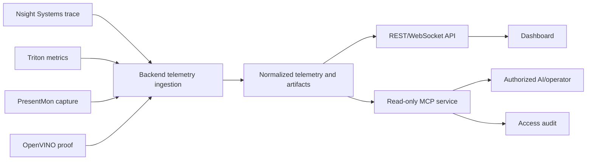

# Research: Hybrid Inference Telemetry, Dashboard Delivery, And MCP Observability

**Feature**: [Parallel Pose Inference with Hybrid Telemetry](spec.md)  
**Plan**: [plan.md](plan.md)  
**Date**: 2026-05-23

## Decision Summary

| Topic | Decision | Reason |
|-------|----------|--------|
| NVIDIA telemetry application | Install NVIDIA Nsight Systems CLI in an instrumented Triton validation image and require bounded trace capture. | NVIDIA documents CLI installation for Linux/container collection; this satisfies mandatory in-container tooling without introducing a separate DCGM agent. |
| NVIDIA steady-state GPU KPI source | Continue scraping Triton Prometheus metrics during benchmark runs. | Triton already publishes inference and GPU metrics, while its release notes warn against concurrent separate DCGM agents. |
| NVIDIA DCGM Exporter | Do not deploy concurrently in the default validation topology. | NVIDIA documents that Triton metrics might not work when another DCGM agent runs concurrently. |
| Intel Windows telemetry | Install and require Intel PresentMon capture on Windows. | Intel provides it as a GPU telemetry and performance capture utility with command-line automation support. |
| Intel model placement proof | Require explicit OpenVINO Intel GPU device identity and profiling evidence. | Host telemetry alone cannot prove that a specific model executed on Intel rather than another available GPU. |
| Hybrid validation correlation | Persist one validation-run ID with synchronized capture windows across inference, collector output, stage timing, and video export. | A performance claim is not defensible when metrics cannot be attributed to the same run and input. |
| Video quality validation | Compare the final output with the source outside intentional overlay regions and verify media properties including audio presence. | Rendered output completion does not establish fidelity. |
| Normalized telemetry data plane | Ingest source evidence through backend persistence before exposing dashboard or AI/operator projections. | It provides one validated, auditable source of truth and avoids independent consumers interpreting raw tools differently. |
| Dashboard interface | Use authenticated REST/WebSocket APIs over normalized telemetry for frontend charts and live/delayed status. | Dashboards require stable query and event behavior independent of MCP service health. |
| MCP role and scope | Provide a mandatory, initially read-only MCP server over normalized persisted evidence. | AI/operator investigation requires governed MCP resources/tools without granting raw collector or execution access. |
| MCP deployed transport | Use authenticated Streamable HTTP for deployed AI/operator integrations; restrict `stdio` to local development diagnostics. | Streamable HTTP is the standard remote/server transport and defines required network security handling. |
| MCP authorization and safety | Apply RBAC, PII-safe projections, bounded result sets, raw-trace restriction, and auditable verdicts; exclude mutating capture-start in the initial release. | Telemetry contains sensitive evidence and model-controlled tools must not become an ungoverned operations channel. |

## NVIDIA Telemetry Decision

### Selected Strategy

Build an instrumented validation variant of the existing Triton container image with the official NVIDIA Nsight Systems CLI package installed. The required hybrid validation process performs bounded `nsys` captures for NVIDIA/Triton execution evidence and also scrapes the existing Triton metrics endpoint for low-overhead server and GPU KPIs. The application or benchmark harness records:

- Nsight Systems package/version, environment readiness, collection configuration, and readable non-empty trace/report output.
- Triton metric samples during the validation window.
- GPU utilization, GPU memory, request, queue, and compute metric samples exposed by Triton during that validation window.
- Collector health, sampling interval, start/end timestamps, GPU identity, and any degraded-mode reason.

### Why Nsight Systems Instead Of DCGM Exporter

The telemetry application is mandatory and must execute within the Triton validation container boundary. NVIDIA Nsight Systems CLI is selected because NVIDIA documents installing its CLI package for Linux collection and using the CLI to collect within Docker containers. The instrumented image is a dedicated validation profile with a pinned tool version and image digest; the regular inference profile remains separable for controlled overhead comparison.

### Compatibility Handling

The pinned Triton `24.01` deployment contains DCGM-backed GPU metrics, and NVIDIA documentation warns that Triton metrics may fail when a separate DCGM agent is running on bare metal or in a container. Therefore, default validation must not start DCGM Exporter beside Triton. If a later operational-monitoring mode requires DCGM Exporter, it must be validated separately with Triton GPU metrics disabled or otherwise shown non-conflicting, and it must become the declared single GPU-metrics authority.

Because Nsight Systems tracing can add measurement overhead, baseline and optimized acceptance runs must use identical mandatory telemetry settings and persist overhead characterization or an equivalent uninstrumented control result.

## Intel Telemetry Decision

### Selected Strategy

Install Intel PresentMon on Windows as a mandatory telemetry application for required hybrid validation. For authoritative inference placement, configure OpenVINO against an explicit Intel GPU identity and persist:

- PresentMon installation/version, CLI capture configuration, and readable non-empty capture output.
- Requested device name and stable device identifier.
- Resolved/executing device reported by OpenVINO.
- Model identity, inference stage, performance hint/profile, and profiling statistics.
- Capture interval aligned to PresentMon data.

### OpenVINO Device Proof

OpenVINO 2026 documentation states that its `GPU` plugin addresses Intel GPUs, enumerated as `GPU.X`, and that an integrated Intel GPU is `GPU.0` while `GPU` is an alias for `GPU.0`. The system still records the explicit resolved device and profiling evidence so the run demonstrates which Intel device executed each assigned model and remains auditable when multiple Intel devices are present.

### Rejected Intel Alternatives

| Alternative | Rejection Reason |
|-------------|------------------|
| Intel Graphics Performance Analyzers as a new required dependency | Intel published an end-of-support timeline ending March 31, 2026, so it is not suitable as new long-lived validation infrastructure. |
| Intel XPU Manager | It targets Intel Data Center GPU management and is not appropriate for the local Iris Xe Windows validation lane. |
| PresentMon alone | It measures GPU activity, but it does not bind each inference model stage to the selected OpenVINO execution device. |

## Runtime And Evidence Correlation

Every baseline or optimized run must generate a `HybridValidationRun` record and child evidence. Metrics are valid only if they share:

- One input video checksum and media probe result.
- One enabled-model set and model-to-runtime assignment manifest.
- One profile configuration snapshot with secret values omitted.
- One interval covering processing and export, with monotonic timestamps.
- One output artifact manifest and final acceptance result.

Optimized-vs-baseline comparison is invalid if input, enabled models, device assignment, output requirements, mandatory telemetry mode, or required telemetry sources differ without a recorded approved exception.

## Dashboard And MCP Access Decision

### Selected Architecture

Telemetry collectors do not become public integration endpoints. The backend ingests and normalizes Nsight Systems references, Triton metric samples, PresentMon samples, and OpenVINO runtime/profiling evidence into run-correlated summary, timeline, assignment, artifact, fidelity, and comparison projections. The application dashboard consumes authenticated REST/WebSocket endpoints over that normalized store. A separate MCP service reads the same governed projections for authorized AI/operator clients.

The diagram shows a single normalization boundary: source-specific evidence is accepted and validated at ingestion, then both human-facing dashboard delivery and AI/operator diagnostics consume controlled projections. MCP is outside the inference and dashboard critical paths. Its failure, disablement, or authorization rejection cannot interrupt inference, mandatory capture persistence, or frontend delivery.

### MCP Protocol Choice

The MCP protocol distinguishes resources, which expose application-controlled context, from tools, which are functions a model can discover and invoke. This feature maps run evidence views to custom `telemetry://runs/{run_id}/...` resources and maps only read-only calculations or checks to tools. It does not expose prompts, raw arbitrary file reads, command execution, profiler argument passthrough, or `start_validation_capture` in the initial interface.

For deployed clients, use MCP Streamable HTTP through an authenticated endpoint. The protocol requires a single endpoint supporting HTTP `POST` and `GET`, and it requires Origin validation for Streamable HTTP to mitigate DNS rebinding; local development may use `stdio` with environment-provided credentials only. Protected HTTP deployments apply MCP authorization guidance and the application's least-privilege role policy.

### Bounded Projection Rules

| Exposure | Decision |
|----------|----------|
| Timeline data | Server-enforced time range, sample cap, and downsampling; reject or narrow unbounded queries. |
| Artifact data | Return manifest metadata by default; raw trace download remains an existing authorized backend artifact action for admin/release-validation roles, not an MCP raw-file function. |
| Identity fields | Return anonymized/pseudonymous telemetry identifiers only; omit student-identifying raw data. |
| Tools | Permit health, comparison, failure explanation, and evidence-package validation only when they read normalized evidence. |
| Auditing | Persist client/principal, operation/resource, input bounds, role decision, redaction action, result/failure status, and timestamp. |
| Failure behavior | Denials and MCP service failures are contained to the MCP boundary and do not change job/capture/dashboard state. |

### Alternatives Rejected

| Alternative | Rejection Reason |
|-------------|------------------|
| Dashboard reads from MCP | Couples frontend reliability and latency to MCP availability and bypasses dedicated dashboard contracts. |
| MCP scrapes Nsight, PresentMon, or Triton directly | Duplicates normalization and authorization logic and risks contradictory evidence. |
| MCP exposes raw artifact reads | Violates bounded, role-aware artifact access and increases PII/path traversal risk. |
| Initial `start_validation_capture` tool | Introduces a mutating privileged operation before its authorization, rate-limit, and safety workflow is specified and tested. |
| Legacy HTTP+SSE as the planned remote transport | Streamable HTTP is the current standard MCP HTTP transport and should be selected for new deployed integration. |

## Export Fidelity Decision

Completion requires an actual playable annotated output video, not just frame images or a completed job state. The validation report must verify:

- Source and output resolution and aspect ratio.
- Nominal frame rate and duration tolerance within one source frame.
- Audio presence parity where the source contains audio.
- Decodable output media file.
- Quality evaluation outside configured overlay masks, with degradation no worse than the approved encoding baseline.

## Current Repository Findings To Resolve In Implementation

- Triton service metrics are already enabled in the development Compose topology, but no run-scoped collector currently correlates them with offline validation artifacts.
- The existing Triton Dockerfile is a suitable seam for a pinned instrumented validation image, but it does not currently install Nsight Systems CLI.
- Existing hybrid documentation identifies intended NVIDIA/Triton and Intel/OpenVINO lanes, but current evidence does not prove model-by-model same-run assignment.
- OpenVINO assignment must be recorded as an explicit Intel GPU device identifier with runtime profiling evidence.
- Current audit persistence requires verification that per-model runtime assignment fields are actually populated.
- Current final-video export paths require correction for source audio and objective fidelity verification.
- Existing benchmark execution is a usable starting point, but its outputs must be expanded to include placement, collector, export, and quality evidence.
- Existing runtime persistence and views provide useful dashboard seams, but dedicated normalized telemetry summary/timeline/artifact/assignment/comparison contracts must be implemented and tested.
- Existing WebSocket consumers provide a delivery seam, but MCP-independent telemetry delivery and MCP failure isolation are not yet proven.
- No current MCP service or MCP access-audit data plane proves authorized, bounded, read-only AI/operator telemetry access.

### Local Extension Seams

| Existing Location | Use In This Feature |
|-------------------|---------------------|
| `backend/apps/pipeline/models.py` | Extend run-correlated persistence with normalized telemetry and audit records. |
| `backend/apps/pipeline/runtime_ingestion.py` | Normalize source-specific samples and runtime evidence before projection. |
| `backend/apps/video_analysis/urls.py` and `views.py` | Add the dashboard REST contracts without routing through MCP. |
| `backend/apps/video_analysis/consumers.py` | Deliver authorized normalized WebSocket events. |
| `docker-compose.dev.yml` | Retain existing offline Triton metrics exposure for the validation collector. |
| Planned `backend/apps/telemetry_mcp/` | Host the read-only MCP projection adapter over stored evidence. |

## Primary References

- NVIDIA Triton Inference Server User Guide: [Metrics](https://docs.nvidia.com/deeplearning/triton-inference-server/user-guide/docs/user_guide/metrics.html)
- NVIDIA Triton Inference Server: [Release Notes](https://docs.nvidia.com/deeplearning/triton-inference-server/pdf/Triton-Inference-Server-Release-Notes.pdf)
- NVIDIA Nsight Systems: [Installation Guide](https://docs.nvidia.com/nsight-systems/InstallationGuide/index.html)
- NVIDIA Nsight Systems: [User Guide - Container Collection](https://docs.nvidia.com/nsight-systems/UserGuide/)
- NVIDIA DCGM Documentation: [DCGM Exporter](https://docs.nvidia.com/datacenter/dcgm/latest/gpu-telemetry/dcgm-exporter.html)
- NVIDIA DCGM Exporter Repository: [NVIDIA/dcgm-exporter](https://github.com/NVIDIA/dcgm-exporter)
- Intel PresentMon: [Intel PresentMon for Windows](https://game.intel.com/us/intel-presentmon/)
- Intel Graphics Performance Analyzers: [Tool Overview and Support Notice](https://www.intel.com/content/www/us/en/developer/tools/graphics-performance-analyzers/overview.html)
- Intel XPU Manager: [Documentation](https://intel.github.io/xpumanager/)
- OpenVINO Documentation: [Performance Hints](https://docs.openvino.ai/2026/openvino-workflow/running-inference/optimize-inference/high-level-performance-hints.html)
- OpenVINO Documentation: [GPU Device](https://docs.openvino.ai/2026/openvino-workflow/running-inference/inference-devices-and-modes/gpu-device.html)
- Model Context Protocol Specification (2025-11-25): [Server Overview](https://modelcontextprotocol.io/specification/2025-11-25/server/index)
- Model Context Protocol Specification (2025-11-25): [Resources](https://modelcontextprotocol.io/specification/2025-11-25/server/resources)
- Model Context Protocol Specification (2025-11-25): [Tools](https://modelcontextprotocol.io/specification/2025-11-25/server/tools)
- Model Context Protocol Specification (2025-11-25): [Streamable HTTP Transports](https://modelcontextprotocol.io/specification/2025-11-25/basic/transports)
- Model Context Protocol Specification (2025-11-25): [Authorization](https://modelcontextprotocol.io/specification/2025-11-25/basic/authorization)
- Official MCP Python SDK: [modelcontextprotocol/python-sdk](https://github.com/modelcontextprotocol/python-sdk)
