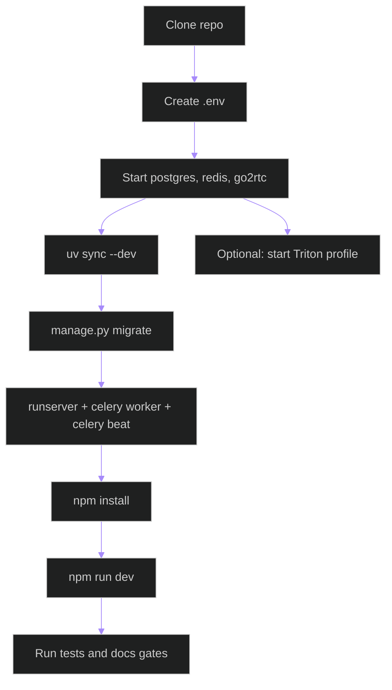

# Quickstart

This guide brings up the current repository from a fresh checkout using the commands that actually exist in this project.

## What This Starts

- PostgreSQL from `docker-compose.dev.yml`
- Redis from `docker-compose.dev.yml`
- go2rtc from `docker-compose.dev.yml`
- Django REST and WebSocket server
- Celery worker and beat
- React Vite frontend
- Optional Triton dev profile

## Linux Deployment Runbook (No Docker, No sudo)

This runbook is for production-like Linux hosts where you cannot use Docker or sudo.

For phased execution, milestone gates, mandatory tests, commit stages, and sync/stash closure across dev/prod/GitHub, see:
- [docs/linux_production_optimization_execution_phases.md](/E:/grad_project/docs/linux_production_optimization_execution_phases.md)

### 0) Install backend dependencies with CUDA12-safe pins (`uv`)

On CUDA 12.x production hosts, use the backend requirements from this repo and keep torch in the pinned range (`torch 2.7.x`, `torchvision 0.22.x`) to avoid accidental `cu13` dependency pull.

```bash
cd /home/bamby/grad_project
source .venv/bin/activate
python -m pip install -U pip setuptools wheel uv
cd backend
uv pip install -r requirements.txt
```

If `cu13` packages were pulled in a previous attempt, remove them and re-install:

```bash
cd /home/bamby/grad_project
source .venv/bin/activate
pip uninstall -y nvidia-cudnn-cu13 nvidia-cusparselt-cu13 nvidia-nccl-cu13 nvidia-nvshmem-cu13 triton || true
cd backend
uv pip install -r requirements.txt
```

### 1) Build TensorRT engines from ONNX (user-space)

From project root on Linux server:

```bash
source /home/bamby/grad_project/.venv/bin/activate
python /home/bamby/grad_project/backend/scripts/build_tensorrt_engines.py --workspace-mib 4096
```

This generates/refreshes engines for:

- `student_teacher`
- `standing_sitting`
- `right_left`
- `up_down`
- `forward_backward`
- `rtmpose`

### 2) Build Triton server in user-space (no container build)

```bash
cd /home/bamby/services
git clone -b r25.02 https://github.com/triton-inference-server/server.git triton_src
cd triton_src
python3 build.py \
  --no-container-build \
  --build-dir /home/bamby/services/triton_build_r2502 \
  --build-type Release \
  --enable-logging \
  --enable-stats \
  --enable-metrics \
  --enable-gpu \
  --endpoint=http \
  --endpoint=grpc
```

### 3) Build TensorRT backend plugin (required for `tensorrt_plan`)

The backend requires user-space header/lib wiring:

- TensorRT headers (vendored): `/home/bamby/services/vendor/TensorRT/include`
- TensorRT libs from venv: `/home/bamby/grad_project/.venv/lib/python3.11/site-packages/tensorrt_libs`

Build command:

```bash
cd /home/bamby/services/triton_src
python3 build.py \
  --no-container-build \
  --no-core-build \
  --build-dir /home/bamby/services/triton_build_r2502 \
  --install-dir /home/bamby/services/triton_build_r2502/tritonserver/install \
  --build-type Release \
  --enable-gpu \
  --backend=tensorrt \
  --extra-backend-cmake-arg tensorrt:CMAKE_CUDA_ARCHITECTURES=90 \
  --extra-backend-cmake-arg tensorrt:NVINFER_INCLUDE_DIR=/home/bamby/services/vendor/TensorRT/include \
  --extra-backend-cmake-arg tensorrt:NVINFER_LIBRARY=/home/bamby/grad_project/.venv/lib/python3.11/site-packages/tensorrt_libs/libnvinfer.so.10 \
  --extra-backend-cmake-arg tensorrt:NVINFER_PLUGIN_LIBRARY=/home/bamby/grad_project/.venv/lib/python3.11/site-packages/tensorrt_libs/libnvinfer_plugin.so.10
```

Expected backend plugin after success:

```bash
ls /home/bamby/services/triton_build_r2502/tritonserver/install/backends/tensorrt/libtriton_tensorrt.so
```

### 4) Start Triton with CUDA12 repository and explicit backend directory

```bash
/home/bamby/services/triton_build_r2502/tritonserver/install/bin/tritonserver \
  --model-repository=/home/bamby/grad_project/backend/models/triton_repository_cuda12 \
  --backend-directory=/home/bamby/services/triton_build_r2502/tritonserver/install/backends \
  --http-port=18000 \
  --grpc-port=18001 \
  --metrics-port=18002
```

Health check:

```bash
curl -s -o /dev/null -w "%{http_code}\n" http://127.0.0.1:18000/v2/health/ready
```

`200` means ready.

### 5) Known custom dependencies used in this environment

- `RapidJSON` vendored under `/home/bamby/services/vendor/rapidjson`
- `Boost` headers under `/home/bamby/services/vendor/boost_1_87_0`
- `libb64` headers/lib under `/home/bamby/services/vendor/libb64`
- TensorRT headers under `/home/bamby/services/vendor/TensorRT/include`

These are required because host package installation is restricted.

## Setup Flow



The flowchart shows the required local startup order and the optional Triton branch.

## 1. Clone The Repository

Windows (PowerShell):

```powershell
git clone https://github.com/ahmedelbamby-aast/grad_project.git
cd grad_project
```

Linux (bash):

```bash
git clone https://github.com/ahmedelbamby-aast/grad_project.git
cd grad_project
```

## 2. Create The Root Environment File

Windows (PowerShell):

```powershell
Copy-Item .env.example .env
```

Linux (bash):

```bash
cp .env.example .env
```

The root `.env` is the active runtime file. Start from `.env.example`, then replace placeholder values with machine-specific values. The frontend also has its own example file at `frontend/.env.example`.

Root `.env.example` and root `.env` variables:

| Variable | Example / Default | Used by | Why it exists | Acceptable values | Role / operational effect |
| --- | --- | --- | --- | --- | --- |
| `DJANGO_SECRET_KEY` | `change-me` | Django settings | Cryptographic signing secret for sessions and internal security features. | Any long random string. | Required for safe session/CSRF signing. |
| `DJANGO_DEBUG` | `True` | Not currently consumed by active settings modules | Kept as an operator-facing Django convention, but current debug behavior comes from the selected settings file. | `True` / `False` / `1` / `0` if you keep it. | No direct runtime effect in the current code path. |
| `DJANGO_ALLOWED_HOSTS` | `localhost,127.0.0.1` | Django settings | Limits accepted host headers. | Comma-separated hosts/IPs. | Wrong values cause host-header errors. |
| `POSTGRES_DB` | `exam_monitor` | Django settings | Database name. | Existing PostgreSQL DB name. | Must match the provisioned DB. |
| `POSTGRES_USER` | `exam_user` | Django settings | Database username. | Existing PostgreSQL user. | Wrong value blocks DB login. |
| `POSTGRES_PASSWORD` | `exam_pass` | Django settings | Database password. | Matching DB password. | Wrong value blocks DB login. |
| `POSTGRES_HOST` | `localhost` | Django settings | Database host/service name. | Hostname or IP. | Wrong value breaks DB connectivity. |
| `POSTGRES_PORT` | `5432` | Django settings | Database port. | Integer port. | Wrong value breaks DB connectivity. |
| `REDIS_URL` | `redis://localhost:6379/0` | Django Channels | Shared Redis endpoint. | Valid Redis URL. | Wrong value breaks channel-layer connectivity. |
| `CELERY_BROKER_URL` | `redis://localhost:6379/1` | Celery worker | Task broker endpoint. | Valid Redis broker URL. | Wrong value stops background dispatch. |
| `CELERY_RESULT_BACKEND` | `redis://localhost:6379/2` | Celery worker | Task result backend. | Valid Redis backend URL. | Wrong value breaks task state/result tracking. |
| `CELERY_WORKER_POOL` | `solo` on Windows, `prefork` otherwise | `backend/config/celery.py` | Optional worker pool override, present in the active `.env`. | `solo`, `prefork`, `threads`. | Use `solo` on Windows if you hit worker startup issues. |
| `CELERY_WORKER_CONCURRENCY` | `1` on Windows or CPU-count on Linux | `backend/config/celery.py` | Optional concurrency override, present in the active `.env`. | Positive integer. | Reduce it if the machine is memory-constrained. |
| `CELERY_LIVE_PERSON_QUEUE` | `pipeline.live.person_detector.worker` | Celery routing | Dedicated live queue for person detection tasks. | Queue name string. | Enables process-level queue isolation for live detector load. |
| `CELERY_LIVE_POSE_QUEUE` | `pipeline.live.rtmpose_model.worker` | Celery routing | Dedicated live queue for RTMPose tasks. | Queue name string. | Isolates live pose inference from other workloads. |
| `CELERY_LIVE_BEHAVIOR_QUEUE` | `pipeline.live.behavior.worker` | Celery routing | Dedicated live queue for behavior/gaze/posture tasks. | Queue name string. | Reduces queue contention in live streaming. |
| `CELERY_OFFLINE_PERSON_QUEUE` | `pipeline.offline.person_detector.worker` | Celery routing | Dedicated offline queue for person detection tasks. | Queue name string. | Improves offline throughput predictability under stride=1. |
| `CELERY_OFFLINE_POSE_QUEUE` | `pipeline.offline.rtmpose_model.worker` | Celery routing | Dedicated offline queue for RTMPose tasks. | Queue name string. | Isolates offline pose throughput and timeout behavior. |
| `CELERY_OFFLINE_BEHAVIOR_QUEUE` | `pipeline.offline.behavior.worker` | Celery routing | Dedicated offline queue for behavior/gaze/posture tasks. | Queue name string. | Prevents mixed-workload starvation in offline runs. |
| `FIELD_ENCRYPTION_KEY` | generated Fernet key | Camera encrypted fields | Encrypts camera URLs at rest. | Valid Fernet key. | Missing/invalid values break encrypted camera access and migration logic. |
| `GO2RTC_API_URL` | `http://localhost:1984` | Camera/go2rtc services | Backend go2rtc control API endpoint. | Reachable HTTP URL. | Wrong value breaks stream registration/status calls. |
| `GO2RTC_WHEP_URL` | `http://localhost:8555` | Shared streaming topology reference | Documents the WHEP bridge endpoint. | Reachable HTTP URL. | Keep aligned with go2rtc WHEP listener. |
| `ONVIF_USERNAME` | empty by default | ONVIF camera resolver | ONVIF device-service username. | Valid ONVIF account username. | Required for ONVIF device-service camera URLs. |
| `ONVIF_PASSWORD` | empty by default | ONVIF camera resolver | ONVIF device-service password. | Valid ONVIF account password. | Required for ONVIF device-service camera URLs. |
| `ONVIF_WSDL_DIR` | empty by default | ONVIF camera resolver | Path to ONVIF WSDL files used by the ONVIF client library. | Absolute directory path. | Required for ONVIF resolution flow. |
| `VITE_API_BASE_URL` | `http://localhost:8000/api/v1` | Frontend Axios client | REST API base URL. | Absolute URL or same-origin path. | Wrong value breaks browser API calls. |
| `VITE_WS_BASE_URL` | `ws://localhost:8000/ws` in root `.env.example` | Frontend WebSocket hook | WebSocket base URL. | `ws://...` or `wss://...`. | Wrong value breaks live monitor sockets. |
| `VITE_GO2RTC_WHEP_URL` | `http://localhost:8555` | Legacy/shared root template entry | Root-level documentation of the WHEP endpoint; current frontend hook uses `/whep/...` proxy flow instead. | HTTP URL. | Keep only if you want the root env to describe all streaming endpoints. |
| `PYRAMID_MODELS_BASE_DIRECTORY` | `backend/models` | Pipeline config | Model artifact root. | Relative or absolute path. | Wrong path prevents model loading. |
| `PYRAMID_RAW_DATA_DIRECTORY` | `Raw Data` | Pipeline config | Raw dataset/video root. | Relative or absolute path. | Wrong path breaks dataset-backed workflows. |
| `PYRAMID_INFERENCE_BACKEND` | `tensorrt` | Pipeline config | Preferred local inference backend. | `onnx`, `openvino`, `tensorrt`. | Changes model runtime selection. |
| `PYRAMID_PERSON_DETECTOR_PATH` | `student_teacher/weights/student_teacher.engine` | Pipeline config | Person detector path. | Valid model path. | Wrong value breaks person detection. |
| `PYRAMID_PERSON_DETECTOR_RUNTIME` | `TensorRT` | Pipeline config | Detector runtime override. | `auto`, `onnx`, `openvino`, `tensorrt`. | Forces detector backend. |
| `PYRAMID_POSTURE_MODEL_PATH` | `standing_sitting/weights/standing_sitting.engine` | Pipeline config | Posture model path. | Valid model path. | Wrong value breaks posture classification. |
| `PYRAMID_POSTURE_MODEL_RUNTIME` | `TensorRT` | Pipeline config | Posture runtime override. | `auto`, `onnx`, `openvino`, `tensorrt`. | Forces posture backend. |
| `PYRAMID_HORIZONTAL_GAZE_MODEL_PATH` | `right_left/weights/right_left.engine` | Pipeline config | Horizontal gaze model path. | Valid model path. | Wrong value breaks left/right gaze classification. |
| `PYRAMID_HORIZONTAL_GAZE_MODEL_RUNTIME` | `TensorRT` | Pipeline config | Horizontal gaze runtime override. | `auto`, `onnx`, `openvino`, `tensorrt`. | Forces horizontal gaze backend. |
| `PYRAMID_DEPTH_GAZE_MODEL_PATH` | `forward_backward/weights/forward_backward.engine` | Pipeline config | Depth gaze model path. | Valid model path. | Wrong value breaks forward/backward gaze classification. |
| `PYRAMID_DEPTH_GAZE_MODEL_RUNTIME` | `TensorRT` | Pipeline config | Depth gaze runtime override. | `auto`, `onnx`, `openvino`, `tensorrt`. | Forces depth gaze backend. |
| `PYRAMID_VERTICAL_GAZE_MODEL_PATH` | `up_down/weights/up_down.engine` | Pipeline config | Vertical gaze model path. | Valid model path. | Wrong value breaks up/down gaze classification. |
| `PYRAMID_VERTICAL_GAZE_MODEL_RUNTIME` | `TensorRT` | Pipeline config | Vertical gaze runtime override. | `auto`, `onnx`, `openvino`, `tensorrt`. | Forces vertical gaze backend. |
| `PYRAMID_TRACKING_MODEL_RUNTIME` | `TensorRT` | Pipeline config | Tracking runtime override. | `auto`, `onnx`, `openvino`, `tensorrt`. | Can change tracker execution backend. |
| `PYRAMID_TRACKING_ALGORITHM` | `bytetrack` | Pipeline config | Default tracker family. | `bytetrack`, `botsort`. | Base tracker choice when user preference does not override it. |
| `PYRAMID_TRACKING_REID_ALGORITHM` | `botsort` | Pipeline config | ReID-capable tracker name. | Configured tracker key. | Used when tracking IDs are enabled. |
| `PYRAMID_TRACKING_LOW_COMPUTE_ALGORITHM` | `bytetrack` | Pipeline config | Lower-cost tracker fallback. | Configured tracker key. | Used when tracking IDs are disabled. |
| `PYRAMID_TRACKING_REID_ENABLED` | `true` | Pipeline config | Master ReID switch. | Boolean-like values. | `false` disables appearance matching. |
| `PYRAMID_TRACKING_IOU_THRESHOLD` | `0.3` | Pipeline config | IoU matching threshold. | Float `0.0` to `1.0`. | Higher values are stricter. |
| `PYRAMID_TRACKING_MAX_CENTER_DISTANCE` | `160.0` | Pipeline config | Centroid association distance cap. | Positive float. | Higher values allow looser reassociation. |
| `PYRAMID_TRACKING_REID_SIMILARITY_THRESHOLD` | `0.85` | Pipeline config | ReID similarity cutoff. | Float `0.0` to `1.0`. | Higher values reduce false matches but can miss valid relinks. |
| `PYRAMID_EMBEDDING_REDIS_TTL_SECONDS` | `2592000` | Pipeline config | Redis TTL for stored embeddings. | Integer seconds. | Longer TTL keeps ReID memory longer. |
| `PYRAMID_RTSP_OVER_TCP` | `true` | Camera and pipeline services | Forces RTSP transport over TCP. | Boolean-like values. | Improves stream stability on lossy networks. |
| `PYRAMID_RTSP_TRANSPORT` | `tcp` | Camera and pipeline services | Preferred RTSP transport. | `tcp`, `udp`, `auto`. | Affects generated/normalized RTSP stream handling. |
| `PYRAMID_INFERENCE_AUDIT_ENABLED` | `true` | Pipeline/video analysis | Enables offline audit artifact persistence. | Boolean-like values. | Adds audit output under job storage. |
| `PYRAMID_INFERENCE_AUDIT_LIVE_ENABLED` | `true` | Pipeline config | Enables live audit event persistence. | Boolean-like values. | Adds overhead but improves traceability. |
| `PYRAMID_DEVICE` | `cuda` | Pipeline config | Preferred local inference device. | `cpu`, `cuda`, `mps`. | Selects execution hardware. |
| `PYRAMID_OPENVINO_DEVICE` | `intel:gpu` | Pipeline config | OpenVINO target device. | `intel:gpu`, `intel:cpu`, `intel:npu`, similar valid device strings. | Changes OpenVINO execution target. |
| `PYRAMID_PERSON_CONFIDENCE_THRESHOLD` | `0.5` | Pipeline config | Person detection confidence cutoff. | Float `0.0` to `1.0`. | Higher values reduce false positives. |
| `OFFLINE_DETECT_EVERY_N_FRAMES` | `2` | Offline video analysis | Runs detector every N frames while still producing frame-level outputs. | Integer `1..300` (invalid/out-of-range falls back to `2`). | Lowers detector pressure while keeping stride=1 rendering. |
| `LIVE_DETECT_EVERY_N_FRAMES` | `3` | Live video analysis | Runs detector every N frames in live path. | Integer `1..300` (invalid/out-of-range falls back to `3`). | Reduces live detector cost and improves responsiveness. |
| `OFFLINE_REUSE_LAST_BOXES_TTL_FRAMES` | `20` | Offline video analysis | Reuses last valid detections when detector frame is skipped or times out. | Integer `0..2000` (invalid/out-of-range falls back to `20`). | Improves continuity and mitigates transient detector timeouts. |
| `LIVE_REUSE_LAST_BOXES_TTL_FRAMES` | `8` | Live video analysis | Reuses last valid detections for a bounded live-frame window. | Integer `0..2000` (invalid/out-of-range falls back to `8`). | Smooths live overlays and avoids flicker on brief inference stalls. |
| `PYRAMID_BEHAVIOR_CONFIDENCE_THRESHOLD` | `0.5` | Pipeline config | Behavior confidence cutoff. | Float `0.0` to `1.0`. | Higher values reduce noisy labels. |
| `PYRAMID_WORKER_COUNT` | `4` | Pipeline config | Parallel inference worker count. | Integer `1` to `16`. | Higher values increase throughput until saturation. |
| `PYRAMID_INFERENCE_TIMEOUT` | `30.0` | Pipeline config | Per-inference timeout in seconds. | Float `1.0` to `300.0`. | Prevents hung inference calls. |
| `PYRAMID_BENCHMARK_WARMUP_ITERATIONS` | `10` | Pipeline config | Benchmark warm-up count. | Integer `0` to `100`. | Stabilizes benchmark results. |
| `PYRAMID_BENCHMARK_SAMPLE_COUNT` | `100` | Pipeline config | Benchmark sample count. | Integer `10` to `1000`. | Increases benchmark reliability. |
| `PYRAMID_PRESERVE_SOURCE_QUALITY` | `true` | Pipeline config and exporters | Present in the active `.env`; keeps annotated output near source fidelity. | Boolean-like values. | Higher quality outputs, larger files. |
| `PYRAMID_INFERENCE_IMGSZ` | `0` | Pipeline config | Present in the active `.env`; global inference image-size override. | Integer `0` to `4096`. | Larger values may improve accuracy but increase latency. |
| `PYRAMID_STREAM_INFERENCE_IMGSZ` | `0` | Pipeline config | Present in the active `.env`; stream-specific image-size override. | Integer `0` to `4096`. | Lets live analysis run at a different inference size. |
| `PYRAMID_OUTPUT_MAX_WIDTH` | `0` | Pipeline exporters | Present in the active `.env`; output width cap. | Integer `0` to `8192`. | Downscales annotated outputs when non-zero. |
| `PYRAMID_OUTPUT_MAX_HEIGHT` | `0` | Pipeline exporters | Present in the active `.env`; output height cap. | Integer `0` to `8192`. | Downscales annotated outputs when non-zero. |
| `PYRAMID_OUTPUT_VIDEO_CRF` | `18` | Pipeline exporters | Present in the active `.env`; H.264 quality factor. | Integer `0` to `51`. | Lower values improve quality and increase file size. |
| `PYRAMID_OUTPUT_VIDEO_PRESET` | `medium` | Pipeline exporters | Present in the active `.env`; FFmpeg preset. | `ultrafast`, `fast`, `medium`, `slow`, etc. | Trades encode speed for compression efficiency. |
| `PYRAMID_OUTPUT_VIDEO_BITRATE` | empty or `6M` | Pipeline exporters | Present in the active `.env`; optional explicit bitrate target. | Empty or FFmpeg bitrate string. | Overrides pure CRF-driven behavior. |
| `PYRAMID_OUTPUT_JPEG_QUALITY` | `95` | Pipeline exporters | Present in the active `.env`; JPEG quality for image artifacts. | Integer `1` to `100`. | Higher values improve image quality. |
| `TRITON_ENABLED` | `0` base / `1` dev default | Django settings and inference routing | Master Triton routing switch. | Boolean-like values. | Enables/disables Triton-backed inference. |
| `TRITON_FORCE_DOCKER` | `0` base / `1` dev default | Runtime policy | Forces Triton usage in Docker-backed flows. | Boolean-like values. | Can block local fallback. |
| `TRITON_HYBRID_LOCAL_PERSISTENCE` | `1` | Runtime policy | Allows local model persistence alongside Triton routing. | Boolean-like values. | `false` with forced Triton disables local model loading. |
| `TRITON_REQUIRED_OFFLINE` | `0` base / `1` dev default | Runtime policy and offline analysis | Requires Triton for offline jobs. | Boolean-like values. | Prevents silent local fallback offline. |
| `TRITON_REQUIRED_LIVE` | `0` base / `1` dev default | Runtime policy and live analysis | Requires Triton for live jobs. | Boolean-like values. | Prevents silent local fallback live. |
| `TRITON_URL` | `http://localhost:8000` | Health checks and inference clients | Triton HTTP endpoint. | Reachable HTTP URL. | Wrong value breaks Triton health and inference requests. |
| `TRITON_TIMEOUT_MS` | `1500` | Inference clients | Default Triton request timeout. | Positive integer milliseconds. | Lower values fail faster. |
| `TRITON_MAX_TIMEOUT_MS` | `5000` | Inference clients | Max allowed Triton timeout. | Positive integer milliseconds. | Prevents unbounded wait requests. |
| `TRITON_RETRY_ATTEMPTS` | `2` | Triton request policy | Retry count for Triton requests. | Non-negative integer. | Higher values improve resilience at the cost of latency. |
| `TRITON_RETRY_TIMEOUT_SCALE` | `2.0` | Triton request policy | Backoff multiplier between retries. | Positive float. | Higher values back off more aggressively. |
| `TRITON_OFFLINE_FRAME_STRIDE` | `10` | Offline video analysis | Frame thinning factor for offline Triton processing. | Positive integer. | Higher values reduce load but skip more frames. |
| `TRITON_EXECUTION_PROFILE` | `throughput_guardrails` | Triton runtime policy | Selects production tuning profile for Triton-only deployment. | `throughput_guardrails`, `live_latency_first`. | Controls batching/timeout/queue strategy defaults by workload profile. |

Frontend `frontend/.env.example` variables:

| Variable | Example / Default | Used by | Why it exists | Acceptable values | Role / operational effect |
| --- | --- | --- | --- | --- | --- |
| `VITE_API_BASE_URL` | `http://localhost:8000/api/v1` | Frontend Axios client | REST API base URL. | Absolute URL or same-origin path. | Wrong value breaks frontend API traffic. |
| `VITE_WS_BASE_URL` | `ws://localhost:8000` | Frontend WebSocket hook | Base WebSocket URL. | `ws://...` or `wss://...`. | Wrong value breaks live socket subscriptions. |
| `VITE_GO2RTC_URL` | `http://localhost:1984` | Frontend WHEP client documentation path | go2rtc base endpoint for browser streaming context. | Reachable HTTP URL. | Keep aligned with go2rtc deployment and proxy expectations. |

Generate a valid encryption key if needed:

```powershell
python -c "from cryptography.fernet import Fernet; print(Fernet.generate_key().decode())"
```

ONVIF notes:

- Install ONVIF client dependency in backend runtime (`onvif-python`).
- Use ONVIF device-service URL format: `http://<camera-ip>:<port>/onvif/device_service`.
- ONVIF helper endpoints:
  - `POST /api/v1/cameras/onvif/resolve/`
  - `POST /api/v1/cameras/onvif/test/`
  - `POST /api/v1/cameras/{camera_id}/onvif/sync/`

## 3. Start Development Infrastructure

Windows (PowerShell) and Linux (bash):

```powershell
docker compose -f docker-compose.dev.yml up -d
```

This starts:

- `postgres` on `5432`
- `redis` on `6379`
- `go2rtc` on `1984` and `8555`

Check service state:

```powershell
docker compose -f docker-compose.dev.yml ps
docker compose -f docker-compose.dev.yml logs --tail 50 postgres
docker compose -f docker-compose.dev.yml logs --tail 50 redis
docker compose -f docker-compose.dev.yml logs --tail 50 go2rtc
```

### Installation Details Per Component (Docker Dev + Sim, and Production Linux No-Docker Verification)

This section documents every containerized component from:

- `docker-compose.dev.yml`
- `docker-compose.sim.yml`

For each component, it includes:

- detailed install/start commands
- common issues and fixes
- manual verification steps for production Linux systems that do not use Docker

#### `postgres` (`docker-compose.dev.yml`)

Dev install/start:

```powershell
docker pull postgres:16-alpine
docker compose -f docker-compose.dev.yml up -d postgres
docker compose -f docker-compose.dev.yml ps postgres
docker compose -f docker-compose.dev.yml logs --tail 80 postgres
```

Common issues and fixes:

- Port `5432` already in use:
  - fix by stopping host PostgreSQL or changing compose port mapping.
- Authentication failures:
  - verify `.env` values for `POSTGRES_DB`, `POSTGRES_USER`, `POSTGRES_PASSWORD`.
- Service unhealthy:
  - inspect logs and ensure data volume permissions are valid.

Production Linux (no Docker) manual verification:

```bash
pg_isready -h 127.0.0.1 -p 5432
psql -h 127.0.0.1 -U exam_user -d exam_monitor -c "SELECT version();"
psql -h 127.0.0.1 -U exam_user -d exam_monitor -c "SELECT 1;"
ss -ltnp | grep 5432
```

#### `redis` (`docker-compose.dev.yml`)

Dev install/start:

```powershell
docker pull redis:7-alpine
docker compose -f docker-compose.dev.yml up -d redis
docker compose -f docker-compose.dev.yml ps redis
docker compose -f docker-compose.dev.yml logs --tail 80 redis
```

Common issues and fixes:

- Port `6379` already in use:
  - stop host Redis or remap the port.
- Celery cannot connect:
  - verify `REDIS_URL`, `CELERY_BROKER_URL`, `CELERY_RESULT_BACKEND`.

Production Linux (no Docker) manual verification:

```bash
redis-cli -h 127.0.0.1 -p 6379 ping
redis-cli ping
redis-cli -n 1 ping
ss -ltnp | grep 6379
```

#### `go2rtc` (`docker-compose.dev.yml`)

Dev install/start:

```powershell
docker pull alexxit/go2rtc:latest
docker compose -f docker-compose.dev.yml up -d go2rtc
docker compose -f docker-compose.dev.yml ps go2rtc
docker compose -f docker-compose.dev.yml logs --tail 120 go2rtc
curl http://localhost:1984/api/streams
```

Common issues and fixes:

- Port conflict on `1984` or `8555`:
  - free ports or change mappings.
- Backend cannot register streams:
  - verify `GO2RTC_API_URL` and container health.
- Frontend WHEP issues:
  - verify reverse proxy/rewrite rules for `/whep/*`.

Production Linux (no Docker) manual verification:

```bash
ps -ef | grep go2rtc | grep -v grep
curl -fsS http://127.0.0.1:1984/api/streams
ss -ltnp | grep -E "1984|8555"
```

#### `triton` profile (`docker-compose.dev.yml`, optional)

Dev install/start:

```powershell
docker pull nvcr.io/nvidia/tritonserver:24.01-py3
docker compose -f docker-compose.dev.yml --profile triton up -d triton
docker compose -f docker-compose.dev.yml --profile triton ps triton
docker logs --tail 120 grad_project-triton-1
curl http://localhost:8000/v2/health/ready
```

Common issues and fixes:

- NVIDIA runtime/GPU not available:
  - install NVIDIA drivers + container runtime.
- Health check fails:
  - verify model repo mount `backend/models/triton_repository`.
- Port conflict on `8000-8002`:
  - free ports or remap.

Production Linux (no Docker) manual verification:

```bash
ps -ef | grep tritonserver | grep -v grep
curl -fsS http://127.0.0.1:8000/v2/health/live
curl -fsS http://127.0.0.1:8000/v2/health/ready
ss -ltnp | grep -E "8000|8001|8002"
```

#### `mediamtx-sim` (`docker-compose.sim.yml`)

Dev install/start:

```powershell
docker pull bluenviron/mediamtx:latest
docker compose -f docker-compose.sim.yml up -d mediamtx-sim
docker compose -f docker-compose.sim.yml ps mediamtx-sim
docker logs --tail 120 grad_project-mediamtx-sim-1
```

Common issues and fixes:

- Port `9554` already in use:
  - stop conflicting container/service or remap host port.
- RTSP publisher cannot push:
  - verify destination URL and that container is running.

Production Linux (no Docker) manual verification:

```bash
ps -ef | grep mediamtx | grep -v grep
ss -ltnp | grep 8554
ffprobe -rtsp_transport tcp rtsp://127.0.0.1:8554/mystream
```

#### `ffmpeg-sim` (`docker-compose.sim.yml`)

Dev install/start:

```powershell
docker pull linuxserver/ffmpeg:latest
docker compose -f docker-compose.sim.yml up -d ffmpeg-sim
docker compose -f docker-compose.sim.yml ps ffmpeg-sim
docker logs --tail 80 grad_project-ffmpeg-sim-1
```

Common issues and fixes:

- Container exits immediately:
  - ensure compose entrypoint/command keeps container alive.
- Raw data mount missing:
  - verify `./Raw Data:/data/raw:ro` path exists.
- Publish command fails:
  - verify codec options and destination URL/port.

Production Linux (no Docker) manual verification:

```bash
ffmpeg -version
ffprobe -version
```

RTSP test publish command (native Linux):

```bash
ffmpeg -re -stream_loop -1 -i "/path/to/video.mp4" -an -c:v libx264 -preset ultrafast -tune zerolatency -pix_fmt yuv420p -f rtsp -rtsp_transport tcp rtsp://127.0.0.1:8554/mystream
```

TCP test publish command (native Linux):

```bash
ffmpeg -re -stream_loop -1 -i "/path/to/video.mp4" -an -c:v libx264 -preset ultrafast -tune zerolatency -pix_fmt yuv420p -f mpegts tcp://127.0.0.1:9666?listen=1
```

TCP consumer probe (native Linux):

```bash
ffprobe tcp://127.0.0.1:9666
```

#### Simulation stack attach to current `grad-proj` network

If you need simulation containers on the same network as the existing project stack:

```powershell
docker compose -f docker-compose.dev.yml up -d
docker compose -f docker-compose.sim.yml up -d
docker network inspect grad_project_default
```

Expected result:

- `grad_project-go2rtc-1`, `grad_project-mediamtx-sim-1`, and `grad_project-ffmpeg-sim-1` appear in `grad_project_default`.

## 4. Backend Setup

Windows (PowerShell):

```powershell
cd backend
uv sync --dev
uv run python manage.py migrate
uv run python manage.py createsuperuser
```

Linux (bash):

```bash
cd backend
uv sync --dev
uv run python manage.py migrate
uv run python manage.py createsuperuser
```

Notes:

- Python requirement from `backend/pyproject.toml`: `>=3.11,<3.13`
- Backend test settings come from `backend/pytest.ini`
- Installed apps include `video_analysis` and `tracking`, so offline and live flows are both part of the current system

## 5. Run Backend Processes

Open three terminals.

Recommended on Windows (clean `Ctrl+C` shutdown for Django + Celery):

```bash
cd backend
uv run python scripts/dev_supervisor.py
```

Manual mode:

### Terminal 1

Windows (PowerShell) / Linux (bash):

```powershell
cd backend
uv run python manage.py runserver
```

### Terminal 2

Windows (PowerShell) / Linux (bash):

```powershell
cd backend
uv run celery -A config worker -l info
```

### Terminal 3

Windows (PowerShell) / Linux (bash):

```powershell
cd backend
uv run celery -A config beat -l info
```

Backend endpoints:

- API base: `http://localhost:8000/api/v1/`
- WebSocket base: `ws://localhost:8000/ws/`

## 6. Frontend Setup

Windows (PowerShell) / Linux (bash):

```powershell
cd frontend
npm install
```

Optional frontend local env:

Windows (PowerShell):

```powershell
Copy-Item .env.example .env
```

Linux (bash):

```bash
cp .env.example .env
```

Then start the frontend:

Windows (PowerShell) / Linux (bash):

```powershell
npm run dev
```

Frontend scripts currently available from `frontend/package.json`:

- `npm run dev`
- `npm run build`
- `npm run lint`
- `npm run preview`
- `npm run test`
- `npm run test:watch`
- `npm run test:coverage`
- `npm run test:e2e`
- `npm run test:e2e:ui`
- `npm run type-check`

Frontend dev URL:

- `http://localhost:5173`

## 7. Optional Triton Development Profile

The compose file keeps Triton behind a profile so it does not start by default.

Start Triton only:

```powershell
docker compose -f docker-compose.dev.yml --profile triton up -d triton
```

Check Triton logs:

```powershell
docker compose -f docker-compose.dev.yml --profile triton ps triton
docker logs --tail 120 grad_project-triton-1
```

Optional helper scripts:

```powershell
.\scripts\pull-triton-image.ps1
.\scripts\pull-triton-image.ps1 -BuildProjectImage
.\scripts\export-tensorrt-models.ps1
.\scripts\sync-triton-tensorrt-repository.ps1
```

## 8. First Login

1. Open `http://localhost:5173`
2. Sign in with the superuser created in step 4
3. Confirm the dashboard loads
4. Visit `/video-analysis` and `/camera-feed` to verify both offline and live surfaces

## 9. Recommended Verification Commands

### Backend

```powershell
cd backend
uv run pytest
```

### Frontend

```powershell
cd frontend
npm run lint
npm run type-check
npm run test
npm run build
```

### Documentation And Boundary Gates

From the repository root:

```powershell
python scripts\ci\verify_docs_diagrams.py
python scripts\ci\verify_module_boundaries.py
```

### Release Gate Example

```powershell
python scripts\ci\verify_release_gate.py --phase blocking --unit-result success --integration-result success --contract-result success
```

## 10. Common Issues And Fixes

### Issue: `docker compose` services are up but backend cannot connect to Postgres

Checks:

- `.env` values match the compose service ports
- `docker compose -f docker-compose.dev.yml ps`
- `docker compose -f docker-compose.dev.yml logs postgres`

### Issue: Redis connection errors

Checks:

- Redis container is healthy
- `REDIS_URL`, `CELERY_BROKER_URL`, and `CELERY_RESULT_BACKEND` point to `localhost:6379`

### Issue: `celery beat` fails on Windows with schedule DB errors

Fix:

```powershell
cd backend
Remove-Item -Force celerybeat-schedule -ErrorAction SilentlyContinue
uv run celery -A config beat -l info
```

### Issue: `Ctrl+C` says "shutting down" repeatedly and Celery does not exit

Cause:

- Running Django/Celery in separate terminals on Windows can leave worker processes alive after interrupt.
- Non-`solo` pools on Windows are especially prone to stuck shutdown behavior.

Fix (recommended):

```powershell
cd backend
uv run python scripts/dev_supervisor.py
```

Recovery if already stuck:

```powershell
Get-CimInstance Win32_Process |
  Where-Object { $_.CommandLine -match "celery|manage.py runserver|daphne" } |
  ForEach-Object { Stop-Process -Id $_.ProcessId -Force }
```

Then restart with `dev_supervisor.py`.

### Issue: Frontend API calls fail in dev

Checks:

- Backend is running on `http://localhost:8000`
- Vite proxy is active from `frontend/vite.config.ts`
- `VITE_API_BASE_URL` is valid if you override defaults

### Issue: WebSocket connections do not establish

Checks:

- Django `runserver` is running
- `backend/config/asgi.py` is serving camera, detection, anomaly, session, health, and video-analysis routes
- `VITE_WS_BASE_URL` is correct if you override it

### Issue: WHEP stream path fails

Checks:

- `go2rtc` is up
- Vite proxy rewrites `/whep/{cameraId}` to the go2rtc WebRTC API
- Camera registration exists in the backend

### Issue: Triton does not become ready

Checks:

- Start it with the `triton` compose profile
- NVIDIA GPU runtime is available
- `backend/models/triton_repository` contains models
- `TRITON_URL` matches the running endpoint

### Issue: Camera encryption operations fail

Fix:

- Set a valid `FIELD_ENCRYPTION_KEY` in `.env`

### Issue: Documentation validation fails

Run:

```powershell
python scripts\ci\verify_docs_diagrams.py
python scripts\ci\verify_module_boundaries.py
```

## 11. Production Linux Server (No Docker) Full Setup

This section keeps Docker instructions above unchanged, and adds a full no-Docker production path using Bash commands only, with no `sudo` commands.

### 11.1 Scope and non-root assumptions

Components mapped from Docker compose to native processes:

- `postgres` from `docker-compose.dev.yml`
- `redis` from `docker-compose.dev.yml`
- `go2rtc` from `docker-compose.dev.yml`
- `triton` from `docker-compose.dev.yml` profile `triton`
- `mediamtx-sim` from `docker-compose.sim.yml`
- `ffmpeg-sim` from `docker-compose.sim.yml`

Assumptions:

- You have write access to `$HOME`.
- Base tools already exist on the server: `bash`, `curl`, `tar`, `python3`, `node`, `npm`, and compiler toolchain (`make`, `gcc`, `g++`) for source builds.
- If toolchain is missing, ask server admin to preinstall it once; commands below remain non-root.

### 11.2 Clone + base directories

```bash
git clone https://github.com/ahmedelbamby-aast/grad_project.git
cd grad_project
cp .env.example .env

mkdir -p "$HOME/services"/{bin,src,run,logs,data}
mkdir -p "$HOME/services/data"/{postgres,redis}
```

### 11.3 Install PostgreSQL in user space (no sudo)

```bash
cd "$HOME/services/src"
curl -LO https://ftp.postgresql.org/pub/source/v16.4/postgresql-16.4.tar.gz
tar -xzf postgresql-16.4.tar.gz
cd postgresql-16.4
./configure --prefix="$HOME/services/postgresql"
make -j"$(nproc)"
make install

export PATH="$HOME/services/postgresql/bin:$PATH"
echo 'export PATH="$HOME/services/postgresql/bin:$PATH"' >> "$HOME/.bashrc"

initdb -D "$HOME/services/data/postgres"
pg_ctl -D "$HOME/services/data/postgres" -l "$HOME/services/logs/postgres.log" -o "-p 5432" start

createdb exam_monitor
createuser exam_user
psql -d postgres -c "ALTER USER exam_user WITH PASSWORD 'exam_pass';"
psql -d postgres -c "ALTER DATABASE exam_monitor OWNER TO exam_user;"
```

### 11.4 Install Redis in user space (no sudo)

```bash
cd "$HOME/services/src"
curl -LO https://download.redis.io/redis-stable.tar.gz
tar -xzf redis-stable.tar.gz
cd redis-stable
make -j"$(nproc)"

mkdir -p "$HOME/services/redis"
cp src/redis-server src/redis-cli "$HOME/services/redis/"
export PATH="$HOME/services/redis:$PATH"
echo 'export PATH="$HOME/services/redis:$PATH"' >> "$HOME/.bashrc"

cat > "$HOME/services/redis/redis.conf" <<'EOF'
bind 127.0.0.1
port 6379
dir __REDIS_DATA_DIR__
save 60 1000
appendonly yes
appendfilename "appendonly.aof"
logfile "__REDIS_LOG_FILE__"
daemonize yes
pidfile __REDIS_PID_FILE__
EOF

sed -i "s|__REDIS_DATA_DIR__|$HOME/services/data/redis|g" "$HOME/services/redis/redis.conf"
sed -i "s|__REDIS_LOG_FILE__|$HOME/services/logs/redis.log|g" "$HOME/services/redis/redis.conf"
sed -i "s|__REDIS_PID_FILE__|$HOME/services/run/redis.pid|g" "$HOME/services/redis/redis.conf"

redis-server "$HOME/services/redis/redis.conf"
redis-cli ping
```

### 11.5 Install go2rtc binary in user space (no sudo)

```bash
cd "$HOME/services/bin"
curl -L -o go2rtc https://github.com/AlexxIT/go2rtc/releases/latest/download/go2rtc_linux_amd64
chmod +x go2rtc

cp "$HOME/grad_project/go2rtc.yaml" "$HOME/services/go2rtc.yaml"
nohup "$HOME/services/bin/go2rtc" -config "$HOME/services/go2rtc.yaml" > "$HOME/services/logs/go2rtc.log" 2>&1 &
echo $! > "$HOME/services/run/go2rtc.pid"
```

### 11.6 Install MediaMTX binary in user space (no sudo, optional simulation)

```bash
cd "$HOME/services/src"
curl -LO https://github.com/bluenviron/mediamtx/releases/latest/download/mediamtx_v1.9.3_linux_amd64.tar.gz
tar -xzf mediamtx_v1.9.3_linux_amd64.tar.gz
cp mediamtx "$HOME/services/bin/mediamtx"
chmod +x "$HOME/services/bin/mediamtx"

cat > "$HOME/services/mediamtx.yml" <<'EOF'
rtspAddress: :8554
EOF

nohup "$HOME/services/bin/mediamtx" "$HOME/services/mediamtx.yml" > "$HOME/services/logs/mediamtx.log" 2>&1 &
echo $! > "$HOME/services/run/mediamtx.pid"
```

### 11.7 Install FFmpeg in user space (no sudo, simulation publisher)

```bash
cd "$HOME/services/src"
curl -LO https://johnvansickle.com/ffmpeg/releases/ffmpeg-release-amd64-static.tar.xz
tar -xf ffmpeg-release-amd64-static.tar.xz
FF_DIR="$(find . -maxdepth 1 -type d -name 'ffmpeg-*-amd64-static' | head -n1)"
cp "$FF_DIR/ffmpeg" "$FF_DIR/ffprobe" "$HOME/services/bin/"
chmod +x "$HOME/services/bin/ffmpeg" "$HOME/services/bin/ffprobe"
export PATH="$HOME/services/bin:$PATH"
echo 'export PATH="$HOME/services/bin:$PATH"' >> "$HOME/.bashrc"
```

### 11.8 Install Triton in user space (no Docker, optional)

If Triton is required on this host and GPU drivers/runtime are already present:

```bash
mkdir -p "$HOME/services/triton"
cd "$HOME/services/triton"
echo "Place unpacked Triton server binaries here (admin-provided package), then run:"
echo "./bin/tritonserver --model-repository=$HOME/grad_project/backend/models/triton_repository --http-port=8000 --grpc-port=8001 --metrics-port=8002"
```

Note:

- Triton package distribution varies by hardware/runtime policy; keep this step as an operator-managed binary drop.
- The project can still run without Triton by keeping `TRITON_ENABLED=0` in `.env`.

### 11.9 Configure app environment for no-Docker services

Update `.env` values:

```bash
cd "$HOME/grad_project"
grep -E "POSTGRES_HOST|POSTGRES_PORT|REDIS_URL|CELERY_BROKER_URL|CELERY_RESULT_BACKEND|GO2RTC_API_URL|GO2RTC_WHEP_URL|TRITON_URL" .env
```

Recommended localhost values:

- `POSTGRES_HOST=127.0.0.1`
- `POSTGRES_PORT=5432`
- `REDIS_URL=redis://127.0.0.1:6379/0`
- `CELERY_BROKER_URL=redis://127.0.0.1:6379/1`
- `CELERY_RESULT_BACKEND=redis://127.0.0.1:6379/2`
- `GO2RTC_API_URL=http://127.0.0.1:1984`
- `GO2RTC_WHEP_URL=http://127.0.0.1:8555`
- `TRITON_URL=http://127.0.0.1:8000` (only if Triton enabled)
- `TRITON_EXECUTION_PROFILE=throughput_guardrails` (production default)
- `OFFLINE_DETECT_EVERY_N_FRAMES=2`
- `LIVE_DETECT_EVERY_N_FRAMES=3`
- `OFFLINE_REUSE_LAST_BOXES_TTL_FRAMES=20`
- `LIVE_REUSE_LAST_BOXES_TTL_FRAMES=8`
- `CELERY_LIVE_PERSON_QUEUE=pipeline.live.person_detector.worker`
- `CELERY_LIVE_POSE_QUEUE=pipeline.live.rtmpose_model.worker`
- `CELERY_LIVE_BEHAVIOR_QUEUE=pipeline.live.behavior.worker`
- `CELERY_OFFLINE_PERSON_QUEUE=pipeline.offline.person_detector.worker`
- `CELERY_OFFLINE_POSE_QUEUE=pipeline.offline.rtmpose_model.worker`
- `CELERY_OFFLINE_BEHAVIOR_QUEUE=pipeline.offline.behavior.worker`

### 11.10 Backend + frontend setup (no Docker runtime)

Backend:

```bash
cd "$HOME/grad_project/backend"
python3 -m venv .venv
source .venv/bin/activate
pip install -U pip
pip install uv
uv sync --dev
uv run python manage.py migrate
uv run python manage.py collectstatic --noinput
uv run python manage.py createsuperuser
```

Run backend processes (separate shells):

```bash
cd "$HOME/grad_project/backend"
source .venv/bin/activate
uv run python manage.py runserver 0.0.0.0:8000
```

```bash
cd "$HOME/grad_project/backend"
source .venv/bin/activate
uv run celery -A config worker -l info
```

```bash
cd "$HOME/grad_project/backend"
source .venv/bin/activate
uv run celery -A config beat -l info
```

Frontend:

```bash
cd "$HOME/grad_project/frontend"
npm install
npm run build
npm run dev
```

### 11.11 Simulation stream commands (no Docker)

RTSP simulated source via MediaMTX:

```bash
"$HOME/services/bin/ffmpeg" -re -stream_loop -1 -i "$HOME/grad_project/Raw Data/<file>.mp4" -an -c:v libx264 -preset ultrafast -tune zerolatency -pix_fmt yuv420p -f rtsp -rtsp_transport tcp rtsp://127.0.0.1:8554/mystream
```

Direct TCP simulated source:

```bash
"$HOME/services/bin/ffmpeg" -re -stream_loop -1 -i "$HOME/grad_project/Raw Data/<file>.mp4" -an -c:v libx264 -preset ultrafast -tune zerolatency -pix_fmt yuv420p -f mpegts tcp://127.0.0.1:9666?listen=1
```

Probe:

```bash
"$HOME/services/bin/ffprobe" -rtsp_transport tcp rtsp://127.0.0.1:8554/mystream
"$HOME/services/bin/ffprobe" tcp://127.0.0.1:9666
```

### 11.12 Manual verification checklist (no Docker, no sudo)

```bash
pg_isready -h 127.0.0.1 -p 5432
psql -h 127.0.0.1 -U exam_user -d exam_monitor -c "SELECT 1;"
redis-cli -h 127.0.0.1 -p 6379 ping
curl -fsS http://127.0.0.1:1984/api/streams
curl -I http://127.0.0.1:8000/api/v1/health/
ss -ltn | grep -E "5432|6379|1984|8554|8555|8000|8001|8002|9666"
```

Expected:

- PostgreSQL reachable and query works
- Redis returns `PONG`
- go2rtc API responds
- backend health endpoint responds
- expected ports are listening

## 12. Shutdown Commands

### Stop frontend

Use `Ctrl+C` in the Vite terminal.

### Stop backend processes

If you started backend with the supervisor:

- Use `Ctrl+C` once in the `uv run python scripts/dev_supervisor.py` terminal.

If you started backend manually (three terminals):

- Use `Ctrl+C` in Django, worker, and beat terminals.
- If any process stays alive, run:

```powershell
Get-CimInstance Win32_Process |
  Where-Object { $_.CommandLine -match "celery|manage.py runserver|daphne" } |
  ForEach-Object { Stop-Process -Id $_.ProcessId -Force }
```

### Stop infrastructure

```powershell
docker compose -f docker-compose.dev.yml down
```

### Stop Triton profile

```powershell
docker compose -f docker-compose.dev.yml --profile triton down
```

## 13. Next References

- [README.md](README.md)
- [docs/INDEX.md](docs/INDEX.md)
- [docs/diagrams/SYSTEM_MERMAID_ATLAS.md](docs/diagrams/SYSTEM_MERMAID_ATLAS.md)
- [docs/diagrams/SOURCE_FILE_MIRROR.md](docs/diagrams/SOURCE_FILE_MIRROR.md)
