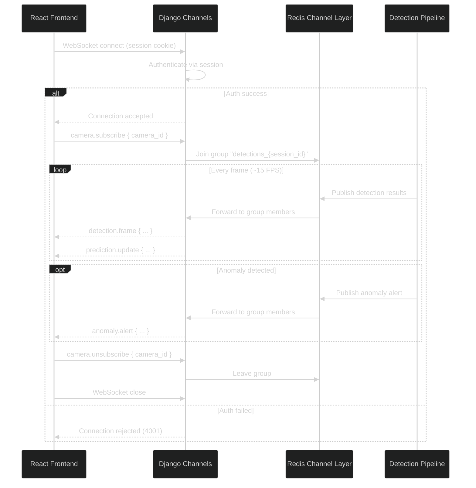

# API Contracts: WebSocket Channels

**Feature**: 001-exam-monitor-dashboard | **Date**: 2026-02-27

All WebSocket communication uses Django Channels over `wss://`. Messages are JSON-encoded
with a `type` field for routing. Authentication is via session cookie sent on handshake.

---

## Connection Endpoints

### Camera Feed: `wss://{host}/ws/cameras/{camera_id}/`

**Purpose**: Real-time camera feed status and connection events.
**Auth**: Session cookie (verified on connect).
**Channel Group**: `camera_{camera_id}`

### Detections: `wss://{host}/ws/detections/{session_id}/`

**Purpose**: Real-time detection frames, predictions, and bounding boxes (FR-019).
**Auth**: Session cookie. User must own the session OR be an admin observing it.
**Channel Group**: `detections_{session_id}`

### Anomalies: `wss://{host}/ws/anomalies/{session_id}/`

**Purpose**: Real-time anomaly alerts and triage status changes (FR-017, FR-067).
**Auth**: Session cookie. User must own the session OR be an admin. Admins can connect to any session's anomaly channel for observation.
**Channel Group**: `anomalies_{session_id}`

### Session Comments: `wss://{host}/ws/sessions/{session_id}/comments/`

**Purpose**: Real-time instructor/admin comment notifications (FR-058).
**Auth**: Session cookie. User must be assigned to the exam OR be an admin.
**Channel Group**: `comments_{session_id}`

### Admin Anomaly Feed: `wss://{host}/ws/admin/anomalies/`

**Purpose**: Unified real-time anomaly feed across all active sessions (FR-071). Shows high and medium severity anomalies from all sessions.
**Auth**: Session cookie. Admin role required.
**Channel Group**: `admin_anomaly_feed`

### Health: `wss://{host}/ws/health/`

**Purpose**: Real-time health metrics updates (FR-040).
**Auth**: Session cookie.
**Channel Group**: `health_dashboard`

---

## Message Types (Server → Client)

### `detection.frame`

Pushed for every processed frame on the camera feed. Contains all detections with bounding
boxes and tracking IDs.

```json
{
  "type": "detection.frame",
  "camera_id": "uuid",
  "timestamp": "2026-02-27T10:05:30.123Z",
  "frame_number": 450,
  "detections": [
    {
      "detection_class": "student",
      "confidence": 0.92,
      "bbox": [100, 150, 250, 400],
      "tracking_id": "S-0012"
    },
    {
      "detection_class": "teacher",
      "confidence": 0.88,
      "bbox": [500, 200, 700, 600],
      "tracking_id": null
    }
  ]
}
```

**Rate**: Up to 15 messages/second per camera (matching camera FPS).
**Consumer**: `DetectionConsumer` in `apps/detection/consumers.py`.

---

### `prediction.update`

Pushed alongside `detection.frame` with pyramid layer predictions for each tracked student.

```json
{
  "type": "prediction.update",
  "camera_id": "uuid",
  "timestamp": "2026-02-27T10:05:30.123Z",
  "predictions": [
    {
      "tracking_id": "S-0012",
      "posture": "sitting",
      "posture_confidence": 0.89,
      "horizontal_gaze": "left",
      "horizontal_gaze_confidence": 0.75,
      "depth_gaze": "forward",
      "depth_gaze_confidence": 0.82,
      "vertical_gaze": "down",
      "vertical_gaze_confidence": 0.71,
      "constraint_violation": false
    }
  ]
}
```

**Rate**: Same as `detection.frame` — one per processed frame.

---

### `anomaly.alert`

Pushed when the anomaly detection rule engine flags a behavioral anomaly (FR-017, FR-068).

```json
{
  "type": "anomaly.alert",
  "anomaly_id": "uuid",
  "tracking_id": "S-0012",
  "severity": "high",
  "description": "Student S-0012 looking left with turned posture for >30 seconds",
  "behavior_started_at": "2026-02-27T10:14:25.000Z",
  "behavior_ended_at": null,
  "camera_id": "uuid",
  "timestamp": "2026-02-27T10:15:00Z",
  "prediction_snapshot": {
    "posture": "sitting",
    "horizontal_gaze": "left",
    "depth_gaze": "forward",
    "vertical_gaze": "down"
  }
}
```

`behavior_ended_at` is `null` while the behavior is ongoing. Updated via `anomaly.behavior_end` when the behavior stops.

**Rate**: Event-driven (typically 0-5 per minute per camera).
**Channels**: Pushed to `anomalies_{session_id}` AND `admin_anomaly_feed` (if severity is high/medium).

---

### `anomaly.behavior_end`

Pushed when an ongoing anomaly behavior pattern ends (FR-068).

```json
{
  "type": "anomaly.behavior_end",
  "anomaly_id": "uuid",
  "behavior_ended_at": "2026-02-27T10:15:55.000Z"
}
```

---

### `anomaly.status_change`

Pushed when any user triages an anomaly (acknowledge, dismiss, annotate) or an admin reverts.

```json
{
  "type": "anomaly.status_change",
  "anomaly_id": "uuid",
  "new_status": "acknowledged",
  "changed_by": {
    "id": "user-uuid",
    "name": "Ahmed ElBamby",
    "role": "Instructor"
  },
  "dismissed_reason": null,
  "revert_reason": null,
  "changed_at": "2026-02-27T10:16:00Z"
}
```

When `new_status` is `"new"` and `revert_reason` is non-null, this indicates an admin revert (FR-066, FR-067). The frontend MUST display a notification: "Anomaly status reverted to 'New' by Admin [name] — Reason: [reason]".

---

### `comment.new`

Pushed when an instructor or admin adds a session comment (FR-058).

```json
{
  "type": "comment.new",
  "comment_id": "uuid",
  "session_id": "uuid",
  "camera_source_id": "uuid",
  "user": {
    "id": "uuid",
    "name": "Ahmed ElBamby",
    "role": "Instructor"
  },
  "content": "Student in row 3 appears nervous, fidgeting frequently",
  "created_at": "2026-02-27T10:25:00Z"
}
```

**Channels**: Pushed to `comments_{session_id}`. All instructors assigned to the exam and any observing admins receive this notification.

---

### `admin.anomaly_alert`

Pushed to the admin anomaly feed for high/medium severity anomalies across all sessions (FR-071).

```json
{
  "type": "admin.anomaly_alert",
  "anomaly_id": "uuid",
  "tracking_id": "S-0012",
  "severity": "high",
  "description": "Student S-0012 looking left with turned posture for >30 seconds",
  "exam": {
    "id": "uuid",
    "subject_name": "Data Structures",
    "subject_code": "CS201"
  },
  "session_id": "uuid",
  "instructor": {
    "id": "uuid",
    "first_name": "Ahmed",
    "last_name": "ElBamby"
  },
  "camera_id": "uuid",
  "timestamp": "2026-02-27T10:15:00Z"
}
```

**Channel**: `admin_anomaly_feed` only.
```

---

### `camera.status`

Pushed when a camera's connection status changes.

```json
{
  "type": "camera.status",
  "camera_id": "uuid",
  "status": "reconnecting",
  "retry_count": 2,
  "max_retries": 5,
  "message": "Camera connection lost. Reconnecting (attempt 2/5)..."
}
```

**Statuses**: `connected`, `disconnected`, `reconnecting`, `error`

---

### `health.update`

Pushed at regular intervals (≤10 seconds per FR-040).

```json
{
  "type": "health.update",
  "timestamp": "2026-02-27T10:30:00Z",
  "api_status": "up",
  "websocket": {
    "status": "up",
    "active_connections": 15
  },
  "detection_fps": {
    "camera-uuid-1": 24.5,
    "camera-uuid-2": 22.1
  },
  "storage": {
    "used_percent": 20.0,
    "warning_level": null
  },
  "active_sessions": 3
}
```

**Rate**: Every 10 seconds.

---

### `storage.warning`

Pushed when storage reaches warning thresholds (FR-031).

```json
{
  "type": "storage.warning",
  "level": "warning",
  "used_percent": 80.5,
  "message": "Storage usage at 80%. Consider downloading or deleting old recordings.",
  "timestamp": "2026-02-27T10:30:00Z"
}
```

**Levels**: `warning` (80%), `critical` (95%).

---

## Message Types (Client → Server)

### `filter.update`

Client sends filter preferences to control which detection classes are rendered.

```json
{
  "type": "filter.update",
  "camera_id": "uuid",
  "filters": {
    "show_students": true,
    "show_teachers": false,
    "show_bounding_boxes": true,
    "show_tracking_ids": true,
    "min_confidence": 0.5
  }
}
```

**Note**: Filters are applied client-side on the Canvas rendering loop. This message is
informational for server-side logging/analytics only. The server continues pushing all
detections regardless of filter state.

---

### `camera.subscribe`

Client subscribes to a specific camera's detection feed within a session.

```json
{
  "type": "camera.subscribe",
  "camera_id": "uuid"
}
```

---

### `camera.unsubscribe`

Client unsubscribes from a camera feed.

```json
{
  "type": "camera.unsubscribe",
  "camera_id": "uuid"
}
```

---

## Connection Lifecycle



---

## Error Handling

### Connection Errors

| Code | Meaning |
|------|---------|
| 4001 | Authentication failed — invalid or expired session |
| 4003 | Authorization failed — user does not own the session and is not an admin |
| 4004 | Resource not found — invalid camera_id or session_id |
| 4005 | Admin role required — non-admin attempted to connect to admin-only channel |

### Message Errors

Server sends error messages for invalid client requests:

```json
{
  "type": "error",
  "code": "INVALID_MESSAGE",
  "message": "Unknown message type: 'foo.bar'"
}
```

### Reconnection Strategy

Frontend `useWebSocket` hook implements automatic reconnection:
1. On unexpected disconnect: wait 1 second, then reconnect
2. Exponential backoff: 1s → 2s → 4s → 8s → 16s (max)
3. After 10 consecutive failures: show "Connection Lost" banner
4. On successful reconnect: re-subscribe to all active camera feeds
5. Health monitor: ping every 30 seconds, reconnect if no pong in 10 seconds
