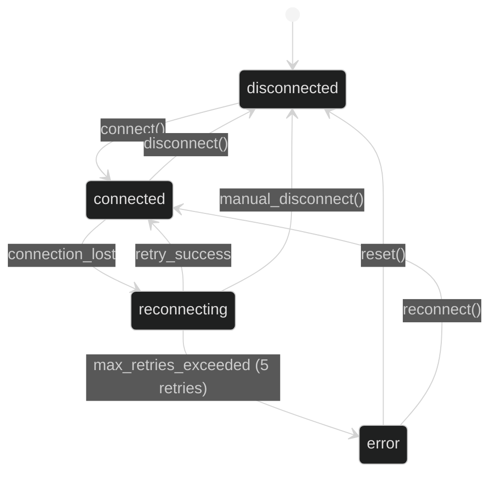
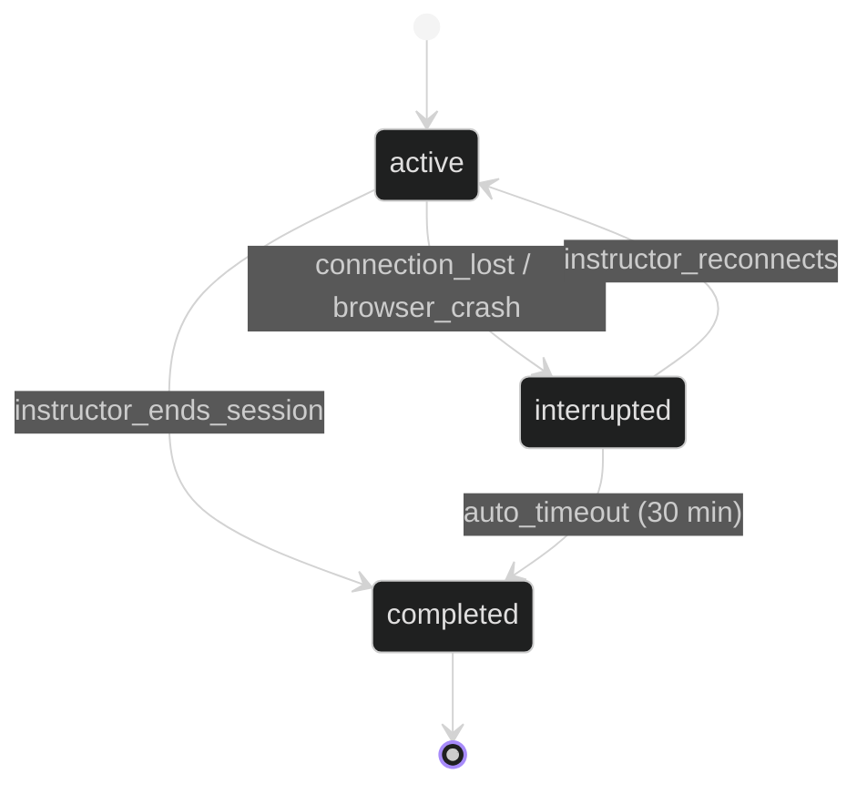
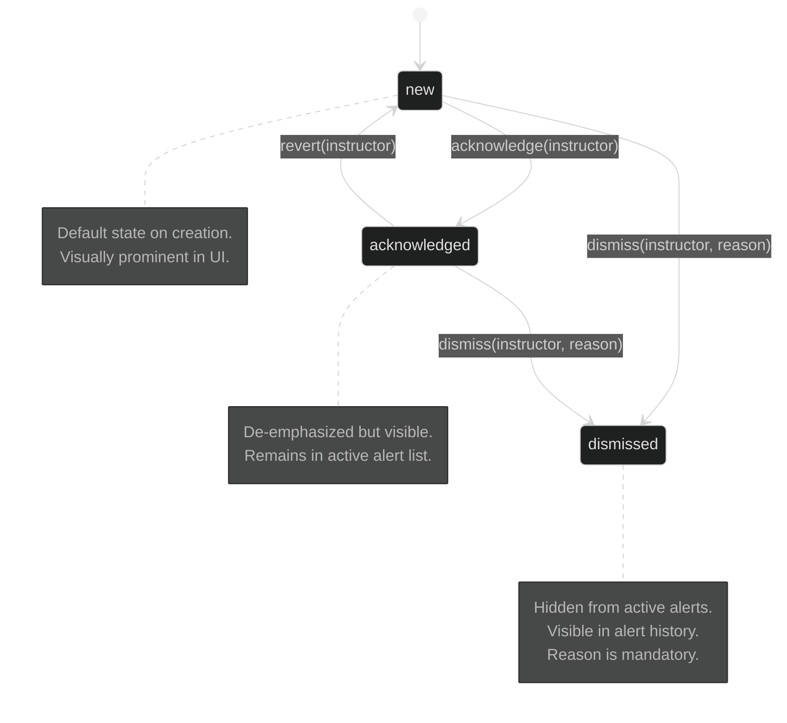
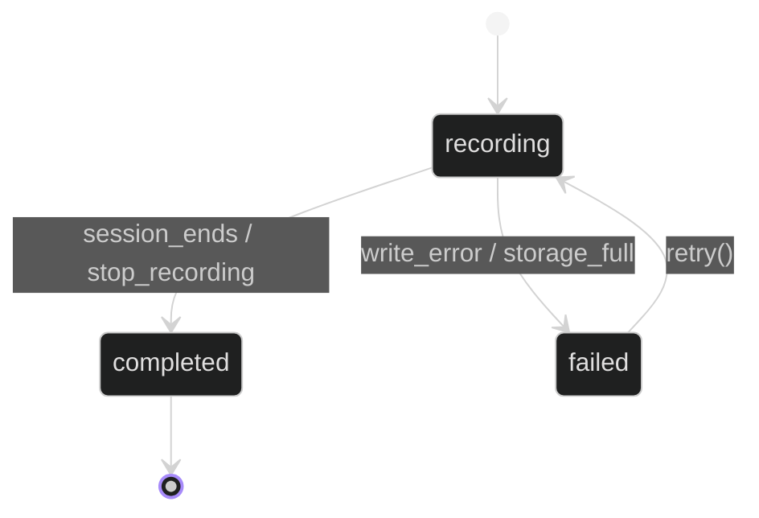

# Data Model: Exam Monitoring Dashboard

**Feature**: 001-exam-monitor-dashboard | **Date**: 2026-02-27
**Spec**: [spec.md](spec.md) | **Plan**: [plan.md](plan.md)

---

## Entity Relationship Diagram

```mermaid
%%{init: {'theme': 'dark', 'themeVariables': {'primaryColor': '#7C3AED', 'primaryTextColor': '#F5F5F5', 'lineColor': '#A78BFA', 'secondaryColor': '#1A1A2E', 'tertiaryColor': '#0D0D0D'}}}%%
erDiagram
    User ||--|| Role : "has"
    User ||--o{ MonitoringSession : "starts"
    User ||--o{ AuditLogEntry : "generates"
    User ||--o{ AnomalyNote : "authors"
    User ||--o{ AnomalyEvent : "triages"
    User ||--o{ SessionExport : "requests"
    User ||--o{ InstructorComment : "writes"
    Role ||--o{ User : "assigned_to"
    Room ||--o{ CameraSource : "houses"
    Room ||--o{ Exam : "hosts"
    Exam ||--o{ ExamStudent : "enrolls"
    Exam }o--o{ User : "assigned_instructors (M2M)"
    Exam ||--o{ MonitoringSession : "monitored_by"
    MonitoringSession }o--o{ Recording : "references (M2M)"
    MonitoringSession }o--o{ CameraSource : "uses"
    MonitoringSession ||--o{ InstructorComment : "contains"
    MonitoringSession ||--o{ SessionExport : "exported_as"
    CameraSource ||--o{ DetectionFrame : "captures"
    CameraSource ||--o{ Recording : "recorded_by (1 per camera)"
    CameraSource ||--o{ AnomalyEvent : "detected_on"
    DetectionFrame ||--o{ Detection : "contains"
    Detection ||--o| PyramidPrediction : "analyzed_by"
    Detection ||--o{ AnomalyEvent : "triggers"
    AnomalyEvent ||--o{ AnomalyNote : "annotated_with"

    User {
        uuid id PK
        string username UK "unique, indexed"
        string email UK "unique, indexed"
        string password_hash "PBKDF2"
        string first_name
        string last_name
        uuid role_id FK "→ Role"
        string theme_preference "black-purple|full-black|white"
        boolean must_change_password "default false"
        datetime created_at
        datetime last_login "nullable"
        boolean is_active "default true"
    }

    Role {
        uuid id PK
        string name UK "unique"
        string description
        jsonb permitted_pages "array of page identifiers"
        jsonb permitted_actions "array of action identifiers"
        boolean is_builtin "non-deletable if true"
        uuid created_by FK "nullable, → User"
        datetime created_at
        datetime updated_at
    }

    Room {
        uuid id PK
        string name "e.g. Hall A, Room 301"
        string building "optional"
        integer capacity "optional"
        uuid created_by FK "→ User (admin)"
        datetime created_at
        datetime updated_at
    }

    Exam {
        uuid id PK
        string subject_name
        string subject_type "midterm|final|quiz"
        string subject_code
        integer credit_hours
        integer expected_student_count
        uuid room_id FK "nullable → Room"
        datetime scheduled_start
        datetime scheduled_end
        integer duration_minutes
        string status "scheduled|active|completed"
        uuid created_by FK "→ User (admin)"
        datetime created_at
        datetime updated_at
    }

    ExamStudent {
        uuid id PK
        uuid exam_id FK "→ Exam"
        string student_name
        string university_id
        string seat_number "optional"
    }

    CameraSource {
        uuid id PK
        string name "user-assigned, ≤100 chars"
        string connection_type "rtsp|local|file"
        string connection_url "RTSP URL or device ID or file path"
        string status "connected|disconnected|reconnecting|error"
        integer resolution_width
        integer resolution_height
        float frame_rate
        uuid room_id FK "nullable → Room"
        uuid added_by FK "→ User"
        datetime created_at
        datetime updated_at
    }

    MonitoringSession {
        uuid id PK
        uuid user_id FK "→ User (instructor)"
        uuid exam_id FK "nullable → Exam"
        string status "active|completed|interrupted"
        datetime started_at
        datetime ended_at "nullable"
        jsonb camera_ids "array of CameraSource UUIDs"
        jsonb metadata "additional session config"
    }

    InstructorComment {
        uuid id PK
        uuid session_id FK "→ MonitoringSession"
        uuid camera_source_id FK "nullable → CameraSource"
        uuid user_id FK "→ User"
        text content "free-text"
        datetime created_at
    }

    DetectionFrame {
        bigint id PK "auto-increment, partitioned by date"
        uuid camera_source_id FK
        uuid session_id FK
        datetime timestamp "indexed, millisecond precision"
        integer frame_number
        string raw_frame_ref "file path or null for live-only"
        integer detection_count
    }

    Detection {
        bigint id PK
        bigint frame_id FK
        string detection_class "teacher|student"
        float confidence "0.0-1.0"
        integer bbox_x1 "top-left x"
        integer bbox_y1 "top-left y"
        integer bbox_x2 "bottom-right x"
        integer bbox_y2 "bottom-right y"
        string tracking_id "nullable, students only"
    }

    PyramidPrediction {
        bigint id PK
        bigint detection_id FK "one-to-one with student Detection"
        string tracking_id "indexed, matches Detection.tracking_id"
        string posture "standing|sitting|null"
        float posture_confidence "0.0-1.0"
        string horizontal_gaze "left|right|null"
        float horizontal_gaze_confidence
        string depth_gaze "forward|backward|null"
        float depth_gaze_confidence
        string vertical_gaze "up|down|null"
        float vertical_gaze_confidence
        boolean constraint_violation "true if mutually exclusive predictions detected"
        datetime timestamp
    }

    AnomalyEvent {
        uuid id PK
        string tracking_id "student tracking ID"
        string severity "high|medium|low"
        string description "behavioral description, ≤500 chars"
        datetime behavior_started_at "when behavior pattern began"
        datetime behavior_ended_at "nullable, null = ongoing"
        uuid camera_source_id FK "per-camera scope"
        bigint detection_id FK "nullable"
        string status "new|acknowledged|dismissed"
        string dismissed_reason "mandatory when dismissed, ≥5 chars"
        uuid status_changed_by FK "User who triaged"
        datetime status_changed_at
        jsonb prediction_snapshot "pyramid predictions at time of anomaly"
        datetime timestamp "indexed"
    }

    AnomalyNote {
        uuid id PK
        uuid anomaly_event_id FK
        uuid user_id FK "author"
        text content "free-text, ≥1 char"
        datetime created_at
    }

    Recording {
        uuid id PK
        uuid camera_source_id FK "per-camera, deduplicated"
        string video_file_path "raw video, no baked overlays"
        string format "mp4"
        string codec "h264"
        integer duration_seconds
        bigint file_size_bytes
        string status "recording|completed|failed"
        datetime started_at
        datetime ended_at "nullable"
    }

    AuditLogEntry {
        bigint id PK
        uuid user_id FK "nullable for system events"
        string action_type "see action type enum"
        string target_entity_type "nullable"
        string target_entity_id "nullable"
        jsonb details "action-specific metadata"
        string ip_address
        datetime timestamp "indexed"
    }

    SessionExport {
        uuid id PK
        uuid session_id FK "MonitoringSession"
        uuid user_id FK "requesting user"
        string status "pending|processing|completed|failed"
        smallint progress_percent "0-100"
        string file_path "nullable, path to ZIP"
        bigint file_size_bytes "nullable"
        text error_message "nullable"
        datetime created_at
        datetime completed_at "nullable"
    }
```



---

## Entity Details

### 1. User

**Purpose**: Single account entity for both instructors and admins. Extends Django's `AbstractUser`. Differentiated by assigned Role (no separate Admin table).

| Field | Type | Constraints | Notes |
|-------|------|-------------|-------|
| `id` | UUID | PK, auto-generated | Django UUIDField |
| `username` | String(150) | UNIQUE, NOT NULL, indexed | Used as login credential (along with email) |
| `email` | String(254) | UNIQUE, NOT NULL, indexed | Used as login credential (along with username) |
| `password_hash` | String(128) | NOT NULL | Django's built-in PBKDF2 hasher |
| `first_name` | String(150) | NOT NULL | |
| `last_name` | String(150) | NOT NULL | |
| `role_id` | UUID FK | NOT NULL | → Role. Determines page/action access |
| `theme_preference` | String(20) | NOT NULL, default: `black-purple` | Choices: `black-purple`, `full-black`, `white` |
| `created_at` | DateTime | auto_now_add | |
| `last_login` | DateTime | nullable | Updated on each successful login |
| `is_active` | Boolean | default: True | Soft delete / deactivation by admin |
| `must_change_password` | Boolean | NOT NULL, default: False | Set to True on admin password reset; cleared after user changes password |

**Validation Rules**:
- Username must be unique, non-empty, ≤150 characters
- When `must_change_password` is True, middleware redirects all requests to the password-change page until the user sets a new password
- Email must be valid format (Django EmailField validator)
- Login accepts either email or username — system resolves to User
- Password minimum 8 characters, at least 1 uppercase, 1 digit (Django password validators)
- Role must reference a valid Role record
- Theme preference must be one of the three valid themes
- First admin bootstrapped via CLI management command (`createsuperuser`)

---

### 2. Role

**Purpose**: Named permission set defining page-level and action-level access scope (FR-050–FR-053, R-014).

| Field | Type | Constraints | Notes |
|-------|------|-------------|-------|
| `id` | UUID | PK | |
| `name` | String(50) | UNIQUE, NOT NULL | e.g., "Admin", "Instructor", "Proctor" |
| `description` | Text | nullable | Human-readable description |
| `permitted_pages` | JSONField | NOT NULL | Array of page identifiers |
| `permitted_actions` | JSONField | NOT NULL | Array of action identifiers |
| `is_builtin` | Boolean | NOT NULL, default: False | True for Admin, Instructor (non-deletable) |
| `created_by` | UUID FK | nullable | → User (admin who created; null for seed data) |
| `created_at` | DateTime | auto_now_add | |
| `updated_at` | DateTime | auto_now | |

**Validation Rules**:
- Name must be unique and non-empty
- `permitted_pages` values must be from the page registry (see R-014)
- `permitted_actions` values must be from the action registry (see R-014)
- Built-in roles (`is_builtin=True`) cannot be deleted
- Role changes are logged in AuditLogEntry

**Seed Data** (created by migration):
- **Admin**: all pages, all actions, `is_builtin=True`
- **Instructor**: exam_board, camera_feed, predictions, sessions, recordings, health, profile; can_triage_anomalies, can_export_sessions, can_manage_cameras, can_add_comments; `is_builtin=True`

---

### 3. Room

**Purpose**: Physical exam location with registered cameras (R-016). Bridges camera ↔ exam relationship for auto-detection on session start (FR-056, FR-063).

| Field | Type | Constraints | Notes |
|-------|------|-------------|-------|
| `id` | UUID | PK | |
| `name` | String(100) | NOT NULL | e.g., "Hall A", "Room 301" |
| `building` | String(100) | nullable | Optional building identifier |
| `capacity` | Integer | nullable, positive | Optional seating capacity |
| `created_by` | UUID FK | NOT NULL | → User (admin) |
| `created_at` | DateTime | auto_now_add | |
| `updated_at` | DateTime | auto_now | |

**Validation Rules**:
- Name must be non-empty, ≤100 characters
- Capacity must be positive if provided
- Room management restricted to admin role

---

### 4. Exam

**Purpose**: Scheduled exam event with metadata, entered by admins (FR-054, FR-057, FR-063).

| Field | Type | Constraints | Notes |
|-------|------|-------------|-------|
| `id` | UUID | PK | |
| `subject_name` | String(200) | NOT NULL | |
| `subject_type` | String(20) | NOT NULL, choices | `midterm`, `final`, `quiz` |
| `subject_code` | String(50) | NOT NULL | |
| `credit_hours` | Integer | NOT NULL, positive | |
| `expected_student_count` | Integer | NOT NULL, ≥0 | |
| `room_id` | UUID FK | nullable, SET_NULL | → Room (nullable for incremental data entry) |
| `scheduled_start` | DateTime | NOT NULL | Exam start date/time |
| `scheduled_end` | DateTime | NOT NULL | Exam end date/time |
| `duration_minutes` | Integer | NOT NULL, positive | Exam duration |
| `status` | String(20) | NOT NULL, default: `scheduled` | `scheduled`, `active`, `completed` |
| `created_by` | UUID FK | NOT NULL | → User (admin) |
| `created_at` | DateTime | auto_now_add | |
| `updated_at` | DateTime | auto_now | |

**Many-to-Many**: `assigned_instructors` → User (via join table `exam_instructors`)

**Validation Rules**:
- `scheduled_end` must be after `scheduled_start`
- `duration_minutes` must be positive
- `expected_student_count` must be ≥0
- Only admins can create/edit exams (FR-057)
- Instructors view exams in read-only mode on Exam Board (FR-054)

**State Machine**:
```
scheduled → active (countdown reaches zero / "Start Now")
active → completed (exam end time reached / instructor ends session)
```

---

### 5. ExamStudent

**Purpose**: Student expected in a specific exam (roster), entered by admins (FR-057, FR-063).

| Field | Type | Constraints | Notes |
|-------|------|-------------|-------|
| `id` | UUID | PK | |
| `exam_id` | UUID FK | NOT NULL, CASCADE | → Exam |
| `student_name` | String(200) | NOT NULL | |
| `university_id` | String(50) | NOT NULL | University-assigned student ID |
| `seat_number` | String(20) | nullable | Optional seat/position identifier |

**Validation Rules**:
- `university_id` must be unique within the same exam (composite unique: exam_id + university_id)
- `student_name` must be non-empty

---

### 6. CameraSource

**Purpose**: A system-wide camera resource providing a video feed. Cameras are registered to rooms for exam-based auto-detection (R-016).

| Field | Type | Constraints | Notes |
|-------|------|-------------|-------|
| `id` | UUID | PK | |
| `name` | String(100) | NOT NULL | User-assigned camera name |
| `connection_type` | String(10) | NOT NULL, choices | `rtsp`, `local`, `file` |
| `connection_url` | String(500) | NOT NULL | RTSP URL, device ID, or file path |
| `status` | String(20) | NOT NULL, default: `disconnected` | See state machine below |
| `resolution_width` | Integer | nullable | Detected on connection |
| `resolution_height` | Integer | nullable | Detected on connection |
| `frame_rate` | Float | nullable | Detected on connection |
| `room_id` | UUID FK | nullable, SET_NULL | → Room (for room-based auto-detection) |
| `added_by` | UUID FK | NOT NULL, CASCADE | → User (who added the camera) |
| `created_at` | DateTime | auto_now_add | |
| `updated_at` | DateTime | auto_now | |

**Validation Rules**:
- RTSP URLs must match allowlist pattern: `rtsp://` prefix, validated via regex
- File paths sanitized against directory traversal (PathSanitizer)
- Name ≤100 characters, non-empty
- Maximum 8 cameras per instructor (enforced in service layer)

**State Machine**:



---

### 7. MonitoringSession

**Purpose**: Time-bounded period during which cameras are actively monitored/recorded. Per-instructor even when multiple instructors are assigned to the same exam (R-017).

| Field | Type | Constraints | Notes |
|-------|------|-------------|-------|
| `id` | UUID | PK | |
| `user_id` | UUID FK | NOT NULL, on_delete=CASCADE | → User (instructor) |
| `exam_id` | UUID FK | nullable, SET_NULL | → Exam (null for manual sessions) |
| `status` | String(20) | NOT NULL, default: `active` | See state machine below |
| `started_at` | DateTime | NOT NULL, auto_now_add | |
| `ended_at` | DateTime | nullable | Set on completion/interruption |
| `camera_ids` | JSONField | NOT NULL | Array of CameraSource UUIDs |
| `metadata` | JSONField | nullable | Additional session configuration |

**Validation Rules**:
- At least 1 camera must be associated
- Cannot start if instructor already has an active session
- `ended_at` must be after `started_at`

**State Machine**:



---

### 8. DetectionFrame

**Purpose**: Single processed video frame with detection results. High-volume table.

| Field | Type | Constraints | Notes |
|-------|------|-------------|-------|
| `id` | BigInt | PK, auto-increment | Partitioned by `timestamp` date |
| `camera_source_id` | UUID FK | NOT NULL, indexed | |
| `session_id` | UUID FK | NOT NULL, indexed | |
| `timestamp` | DateTime(6) | NOT NULL, indexed | Millisecond precision |
| `frame_number` | Integer | NOT NULL | Sequential within session |
| `raw_frame_ref` | String(500) | nullable | File path for recorded frames; null for live-only |
| `detection_count` | Integer | NOT NULL, default: 0 | Denormalized count for quick lookups |

**Partitioning**: Range partitioned by `timestamp` date for efficient querying and retention
management. Old partitions can be dropped without affecting active data.

**Indexes**: Composite index on `(camera_source_id, timestamp)` for playback queries.
Composite index on `(session_id, frame_number)` for sequential frame retrieval.

---

### 9. Detection

**Purpose**: Single entity detected in a frame (teacher or student).

| Field | Type | Constraints | Notes |
|-------|------|-------------|-------|
| `id` | BigInt | PK | |
| `frame_id` | BigInt FK | NOT NULL, indexed | |
| `detection_class` | String(10) | NOT NULL, choices | `teacher`, `student` |
| `confidence` | Float | NOT NULL, [0.0, 1.0] | Ultralytics confidence score |
| `bbox_x1` | Integer | NOT NULL, ≥0 | Top-left x coordinate (pixels) |
| `bbox_y1` | Integer | NOT NULL, ≥0 | Top-left y coordinate (pixels) |
| `bbox_x2` | Integer | NOT NULL | Bottom-right x coordinate (pixels) |
| `bbox_y2` | Integer | NOT NULL | Bottom-right y coordinate (pixels) |
| `tracking_id` | String(50) | nullable, indexed | Ultralytics BoT-SORT/ByteTrack ID. Students only. |

**Validation Rules**:
- `confidence` must be in [0.0, 1.0]
- `bbox_x2 > bbox_x1` and `bbox_y2 > bbox_y1`
- `tracking_id` is NULL for teacher detections, required for student detections
- Bounding box coordinates must be within frame resolution

---

### 10. PyramidPrediction

**Purpose**: Full pyramid layer predictions for a tracked student per frame.

| Field | Type | Constraints | Notes |
|-------|------|-------------|-------|
| `id` | BigInt | PK | |
| `detection_id` | BigInt FK | NOT NULL, UNIQUE (one-to-one) | Only for student detections |
| `tracking_id` | String(50) | NOT NULL, indexed | Matches Detection.tracking_id |
| `posture` | String(10) | nullable, choices | `standing`, `sitting` |
| `posture_confidence` | Float | nullable, [0.0, 1.0] | |
| `horizontal_gaze` | String(10) | nullable, choices | `left`, `right` |
| `horizontal_gaze_confidence` | Float | nullable, [0.0, 1.0] | |
| `depth_gaze` | String(10) | nullable, choices | `forward`, `backward` |
| `depth_gaze_confidence` | Float | nullable, [0.0, 1.0] | |
| `vertical_gaze` | String(10) | nullable, choices | `up`, `down` |
| `vertical_gaze_confidence` | Float | nullable, [0.0, 1.0] | |
| `constraint_violation` | Boolean | NOT NULL, default: False | Flag if mutually exclusive predictions detected |
| `timestamp` | DateTime(6) | NOT NULL, indexed | |

**Validation Rules**:
- Only one posture value active (standing XOR sitting)
- Only one horizontal gaze value active (left XOR right)
- Only one depth gaze value active (forward XOR backward)
- Only one vertical gaze value active (up XOR down)
- `constraint_violation` set to True if logical mutual exclusion would be violated (FR-020)
- Fields are nullable because a pyramid layer may fail or not produce a confident result

---

### 11. AnomalyEvent

**Purpose**: Flagged behavioral anomaly for a specific student. Anomaly events are **per-camera**, not per-session — when multiple instructors monitor the same camera, they see and can triage the same anomaly events. The associated recording is derived via `camera_source_id` + timestamp range (no direct recording FK). Includes behavior start/end timestamps per FR-068.

| Field | Type | Constraints | Notes |
|-------|------|-------------|-------|
| `id` | UUID | PK | |
| `tracking_id` | String(50) | NOT NULL, indexed | Student tracking ID |
| `severity` | String(10) | NOT NULL, choices | `high`, `medium`, `low` |
| `description` | String(500) | NOT NULL | Behavioral description |
| `behavior_started_at` | DateTime(6) | NOT NULL | When the behavior pattern began |
| `behavior_ended_at` | DateTime(6) | nullable | When behavior ended; null = ongoing |
| `camera_source_id` | UUID FK | NOT NULL | Source camera (per-camera scope) |
| `detection_id` | BigInt FK | nullable | Triggering detection, if available |
| `status` | String(20) | NOT NULL, default: `new` | See state machine below |
| `dismissed_reason` | Text | nullable | Mandatory when status=dismissed, ≥5 chars |
| `status_changed_by` | UUID FK | nullable | → User who triaged |
| `status_changed_at` | DateTime | nullable | When status was last changed |
| `prediction_snapshot` | JSONField | NOT NULL | Pyramid predictions at anomaly time |
| `timestamp` | DateTime(6) | NOT NULL, indexed | When anomaly was detected |

**Validation Rules**:
- `dismissed_reason` is mandatory (≥5 characters) when status changes to `dismissed`
- `dismissed_reason` must be null when status is `new` or `acknowledged`
- `status_changed_by` is required for any status change
- `severity` must be one of the three valid levels
- `description` must be non-empty, ≤500 characters

**State Machine**:



---

### 12. AnomalyNote

**Purpose**: Timestamped free-text annotation on an anomaly event (FR-043).

| Field | Type | Constraints | Notes |
|-------|------|-------------|-------|
| `id` | UUID | PK | |
| `anomaly_event_id` | UUID FK | NOT NULL, on_delete=CASCADE | |
| `user_id` | UUID FK | NOT NULL | → User (author) |
| `content` | Text | NOT NULL, ≥1 char | Free-text note |
| `created_at` | DateTime | NOT NULL, auto_now_add | |

**Validation Rules**:
- Content must be non-empty
- Any authenticated user can add notes regardless of anomaly status

---

### 13. Recording

**Purpose**: Stored video file with synchronized metadata for a session/camera.

| Field | Type | Constraints | Notes |
|-------|------|-------------|-------|
| `id` | UUID | PK | |
| `camera_source_id` | UUID FK | NOT NULL | Per-camera — deduplicated across sessions |
| `video_file_path` | String(500) | NOT NULL | Raw video, no overlays |
| `format` | String(10) | NOT NULL, default: `mp4` | |
| `codec` | String(10) | NOT NULL, default: `h264` | |
| `duration_seconds` | Integer | nullable | Computed on completion |
| `file_size_bytes` | BigInt | nullable | Computed on completion |
| `status` | String(20) | NOT NULL, default: `recording` | See state machine below |
| `started_at` | DateTime | NOT NULL | |
| `ended_at` | DateTime | nullable | Set on completion |

**Relationship**: Many-to-Many with MonitoringSession via Django `ManyToManyField`. Multiple sessions may reference the same recording. Recordings are per-camera (not per-session) — when multiple instructors monitor the same camera, only one recording is produced. The recording continues until the **last** session referencing it ends.

**Validation Rules**:
- `video_file_path` sanitized via PathSanitizer
- `duration_seconds` must be positive when set
- `file_size_bytes` must be positive when set
- One active recording per camera (enforced in service layer — check for existing active recording before creating)

**State Machine**:



---

### 14. AuditLogEntry

**Purpose**: Append-only security audit trail for all significant system events (Constitution Principle IV, FR-069–FR-073). Mutation is blocked at the ORM level — `save()` raises on existing PKs, `delete()` always raises.

| Field | Type | Constraints | Notes |
|-------|------|-------------|-------|
| `id` | BigInt | PK, auto-increment | |
| `user_id` | UUID FK | nullable | → User; null for system events |
| `action_type` | String(30) | NOT NULL, indexed | See action types enum |
| `target_entity_type` | String(30) | nullable | Entity type affected |
| `target_entity_id` | String(50) | nullable | UUID/ID of affected entity |
| `details` | JSONField | nullable | Action-specific metadata (PII redacted) |
| `ip_address` | GenericIPAddressField | nullable | Client IP from X-Forwarded-For |
| `timestamp` | DateTime | NOT NULL, auto_now_add, indexed | |

**Action Types** (StrEnum):
`login`, `logout`, `login_failed`, `account_create`, `account_edit`, `account_deactivate`,
`role_create`, `role_edit`, `role_assign`, `exam_create`, `exam_edit`,
`session_start`, `session_end`, `triage_acknowledge`, `triage_dismiss`, `triage_revert`,
`recording_access`, `recording_download`, `config_change`,
`anomaly_annotate`, `camera_add`, `camera_remove`, `export_session`

**Append-Only Enforcement**:
- Override `save()`: if `self.pk` and entry exists in DB → raise `ValueError`
- Override `delete()`: always raise `ValueError`
- Middleware captures auth events via Django signals (`user_logged_in`, `user_login_failed`, `user_logged_out`)
- Business events captured via explicit `AuditService.log()` calls in service layer

**Dual Capture Strategy**:
| Trigger | Mechanism | Example |
|---------|-----------|--------|
| Auth events | Django signals → middleware | login, logout, login_failed |
| Admin CRUD | Service layer calls | account_create, role_edit, exam_create |
| Session lifecycle | Service layer calls | session_start, session_end |
| Anomaly triage | Service layer calls | triage_acknowledge, triage_dismiss, triage_revert |

---

### 15. SessionExport

**Purpose**: Track asynchronous session archive export jobs (FR-047, FR-048). Each export produces a ZIP archive containing raw video recordings, detection/prediction data, anomaly events with triage status, and student tracking IDs — all non-anonymized per Clarification Round 2.

| Field | Type | Constraints | Notes |
|-------|------|-------------|-------|
| `id` | UUID | PK, default=uuid4 | |
| `session_id` | UUID FK | NOT NULL, indexed | → MonitoringSession |
| `user_id` | UUID FK | NOT NULL | → User (who requested export) |
| `status` | String(20) | NOT NULL, default='pending' | pending \| processing \| completed \| failed |
| `progress_percent` | SmallInt | default=0 | 0–100 |
| `file_path` | String(500) | nullable | Relative path to generated ZIP |
| `file_size_bytes` | BigInt | nullable | Size of export archive |
| `error_message` | Text | nullable | Error details if status=failed |
| `created_at` | DateTime | NOT NULL, auto_now_add | |
| `completed_at` | DateTime | nullable | Set when status becomes completed/failed |

**State Machine**:
```
pending → processing → completed
                   → failed
pending → failed (e.g., session not found after queue delay)
```

**Validation Rules**:
- Only one active export (pending/processing) per session at a time → 409 Conflict
- Completed exports are retained for configurable duration (default: 7 days) before cleanup

### 16. InstructorComment

**Purpose**: Free-text comment left by an instructor during a monitoring session, optionally linked to a specific camera (FR-058). Comments are timestamped and immutable after creation.

| Field | Type | Constraints | Notes |
|-------|------|-------------|-------|
| `id` | UUID | PK, default=uuid4 | |
| `session_id` | UUID FK | NOT NULL, on_delete=CASCADE | → MonitoringSession |
| `camera_source_id` | UUID FK | nullable, on_delete=SET_NULL | → CameraSource (optional context) |
| `user_id` | UUID FK | NOT NULL | → User (author) |
| `content` | Text | NOT NULL, ≥1 char, max 2000 | Comment text |
| `created_at` | DateTime | NOT NULL, auto_now_add | |

**Validation Rules**:
- Content must be non-empty, max 2000 characters
- Only instructors assigned to the exam can create comments
- Comments are immutable — no update or delete after creation
- Visible to all instructors monitoring the same exam

---

## Entity Relationships Summary

| Relationship | Type | Constraint |
|---|---|---|
| User → Role | Many-to-One | PROTECT on delete |
| Room → CameraSource | One-to-Many | SET_NULL on delete (camera.room_id nullable) |
| Room → Exam | One-to-Many | SET_NULL on delete (exam.room_id nullable) |
| Exam → ExamStudent | One-to-Many | CASCADE delete |
| Exam → User (M2M) | Many-to-Many | Via `exam_instructors` through table |
| Exam → MonitoringSession | One-to-Many | SET_NULL on delete |
| User → MonitoringSession | One-to-Many | CASCADE delete |
| User → CameraSource | One-to-Many (added_by) | SET_NULL on delete |
| User → AuditLogEntry | One-to-Many | SET_NULL on delete |
| User → AnomalyNote | One-to-Many | CASCADE delete |
| User → InstructorComment | One-to-Many | CASCADE delete |
| User → SessionExport | One-to-Many | CASCADE delete |
| MonitoringSession → CameraSource | Many-to-Many | Via JSONField (`camera_ids`) |
| MonitoringSession → Recording | Many-to-Many | Via Django M2M (`recordings` field). Shared: one recording per camera, referenced by multiple sessions. |
| MonitoringSession → InstructorComment | One-to-Many | CASCADE delete |
| MonitoringSession → SessionExport | One-to-Many | CASCADE delete |
| CameraSource → DetectionFrame | One-to-Many | CASCADE delete |
| CameraSource → Recording | One-to-Many | CASCADE delete. One active recording per camera (deduplicated). |
| CameraSource → AnomalyEvent | One-to-Many | CASCADE delete |
| DetectionFrame → Detection | One-to-Many | CASCADE delete |
| Detection → PyramidPrediction | One-to-One | CASCADE delete |
| Detection → AnomalyEvent | One-to-Many | SET_NULL on delete |
| AnomalyEvent → AnomalyNote | One-to-Many | CASCADE delete |
| MonitoringSession → DetectionFrame | One-to-Many (via session_id) | CASCADE delete |

---

## Indexes

| Table | Index | Type | Rationale |
|-------|-------|------|-----------|
| User | `email` | UNIQUE | Login lookup |
| User | `username` | UNIQUE | Login lookup |
| User | `role_id` | FK index | Role membership queries |
| Role | `name` | UNIQUE | Role lookup by name |
| Room | `name` | UNIQUE | Room lookup by name |
| Exam | `(room_id, scheduled_start)` | Composite | Room schedule conflict check |
| Exam | `(status, scheduled_start)` | Composite | Active/upcoming exam queries |
| ExamStudent | `(exam_id, university_id)` | UNIQUE Composite | One enrollment per student per exam |
| ExamStudent | `(exam_id, seat_number)` | UNIQUE Composite | No duplicate seats |
| CameraSource | `(room_id, status)` | Composite | Active cameras per room |
| CameraSource | `(added_by, status)` | Composite | Cameras added by user |
| MonitoringSession | `(exam_id, user_id)` | Composite | Sessions per exam per instructor |
| MonitoringSession | `(user_id, status)` | Composite | Active sessions per user |
| InstructorComment | `(session_id, created_at)` | Composite | Chronological comments per session |
| DetectionFrame | `(camera_source_id, timestamp)` | Composite | Playback queries |
| DetectionFrame | `(session_id, frame_number)` | Composite | Sequential frame retrieval |
| Detection | `(frame_id)` | FK index | Frame → detections join |
| Detection | `(tracking_id)` | B-tree | Student lookup across frames |
| PyramidPrediction | `(tracking_id, timestamp)` | Composite | Student prediction history |
| AnomalyEvent | `(camera_source_id, timestamp)` | Composite | Camera anomaly timeline |
| AnomalyEvent | `(status, timestamp)` | Composite | Active/dismissed filtering |
| AnomalyEvent | `(tracking_id)` | B-tree | Per-student anomaly lookup |
| Recording | `(camera_source_id, status)` | Composite | Active recording per camera lookup (deduplication) |
| AuditLogEntry | `(action_type, timestamp)` | Composite | Audit filtering |
| AuditLogEntry | `(user_id, timestamp)` | Composite | Per-user audit trail |
| SessionExport | `(session_id, status)` | Composite | Active export per session lookup |
| SessionExport | `(user_id, created_at)` | Composite | User export history |

---

## Data Retention

| Table | Retention Policy | Enforcement |
|-------|-----------------|-------------|
| User + Role | Never auto-deleted | Admin deactivation only (soft via `is_active`) |
| Room | Never auto-deleted | Admin manages lifecycle |
| Exam + ExamStudent | Never auto-deleted | Retained for academic record |
| MonitoringSession + InstructorComment | Never auto-deleted | Retained for historical reference |
| DetectionFrame + Detection + PyramidPrediction | Configurable (default: 90 days) | Celery periodic task drops old partitions |
| AnomalyEvent + AnomalyNote | Configurable (default: 365 days) | Celery periodic task with soft-delete |
| Recording (video files) | Configurable (default: 30 days) | Celery task deletes files, warns at 80%/95%. Admins can also manually delete completed recordings via `DELETE /api/v1/admin/recordings/{id}/` (FR-031). |
| AuditLogEntry | Configurable (default: 365 days) | Celery periodic task (oldest entries first) |
| SessionExport (ZIP files) | Configurable (default: 7 days) | Celery task deletes exported archives |
