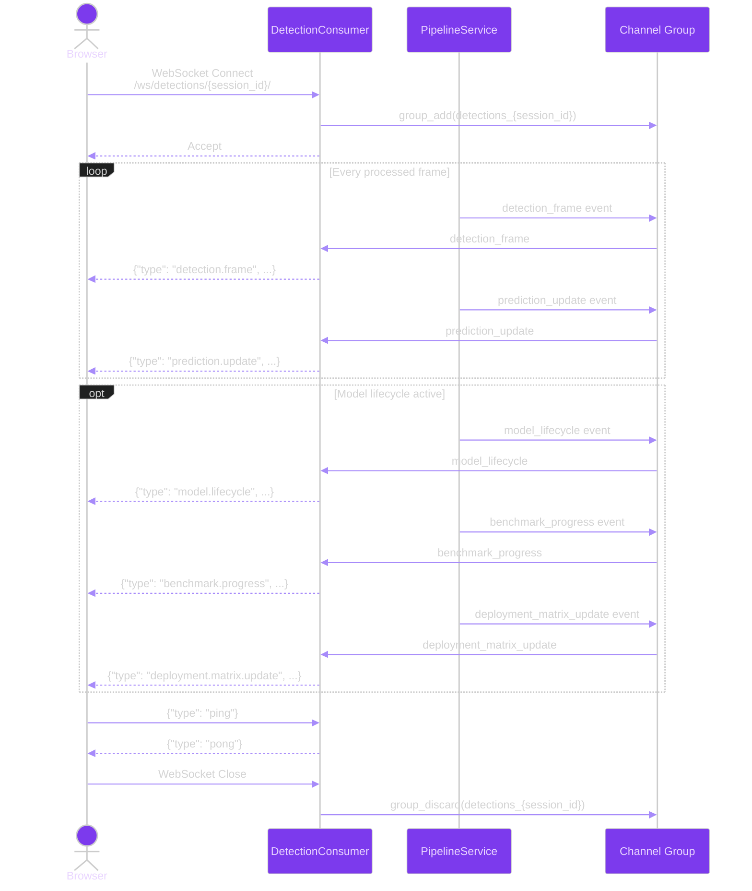

# WebSocket API Contracts: Student Behavior Detection Pyramid

**Branch**: `003-student-behavior-pyramid` | **Date**: 2026-04-24 | **Spec**: [../spec.md](../spec.md) | **Plan**: [../plan.md](../plan.md)

## Connection

**URL**: `ws://<host>/ws/detections/<session_id>/`
**Consumer**: `apps.detections.consumers.DetectionConsumer`
**Authentication**: Session cookie (validated during WebSocket handshake)
**Group**: `detections_{session_id}`

---

## Client → Server Messages

### Ping

Heartbeat to verify connection is alive.

```json
{
  "type": "ping"
}
```

**Response**:

```json
{
  "type": "pong"
}
```

---

## Server → Client Messages

### detection.frame

Sent when a new frame has been processed by the person detection layer. Contains all detections (both students and teachers) for the frame.

```json
{
  "type": "detection.frame",
  "frame_id": 1,
  "frame_number": 42,
  "camera_source_id": 3,
  "timestamp": "2026-04-24T10:30:00Z",
  "detection_count": 21,
  "detections": [
    {
      "id": 101,
      "detection_class": "student",
      "confidence": 0.95,
      "bbox_x1": 120,
      "bbox_y1": 200,
      "bbox_x2": 280,
      "bbox_y2": 500,
      "tracking_id": "S-001"
    },
    {
      "id": 102,
      "detection_class": "teacher",
      "confidence": 0.92,
      "bbox_x1": 500,
      "bbox_y1": 100,
      "bbox_x2": 650,
      "bbox_y2": 480,
      "tracking_id": null
    }
  ]
}
```

**Fields**:

| Field | Type | Description |
|-------|------|-------------|
| `type` | string | Always `"detection.frame"` |
| `frame_id` | int | Database ID of the DetectionFrame |
| `frame_number` | int | Sequential frame number |
| `camera_source_id` | int \| null | Camera source FK |
| `timestamp` | string (ISO 8601) | Frame capture time |
| `detection_count` | int | Total persons detected |
| `detections` | array | List of detection objects |
| `detections[].id` | int | Detection database ID |
| `detections[].detection_class` | string | `"student"` or `"teacher"` |
| `detections[].confidence` | float | Detection confidence [0, 1] |
| `detections[].bbox_x1` | int | Bounding box top-left X |
| `detections[].bbox_y1` | int | Bounding box top-left Y |
| `detections[].bbox_x2` | int | Bounding box bottom-right X |
| `detections[].bbox_y2` | int | Bounding box bottom-right Y |
| `detections[].tracking_id` | string \| null | Student tracking ID |

---

### prediction.update

Sent after all four behavior models have processed the cropped student images for a frame. Contains merged prediction records for all students in the frame.

```json
{
  "type": "prediction.update",
  "frame_id": 1,
  "frame_number": 42,
  "timestamp": "2026-04-24T10:30:01Z",
  "predictions": [
    {
      "tracking_id": "S-001",
      "detection_id": 101,
      "posture": "sitting",
      "posture_confidence": 0.93,
      "horizontal_gaze": "looking_left",
      "horizontal_gaze_confidence": 0.87,
      "depth_gaze": "looking_forward",
      "depth_gaze_confidence": 0.91,
      "vertical_gaze": "looking_down",
      "vertical_gaze_confidence": 0.85,
      "is_complete": true,
      "missing_models": [],
      "constraint_violation": false,
      "anomaly": null
    },
    {
      "tracking_id": "S-002",
      "detection_id": 103,
      "posture": "standing",
      "posture_confidence": 0.88,
      "horizontal_gaze": "",
      "horizontal_gaze_confidence": 0.0,
      "depth_gaze": "looking_backward",
      "depth_gaze_confidence": 0.76,
      "vertical_gaze": "looking_up",
      "vertical_gaze_confidence": 0.82,
      "is_complete": false,
      "missing_models": ["horizontal_gaze"],
      "constraint_violation": true,
      "anomaly": {
        "severity": "medium",
        "description": "Suspicious gaze pattern detected"
      }
    }
  ]
}
```

**Fields**:

| Field | Type | Description |
|-------|------|-------------|
| `type` | string | Always `"prediction.update"` |
| `frame_id` | int | Database ID of the DetectionFrame |
| `frame_number` | int | Sequential frame number |
| `timestamp` | string (ISO 8601) | Prediction creation time |
| `predictions` | array | List of merged prediction records |
| `predictions[].tracking_id` | string | Student tracking ID |
| `predictions[].detection_id` | int | Detection database ID |
| `predictions[].posture` | string | `"sitting"`, `"standing"`, or `""` (missing) |
| `predictions[].posture_confidence` | float | [0, 1] or 0.0 if missing |
| `predictions[].horizontal_gaze` | string | `"looking_left"`, `"looking_right"`, or `""` |
| `predictions[].horizontal_gaze_confidence` | float | [0, 1] or 0.0 if missing |
| `predictions[].depth_gaze` | string | `"looking_forward"`, `"looking_backward"`, or `""` |
| `predictions[].depth_gaze_confidence` | float | [0, 1] or 0.0 if missing |
| `predictions[].vertical_gaze` | string | `"looking_up"`, `"looking_down"`, or `""` |
| `predictions[].vertical_gaze_confidence` | float | [0, 1] or 0.0 if missing |
| `predictions[].is_complete` | bool | True if all 4 models succeeded |
| `predictions[].missing_models` | array\<string\> | Names of failed models |
| `predictions[].constraint_violation` | bool | Rule engine anomaly flag |
| `predictions[].anomaly` | object \| null | Anomaly details if flagged |

**Behavior on partial failure** (FR-014): When a model is unavailable or times out, the corresponding behavior field is set to an empty string `""`, the confidence is `0.0`, `is_complete` is `false`, and the model name appears in `missing_models`. The prediction is still sent — no data is discarded.

---

### model.lifecycle

Sent when model scan/export/benchmark orchestration status changes.

```json
{
  "type": "model.lifecycle",
  "phase": "inventory_scan",
  "status": "completed",
  "batch_id": "bench-20260429-001",
  "timestamp": "2026-04-29T12:00:00Z",
  "summary": {
    "scanned": 6,
    "queued_exports": 2,
    "incomplete_models": 0
  }
}
```

**Fields**:

| Field | Type | Description |
|-------|------|-------------|
| `type` | string | Always `"model.lifecycle"` |
| `phase` | string | `inventory_scan`, `export`, `benchmark`, `matrix_generation`, `completed` |
| `status` | string | `pending`, `running`, `completed`, `failed` |
| `batch_id` | string | Correlation ID for lifecycle execution |
| `timestamp` | string (ISO 8601) | Event timestamp |
| `summary` | object | Phase-specific counters and details |

---

### benchmark.progress

Sent during benchmark batch execution to provide progress and latest metric snapshot.

```json
{
  "type": "benchmark.progress",
  "batch_id": "bench-20260429-001",
  "run_id": 101,
  "model_family": "yolo12l",
  "format": "onnx",
  "target_platform": "cpu",
  "status": "running",
  "progress": 62,
  "timestamp": "2026-04-29T12:11:40Z"
}
```

---

### deployment.matrix.update

Sent when deployment matrix recommendations are generated or updated.

```json
{
  "type": "deployment.matrix.update",
  "batch_id": "bench-20260429-001",
  "timestamp": "2026-04-29T12:35:00Z",
  "recommendations": [
    {
      "model_family": "yolo12l",
      "platform": "cpu",
      "format": "onnx",
      "score": 0.91,
      "is_selected": true
    },
    {
      "model_family": "yolo12l",
      "platform": "nvidia_gpu",
      "format": "tensorrt",
      "score": 0.96,
      "is_selected": true
    }
  ]
}
```

---

### explainability.artifact

Sent when explainability or figure artifacts are generated and persisted.

```json
{
  "type": "explainability.artifact",
  "batch_id": "bench-20260429-001",
  "artifact_type": "grad_cam",
  "path": "/media/benchmarks/bench-20260429-001/gradcam-yolo12l-onnx-001.png",
  "timestamp": "2026-04-29T12:22:17Z"
}
```

---

## Connection Lifecycle



**Detailed explanation of the connection lifecycle diagram above**: This sequence diagram shows the WebSocket connection lifecycle between a browser client and the `DetectionConsumer`. The **Client** (browser) initiates a WebSocket connection to `/ws/detections/{session_id}/`. The **DetectionConsumer** adds itself to the channel group `detections_{session_id}` and accepts the connection. During an active monitoring session, the **PipelineService** sends two types of events through the channel group for every processed frame: first a `detection_frame` event containing all person detections (students and teachers with bounding boxes), then a `prediction_update` event containing merged behavior predictions for students only. These events are forwarded by the consumer to the connected client as JSON messages. The client can send `ping` messages at any time to verify the connection is alive; the consumer responds with `pong`. When the client disconnects (closes the WebSocket), the consumer removes itself from the channel group, stopping further event delivery.

## Related Documents

- [../spec.md](../spec.md) — Feature specification
- [../plan.md](../plan.md) — Implementation plan
- [../data-model.md](../data-model.md) — Data model definitions
- [rest-api.md](rest-api.md) — REST API endpoint contracts
- [../../../.specify/memory/constitution.md](../../../.specify/memory/constitution.md) — Project governance
