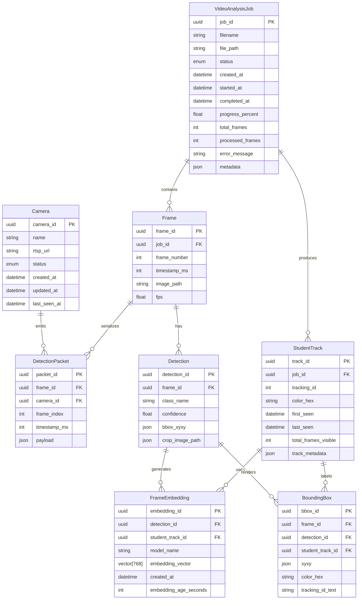
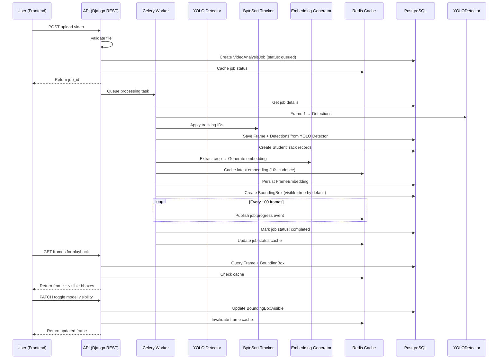

# Data Model: Unified Video Analytics Overlay Pipeline

**Feature**: 004-video-upload-inference-tab  
**Date**: 2026-04-30  
**Status**: Phase 1 design  

## Entity Relationship Diagram



**ER Diagram Explanation**:
- **Camera** is the root entity for RTSP monitoring and stores connection metadata and health state.
- **VideoAnalysisJob** is the root entity for uploaded video analysis requests.
- **Frame** represents individual frames extracted from an uploaded video and linked to the job.
- **DetectionPacket** is the shared frame-level payload used for both live RTSP broadcasts and uploaded-video playback synchronization.
- **Detection** represents object detections found in each frame via the configured inference pipeline.
- **FrameEmbedding** stores embedding vectors for detected students, generated every 10 seconds or on-demand for re-identification.
- **StudentTrack** represents a persistent student identity across multiple frames, maintaining tracking ID, assigned color, and temporal bounds.
- **BoundingBox** is the renderable overlay combining detection, tracking ID, and color for UI display.

---

## Core Entities

### Camera

**Purpose**: Represents a registered RTSP source and its operational state.

**Fields**:
- `camera_id` (UUID, PK): Unique identifier for the camera.
- `name` (string): Human-readable camera name.
- `rtsp_url` (string): RTSP stream URL.
- `status` (enum): Current camera state such as `online`, `reconnecting`, `unhealthy`, or `offline`.
- `created_at` (datetime): Registration timestamp.
- `updated_at` (datetime): Last configuration update.
- `last_seen_at` (datetime, nullable): Last successful frame ingestion time.

**Relationships**:
- Has many `DetectionPacket` records for live stream output.

**Storage**:
- **Primary**: PostgreSQL.

---

### VideoAnalysisJob

**Purpose**: Represents a single uploaded video analysis request.

**Fields**:
- `job_id` (UUID, PK): Unique identifier for this analysis job.
- `filename` (string): Original file name (e.g., "classroom-session-2026-04-30.mp4").
- `file_path` (string): Path to stored video file on local filesystem (e.g., `/data/videos/job_{job_id}/input.mp4`). Per Q1 clarification: local filesystem storage at `/data/videos/` with 30-day retention lifecycle.
- `status` (enum): One of `queued`, `processing`, `embedding`, `completed`, `completed_partial`, `failed`. Per Q4 clarification: `completed_partial` indicates job completed but some processing components failed; see `component_failures` field for details.
- `created_at` (datetime): Job creation timestamp.
- `started_at` (datetime): Processing start timestamp.
- `completed_at` (datetime): Processing completion timestamp.
- `progress_percent` (float): 0-100% completion; updated as frames are processed.
- `total_frames` (int): Total frames in video (calculated on upload).
- `processed_frames` (int): Frames processed so far.
- `error_message` (string, nullable): Error details if status is `failed` or `completed_partial`.
- `component_failures` (JSON, nullable): Per Q4 clarification - Component-level failure details for `completed_partial` status. Tracks GRANULAR component-level failures: `{ "frame_extraction": null, "detection": null, "tracking": null, "embedding": "timeout after 5min", "reid": null, "rendering": null }`. Each key represents a pipeline stage; null value = stage succeeded; string value = failure reason. Enables targeted diagnostics and partial recovery.
- `metadata` (JSON): Extensible metadata (video duration, FPS, resolution, upload source, uploader_id for audit trail).

**Validations**:
- `filename` must match pattern: `^[\w\s\-\.]+\.mp4$`
- `file_path` must be accessible and readable.
- `status` must be one of the enum values.
- `progress_percent` must be 0-100.
- `processed_frames` <= `total_frames`.
- `component_failures` (if present) must have keys matching component names and values matching failure descriptions or null.

**Relationships**:
- Has many `Frame` records (one per extracted frame).
- Has many `StudentTrack` records (one per unique student detected).

**Storage**:
- **Primary**: PostgreSQL (schema: `video_analysis_job`).
- **Cache**: Redis key: `job:{job_id}:status` with TTL 24 hours.

---

### DetectionPacket

**Purpose**: Shared frame-level detection payload for RTSP live streams and uploaded-video playback.

**Fields**:
- `packet_id` (UUID, PK): Unique identifier for this payload.
- `frame_id` (UUID, FK, nullable): Link to uploaded-video frame when applicable.
- `camera_id` (UUID, FK, nullable): Link to RTSP camera when applicable.
- `frame_index` (int): Zero-based frame index for playback sync.
- `timestamp_ms` (int): Presentation timestamp in milliseconds.
- `payload` (json): Detection array using full-frame coordinates, tracking IDs, labels, and source-model metadata.

**Validations**:
- `frame_index` must be non-negative for uploaded playback.
- `timestamp_ms` must be non-negative.
- `payload` must include detections with full-frame coordinates.
- Exactly one of `frame_id` or `camera_id` SHOULD be populated depending on the source mode.

**Relationships**:
- Belongs to `Frame` for uploaded-video playback.
- Belongs to `Camera` for RTSP live output.

**Storage**:
- **Primary**: PostgreSQL.
- **Cache**: Redis pub/sub for live delivery.

---

### Frame

**Purpose**: Represents a single video frame extracted from a VideoAnalysisJob.

**Fields**:
- `frame_id` (UUID, PK): Unique identifier for this frame.
- `job_id` (UUID, FK): Foreign key to VideoAnalysisJob.
- `frame_number` (int): Sequential frame number (0-indexed).
- `timestamp_ms` (int): Timestamp in milliseconds from video start.
- `image_path` (string): Path to stored frame image (for rendering).
- `fps` (float): Frames per second of the video.

**Validations**:
- `frame_number` must be >= 0.
- `timestamp_ms` must be >= 0.
- `image_path` must be accessible.
- `fps` must be > 0.

**Relationships**:
- Belongs to `VideoAnalysisJob`.
- Has many `Detection` records (one per detected object in frame).
- Has many `BoundingBox` records (rendering data).

**Storage**:
- **Primary**: PostgreSQL (schema: `frame`).
- **Frames**: Stored as PNG/JPEG on disk or S3; referenced by path.

---

### Detection

**Purpose**: Represents a single YOLO detection result (person bounding box) in a frame.

**Fields**:
- `detection_id` (UUID, PK): Unique identifier for this detection.
- `frame_id` (UUID, FK): Foreign key to Frame.
- `class_name` (string): Object class (e.g., "person", "student", "teacher").
- `confidence` (float): Confidence score (0-1).
- `bbox_xyxy` (JSON): Bounding box in [x1, y1, x2, y2] format (pixel coordinates).
- `crop_image_path` (string, nullable): Path to cropped student ROI for behavioral analysis.

**Validations**:
- `class_name` must be one of: `person` (generic), `student`, `teacher`.
- `confidence` must be 0-1.
- `bbox_xyxy` must be array of 4 numbers; x2 > x1, y2 > y1.
- `crop_image_path` must be accessible if provided.

**Relationships**:
- Belongs to `Frame`.
- Has one `FrameEmbedding` (generated asynchronously).
- Has one `BoundingBox` (rendering).

**Storage**:
- **Primary**: PostgreSQL (schema: `detection`).
- **Cropped ROI**: Stored on disk or S3.

---

### StudentTrack

**Purpose**: Represents a unique student identity across multiple frames (tracking persistence).

**Fields**:
- `track_id` (UUID, PK): Unique identifier for this student track.
- `job_id` (UUID, FK): Foreign key to VideoAnalysisJob.
- `tracking_id` (int): Numeric tracking ID assigned by ByteSort tracker.
- `color_hex` (string): Hex color assigned to this student for consistent rendering across ALL frames and ALL models (e.g., "#FF5733"). This single color is applied to all 5 possible bounding boxes from different models (person detection, sitting/standing, attention, hand-raise, etc.) for visual clarity and student identification.
- `first_seen` (datetime): First frame where this student appeared.
- `last_seen` (datetime): Most recent frame where this student appeared.
- `total_frames_visible` (int): Total count of frames containing this student.
- `track_metadata` (JSON): Extensible metadata (re-id confidence, re-entry count, occlusion events).

**Validations**:
- `tracking_id` must be >= 0.
- `color_hex` must match pattern `^#[0-9A-Fa-f]{6}$`.
- `color_hex` must be unique within its VideoAnalysisJob (database constraint: `UNIQUE(job_id, color_hex)`). No two students in the same uploaded video shall share the same color.
- `last_seen` >= `first_seen`.
- `total_frames_visible` >= 1.

**Relationships**:
- Belongs to `VideoAnalysisJob`.
- Has many `FrameEmbedding` records (used for re-ID).
- Associated with multiple `BoundingBox` records (can have up to 5 per frame, one from each model).

**Storage**:
- **Primary**: PostgreSQL (schema: `student_track` with `UNIQUE(job_id, color_hex)` constraint).
- **Cache**: Redis key: `track:{track_id}:metadata` with TTL 1 hour.

**Design Note — Color Uniqueness**:
Each StudentTrack color_hex must be unique within its VideoAnalysisJob. During track initialization, assign color via deterministic hash: `color_index = hash(job_id, tracking_id) % PALETTE_SIZE`. This ensures:
1. Same student ID always gets same color (reproducibility)
2. No two students in the same video get the same color (uniqueness)
3. Color remains constant across frames and reruns for same video

---

### FrameEmbedding

**Purpose**: Stores embedding vectors for detected students, used for re-identification.

**Fields**:
- `embedding_id` (UUID, PK): Unique identifier for this embedding.
- `detection_id` (UUID, FK): Foreign key to Detection.
- `student_track_id` (UUID, FK): Foreign key to StudentTrack (may be NULL initially, populated during re-ID).
- `model_name` (string): Model used to generate embedding (e.g., "yolo-reid", "resnet50").
- `embedding_vector` (vector[768]): Fixed-size embedding vector (768 dimensions for configured YOLO re-id model).
- `created_at` (datetime): Embedding generation timestamp.
- `embedding_age_seconds` (int): Seconds since student's `first_seen`; 0 = first embedding for this student.

**Validations**:
- `embedding_vector` must have exactly 768 elements (or configurable dimension).
- `model_name` must be non-empty.
- `embedding_age_seconds` >= 0.

**Relationships**:
- Belongs to `Detection`.
- Belongs to `StudentTrack` (optional, populated by re-ID pipeline).

**Storage**:
- **Primary**: PostgreSQL (schema: `frame_embedding`).
- **Cache**: Redis key: `embedding:{student_track_id}:latest` stores most recent embedding; TTL 10 minutes (refresh cadence).
- **Batch**: Periodic Redis → PostgreSQL persist job (every 1 hour).

**Index**:
- `(student_track_id, created_at)`: Enables efficient retrieval of latest embedding for re-ID.

---

### BoundingBox

**Purpose**: Renderable overlay data combining detection, tracking, and visibility state. A single student can have up to 5 BoundingBox records per frame (one from each model: person detection, sitting/standing, attention tracking, hand-raising, etc.), and ALL must render with the same `color_hex` from the parent StudentTrack.

**Fields**:
- `bbox_id` (UUID, PK): Unique identifier for this bounding box.
- `frame_id` (UUID, FK): Foreign key to Frame.
- `detection_id` (UUID, FK): Foreign key to Detection.
- `student_track_id` (UUID, FK): Foreign key to StudentTrack.
- `model_name` (string): Source model for this detection (e.g., "person_detection", "sitting_standing", "attention_tracking", "hand_raising").
- `xyxy` (JSON): Bounding box in [x1, y1, x2, y2] format.
- `color_hex` (string): Assigned color for this student's box; inherited from StudentTrack. All 5 boxes for the same student in the same frame use this color.
- `tracking_id_text` (string): Text label for tracking ID (e.g., "ID: 5").

**Design Note (Multi-Model Color Consistency)**:
- When rendering frame N for student S, if detections from models M1, M2, M3, M4, M5 all detect student S:
    - All 5 BoundingBox records will have the same `color_hex` (from StudentTrack).
    - Each box includes `model_name` to identify which model produced it.
    - **Visibility filtering is NOT stored in BoundingBox**: Instead, visibility state is cached in Redis (`job:{job_id}:visibility` with user's current model selections). When fetching frames, application layer filters BoundingBox records by current visibility state.
    - If user toggles a model off, the box is filtered out (not rendered); if toggled back on, the same box reappears with the same color.

**Validations**:
- `xyxy` must be array of 4 numbers.
- `color_hex` must match pattern `^#[0-9A-Fa-f]{6}$` and MUST match the color from the linked StudentTrack record.
- `tracking_id_text` must be non-empty.
- `model_name` must be one of: "person_detection", "sitting_standing", "attention_tracking", "hand_raising", or future model names.

**Relationships**:
- Belongs to `Frame`.
- Belongs to `Detection`.
- Belongs to `StudentTrack`.

**Storage**:
- **Primary**: PostgreSQL (schema: `bounding_box`).
- **Cache**: Redis key: `frame:{frame_id}:bboxes` stores list of visible bboxes; TTL 1 hour.

---

### Detection Packet Shape

For both RTSP and uploaded-video playback, the shared `payload` field uses this shape:

```json
{
    "frame_index": 123,
    "timestamp_ms": 4100,
    "camera_id": "cam_1",
    "detections": [
        {
            "id": "track_7",
            "parent_id": "vehicle_3",
            "source_model": "model_3",
            "label": "license_plate",
            "confidence": 0.94,
            "bbox": {
                "x1": 100,
                "y1": 200,
                "x2": 180,
                "y2": 240
            }
        }
    ]
}
```

This contract keeps the frontend overlay implementation identical for live streams and uploaded playback.

---

## Data Flow Diagram



**Data Flow Explanation**:
1. User uploads .mp4 via REST API.
2. API validates file and creates `VideoAnalysisJob` in PostgreSQL; status cached in Redis.
3. Celery worker dequeues the job and processes frames sequentially.
4. For each frame: run YOLO detection → apply ByteSort tracking → extract embeddings.
5. Embeddings cached in Redis (10-second refresh) and periodically persisted to PostgreSQL.
6. BoundingBox records created with visibility toggles; stored in PostgreSQL and Redis.
7. Job progress published to frontend via WebSocket or polling.
8. On completion, user queries frames; API returns Frame + visible BoundingBox data.
9. User toggles model visibility via PATCH; API updates visibility state and invalidates caches.

---

## Cross-References

- **[research.md](research.md)**: R1-R10 design decisions driving this data model.
- **[contracts/upload.md](contracts/upload.md)**: API payload format for job creation.
- **[contracts/status.md](contracts/status.md)**: WebSocket event schema for job updates.
- **[contracts/overlay.md](contracts/overlay.md)**: PATCH request for visibility toggles.
- **[quickstart.md](quickstart.md)**: How to query and visualize this data.
