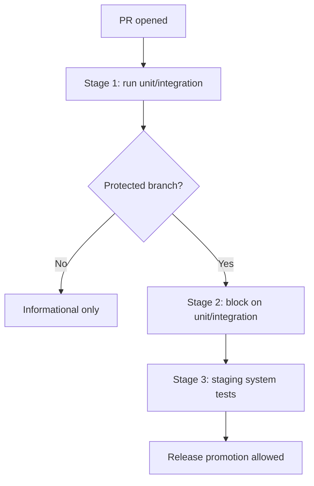

# Contract: CI/Test Gates

## Related Documents

- [../spec.md](../spec.md)
- [../plan.md](../plan.md)
- [../research.md](../research.md)
- [../data-model.md](../data-model.md)
- [../quickstart.md](../quickstart.md)
- [../tasks.md](../tasks.md)

## Gate Flow

This flow makes the staged gating policy explicit: every pull request gets test execution, but only protected branches enforce blocking gates and release promotion checks. The structure matches the current no-pipeline starting point and the phased rollout described in the spec.

## Purpose

Define phased CI adoption and release-gating behavior from current no-pipeline baseline.

## Stage 1: Bootstrap (Informational)

- Trigger unit + integration test runs on each PR.
- Publish pass/fail and coverage results.
- Do not block merges yet.

## Stage 2: Blocking Merge Gates

- Unit + integration test failures block merge.
- Coverage threshold enforced per agreed baseline.
- Failed checks require fix before merge.

## Stage 3: Release Promotion Gates

- System tests run in staging environment.
- Release promotion blocked on staging system-test failure.
- Manual approval step may be required per branch policy.

## Required Evidence Per Stage

- Test report artifacts.
- Coverage report artifact.
- Traceable run ID and commit SHA.

## Non-Compliance Handling

- Gate failures prevent merge/release depending on stage.
- Override, if ever allowed, must be explicit and audited.
