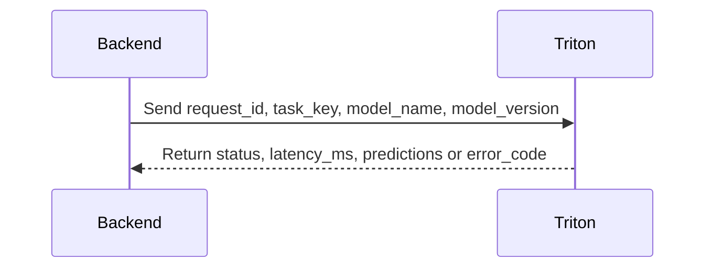

# Contract: Triton Inference Interface

## Related Documents

- [../spec.md](../spec.md)
- [../plan.md](../plan.md)
- [../research.md](../research.md)
- [../data-model.md](../data-model.md)
- [../quickstart.md](../quickstart.md)
- [../tasks.md](../tasks.md)

## Contract Interaction Flow

The sequence shows the minimum contract that must hold for every inference request. The backend sends routing and tensor metadata, and Triton returns either normalized predictions or a structured error payload.

## Purpose

Define the stable contract between backend inference orchestration and Triton model serving.

## Request Contract

- Transport: HTTP or gRPC over internal network.
- Required fields:
  - `request_id` (string)
  - `task_key` (string)
  - `model_name` (string, semantic name)
  - `model_version` (string, `vN` format)
  - `input_tensor` metadata (`shape`, `dtype`)
  - `timeout_ms` (integer)

## Response Contract

- Required fields:
  - `request_id` (string)
  - `status` (`ok|timeout|error`)
  - `latency_ms` (number)
  - `model_name` (string)
  - `model_version` (string)
- Conditional fields:
  - `predictions` required when `status=ok`
  - `error_code` required when `status!=ok`

## Behavioral Rules

- Backend validates tensor shape/dtype before sending request.
- Backend must fail fast on unresolved model route config.
- Backend must return graceful service error when Triton unavailable.
- Model naming convention: `model_name:vN`.

## Versioning Policy

- Contract changes are backward-compatible within a minor version.
- Breaking changes require new contract revision and migration notes.
