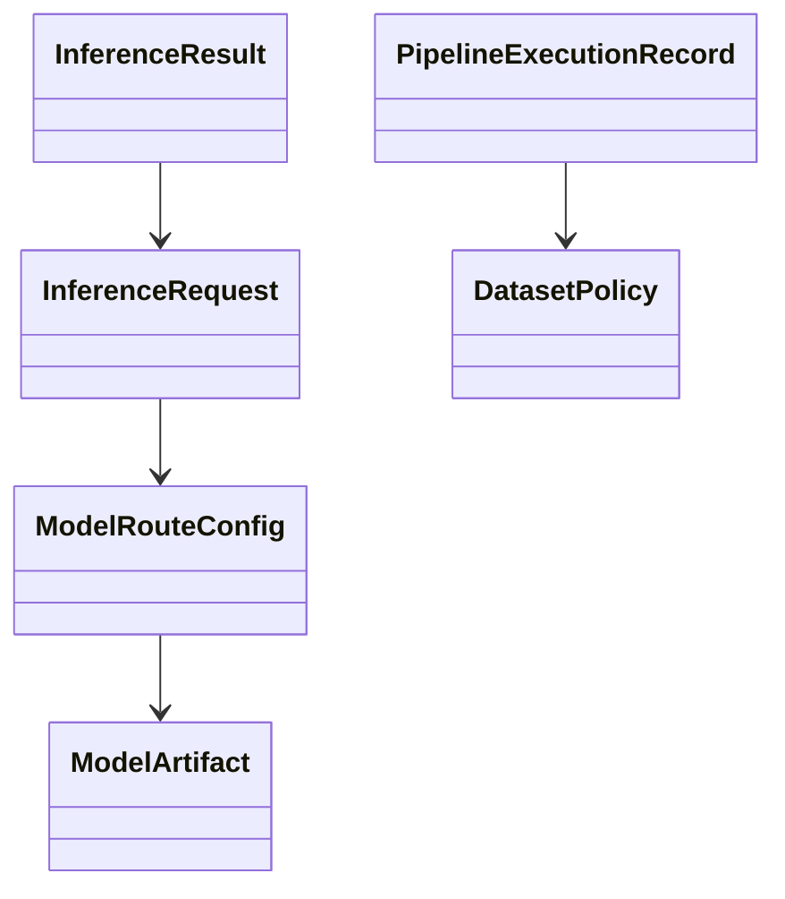

# Data Model - Architecture Refactoring & Triton Transition

## Related Documents

- [spec.md](spec.md)
- [plan.md](plan.md)
- [research.md](research.md)
- [quickstart.md](quickstart.md)
- [tasks.md](tasks.md)

## Entity Relationship Diagram

This class-style diagram shows the main entities and how they depend on one another.

The serving path flows from route configuration to a model artifact, then from request to result. The execution record and dataset policy entities sit beside the runtime path because they govern how tests and releases may use real raw data without allowing it into production.

## Entities

### 1. ModelArtifact

- Purpose: Represents a deployable model in the Triton repository.
- Fields:
  - `id` (string): stable logical identifier (`standing_sitting`).
  - `version` (string): explicit version tag (`v1`, `v2`).
  - `runtime` (enum): `onnxruntime`, `openvino`, other supported backend.
  - `repository_path` (string): filesystem path to model files.
  - `status` (enum): `inactive`, `warming`, `active`, `deprecated`.
  - `checksum` (string): artifact integrity check value.
- Validation Rules:
  - `id` must be kebab/snake compatible and unique per model family.
  - `version` must match `^v[0-9]+(\.[0-9]+)?$`.
  - `status=active` allowed for at most one production-serving default per model family.

### 2. ModelRouteConfig

- Purpose: Maps logical inference intent to concrete model/version.
- Fields:
  - `task_key` (string): logical task name (`posture_detection`).
  - `model_id` (string): references `ModelArtifact.id`.
  - `model_version` (string): references `ModelArtifact.version`.
  - `environment` (enum): `dev`, `staging`, `prod`.
  - `rollout_percent` (integer): optional weighted rollout.
- Validation Rules:
  - `environment=prod` route must reference approved versions.
  - rollout percentages for same `task_key`+`environment` sum to 100.

### 3. InferenceRequest

- Purpose: Encapsulates a frame/batch inference call from backend to Triton.
- Fields:
  - `request_id` (uuid/string)
  - `task_key` (string)
  - `payload_ref` (string): frame/batch reference.
  - `shape` (array[int])
  - `dtype` (string)
  - `timeout_ms` (int)
  - `requested_at` (datetime)
- Validation Rules:
  - `timeout_ms` > 0 and <= configured max.
  - `shape` and `dtype` must match resolved model contract.

### 4. InferenceResult

- Purpose: Stores normalized inference response metadata.
- Fields:
  - `request_id` (string)
  - `model_id` (string)
  - `model_version` (string)
  - `latency_ms` (number)
  - `predictions` (json/object)
  - `served_at` (datetime)
  - `status` (enum): `ok`, `timeout`, `error`
  - `error_code` (nullable string)
- Validation Rules:
  - `status=ok` requires non-empty `predictions`.
  - `status!=ok` requires `error_code`.

### 5. PipelineExecutionRecord

- Purpose: Traceability for unit/integration/system execution runs.
- Fields:
  - `run_id` (string)
  - `phase` (enum): `bootstrap`, `blocking`, `staging-system`
  - `suite` (enum): `unit`, `integration`, `system`
  - `result` (enum): `pass`, `fail`, `skipped`
  - `coverage_pct` (nullable number)
  - `duration_sec` (number)
  - `executed_at` (datetime)
- Validation Rules:
  - blocking phase cannot mark deploy-ready when unit/integration fail.

### 6. DatasetPolicy

- Purpose: Governs where real raw test video data can reside.
- Fields:
  - `policy_id` (string)
  - `allowed_environments` (set): must include only `dev`/`test`.
  - `forbidden_environments` (set): must include `prod`.
  - `retention_days` (int or nullable)
  - `enforced_by` (string): process/tool owner.
- Validation Rules:
  - `prod` must always be in `forbidden_environments`.
  - raw dataset mount/copy operation to prod is invalid.

## Relationships

- `ModelRouteConfig` -> `ModelArtifact` (many-to-one).
- `InferenceRequest` -> `ModelRouteConfig` (resolved at runtime by `task_key` + `environment`).
- `InferenceResult` -> `InferenceRequest` (one-to-one logical mapping).
- `PipelineExecutionRecord` independent but linked by CI run context.
- `DatasetPolicy` applies globally and constrains test/system workflow execution.

## State Transitions

### ModelArtifact
- `inactive` -> `warming` -> `active` -> `deprecated`
- Invalid transition: `deprecated` -> `active` without re-registration workflow.

### InferenceResult
- `pending` (implicit runtime state) -> `ok|timeout|error`
- terminal states only (`ok`, `timeout`, `error`).

### PipelineExecutionRecord (release readiness)
- `bootstrap` (informational) -> `blocking` (merge gate) -> `staging-system` (release gate)
