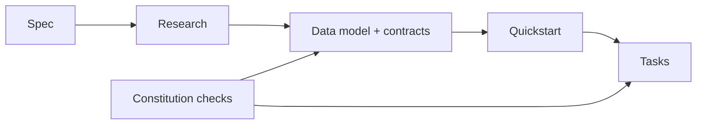

# Implementation Plan: Architecture Refactoring & Triton Transition

**Branch**: `005-architecture-refactoring` | **Date**: 2026-05-07 | **Spec**: `/specs/005-architecture-refactoring/spec.md`
**Input**: Feature specification from `/specs/005-architecture-refactoring/spec.md`

## Summary

Refactor backend inference into modular components and transition model serving to Triton with a hybrid deployment model: Docker in development/test and native Linux (non-Docker) in production. In parallel, bootstrap a phased CI pipeline, enforce constitution-aligned test gates, produce architecture/data-flow/deployment diagrams, and keep raw video test datasets restricted to development/test environments only.

## Related Documents

- [spec.md](spec.md)
- [research.md](research.md)
- [data-model.md](data-model.md)
- [quickstart.md](quickstart.md)
- [tasks.md](tasks.md)
- [contracts/triton-inference-contract.md](contracts/triton-inference-contract.md)
- [contracts/deployment-topology-contract.md](contracts/deployment-topology-contract.md)
- [contracts/ci-test-gates-contract.md](contracts/ci-test-gates-contract.md)

## Phase Map

This flowchart shows how the plan turns the spec into implementation-ready tasks.



The flow starts with the approved specification, then moves through research, design artifacts, and quickstart validation before the task list is generated. Constitution checks influence both design artifacts and task generation because they govern what counts as complete and compliant for this feature.

## Technical Context

**Language/Version**: Python 3.11-3.12 (backend), TypeScript 5.9 (frontend)  
**Primary Dependencies**: Django 5.1, DRF, Celery, Redis, Pydantic v2, ONNX/ONNXRuntime/OpenVINO, React 19, Vite 7  
**Storage**: PostgreSQL + Redis + filesystem model repository + dev-only raw video dataset  
**Testing**: pytest, pytest-django, pytest-cov, pytest-asyncio, Vitest, Playwright  
**Target Platform**: Linux servers; development workstations with Docker available  
**Project Type**: Web application with backend services and frontend dashboard  
**Performance Goals**: Inference latency target <500ms per standard frame; no more than 10% regression versus current baseline  
**Constraints**: Dev uses Triton in Docker; production uses native Linux Triton service (no Docker); raw video test datasets are forbidden in production; internal-network-only service access  
**Scale/Scope**: Up to 10,000+ concurrent inference requests (infrastructure dependent), modular backend spanning cameras/detections/tracking/analysis/exports

## Constitution Check

*GATE: Must pass before Phase 0 research. Re-check after Phase 1 design.*

### Pre-Design Gate Review

- **Supreme Directive Gate**: PASS (acknowledged for implementation stage). The plan includes documentation artifacts, contracts, and explicit diagram scope; implementation tasks will enforce per-change documentation and commit discipline, plus diagram/cross-link verification.
- **Test-in-Loop Gate**: PASS. Testing strategy explicitly requires unit + integration + system tests defined before implementation in each task slice, and protected-branch delivery remains blocked until all three test phases pass.
- **Code Quality Excellence (I)**: PASS. Plan enforces modular boundaries, dependency injection, explicit interfaces, and configuration externalization.
- **Security Standards (IV)**: PASS. Internal-network-only exposure, no hardcoded secrets, and dev-only raw dataset boundary are included.
- **Performance Requirements (VI)**: PASS. Latency and scaling targets captured; observability and readiness checks included.
- **Goal-Driven Execution (XI)**: PASS. Success criteria and phased verification gates are explicit.

## Project Structure

### Documentation (this feature)

```text
specs/005-architecture-refactoring/
├── plan.md
├── research.md
├── data-model.md
├── quickstart.md
├── contracts/
│   ├── triton-inference-contract.md
│   ├── deployment-topology-contract.md
│   └── ci-test-gates-contract.md
└── tasks.md                # Generated later by /speckit.tasks
```

### Source Code (repository root)

```text
backend/
├── apps/
│   ├── cameras/
│   ├── detections/
│   ├── tracking/
│   ├── video_analysis/
│   ├── exports/
│   └── pipeline/
├── config/
│   └── settings/
├── core/
├── tests/
│   ├── unit/
│   ├── integration/
│   ├── system/
│   └── contract/
└── models/

frontend/
├── src/
└── tests/

docs/
├── backend/
└── frontend/
```

**Structure Decision**: Keep existing monorepo web-app structure and add feature-specific contracts under `specs/005-architecture-refactoring/contracts/`. Backend refactor remains within `backend/apps/*` plus `backend/core` orchestration boundaries.

## Phase Plan

### Phase 0 - Research

1. Confirm Triton deployment strategy (dev Docker vs prod native Linux service).
2. Confirm model naming/versioning pattern and rollback strategy.
3. Confirm phased CI bootstrap from zero pipelines to blocking gates.
4. Confirm observability baseline (Prometheus + OpenTelemetry + runbooks).
5. Confirm data governance boundary for dev-only raw datasets.

Output: `research.md` with decision/rationale/alternatives for each item.

### Phase 1 - Design & Contracts

1. Define data model entities and state transitions for inference/test/governance artifacts.
2. Define external interface contracts for inference requests, deployment topology, and CI gates.
3. Define a quickstart workflow for local dev bootstrap and pre-production validation.
4. Update agent context with finalized stack and constraints.

Outputs: `data-model.md`, `contracts/*`, `quickstart.md`, updated agent context file.

### Phase 2 - Task Planning (next command)

Translate this plan into dependency-ordered implementation tasks with explicit Test-in-Loop checkpoints.

## Post-Design Constitution Re-Check

- **Supreme Directive Gate**: PASS. Plan artifacts include documentation-first outputs and explicit contract docs.
- **Test-in-Loop Gate**: PASS. CI and testing contracts explicitly define pre-implementation tests and staged enforcement.
- **Security/Data Governance Gate**: PASS. Contract and data model enforce dev-only raw dataset; production exclusion is explicit.
- **Simplicity/Surgical Changes Gates (IX/X)**: PASS. Plan keeps current repo structure and limits changes to targeted modules.

## Complexity Tracking

No constitution violations require exceptional justification at planning stage.
