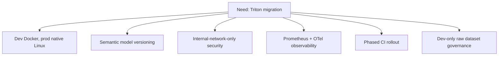

# Research - Architecture Refactoring & Triton Transition

## Related Documents

- [spec.md](spec.md)
- [plan.md](plan.md)
- [data-model.md](data-model.md)
- [quickstart.md](quickstart.md)
- [tasks.md](tasks.md)

## Decision Flow

This flowchart summarizes how the core research decisions narrow the implementation shape.

The diagram shows that deployment, naming, security, observability, CI, and data governance are all coordinated responses to the same engineering need: reducing technical debt while preserving reliability and control.

## Decision 1: Triton Deployment Topology

- Decision: Use Docker-based Triton in development and native Linux Triton service (no Docker) in production.
- Rationale: Docker in development improves reproducibility and onboarding; native production service improves host-level control, simplifies operations in current infrastructure, and aligns with the explicit constraint.
- Alternatives considered:
  - Docker in both dev and prod: rejected because production requirement explicitly forbids Docker for Triton.
  - Native in both dev and prod: rejected due to lower local reproducibility and slower setup.

## Decision 2: Model Identity & Versioning

- Decision: Semantic naming with explicit versions (`model_name:vN`) and deterministic mapping from logical model alias to deployed Triton model/version.
- Rationale: Human-readable, rollback-friendly, and compatible with Triton model repository conventions.
- Alternatives considered:
  - Opaque hash-only model IDs: rejected due to reduced operational readability.
  - Single mutable model version: rejected due to rollback and audit limitations.

## Decision 3: Service-to-Service Security Posture

- Decision: Internal-network-only exposure (VPC/ACL/firewall boundary) as the primary security mechanism.
- Rationale: Matches clarified requirement; minimizes complexity while constraining attack surface to trusted network segments.
- Alternatives considered:
  - mTLS everywhere: deferred due to current complexity/cost tradeoff.
  - token-based auth between internal services: deferred, possible future hardening step.

## Decision 4: Observability Baseline

- Decision: Prometheus metrics + OpenTelemetry tracing + alerting runbooks.
- Rationale: Provides latency/error visibility across backend and Triton with actionable operational response.
- Alternatives considered:
  - logs-only observability: rejected because it does not provide sufficient latency and dependency visibility.
  - vendor-managed APM only: deferred due to lock-in and cost concerns.

## Decision 5: CI/CD Rollout from Zero Baseline

- Decision: Three-stage rollout: (1) bootstrap CI runs for unit/integration, (2) enforce blocking gates for unit/integration, (3) run system tests in staging before release promotion.
- Rationale: Current project has no pipeline; phased rollout minimizes delivery disruption while increasing confidence.
- Alternatives considered:
  - immediate hard-gating for all tests: rejected due to likely initial instability and throughput impact.
  - remain manual-only testing: rejected as incompatible with scale and quality targets.

## Decision 6: Raw Dataset Governance

- Decision: Real raw video test datasets are development/test-only and forbidden from production hosts.
- Rationale: Reduces privacy/security exposure and aligns with explicit user constraint.
- Alternatives considered:
  - production retention for debug replay: rejected due to governance and exposure risk.
  - no raw data in dev either: rejected because full system validation requires real dataset coverage.

## Resolved Clarifications

All previously open planning clarifications are resolved:
- Security model: internal network boundary.
- Model naming/versioning: semantic + explicit version.
- Observability: Prometheus + OTel + runbooks.
- CI/CD baseline: no existing pipeline; phased adoption.
- Data location policy: raw dataset dev-only, never production.
- Deployment split: Triton Docker in dev, native Linux in production.

## Cross-References

- [spec.md](spec.md)
- [plan.md](plan.md)
- [data-model.md](data-model.md)
- [quickstart.md](quickstart.md)
- [tasks.md](tasks.md)
