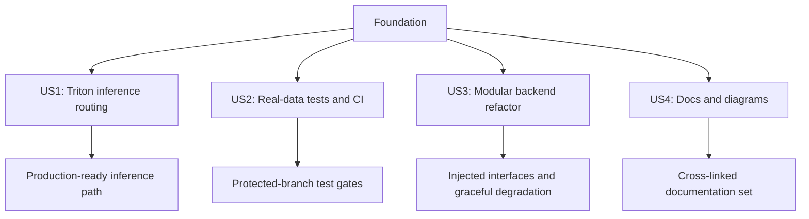

# Feature Specification: Architecture Refactoring & Technical Debt Reduction

**Feature Branch**: `005-architecture-refactoring`  
**Created**: 2026-05-07  
**Status**: Draft  
**Input**: User description: "We have a high technical debt in this project, we need more flexible modular design specifically that we will transit to integrate and use Triton server for Model serving to the backend, we need enhancing the Diagrams details, Fully covering Tests for each feature (Unit tests, Integration tests, System Full Test) using the real models and real raw data. Adding more features, Scaling, Improvements are getting harder to integrate and test."

## Clarifications

### Session 2026-05-07

- Q: Preferred security posture for service-to-service access and model-serving endpoints? → A: Option A (Internal network only - VPC/ACLs)
- Q: Preferred model identity/versioning convention? → A: Option A (Semantic names + version tags, e.g., `standing_sitting:v1`)
- Q: Preferred monitoring/observability approach? → A: Option D (Prometheus + tracing + alerting runbook)
- Q: CI/CD test gating policy? → A: No existing CI/CD pipeline yet; adopt phased rollout (bootstrap CI first, then enforce blocking gates).
- Q: Where may raw video test datasets exist? → A: Dev environment only; not on production servers.

## Related Documents

- [plan.md](plan.md)
- [research.md](research.md)
- [data-model.md](data-model.md)
- [quickstart.md](quickstart.md)
- [tasks.md](tasks.md)
- [contracts/triton-inference-contract.md](contracts/triton-inference-contract.md)
- [contracts/deployment-topology-contract.md](contracts/deployment-topology-contract.md)
- [contracts/ci-test-gates-contract.md](contracts/ci-test-gates-contract.md)

## Feature Flow

This flowchart shows the major delivery slices and how they depend on the shared foundation.

The diagram emphasizes that the feature is not a single monolithic change. Instead, a shared foundation enables four independently testable slices: Triton routing, real-data testing and CI, modular refactoring, and documentation updates. The final nodes represent the concrete outcomes that each slice must produce before the feature can be considered ready for implementation.

## User Scenarios & Testing *(mandatory)*

### User Story 1 - Transition Model Inference to Triton Server (Priority: P1)

As a DevOps/ML Engineer, I need to transition the model inference backend from direct model loading to NVIDIA Triton Server so that we can scale model serving independently, support multiple model versions, and enable flexible model deployment strategies without modifying backend code.

**Why this priority**: This is the foundational architectural change that enables modularity and scalability. All other improvements depend on this being in place. It directly unblocks future model management, A/B testing, and production scaling needs.

**Independent Test**: Can be fully tested by deploying Triton Server, running inference requests through the backend, and verifying results match the original direct-inference approach. Delivers immediate benefit by enabling dynamic model management without backend redeployment.

**Acceptance Scenarios**:

1. **Given** Triton Server is running with loaded models (standing_sitting, student_teacher, etc.), **When** backend receives a video frame analysis request, **Then** the request is routed to Triton Server and results are returned matching the expected inference output.

2. **Given** multiple model versions are deployed in Triton, **When** backend receives inference requests, **Then** the correct model version is used based on deployment configuration without backend code changes.

3. **Given** Triton Server is unavailable, **When** backend receives a video analysis request, **Then** a graceful error is returned with appropriate logging and monitoring alerts.

4. **Given** model inference response times are tracked, **When** inference requests are processed through Triton, **Then** response times are within acceptable bounds (< 500ms for standard frame analysis).

---

### User Story 2 - Establish Comprehensive Test Suite with Real Data (Priority: P1)

As a Software Engineer, I need a comprehensive test suite using real models and raw data (from all behavior categories: arguing, eating, hand-raising, writing, etc.) so that we can confidently verify feature behavior, catch regressions early, and ensure quality before production deployment.

**Why this priority**: Testing is critical for reducing technical debt and preventing regressions as features are added. Without comprehensive tests using real data, adding features becomes risky and time-consuming. This enables continuous integration and reduces manual testing burden.

**Independent Test**: Can be fully tested by running the complete test suite against real video data and models in dev/test environments, verifying that all unit, integration, and system tests pass, and that coverage metrics meet or exceed thresholds (e.g., >80% code coverage).

**Acceptance Scenarios**:

1. **Given** unit tests are written for core components (detection, tracking, analysis), **When** tests are executed, **Then** >85% of component code is covered and all tests pass.

2. **Given** integration tests exist for major workflows (video upload, analysis, result storage), **When** tests are executed with real sample videos, **Then** all workflows complete successfully and produce expected outputs.

3. **Given** system tests exercise end-to-end functionality with various student behavior scenarios (arguing, eating, hand-raising, etc.), **When** complete workflows are executed, **Then** results are correct and performance meets thresholds.

4. **Given** a feature is modified or added, **When** the test suite is executed, **Then** any regressions are detected before manual QA.

5. **Given** test data from each behavior category exists (Arguing, Diverse, Eating, Hand-Raise, etc.), **When** tests are executed, **Then** coverage spans all common scenarios and edge cases.

---

### User Story 3 - Implement Modular Backend Architecture (Priority: P2)

As a Backend Developer, I need a more flexible and modular backend architecture so that I can develop and test features independently, integrate new components without affecting existing code, and make architectural changes without cascading rewrites.

**Why this priority**: Modularity is essential for reducing technical debt and making future development faster. While Triton integration (P1) is the immediate architectural focus, this story addresses the broader refactoring needed to support independent feature development and testing.

**Independent Test**: Can be fully tested by verifying that key backend components (cameras, detections, tracking, analysis, exports) are loosely coupled, can be tested independently, and new components can be added without modifying existing business logic.

**Acceptance Scenarios**:

1. **Given** backend services are architected as independent modules, **When** a new detection model is integrated, **Then** only the detection module requires changes and other modules remain unaffected.

2. **Given** data dependencies between modules are clearly defined, **When** modules are tested independently, **Then** each module can be unit tested without full system dependencies.

3. **Given** configuration is externalized and environment-specific, **When** deploying to development/staging/production, **Then** no code changes are required only configuration updates.

4. **Given** interfaces between modules are well-defined, **When** multiple engineers work on different modules, **Then** integration conflicts are minimal and parallel development is supported.

---

### User Story 4 - Create/Enhance System Diagrams and Architecture Documentation (Priority: P2)

As a Contributor/Stakeholder, I need clear, detailed architecture diagrams and documentation so that I can understand the system design, onboard new team members faster, and make informed architectural decisions.

**Why this priority**: While not blocking development, comprehensive documentation accelerates onboarding and enables better architectural decisions. This should be updated in parallel with the architectural changes (P1, P2) to keep documentation current.

**Independent Test**: Can be fully tested by reviewing diagram quality, verifying that all major components and their relationships are documented, and confirming that documentation is accurate relative to the actual codebase.

**Acceptance Scenarios**:

1. **Given** system architecture diagrams are created, **When** diagrams are reviewed, **Then** all major components (backend, frontend, model serving, databases, external services) and their relationships are clearly shown.

2. **Given** data flow diagrams are documented, **When** a developer follows the diagrams, **Then** they can trace data flow end-to-end from user input to output without ambiguity.

3. **Given** deployment architecture is diagrammed, **When** new team members review the diagram, **Then** they understand how services are deployed and communicate.

4. **Given** documentation is updated with each architectural change, **When** documentation is reviewed alongside code, **Then** they accurately reflect current implementation.

---

### Edge Cases

- What happens when a new model needs to be deployed to Triton while the system is serving inference requests?
- How does the system handle partial test data failures (e.g., corrupted video files or missing model files)?
- What occurs when Triton Server configuration is invalid or models fail to load during startup?
- How are stale or incompatible cached inference results handled after a model update?
- What is the behavior if different modules have conflicting dependency versions after refactoring?
- How does the system prevent accidental transfer of raw test videos from development to production environments?

## Requirements *(mandatory)*

### Functional Requirements

#### Triton Server Integration
- **FR-001**: Backend MUST support routing inference requests to NVIDIA Triton Server instead of direct model loading
- **FR-002**: Backend MUST gracefully handle Triton Server unavailability with appropriate error messages and logging
- **FR-003**: System MUST support multiple model versions concurrently in Triton Server
- **FR-004**: System MUST allow model configuration changes (model selection, version, batch size) without code redeployment
- **FR-005**: Backend MUST monitor and report Triton Server health status

- **FR-020**: System MUST restrict service-to-service access to internal network isolation (VPC/ACLs) as the primary mechanism for protecting model-serving and backend endpoints. (Clarified: internal network isolation chosen over mTLS/token auth.)

- **FR-021**: System MUST adopt a semantic model naming convention with explicit version tags (format: `model_name:v<version>`) and use configuration mapping to resolve logical model names to deployed Triton model names.

#### Test Suite Implementation
- **FR-006**: System MUST have unit tests for all core components with >85% code coverage
- **FR-007**: System MUST have integration tests for major workflows (video upload, analysis, result storage)
- **FR-008**: System MUST include system tests covering end-to-end behavior using real models and diverse video data
- **FR-009**: Test suite MUST support testing with all behavior categories (arguing, eating, diverse, explaining, hand-raising, holding objects, reading, writing, etc.)
- **FR-010**: Project MUST bootstrap a CI pipeline that executes unit and integration tests on each pull request and publishes results for all branches.
- **FR-023**: Protected branches MUST require passing unit, integration, and staging system tests before merge or release promotion; non-protected branches MAY use informational CI during bootstrap.
- **FR-024**: Raw video test datasets MUST be stored and used only in development/test environments and MUST NOT be present on production servers.

#### Modular Architecture
- **FR-011**: Backend components (cameras, detections, tracking, analysis, exports, pipeline) MUST be independently deployable and testable
- **FR-012**: Component dependencies MUST be injected rather than hard-coded
- **FR-013**: Configuration MUST be externalized from code and environment-specific
- **FR-014**: Component interfaces MUST be versioned and validated by contract tests so that a breaking interface change is rejected before merge.
- **FR-015**: System MUST support graceful degradation when optional components are unavailable by returning documented fallback responses and keeping the remaining pipeline operational.

#### Documentation & Diagrams
- **FR-016**: System MUST have comprehensive architecture diagrams showing all major components and relationships
- **FR-017**: System MUST include data flow diagrams for critical workflows
- **FR-018**: System MUST document deployment architecture and service communication patterns
- **FR-019**: System MUST maintain documentation accuracy through automated verification where possible

- **FR-022**: System MUST export Prometheus-compatible metrics and OpenTelemetry traces from backend and model-serving components, and maintain alerting runbooks and dashboards for operational incidents.

### Key Entities *(include if feature involves data)*

- **Model**: Represents a trained ML model with versions, metadata (framework, input/output specs), and deployment status
- **Inference Request**: Encapsulates input data (video frame, metadata) and model selection for processing
- **Inference Result**: Contains processed output (detections, classifications) with confidence scores and metadata
- **Test Case**: Represents a testable scenario with input data, expected outputs, and assertion criteria
- **Component**: Logical backend service with defined inputs, outputs, dependencies, and interfaces
- **Architecture Diagram**: Visual representation of component relationships, data flow, or deployment topology

## Success Criteria *(mandatory)*

### Measurable Outcomes

- **SC-001**: Triton Server integration reduces model serving latency by ≤10% or maintains parity with direct inference (inference response times <500ms for standard frames)
- **SC-002**: Test coverage reaches and maintains >85% code coverage across backend components
- **SC-003**: Test suite execution time is <10 minutes for full suite (unit + integration + system tests) or <2 minutes for unit/integration tests only
- **SC-004**: All documented edge cases in test suite pass consistently across all behavior categories
- **SC-005**: New features can be added to the backend with <20% code changes to existing modules (modularity metric)
- **SC-006**: Onboarding time for new developers decreases by 50% (from current time to <2 hours with architecture documentation)
- **SC-007**: Zero regressions in production due to missed test cases for 2 consecutive release cycles after implementation
- **SC-008**: Model deployment to production takes <5 minutes without code changes or rebuilds
- **SC-009**: Backend maintains backward compatibility with existing APIs during Triton transition
- **SC-010**: System can scale to handle 10,000+ concurrent inference requests with proper infrastructure provisioning

## Assumptions

- Triton Server will be deployed in Docker for development/test and as a native Linux service in production
- Real model files and training data are available for comprehensive testing
- Team has or can acquire NVIDIA Triton Server expertise
- Video data from all behavior categories is available for testing
- Existing backend APIs should remain backward-compatible during refactoring
- Performance requirements are not stricter than current direct-inference approach
- Test execution environment can accommodate both real models and full video datasets

- Service-to-service access control will rely primarily on internal network isolation (VPC/ACLs); no immediate mTLS/token auth requirement unless security posture changes.

- Model naming will follow the semantic `name:vN` pattern and be used consistently in configuration and deployment manifests.

- Monitoring and observability will be provided via Prometheus, OpenTelemetry instrumentation, and an alerting/runbook process maintained by the ops team.

- The project currently has no CI/CD pipeline; CI and deployment gates will be introduced in phases beginning with automated PR test runs.

- Real raw video test datasets are development-only assets and will not be copied, mounted, or persisted in production environments.

## Scope & Boundaries

### In Scope
- Transitioning model serving to Triton Server
- Establishing comprehensive unit, integration, and system tests with real data
- Refactoring backend for modular, loosely-coupled architecture
- Creating/updating system architecture and data flow diagrams
- Implementing configuration externalization
- Setting up test infrastructure and CI/CD integration

### Out of Scope
- Frontend changes or frontend testing (backend-focused refactoring)
- Database schema redesign (use current schema)
- Performance optimization beyond what Triton provides
- New AI/ML models or behavior categories (test with existing models)
- Full Kubernetes/platform provisioning is out of scope; minimal service configuration for dev Docker and production native Linux Triton is in scope
- Historical data migration or ETL processes

## Cross-References

- [plan.md](plan.md)
- [research.md](research.md)
- [data-model.md](data-model.md)
- [quickstart.md](quickstart.md)
- [tasks.md](tasks.md)
