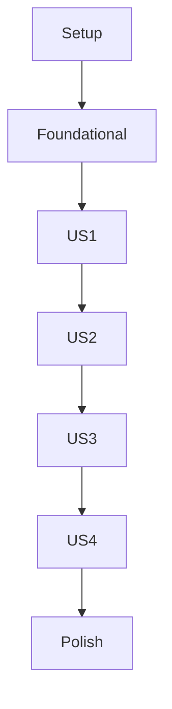

# Tasks: Architecture Refactoring & Triton Transition

**Input**: Design documents from `/specs/005-architecture-refactoring/`
**Prerequisites**: `plan.md` (required), `spec.md` (required), `research.md`, `data-model.md`, `contracts/`, `quickstart.md`

## Related Documents

- [spec.md](spec.md)
- [plan.md](plan.md)
- [research.md](research.md)
- [data-model.md](data-model.md)
- [quickstart.md](quickstart.md)

## Task Execution Flow

The task phases are intentionally ordered to match the dependency chain. Setup unblocks the foundation, the foundation unlocks the four user stories, and the polish phase completes validation, load testing, and documentation checks.

**Tests**: Tests are MANDATORY. Unit, integration, and system tests must be written before implementation in each user story phase.

**Organization**: Tasks are grouped by user story to enable independent implementation and testing.

## Phase 1: Setup (Shared Infrastructure)

**Purpose**: Initialize repository scaffolding for Triton transition, CI bootstrap, and observability.

- [X] T001 Create Triton integration module skeleton in `backend/apps/pipeline/services/` and `backend/apps/pipeline/schemas/`
- [X] T002 Add Triton and observability environment variables template in `backend/.env.example`
- [X] T003 [P] Add Python dependencies for Triton client and observability in `backend/requirements.in`
- [X] T004 [P] Add CI policy scaffold for staged gating in `docs/backend/testing/ci-policy.md`
- [X] T005 [P] Add production native Triton service scaffold in `infra/systemd/triton-server.service`

---

## Phase 2: Foundational (Blocking Prerequisites)

**Purpose**: Core shared building blocks required before any user story implementation.

**CRITICAL**: No user story work starts before this phase is complete.

- [X] T006 Create shared request/response schemas for inference contracts in `backend/apps/pipeline/schemas/triton.py`
- [X] T007 Implement route and dataset policy settings models in `backend/core/settings_models.py`
- [X] T008 [P] Create inference client abstraction interface in `backend/apps/pipeline/services/base_inference_client.py`
- [X] T009 Implement Triton client adapter with timeout/error normalization in `backend/apps/pipeline/services/triton_client.py`
- [X] T010 [P] Implement model-serving health service in `backend/apps/health/services/model_serving_health.py`
- [X] T011 [P] Implement metrics/tracing bootstrap module in `backend/core/observability.py`
- [X] T012 Wire foundational config and observability initialization in `backend/config/settings/base.py`
- [X] T013 Add development Triton docker service configuration in `docker-compose.dev.yml`

**Checkpoint**: Foundation complete; user stories can now proceed.

---

## Phase 3: User Story 1 - Transition Model Inference to Triton Server (Priority: P1) 🎯 MVP

**Goal**: Route backend inference to Triton with version-aware model selection and graceful fallback.

**Independent Test**: Run Triton-backed frame analysis in dev and verify matching outputs plus graceful error handling when Triton is unavailable.

### Tests for User Story 1 (MANDATORY)

- [X] T014 [P] [US1] Add contract tests for Triton request/response schema in `backend/tests/contract/test_triton_inference_contract.py`
- [X] T015 [P] [US1] Add integration tests for model route resolution by environment in `backend/tests/integration/test_model_route_resolution.py`
- [X] T016 [P] [US1] Add integration tests for Triton outage fallback behavior in `backend/tests/integration/test_triton_unavailable_handling.py`
- [X] T017 [P] [US1] Add system test for end-to-end frame inference through Triton in `backend/tests/system/test_e2e_triton_frame_inference.py`

### Implementation for User Story 1

- [X] T018 [US1] Implement inference orchestrator that resolves model route config in `backend/apps/video_analysis/services/inference_orchestrator.py`
- [X] T019 [US1] Integrate orchestrator into async analysis task flow in `backend/apps/video_analysis/tasks.py`
- [X] T020 [US1] Implement model route service with semantic name/version mapping in `backend/apps/pipeline/services/model_route_service.py`
- [X] T021 [US1] Add Triton-backed service health API endpoint in `backend/apps/health/views.py`
- [X] T022 [US1] Add environment-specific Triton endpoint/version config in `backend/config/settings/production.py`
- [X] T023 [US1] Add Triton outage and latency runbook documentation in `docs/backend/architecture/triton-operations.md`

**Checkpoint**: User Story 1 is independently functional and testable (MVP).

---

## Phase 4: User Story 2 - Establish Comprehensive Test Suite with Real Data (Priority: P1)

**Goal**: Deliver complete unit/integration/system coverage with real models and raw data in dev/test only, plus phased CI gates.

**Independent Test**: Execute all three test levels with real-data scenarios in dev/test and verify CI gate behavior by stage.

### Tests for User Story 2 (MANDATORY)

- [X] T024 [P] [US2] Add unit tests for schema validation and timeout bounds in `backend/tests/unit/pipeline/test_triton_client_validation.py`
- [X] T025 [P] [US2] Add integration tests for upload-to-analysis workflow in `backend/tests/integration/test_video_analysis_workflow.py`
- [X] T026 [P] [US2] Add system tests covering behavior-category dataset runs in `backend/tests/system/test_behavior_categories_real_data.py`
- [X] T027 [P] [US2] Add policy tests preventing raw dataset usage in prod context in `backend/tests/integration/test_dataset_policy_enforcement.py`

### Implementation for User Story 2

- [X] T028 [US2] Implement shared dataset policy guard fixture in `backend/tests/conftest.py`
- [X] T029 [US2] Implement dataset environment guard utility in `backend/tests/utils/dataset_policy_guard.py`
- [X] T030 [US2] Implement CI Stage 1 informational unit/integration workflow in `.github/workflows/ci-bootstrap.yml`
- [X] T031 [US2] Implement CI Stage 2 blocking gate workflow with coverage threshold in `.github/workflows/ci-blocking.yml`
- [X] T032 [US2] Implement CI Stage 3 staging system-test workflow in `.github/workflows/ci-staging-system.yml`
- [X] T033 [US2] Implement release gate evidence verifier script in `scripts/ci/verify_release_gate.py`
- [X] T034 [US2] Document real-data testing policy and evidence requirements in `docs/backend/testing/real-data-test-policy.md`

**Checkpoint**: User Story 2 is independently functional and testable.

---

## Phase 5: User Story 3 - Implement Modular Backend Architecture (Priority: P2)

**Goal**: Refactor backend into explicit, loosely coupled modules with injected dependencies and graceful degradation.

**Independent Test**: Swap inference client implementations and validate modules continue to operate with minimal coupling.

### Tests for User Story 3 (MANDATORY)

- [X] T035 [P] [US3] Add unit tests for dependency injection boundaries in `backend/tests/unit/pipeline/test_dependency_injection_boundaries.py`
- [X] T036 [P] [US3] Add integration tests for inference client swap compatibility in `backend/tests/integration/test_inference_client_swap.py`
- [X] T037 [P] [US3] Add integration tests for graceful degradation on optional component failure in `backend/tests/integration/test_graceful_degradation.py`

### Implementation for User Story 3

- [X] T038 [US3] Implement inference client factory for pluggable adapters in `backend/apps/pipeline/services/inference_client_factory.py`
- [X] T039 [US3] Refactor detection service to use injected inference client in `backend/apps/detections/services/detection_service.py`
- [X] T040 [US3] Refactor tracking service boundaries with explicit DTO usage in `backend/apps/tracking/services/tracking_service.py`
- [X] T041 [US3] Implement centralized module configuration loader in `backend/core/configuration.py`
- [X] T042 [US3] Implement graceful degradation orchestration logic in `backend/apps/pipeline/services/degradation_service.py`

**Checkpoint**: User Story 3 is independently functional and testable.

---

## Phase 6: User Story 4 - Create/Enhance System Diagrams and Architecture Documentation (Priority: P2)

**Goal**: Produce detailed, current architecture/deployment/data-flow documentation aligned with implementation.

**Independent Test**: Validate docs for completeness, cross-link integrity, and alignment with runtime endpoints and workflows.

### Tests for User Story 4 (MANDATORY)

- [X] T043 [P] [US4] Add docs consistency tests for links and Mermaid blocks in `backend/tests/unit/docs/test_docs_link_and_mermaid_validation.py`
- [X] T044 [P] [US4] Add integration tests for docs-to-endpoint contract alignment in `backend/tests/integration/test_docs_contract_alignment.py`

### Implementation for User Story 4

- [X] T045 [US4] Update system component architecture diagrams in `docs/ARCHITECTURE.md`
- [X] T046 [US4] Add end-to-end data-flow diagrams for inference and test gates in `docs/backend/architecture/data-flow.md`
- [X] T047 [US4] Add deployment topology documentation for dev Docker and prod native Triton in `docs/backend/architecture/deployment-topology.md`
- [X] T048 [US4] Add observability dashboards and incident runbook documentation in `docs/backend/architecture/observability-runbook.md`
- [X] T049 [US4] Update documentation index and cross-links in `docs/INDEX.md`

**Checkpoint**: User Story 4 is independently functional and testable.

---

## Phase 7: Polish & Cross-Cutting Concerns

**Purpose**: Final validation, hardening, and project-wide consistency.

- [X] T050 [P] Harden production network configuration for internal-only Triton access in `backend/config/settings/production.py`
- [X] T051 [P] Tune latency/error alert thresholds for inference observability in `backend/apps/video_analysis/services/inference_orchestrator.py`
- [X] T052 [P] Add load-test harness for 10,000+ concurrent inference validation in `backend/tests/system/test_triton_load_capacity.py`
- [X] T053 [P] Record onboarding baseline and post-change measurement workflow in `docs/backend/testing/onboarding-baseline.md`
- [X] T054 [P] Add release-cycle regression tracking template in `docs/backend/testing/release-quality-tracker.md`
- [X] T055 Validate quickstart commands and update verified run instructions in `specs/005-architecture-refactoring/quickstart.md`
- [X] T056 Execute full test matrix and record baseline outcomes in `COVERAGE_REPORT.md`

---

## Dependencies & Execution Order

### Phase Dependencies

- Phase 1 (Setup): starts immediately.
- Phase 2 (Foundational): depends on Phase 1 completion; blocks all stories.
- Phase 3-6 (User Stories): depend on Phase 2 completion.
- Phase 7 (Polish): depends on completion of intended user stories.

### User Story Dependencies

- US1 (P1): starts immediately after foundational phase; no dependency on other stories.
- US2 (P1): starts after foundational phase; uses US1 interfaces for full end-to-end validation but can build most tests/CI independently.
- US3 (P2): starts after foundational phase; integrates with US1 inference interfaces.
- US4 (P2): starts after foundational phase; final doc alignment depends on concrete behavior from US1-US3.

### Within Each User Story

- Tests before implementation.
- Contract/integration/system tests first (RED), then implementation (GREEN), then refactor.
- Story is complete only when independent test criteria pass.

---

## Parallel Opportunities

- Setup tasks marked [P]: T003, T004, T005.
- Foundational tasks marked [P]: T008, T010, T011.
- US1 parallel tests: T014-T017.
- US2 parallel tests: T024-T027.
- US3 parallel tests: T035-T037.
- US4 parallel tests: T043-T044.
- Polish parallel tasks: T050-T054.

### Parallel Example: User Story 1

- Run together: T014, T015, T016, T017.
- Run together after tests: T020 and T021.

### Parallel Example: User Story 2

- Run together: T024, T025, T026, T027.
- Run together: T030, T031, T032.

### Parallel Example: User Story 3

- Run together: T035, T036, T037.
- Run together: T039 and T040.

### Parallel Example: User Story 4

- Run together: T043 and T044.
- Run together: T046 and T048.

### Parallel Example: Phase 7

- Run together: T050, T051, T052, T053, T054.

---

## Implementation Strategy

### MVP First (US1)

1. Complete Phase 1 + Phase 2.
2. Complete Phase 3 (US1).
3. Validate US1 independently in dev environment with Triton Docker.

### Incremental Delivery

1. Deliver US1 (Triton migration core).
2. Deliver US2 (full test coverage and CI stages).
3. Deliver US3 (modular refactor).
4. Deliver US4 (diagrams/docs alignment).
5. Execute cross-cutting polish.

### Team Parallelization

1. Team jointly completes Setup + Foundational.
2. Then parallel tracks:
   - Engineer A: US1
   - Engineer B: US2
   - Engineer C: US3
   - Engineer D: US4
