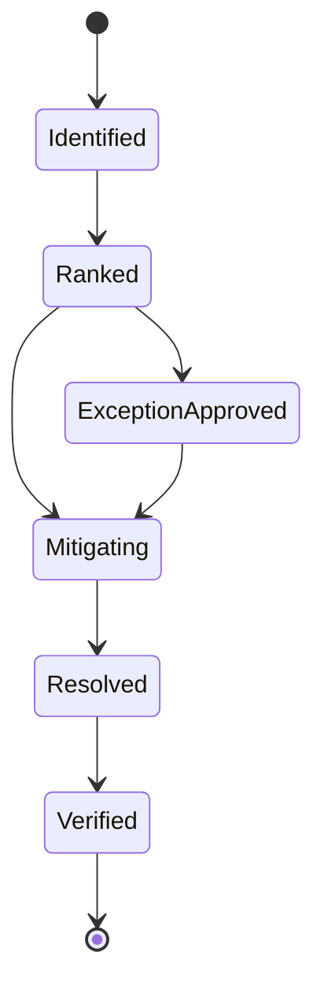

# Contract: Coupling Risk

## Related Documents

- [../spec.md](../spec.md)
- [../plan.md](../plan.md)
- [../data-model.md](../data-model.md)
- [module-boundary-contract.md](module-boundary-contract.md)
- [regression-evidence-contract.md](regression-evidence-contract.md)

## Risk Lifecycle

The state diagram shows that every coupling risk must be ranked before work begins. High-risk items move through mitigation to resolution. Medium/low-risk items may receive an approved exception, but still need a removal path.

## Required Risk Record

- `risk_id`
- `source_boundary`
- `target_boundary`
- `risk_type`
- `severity`
- `impact`
- `mitigation`
- `owner`
- `verification`
- `status`

## Severity Rules

- **High**: Can break full baseline workflows, hide data corruption, bypass security/privacy boundaries, block live/offline inference validation, or prevent production native Linux operation. Must be removed in this feature.
- **Medium**: Can slow future changes or create localized regression risk. May receive time-boxed exception with owner, expiry, removal plan, and regression coverage.
- **Low**: Creates documentation or maintainability friction without runtime risk. May receive time-boxed exception with owner and removal plan.

## Acceptance Rules

- No high-risk coupling may remain in `exception_approved` state.
- Every medium/low exception must have owner, expiry, removal plan, regression coverage, and reviewer approval.
- Risk records must be reflected in diagrams when they affect cross-module interaction.
