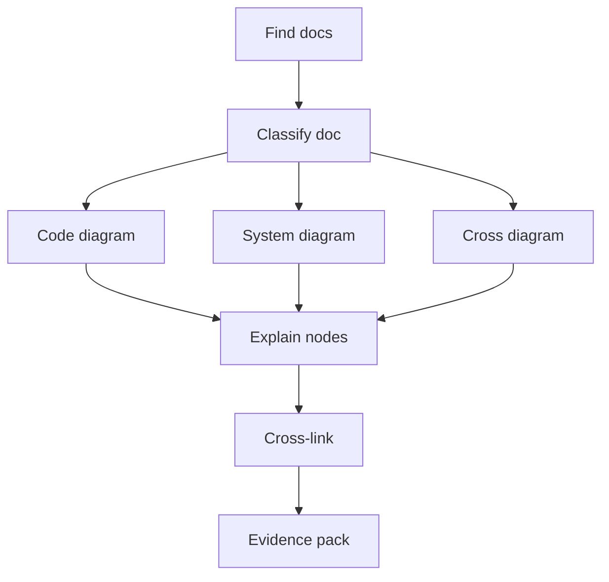

# Contract: Documentation Diagram Coverage

## Related Documents

- [../spec.md](../spec.md)
- [../plan.md](../plan.md)
- [../data-model.md](../data-model.md)
- [module-boundary-contract.md](module-boundary-contract.md)
- [regression-evidence-contract.md](regression-evidence-contract.md)

## Diagram Coverage Flow

This flowchart describes the documentation audit. Each existing and incoming document is classified, assigned required diagram types, explained, cross-linked, and then included in the evidence pack.

## Required Coverage

Each affected existing or incoming Markdown document must be classified as:

- `source-doc`
- `module-readme`
- `system-doc`
- `feature-doc`

Minimum diagram requirements:

- **Code structure diagram**: Required for source docs and module READMEs. Shows ownership, public interfaces, internal responsibilities, and dependency direction.
- **System interaction diagram**: Required for system docs, runtime docs, deployment docs, and feature docs. Shows frontend-backend, backend-inference, background jobs, storage, health, and deployment paths as applicable.
- **Cross interaction diagram**: Required when a document describes more than one module or runtime path. Shows module-to-module calls, shared contracts, live/offline overlap, failure propagation, and fallback behavior.
- **State diagram**: Required when the document describes sessions, jobs, exports, anomalies, health, recordings, or other stateful workflows.
- **ER/class diagram**: Required when the document describes data ownership, schemas, or contracts.

## Explanation Rules

Every diagram must include:

- Intro paragraph explaining what the reader should learn.
- Detailed explanation of every node or actor.
- Detailed explanation of every edge or interaction.
- Mapping to real modules, files, or runtime responsibilities.
- Related document links.

## Acceptance Rules

- Missing diagrams are blocking for docs touched by this feature.
- Existing docs with missing code, system, or cross-interaction diagrams must be tracked in a coverage record.
- Diagram labels must be concise and renderable in standard Markdown Mermaid renderers.
