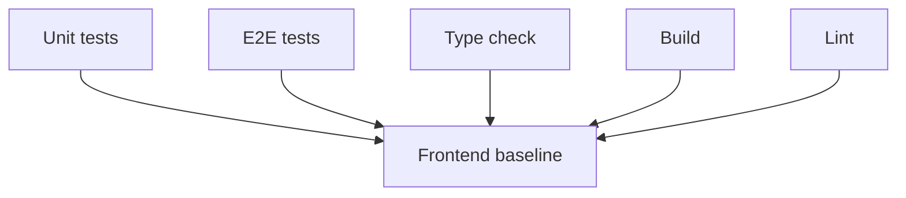

# Frontend Before Baseline

## Related Documents

- [evidence pack](../evidence-pack.md)
- [tasks](../../tasks.md)
- [quickstart](../../quickstart.md)
- [regression evidence contract](../../contracts/regression-evidence-contract.md)

## Command Flow

This diagram shows the frontend before-baseline commands. Unit tests, e2e tests, type-check, and build pass. Lint reaches source analysis and fails on existing source issues, which are recorded as pre-refactor baseline findings.

## Results

| Command | Exit | Result |
| --- | ---: | --- |
| `npm test -- --run` | 0 | PASS: 24 files, 194 tests |
| `npm run type-check` | 0 | PASS |
| `npm run build` | 0 | PASS |
| `npm run test:e2e` | 0 | PASS: 5 Chromium tests |
| `npm run lint` | 1 | FAIL: existing lint findings |

## Lint Findings

`npm run lint` reports 13 findings: 7 errors and 6 warnings.

Error locations:

- `frontend/src/components/PreviewPlayer.tsx`: unused `e` variables and empty blocks.
- `frontend/src/components/VideoPlayer/VideoPlayer.tsx`: unused `e` variable.

Warnings include explicit `any` and React hook dependency warnings in preview, video player, prediction display, and video analysis page code.

## E2E Notes

Playwright passed all 5 tests. Vite emitted transient WebSocket proxy `ECONNABORTED` messages after successful test completion; these did not fail the e2e command.
