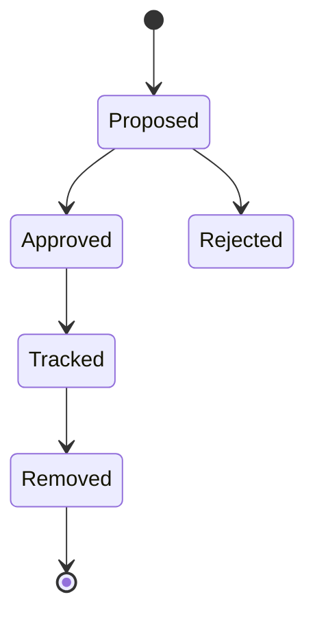

# Coverage Exception Register

## Related Documents

- [evidence pack](evidence-pack.md)
- [implementation plan](../plan.md)
- [regression evidence contract](../contracts/regression-evidence-contract.md)
- [coupling risk contract](../contracts/coupling-risk-contract.md)

## Exception Flow

This state diagram defines the lifecycle for any 100% line or branch coverage exception. Exceptions start as proposed records, require approval before they can be tracked, and must eventually be removed through the documented removal plan.

## Policy

Affected modules must maintain 100% line and branch coverage. Every exception must also update `specs/006-modular-low-coupling/plan.md` Complexity Tracking with owner, expiry, removal plan, and rationale before completion.

## Register

| Exception ID | Scope | Owner | Expiry | Removal Plan | Regression Coverage | Plan Linked | Status |
| --- | --- | --- | --- | --- | --- | --- | --- |
| None yet | N/A | N/A | N/A | N/A | N/A | N/A | Open register |

## Baseline Observation

The initial backend baseline run reports 26% total line coverage after collection failure. This is not approved as an exception. It is a pre-refactor baseline finding that must be resolved or explicitly represented by approved exception records before final completion.
