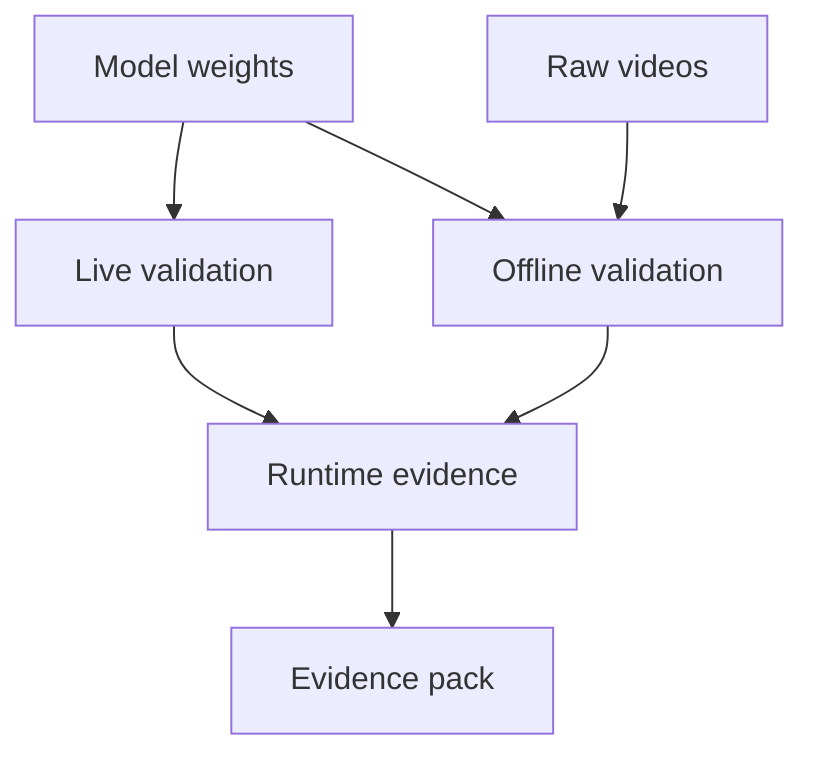

# Real Data Asset Inventory

## Related Documents

- [evidence pack](evidence-pack.md)
- [runtime scenario contract](../contracts/runtime-scenario-contract.md)
- [regression evidence contract](../contracts/regression-evidence-contract.md)
- [Ultralytics reference](ultralytics-reference.md)

## Asset Flow

This diagram shows the real-data validation inputs. Model weights support both live and offline validation. Raw videos support offline and replay-style validation. Runtime evidence links both paths back into the evidence pack.

## Model Asset Summary

| Extension | Count | Total MB |
| --- | ---: | ---: |
| `.bin` | 5 | 239.48 |
| `.engine` | 5 | 280.96 |
| `.onnx` | 10 | 987.18 |
| `.plan` | 5 | 280.96 |
| `.pt` | 5 | 243.23 |
| `.xml` | 5 | 6.05 |
| `.zip` | 5 | 882.20 |

## Representative Model Weights

- `backend/models/student_teacher/weights/student_teacher.pt`
- `backend/models/student_teacher/weights/student_teacher.onnx`
- `backend/models/student_teacher/weights/student_teacher.engine`
- `backend/models/right_left/weights/right_left.pt`
- `backend/models/right_left/weights/right_left.onnx`
- `backend/models/up_down/weights/up_down.pt`
- `backend/models/standing_sitting/weights/standing_sitting.pt`
- `backend/models/forward_backward/weights/forward_backward.pt`
- `backend/models/triton_repository/person_detector/1/model.onnx`
- `backend/models/triton_repository/person_detector/1/model.plan`

## Representative Raw/Processed Video Assets

- `backend/data/videos/0f5ccb61-cc40-4d27-b5f2-3a1d796935e7/input.mp4`
- `backend/data/videos/0f5ccb61-cc40-4d27-b5f2-3a1d796935e7/predict_results/input.avi`
- `backend/data/videos/0f5ccb61-cc40-4d27-b5f2-3a1d796935e7/ultralytics_annotated_openvino/input.avi`
- `backend/data/videos/1102818c-8239-4e3f-bbaf-ad2ea64c0999/input.mp4`
- `backend/data/videos/1c1a6270-f897-427f-a32c-3526e26890f6/input.mp4`
- `backend/data/videos/12733021-966c-4fd8-b83a-4b9f5515f8f2/ultralytics_annotated/Arguing_006.avi`

## Validation Notes

The repository has local real model artifacts and raw video assets available for development/test validation. Final live-stream validation still needs an explicit live/raw media run recorded in the final evidence directory.
